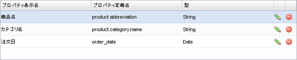
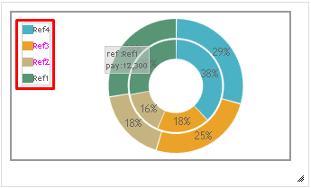

[[dashboard]]
== ダッシュボードの管理
定型集計を複数選択し、ひとつの画面上にまとめて表示します。
複数の定型集計を跨いだフィルターを設定することもできます

簡易BIの集計結果もダッシュボード上に配置できます。
ただし、簡易BIを配置した場合は、グラフの切り替えや項目の指定等はできません。

[[create_dashboard]]
=== ダッシュボードの作成
Dashboardアイコンを右クリックして `ダッシュボードを作成する` を選択してください。

[[dashboar_dsetting]]
=== 設定
画面中央部の配置エリアに画面右側にある集計定義をドラッグ&ドロップで配置していきます。
中心となる集計定義を設定することで、その定義で設定されたフィルタ項目を他の集計と連動させることができます。

[cols="1,4a", options="header"]
|===
|設定項目
|設定値

|中心となる集計定義
|Aggregationを画面左のスペースにドラッグ&ドロップすることで有効になります。
詳細は<<db_main,中心となる集計>>を参照してください。

|保存リストを使用する
|未選択の場合、フィルター条件の「保存リストから」を選択不可になります。

|Add Separator
|クリックするとセパレートセクションを追加します。
セクション内に複数のAggregationを横に並べて表示する事が可能です。
セクションの設定を開くとウィンドウが表示され、列数が設定できます。

|Add Template
|クリックするとテンプレートセクションを追加します。
セクションの設定を開くとウィンドウが表示され、テンプレートが選択できます。

|Add Action
|クリックするとアクションセクションを追加します。
セクションの設定を開くとウィンドウが表示され、アクションが選択できます。

|Dashboardに設定したAggregation
|Aggregationの鉛筆マークをクリックするとDashboardへの設定を行うウィンドウが表示されます。
詳細は<<db_aggregationsetting, 各Aggregationへの設定>>を参照してください。

|Edit default filter condition script
|フィルターの初期条件を設定するスクリプトを記述できます。
設定内容については<<viewaggregation, 集計機能のパラメータ>>を参照してください。
|===

[[db_main]]
.中心となる集計定義
Aggregationを画面左のスペースにドラッグ&ドロップすることで有効になります。
Dashboard内に配置されたAggregationが選択可能となります。
Aggregationを選択すると、そのAggregationのフィルター設定とPropertiesが表示され、ダッシュボードに対するフィルター設定が可能になります。

プロパティをフィルター設定の表にドラッグ&ドロップする事でフィルター設定が可能です。
ドラッグ&ドロップすると下図のようになります。
鉛筆マークをクリックする事で編集ウィンドウが表示されます。

[cols="1,4a", options="header"]
|===
|項目
|設定値

|プロパティ定義名
|集計で利用しているEntityのプロパティ定義名です。
変更不可能です。

|プロパティ表示名
|Dashboardのフィルタ表示時のプロパティ名となります。

|表示タイプ
|表示タイプを選択します。
プルダウン選択時は下部にある `追加` ボタンをクリックし、選択値を設定する必要があります。
プルダウンはプロパティの型によって設定できる項目が変化します。
|===

[[db_aggregationsetting]]
.各Aggregationへの設定
Aggregationの鉛筆マークをクリックすると、Dashboardで表示する際の設定を行うウィンドウが表示されます。
初期時状態では何も設定されていません。

フィルタが設定されている場合、下部の一覧にフィルタ項目が `name` と `プロパティ表示名` として表示されます。
右側の `Properties` からプロパティを一覧にドラッグ&ドロップすることで、ダッシュボードのフィルタ項目と集計のプロパティを紐付けることができ、横断的なフィルタの作成が可能となります。

Edit additional filter condition scriptには、そのAggregationだけに適用するフィルタ条件を記述できます。
設定内容については<<viewaggregation, 集計機能のパラメータ>>を参照してください。
また、集計の初期条件を使用するをチェックした場合、上記スクリプトを使用せずにAggregationの定義に設定されたスクリプトを使用します。

.ドリルダウン機能
Dashboard上で `中心となる集計定義` に指定した集計のグラフをクリックすると、その内容に連動して他の集計の結果を絞り込むことが出来ます。
フィルタ条件に加えて、クリックした箇所(軸の項目名、凡例、グラフのデータ自体等)を条件として他の集計の再読み込みを行います。

.項目選択前

.項目選択後

中心となる集計定義(以下集計A)の項目からドリルダウンしたい集計定義（以下集計B)の項目を絞り込むため、 集計Aと集計Bの項目のマッピングが必要になります。
(集計対象が異なる可能性があるため)
また、この絞り込みは通常のフィルタ条件に追加の条件を加える形のため、予めフィルタ条件の対象となっている項目のみ利用可能です。

上記の実行例では集計AのX軸(商品)を絞り込みの対象とし、それに対応する集計Bの商品を絞り込んでいます。
仮に集計Aの商品に対応する項目がマッピングされていない場合、集計Bは再読み込みされません。

ドリルダウンの対象にする場合、集計の設定画面で `ドリルダウンするか` をチェックし、 `中心となる集計定義` のフィルタ条件に対応するプロパティを指定します。
なお、`中心となる集計定義` に指定されている集計はドリルダウンの対象にはなりません。

また、グラフの種類によって絞り込みが可能な個所は変わります。

.単純集計
[cols="1,2a,7a", options="header"]
|===
|グラフの種類
|絞り込み対象
|再読み込み時に追加される条件

.2+|線グラフ
|Ｘ軸
|線グラフの種類がカテゴリ::
選択した項目の値

線グラフの種類が数値::
選択した項目の値

|データ
|線グラフの種類がカテゴリ::
選択したデータに対応する集計表の行の内、グループ化対象となっている列の値

線グラフの種類が数値::
選択したデータに対応する集計表の行の内、グループ化対象となっている列の値。
積上げグラフの場合は、面の領域を構成する各頂点を対象にする。
なお、集計した値が0の場合は対象外となる

.2+|棒グラフ
|Ｘ軸
|選択した項目の値

|データ
|選択したデータに対応する集計表の行の内、グループ化対象となっている列の値

.2+|円グラフ
|凡例
|選択した項目の値

|データ
|選択したデータに対応する集計表の行の内、グループ化対象となっている列の値

.2+|ドーナツグラフ
|凡例
|選択した項目の値

|データ
|選択したデータに対応する集計表の行の内、グループ化対象となっている列の値

.2+|バブルチャート
|凡例
|選択した項目の値

ただしバブルチャートは凡例選択によりデータを非表示に出来るため、非表示状態ではドリルダウンの対象にしない。
再度凡例をクリックすると該当データが表示され、このタイミングで合わせてドリルダウンの対象となる。

|データ
|選択したデータに対応する集計表の行の内、グループ化対象となっている列の値

.2+|散布図
|凡例
|選択した項目の値

ただし散布図は凡例選択によりデータを非表示に出来るため、非表示状態ではドリルダウンの対象にしない。
再度凡例をクリックすると該当データが表示され、このタイミングで合わせてドリルダウンの対象となる。

|データ
|選択したデータに対応する集計表の行の内、グループ化対象となっている列の値

.3+|ピラミッドチャート
|対比項目
|選択した項目の値

|軸
|選択した項目の値

|データ
|選択したデータに対応する集計表の行の内、グループ化対象となっている列の値

|レーダーチャート
|-
|ドリルダウン機能の対象外
|===

.クロス集計
[cols="1,2a,7a", options="header"]
|===
|グラフの種類
|絞り込み対象
|再読み込み時に追加される条件

.2+|線グラフ
|Ｘ軸
|選択した項目の値

表頭または表側に数量データを指定した場合は、カテゴリに指定した数式を利用する。
|データ
|選択したデータに対応するクロス集計表のセルの表頭及び表側の値

表頭または表側に数量データを指定した場合は、カテゴリに指定した数式を利用する。

積上げグラフの場合は、面の領域を構成する各頂点を対象にするが、集計した値が0の場合は対象外となる

.2+|棒グラフ
|Ｘ軸
|選択した項目の値

表頭または表側に数量データを指定した場合は、カテゴリに指定した数式を利用する。

|データ
|選択したデータに対応するクロス集計表のセルの表頭及び表側の値

表頭または表側に数量データを指定した場合は、カテゴリに指定した数式を利用する。

.2+|円グラフ
|凡例
|選択した項目の値

表頭または表側に数量データを指定した場合は、カテゴリに指定した数式を利用する。

|データ
|選択したデータに対応するクロス集計表のセルの表頭及び表側の値

表頭または表側に数量データを指定した場合は、カテゴリに指定した数式を利用する。
|===

.キューブ集計
[cols="1,2a,7a", options="header"]
|===
|グラフの種類
|絞り込み対象
|再読み込み時に追加される条件

.2+|線グラフ
|Ｘ軸
|線グラフの種類がカテゴリ::
選択した項目の値

線グラフの種類が数値::
選択した項目の値

|データ
|選択したデータに対応する集計表の行の内、X軸、系列1、系列2の値(未指定のものは除く)

積上げグラフの場合は、面の領域を構成する各頂点を対象にするが、集計した値が0の場合は対象外となる

.2+|棒グラフ
|Ｘ軸
|選択した項目の値

|データ
|選択したデータに対応する集計表の行の内、X軸、系列1、系列2の値(未指定のものは除く)

.2+|円グラフ
|凡例
|選択した項目の値

|データ
|選択したデータに対応する集計表の行の内、X軸、系列1の値(未指定のものは除く)
.2+|ドーナツグラフ
|凡例
|選択した項目の値

|データ
|選択したデータに対応する集計表の行の内、X軸、系列1、系列2の値(未指定のものは除く)

.2+|バブルチャート
|凡例
|選択した項目の値

ただしバブルチャートは凡例選択によりデータを非表示に出来るため、非表示状態ではドリルダウンの対象にしない。
再度凡例をクリックすると該当データが表示され、このタイミングで合わせてドリルダウンの対象となる。

|データ
|選択したデータに対応する集計表の行の内、ラベル列、系列1の値(未指定のものは除く)

.2+|散布図
|凡例
|選択した項目の値

ただし散布図は凡例選択によりデータを非表示に出来るため、非表示状態ではドリルダウンの対象にしない。
再度凡例をクリックすると該当データが表示され、このタイミングで合わせてドリルダウンの対象となる。

|データ
|選択したデータに対応する集計表の行の内、ラベル列、系列1の値(未指定のものは除く)

.3+|ピラミッドチャート
|対比項目
|選択した項目の値

|軸
|選択した項目の値

|データ
|選択したデータに対応する集計表の行の内、集計軸、対比項目、系列1の値(未指定のものは除く)

|レーダーチャート
|-
|ドリルダウン機能の対象外
|===

[[viewdashboard]]
=== 表示方法
==== メニューへの登録
<<viewaggregation, 集計>>と同様の方法で表示を行います。
ActionMenuItemには雛型として `gem/template/aggregation/ViewDashBoardAction` というメニューアイテムがあります。
このActionMenuItemをコピーしてメニューアイテムを編集してください。
なお、利用可能なパラメータも集計と同様です。

[[viewdashboardparts]]
==== Top画面での表示
TopView定義にDashboardパーツを配置することでTop画面に表示することができます。

[cols="1,2a", options="header"]
|===
|設定項目
|設定内容

|Icon Tag
|Font Awesomeによるアイコンタグを設定します。

|Class
|スタイルシートのクラス名を指定します。複数指定する場合は半角スペースで区切って下さい。

|Max Height
|コンテンツ部分の最大高さを指定します。
指定した高さを超える場合はスクロールバーが表示されます。未指定の場合は高さ制限はありません。

|show Link for Dashboard
|本項目にチェックを入れると、詳細へのリンクが表示されます。

|override Dashboard setting
|本項目にチェックを入れると、以下の項目についてDashboardでの設定を上書きし、Top画面に表示する事が可能です。
Dashboard定義の設定が更新されるわけではありません。

|show Grid
|集計表の表示、非表示を設定します。
|===
