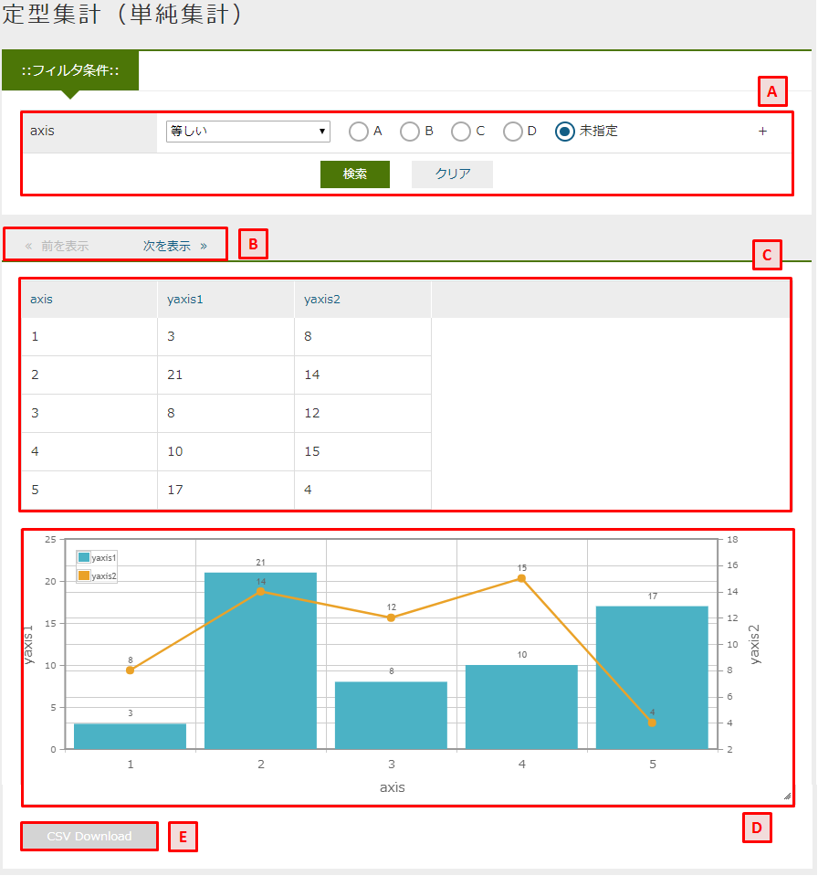
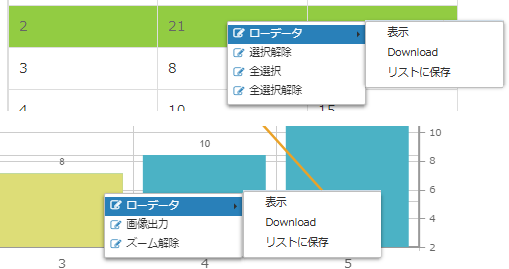
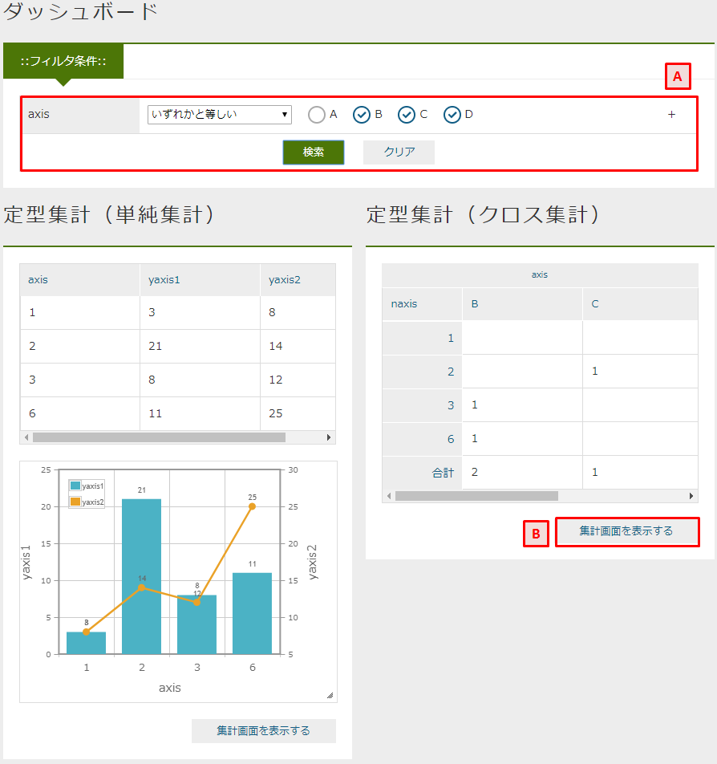

[[operationguide]]
== 操作説明

=== 単純集計/クロス集計
エンティティのデータを集計し、集計データやグラフとして表示する画面です。

.A.フィルタ条件
`検索` をクリックすると、フィルタ条件を元にデータの集計を行います。
右側の `+` をクリックすると、フィルタ条件を追加できます。
`クリア` をクリックすると、画面表示時のフィルタ条件に戻ります。

.B.ページング
集計データが集計結果の表示上限を超える場合に表示されます。
クリックすると前後のデータを表示します。
単純集計の場合のみ表示します。

.C.集計結果
エンティティの集計データを表示します。

.D.グラフ
集計データを元にグラフを表示します。
折れ線グラフ、棒グラフ、円グラフ、ドーナツグラフ、バブルチャート、散布図、ピラミッド、レーダーチャートがあります。

.E.Download
集計結果に表示されている内容をファイルとしてダウンロードします。

.右クリックメニュー
集計結果やグラフのデータ部分を選択し、右クリックするとメニューが表示されます。

.ローデータ
集計データの元となったローデータに関する操作です。

* 表示 +
選択した集計データの元となったローデータを画面に表示します。

* Download +
選択した集計データの元となったローデータをファイルとしてダウンロードします。

* リストに保存 +
集計時の情報（フィルタ条件や選択行、選択セル）を保存します。
保存した結果は保存リストから参照、復元できます。

.選択解除
集計結果の選択行を未選択状態にします。

.全選択
集計結果の全行を選択状態にします。

.全選択解除
集計結果の全行を未選択状態にします。

.画像出力
グラフをpng画像としてダウンロードします。

.ズーム解除
クリックや範囲選択で拡大したグラフを元に戻します。

=== ダッシュボード
複数の集計をまとめて表示できます。
また、グラフを横断してフィルタ条件を指定したり、特定の項目で絞り込むドリルダウンが行えます。

.A.フィルタ条件
`検索` をクリックすると、フィルタ条件を元にデータの集計を行います。
右側の `+` をクリックすると、フィルタ条件を追加できます。
`クリア` をクリックすると、画面表示時のフィルタ条件に戻ります。

.B.集計画面を表示する
元となった集計画面を表示します。

