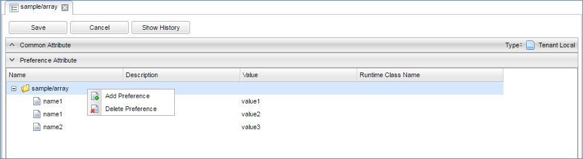

[[Preference]]
== Preference
Preferenceはテナント単位で設定を保存する機能です。
Name-Valueのペアで値を保持します。

service-configとカスタムServiceを利用した設定の管理と比較すると、（他のテナントを含めた）Webアプリケーション全体に反映されるservice-configに対して、テナント内部の設定値として管理するため、設定変更による影響範囲は小さくなります。
また、Preferenceは稼働中のWebアプリケーション上で設定を行うためすぐに反映されますが、反映にアプリケーションサーバの再起動が必要になる点がservice-configと異なります。

どちらの機能を利用するかは、開発するアプリケーションの特性に合わせて使い分けてください。

=== Preference定義

==== Preference定義の作成
Preferenceアイコンを右クリックして「Preferenceを作成する」を選択してください。

==== Preferenceの設定項目

===== 固有設定
Preferenceを作成すると、Preference Attribute内に同名のルートノードが作成されます。
ノードをクリックすると編集可能な状態になり、Value等を設定できるようになります。

.子ノードの追加
ノードには子ノードを追加することができます。
追加したいノードに対して右クリックし、「Add Preference」をクリックすることで子ノードが追加（複数可）されます。
子ノードの追加はルートノード以外でも可能で、階層構造を使って設定を管理することができます。
なお、子ノードを持つノードはアイコンがフォルダに変更されます。

.Runtimeクラスの利用
Preferenceに対応するPOJO、もしくはPreferenceAwareの実装クラスを作成し、ノードの「Runtime Class Name」に指定することで、任意のオブジェクトで設定値の管理ができるようになります。

=== 利用方法
PreferenceはPreferenceManagerを利用して取得します。

[source,java]
----
import org.iplass.mtp.prefs.PreferenceManager;
import org.iplass.mtp.prefs.Preference;

PreferenceManager manager = ManagerLocator.manager(PreferenceManager.class);
Preference pref = manager.get("sample/pref"); <1>
String value = pref.getValue(); <2>
----
<1> PreferenceManagerのgetメソッドを利用してPreferenceを取得。
<2> ノードのValueはPreferenceオブジェクトのgetValue()で取得可能

.PreferenceSet
フォルダのアイコンになっている、子ノードを持つノードはPreferenceのサブクラスのPreferenceSetとなります。
PreferenceSetは子ノードをSubSetとして保持しています。

[source,java]
----
PreferenceManager manager = ManagerLocator.manager(PreferenceManager.class);
PreferenceSet prefSet = (PreferenceSet) manager.get("sample/array");
String value = prefSet.getValue(); <1>
for (Preference sub : prefSet.getSubSet()) { <2>
    String subValue = sub.getValue();
}
prefSet.getSubSet("name1")[0].getValue();<3>
----
<1> PreferenceSet自体にも値は保持可能
<2> getSubSet()で子ノードをまとめてList<Preference>として取得可能
<3> subPathを指定することで任意のnameを配列で取得可能、「/」で区切ることで階層にも対応できる

.RuntimeClass
Runtime Classを利用する際は以下のようになります。

[source,java]
----
import sample.SamplePreference;
import sample.SampleSubPrefrerence;

PreferenceManager manager = ManagerLocator.manager(PreferenceManager.class);
SamplePreference pref = manager.getRuntime("sample/runtimeclass"); <1>
String value = pref.getName(); <2>
SampleSubPrefrerence sub = pref.getSubPref(); <3>
String subValue = sub.getSubValue();
----
<1> POJOとして取得する際にはgetRuntimeメソッドを利用
<2> PreferenceのNameに対応するフィールドとgetter/setterでValueを取得
<3> 子ノードにもRuntime Class Nameを指定していればPOJOとして取得可能

