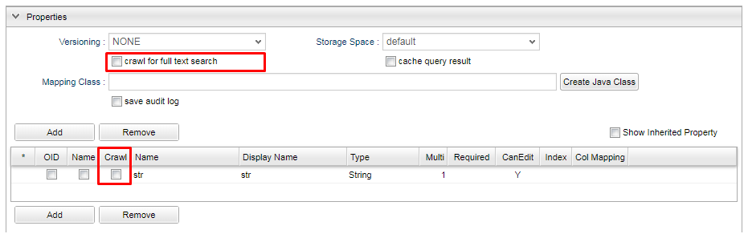
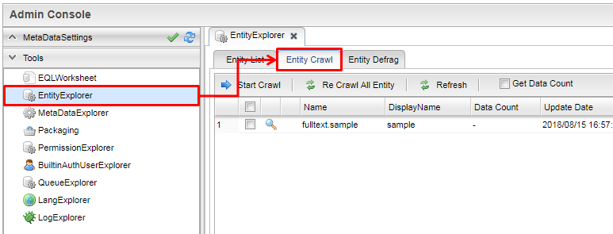
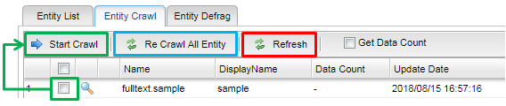
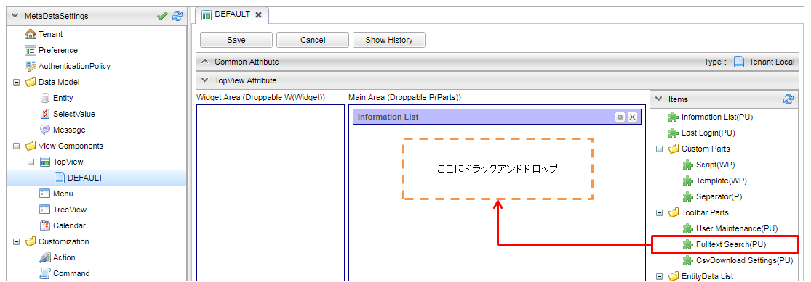
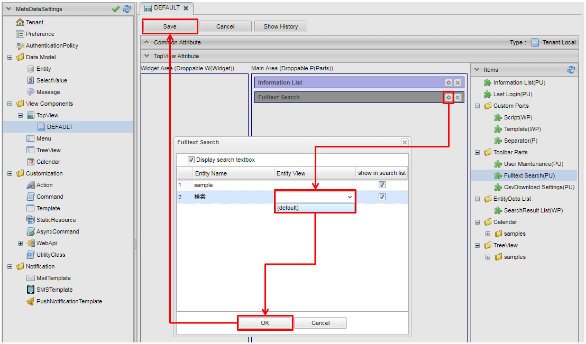
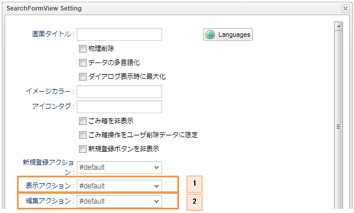

[[ref_fulltext_search]]
== 全文検索

=== 概要

全文検索とは、保存さたEntity内のプロパティの値への横断検索ができる機能です。

NOTE: ただし、全文検索はリアルタイムでデータが反映されるわけではありません。ご注意ください。

iPLAssでは、Lucene、Elasticsearch(OpenSearch) という全文検索エンジンのいずれかを利用することが可能です。 +

各エンジンの簡単な差は下記を参照してください。

[cols="1h,2*3",options="header"]
|===
|
|Lucene
|Elasticsearch(OpenSearch)

|概要
|Javaベースのオープンソースの全文検索ライブラリ。 +
iPLAssが稼働するAPサーバ内の同一VM上に組み込まれ動作。
|Elasticsearch(OpenSearch)はLuceneをベースに開発されたオープンソースの全文検索エンジン。 + 
Elasticsearch(OpenSearch)単体でサーバとして稼働する。

|データ保存先
|APサーバのローカルストレージ +
mtp-service-config.xmlに保存先フォルダを指定するだけで利用が可能。
|Elasticsearch(OpenSearch)サーバ内 +
別途Elasticsearch(OpenSearch)サーバを構築する必要がある。（本資料は構築済みであることが前提）

|Analyzer（※）の扱いやすさ
|デフォルトで使えるAnalyzerを適用する場合は、とても簡単。（複数種類有） +
ただし、カスタマイズを行う場合は、Javaファイルを作成する必要がある。
|デフォルトで使えるAnalyzerを適用する場合は、とても簡単。（複数種類有） +
カスタマイズを行う場合も基本mtp-service-config.xmlで設定するのみ。
|===

.Analyzer とは
全文検索では、以下の2種類のクラス（Tokenizer/Filter）を組み合わせて、文字の分割を行います。 +
Analyzerを利用することで、すでに決まったクラス・決まった順序で文字の組み合わせができるようになります。

* Tokenizer +
検索対象値（Entityに登録されているデータ等）や検索文字列（検索キーワードとして入力された文字列）を、検索のための文書の最小要素（Token）へ分割するクラスです。 +
検索結果にヒットする条件は、検索対象値と検索文字列それぞれのTokenが一致することとなるため、[underline]#*Tokenizerの指定により検索の使い勝手が変わります*#。 +
例えば、「関西国際空港」という文字列があったとします。指定するTokenizerにより生成されるTokenは、以下のパターン等に分かれます。
** 「関西国際空港」 +
（「関西国際空港」を１つの検索文字列として扱われます。この場合、検索文字列に「関西」と入力してもヒットしません）

** 「関西」「国際」「空港」 +
（意味のある文字列に分割します。これにより、「関西」、「国際」、「空港」のいずれかの入力でヒットします）

** 「関西」「西国」「国際」「際空」「空港」「港」 +
（左記のように２文字ずつに分割します。これにより、上記よりもヒットする文字列の数は多くなります） +
※ただし「東京都庁」のような場合は、「京都」という検索文字列でもヒットする、などの意図しないヒットが発生しやすいです

* Filter +
表記ゆれの補完や検索文字として適さない文字列の削除などを行うクラスです。 +
例えば、Lucene側でいえば以下のようなFilterが存在します。

** JapaneseKatakanaStemFilter +
4文字以上のカタカナの長音を除去します。「サーバー」は「サーバ」とも補完され、検索文字列にどちらを入力してもヒットします。

** CJKWidthFilter +
半角カナは全角カナへ、全角英数は半角英数へ補完され、補完後の文字列でヒットするようになります。

=== FulltextSearchServiceの設定

全文検索を利用する場合、まずは設定ファイルにてFulltextSearchServiceの設定を行う必要があります。
Lucene、Elasticsearch、OpenSearch を利用する場合で設定内容が異なります。

==== Lucene設定

全文検索に関する設定をFulltextSearchServiceに設定します。
Indexファイルの保存場所、Analyzerなどに関する設定などを行います。
詳細は <<../../serviceconfig/index.adoc#FulltextSearchService, FulltextSearchService>> を参照してください。

次に設定ファイルの設定例を示します。

.mtp-service-config.xmlの設定例（必要最低限の設定）

デフォルト値を利用し、必要最低限の設定のみを行った設定例を以下に示します。

[source,xml]
----
<service>
    <interface>org.iplass.mtp.impl.fulltextsearch.FulltextSearchService</interface>

    <class>org.iplass.mtp.impl.fulltextsearch.lucene.LuceneFulltextSearchService</class> <1>
    <property name="useFulltextSearch" value="true" /> <2>
    <property name="directory" value="/lucene/indexDir" /> <3>
</service>
----
<1> 実装クラスとしてLuceneFulltextSearchServiceを指定します
<2> 全文検索機能を有効化する場合trueを指定します
<3> Luceneのindexファイルを格納するルートディレクトリを指定します

.mtp-service-config.xmlの設定例（主要な項目を設定）

主要な設定項目を設定した例を以下に示します。

[source,xml]
----
<service>
    <interface>org.iplass.mtp.impl.fulltextsearch.FulltextSearchService</interface>

    <class>org.iplass.mtp.impl.fulltextsearch.lucene.LuceneFulltextSearchService</class>
    <property name="useFulltextSearch" value="true" />
    <property name="directory" value="/lucene/indexDir" />

	<property name="maxRows" value="1000" />
	<property name="throwExceptionWhenOverLimit" value="true"/>
	
	<property name="analyzerSetting" class="org.iplass.mtp.impl.fulltextsearch.lucene.JapaneseAnalyzerSetting">
		<property name="className" value="org.apache.lucene.analysis.ja.JapaneseAnalyzer" />
		<property name="mode" value="SEARCH" />
	</property>	
    
</service>
----

各設定項目の概要を以下に説明します。

[cols="1,3a",options="header"]
|===
|プロパティ名|内容説明
|useFulltextSearch|全文検索機能を有効にする場合は `true` にします。
|directory|indexファイルを保存するルートディレクトリを指定します。
このディレクトリ配下にテナント、Entity定義毎にindexファイルが作成されます。

|maxRows|
全文検索サーバから取得する検索結果の最大件数を設定します。 +

NOTE: 件数が1000件以上で、かつ、Oracleを利用する場合は、
Oracle設定の `enableInPartitioning` プロパティ値を `true` へ変更してください。

|throwExceptionWhenOverLimit|
false：maxRowsの設定値以上に検索結果件数が取得できた場合でも、maxRowsの設定値分の件数は結果を表示します。

下記の画面は設定値以上に取得出来た場合となります。設定値未満の場合、メッセージ表示はありません。

true：maxRowsの設定値以上に検索結果件数が取得できた場合、結果を表示せずに条件を絞り込むようメッセージで催促されます。

|binaryParser| 
BinaryReference解析用のParserを設定します。
Apache Tikaを利用して、特定のバイナリ内もインデックスすることができます。

|analyzerSetting| 利用するAnalyzerの設定を行います。
classには `org.iplass.mtp.impl.fulltextsearch.lucene.SimpleAnalyzerSetting` もしくはJapaneseAnalyzerの設定に特化した `org.iplass.mtp.impl.fulltextsearch.lucene.JapaneseAnalyzerSetting` を指定します。

SimpleAnalyzerSettingの場合、Analyzerのクラス名（className）を指定可能です。
JapaneseAnalyzerSettingの場合、加えてmode、userDictionaryなどの指定が可能です。

また、
Entity定義単位にAnalyzerを切り替えする場合には、 `org.iplass.mtp.impl.fulltextsearch.lucene.PerEntityAnalyzerSetting` を利用可能です。

また、 `org.iplass.mtp.impl.fulltextsearch.luceneAnalyzerSetting` を実装する独自のクラスを指定しカスタムのAnalyzerを利用することも可能です。

|===

.利用可能なAnalyzer

以下はLuceneが提供するAnalyzerです。
詳細はLuceneのドキュメントを参照ください。

- org.apache.lucene.analysis.core.WhitespaceAnalyzer +
空白分割
- org.apache.lucene.analysis.core.SimpleAnalyzer +
アルファベット分割
- org.apache.lucene.analysis.core.StopAnalyzer +
ストップワード分割
- org.apache.lucene.analysis.standard.StandardAnalyzer +
高度分割（Eメール・アドレス・頭字語・中国語・日本語・韓国語・英数字など）
- org.apache.lucene.analysis.cjk.CJKAnalyzer +
Bi-gram分割（文章が分かち書きされない言語である中国語、日本語および韓国語向け）
- org.apache.lucene.analysis.cn.smart.SmartChineseAnalyzer +
中国語分割（簡体字中国語または中国語と英語が混在している文字列に有効） +
※ Gradle 依存関係に `org.apache.lucene:lucene-analysis-smartcn` の追加が必要です。
- org.apache.lucene.analysis.ja.JapaneseAnalyzer +
日本語分割（Searchモード）：形態素解析しつつ、複合語で構成された単語を適切に分割します。

==== [.eeonly]#Elasticsearch設定#

全文検索に関する設定をFulltextSearchServiceに設定します。
サーバURL、Analyzerなどに関する設定などを行います。
詳細は <<../../serviceconfig/index.adoc#FulltextSearchService, FulltextSearchService>> を参照してください。

次に設定ファイルの設定例を示します。

.mtp-service-config.xmlの設定例（必要最低限の設定）
デフォルト値を利用し、必要最低限の設定のみを行った設定例を以下に示します。

[source,xml]
----
<service>
    <interface>org.iplass.mtp.impl.fulltextsearch.FulltextSearchService</interface>

    <class>org.iplass.mtp.impl.fulltextsearch.elasticsearch.ElasticsearchFulltextSearchService</class> <1>
    <property name="useFulltextSearch" value="true" /> <2>
    <property name="restClientFactory"  class="org.iplass.mtp.impl.fulltextsearch.elasticsearch.DefaultRestClientFactory">
        <property name="elasticsearchUrl" value="{SCHEME}://{ADDRESS}:{PORT}"/> <3>
    </property>
</service>
----
<1> 実装クラスとしてElasticsearchFulltextSearchServiceを指定します
<2> 全文検索機能を有効化する場合trueを指定します
<3> ElasticsearchのサーバURLを指定します

.mtp-service-config.xmlの設定例（主要な項目を設定）

主要な設定項目を設定した例を以下に示します。

[source,xml]
----
<service>
    <interface>org.iplass.mtp.impl.fulltextsearch.FulltextSearchService</interface>
    <class>org.iplass.mtp.impl.fulltextsearch.elasticsearch.ElasticsearchFulltextSearchService</class>
    <property name="useFulltextSearch" value="true" />
    <property name="restClientFactory"  class="org.iplass.mtp.impl.fulltextsearch.elasticsearch.DefaultRestClientFactory">
        <property name="elasticsearchUrl" value="{SCHEME}://{ADDRESS}:{PORT}"/>
    </property>

	<property name="maxRows" value="1000" />
	<property name="throwExceptionWhenOverLimit" value="true"/>
	
	<property name="analysisFactory" class="org.iplass.mtp.impl.fulltextsearch.elasticsearch.analysis.DefaultAnalysisFactory">
        <property name="analyzer" >
            <property name="my_kuromoji" class="org.iplass.mtp.impl.fulltextsearch.elasticsearch.analysis.analyzer.KuromojiAnalyzerFactory">
                <property name="mode" value="Search"/>
                <property name="method" value="Nfc"/>
            </property>
        </property>
    </property>
    <property name="defaultAnalyzerProperty" >
        <property name="analyzer" value="kuromoji"/>
    </property>
    <property name="analyzerPropertyPerEntity" >
        <property name="testEntity" class="org.iplass.mtp.impl.fulltextsearch.elasticsearch.mappings.AnalyzerProperty">
            <property name="analyzer" value="my_kuromoji"/>
        </property>
    </property>
    
</service>
----

各設定項目の概要を以下に説明します。

[cols="1,3a",options="header"]
|===
|プロパティ名|内容説明
|useFulltextSearch|全文検索機能を有効にする場合は `true` にします。
|elasticsearchUrl|ElasticsearchのサーバURLを指定します。

|maxRows|
全文検索サーバから取得する検索結果の最大件数を設定します。 +

NOTE: 件数が1000件以上で、かつ、Oracleを利用する場合は、
Oracle設定の `enableInPartitioning` プロパティ値を `true` へ変更してください。

|throwExceptionWhenOverLimit|
false：maxRowsの設定値以上に検索結果件数が取得できた場合でも、maxRowsの設定値分の件数は結果を表示します。

下記の画面は設定値以上に取得出来た場合となります。設定値未満の場合、メッセージ表示はありません。

true：maxRowsの設定値以上に検索結果件数が取得できた場合、結果を表示せずに条件を絞り込むようメッセージで催促されます。

|binaryParser| 
BinaryReference解析用のParserを設定します。
Apache Tikaを利用して、特定のバイナリ内もインデックスすることができます。

|analysisFactory| カスタムでAnalyzer等を定義したい場合に利用します。
classには `org.iplass.mtp.impl.fulltextsearch.elasticsearch.analysis.DefaultAnalysisFactory` を指定します。

|defaultAnalyzerProperty| デフォルトで利用するAnalyzer名を指定します。 classには `org.iplass.mtp.impl.fulltextsearch.elasticsearch.mapping.AnalyzerProperty` を指定します。Analyzer名にはデフォルトで提供されているAnalyzerやカスタムで定義したAnalyzerを指定することができます。 + 
デフォルトで提供されているAnalyzerについては、Elasticsearchのドキュメントを参照してください。

|analyzerPropertyPerEntity|
Entity定義単位でAnalyzerを切り替えたい場合、Entity名とAnalyzerPropertyをMap形式で指定します。

|===

==== [.eeonly]#(非推奨)OpenSearch設定#

全文検索に関する設定をFulltextSearchServiceに設定します。
サーバURL、Analyzerなどに関する設定などを行います。
詳細は <<../../serviceconfig/index.adoc#FulltextSearchService, FulltextSearchService>> を参照してください。

[CAUTION]
====
AWS SDK for Java 1.x はメンテナンスモードになっており、2025年12月 にサポートを終了する予定です。 +
iPLAss では AWS SDK for Java 1.x ベースのライブラリ iplass-ee-aws を非推奨とし、AWS SDK for Java 2.x ベースのライブラリ iplass-ee-aws2 への移行を推奨します。 +
iplass-ee-aws2 の対応に伴い、opensearch の機能は iplass-ee-opensearch へ移管しました。 +
本機能を利用している場合は、ライブラリ iplass-ee-opensearch の <<datamanagement_fulltextsearch_opensearch_opensearch>> へ設定を移行してください。 +
ライブラリ iplass-ee-aws は将来削除される予定です。
====

次に設定ファイルの設定例を示します。

.mtp-service-config.xmlの設定例（必要最低限の設定）
デフォルト値を利用し、必要最低限の設定のみを行った設定例を以下に示します。

[source,xml]
----
<service>
    <interface>org.iplass.mtp.impl.fulltextsearch.FulltextSearchService</interface>

    <class>org.iplass.mtp.impl.aws.fulltextsearch.opensearch.OpenSearchFulltextSearchService</class> <1>
    <property name="useFulltextSearch" value="true" /> <2>
    <property name="restClientFactory"  class="org.iplass.mtp.impl.aws.fulltextsearch.opensearch.DefaultRestClientFactory">
        <property name="openSearchUrl" value="{SCHEME}://{ADDRESS}:{PORT}"/> <3>
    </property>
</service>
----
<1> 実装クラスとしてOpenSearchFulltextSearchServiceを指定します
<2> 全文検索機能を有効化する場合trueを指定します
<3> OpenSearchのサーバURLを指定します

.mtp-service-config.xmlの設定例（主要な項目を設定）

主要な設定項目を設定した例を以下に示します。

[source,xml]
----
<service>
    <interface>org.iplass.mtp.impl.fulltextsearch.FulltextSearchService</interface>
    <class>org.iplass.mtp.impl.aws.fulltextsearch.opensearch.OpenSearchFulltextSearchService</class>
    <property name="useFulltextSearch" value="true" />
    <property name="restClientFactory" class="org.iplass.mtp.impl.aws.fulltextsearch.opensearch.DefaultRestClientFactory" >
		<property name="openSearchUrl" value="{SCHEME}://{ADDRESS}:{PORT}"/>
		<property name="httpRequestInterceptorFactory" class="org.iplass.mtp.impl.aws.AWSRequestSigningApacheInterceptorFactory" >
			<property name="serviceName" value="es"/>
			<property name="region" value="ap-northeast-1"/>
		</property>
	</property>
	
	<property name="analysisFactory" class="org.iplass.mtp.impl.aws.fulltextsearch.opensearch.analysis.DefaultAnalysisFactory">
        <property name="analyzer" >
            <property name="my_kuromoji" class="org.iplass.mtp.impl.aws.fulltextsearch.opensearch.analysis.analyzer.KuromojiAnalyzerFactory">
                <property name="mode" value="Search"/>
                <property name="method" value="Nfc"/>
            </property>
        </property>
    </property>
    <property name="defaultAnalyzerProperty" >
        <property name="analyzer" value="kuromoji"/>
    </property>
    <property name="analyzerPropertyPerEntity" >
        <property name="testEntity" class="org.iplass.mtp.impl.aws.fulltextsearch.opensearch.mappings.AnalyzerProperty">
            <property name="analyzer" value="my_kuromoji"/>
        </property>
    </property>
    
</service>
----

各設定項目の概要を以下に説明します。

[cols="1,3a",options="header"]
|===
|プロパティ名|内容説明
|useFulltextSearch|全文検索機能を有効にする場合は `true` にします。
|openSearchUrl|OpenSearchのサーバURLを指定します。
|httpRequestInterceptorFactory| httpRequestInterceptorを生成するFactoryクラスを設定します。
BASIC認証ではなく、IAM認証情報を使用してリクエストを署名したい場合、実装クラスである `org.iplass.mtp.impl.aws.AWSRequestSigningApacheInterceptorFactory` を指定します。
|maxRows|
全文検索サーバから取得する検索結果の最大件数を設定します。 +

NOTE: 件数が1000件以上で、かつ、Oracleを利用する場合は、
Oracle設定の `enableInPartitioning` プロパティ値を `true` へ変更してください。

|throwExceptionWhenOverLimit|
false：maxRowsの設定値以上に検索結果件数が取得できた場合でも、maxRowsの設定値分の件数は結果を表示します。

下記の画面は設定値以上に取得出来た場合となります。設定値未満の場合、メッセージ表示はありません。

true：maxRowsの設定値以上に検索結果件数が取得できた場合、結果を表示せずに条件を絞り込むようメッセージで催促されます。

|binaryParser| 
BinaryReference解析用のParserを設定します。
Apache Tikaを利用して、特定のバイナリ内もインデックスすることができます。

|analysisFactory| カスタムでAnalyzer等を定義したい場合に利用します。
classには `org.iplass.mtp.impl.aws.fulltextsearch.opensearch.analysis.DefaultAnalysisFactory` を指定します。

|defaultAnalyzerProperty| デフォルトで利用するAnalyzer名を指定します。 classには `org.iplass.mtp.impl.aws.fulltextsearch.opensearch.mappings.AnalyzerProperty` を指定します。Analyzer名にはデフォルトで提供されているAnalyzerやカスタムで定義したAnalyzerを指定することができます。 + 
デフォルトで提供されているAnalyzerについては、OpenSearchのドキュメントを参照してください。

|analyzerPropertyPerEntity|
Entity定義単位でAnalyzerを切り替えたい場合、Entity名とAnalyzerPropertyをMap形式で指定します。

|===

[[datamanagement_fulltextsearch_opensearch_opensearch]]
==== [.eeonly]#OpenSearch設定#

全文検索に関する設定をFulltextSearchServiceに設定します。
サーバURL、Analyzerなどに関する設定などを行います。
詳細は <<../../serviceconfig/index.adoc#FulltextSearchService, FulltextSearchService>> を参照してください。

次に設定ファイルの設定例を示します。

.mtp-service-config.xmlの設定例（必要最低限の設定）
デフォルト値を利用し、必要最低限の設定のみを行った設定例を以下に示します。

[source,xml]
----
<service>
    <interface>org.iplass.mtp.impl.fulltextsearch.FulltextSearchService</interface>

    <class>org.iplass.mtp.impl.fulltextsearch.opensearch.OpenSearchFulltextSearchService</class> <1>
    <property name="useFulltextSearch" value="true" /> <2>
    <property name="restClientFactory"  class="org.iplass.mtp.impl.fulltextsearch.opensearch.DefaultRestClientFactory">
        <property name="openSearchUrl" value="{SCHEME}://{ADDRESS}:{PORT}"/> <3>
    </property>
</service>
----
<1> 実装クラスとしてOpenSearchFulltextSearchServiceを指定します
<2> 全文検索機能を有効化する場合trueを指定します
<3> OpenSearchのサーバURLを指定します

.mtp-service-config.xmlの設定例（主要な項目を設定）

主要な設定項目を設定した例を以下に示します。

[source,xml]
----
<service>
    <interface>org.iplass.mtp.impl.fulltextsearch.FulltextSearchService</interface>
    <class>org.iplass.mtp.impl.fulltextsearch.opensearch.OpenSearchFulltextSearchService</class>
    <property name="useFulltextSearch" value="true" />
    <!--
    <property name="restClientFactory"  class="org.iplass.mtp.impl.fulltextsearch.opensearch.DefaultRestClientFactory">
        <property name="openSearchUrl" value="{SCHEME}://{ADDRESS}:{PORT}"/>
    </property>
    -->
    <property name="transportFactory"  class="org.iplass.mtp.impl.fulltextsearch.opensearch.awsv2.AwsSdk2OpenSearchTransportFactory">
        <property name="host" value="{ADDRESS}:{PORT}" />
        <!-- es:マネージド型クラスター、 aoss：サーバーレス -->
        <property name="serviceName" value="es" />
        <property name="region" value="ap-northeast-1" />
    </property>

	<property name="maxRows" value="1000" />
	<property name="throwExceptionWhenOverLimit" value="true"/>

	<property name="analysisFactory" class="org.iplass.mtp.impl.fulltextsearch.opensearch.analysis.DefaultAnalysisFactory">
        <property name="analyzer" >
            <property name="my_kuromoji" class="org.iplass.mtp.impl.fulltextsearch.opensearch.analysis.analyzer.KuromojiAnalyzerFactory">
                <property name="mode" value="Search"/>
                <property name="method" value="Nfc"/>
            </property>
        </property>
    </property>
    <property name="defaultAnalyzerProperty" >
        <property name="analyzer" value="kuromoji"/>
    </property>
    <property name="analyzerPropertyPerEntity" >
        <property name="testEntity" class="org.iplass.mtp.impl.fulltextsearch.opensearch.mappings.AnalyzerProperty">
            <property name="analyzer" value="my_kuromoji"/>
        </property>
    </property>
</service>
----

各設定項目の概要を以下に説明します。

[cols="1,3a",options="header"]
|===
|プロパティ名|内容説明
|useFulltextSearch|全文検索機能を有効にする場合は `true` にします。
|restClientFactory|OpenSearchのサーバURLを指定します。BASIC認証を利用する場合は本設定を利用します。
|transportFactory|OpenSearchのサーバURLを指定します。IAM認証情報を使用してリクエストを署名します。<<../../serviceconfig/index.adoc#aws2_AWSSetting, AWSSetting>> の設定が必要となります。 +
restClientFactory と同時に設定された場合、本設定は無効となり restClientFactory が優先されます。
|maxRows|
全文検索サーバから取得する検索結果の最大件数を設定します。 +

NOTE: 件数が1000件以上で、かつ、Oracleを利用する場合は、
Oracle設定の `enableInPartitioning` プロパティ値を `true` へ変更してください。

|throwExceptionWhenOverLimit|
false：maxRowsの設定値以上に検索結果件数が取得できた場合でも、maxRowsの設定値分の件数は結果を表示します。

下記の画面は設定値以上に取得出来た場合となります。設定値未満の場合、メッセージ表示はありません。

true：maxRowsの設定値以上に検索結果件数が取得できた場合、結果を表示せずに条件を絞り込むようメッセージで催促されます。

|binaryParser| 
BinaryReference解析用のParserを設定します。
Apache Tikaを利用して、特定のバイナリ内もインデックスすることができます。

|analysisFactory| カスタムでAnalyzer等を定義したい場合に利用します。
classには `org.iplass.mtp.impl.fulltextsearch.opensearch.analysis.DefaultAnalysisFactory` を指定します。

|defaultAnalyzerProperty| デフォルトで利用するAnalyzer名を指定します。 classには `org.iplass.mtp.impl.fulltextsearch.opensearch.mappings.AnalyzerProperty` を指定します。Analyzer名にはデフォルトで提供されているAnalyzerやカスタムで定義したAnalyzerを指定することができます。 + 
デフォルトで提供されているAnalyzerについては、OpenSearchのドキュメントを参照してください。

|analyzerPropertyPerEntity|
Entity定義単位でAnalyzerを切り替えたい場合、Entity名とAnalyzerPropertyをMap形式で指定します。

|===

[[fulltextsearch_view]]
=== 利用方法

[[fulltextsearch_view_indexSettings]]
==== Indexの設定
AdminConsoleからIndex対象とするEntity、および、Entityの列の設定をします。 +
全文検索対象としたいEntityを開き、「crawl for full text search」にチェックしてください。
すると、デフォルトでIndex対象となりうるプロパティの「Crawl」列にチェックが出ます。
各プロジェクトで必要なプロパティに対してのみチェックがあることを確認し、保存してください。

NOTE: typeがBinaryであるプロパティクを全文検索対象とした場合、`バイナリのファイル名 + " " + バイナリのファイルタイプ` という値で登録されます。

[[fulltextsearch_view_indexSettings_create]]
==== Indexの作成
全文検索で検索が行われるデータは下記のIndex作成をした時点でのデータとなります。（ただし取得（表示）されるデータは、検索時点の最新データとなります） +
そのため、新しく登録したデータをIndexに含めたいなどの場合は、必ずIndexの再作成を実施してください。

. AdminConsoleから +
AdminConsole画面の左下メニューにあるToolsのEntityExplorerを選択します。 +
全文検索を利用する設定になっている場合、「Entity Crawl」タブが表示されます。 +
「Entity Crawl」タブのリストには「crawl for full text search」にチェックをつけたEntityのみが表示されます。
+

+
クローリングには選択したEntityのみを対象に実施する方法と、全Entityを全てクローリングする2種類があります。
+
[horizontal]
[green]#A.#:: 任意のEntityのみを対象としてクローリングしたい場合はリストのEntityにチェックをいれ、`Start Crawl` ボタンをクリックして下さい。
[blue]#B.#:: クローリング対象Entityを全てクローリングしたい場合は `Re Crawl All Entity` ボタンをクリックして下さい。この場合、チェックをいれていないEntityも全てが対象となります。
+

[red]#C.#:: クローリング処理が完了しましたら、INDEXデータの変更を反映させるために、`Refresh` ボタンをクリックしてください。

. バッチから +
iPLAss SDKで配布している `crawl_entity.bat（sh）` をクーロン等にセットすることで、バッチ起動が可能です。 +
バッチの詳細については<<../support/index.adoc#entity_crawl, Entity Crawl>>を参照してください。

==== 検索機能
.画面からの検索
全文検索機能を有効にしている場合のみ画面上部に拡大鏡マークが表示されます。
拡大鏡マークをクリックすると、検索プルダウンが表示されます。
また、このプルダウンに表示されるエンティティはAdminConsoleでIndex対象としたEntityのみとなります。
プルダウン右にあるテキストボックスに文字列を入力して検索することで全文検索が実行されます。
エンティティを選択しない場合はIndex対象とした全Entityが対象なり、下記のような検索結果画面となります。

.（参考）ソートについて
全文検索機能でのソートは以下のようになっています。
====
第１ソート：スコア（降順） +
第２ソート：Entity定義名（昇順）
====

スコアとは、検索文字列と検索対象値（行単位）の関連度が数値化されたものとなります。
これらはLucene内部で算出された値を利用しています。
簡単に条件を表すと、以下に一致すればするほどスコア値が高くなる傾向があります。
====
* 検索文字列の単語がより多く含まれている
* 検索対象の値が短い
* 全検索対象の中で希少単語が含まれている
====

.「検索対象の値が短い」の例：
実行環境として、全文検索の取得上限（maxRows設定）を `5` に設定し、
`java` という文字列が３つ出てくる情報を４つ、２つ出てくる情報（緑枠の部分）を３つ用意している状態です。
（全文検索対象のプロパティは「検索対象１」～「検索対象３」）

スコア値が高くなる傾向の１つである「検索文字列の単語がより多く含まれている」が適用されたことにより、
`java` という文字列が２つ出てくる情報は１件分しか表示できません。 +
`java` という文字列が２つ出てくる情報の種類として、１件はプロパティに設定した値が `java` だけのもののみ、
その他２件は `java` の他に文字列を含んでいる値になっています。 +
「検索対象の値が短い」という条件が適用されたことにより、 `java` だけ登録した値がスコアとして高くなり、
全文検索結果として表示されています。

image::images/FulltextSearch_SearchTargetValue_Short.png[]

.ロジックからの検索
ロジックから検索する方法は２種類あります。

. 全エンティティを対象に検索する場合 +
EntityManagerのfulltextSearchEntityを利用して下さい。複数のEntityに対して横断的に一括で検索します。
ただし、取得できるデータはEntity毎にマージされたものとなります。

. EQLの検索条件として全文検索条件を利用する場合 +
下記のようにEQLの条件中に、全文検索の条件を含めることが可能です。Containsの中に検索キーワードをセットして下さい。
EQLを利用し検索する場合は、当該Entityに対して設定されているセキュリティ権限が反映されます。
+
Containsの中に検索キーワードをセットして下さい。
+
[source,java]
----
EntityManager em = ManagerLocator.manager(EntityManager.class);

Query query = new Query();
query.select(Entity.OID, Entity.NAME).from("search.Test01").where(new Contains("hogehoge"));

SearchResult<Entity> result = em.searchEntity(query);
----
+
もしくはEQL直接以下のように利用可能です。
+
[source,java]
----
EntityManager em = ManagerLocator.manager(EntityManager.class);

SearchResult<Entity> result = em.searchEntity(Query.newQuery("select oid, name from search.Test01 where contains ('test')"));
----

==== 画面のカスタマイズ
.検索結果および詳細などのView設定
全文検索結果に表示されるプロパティや[詳細、編集]リンク押下時の遷移先ViewをAdminConsoleから設定することが可能です。 +
まず、対象のEntity毎に全文検索結果に表示したい項目などを設定したViewをSearch Layoutで作成してください。
その後、AdminConsole画面のMetaDataSettings内にある `View Components > TopView` の設定を変更します。 +

TopViewの機能概要、作成方法については<<../genericentitymanager/topview/index#, TopView>>の章を参照してください。 +

右にあるメニューから、 `Toolbar Parts > Fulltext Search(PU)` を選択し、Main Area(Droppable P(Parts))にドラッグ&ドロップしてください。

ドラッグ&ドロップして出てきたFulltext Searchの設定ボタンをクリックすると、 `crawl for full text search` 
にチェックをつけたEntityのみが表示されます。 +
Entity View列に設定したSearchViewを使用して、全文検索結果となったEntityの情報を表示します。 +

TIP: 別途対象EntityのSearch ViewでカスタマイズしたViewを作成することで、Entity Viewの選択リストに表示されるようになります。

その他の設定可能な項目は以下になります。
[cols="1,2a", options="header"]
|===
|設定項目|設定内容
|Display search textbox|本項目にチェックを入れると、ヘッダーに全文検索用のテキストボックスが表示されます。
|Display user name in privileged execution|本項目にチェックを入れると、UserPropertyEditorが設定されているプロパティに対し、ユーザー情報のEntity、またはユーザー名のプロパティに参照権限が無いユーザーでも、特権実行をしてユーザー名を表示することができます。
|Entity View|全文検索の結果表示で利用するViewを選択します。
|show in search list|本項目にチェックを入れると、全文検索実行時の対象として、個別に選択が可能になります。
|===

.詳細・編集リンクのカスタマイズ
全文検索結果を表示するSearchViewのSearchFormView Settingに自作したアクションを設定することで、
カスタマイズした画面への遷移が可能となります。

====
. 詳細リンク先アクション
. 編集リンク先アクション
====

遷移先で取得可能なリクエスト情報は以下です。
[cols="1,3",format="dsv",options="header"]
|===
パラメータ名:内容説明
defName:選択した情報のEntity定義名
oid:選択した情報のOID
version:選択した情報のVersion
|===
