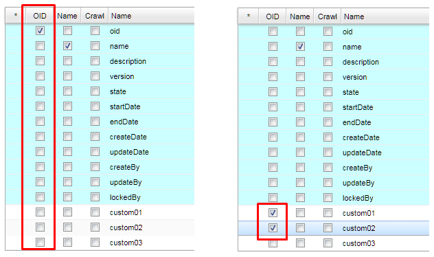
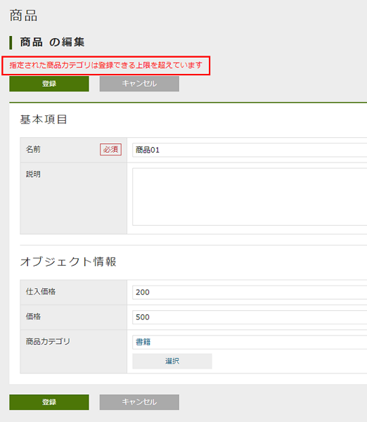
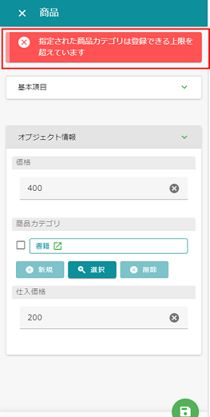
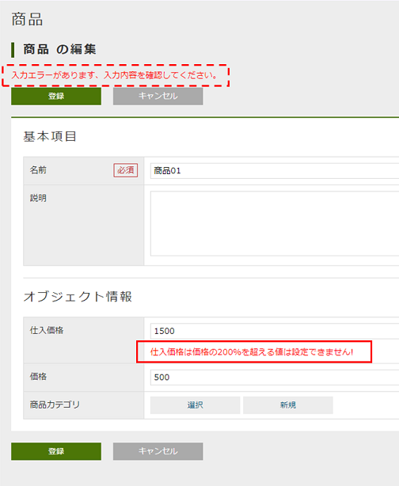
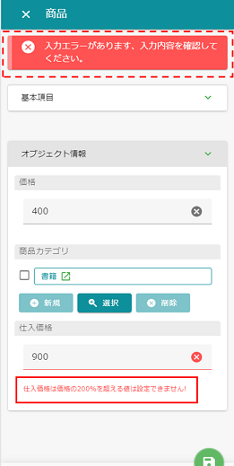

=== Entityの作成
Entityアイコンを右クリックして「Entityを作成する」を選択してください。

CAUTION: 階層化(フォルダのようにグループ化)する場合はドット(.)区切りで指定してください。
他のメタデータは基本的にスラッシュ(/)で階層化しますが、Entityは特別です。

NOTE: Entityを作成したタイミングで、メニューアイテムが作成されます。
またテナントに標準で作成されている `DEFAULT` メニュー定義がある場合は、
最後にアイテムが追加されます。

[[ref_entity_default_property]]
=== 共通Property
Entityにはあらかじめ標準PropertyとシステムPropertyが定義されています。

NOTE: あらかじめ定義されているPropertyは変更や削除することはできません。 +
共通のPropertyとして利用されている名前は予約語です。Entity内で同じ名前のPropertyを定義することはできません。

==== 標準Property
レコードのキーに該当するIDやレコードの内容を表すPropertyが定義されています。
[cols="2,3,2,10",options="header"]
|===
| 名前 | 表示名 | データ型 | 内容
| <<ref_property_oid,oid>> | オブジェクトID | String | レコードを一意に特定するID。変更不可。
| <<ref_property_name,name>> | 名前 | String | レコードを表すラベル。必須項目。値はユニークである必要はありません。
| <<ref_property_description,description>> | 説明 | String | レコードの説明。任意項目。
|===

[[ref_property_oid]]
===== オブジェクトID (oid)
Entityデータは1レコード単位に `oid` という一意のKEY値を保持します。

標準の動作として、`oid` はEntityデータの登録時に自動的に採番されます。
更新処理で変更することはできません。
後述するEntityどうしの参照定義(<<ref_property_reference,Reference Property>>)においても、
この `oid` で参照関係を保持します(正確には `oid` + `version` です)。

image::images/entity_property_oid.png[]

.一意となる範囲
標準で自動採番される `oid` 値は、Entity単位で一意となる値です。
テナント単位で一意な値ではないので、 `oid` からEntityを特定することはできません。

[[ref_property_name]]
===== 名前 (name)
`name` はレコードに対するラベルを想定しています。 +
`name` は必須項目ですが値の変更は可能です。また値として一意である必要もありません。

[[ref_property_description]]
===== 説明 (description)
`description` はレコードに対する説明を想定しています。 +
`description` はString型の任意項目なので、利用可否も含め自由に利用してください。

==== システムProperty
データのバージョン制御のためのPropertyや、データ操作時の情報を保持するPropertyが定義されています。
システムPropertyは自由に値を設定することはできません。データ操作時に自動で制御されます。
[cols="2,3,2,10",options="header"]
|===
| 名前 | 表示名 | データ型 | 内容
| version | バージョン | Integer | <<ref_entity_versioning>> で利用。管理しない場合は0。
| state | ステータス | Select | バージョン管理用。
| startDate | 有効開始日 | DateTime | バージョン管理用。
| endDate | 有効終了日 | DateTime | バージョン管理用。
| createDate | 作成日 | DateTime | データ作成日時。
| updateDate | 更新日 | DateTime | データ更新日時。
| createBy | 作成者 | String | データ作成者。作成者に該当する `User` Entityの `oid` が格納される。
| updateBy | 更新者 | String | データ更新者。更新者に該当する `User` Entityの `oid` が格納される。
| lockedBy | ロックユーザー | String | データロック機能用。ロック者に該当する `User` Entityの `oid` が格納される。
|===

.システムPropertyの注意点
システムPropertyは制御用としてiPLAss内部で制御されるため、
各アプリケーションで独自の用途として値を格納したりしないでください。
バージョンアップなどで増減したり、格納される値が変更される可能性があります。

`startDate` や `endDate` についても、「ユーザー」「おしらせ情報」Entityなどで一部利用していますが、
Entityの <<ref_entity_versioning,バージョン管理設定>> により利用される可能性があるため、基本的には利用できません。

=== Propertyの設定

Entityに対して、保存したいデータ項目に合わせたPropertyを追加していきます。 +
Entityに対するより高度な設定については <<ref_entity_advanced, 高度な設定>> で説明します。

[[ref_property_create]]
==== Propertyの作成
Propertyを作る際は、格納する値の型に特化したデータ型の選択や、必須項目や長さなどの制約条件の設定を行います。

Propertyを追加する場合は `Add` ボタン、編集する場合は対象のPropertyレコードをダブルクリック、
削除する場合は対象のPropertyを選択（ShiftやCtrlで複数可）して `Remove` ボタンをクリックします。
またPropertyの順番を並び替える場合はドラッグ&ドロップで並び替えてください。

==== Propertyの詳細設定
Propertyは次の項目を設定可能です。
また指定したPropertyのデータ型によって、設定する項目が変更されます
(一部データ型により変更できない項目があります)。

[cols="1,4", options="header"]
|===
| 設定項目 | 設定内容
| Name | 物理名を指定します。英数字のみ指定可能です。
| Display Name | 表示名を指定します。 +
未指定の場合、Entity定義の保存時にNameが設定されます。
| <<ref_property_type_list,Type>> | データ型を指定します。
| <<ref_property_multiple,Multiple>> | 多重度を指定します。
| Required | 必須項目かを指定します。 +
必須項目にした場合、検証ロジック（Validator）に  <<ref_property_validator_not_null>> が追加されます。
| CanEdit | 値を変更できるかを指定します。 +
Entityデータの更新時(update）の変更チェックや、汎用画面上での編集可否に利用されます。
| <<ref_property_index,Index Type>> | インデックスを指定します。
| [.eeonly]#<<ref_encrypt_mode, Encrypt Mode>># | 暗号化有無、および形式を指定します。
| <<ref_property_validator_list,Validator>> | 検証ロジックを指定します。
| <<ref_property_normalizer,Normalizer>> | 正規化ロジックを指定します。
|===

[[ref_property_type_list]]
===== データ型の指定
提供されているPropertyのデータ型です。基本的な型とiPLAssに特化した特殊な型があります。

[[ref_property_type_primitive]]
.基本型
[cols="3,6a,3",options="header"]
|===
| 型 | 説明 | Java型
| String | 文字列型です。 +
<<ref_property_string_length, 文字数に関する制約>>があります。 | String
| Boolean |真・偽を表す型です。| Boolean
| Integer |整数を表す数値型です。|<<ref_property_integer_javaclass,Long>>
| Float |小数を表す数値型です。| Double
| Decimal |正確な小数計算を扱う数値型です。 +
少数桁数と<<ref_property_decimal_roundmode,丸めモード>>が指定可能です。

CAUTION: MySQLで小数点第5位以下を使用する場合は、MySQLのシステム変数 `div_precision_increment` を設定してください。
DIV演算子を使用しない場合でも、iPLAss内部で桁数調整のため自動的にDIVをしているので `div_precision_increment` の設定が必要です。

| BigDecimal
| DateTime | 日付と時間を表す型です。| java.sql.Timestamp
| Date | 日付を表す型です。| java.sql.Date
| Time | 時間を表す型です。| java.sql.Time
|===

.特殊型(拡張型)
[cols="3,6,3",options="header"]
|===
| 型 | 説明 | Java型
|<<ref_property_select>> | 選択値として「値とラベル」のセットを定義することができる型です。| org.iplass.mtp.entity.SelectValue
| <<ref_property_autonumber>> | 自動採番値を扱う型です。| String
| <<ref_property_expression>> | 式を設定することができる型です。 | String
| <<ref_property_binary>> | バイナリデータを扱う型です。（BLOB型）| org.iplass.mtp.entity.BinaryReference
| <<ref_property_longtext>> | String型では入りきらない文字列を扱う型です。（BLOB型）| String
| <<ref_property_reference>> | 各エンティティを関連付ける事ができる型です。| org.iplass.mtp.entity.Entity
|===

Java型はCommandやUtilityClass、TemplateなどでEntityデータを扱う際のデータ型です。

それぞれのデータ型の詳細は、<<ref_property_type>> を参照してください。

[[ref_property_multiple]]
===== 多重度について
Entityには１つのPropertyに対して複数の値を保持することが可能となっています(配列イメージ)。

[cols="^1,2,4,8",options="header"]
|===
|oid|name|col1(multiple=5)|ref1(multiple=*)
|1|data1|[a,b,c,d,e]|[{oid=1,ver=0},{oid=2,ver=0},{oid=3,ver=0}]
|2|data2|[a,b,c]|[]
|3|data3|[]|[{oid=1,ver=0},{oid=2,ver=0}]
|===

* `Reference` 型については、無制限を表す「*」を指定できます。
* `Reference` 型以外のPropertyは数値のみ指定できます。

`Reference` 型以外で多数の多重度を持たせたい場合は、パフォーマンスを考慮して、
別Entityを定義して `Reference` 型で参照するようにするか、
独自の <<ref_entity_storagespace,Storage Space>> を利用することを検討してください。

==== Property変更時の注意点
Entity の Property 定義を変更する際は、次の点に注意してください。

===== Property追加・削除時
基本的にデータの更新・ロックは発生しません。 +
ただし、プロパティ追加に伴ってページの追加が必要になった場合は、データに対してレコードロックが掛ります。

===== Property更新時
* データ型を変更した場合（データの変換が可能な場合）
** データの値は引き継がれます。ただし、データに対してレコードロックが掛ります。
* データ型を変更した場合（データの変換が不可能な場合）
** データの値は引き継がれません。このため基本的にはデータに対してロックは掛りません。 +
ただし、新しいデータ型に合わせて新しくカラムが割り当てられるため、この結果としてページの追加が必要になった場合は、レコードロックが掛ります。
* Index定義を変更した場合
** データに対してレコードロックが掛ります。

.プロパティ型の変更によるデータの引き継ぎ
* 相互変換可能
+
[cols="1,2",options="header"]
|===
|プロパティ型
|補足

|DECIMAL ⇔ INTEGER ⇔ FLOAT
|桁数に応じての四捨五入等は発生

|DATE ⇔ DATETIME
|時間部分は00:00:00で補完

|TIME ⇔ DATETIME
|日付部分は1970-01-01で補完

|AUTONUMBER ⇔ STRING
|
|===
+
* 一方向のみ変換可能
+
[cols="1,2",options="header"]
|===
|プロパティ型
|補足

|* ⇒ STRING
|LONGTEXT,BINARY除くすべての型はSTRINGに変換可能

|STRING ⇒ LONGTEXT
|STRING型にて格納されている文字列のうち、DBのVARCHARカラムのバイト数-21バイト以上の文字は切り捨てされる。 +
Oracleの場合3979byte以上の文字は切り捨てされる

|BOOLEAN ⇒ SELECT
|SELECT型の値としては、false->0、true->1になる
|===

[[ref_entity_advanced]]
=== 高度な設定
Entityに対して提供されているその他の機能について説明します。

[cols="1,4", options="header"]
|===
| 設定項目 | 設定内容
| <<ref_entity_custom_prop, 共通Propertyの変更>> | `oid` 、 `name` Propertyをカスタマイズします。
| <<ref_entity_versioning,Versioning>> | Entityデータのバージョン管理方式を指定します。
| <<ref_entity_storagespace,Storage Space>> | Entityデータの格納先を指定します。
| <<ref_entity_auditlog,save audit log>> | EntityデータのCRUD操作に対するログを記録するかを指定します。
| <<ref_fulltext_search,crawl for full text search>> | 全文検索機能用のINDEXを作成するかを指定します。
| <<ref_entity_cache_query_result,cache query result>> | Entityの検索結果をキャッシュするかを指定します。
| <<ref_entity_mappingclass,Mapping Class>> | CommandなどでEntity操作を行う際に、Javaで実装されたEntityクラスを利用する場合に指定します。
| <<ref_entity_event_listener,EventListener>> | EntityのEventListenerを指定します。
| <<ref_entity_data_localization,Data Localization>> | Entityデータの国際化対応を指定します。
|===

[[ref_entity_custom_prop]]
==== 共通Propertyの変更
`oid` と `name` については他のPropertyを指定することで代用することができます。

===== oid Propertyの変更
外部システムからのデータ取り込みや、IDとしてユーザーにわかりやすい値にしたい場合など、
`oid` として利用するPropertyを変更することが可能です。

Admin Consoleで `oid` を指定する場合は、「OID」列で指定してください。

.指定可能なProperty属性
以下の属性のPropertyのみ `oid` として指定することが可能です。

====
* 型が <<ref_property_type_primitive, 基本型>> または <<ref_property_autonumber, AutoNumber>> である
* 必須項目である
* 変更不可である
* 多重度が1である
====

.複合指定
複数のPropertyを指定することが可能です。
この場合、 `oid` に格納される値は、選択したPropertyを上から順番にハイフン「-」で
結合した値になります。

.登録済データに対する注意点
既に登録済みのEntityデータが存在する状態で `oid` Propertyを変更した場合、
登録済みのデータは自動的には変更されません。
このような場合は、Entityデータのエクスポート/インポートなどによりデータを手動で変更する必要があります。

===== name Propertyの変更
`oid` 同様、 `name` も対象とするPropertyを変更することが可能です。

Admin Consoleで変更する場合は、「Name」列で指定してください。

.指定可能なProperty属性
以下の属性のPropertyのみ `name` として指定することが可能です。

====
* 型が <<ref_property_type_primitive, 基本型>> 、 <<ref_property_autonumber, AutoNumber>> 、 <<ref_property_select, Select>> のいずれかである
* 必須項目である
* 多重度が1である
====

.複合指定
`oid` と異なり、複数のPropertyを指定することはできません。

.「name」を指定した場合の注意点
`name` を指定した場合には、以下の点について考慮する必要があります。

* 登録時の動作 +
`name` Propertyを独自に設定した場合、Entityデータの更新時に `name` に同じ値が設定されます( `name` Propertyがなくなるわけではありません)。
例えば、 `name` Propertyと、独自に指定したPropertyそれぞれに値を設定して更新した場合、`name` に設定された値は上書きされます。

* 汎用画面（GEM）のカスタマイズが必要 +
汎用画面では、標準で `name` と `description` Propertyが検索・詳細画面上に表示されます。
`name` Propertyを独自に設定した場合は、`name` を削除し独自Propertyを追加するなど、汎用画面のレイアウト調整が必要です。

.登録済データに対する注意点
既に登録済みのEntityデータが存在する状態で `name` Propertyを変更した場合、
登録済みのデータは自動的には変更されません。
例えば、必須ではない項目を必須に変更して `name` に指定した場合も、
登録済のデータは値が設定されていない可能性がある状態になってしまいます。このようなデータは最初の更新時にエラーになります。 +
この場合は、Entityデータのエクスポート/インポートなどにより登録済みデータを手動でメンテナンスする必要があります。

.nameを利用したくない場合
作成したいEntityに `name` に該当するPropertyがない場合は、 <<ref_property_autonumber, AutoNumber>> 型のPropertyを作成して、それを `name` として指定してください。

[[ref_entity_versioning]]
==== データのバージョン管理
Entityの1レコードに対して、複数のバージョンを保持することができます。
バージョン管理を利用することで、修正履歴を保持できたり、先日付データを事前に登録することが可能になります。
バージョン管理する場合、Entityに定義される共通プロパティ `version` 、 `state` 、  `startDate` 、 `endDate` が利用され、現在有効なバージョンが決定されます。

NOTE: `version` プロパティは排他制御のためのものではありません。排他制御は `updateDate` プロパティでチェックしています。

NOTE: EQLでバージョン管理されたEntityを検索する際、EQLの検索条件にバージョン管理項目を指定した場合、全てのバージョンのデータを検索対象とします。未指定の場合、現在有効なバージョンのデータのみを検索対象とします。

バージョン管理方式には以下の種類があります。

[cols="1,4",options="header"]
|===
| タイプ | 説明
| NONE | バージョンデータを保持しません。データに対する最新の状態のみ保持されます。
| NUMBER BASE | 共通Propertyの `version` を利用して、複数のバージョンデータを保持します。
| TIME BASE | 共通Propertyの `startDate` 、 `endDate` （有効期間）を利用して、複数のバージョンデータを保持します。
| SIMPLE TIME BASE | 共通Propertyの `startDate` 、 `endDate` （有効期間）を利用して、複数のバージョンデータを保持します。SIMPLE TIME BASEでは、複数バージョン間で有効期間が重なることは許可されません。
| STATE BASE | 共通Propertyの `state` を利用して、有効なバージョンを制御します。
|===

===== NUMBER BASE
共通Propertyの `version` を複数保持することが可能になります。
検索処理で有効なデータは `version` が最大、且つ `state` が `有効` のものになります。

.例
[cols="1,1,1,1,1,2,1",options="header"]
|===
| oid | version | state | startDate | endDate | name | 有効
| 1 | 0 | 有効 | - | - | sample1_v0 |
| 1 | 1 | 有効 | - | - | sample1_v1 | *
| 1 | 2 | 無効 | - | - | sample1_v2 |
|===

===== TIME BASE
共通Propertyの `startDate` 、 `endDate` （有効期間）を複数保持することが可能になります。
データを更新する際に有効期間を指定します。
検索処理で有効なデータは システム日時で有効期間に該当（startDate≦システム日時＜endDate）し、且つ `version` が最大、且つ `state` が `有効` のものになります。

.例１（システム日時が20021/03/29 12:00:00）
[cols="1,1,1,1,1,2,1",options="header"]
|===
| oid | version | state | startDate | endDate | name | 有効
| 1 | 0 | 有効 | 2018/04/01 00:00:00 | 2030/04/01 00:00:00 | sample1_v0 |
| 1 | 1 | 有効 | 2019/04/01 00:00:00 | 2021/04/01 00:00:00 | sample1_v1 | *
| 1 | 2 | 有効 | 2021/04/01 00:00:00 | 2022/04/01 00:00:00 | sample1_v2 |
| 1 | 3 | 無効 | 2019/04/01 00:00:00 | 2025/04/01 00:00:00 | sample1_v3 |
|===

.例２（システム日時が20021/04/01 00:00:00）
[cols="1,1,1,1,1,2,1",options="header"]
|===
| oid | version | state | startDate | endDate | name | 有効
| 1 | 0 | 有効 | 2018/04/01 00:00:00 | 2030/04/01 00:00:00 | sample1_v0 |
| 1 | 1 | 有効 | 2019/04/01 00:00:00 | 2021/04/01 00:00:00 | sample1_v1 |
| 1 | 2 | 有効 | 2021/04/01 00:00:00 | 2022/04/01 00:00:00 | sample1_v2 | *
| 1 | 3 | 無効 | 2019/04/01 00:00:00 | 2025/04/01 00:00:00 | sample1_v3 |
|===

データ登録時に有効期間が未指定の場合は、自動的に「システム日時」～「2099/12/31 00：00：00」が設定されます。
また `TIME BASE` の場合も `version` はカウントアップされます。
システム日時に対して有効なデータ期間が複数存在する場合は、 `version` が大きい、且つ `state` が `有効` なバージョンが有効なデータとなります。

===== SIMPLE TIME BASE
共通Propertyの `startDate` 、 `endDate` （有効期間）で有効なバージョンを制御します。SIMPLE TIME BASEは、TIME BASEとは異なり、複数バージョン間で有効期間が重なることは許可されません。
検索処理で有効なデータは システム日時で有効期間に該当（startDate≦システム日時＜endDate）し、且つ `state` が `有効` のものになります。

.例（システム日時が20021/03/29 12:00:00）
[cols="1,1,1,1,1,2,1",options="header"]
|===
| oid | version | state | startDate | endDate | name | 有効
| 1 | 0 | 有効 | 2018/04/01 00:00:00 | 2019/04/01 00:00:00 | sample1_v0 |
| 1 | 1 | 有効 | 2019/04/01 00:00:00 | 2021/04/01 00:00:00 | sample1_v1 | *
| 1 | 2 | 有効 | 2021/04/01 00:00:00 | 2022/04/01 00:00:00 | sample1_v2 |
| 1 | 3 | 無効 | 2023/04/01 00:00:00 | 2024/04/01 00:00:00 | sample1_v3 |
|===

データ登録時に有効期間が未指定の場合は、自動的に「システム日時」～「2099/12/31 00：00：00」が設定されます。
また `TIME BASE` の場合も `version` はカウントアップされます。
データ更新時、`state` が `有効` であり、且つ有効期間が重複するバージョンを登録しようとした場合はエラーとなり登録できません。

===== STATE BASE
共通Propertyの `state` を利用し、現在有効なバージョンを制御します。
`state` が有効なバージョンは最大でも１つとなります。
検索処理で有効なデータは `state` が `有効` のものになります。

.例
[cols="1,1,1,1,1,2,1",options="header"]
|===
| oid | version | state | startDate | endDate | name | 有効
| 1 | 0 | 無効 | - | - | sample1_v0 |
| 1 | 1 | 有効 | - | - | sample1_v1 | *
| 1 | 2 | 無効 | - | - | sample1_v2 |
|===

また `STATE BASE` の場合も `version` はカウントアップされます。
データ更新時、`state` が `有効` のバージョンを登録しようとした場合、他のバージョンの `state` の値は `無効` に変更されます。

.バージョンデータの更新方法
新しいバージョンのデータを作成する場合は、明示的に更新する必要があります。
普通に更新した場合は新しいバージョンデータは作成されず、対象バージョンのデータが更新されます。

汎用画面からデータを登録する場合は、詳細画面に `新しいバージョンとして更新` というボタンが表示されるので、
そこから更新を行います。

Commandなど独自で更新処理を実装する場合は `UpdateOption` で設定します。

[source,Groovy]
----
import org.iplass.mtp.entity.EntityValidationException;
import org.iplass.mtp.entity.UpdateOption;
import org.iplass.mtp.entity.TargetVersion;

EntityManager em = ManagerLocator.manager(EntityManager.class);

try {
	//別バージョンで更新する場合、UpdateOptionに対して、
	//TargetVersion.NEWを指定すると新しいバージョンとして保存される
	//通常のupdate処理は「TargetVersion.CURRENT_VALID」（有効バージョン）
	UpdateOption option = new UpdateOption();
	option.setTargetVersion(TargetVersion.NEW);

	em.update(entity, option);
} catch (EntityValidationException e) {
}
----

.ReferencePropertyが参照するバージョン
Entity間の連携を定義するための<<ref_property_reference, Reference>>型のPropertyが参照する参照先のバージョンは、
ReferencePropertyで指定した「バージョン管理」設定によって決定されます。

.Unique Property の制約
バージョン管理を行う場合、 `Unique Index` が指定されたPropertyは変更不可になります。
Entity定義の保存時に、 `Unique Index` が指定されているPropertyは `canEdit = false` として保存されます。

[[ref_entity_storagespace]]
==== Storage Spaceの変更
全てのEntityのデータは、標準の設定ではバックエンドのRDB上で１つの物理テーブルに格納されます。

例えば、

====
* 一部のデータを暗号化したいため当該Entityを格納するテーブルのテーブルスペースを分けたい
* あるEntityは大量件数が想定されるため、他のデータとは物理的に別テーブルで管理し、他のEntityへのパフォーマンス面での悪影響を抑えたい
====

といった要件を実現すため、Entityデータを格納する領域をEntity単位で指定することが可能です。
この領域のことをiPLAssでは `Storage Space` と呼称します。

ただしこの機能を利用するには、通常意識しないバックエンドDB上に物理テーブルを作成し、service-configにStorageSpace定義が必要となります。

詳細は <<ref_storagespace, Storage Space>> を参照してください。

[[ref_entity_auditlog]]
==== [.eeonly]#データ操作ログの記録#
EntityデータのCRUD操作に対するログを記録することができます。

記録されたログは、汎用画面の操作ログSectionで表示することが可能です。
詳細は <<../genericentitymanager/entityview/index.adoc#auditlogsection, 操作ログセクション>>を参照してください。

また `AuditLogManager` を利用することでプログラム上で取得することが可能です。 +
詳細は `AuditLogManager` のJavaDocを参照してください。

[source,Groovy]
----
/** 注意：以下はGroovy形式で書いています。 */

import org.iplass.mtp.ManagerLocator;
import org.iplass.mtp.entity.auditlog.AuditLog;
import org.iplass.mtp.entity.auditlog.AuditLogManager;
//import org.iplass.mtp.entity.auditlog.AuditLog.Action;

AuditLogManager alm = ManagerLocator.manager(AuditLogManager.class);

String entityName = "samples.Sample";
String oid = "00001";

//ログは件数が多くなることが想定されるため、limit(-1などは不可)、offsetの指定が必要です
int limit = 100;
int offset = 0;

//trueの場合、プロパティが検索条件に指定された場合でも、CREATEに対する操作ログを併せて取得します
boolean withCreateRecord = true;

//ログの取得(可変長引数のパラメータとしてプロパティ名を検索条件に追加できます)
List<AuditLog> auditLogs = alm.getAuditLog(entityName, oid, limit, offset, withCreateRecord, "SampleProperty001", "SampleProperty002");

println("audit log size =" + auditLogs.size());

auditLogs.each{auditLog ->
	println("log id =" + auditLog.getLogId())
	println("action =" + auditLog.getAction())　　　　　　//操作Action(AuditLog.Action)
	println("user id =" + auditLog.getUserId())        　 //操作ユーザー(oid)
	println("user name =" + auditLog.getUserName())    　 //操作ユーザー名
	println("property =" + auditLog.getPropertyName())    //プロパティ
	println("oldValue =" + auditLog.getOldValue())        //更新前の値
	println("newValue =" + auditLog.getNewValue())        //更新後の値

	//他の値はAuditLogのJavaDocを参照してください。
};

/* java形式
auditLogs.forEach(auditLog -> {
	System.out.println("log id =" + auditLog.getLogId());
	System.out.println("action =" + auditLog.getAction());
	・・・・・
});
*/
----

[[ref_entity_cache_query_result]]
==== Query結果のキャッシュ

検索時のQueryに対する検索結果をキャッシュすることが可能です。
実行されたQueryと同じ条件のQueryがキャッシュに存在すれば、実際の検索を実行せずにキャッシュの結果を返します。
キャッシュデータは、対象のEntityデータが１件でも更新されたタイミングでクリアされます。

[[ref_entity_mappingclass]]
==== Mapping Classの利用
Entityの検索処理として利用する `EntityManager` のload処理やQuery(EQL)を使ったsearchEntity処理の結果として、
標準では `Entity` インターフェースを実装した `GenericEntity` クラスが返ってきます。

[source]
----
org.iplass.mtp.entity.Entity
org.iplass.mtp.entity.GenericEntity
----

この `GenericEntity` クラスには共通Property項目に対するAccessorメソッドは提供されていますが、
各Entityで個別に追加したPropertyに対しては、
`getValue("プロパティ名")` 、 `setValue("プロパティ名", 値)`
としてデータを操作する必要があります。

そこで `Entity` インターフェースを実装したJavaクラスを作成し、各Entityのプロパティに対応したAccessorメソッドを定義できるようにするのが
このMapping Classです。Javaクラスの名前を指定した場合、loadやsearchEntity処理の結果として、指定したJavaクラスのインスタンスが返ります。

AdminConsoleの `Create Java Class` を実行することで、
保存されているEntity定義に対応するJavaクラス( `GenericEntity` の継承クラス)のコードを生成、ダウンロードできます。

NOTE: MappingするJavaクラスは、クラスパス上に配置する必要があります。

[[ref_entity_event_listener]]
==== EventListener
Entityに対する操作時に独自の処理を実行したい場合、操作イベントに対してListenerを設定することができます。
ListenerはJavaClassまたはGroovyScriptとして実装するか、SendNotificationとしてメールやSMS、WebHookなどで通知することができます。

===== Entityのイベント
イベントは `EntityManager` を経由したEntity操作時に発生します。
汎用画面でのEntity操作時にも、内部的に `EntityManager` を利用しているためイベントが発生します。

以下に `EntityManager` のメソッドとイベントの関連を示します。

[cols="2,2,1,5",options="header"]
|===
|EntityManager#method|イベント|戻り値|説明
|load|onLoad|void|ロード処理。
|searchEntity|onLoad|void|検索処理(Entity形式)。1件ごとに呼び出される
|validate|beforeValidate|void|検証処理。
|insert|beforeValidate +
beforeInsert +
afterInsert
|void +
boolean +
void|登録処理。
|update|beforeValidate +
beforeUpdate +
afterUpdate
|void +
boolean +
void|更新処理。
|delete|beforeDelete +
afterDelete +
afterPurge
|boolean +
void +
void|削除処理。`afterPurge` は、DeleteOptionの `purge=true` の場合のみ実行されます。
|purge|afterPurge|void|ごみ箱から、削除処理。
|restore|afterRestore|void|ごみ箱から、復活処理。
|===

NOTE: `search` 、 `updateAll` 、 `deleteAll` 時はイベントは発生しません。 +
 +
イベントの戻り値として `boolean` を返すものは、 `false` を返すと後続の処理を実行しません。 +
 +
`update` 、 `delete` 時など更新前のEntityが存在する状態で、各通知メソッドが呼び出される際の引き渡されるentityインスタンスは、
EntityManagerから各更新メソッド呼び出し時のEntityインスタンスがそのまま引き渡されたものです。
そのため、oid以外のプロパティ項目を保持していない場合もあることにご注意ください。

[[ref_entity_event_listener_java]]
===== Javaクラスによる実装
JavaクラスとしてEventListenerを実装する場合は、 `EntityEventListener` インターフェースを実装したクラスを作成します。

[source,java]
org.iplass.mtp.entity.EntityEventListener

.設定

[cols="1,4", options="header"]
|===
| 設定項目 | 設定内容
| class name | 実装したクラスを指定します。
| mapped by reference info is unnecessary for listener
| `update` 処理の場合に、beforeUpdateイベントに渡される更新前Entityをloadする際に被参照Propertyを対象にしないかを指定します(LoadOptionを制御)。
詳細は、<<ref_entity_event_context_before_update_entity>> を参照してください。
|===

.（例）EntityEventListenerを利用したEntityPropertyの更新
[source,java]
----
public class UserEntityEventListener implements EntityEventListener {

    /**
     * FIRST_NAME、LAST_NAMEからNameを設定する
     */
	@Override
	public void beforeValidate(Entity entity, EntityEventContext context) {
		String firstName = entity.getValue(User.FIRST_NAME);
		String lastName = entity.getValue(User.LAST_NAME);
		String name = firstName + lastName;
		entity.setName(name);   //ユーザー名をセットする
	}

    /**
     * 更新対象項目として名前が含まれていない場合、名前を追加する
     * （validate内で手動で変更しているので）
     */
	@Override
	public boolean beforeUpdate(Entity entity, EntityEventContext context) {
	    //コンテキストから更新Optionを取得
		UpdateOption uo = (UpdateOption) context.getAttribute(EntityEventContext.UPDATE_OPTION);

		//更新対象項目として名前が含まれていない場合
		if (!uo.getUpdateProperties().contains(Entity.NAME)) {
		    //コンテキストから変更前のEntityを取得
			Entity before = (Entity)context.getAttribute(EntityEventContext.BEFORE_UPDATE_ENTITY);

		    //名前の変更チェック
			if (!before.getName().equals(entity.getName())) {
				uo.getUpdateProperties().add(Entity.NAME);  //異なる場合は更新項目として追加する
			}
		}
		return true;
	}
}
----

引数で渡されるEntityEventContextについては、<<ref_entity_event_context>> を参照してください。

[[ref_entity_event_listener_script]]
===== Scriptによる実装
Script(GrovyScript)でEventListenerを実装する場合は、scriptとして2種類の定義方法があります。

* Javaと同様に、EntityEventListenerをimplementsしたクラスを記述。
* 対象のEventを指定し、実行されるScriptを記述。

.設定

[cols="1,4", options="header"]
|===
| 設定項目 | 設定内容
| script | 実行するScriptを指定します。Javaと同様の形式で記述する場合は、
<<ref_entity_event_listener_java>> を参照してください。
クラス形式を指定した場合は、選択されたEventは無視されます。
| events | 実行するイベントをしています。
複数指定した場合は、各イベントで同じスクリプトが実行されます。
| mapped by reference info is unnecessary for listener
| `update` 処理の場合に、beforeUpdateイベントに渡される更新前Entityをloadする際に被参照Propertyを対象にしないかを指定します(LoadOptionを制御)。
詳細は、<<ref_entity_event_context_before_update_entity>> を参照してください。
|===

.利用可能な変数
利用可能なバインド変数は以下のものです。

[cols="1,3",options="header"]
|===
| バインド変数 | 設定される値
| entity | 対象のEntityデータ。
| context | EntityEventContext
| event | 発生したイベント種別。
`org.iplass.mtp.entity.definition.listeners.EventType`
| user | ユーザー情報。
| date | システム日時。
|===

`event` には発生したイベントのタイプが設定されています。
Script形式の場合、１つのListenerで複数のEventに対する処理を実装できるので、Eventごとに処理を分けたい場合の判断として利用します。
このような場合、EventごとにそれぞれListener定義することもできます。

.（例）typeによる処理の制御方法
[source,GROOVY]
----
import org.iplass.mtp.entity.definition.listeners.EventType;

if (event == EventType.BEFORE_VALIDATE) {

	・・・・・

} else if (event == EventType.BEFORE_UPDATE) {

	・・・・・

	return true;
}
----

`boolean` の戻り値が必要なイベントに対して、戻り値を返していない場合は `true` として制御します。

[[ref_entity_event_context]]
===== EntityEventContext
更新系のイベントに対しては `EntityEventContext` という引数で、対象Entityに関する更新情報が渡されます。

[source,java]
----
org.iplass.mtp.entity.EntityEventContext
----

EntityEventContextには以下の情報が格納されています。

[cols="1,1,2",options="header"]
|===
| KEY | 対象Event | 値
| VALIDATE_PROPERTIES | beforeValidate
a| バリデーション対象のProperty名のList（List<String>）。

* validate時は引数で渡された `validatePropertyList`
* insert時は `null`
* update時はUpdateOptionの `updateProperties`
| UPDATE_OPTION | update時 | updateの引数で渡されたUpdateOption。
| BEFORE_UPDATE_ENTITY | beforeUpdate | 更新前のEntity(load)
| DELETE_OPTION | delete時 | deleteの引数で渡されたDeleteOption
|===

KEYはEntityEventContextの変数名として定義されています。

.イベント間での値の受け渡し方法
EntityEventContextはMap形式で値を保持することができるので、
イベント間で独自の値も受け渡すことができます。 +
`EntityEventContext#getAttribute(KEY)` 、 `EntityEventContext#setAttribute(KEY, value)`
で値を取得、設定してください。

EntityEventContextはEntityManagerのメソッド呼び出しの単位でインスタンスが生成されます。
Entityに対して複数イベントを登録している場合は、複数イベント間で共有されます。
ただし `update` 時に発生する `beforeValidate` イベントは、
`beforeValidate` 内のみで共有されます(後続の `beforeUpdate` 以降は別インスタンス)。

.（例）update時のListener呼び出しイメージ
[source,java]
----
EntityManager#update(・・・・・)

	////beforeValidateイベント実行
	EntityEventContext eeContext = new EntityEventContext();
	for (EntityEventListener listener: listeners) {
		listener.beforeValidate(entity, eeContext);
	}

	//validate処理実行

	//handleBeforeUpdateイベント実行
	//検証時のEntityEventContextは引き継がない
	EntityEventContext eeContext2 = new EntityEventContext();
	for (EntityEventListener listener: listeners) {
		if (!listener.handleBeforeUpdate(entity, eeContext2)) {
			return;
		}
	}

	//実際のupdate処理実行

	//handleAfterUpdateイベント実行
	for (EntityEventListener listener: listeners) {
		listener.handleAfterUpdate(entity, eeContext2);
	}
----

[[ref_entity_event_context_before_update_entity]]
.update時の更新前Entityについて
update処理時にはEntityEventContextに更新前のEntity情報がloadされてセットされます。
このload時に被参照Propertyを取得しないかを設定します。

`true` の場合、更新前Entityのload処理で被参照Propertyを除外します。
(load時のLoadOptionを `withMappedByReference=false` にして処理します)

被参照Propertyは更新対象のPropertyではないため、Listener内部の処理で参照する必要がないのであれば、除外することで処理を高速化できます。

===== beforeValidateを使ったバリデーションエラーの発生のさせ方

* 例外にしたい場合は基本的にはApplicaitonExceptionをスロー +
`ApplicaitonException` をスローした場合、`ApplicaitonException` の引数に設定した例外メッセージがエラーメッセージとしてGEMやMDCの画面上に表示されます。 +
以下は、`ApplicaitonException` をスローさせる場合のサンプルコードです。

.ApplicationException
[source,java]
----
@Override
public void beforeValidate(Entity entity, EntityEventContext context) {

	// ここになんらかのチェック処理を設定

	// チェック処理の結果、例外として処理する場合
	throw new ApplicationException("画面に表示するエラーメッセージ");
}
----

`ApplicaitonException` の引数で指定したメッセージが画面上部に表示されます。

GEM画面のエラーメッセージ表示例

MDC画面のエラーメッセージ表示例

* 項目ごとにエラーメッセージを画面表示させたい場合はEntityValidationExceptionをスロー +
`EntityValidationException` をスローした場合、 第2引数に設定した項目ごとのエラーメッセージのリストがGEMやMDCの画面上に表示されます。
第2引数にはValidateError型のリストに画面に表示するエラーメッセージを項目ごとに設定します。 +
以下は、`EntityValidationException` をスローさせる場合のサンプルコードです。

.EntityValidationException
[source,java]
----
@Override
public void beforeValidate(Entity entity, EntityEventContext context) {

	// ここになんらかのチェック処理を設定

	// ValidateError型のリストを作成してエラーメッセージを設定
	List<ValidateError> validateResults = new ArrayList<ValidateError>();
	ValidateError errorMsg = new ValidateError();

	errorMsg.addErrorMessage("画面に表示する項目単位のエラーメッセージ");
	errorMsg.setPropertyName("hogehoge");  // エラーメッセージを表示する項目を設定
	validateResults.add(errorMsg);

	// チェック処理の結果、例外として処理する場合
	throw new EntityValidationException("例外メッセージ", validateResults);
}
----

iPLAssで定義済みのバリデーションエラーのメッセージが画面上部に表示されます。
`EntityValidationException` の引数で指定したエラーメッセージが項目ごとに表示されます。

GEM画面のエラーメッセージ表示例

MDC画面のエラーメッセージ表示例

[[ref_entity_event_listener_sendnotification]]
===== SendNotificationでの通知
SendNotificationを利用することでEntityに対する操作時にMail/SMS/Push/Webhook通知の送信ができます。

.設定

[cols="1,4", options="header"]
|===
| 設定項目 | 設定内容
| Notification type a| 送信する通知のタイプです。必須項目。

* `Mail` : メール通知
* `SMS` : SMS通知
* `PushNotification` : Push通知
* `Webhook` : Webhook通知
| Template | 通知のテンプレート定義。必須項目。
|ResultHandlerImplClassName a|
（Webhookを選択した場合） +
Webhookのレスポンスを処理したい場合は、Javaクラスを用意し、ここに指定してください。 +
未指定の場合、標準の動作としてレスポンス情報をDEBUGレベルでログに出力します。レスポンスのステータスが200番台でない場合は、例外をスローします。

* 実装するJavaクラスは、``org.iplass.mtp.webhook.WebhookResponseHandler``を継承する必要があります。詳細はJavaDocを参照してください。

|Synchronous|（Webhookを選択した場合） +
Webhookを同期処理とするか、非同期処理とするかを設定します。デフォルトでは非同期（チェックしない）です。

|SendTogether| （Push NotificationかMailを選択した場合） +
設定した宛先全てで一括送信するのか、一個づつ送信するのかを設定できます。

| Destination a| 通知先を指定。選択した``Notification type``に合わせ、通知先を設定してください。いずれの場合もGroovyTemplate形式で記述可能です。

* `Mail` : メールアドレス
* `SMS` : 電話暗号
* `PushNotification` : プッシュ通知サービスが要求する宛先情報。標準では Firebase Cloud Messaging（FCM） サービスを利用した機能を提供しています。
FCM を利用する場合、通知先（登録トークン、トピック、もしくはメッセージのターゲットを決定する条件の論理先）を指定します。 +
+
FCM HTTP v1 API を利用する場合、通知先を識別する接頭辞が必要となります。接頭辞に続けて通知先を設定してください（登録トークンの設定例： `token:EgRo3fVLeKw6qPlo-X_Z1R:APA91bGkZ5..._gp0w`）。接頭辞の詳細は <<../notification/index.adoc#ref_table_pushnotification_target_prefix,FCM HTTP v1 API 利用時の通知先種別を識別する接頭辞>> を参照してください。 +
FCM の通知先の詳細は、link:https://firebase.google.com/docs/reference/fcm/rest/v1/projects.messages/send[FCM HTTP v1 API ドキュメント^] 、もしくは link:https://firebase.google.com/docs/cloud-messaging/http-server-ref#-http-json[FCM Legacy API ドキュメント^] を参照してください。 +
プッシュ通知サービスの Service-Config 設定は <<../../serviceconfig/index.adoc#PushNotificationService,PushNotificationService>> を参照してください。

* `Webhook` : WebhookEndpoint名

| Notification condition | 送信する場合の条件スクリプト 。`boolean` の戻り値が必要です。未設定の場合、必ず通知を送信します。
| events a| 実行するイベントをしています。
複数指定した場合は、各イベントで同じスクリプトが実行されます。

* トランザクションが存在する場合、コミットされた時点で通知を送信します。
* トランザクションが存在ない場合、即時に通知を送信します。
| mapped by reference info is unnecessary for listener
| `update` 処理の場合に、beforeUpdateイベントに渡される更新前Entityをloadする際に被参照Propertyを対象にしないかを指定します(LoadOptionを制御)。
詳細は、<<ref_entity_event_context_before_update_entity>> を参照してください。
|===

.条件スクリプトで利用可能な変数
利用可能なバインド変数は以下のものです。

[cols="1,3",options="header"]
|===
| バインド変数 | 設定される値
| entity | 対象のEntityデータ。
| context | <<ref_entity_event_context>>を参照してください。
| event | 発生したイベント種別。
`org.iplass.mtp.entity.definition.listeners.EventType`
| user | ユーザー情報。
| date | システム日時。
|===

・通知のテンプレート定義で利用可能な変数
[cols="1,3",options="header"]
|===
| バインド変数 | 設定される値
| tenant | テナント情報。
| entity | 対象のEntityデータ。
| context | <<ref_entity_event_context>>を参照してください。
| event | 発生したイベント種別。
`org.iplass.mtp.entity.definition.listeners.EventType`
| user | ユーザー情報。
| date | システム日時。
|===

[[ref_entity_data_localization]]
==== データの多言語化
Entityデータ自体に対する多言語設定が行えます。多言語設定は `Data Localization` で指定します。 +
詳細については、 <<../i18n/index.adoc#data_localize, データの多言語化>>を参照してください。

=== 標準提供のEntity

標準で提供されるEntityについて説明します。

NOTE: 標準で提供される一部のEntityにはEventListenerが組み込まれているため、
それらのEntityデータのインポート時には、Listener処理の実行有無に注意が必要となります。

[cols="2,1,4,8a",options="header"]
|===
| Entity名 | EE Only | 説明 | EventListenerの処理概要
| mtp.Information +
（お知らせ情報） | - | ニュースなどのコンテンツの情報が格納されます。 | 有効終了日が未設定の場合に、「2099/12/31」を設定します。
| mtp.auth.ActionPermission +
（Action権限） | - | Actionに対する権限の情報が格納されます。 | 権限情報は処理高速化のためにAPサーバにキャッシュされます。EventListenerの処理ではそのキャッシュの生成・破棄に関する処理が実装されています。
| mtp.auth.EntityPermission +
（Entity権限） | - | Entityに対する権限の情報が格納されます。 | 権限情報は処理高速化のためにAPサーバにキャッシュされます。EventListenerの処理ではそのキャッシュの生成・破棄に関する処理が実装されています。
| mtp.auth.WebApiPermission +
（WebApi権限） | - | WebApiに対する権限の情報が格納されます。 | 権限情報は処理高速化のためにAPサーバにキャッシュされます。EventListenerの処理ではそのキャッシュの生成・破棄に関する処理が実装されています。
| mtp.auth.CubePermission +
（Cube権限） | 〇 | Cubeに対する権限の情報が格納されます。 | 権限情報は処理高速化のためにAPサーバにキャッシュされます。EventListenerの処理ではそのキャッシュの生成・破棄に関する処理が実装されています。
| mtp.auth.WorkflowPermission +
（Workflow権限） | 〇 | Workflowに対する権限の情報が格納されます。 | 権限情報は処理高速化のためにAPサーバにキャッシュされます。EventListenerの処理ではそのキャッシュの生成・破棄に関する処理が実装されています。
| mtp.auth.UserTaskPermission +
（UserTask権限） | 〇 | UserTaskに対する権限の情報が格納されます。 | 権限情報は処理高速化のためにAPサーバにキャッシュされます。EventListenerの処理ではそのキャッシュの生成・破棄に関する処理が実装されています。
| mtp.auth.Role +
（ロール） | - | ロールに付与された各権限やロール割り当て条件の参照情報などを含みます。 | 権限情報は処理高速化のためにAPサーバにキャッシュされます。EventListenerの処理ではそのキャッシュの生成・破棄に関する処理が実装されています。
| mtp.auth.RoleCondition +
（ロール条件） | - | ロールに適用する条件の情報が格納されます。 | 権限情報は処理高速化のためにAPサーバにキャッシュされます。EventListenerの処理ではそのキャッシュの生成・破棄に関する処理が実装されています。
| mtp.auth.Group +
（グループ情報） | - | ユーザーに設定可能なグループの情報が格納されます。親グループが指定でき、階層で表現することが可能です。 | グループ情報は処理高速化のためにAPサーバにキャッシュされます。EventListenerの処理ではそのキャッシュの生成・破棄に関する処理が実装されています。
| mtp.auth.Rank +
（ランク情報） | - | ユーザーに設定可能なランク（会員種別など）の情報が格納されます。 | -
| mtp.auth.User +
（ユーザー情報） | - | ユーザーの情報が格納されます。姓や名などのユーザー属性に関する項目とアカウントポリシーなどの認証に関する項目を含みます。 | * ユーザーの認証に関する情報を保持する `t_account` テーブルとの連携を行います
* ユーザー情報の登録・変更・削除時のバリデーションチェック（重複チェック、パスワード指定の場合のパスワードパターンチェック、管理者権限チェックなど）を行っています
* ユーザー情報の登録・変更・削除時にユーザーに対して設定された認証ポリシーの通知処理（ユーザー登録時のメールによる仮パスワード通知など）を実行します
| mtp.maintenance.MetaDataTag +
（メタデータTag） | - | MetaDataExplorerを使用してインポートする際にローカルメタデータのTagの情報が一時的に格納されます。 | -
| mtp.maintenance.Package +
（パッケージ） | - | Packaging機能で設定したPackageの情報が格納されます。 | -
| mtp.auth.oidc.OpenIdProviderAccount +
（OpenIDプロバイダでのアカウント） | - | OpenIDプロバイダのアカウントの情報が格納されます。アカウントに紐づくiPLAssのユーザー情報を含みます。 | * 重複登録を防止するためにユニークキーを作成してEntityに設定しています。 +
* アカウントに紐づくiPLAssのユーザー情報のoidをEntityに設定しています。
| mtp.auth.UserImpersonationPermission +
（ユーザー偽装権限） | 〇 | 代理ログイン機能で使用されます。権限を与えるユーザーと成り代わり可能なユーザーがセットで格納されます。 | -
| mtp.listing.SavedList +
（保存リスト） | 〇 | 汎用検索や定型集計・簡易BIの検索条件やローデータが保存リストとして格納されます。 | -
| mtp.listing.SavedListFolder +
（保存リストのフォルダ） | 〇 | 保存リストで設定したフォルダの情報が格納されます。 | -
| mtp.scheduling.ScheduledTask +
（スケジュールタスク） | 〇 | スケジューラ機能で使用されるスケジュールタスクの情報が格納されます。実行日時や実行結果などが含まれます。 | * 実行フラグがONの場合、スケジュールタスクを開始しています。 +
* 初回起動日時が変更された場合、スケジュールタスクを再設定しています。
| mtp.scheduling.ScheduledTaskHistory +
（スケジュールタスク履歴） | 〇 | スケジューラ機能で使用されるスケジュールタスクの履歴情報が格納されます。ScheduledTask定義で `History Logging` がONの場合にスケジュールタスクの実行履歴を保持します。 | -
| mtp.workflow.Assignment +
（割当） | 〇 | ユーザータスクのユーザーへの割当情報が格納されます。 | * ワークフローの委譲が行われている場合、委譲可能かをチェックしています。 +
* 操作対象のユーザータスクをロックして、割当されたユーザータスクをEntityに設定しています。
| mtp.workflow.UserTask +
（ユーザータスク） | 〇 | ユーザータスクの情報が格納されます。 | * タスクのキーを生成して、Entityに設定しています。 +
* ユーザータスクのステータスが完了に更新された場合、後続のFlowの実行条件が判断されます。
| mtp.workflow.UserTaskQueue +
（ユーザータスクキュー） | 〇 | ユーザータスクの割当ルールに `ToQueue` が選択された場合に使用されるユーザータスクのキュー情報が格納されます。 | -
| mtp.workflow.Workflow +
（ワークフロー） | 〇 | 現在のワークフローの状態が格納されます。 | -
| mtp.workflow.ProcessHistory +
（ワークフロー処理履歴） | 〇 | ワークフローのNodeの `historyLogging` がtrueの場合に当該Nodeの実行結果が履歴として格納されます。 | -
| mtp.workflow.WorkflowTarget +
（ワークフロー対象） | 〇 | ワークフロー対象の情報が格納されます。 | -
| wam.auth.IdProviderAccount +
（IDプロバイダでのアカウント） | 〇 | IDプロバイダにおいて認証されたアカウント情報が格納されます。 | * 重複登録を防止するためにユニークキーを作成してEntityに設定しています。
| wam.auth.UserSignUp +
（UserSignUp） | 〇 | ユーザーの新規登録依頼内容が一時的に格納されます。
アクティベーション処理が完了した際に、iPLAssのユーザー情報に反映されます。 | -
| wam.auth.VerificationRequest +
（検証要求） | 〇 | メール、SMSなどでユーザーの本人確認(アクティベーション)をする際に検証情報が格納されます。 | -
| wam.siteauth.CodeToken +
（Code and Token） | 〇 | WAMプラグインモジュールを経由した認証フローで使用される認可コードが一時的に格納されます。 | -
|===
