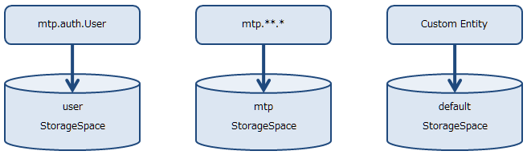
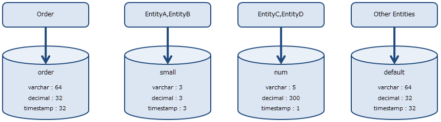
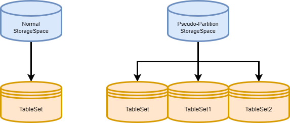
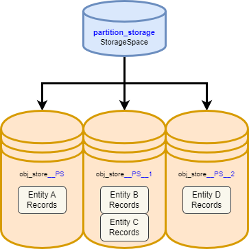

[[ref_storagespace]]
== StorageSpace

=== StorageSpaceについて
iPLAssでは、AdminConsoleなどを利用して、動的にEntityの定義を変更することが可能です。 +
これら動的に定義されたEntityのデータは、<<../../serviceconfig/index.adoc#StoreService, StoreService>>に定義されたStorageSpaceに格納されます。

.標準のStorage Space設定
iPLAssの初期設定では３つのStorageSpaceが定義されています。

[source,xml]
----
<!-- Entity Store Settings -->
<service>
  <interface>org.iplass.mtp.impl.datastore.StoreService</interface>

  <property name="dataStore" class="org.iplass.mtp.impl.datastore.grdb.GRdbDataStore">
    <property name="storageSpace">
      <property name="storageSpaceName" value="default" />
      ・・・・・
    </property>
    <property name="storageSpace">
      <property name="storageSpaceName" value="mtp" />
      <property name="tableNamePostfix" value="MTP" />
      ・・・・・
    </property>
    <property name="storageSpace">
      <property name="storageSpaceName" value="user" />
      <property name="tableNamePostfix" value="USER" />
      ・・・・・
    </property>
  </property>
</service>
----

どのStorageSpaceにデータを保存するかはEntity単位で指定します。
iPLAssの標準Entityであるmtp配下のEntityは以下のStorageSpaceに保存されるようになっています。

[format="dsv",options="header"]
|===
Entity:Storage Space
mtp.auth.User:user
それ以外のEntity(mtp.**.*):mtp
|===

CAUTION: 標準で定義されているStorageSpace `user` 、 `mtp` については、基盤としての利用を前提にしているため、
アプリで作成するEntityでは利用しないでください。

アプリで作成するEntityについては、通常StorageSpaceが未指定のため `default` というStorageSpaceに保存されます。

StorageSpaceの機能として、アプリで独自のStorageSpaceを追加することも可能になっています（service-config単位、Tenant単位ではありません）。

独自のStorageSpaceを定義することで
====
* 一部大量データが格納されるEntityと、その他のEntityをそれぞれ別のStorageSpace(物理テーブル)に格納することができる
* 各StorageSpace単位で物理テーブルの特性を変更することが可能なので、Entityの特性毎にうまく使い分ければ、
RDB上のテーブルスペースが効率的に利用され、RDBのファイルサイズを小さくすることができる
* StorageSpace毎にパーティション定義内容を変更することができる
* EntityのPropertyに対して `Store Col Name` を指定することで、
プロパティデータの物理格納カラムを独自で定義したテーブルカラムに直接格納することができる。 +
これを利用して複合Indexの定義などのRDBネイティブの機能を利用することができる
====
などのカスタマイズが可能になります。

.StorageSpace の決定タイミング

Entity の StorageSpace が決定するタイミングは、次の３パターンです。

. Entity 作成時
.. Entity 作成時に、StorageSpace `default` が設定されます。
. Entity の StorageSpace 変更時
.. StorageSpace 設定の変更のみ行われます。
.. 運用で利用中でデータが存在する Entity の StorageSpace を変更する場合は、データの移行が必要となります。<<datamanagement_notes_on_storage_space_changes,StorageSpace変更時の注意点>>を参照ください。
. <<../support/index.adoc#storage_space_migration,バッチツール - Storage Space Migration>> によるデータ移行時
.. ツール実行時に、StorageSpace 設定の変更および、データ移行を行います。

次は、このStorageSpace定義を実際に構成するテーブル構造について説明します。

[[datamanagement__table_structure]]
==== テーブル構造
StorageSpaceはそれぞれで以下のテーブルセットで構成されます。

[cols="1,3",options="header"]
|===
|テーブル名|用途
|obj_store .2+|Entityのデータを格納する汎用テーブル。動的なEntity定義に対応するため予め複数のカラムが定義されている。 +
rbは削除データの格納用。
|obj_store_rb
|obj_ref .2+|Entityデータ間の参照情報を格納するテーブル。 +
rbは削除データの格納用。
|obj_ref_rb
|obj_unique_str .5+|UniqueIndexが設定されたプロパティ値を格納するテーブル群。 +
プロパティ型に合わせて、それぞれ定義されている。
|obj_unique_ts
|obj_unique_num
|obj_unique_dbl
|obj_unique_date
|obj_index_str .5+|Indexが設定されたプロパティ値を格納するテーブル群。 +
プロパティ型に合わせて、それぞれ定義されている。
|obj_index_ts
|obj_index_num
|obj_index_dbl
|obj_index_date
|===

このテーブルセットがStorageSpaceごとに必要になります。

この中でも重要となるのが `obj_store` テーブルです。

「obj_store」は
====
* Entityとして定義されるすべてのデータが格納される
* 汎用的に利用するため、あらかじめ文字列型、数値型、日付型、浮動小数点型それぞれ、複数のカラムが定義されている
* Index、UniqueIndex付のカラムもあらかじめ定義されている
* Entityのプロパティはいずれかのカラムに自動的にマッピングされる +
（テナント、Entity単位で、それぞれどのカラムにどのプロパティ値が格納されるかは異なる）
* 事前にテーブルに定義されているカラム数以上のプロパティがEntityに定義された場合、PageNoを用いて1データを複数行に格納する。
====
という役割を持っています。

実際にデータが格納されるイメージを示します。

.データの格納イメージ

[cols="12*1",format="psv",options="header"]
|===
5+|制御用共通カラム 4+|プロパティ値格納用汎用カラム 3+|Index値格納カラム
|(TenantID)|(Entity定義ID) 2+|(oid)|(name) 2+|文字列Property 2+|数値Property 3+|IndexProperty
|tenant_id|obj_def_id|obj_id|pg_no|obj_name|STR_1|STR_2|NUM_1|NUM_2|ISTR_1|ISTR_2|・・・
|1|Product|00001|0|productA|string101|string202||110|istring101|istring102|
|1|Product|00002|0|productB|string201|string202||210|istring201|istring202|
|1|Product|00003|0|productC|string301|string302||310|istring301|istring302|
|1|QA|00001|0|qa001|aaa|bbb|||||
|1|QA|00001|1||ccc|ddd|||||
|1|QA|00002|0|qa002|eee|fff|||||
|1|QA|00002|1|||ggg|||||
|1|Point|00001|0|point1|OK||100||||
|1|Point|00002|0|point2|NG||200||||
|===

NOTE: Entityに定義されるPropertyの型ごとの数に対して、事前にテーブルに定義された各型ごとのカラムが足りなくなった場合は、
pg_noを利用して、複数レコードで保持します。 +
Query(EQL)を利用して検索されるときは、基盤内部で自動的に自己結合することで疑似的に１レコードとして返しています。

このようにiPLAss基盤内の仕様に沿った汎用的なテーブルを利用して、動的に定義されたEntityのプロパティデータを格納し、
EntityManagerを通してデータを制御しています。

次は、 `obj_store` テーブルに対する仕様について説明します。

[[datamanagement__spec_of_obj_store]]
==== obj_storeの仕様
EntityManagerでEntityデータを制御するために、`obj_store` テーブルの構造は一定の仕様(制約)があります。

テーブルは「システム共通項目(変更不可)」、「UniqueIndex値格納カラム」、「Index値格納カラム」、「Property値格納汎用カラム」に分かれます。
このうち「システム共通項目(変更不可)」以外は、service-configの `storageSpace` 定義と関連します。

標準で定義されている `default` StorageSpaceをもとに説明します。

NOTE: ここではMySQLの標準設定を例に説明します。RDBによって標準で定義されている値は異なります。

[source,xml]
----
<!-- Entity Store Settings -->
<service>
  <interface>org.iplass.mtp.spi.datastore.StoreService</interface>

  <property name="dataStore" class="org.iplass.mtp.impl.datastore.grdb.GRdbDataStore">
    ・・・・
    <property name="storageSpace">
      <property name="storageSpaceName" value="default" />
      <property name="varcharColumns" value="64" />
      <property name="decimalColumns" value="32" />
      <property name="timestampColumns" value="32" />
      <property name="doubleColumns" value="16" />
      <property name="useExternalIndexedTable" value="true" />
      <property name="indexedVarcharColumns" value="5" />
      <property name="indexedDecimalColumns" value="4" />
      <property name="indexedTimestampColumns" value="4" />
      <property name="indexedDoubleColumns" value="4" />
      <property name="useExternalUniqueIndexedTable" value="true" />
      <property name="uniqueIndexedVarcharColumns" value="2" />
      <property name="uniqueIndexedDecimalColumns" value="2" />
      <property name="uniqueIndexedTimestampColumns" value="2" />
      <property name="uniqueIndexedDoubleColumns" value="2" />
    </property>
    ・・・・
  </property>
</service>
----

各Propertyについて説明します。

[cols="1,4", options="header"]
|===
| 設定項目 | 設定内容
| storageSpaceName | Entity定義で選択する際に表示されるStorage Space名を指定します。 +
標準で、 `default` 、 `mtp` 、 `user` が定義されているので、それ以外の名前を指定してください。
| tableNamePostfix a| StorageSpace用のテーブルに付加する接尾語を指定します。英数字のみ利用してください。 +
標準で、 `default` 、 `mtp` 、 `user` が定義されているので、それ以外の名前を指定してください。 +
 +
[red]#「テーブル構造」で説明したテーブルセットの各テーブル名に、ここで指定したPostfixを追加したテーブルが必要になります。# +
 +
obj_storeの場合、
----
"obj_store" + __ + Postfix
----
となります。アンダースコア―を２つでつなげます。 +
例えば、 `mtp` StorageSpaceの場合は、`obj_store__mtp` となります。 `obj_index` 、`obj_unique_index` なども同様です。
| varcharColumns | 文字列型のプロパティを格納するための列数を指定します。 +
ここで指定した数分、「STR_1」、「STR_2」、「STR_n」の列が必要になります。
| decimalColumns | Decimal型のプロパティを格納するための列数を指定します。 +
ここで指定した数分、「NUM_1」、「NUM_2」、「NUM_n」の列が必要になります。
| timestampColumns | Timestamp型のプロパティを格納するための列数を指定します。 +
ここで指定した数分、「TS_1」、「TS_2」、「TS_n」の列が必要になります。
| doubleColumns | 浮動小数点型のプロパティを格納するための列数を指定します。 +
ここで指定した数分、「DBL_1」、「DBL_2」、「DBL_n」の列が必要になります。
| useExternalIndexedTable | この設定はobj_storeのルールとは直接関係はありません。 +
 +
StorageSpaceにおける外部INDEXテーブル（`obj_index` 系テーブル）を利用するかを指定します。デフォルトは `true` です。
| indexedVarcharColumns | Index指定された文字列型のプロパティを格納するための列数を指定します。 +
ここで指定した数分、「ISTR_1」、「ISTR_2」、「ISTR_n」の列が必要になります。
| indexedDecimalColumns | Index指定されたDecimal型のプロパティを格納するための列数を指定します。 +
ここで指定した数分、「INUM_1」、「INUM_2」、「INUM_n」の列が必要になります。
| indexedTimestampColumns | Index指定されたTimestamp型のプロパティを格納するための列数を指定します。 +
ここで指定した数分、「ITS_1」、「ITS_2」、「ITS_n」の列が必要になります。
| indexedDoubleColumns | Index指定された浮動小数点型のプロパティを格納するための列数を指定します。 +
ここで指定した数分、「IDBL_1」、「IDBL_2」、「IDBL_n」の列が必要になります。
| useExternalUniqueIndexedTable | この設定はobj_storeのルールとは直接関係はありません。 +
 +
 StorageSpaceにおける外部INDEXテーブル（`obj_unique_index` 系テーブル）を利用するかを指定します。デフォルトは `true` です。
| uniqueIndexedVarcharColumns | Unique Index指定された文字列型のプロパティを格納するための列数を指定します。 +
ここで指定した数分、「USTR_1」、「USTR_2」、「USTR_n」の列が必要になります。
| uniqueIndexedDecimalColumns | Unique Index指定されたDecimal型のプロパティを格納するための列数を指定します。 +
ここで指定した数分、「UNUM_1」、「UNUM_2」、「UNUM_n」の列が必要になります。
| uniqueIndexedTimestampColumns | Unique Index指定されたTimestamp型のプロパティを格納するための列数を指定します。 +
ここで指定した数分、「UTS_1」、「UTS_2」、「UTS_n」の列が必要になります。
| uniqueIndexedDoubleColumns | Decimal型のプロパティを格納するための列数を指定します。 +
ここで指定した数分、「UDBL_1」、「UDBL_2」、「UDBL_n」の列が必要になります。
| customPartition a| この設定はobj_storeのルールとは直接関係はありません。 +
 +
ただしMySQLの場合、自動でPartitionが拡張できないので、テナント作成用ToolであるTenantManagerで
テナントを作成・削除する際にPartitionの作成・削除を行っています。
その際、この設定が `true` のStorageSpaceについてはPartitionに対する処理を行いません。 +
 +
Partitionを利用する場合に、標準のPartitionと異なるPartitionを利用するかを指定します。
デフォルトが `false` のため、標準のPartitionの場合は指定する必要はありません。 +
 +
標準のPartitionとは
----
obj_store${tableNamePostfix}_テナントID
----
の命名規則に則って、テナント単位でPartitionを作成しているものです。
|===

.Entityのプロパティ型と列の型の対応について
EntityのPropertyで指定された型によって、以下のカラムに値が格納されます。

[cols="1,4",format="dsv",options="header"]
|===
カラムの型:対象となるEntityプロパティの型
Varchar:AutoNumber、Boolean、Select、String、LongText、Binary
Timestamp:Date、Datetime、Time
Decimal:Decimal、Integer
Double:Float
|===

このようにservice-configに定義されたStorageSpace定義に沿った `obj_store` を作成することで、
EntityManagerがEntityデータを自動的に制御します。

=== カスタマイズ
「obj_storeの仕様」に則って `obj_store` テーブルを作成することで、独自のStorageSpaceを利用することができます。

これによって、例えば、
====
* 大量データが格納されるEntityのために `order` StorageSpaceを準備し、
OrderEntityは `order` StorageSpaceに格納する
* プロパティ数が少ないEntity用に `small` StorageSpaceとして、文字列型、数値型、日付型のカラムを３個ずつだけ定義する
* 数値型のPropertyが多いEntity用に `num` StorageSpaceとして、数値型のカラムを300個定義して、日付型は1個だけにする
====
など、Entityの特性毎にうまく使い分ければ、RDB上のテーブルスペースが効率的に利用され、RDBのファイルサイズを小さくすることができます。
また、汎用カラム数がオーバーした場合に利用される `pg_no` による疑似レコード化も抑えることができます。

独自のStorageSpaceを作成するには、service-configのStorageSpace定義に対応するStorageSpace用のテーブルセットを作成する必要があります。

このDDLを生成するためのツールとして、「Custom Storage Space」ツールを提供しています。
このツールで生成されたDDLをデータベースに反映すれば、独自のStorageSpaceが利用できるようになります。

ツールの利用方法は <<../support/index.adoc#custom_storage_space, Custom Storage Space>>を参照してください。

=== カラムマッピング
Entityのプロパティ定義では、 `Store Col Name` という属性を指定することができます。 +
この機能は、StorageSpaceに紐づく `obj_store` テーブルに独自のカラムを定義することで、そのカラムにプロパティ値を保存する機能です。

この値が未指定の場合は、プロパティの型とStorageSpace定義をもとにして基盤内部で「Property値格納汎用カラム」に自動的に値を格納します。
言いかえれば、 `Store Col Name` が未指定の場合は、どのカラムにデータが格納されているかはアプリ側では判断できません。

カラムマッピング機能により
====
* 汎用カラムの文字列型は「TEXT」(MySQLの場合)として定義しているが、
独自のカラムでは「VARCHAR(3)」として定義することで、テーブルスペースを効率的に利用できる。
* 独自カラムを指定することで、 `obj_store` のどのカラムに値が格納されるかが判断できる。 +
例えば複合Indexを作成したり、Partitionを作成する際のKEYとして指定することができるなど、RDBネイティブの機能が利用できる。 +
（年度カラムを定義して、テナント＋年度などでPartitionを分けるなど）
====
といったことが可能になります。

極端な例としては、 +
あるEntityに特化したStorageSpaceを作成して、全てのプロパティに対して独自カラムを作成して、
プロパティで `Store Col Name` を定義すれば、「システム共通項目(変更不可)」以外は不要になります。

`obj_store` に対して独自のカラムを作成する場合は、
「カスタマイズ」で説明した手順を実施して作成されたDDLに対して追加してください。

以下の点に注意してください。
====
* カラムの追加が必要なのは `obj_store` 、 `obj_store_rb` (削除データ格納用)テーブルの２つです。 +
このテーブルのカラムは同期している必要があります。（データを物理削除するのみの場合はrbは利用されません）
* 独自で追加するカラムの名前には、「STR_1」「NUM_1」「TS_1」「DBL_1」など、基盤が自動割当てに利用する名前は利用しないでください。
* 多重度を1より大きい値に設定した場合は、設定値にあわせて複数の独自カラムを定義してください。 +
例えば、`Store Col Name`「COL」で多重度「2」の場合、「COL_0」「COL_1」の独自カラムを定義 （連番は0から開始）
====

[[datamanagement__pseudo_partition]]
=== 疑似パーティション

通常 StorageSpace は 1 StorageSpace 1 テーブルセットの構成です。 +
疑似パーティションを設定することで 1 StorageSpace を複数テーブルセットで構成することが可能です。

.通常StorageSpaceと疑似パーティションを構成したStorageSpaceのテーブル構成イメージ
[#entity_storagespace_pseudo_partition]

.特徴
疑似パーティションは以下のような特徴があります。

. テーブルセットのテーブル名の接尾辞として、最後に `__n` という連番が付与されます。
.. 0番目のテーブルには連番の接尾辞は付与されません。1番目のテーブルから連番が付与されます。
.. tableNamePostfix が `PS`, tableCount が `3` を指定された場合の obj_store テーブルは `obj_store\__PS`, `obj_store__PS\__1`, `obj_store__PS__2` の3テーブルを利用します。
.. <<datamanagement__table_structure,テーブル構造>>で説明されている全テーブルを、同様のネーミングで定義し作成します。
. 疑似パーティションが構成されている StorageSpace に Entity を定義した場合、レコードは決定した疑似パーティション位置へデータが格納されます。
.. レコードを格納するテーブルを `obj_store\__PS__1` に決定したら、当該 Entity のレコードは全て同一テーブルに格納されます。（複数の疑似パーティションに跨ることはありません）
.. unique, index テーブルに関しても、同様のネーミングルールのテーブルに格納されます。
... `obj_store\__PS__1` 、 `obj_unique_str\__PS__1` 、 `obj_index_str\__PS__1` 等
.. 疑似パーティション位置は TableAllocator により決定されます。詳細な説明は link:../../serviceconfig/index.html#TableAllocator[ServiceConfig - StoreService - TableAllocator] を参照ください。

.設定方法
service-config ファイルの storageSpace 設定に以下の設定を追加します。

.疑似パーティションを定義するための設定サンプル
[source,xml]
----
<!-- Entity Store Settings -->
<service>
  <interface>org.iplass.mtp.spi.datastore.StoreService</interface>

  <property name="dataStore" class="org.iplass.mtp.impl.datastore.grdb.GRdbDataStore">
    ・・・・
    <property name="storageSpace">
      <property name="storageSpaceName" value="partition_storage" />
      <property name="tableNamePostfix" value="PS" />
      <property name="tableCount"       value="3" /> <1>
      ・・・・・
    </property>
    ・・・・
  </property>
</service>
----
<1> StorageSpace に設定する疑似パーティション数。本説明のように `3` を指定すると3つのテーブルセットで疑似パーティションが構成されます。

.疑似パーティションを定義するための設定サンプルのStorageSpaceとテーブル定義、Entity格納イメージ
[#entity_storagespace_pseudo_partition_example]

設定後に対応するテーブルを作成する必要があります。テーブル定義は <<../support/index.adoc#custom_storage_space,バッチツール - Custom Storage Space>> で作成することができます。

[[datamanagement_notes_on_storage_space_changes]]
=== StorageSpace変更時の注意点
Entity の StorageSpace を変更した場合、登録済のデータは変更後の StorageSpace に移動しません。 +
もし、登録済みのデータを変更後の StorageSpace へ移行する必要がある場合は、以下のいずれかの方法でデータ移行を行ってください。

.データ Export / Import ツールを利用したデータ移行
AdminConsole のツール 「<<../support/index.adoc#tools_entityexplorer,EntityExplorer>>」、「<<../support/index.adoc#tools_packaging,Packaging>>」の Export / Import 機能を利用することで、データを移行します。 +
以下の手順で作業を実施してください。

. 移行対象データの Export
. Export データの削除
.. 変更前の StorageSpace にデータが残るため、削除を実施します。次のいずれかの方法で削除を実施します。
... Entity View からデータを削除
... AdminConsole - EntityExplorer からデータを削除
... <<../support/index.adoc#storage_space_cleaner,バッチツール - Storage Space Cleaner>> でデータをクリア（データが大量にある場合に利用を推奨）
. Entity の StorageSpace を変更
. 移行対象データの Import

.Storage Space Migration ツールを利用したデータ移行
<<../support/index.adoc#storage_space_migration,バッチツール - Storage Space Migration>> を利用することで、StorageSpace の変更および、データ移行を同時に行います。 +
バッチツール内でメタデータを更新するため、起動中のサーバーはメタデータを再読み込みする必要があります。
