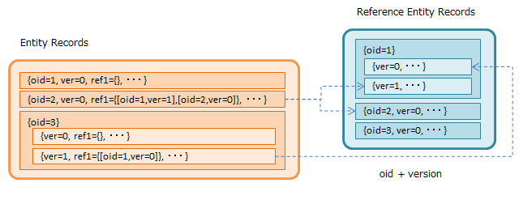
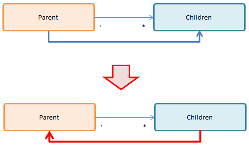

[[ref_property_type]]
=== データ型
データ型を一覧で参照したい場合は、 <<ref_property_type_list>> を参照してください。

==== 基本型の注意点
[[ref_property_string_length]]
===== String型の文字数制約
String型はバックエンドとして利用するRDBの定義によって、格納できる最大文字数が制限されます。
標準の設定の場合、Oracleは `varchar2(4000)` 、MySQLは `TEXT` です。
また文字コードは `UTF-8` なので、全角2000文字でもありません。
もしこの制限に引っ掛かる文字列型を扱う可能性がある場合は `LongText` を利用してください。
LongTextにした場合BLOBとして保存されるため、検索時に制限があります (<<ref_property_longtext_search>>)。

[[ref_property_integer_javaclass]]
===== Integer型のJavaクラス
Entityの検索や更新処理で、Integer型を操作する際は、Longクラスとして値を取得・設定します（Integerクラスではありません）。

[[ref_property_decimal_roundmode]]
===== Decimal型の丸めモード
Decimal型の場合、データの保存時に丸めた値で保存されます。
「丸めモード」には以下の種類があります(`java.math.RoundMode`)。

[cols="1,2",options="header"]
|===
| モード(java.math.RoundMode) | 説明
| UP | 0から離れるようにする(正数切り上げ/負数切り上げ)
| DOWN | 0に近づける(正数切り下げ/負数切り下げ)
| CEILING | 正の無限大に近づける(正数切り上げ/負数切り下げ)
| FLOOR | 負の無限大に近づける(正数切り下げ/負数切り上げ)
| HALF_UP | 四捨五入
| HALF_DOWN | 五捨六入
| HALF_EVEN | 銀行型丸め
|===

[[ref_property_select]]
==== Select
Select型は選択ボックスの選択値ように、登録できる値を「値とラベル」のセットとして予め定義できるPropertyです。
値セットの定義方法は、複数のEntityで共有可能なSelectValueメタデータとして定義する方法(`Global Value`)と、
それぞれのPropertyごとに個別に定義する方法(`Local Value`)の２種類があります。

===== 設定
次の項目を設定可能です。 

[cols="1,4", options="header"]
|===
| 設定項目 | 設定内容
| Global Value | <<ref_selectvalue,SelectValue>>メタデータを指定します。
| Local Value | このPropertyに特化した選択可能項目の {値、ラベル} リストを指定します。
値はString型のため、数値、Boolean値として扱う場合は注意してください。
|===

NOTE: `Global Value` と `Local Value` を共に設定した場合は、 `Local Value` が優先されます
(`Global Value` がクリアされた状態で保存されます)。 +
`Global Value` を利用する場合は、 `Local Value` を全て削除して保存してください。

===== 操作方法
Entityの検索や更新処理で、Select型Propertyを操作する際は、以下のクラスを利用します。

.マッピングクラス
[source,java]
----
org.iplass.mtp.entity.SelectValue
----

.（例）更新処理
[source,java]
----
EntityManager em = ManagerLocator.manager(EntityManager.class);

Entity entity = new GenericEntity("samples.Sample");
entity.setName("xxxxx");

//SelectValueの生成
SelectValue selectValue = new SelectValue("01");    //登録するためだけであれば、valueのみでOK

//SelectValueをPropertyにセット
entity.setValue("select", selectValue);

//登録
String oid = em.insert(entity);
----

.（例）参照処理
[source,java]
----
EntityManager em = ManagerLocator.manager(EntityManager.class);

//検索（load）
String oid = "00001";
Long version  = 0;
Entity entity = em.load(oid, version, "samples.Sample");

//SelectValueの取得
//取得したEntityのPropertyにはSelectValueが設定されている
SelectValue selectValue = entity.getValue("select");

System.out.println(selectValue.getValue() + "=" + selectValue.getDisplayName());
----

===== Select型のソート順
Select型に対するソートは、定義での並び順が適用されます。

.（例）ソート順の設定
[cols="1,3",options="header"]
|===
| value | displayName
| 98 | 未開始
| 01 | 開始中
| 02 | 終了
| 00 | エラー
| 99 | キャンセル
|===

上表の順番で定義した場合、`value` 値でソートせず、定義した順番「未開始 ～ キャンセル」でデータがソートされます。

[[ref_property_autonumber]]
==== AutoNumber
AutoNumber型はEntityデータの登録時に自動的に値を採番するPropertyです。
日付やユーザー情報などを利用した書式設定をすることが可能です。
データ登録時以外値を変更できません(読み取り専用)。

===== 設定
次の項目を設定可能です。

[cols="1,4", options="header"]
|===
| 設定項目 | 設定内容
| 開始値 | 採番を開始する番号を指定します。

既にデータが登録済みの状態でこの値を変更しても、カウンタはリセットされません。
カウンタの値をリセットしたい場合は、<<ref_property_autonumber_reset,リセット機能>>を利用してください。
| 固定桁数 | 桁数を固定したい場合に指定します。
設定された桁数分、ゼロパディングした値が返されます。0を設定した場合はゼロパディングされません。

採番値が固定桁数を超えた場合は、そのまま採番値が利用されます。
| 採番ルール a| 採番する際のトランザクション制御を指定します。

`ALLOW_SKIPPING` 別トランザクションで採番 ::
Entityの登録処理とは別トランザクションで採番するため、登録時の並列実効性は高まります。
ただし採番値のキャッシュや登録エラー時など、採番値の連続性を保証しません。
`STRICT_SEQUENCE` 同一トランザクションで採番 ::
Entityの登録処理と同一トランザクションで採番するため、登録処理はシーケンシャルな処理になります。
採番値の連続性を保証する必要がある場合に指定します。
| 書式 | 登録する値をGroovyTemplate形式で<<ref_property_autonumber_format,書式指定>>することができます。
|===

[[ref_property_autonumber_format]]
===== 書式設定
書式で利用可能なバインド変数は以下のものです。

[cols="1,3",options="header"]
|===
| バインド変数 | 設定される値
| nextVal() | 次の採番された番号。最大桁数は18桁です。nextValの引数に採番単位とする `UnitKey` 値を指定することで、
そのKey値単位で番号を採番することも可能です。
| yyyy | 年
| MM | 月
| dd | 日
| HH | 時、24h表記
| mm | 分
| ss | 秒
| date | java.sql.Timestampのインスタンス
| entity | 登録対象のEntityデータ
| user | 登録者User情報。 `${user.xxxx}` としてUserエンティティのプロパティを指定できます。
|===

未指定の場合、採番された値が設定されます( `${nextVal()` と同等)。

.（例）書式設定
[source,Groovy]
----
// `2018-01-01-0000001001` のようになります。 
${yyyy}-${MM}-${dd}-${nextVal()}

// 年月単位で採番されます。
${nextVal(yyyy+MM)}

// select1というSelect型(SelectValue)プロパティの値単位で採番されます。
${nextVal(entity.select1.value)}
----

[[ref_property_autonumber_reset]]
===== カウンタのリセット
Entityデータを他の環境からエクスポート/インポートで移行した場合は、内部で保持しているカウンタ値をリセットする必要があります。

AutoNumber型自体はUnique制約とはなっていないため、移行後の環境で重複した値が採番されてもエラーにはなりません。
AutoNumber型Propertyに対して、 `OID` や `Unique Index` を指定している場合は、重複が発生したタイミングでエラーになります。

====== AdminConsoleでのリセット
AdminConsole上は `Current Value` ボタンをクリックすることで、現在のカウンタ値の一覧を表示します。 +
リセットしたい `UnitKey` 行の `Value` を変更して保存してください。

NOTE: `UnitKey` を利用していない場合、 `UnitKey` は空で表示されます。 +
`UnitKey` を利用している場合、他環境からデータを移行したタイミングでは一覧上にはデータが存在しません。
行を追加して値を設定してください。 +
既に登録されている `UnitKey` の行を削除することはできません。

====== ソースでのリセット
ソース上から直接現在値の取得やリセットを行いたい場合は、 `EntityDefinitionManager` を利用します。

[source,Java]
----
//現在値の取得
EntityDefinitionManager#getAutoNumberCurrentValue(String definitionName, String propertyName);
EntityDefinitionManager#getAutoNumberCurrentValue(String definitionName, String propertyName, String subUnitKey);

//UnitKeyを利用している場合に、プロパティ内の全ての現在値を返します
EntityDefinitionManager#getAutoNumberCurrentValueList(String definitionName, String propertyName)

//リセット
EntityDefinitionManager#resetAutoNumberCounter(String definitionName, String propertyName, long startsWith);
EntityDefinitionManager#resetAutoNumberCounter(String definitionName, String propertyName, String subUnitKey, long startsWith);
----

[[ref_property_expression]]
==== Expression
Expression型は四則演算やCase文、スカラーサブクエリ(結果が1つになるクエリ)など、
Query機能の `Value Expression` として指定可能な式を設定することができるPropertyです。

===== 設定
次の項目を設定可能です。

[cols="1,4", options="header"]
|===
| 設定項目 | 設定内容
| Result Type | 式の結果として返す値のProperty型を指定します。未指定の場合はString型です。
| 式 | 指定可能な式は、Queryの `Value Expression` として有効な式になります。
|===

.（例）四則演算以外の例
[source,EQL]
----
case
  when integer1 = 50 then '△△△'
  when integer1 = 80 then '○○○'
  else '×××'
end
----

[source,EQL]
----
integer1 /  (select sum(integer1) from samples.Sample)
----

[source,EQL]
----
case
  when 50 = (select integer1 + integer2 from sample.Sample on .this=this)  then '△△△' <1>
  when 80 = (select integer1 + integer2 from sample.Sample on .this=this)  then '○○○'
  else '×××'
end
----
<1> thisはoidとほぼ同じ意味です。逆に `.oid=oid` という表現は不可となっています。

NOTE: 四則演算で参照するプロパティの多重度が1以外の場合、正確な計算が実行されません。
多重度が1のプロパティに対してのみ利用してください。

[[ref_property_binary]]
==== Binary
Binary型は画像や文書ファイルなどのバイナリデータを扱うためのPropertyです。

===== 設定
Binary型に特化した設定項目はありません。

===== 操作方法
Entityの検索や更新処理で、Binary型Propertyを操作する際は、以下のクラスを利用します。

.マッピングクラス
[source,java]
----
org.iplass.mtp.entity.BinaryReference
----

.（例）更新処理
バイナリファイルをEntityに登録する場合は、BinaryReferenceを生成したうえでEntityにセットします。

[source,java]
----
EntityManager em = ManagerLocator.manager(EntityManager.class);

Entity entity = new GenericEntity("samples.Sample");
entity.setName("xxxxx");

//BinaryReferenceの生成
BinaryReference bin = null;
try (FileInputStream is = new FileInputStream(file)){

	//EntityManagerを利用してBinaryReferenceを生成
	bin = em.createBinaryReference(file.getName(), "image/gif", is);
} catch (FileNotFoundException e) {
	throw new ApplicationException("ファイルが取得できません。", e);
}

//生成したBinaryReferenceをEntityにセット
entity.setValue("binary", bin);

//登録
String oid = em.insert(entity);
----

.（例）参照処理
Entityを検索したタイミングではBinaryReferenceとしてPropertyに値がセットされています。
BinaryReferenceにはバイナリ自体は格納されていません。
BinaryReferenceに紐づくバイナリを取得したい場合はEntityManagerを利用して取得します。

[source,java]
----
EntityManager em = ManagerLocator.manager(EntityManager.class);

//検索
String oid = "00001";
long version  = 0;
Entity entity = em.load(oid, version, "samples.Sample");

//BinaryReferenceの取得
//取得したEntityのPropertyにはBinaryReferenceが格納されている
BinaryReference bin = entity.getValue("binary");

//System.out.println(bin.getLobId()
//        + ", name=" + bin.getName() + ", type=" + bin.getType());

//バイナリの取得(Fileとして取得する場合)
//(一時的に)保存したいdirは別途指定すること
File file = new File(dir, bin.getName());

//EntityManagerを利用してバイナリのInputStreamを取得
try (FileOutputStream fos = new FileOutputStream(file);
    InputStream is = em.getInputStream(bin);
) {
    //この例では「org.apache.commons.io.IOUtils」を利用
	IOUtils.copy(is, fos);
} catch (IOException e) {
	throw new ApplicationException("ファイルが取得できません。", e);
}
----

.（例）Web画面での参照処理
Webの画面上に表示させるような場合はimgタグを利用します。
imgタグで指定するActionを別途作成し、Resultのタイプとして `Stream` を指定します。
RequestContextに対してResultの `StreamAttributeName` に指定したAttributeにBinaryReferenceをセットすることで、
画像を表示することが可能になります。
（ResultのStreamタイプを利用することで、自身でStreamを取得する処理が不要になります）

この一連の実装は以下を参考にしてください。

* Template例 +
jsp/gem/generic/editor/binary/BinaryPropertyEditor_View.jsp

* Action例 +
gem/binary/download +
+
このActionクラスはJava Commandクラスに指定されたアノテーションから作成されたものです。
JavaCommandクラスは以下です。 +
+
org.iplass.gem.command.binary.DownloadCommand

===== ユーティリティ機能
Binaryに対する最大ファイルサイズやMagicByteチェックの実行可否、ウィルススキャンの実行可否を
mtp-service-config.xmlのWebFrontendServiceで定義できます。 +
設定内容の詳細は、link:../../serviceconfig/index.html#WebFrontendService[WebFrontendService]を参照してください。

またBinaryの永続化方法として、RDB(BLOBデータ)として保存するか、サーバ上にファイルとして保存するかを
mtp-service-config.xmlのLobStoreServiceで定義できます。 +
設定内容の詳細は、link:../../serviceconfig/index.html#LobStoreService[LobStoreService]を参照してください。

[[ref_property_longtext]]
==== LongText
LongText型はString型ではサイズが足りない場合(<<ref_property_string_length,String型の文字数制限>>)などの
テキストデータを扱うためのPropertyです。
内部的にBinary型同様Lobまたはファイルとして管理しているため、検索時に制限があります。

===== 設定
LongText型に特化した設定項目はありません。

[[ref_property_longtext_search]]
===== LongText型の検索
LongTextについては、EQLを利用した検索条件の指定は完全にはできません。
LongTextに対する完全な検索機能を提供する場合は、 <<ref_fulltext_search>> 機能を利用します。
このため汎用検索画面においても検索条件としてLongText型のPropertyは表示されません。

ただし、mtp-service-config.xmlにてPropertyServiceの設定を行うことで、先頭から一定文字数分の検索が可能になります。 +
設定内容の詳細は、link:../../serviceconfig/index.html#PropertyService[PropertyService]を参照してください。

[[ref_property_reference]]
==== Reference
Reference型はEntity間の参照関係を定義するためのPropertyです。
RDBではSQLのJoinを利用してTable間の結合を定義しますが、
iPLAssのEntityではプロパティとして参照関係を定義する事で同等の機能を実現します。

===== Referenceの構造
<<ref_property_oid>> で少し触れましたが、Reference型は参照しているEntityの `oid` と `version` を保持します。

この参照関係を利用することで、参照元のEntityを検索する際に参照先のEntity情報を取得できます。

NOTE: EQLではFrom句でDBのJoinのように複数Entityを結合することができません。
RDBのJoinと同様の機能をEQLで実現する場合には、対象Entityに対するReferenceプロパティを作成します。
作成したReferenceプロパティをSelect句に指定したり、Where条件で絞り込むことができます。 +
(<<ref_property_expression>>型など、Select句に対してスカラーサブクエリとして他Entityを参照することは可能です)

[[ref_property_reference_mappedby_overview]]
===== 「参照」（「順参照」）と「被参照」
Reference型には、指定した参照Entityに対する「順参照」と「被参照」という概念があります。

「順参照」は、当Entity（Referenceを定義しているEntity）が、参照Entityの、どのデータを利用するかを保持するための、当Entityの更新対象属性として扱う目的で定義します。
ですので当Entityデータを更新する際には、Entityに対してReference値を指定して更新する必要があります。

「被参照」は、当Entityが、参照Entityの、どのデータによって参照されているかを把握する目的で定義します、いわば逆引きです。
ですので当Entityを更新する際に、「被参照」として定義したPropertyに対して値を設定しても、参照関係が作成されるわけではありません。
「被参照」Propertyを定義することで、参照される側（この場合「被参照」Propertyを定義した当Entity）から参照Entityデータを取得することが可能になります。

「順参照」か「被参照」かは「被参照Property」を指定するかで決まります。

====
「被参照Property」が未指定の場合 :: 「参照Entity」に対して「順参照」（「参照Entity」を参照する）
「被参照Property」を指定した場合 :: 「参照Entity」に対して「被参照」（「参照Entity」から「被参照Property」名で参照される）
====

===== 設定

次の項目を設定可能です。

[cols="1,4", options="header"]
|===
| 設定項目 | 設定内容
| 参照Entity | 参照関係にあるEntityを指定します。
| 参照関係 | 参照するEntityとの参照関係を指定します。 +
詳細は<<ref_property_reference_reference_type,参照関係の指定>>を参照してください。
| 被参照Property、 +
操作履歴を被参照側のEntityに記録 |
このEntityが参照関係にあるEntityから参照される側（被参照）の場合に指定します。 +
詳細は<<ref_property_reference_mappedby>>を参照してください。
| 参照先のバージョン | 参照先のデータとして取得するバージョンのポリシーを指定します。 +
詳細は<<ref_property_reference_version_control_type>>を参照してください。
| ソート条件 | このPropertyの多重度が1以外の場合に、どの順番で取得するかを指定します。
参照先EntityのPropertyに対して、昇順／降順を指定します。
|===

[[ref_property_reference_reference_type]]
===== 参照関係の指定
参照するEntityとの関係を指定します。
指定されたタイプによって、EntityデータCRUD時の動作が変わります。

`ASSOCIATION` 通常の参照 ::
参照先Entityと特別な関係を持ちません。
このEntityデータが削除された場合、参照先のEntityデータは削除されません。
`COMPOSITION` 親子関係 ::
参照先Entityを子として参照します。
このEntityデータが削除された場合、参照先のEntityデータも削除されます。

[[ref_property_reference_mappedby]]
===== 被参照Propertyの指定
iPLAssでは、参照する側がReference型のプロパティで参照先のEntityを指定することで、参照関係を構築します。
この状態だと、参照される側がどのEntityから参照されているかを把握することができません。
参照される側が参照しているEntityを把握したい場合に「被参照Property」を利用します。
「被参照Property」をSelect句などで利用することで、参照している側の情報を取得できます。

NOTE: 「被参照Property」に指定可能なPropertyは、「参照Entity」で指定したEntityのProperty定義に存在する
当Entityが参照先になっているReferencePropertyです。

====== 操作ログを被参照側のEntityに記録
参照情報の実態は参照する側のEntityにあります。
このため参照先EntityのCRUD操作に関する操作ログは、参照する側のEntityに保存されます。
参照される側で参照先の操作ログを把握したい場合は、「操作ログを被参照側のEntityに記録」を `true` に設定します。

NOTE: この設定が有効になるのは、「被参照Property」を指定した場合です。(未指定の場合、有効になりません)

この機能の主な利用用途としては <<ref_property_reference_point>>があります。

[[ref_property_reference_version_control_type]]
===== 参照先バージョンの指定
参照先のEntityがバージョン管理されている場合に、参照データとして取得するバージョンのポリシーを指定します。

NOTE: 参照先のEntityがバージョン管理していない場合は、バージョンは0で上書きされるため、
ここで指定した値は意味がありません。

`CURRENT_BASE` 最新バージョンを取得 ::
参照先のEntityの最新バージョン(同一oid)のデータを取得します。
`RECORD_BASE` 保存時のバージョンを取得 ::
データが保存された時の参照先のEntityのバージョン（同一oid）のデータを取得します。
保存後に参照先のEntityデータが更新されても、参照する情報は保存時の状態のまま変わりません。
`AS_OF_EXPRESSION_BASE` 特定のバージョンを取得 ::
基準値に指定した条件を満たす参照先のEntityのバージョン（同一oid）のデータを取得します。

====== 基準値の指定
「特定のバージョンを取得」を指定した場合、バージョンを特定するための基準値を指定します。
基準値は参照先Entityのバージョン管理方式により設定する値が異なります。

`NUMBER BASE` の場合 ::
参照元Entityの数値Property名(versionなども指定可能)、または直接数値のリテラルを指定します。
`TIME BASE` の場合 ::
参照元Entityの日時Property名(createDateなども指定可能)、または直接日時のリテラルを指定します。

===== 操作方法
Entityの検索や更新処理で、Reference型Propertyを操作する際は、以下のクラスを利用します。

.マッピングクラス
[source,java]
----
org.iplass.mtp.entity.Entity
----

.（例）更新処理
[source,java]
----
EntityManager em = ManagerLocator.manager(EntityManager.class);

Entity entity = new GenericEntity("samples.Sample");
entity.setName("xxxxx");

//Reference用Entityの生成(登録済みであれば検索して取得してもOK)
//Entityの実装クラスGenericEntityを利用
Entity refEntity = new GenericEntity("samples.RefEntity");
refEntity.setOid("xxxxx");  //oidとversionをセットしておけばOK
refEntity.setVersion(0);
//生成したReference用EntityをEntityにセット
entity.setValue("reference", refEntity);

//MultipleのReference用Entityの生成(配列でセット)
List<Entity> multiReferences = new ArrayList<Entity>;
Entity refsEntity1 = new GenericEntity("samples.RefEntity");
refsEntity1.setOid("xxxxx");
refsEntity1.setVersion(0);
multiReferences.add(refsEntity1);
Entity refsEntity2 = new GenericEntity("samples.RefEntity");
refsEntity2.setOid("xxxxx");
refsEntity2.setVersion(0);
multiReferences.add(refsEntity2);

//参照が1件の場合でもEntityの配列でセット
entity.setValue("multiReference", multiReferences.toArray(new Entity[0]));

//登録
String oid = em.insert(entity);
----

.（例）参照処理
多重度が1以外の場合の検索時は、loadとsearchEntityで挙動が異なります。 +
load時はEntityの配列で返ってきますが、searchEntity時はSearchResultの結果として、
紐付いているEntityの件数分別々のEntityレコードとして返ってきます。 +
(SearchResultで返ってくるListが、Referenceとして紐づいているEntityの件数分になる)

[source,java]
----
EntityManager em = ManagerLocator.manager(EntityManager.class);

//検索(load)
String oid = "00001";
long version  = 0;
Entity entity = em.load(oid, version, "samples.Sample");

//Reference Entityの取得
Entity refEntity = entity.getValue("reference");
Entity[] multiRefEntity = entity.getValue("multiReference");

//検索(searchEntity)
Query query = new Query()
	.select("multiReference.oid", "multiReference.name")
	.from("samples.Sample")
	.where(new Equals("oid", oid));

SearchResult<Entity> result = em.searchEntity(query);

System.out.println("result size = " + result.getList().size());

result.getList().forEach(entity2 -> {
    Entity multiRefEntity2 = entity2.getValue("multiReference");
});
----

このsearchEntityの仕様により、汎用検索画面ではデフォルトとして多重度が1以外のReference Propertyは出力対象としていません。
汎用検索画面の設定で多重度が1以外のReference項目を検索結果として表示するように定義した場合は、同一のoidで複数のレコードが表示されます。

[[ref_property_reference_point]]
===== 参照関係を定義する際の考慮
Entityに対して「順参照」用のReferenceプロパティを定義すると、当Entityデータの更新時に、
参照しているEntityデータ件数分の属性(oid、versionのセット)を更新しなおします。
参照先Entityの件数が少ない場合は特にレスポンス的な問題は発生しませんが、参照先Entityが大量の場合はレスポンスにも影響があります。

例えば、親子関係があるEntityで子側のEntityが大量の件数となるような場合は、子から親に「順参照」の定義をすることも１つの方法です。

この場合、親Entityの属性は親Entityの属性のみ更新するような画面を作成して対応する必要があります。
子Entityからみると親Entityに対する参照関係は1なので、更新時のレスポンスも問題ありません。

====== 親Entityで排他制御する場合
上のように、子Entityから親Entityに対して「順参照」を定義した場合、子Entityを更新しても親Entityは更新されません。
複数の子Entityを同時に更新する可能性がある場合に、親Entity側で排他制御を行いたい時はこのままだと制御できません。

これを回避するには子Entityの更新時に親Entityを強制的に更新させます。
更新処理は子EntityのEventListenerか独自に作成したCommandで行います。
EventListenerでの実装がActionやCommandなどをカスタマイズする必要がないので容易ですが、
1処理の中で複数の子Entityを一括で親Entityに紐づけるような場合は、EventListenerではなくCommandで実装してください。 +
(EventListenerで実装した場合、子Entityの件数分、親Entityを更新する処理が実行されることになります)

.（例）EntityEventListenerで参照Entityを強制的に更新する(Script形式)
EventListenerの `beforeInsert` `beforeUpdate` `beforeDelete` で以下のScriptを実行します。

[source,Groovy]
----
import org.iplass.mtp.ManagerLocator;
import org.iplass.mtp.entity.EntityManager;
import org.iplass.mtp.entity.Entity;
import org.iplass.mtp.entity.UpdateOption;

EntityManager em = ManagerLocator.manager(EntityManager.class);

//parent取得(親Entityをparentプロパティとして参照している場合)
Entity parent = entity.getValue("parent");  //対象EntityはentityとしてListenerにバインドされている

//System.out.println("parent oid=" + parent.getOid() + ",version=" + parent.getVersion());

//更新Optionを生成
UpdateOption option = new UpdateOption();
//更新Propertyを設定（例：更新日）。なにかを指定しないとNullPointerが発生する
option.setUpdateProperties(Entity.UPDATE_DATE);

//強制更新設定(変更がなくても更新)
option.setForceUpdate(true);

//parentの更新
em.update(parent, option);
----

====== 被参照時の操作ログについて
子から親に「順参照」を定義する場合、ユーザーがデータを操作するための詳細画面としては
子Entityの詳細画面をメインで利用するという使い方が多いと思います。
このとき詳細画面上に操作ログを表示した場合、親Entityの操作ログは子Entityの操作ログ上には表示されません。

そこで、親Entityの操作ログを子Entityの操作ログにも出力する機能が「操作履歴を被参照側のEntityに記録」チェックです。
親EntityのPropertyとして、子Entityに対する「被参照」を定義して、「操作履歴を被参照側のEntityに記録」をチェックすることで、親Entityの操作ログが子Entityの操作ログに記録されるようになり、子Entityの詳細画面から親Entityの操作ログが参照可能になります。
