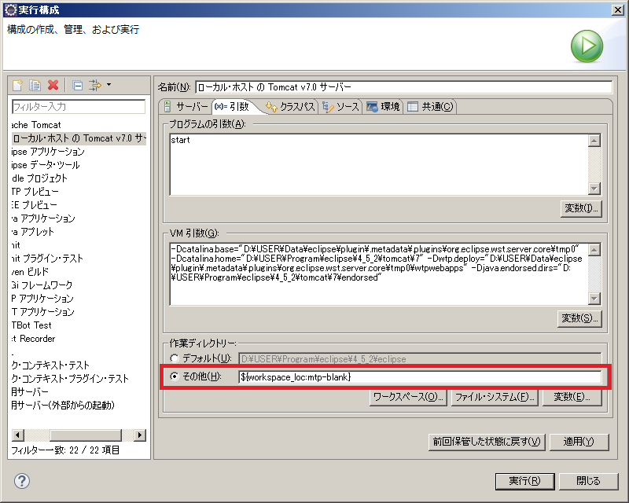
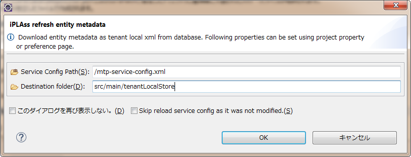

= Eclipse plugin
:_hreflang-path: developerguide/eclipseplugin/index.html
:_relative-root-path: ../../

//EclipsePluginのreadmeをベースに

[CAUTION]
====
Gradle Plugin のリリースに伴い Eclipse Plugin は非推奨になりました。機能は将来削除される予定です。 +
今後は <<../gradleplugin/index.adoc#top,Gradle Plugin>> を利用してください。
====

== Eclipse pluginについて

iPLAssのデフォルト設定では各種メタデータはRDBで管理されます。
RDBで管理する場合、バージョン管理による履歴は残りますが、各バージョン間の差異等は分かりません。
そのため複数の開発者で更新を繰り返すと、変更点が分かりにくくなるというデメリットがあります。

これを解消する方法として挙げられるのが、ファイル（XML形式）によるメタデータの管理と、ソース管理システム（git、svn等）を活用したバージョン管理になります。

iPLAssにはメタデータをXMLファイルとして出力する機能があります。
このXMLファイルを管理可能な形でローカルプロジェクトに取り込むツールとして、Eclipse Pluginを提供しています。

== 動作環境

* Eclipse MARS(4.5), Neon(4.6), Oxygen(4.7)/Windows64bit版
* iPLAss3.0以降

== インストール

link:https://iplass.org/downloads/[こちら^] からダウンロード可能です。ダウンロード後、 +
plugins/org.iplass.mtp.eclipse_[バージョン].v[ビルド日時].jarを +
[Eclipseインストールフォルダ]/pluginsに追加してください。 +
以前のバージョンのjarファイルが存在する場合は、以前のバージョンのjarファイルを削除します。

== メタデータの取り込み
以下の手順で開発用のテナント（RDB）からローカルのプロジェクト内にメタデータを移行します。

. メタデータのエクスポート +
テナントローカルのメタデータを、AdminConsoleのMetaDataExplorerからエクスポートします。

. service-configの編集 +
アプリケーションが利用しているservice-configにて、MetaDataRepositoryの設定を変更します。
tenantLocalStoreプロパティのコメント化を解除します。
CompositeMetaDataRepository内のstoreプロパティにXmlFileMetaDataRepositoryが定義されているので、その中のlocalTenantIdに開発用のテナントのIDを設定します。
また必要に応じてファイル出力先（fileStorePath及びgroovySourceStorePath）を変更します。

. メタデータのインポート +
Eclipseのメニューやプロジェクトのコンテキストメニューからインポートを選択します。
ウィザードが表示されるのでiPLAss＞iPLAss MetaData Importと選択します。
「Source MetaData File」にエクスポートしたメタデータファイルを選択します。
「宛先プロジェクト」と「Service Config Path」を選択した後、完了ボタンを押します。
+
インポートが完了すると、XmlFileMetaDataRepositoryのfileStorePathで指定したディレクトリに種類毎に分割されたメタデータファイルが格納されます。

=== Tomcat実行時の設定
XmlFileMetaDataRepositoryのfileStorePath及びgroovySourceStorePathに相対パスを設定している場合、Eclipse WTPプラグインのTomcatワーキングディレクトリの設定変更が必要です。
サーバ＞ローカルホストでのTomcat v9.0＞起動構成を開く＞引数タブ＞作業ディレクトリ＞その他 にて設定可能です。以下のようにプロジェクトフォルダを設定してください。
====
例: ${workspace_loc:mtp-blank}
====
これで、インポートしたメタデータファイルをiPLAssが認識できるようになります。
なお、絶対パスで設定している場合は、ワーキングディレクトリの設定は不要です。

////

////

== Entityメタデータの最新化

Entityのメタデータについては、開発用のテナント（RDB）の最新内容を以下の操作で取り込むことができます。

. メタデータの取り込み +
前述の手順で、予め他のメタデータの取り込みを済ませておきます。

. Entityメタデータの最新化 +
プロジェクトのコンテキストメニューからiPLAss＞Reflesh entity metadata from databaseを選択します。
ダイアログで、「Service Config Path」と「Destination folder」を入力して、OKボタンを押します。
+
インポートが完了すると、XmlFileMetaDataRepositoryのfileStorePathで指定したディレクトリにEntityのメタデータファイルが格納されます。

////

////

TIP: アプリケーションが利用しているservice-configにて、XmlFileMetaDataRepositoryやDB接続先の定義を変更していない場合は、Skip reload service config as it was not modified.にチェックを入れることで最新化処理を速くできます。

CAUTION: メタデータの取り込みは、指定したプロジェクトのiPLAssのjarファイルが利用されます。一度取り込みすると、Eclipse実行中は他のプロジェクトのjarファイルには切替えできません。切替えたい場合は、Eclipseを再起動してください。

== Git/SVNの利用
Git/SVN等のソース管理システムを利用することで、メタデータの変更管理ができるようになります。

競合や差分が発生した場合、EclipseのGit pluginやSVN pluginを利用し、変更内容の確認やマージ、コミット等を行ってください。
