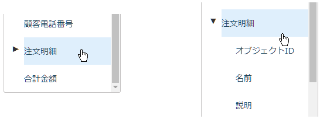
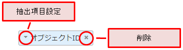

[[operationguide]]
== 操作説明

=== 画面構成

=== 画面操作
==== データアイテム選択
.エンティティ選択
エンティティをドロップダウンから選択します。選択すると `アイテム` 部分にプロパティが表示されます。

NOTE: 選択可能なエンティティやプロパティはEntityListingメタデータで指定することが可能です。EntityListingメタデータを利用しない場合は、エンティティ権限の設定により参照可能なエンティティやプロパティが表示されます。

.プロパティ選択
`抽出項目` を設定したい場合は、アイテムをダブルクリックするか、 `抽出項目` 領域にドラッグ&ドロップすることで追加されます。

`フィルター条件` に追加したい場合は、フィルター条件下部の「アイテムをドロップしてください」という領域にドラッグ&ドロップすることで追加されます。

プロパティがReferenceプロパティの場合は、左に右向き「▼」が表示されます。
このアイテムをクリックすることでReference対象エンティティのプロパティが表示されます。

==== 抽出項目設定

.列の並び替え
抽出項目の列の順番はドラッグ&ドロップで並びかえることが可能です。

.集計関数設定
抽出項目に対して、集計関数を指定することが可能です。
集計関数として利用できる関数は、ドロップされたアイテムのデータ型によって決まります。

.表示設定
検索結果一覧の表示設定を行うことが可能です。

* 配置設定 +
左寄せ、中央寄せ、右寄せを設定します。未指定の場合、「左寄せ」になります。

* 列幅設定 +
検索結果の表示列幅を設定します。未指定の場合、150pxになります。

* 数値フォーマット設定（集計項目、数値項目のみ） +
数値をフォーマットするかを設定します。 +
未指定の場合、GemConfigServiceの「formatNumberWithComma」がtrueの場合にのみフォーマット表示されます。
GemConfigServiceの「formatNumberWithComma」がtrueの場合で、フォーマット表示したくない場合は、「フォーマットしない」を選択する必要があります。

==== フィルター条件

フィルター条件として指定可能な条件入力方法は、ドロップされたアイテムのデータ型によって決まります。

.条件式
フィルターに条件が１つでも追加されると、 `条件式` の入力エリアが表示されます。
この条件式には各フィルターの組み合わせ条件を指定することができます。

`${フィルタの行番号}` で対象の条件を指定します。

※ 条件式には、カッコ、AND、OR、NOT を利用することができます。

フィルター条件式が未指定の場合は、同一プロパティはOR条件として、他プロパティに対してはAND条件として検索します。

画面の例の場合、条件式が指定されていなければ、
----
 ( 販売ステータス = '準備中' OR 販売ステータス = '販売中' ) AND ( 在庫数 < 500 OR 在庫数 < 100 )
----
となりますが、
----
($1 and $2) or ($3 and $4)
----
を指定した場合は、
----
 ( 販売ステータス = '準備中' AND 在庫数 < 500 ) OR ( 販売ステータス = '販売中' AND 在庫数 < 100 )
----
として検索することができます。

==== 検索条件、検索結果の保存
設定した検索条件や検索結果を保存リストとして保存することができます。保存データは別名での保存も可能です。

まだ保存されていない場合 ::
+
image::images/entitylisting_ope_action-save.png[]

保存されているデータを編集で開いた場合 ::
+

`保存ボタン` をクリックすると、ダイアログが表示されます。

.保存フォルダ
保存リストの名前に表示されているフォルダをクリックすることで、 `保存フォルダ` にフォルダが設定されます。
また `フォルダの作成` から新しくフォルダを作成することができます。

.共有
保存した保存リストを他のユーザーが参照することができるようになります。

.他者編集
保存した保存リストをもとに、他のユーザーが編集画面を表示することができるようになります。
他者編集を許可しない場合は、保存リスト上でデータを参照することはできますが、編集画面には遷移できません。

.保存形式

- 条件を保存 +
条件のみ保存されます。このリストを開くと、保存された条件で最新のデータを検索します。

- スナップショットを保存 +
条件とデータを保存します。このリストを開くと、保存時のデータが表示されます。

※ スナップショットについて +
スナップショットとして保存したデータについては、保存データ編集（検索条件編集）や、保存されたエンティティの参照画面への遷移は行えません。

.条件編集
保存リストとして参照する際に、フィルター条件を変更できるかを指定するものです。
例えば、システム管理者がある特定のデータに対する抽出条件を保存リストとして保存して一般ユーザーに公開したときに、一般ユーザーが検索条件を変更してもいいような場合に利用します。

編集を許可した場合 ::
+

編集を許可しない場合 ::
+

.リスト初期表示
保存リストを画面に表示する際に、同時に検索を実行するかを指定します。
対象のデータ件数が多い場合、または条件の指定を行ってから検索させたい場合など、リスト初期表示を「しない」に設定することで画面表示時に検索を行いません。

※ フォルダやデータの可視範囲について +
フォルダや保存データの他者への可視範囲については、エンティティ権限で制御します。
フォルダは `mtp.listing.SavedListFolder`、保存データは `mtp.listing.SavedList` エンティティに対して権限を設定します。

==== 検索結果一覧
`抽出項目` に `オブジェクトID` が含まれている場合、リンクとして表示されます。
リンクをクリックすることで、エンティティの参照ダイアログが開きます。

※ 対象エンティティの `OID` プロパティをカスタマイズしている場合、 `OID` プロパティが１つのみであれば、その項目に対してもリンクが張られます。
複数項目を利用して `OID` プロパティを指定している場合（複合指定）は、リンク表示されません。

※ EntityListingメタデータを定義することで、 `Name` プロパティに対してもリンクを表示することが可能です。

※ EntityListingメタデータを定義することで、参照時のView指定や編集可能とするかの設定が可能です。
デフォルトでは、 `default` Viewで `編集可` として動作します。
