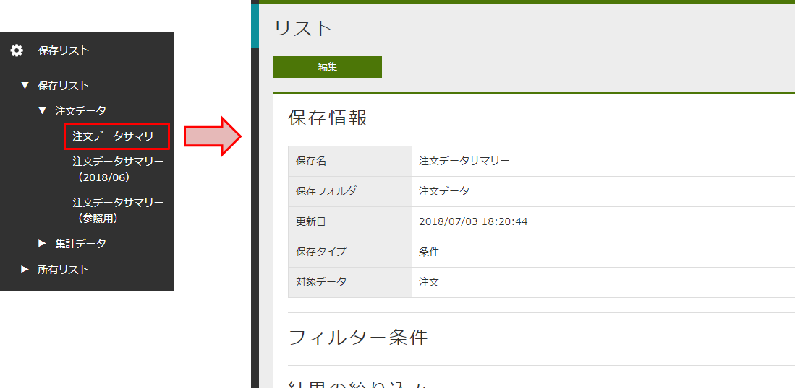
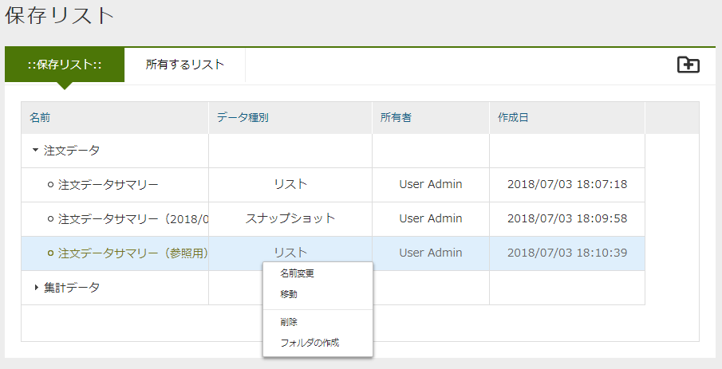
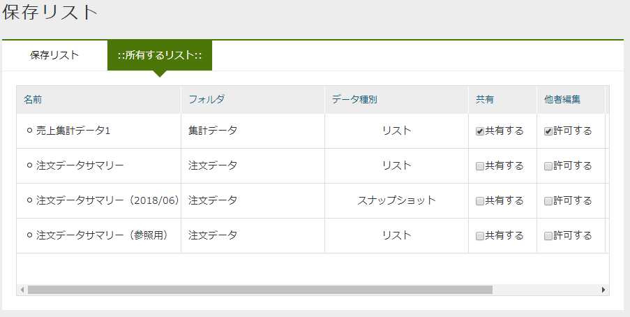
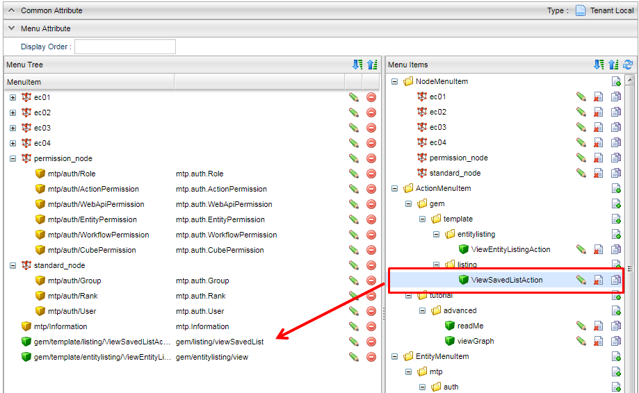
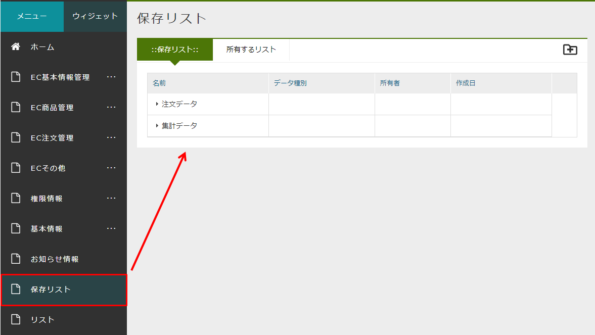
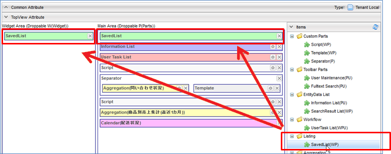

[[savedlist]]
== 保存リスト
保存リスト(SavedList)は、EntityListingや定型集計・簡易BIのローデータを保存、復元する機能です。

.Widget
画面左側のWidget表示エリアに表示されます。

保存リスト:: 他のユーザーが保存している、かつ公開されているデータも含めて表示されます。
所有リスト:: 自分で保存したデータが表示されます。
こちらはフォルダ形式ではありません。

データを選択することで、右側に詳細画面が表示されます。

.Parts
Top画面に表示されます。

保存リストと、所有リストがタブで表示されます。
フォルダの作成や名前変更、削除、保存データの名前変更、削除が可能です。
フォルダや保存データを編集する機能はPartsでのみ提供しています。

`所有するリスト` については、Parts上で `共有` 、 `他者編集` のON・OFFを設定することができます。

[[savedlist_setitng]]
=== 設定
TopViewのSavedListパーツでは以下の設定が可能です。

[cols="1,3", options="header"]
|===
|設定項目
|設定値

|Title
|タイトルをカスタマイズする場合に設定します。

|Icon Tag
|Fontawsomeによるアイコンタグを設定します。

|Class
|スタイルシートのクラス名を指定します。複数指定する場合は半角スペースで区切って下さい。

|visible to top view
|PartsをTop画面に表示するかを設定します（デフォルト：表示） +
Top画面に保存リストPartsを表示したくない場合で、保存リスト機能に対する設定のみを行う場合に表示不可にします。

|can delete other user saved list
|他のユーザーが保存したデータを削除可能かを設定します（デフォルト：不可） +
削除可能とした場合、他者が作成した保存リストのうち、他者編集を許可しているリストが削除できるようになります。

|can create folder
|フォルダを作成可能かを設定します（デフォルト：可） +
作成可能とした場合は、 `保存リスト` のタブに `フォルダの作成` ボタンが表示されます。
またポップアップに `フォルダの作成` が表示されます。

|can delete folder
|フォルダを削除可能かを設定します（デフォルト：不可） +
削除可能とした場合は、ポップアップに `削除` が表示されます。

|can save snapshot type
|スナップショットとして保存可能かを設定します（デフォルト：可） +
OFFにした場合は、条件として保存されます。

|can csv download
|CSV Downloadが可能かを設定します（デフォルト：可）

|can direct csv download
a|保存リストの一覧画面から直接CSV Downloadを許可するかを設定します（デフォルト：不可） +
可能とした場合は、ポップアップに `CSV Download` が表示されます。 +
またCSV Download時に文字コードを指定する場合は、TopViewの
<<../genericentitymanager/topview/index.adoc#csvdownload, CsvDownload Settings>> で設定します。

CAUTION: 保存リストの詳細画面では、対象となるAggregationやEntityListing定義のCSV Download可否設定をチェックして
CSV Downloadボタンの表示を制御していますが、保存リスト一覧上ではこのチェックは行いません
(それぞれの保存データをロードする必要があるためパフォーマンスを考慮してチェックしていません)。
許可されていない保存リストについてはWARNログを出力後、空のCSVファイルが出力されます。

|run a search when loading detailed data
|保存リストを表示する際に、初期検索を行うかのデフォルト値を設定します。

|link action mode
|保存データのリンクをクリックした際に、ダイアログで表示するか画面遷移するかを指定します（デフォルト：ダイアログ） +
`画面遷移` を選択した場合は、右クリックで別タブ表示などが行える状態になります。

|Interrupter Class
|保存リスト上のフォルダやアイテムの表示制御をカスタマイズしたい場合に、カスタマイズ処理を実装したJavaクラスまたはUtilityClassを指定します。
指定するClassは `org.iplass.mtp.view.top.parts.listing.SavedListInterrupter` を実装する必要があります。
詳細は<<savedlist_customize, カスタム処理の組み込み>>を参照してください。

|Edit Custom ViewScript
|保存リストの保存画面内に埋め込むカスタムコード(HTML)を設定できます。GroovyTemplateとして定義します。

|===

[[viewsavedlist]]
=== 表示方法
==== メニューへの登録
TopViewの一部としてではなく、専用の保存リスト画面を表示したい場合は、保存リスト画面表示用のActionを利用します（メニューにActionMenuItemを登録します）。

フォルダの作成や他ユーザーの作成したデータの削除など、標準動作を変更しない場合は、ActionMenuItemにあらかじめ登録されている `ViewSavedListAction` という雛型のメニューアイテムをメニューに追加してください。

この設定によりメニューに `保存リスト` が追加され、保存リスト画面を起動することができます。

標準動作を変更したい場合、ActionMenuItemをコピーし、下記パラメータを指定する必要があります。

[cols="1,3", options="header"]
|===
|Key
|設定値

|listingTitle
|画面タイトルをカスタマイズする場合に設定します。

|canDelete
|他のユーザーが保存したデータを削除可能かを設定します（デフォルト：false） +
削除可能とした場合は、 `保存リスト` のタブに `削除` ボタンが表示されます。 +
削除不可とした場合は、 `所有するリスト` タブ側のみ `削除` ボタンが表示されます。

|canCreateFolder
|フォルダを作成可能かを設定します（デフォルト：true） +
作成可能とした場合は、 `保存リスト` のタブに `フォルダの作成` ボタンが表示されます。

|linkActionMode
|保存データのリンクをクリックした際に、画面遷移するかを指定します（デフォルト：DIALOG） +
`画面遷移` にする場合は、 `SCREEN_TRANSITION` を指定してください。 +
`画面遷移` の場合は、右クリックで別タブ表示などが行える状態になります。
|===

==== TopViewでの表示
TopViewの一部として保存リストを表示させたい場合は、以下のようにItemをドロップしてください。

Widget、Parts、または両方を設定することができます。
この設定によりTop画面から保存されたデータを参照することができます。

[[savedlist_customize]]
=== カスタム処理の組み込み
保存リスト上に表示されるフォルダやアイテムの表示制御や、変更、削除などの更新制御はEntity権限により制御されます。
カスタム処理を実装することでEntity権限での制御に加えてユーザーごとやフォルダごとの詳細なカスタマイズが可能になります。

以下のインターフェースを実装したJavaクラスまたはUtilityClassを作成してください。
作成したクラスを保存リストパーツの `Interrupter Class` に指定します。

====
org.iplass.mtp.view.top.parts.listing.SavedListInterrupter
====

.処理一覧
[cols="1,1,1,3a",options="header"]
|===
|メソッド
|引数
|戻り値
|処理内容

|needFolderPathInfo
|－
|boolean +
デフォルト: `false`
|権限チェック時にフォルダ情報を必要とするかを返します。
`true` を返した場合、フォルダまたはアイテムに対するパス情報を引数で渡します。
フォルダの場合、自身のフォルダは含まれません。

.2+|getPermission
|folder : SavedListFolder
.2+|SavedListFolderPermission +
デフォルト: `SavedListFolderPermission.ALL_PERMIT` (全許可)
.2+|フォルダに対する権限を返します。
ルートの場合は `folder` が `null` で実行されます。
`folder` に対して、参照、更新、削除、サブフォルダ作成、アイテム作成の権限を返します。 +
`needFolderPathInfo` で `true` を返した場合、 `path` にルートからのフォルダ情報が渡されます。
|path :List<SavedListFolder>

.2+|getPermission
|savedList : SavedList
.2+|SavedListPermission +
デフォルト: `SavedListPermission.ALL_PERMIT` (全許可)
.2+|アイテムに対する権限を返します。
`savedList` に対して、参照、更新、削除の権限を返します。 +
`needFolderPathInfo` で `true` を返した場合、 `path` にルートからのフォルダ情報が渡されます。
|path :List<SavedListFolder>
|===

.SavedListInterrupterの例
`SavedListInterrupter` 上、全ての処理に対してデフォルト実装されています。
必要に応じてオーバーライドします。

[source,java]
----
package sample.listing;

import org.iplass.mtp.listing.SavedList;
import org.iplass.mtp.listing.SavedListFolder;
import org.iplass.mtp.view.top.parts.listing.SavedListFolderPermission;
import org.iplass.mtp.view.top.parts.listing.SavedListInterrupter;
import org.iplass.mtp.view.top.parts.listing.SavedListPermission;

import org.iplass.mtp.auth.AuthContext;

public class SampleSavedListInterrupter implements SavedListInterrupter {

	@Override
	public boolean needFolderPathInfo() {
		//権限チェックの判断でフォルダ情報が欲しい場合はtrue
		//trueの場合、引数でルートからのパス情報が渡される
		return true;
	}

	@Override
	public SavedListFolderPermission getPermission(SavedListFolder folder, List<SavedListFolder> path) {

		//Adminは全て許可
		if (AuthContext.getCurrentContext().getUser().isAdmin()) {
			return SavedListFolderPermission.ALL_PERMIT;
		}

		if (folder == null) {
			//ルートフォルダは参照のみ
			return new SavedListFolderPermission(true, false, false, false, false);
		}

		if (folder.getName().equals("test")) {
			//testフォルダは非表示
			return SavedListFolderPermission.NO_PERMIT;
		}

		//pathを利用して階層による制御

		if (path == null) {
			//１階層目は「Public」の場合はフォルダ作成、アイテム作成許可
			if (folder.getName().equals("Public")) {
				return new SavedListFolderPermission(true, false, false, true, true);
			} else {
				//それ以外は参照のみ
				return new SavedListFolderPermission(true, false, false, false, false);
			}
		}

		//２階層以上の場合、一階層目が「Public」であれば、全て許可
		if (path.get(0).getName().equals("Public")) {
			return SavedListFolderPermission.ALL_PERMIT;
		} else {
			//それ以外は参照のみ
			return new SavedListFolderPermission(true, false, false, false, false);
		}
	}

	@Override
	public SavedListPermission getPermission(SavedList savedList, List<SavedListFolder> path) {

		//Adminは全て許可
		if (AuthContext.getCurrentContext().getUser().isAdmin()) {
			return SavedListPermission.ALL_PERMIT;
		}

		if (savedList.getFolder() == null) { // またはpath == null
			//ルートフォルダ直下のアイテムは非表示
			return SavedListPermission.NO_PERMIT;
		}

		if (savedList.getFolder().getName().equals("test1")) {
			//test1フォルダのアイテムは参照のみ
			return new SavedListPermission(true, false, false);
		}

		//pathを利用して階層による制御

		//２階層以上の場合、一階層目が「Public」であれば、全て許可
		if (path.get(0).getName().equals("Public")) {
			return SavedListPermission.ALL_PERMIT;
		} else {
			//それ以外は参照のみ
			return new SavedListPermission(true, false, false);
		}
	}

}
----
