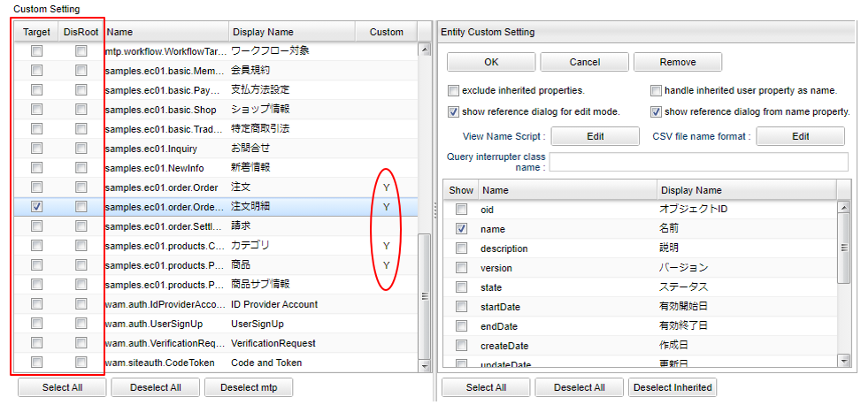
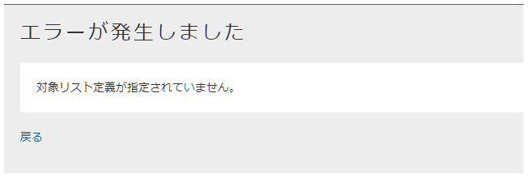

[[entitylisting_management]]
== EntityListingの管理

[[create_entitylisting]]
=== EntityListingの作成
EntityListingアイコンを右クリックして、「EntityListingを作成する」を選択してください。

[[entitylisting_setting]]
=== 設定
メタデータを定義しなくてもEntityListing機能自体は実行することが可能です。 +
ただし、ユーザーによって利用可能なエンティティやプロパティを制御したい場合には、EntityListingメタデータを作成します。

[[entitylisiting_defaultsetting]]
==== Default Setting
ここでの設定は、下のCustom Settingを設定していないエンティティに対してデフォルトで適用される設定です。

[cols="1,5a", options="header"]
|===
|設定項目|設定値
|exclude mtp entities
|選択可能なエンティティから「mtp.*」を除外します。
下のCustom Settingでエンティティを1つでも選択している場合は、そちらが優先されます。

|exclude inherited properties
|選択可能なプロパティとして継承プロパティを除外します。
下のCustom Settingでエンティティ別にプロパティ設定をしている場合は、そちらが優先されます。
選択した場合、オブジェクトIDが選択可能なプロパティとして選択できなくなるため、エンティティの参照画面が開けなくなります。
（エンティティ定義でOIDプロパティを独自指定している場合は可能です）

|to edit the narrowing condition, as dialog
|抽出項目に集計関数がある場合に利用可能な絞り込み条件(Having条件)の指定方法を設定します。

ダイアログモードの場合::
絞り込みボタンが表示され、クリックで結果の絞り込みを行うダイアログを表示

直接編集モードの場合::
フィルタの下に絞り込み対象を指定する領域を表示

|handle inherited user property as name
|エンティティの「作成者」、「更新者」、「ロックユーザー」を名前で扱います。
Filter条件に指定する場合は、Userエンティティを選択します。
検索結果、ファイルには名前が出力されます（ただしソートはOIDで比較します）。

|display user name in privileged execution
| `handle inherited user property as name` がチェックされている場合、ユーザー名を特権実行で取得します。
それによりユーザー情報のEntity、またはユーザー名のプロパティに参照権限が無いユーザーでもユーザー名を表示することが可能です。

|use saved list
| 保存リストを使用します。 +
未選択の場合、フィルター条件と結果の絞り込みの「保存リストから」を選択不可になります。編集画面に「リストに保存」、「保存」と「別名で保存」ボタンは表示されません。

|show reference dialog for edit mode
|エンティティの参照画面を開く際に編集可能モードで開くかを指定します。 +
下のCustomSettingでエンティティ別に設定をしている場合は、そちらが優先されます。

|show reference dialog from name property
|抽出項目として「name」プロパティを指定した際に、参照画面のリンクを表示するかを指定します。 +
下のCustomSettingでエンティティ別に設定をしている場合は、そちらが優先されます。

|can file download
|条件編集画面で「Download」を利用できるかを指定します。 +
保存リストの詳細画面上で「Download」を許可するかは、TopViewの「SavedList」Partsで行う必要があります。

|file multiple format
|ファイルダウンロード時の多重度が複数のプロパティの出力形式を指定します。

Each Column::
多重度の数分別々の列に出力します。

One Column::
１つの列にカンマ区切りでまとめて出力します。

One Column Fill Null::
１つの列にカンマ区切りでまとめて出力します。
登録データが多重度分保存されていない場合にも多重度分空を補完します。

|File type
|ダウンロードで利用するファイル形式を指定します。

CSV::
CSVファイルを利用します。

EXCEL::
EXCELファイルを利用します。

SPECIFY::
CSVファイルかEXCELファイルのどちらを利用するかを画面で選択します。

未指定の場合は、<<../../serviceconfig/index.adoc#EnterpriseGemConfigService,EnterpriseGemConfigService>> の `entityListingFileSupportType` によって動作します。

|file name format
|ファイルダウンロード時のファイル名をGroovyTemplate書式を利用して指定します。
詳細は<<el_filenameformat,file name format>>を参照してください。

|use property name in file header
|ファイルヘッダに表示名ではなくプロパティ名を出力します。

|Custom ViewScript
|条件編集画面内に埋め込むカスタムコード(HTML)を設定できます。GroovyTemplateとして定義します。

|Custom JavaScript
|条件編集画面にJavaScriptコードを埋め込みます。 +
コードは<script>タグ内に出力されます。GroovyTemplate形式ではないためバインド変数などは利用できません。

|Query interrupter class name
|実際に検索が実行される直前に、実行するEQLをカスタママイズするためのクラスを指定します。
詳細は<<queryinterrupter, Query Interrupter>>を参照してください。

|===

[[el_filenameformat]]
.file name format
ファイルダウンロード時のファイル名をGroovyTemplate書式を利用して指定します。
フォーマットが指定されている場合、ボタンに「(*)」が表示されます。
また、/とスペースについては、_（アンダースコア）に変換します。

利用可能なバインド変数は、編集ダイアログの「Notes」を参照してください。

.（例）ファイル名の後ろに出力時の時間を付加する。
[source,groovy]
----
${csvName}_${yyyy}${MM}${dd}${HH}${mm}${ss}
----

.（例）保存リストの場合は保存名を先頭に付加する。
[source,groovy]
----
<%
def fileName = entityDisplayName;
if (savedListName != null) {
    fileName = savedListName + "_" + entityDisplayName;
}
%>
${fileName}_${yyyy}${MM}${dd}${HH}${mm}${ss}
----

[[queryinterrupter]]
.Query interrupter
パフォーマンス改善などの目的で、実際に検索を行う直前のEQLをカスタマイズすることが可能です。
以下のQueryInterrupterを実装したJavaクラスまたはUtilityClassを指定します。

----
org.iplass.mtp.view.entitylisting.QueryInterrupter
----

EntityListingの検索では、ページング制御のための件数取得と実際のデータ検索の２回EQLが実行されます。
QueryInterrupterではこの直前にEQLをカスタマイズする処理を追加することができます。

NOTE: スナップショットとして保存されたリストの場合は実行されません。

.処理一覧
[cols="1,1,1,2",options="header"]
|===
|メソッド
|引数
|戻り値
|処理内容

|beforeCount
|QueryContext
|void
|件数取得前処理を行います。

|beforeSearch
|QueryContext
|void
|検索前処理を行います。

.2+|afterSearch
|Object[]
.2+|void
.2+|検索後処理を行います。afterSearchでは1レコード毎に処理が呼ばれます。 +
`QueryContext#getSelectIndex(propertyName)` を利用して、Select句の何番目にプロパティが含まれているかを取得することができます。
|QueryContext
|===

[source,java]
----
package sample.entitylisting;

import org.iplass.mtp.entity.query.Query;
import org.iplass.mtp.entity.query.hint.CacheHint;
import org.iplass.mtp.entity.query.hint.CacheHint.CacheScope;
import org.iplass.mtp.entity.query.hint.TimeoutHint;
import org.iplass.mtp.view.entitylisting.QueryContext;

//実装するIF定義
import org.iplass.mtp.view.entitylisting.QueryInterrupter;

//サンプル用
import org.iplass.mtp.auth.User;

public class SampleQueryInterrupter implements QueryInterrupter{

	//beforeCountとbeforeSearchで渡されるQueryContextはインスタンスが異なります

	@Override
	public void beforeCount(QueryContext context) {

		//QueryContextからQueryを取得
		Query query = context.getQuery();

		//(例)Queryに対してCacheHintを指定
		query.hint(new CacheHint(CacheScope.GLOBAL, 60));

		System.out.println("interrupt result:" + query.toString());

		//(例)Entity権限における限定条件の除外設定
		setWithoutConditionReferenceName(context);
	}

	@Override
	public void beforeSearch(QueryContext context) {

		//QueryContextからQueryを取得
		Query query = context.getQuery();

		//(例)Queryに対してCacheHint、TimeoutHintを指定
		query.hint(new CacheHint(CacheScope.GLOBAL, 60))
		.hint(new TimeoutHint(120));

		System.out.println("interrupt result:" + query.toString());

		//QueryContextからはEntityListing定義名、エンティティ名も取得可能
		System.out.println("target entity listing definition name:" + context.getDefinitionName());
		System.out.println("target entity definition name:" + context.getEntityName());

		//(例)Entity権限における限定条件の除外設定
		setWithoutConditionReferenceName(context);
	}

	@Override
	public void afterSearch(Object[] data, QueryContext context) {
	
		//(例)Userエンティティに対してメールアドレスを検索された場合、値を置き換える
		if (context.getEntityName().equals(User.DEFINITION_NAME)) {

			//Select句にメールアドレスが含まれる場合(含まれない場合はnull)
			if (context.getSelectIndex(User.MAIL) != null) {

				//Select句に同じプロパティを複数指定可能なので配列で返ってくるので、返ってきた分置き換える
				for (int index : context.getSelectIndex(User.MAIL)) {
					data[index] = "*****";
				}
			}
		}
	}

	/**
	 * Entity権限における限定条件の除外設定
	 */
	private void setWithoutConditionReferenceName(QueryContext context) {
	
		//QueryContextに対してWithoutConditionReferenceNameとしてEntity権限における限定条件を除外するプロパティを指定することができる
		
		//EntityListingは対象Entityを選択可能なためデフォルト設定のInterrupterで処理する場合はEntity名をチェック
		//Entity別にInterrupterを定義している場合は特にチェック不要
		
		//対象EntityがUserの場合
		if (context.getEntityName().equals(User.DEFINITION_NAME)) {
			//groupsとrankのEntity権限における限定条件を除外
			context.setWithoutConditionReferenceName(User.GROUPS, User.RANK);
		}
	}

}
----

[[entitylisting_customsetting]]
==== Custom Setting
Default Settingではなく、エンティティ個別に設定を行いたい場合に指定します。

[cols="1,5a", options="header"]
|===
|設定項目|設定値
|Target|参照可能なエンティティを選択します。対象外のエンティティを参照しようとした場合は権限エラーとなります。
１つも選択されていない場合は、Default Settingの `exclude mtp entities` 設定により対象を決定します。
|DisRoot|`Target` 指定されたエンティティのうち、エンティティの選択リストから除外したいエンティティを選択します。
他エンティティの参照先としてのみ検索を許可する場合に指定します。
|Custom| 個別に `Entity Custom Setting` 設定されている場合に「Y」が表示されます。
|===

個別にプロパティなどを絞り込みたい場合は、対象のエンティティをダブルクリックしてください。
右側にエンティティごとの設定項目が表示されます。

[[entitylisting_entitycustomsetting]]
==== Entity Custom Setting

[cols="1,5a", options="header"]
|===
|設定項目|設定値
|exclude inherited properties|選択可能なプロパティとして継承プロパティを除外します。
下のプロパティ選択部分で1件でも選択されている場合は、そちらが優先されます。
|handle inherited user property as name|エンティティの「作成者」、「更新者」、「ロックユーザー」を名前で扱います。
|display user name in privileged execution| `handle inherited user property as name` がチェックされている場合、ユーザー名を特権実行で取得します。
それによりユーザー情報のEntity、またはユーザー名のプロパティに参照権限が無いユーザーでもユーザー名を表示することが可能です。
|show reference dialog for edit mode|エンティティの参照画面を開く際に編集可能モードで開くかを指定します。
|show reference dialog from name property|抽出項目として「name」プロパティを指定した際に、参照画面のリンクを表示するかを指定します。
|View Name|エンティティの参照画面を開く際のView名をGroovyTemplate書式を利用して指定します。
詳細は<<el_viewname, View Nameの指定>>を参照してください。
|file name format|ファイルダウンロード時のファイル名をGroovyTemplate書式を利用して指定します。
「Default Setting」と同様です。
|Without Condition Reference|Entity権限における限定条件を適用せずに検索を実行する参照先プロパティ名を設定します。特権実行する場合、または `Query interrupter class name` の設定がある場合はそちらが優先されます。
|Query interrupter class name|実際に検索が実行される直前に、実行するEQLをカスタママイズするためのクラスを指定します。
未指定の場合は「Default Setting」の設定が有効になります。
詳細は<<queryinterrupter, Query Interrupter>>を参照してください。
|Propertyリスト|選択可能としたいプロパティをチェックしてください。
|===

[[el_viewname]]
.View Nameの指定
エンティティの参照画面を開く際のView名をGroovyTemplate書式を利用して指定します。
値が設定されている場合、ボタンに「(*)」が表示されます。

利用可能なバインド変数は、編集ダイアログの「Notes」を参照してください。

.（例）文字列直接指定
[source,groovy]
----
opeView
----

.（例）GroovyTemplate指定
[source,groovy]
----
<%@import org.iplass.mtp.entity.Entity %>

<%
def viewName = "XXXXXXXXX";
%>

${viewName}
----

検索結果のリンク表示時には、表示対象データのOIDが「oid」としてバインドされています。
Filter条件としてReferenceを指定した場合の参照時はOIDはバインドされません。

=== 表示方法
==== メニューへの登録
条件設定画面を表示するにはメニューにActionMenuItemを登録します。

ActionMenuItemには雛型として `gem/template/entitylisting/ViewEntityListingAction` というメニューアイテムがあります。
このActionMenuItemをコピーしてメニューアイテムを編集してください。

[cols="1,5a", options="header"]
|===
|項目|設定値
|Name|管理しやすいように設定してください。
|DisplayName|メニューの表示名になります。
|Execute Action| `gem/entitylisting/view` を指定してください。
|Parameter| `defName=XXX&entityName=XXX&listedId=XXXX`

defName:: 作成したEntityListingメタデータ名を指定します。
entityName:: 初期表示時に選択したいエンティティ名を指定します。
defNameには表示可能なエンティティを指定する必要があります。
listedId:: 保存されているListを直接編集モードで開きたい場合に保存リストのOIDを指定します。
これが指定された場合、defName、entityNameは無視されます。
またスナップショットのデータは指定できません(編集不可)。
|===

※EntityListingメタデータが１つでも登録されている場合は、雛形の `ViewEntityListingAction` から起動しようとするとエラーが発生します。

もしEntityListingメタデータ定義を１件でも作成した場合は、必ずパラメータに `defName` を指定してください。
