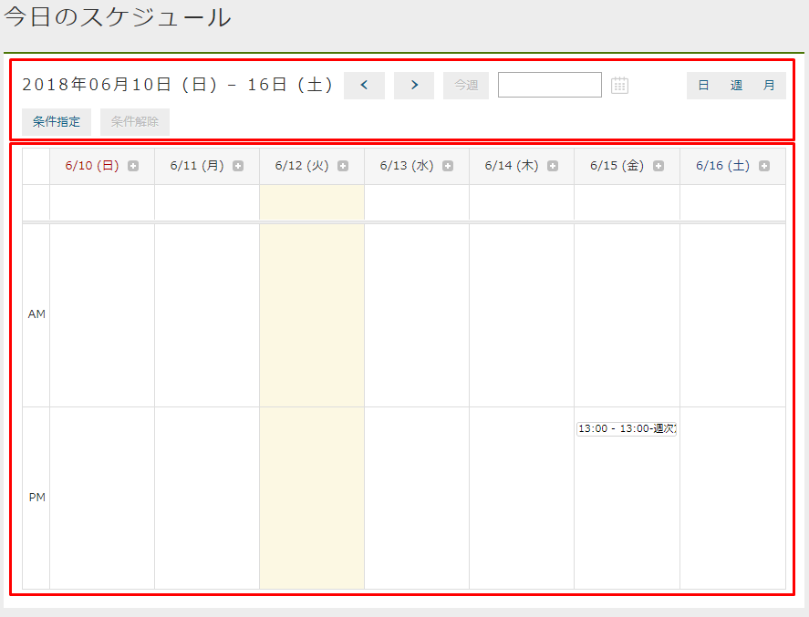
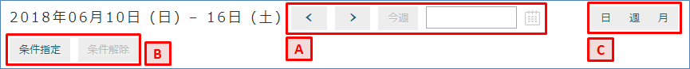
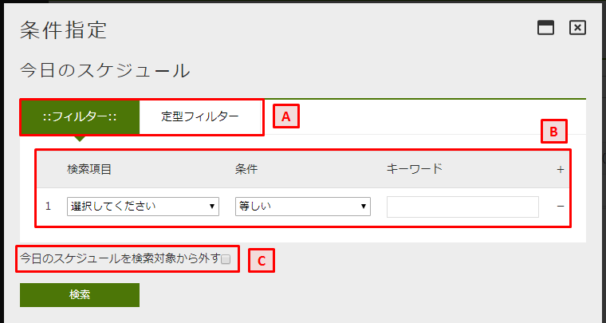
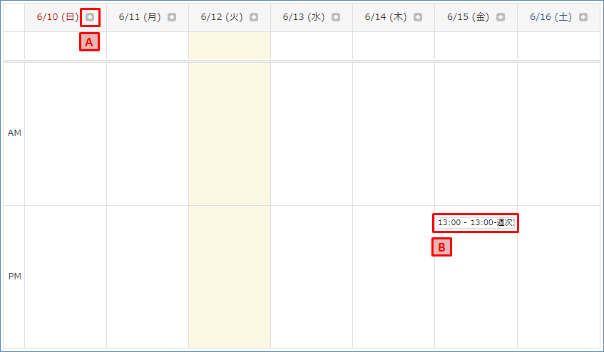
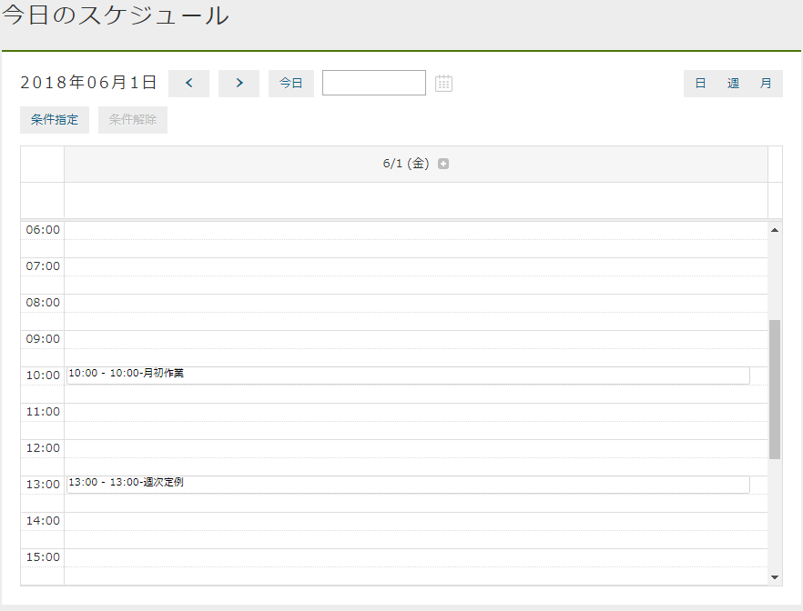
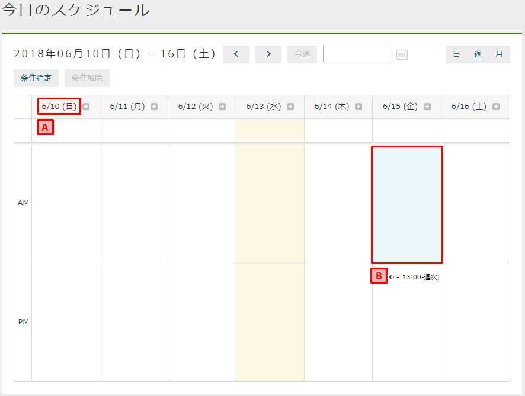
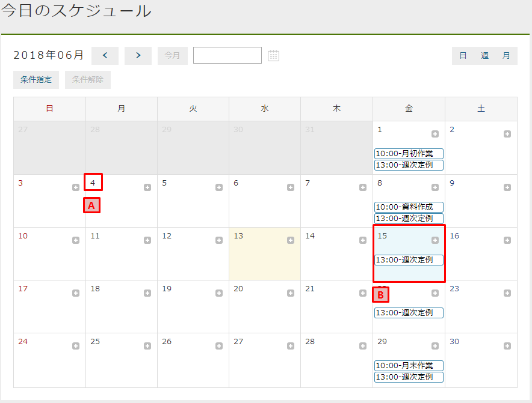

[[operationguide]]
== 操作説明
カレンダーは大きく二つの領域に分かれています。
上部の `表示条件設定` と 下部の `検索結果表示` です。

=== 表示条件設定
`表示条件設定` では、表示するデータを絞り込むための設定を行います。

.A.表示期間の設定
`<` を押すことで前週（日表示の場合は前日、月表示の場合は前月）を、
`>` を押すことで翌週（日表示の場合は翌日、月表示の場合は翌月）の予定を検索します。

`今週` はカレンダーの表示範囲を今週にセットします。
（日表示の場合は `今日` 、月表示の場合は `今月` ）
既に今週のカレンダーを表示している場合は操作できません。

入力フィールドにフォーカスを当てるか、カレンダーアイコンを押すことでカレンダーが表示されます。
カレンダーから日付を選択することで、選択した日（週、月表示時は指定した日付を含む期間）のカレンダーを表示します。

.B.表示条件の設定
`条件指定` を押すことで、表示期間以外の条件を設定す `条件設定画面` を表示します。
`条件解除` を押すまで条件は引き継がれます。

.C.表示タイプの設定
カレンダーの表示範囲を変更します。

日:: 日単位のカレンダーを表示します。
週:: 週単位のカレンダーを表示します。
月:: 月単位のカレンダーを表示します。

==== 条件設定画面
`条件設定画面` ではカレンダーに表示する際の条件を指定できます。

.A.条件設定方法の選択
条件を設定する方法を以下のうちから選択します。

* 項目ごとに設定する +
`フィルター` を選択すると、項目毎に条件を設定できるようになります。
* 固定の検索条件を設定する +
`定型フィルター` を選択すると、予め用意された固定の検索条件（内容の変更は不可）を設定できるようになります。
固定の検索条件の設定はエンティティのフィルターで設定する必要があります。
フィルターが未指定の場合は `定型フィルター` は表示されません。

.B.フィルター条件の設定
`フィルター` 選択時に表示されます。
右側の `+` をクリックすると条件の設定欄を追加できます。
検索項目が同じ場合は `AND` 条件、同じ場合は `OR` 条件となります。

[cols="1,5a", options="header"]
|===
|項目
|内容

|検索項目
|エンティティのプロパティを指定できます。
表示されるプロパティは対象のエンティティの検索画面の項目と同等になります。

|条件
|項目とキーワードに対する条件を設定します。

[cols="1,4", options="header"]
!===
!項目
!内容

!等しい
!プロパティの値とキーワードが完全一致

!等しくない
!プロパティの値とキーワードが不一致

!前方一致
!プロパティの値とキーワードが前方一致

!後方一致
!プロパティの値とキーワードが後方一致

!含む
!プロパティの値とキーワードが含まれる

!含まない
!プロパティの値がキーワードに含まれない

!いずれかと等しい
!プロパティの値とキーワード（カンマ区切り）のいずれかが完全一致

!より小さい
!プロパティの値がキーワードを含まない小さい値

!より大きい
!プロパティの値がキーワードを含まない大きい値

!以下
!プロパティの値がキーワードを含む小さい値

!以下
!プロパティの値がキーワードを含む大きい値

!範囲
!プロパティの値がキーワード（2つの値）の範囲内

!値が設定されている
!プロパティの値がnullではない

!値が設定されていない
!プロパティの値がnull

!===

|キーワード
|検索する値を設定します
|===

.C.除外設定
対象のエンティティを検索対象から除きたい場合に利用します。
複数のエンティティを一つのカレンダーにまとめて表示している場合等に利用します。

=== 検索結果表示
`検索結果表示` では `表示条件設定` で設定した条件を元にカレンダーを表示します。

.A.新規登録
クリックすることでエンティティの登録画面が表示されます。
登録を行うとカレンダー上にデータが表示されます。

.B.詳細表示
クリックすることでエンティティの詳細画面が表示されます。
詳細画面から編集画面を表示し、データを編集することもできます。

=== 日単位のカレンダー
一日単位でカレンダーを表示します。

=== 週単位のカレンダー
日～土曜日までの一週間単位でカレンダーを表示します。

.A.日付
日付をクリックすると、その日付の日単位のカレンダーを表示します。

.B.セルの選択
セルをクリックすると背景色が変わります。
この状態で表示タイプを切り替えると、その日を基準としたカレンダーが表示されます。

=== 月単位のカレンダー
一か月単位でカレンダーを表示します。

.A.日付
日付をクリックすると、その日付の日単位のカレンダーを表示します。

.B.セルの選択
セルをクリックすると背景色が変わります。
この状態で表示タイプを切り替えると、その日を基準としたカレンダーが表示されます。
