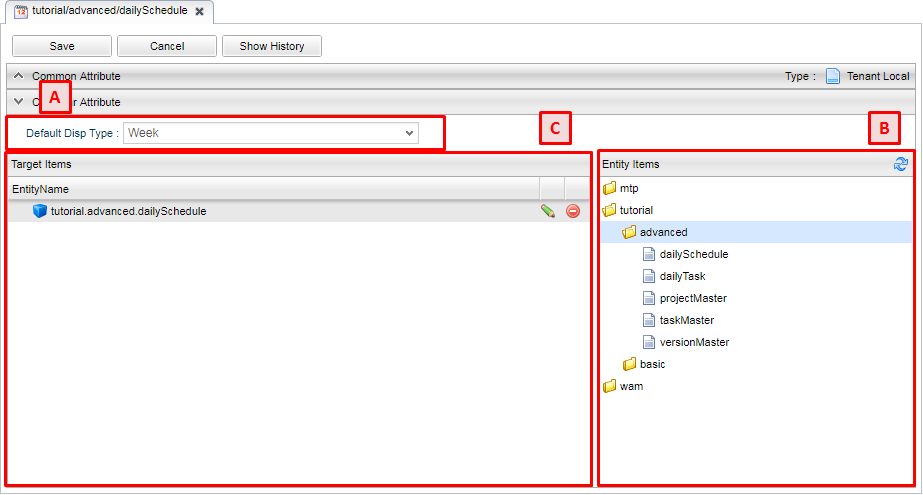

[[calendar_management]]
== Calendarの管理

[[create_calendar]]
=== Calendarの作成
Calendarアイコンを右クリックし、 `Calendarを作成する` を選択します。

[[calendar_setting]]
=== 設定
Calendarの編集画面は3つのパートに分かれます。

.A.カレンダー表示設定
カレンダーの初期表示タイプを設定します。
設定できるタイプは以下になります。 

Day:: 日表示
Week:: 週表示
Month:: 月表示

.B.Entity Items
エンティティが階層表示されます。
対象エンティティ設定へドラッグ&ドロップすることでカレンダーでの利用が可能になります。

.C.対象エンティティ設定
`Entity Items` からドラッグ&ドロップする事で、カレンダーに表示するエンティティを設定できます。

.エンティティの設定
対象エンティティ設定内の各エンティティの編集ボタンをクリックすることで、エンティティ毎に詳細設定ができます。

[cols="1,3a", options="header"]
|===
|項目
|内容

|Entity Name
|カレンダーに表示するエンティティ、変更不可。

|Entity Display Name
|エンティティ表示名、変更不可

|Entity Color
|カレンダーに表示する背景色と枠線の色を設定できます。
色の指定方法はHTML、CSSと同じです。

|Color Config
|GroovyScriptで処理を記述し、色の切り替えの条件を設定可能です。
詳細は<<colorconfig, Color Config>>を参照してください。

|Matching Type
|カレンダーの検索方法を設定できます。
指定できる検索方法は以下になります。

Date:: 日付指定
Period:: 期間指定

|Terget Property(for Date)
|Matching Typeが `Date` の時、検索対象となるプロパティを設定できます。

|From Property(for Period)
|Matching Typeが `Period` の時、開始日時となるプロパティを設定できます。

|To Property(for Period)
|Matching Typeが `Period` の時、終了日時となるプロパティを設定できます。

|Filter Condition
|定型検索条件を設定できます。

|Limit
|一度に検索する上限を設定できます

|show time value
|表示する予定に時間も一緒に表示するように設定できます。

|Detail Action
|詳細画面表示時のactionを設定できます。

|Add Action
|登録画面表示時のactionを設定できます。

|allow new record registration
|レコードの新規登録を許可するかを設定します。

|Entity View
|viewを設定できます。　
|===

[[colorconfig]]
.Color Config
GroovyScriptで処理を記述し、色の切り替えの条件を設定可能です。
EntityColorよりも本設定が優先されます。
下記項目をバインドしています。

[cols="1,3a", options="header"]
|===
|変数名
|バインドされている値

|today
|現在時刻

|propertyName
|Target Propertyの値

|fromPropertyName
|From Propertyの値

|toPropertyName
|To Propertyの値

|entity
|Entity NameのEntityデータ
|===

例えば下記のようなスクリプトを記述することで、期限を過ぎたデータは赤、過ぎていないデータは緑として表示することができます。

[source, Groovy]
----
def diff = today - entity.getValue(toPropertyName);
if (diff >= 1) {
    return "red";
} else {
    return "green"
}
----

[[viewcalendar]]
=== 表示方法
.メニューへの登録
iPLAss基盤で提供している「カレンダー表示」アクションを利用して、ActionMenuItemを作成します。
詳細は<<../menu/index.adoc#actionmenuitem, ActionMenuItem>>を参照してください。

パラメータに何も設定しない場合はカレンダー名がdefaultのものが表示されます。
カレンダーを指定する場合は「calendarName=カレンダー名」をパラメータに指定して下さい。

----
calendarName=sampleCalendar
----

[[viewcalendarparts]]
.Top画面での表示
TopView定義にCalendarパーツを配置することでトップ画面に表示することができます。 
パーツとして配置した場合は、Default Display Typeにあわせた表示になります。
ウィジェットとして配置した場合は、シンプルな月間のカレンダーが表示されます。

[cols="1,4a", options="header"]
|===
|設定項目
|設定内容

|Icon Tag
|Font Awesomeによるアイコン用のタグを設定できます。

|Class
|スタイルシートのクラス名を指定します。複数指定する場合は半角スペースで区切って下さい。

|===

