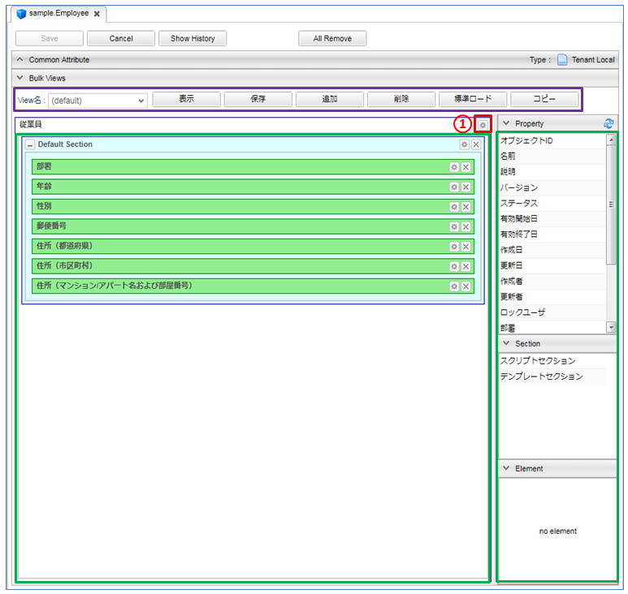

[[bulklayout]]
=== 一括更新画面
一括更新画面のレイアウトをカスタマイズできます。
レイアウト設定を行わない場合、画面には基本項目及び、エンティティに登録されたプロパティが
エンティティ定義上での定義順で表示されます。

[[open_bulklayout]]
==== BulkLayoutの表示
レイアウト設定を行いたいエンティティ名を右クリックし、 `Bulk_Layoutを開く` を選択します。

[[bulklayout_structure]]
==== BulkLayoutの構成
BulkLayoutは以下の構成になっています。

[[bulklayout_toolbar]]
===== ツールバー
紫枠の部分はBulkLayoutの各viewに対する操作を行うためのボタン群です。
詳細は<<searchlayout_toolbar, SearchLayout>>を参照してください。

[[bulklayout_droparea]]
===== 配置エリア
緑枠の部分は各種要素を配置する領域です。
画面右側の `Property` 、 `Section` 内の部品をドラッグ&ドロップで配置できます。
BulkLayoutが作成されてない状態だと、一括更新画面表示時にはエンティティのプロパティが自動で配置されます。
配置エリアに直接配置できるのは `Section` のみとなります。
`Property` については、配置エリアに置かれた `標準セクション` に対してのみとなります。

[[bulkform_setting]]
==== 一括更新画面の設定
図の①部分をクリックすると詳細画面全体に対する設定を行うダイアログが表示されます。

[cols="1,5a", options="header"]
|===
|設定項目
|設定内容

|画面タイトル
|画面に表示するタイトルを入力します。
未入力の場合、エンティティの `Display Name` に設定した内容を画面に表示します。

|ダイアログ表示時に最大化
|チェックした場合、一括更新ダイアログ表示時に最大化します。

|イメージカラー
|ビューのイメージカラー(画面タイトルの左に表示されるアイコンの色)を選択します。次から選択できます。 +
`blue` / `green` / `red` / `yellow` +

フラットデザインでは表示されません

|アイコンタグ
|タイトルの前に表示するiタグなどを利用した独自のアイコンを設定できます。

|更新ボタン表示ラベル
|更新ボタンに表示されるラベルを設定します。

|更新アクション
|更新ボタンクリック時に実行されるアクションを設定します。

|検索条件で更新アクション
|（検索条件で更新）更新ボタンクリック時に実行されるアクションを設定します。

|Javascriptコード
|画面に埋め込むカスタムJavascriptコードを設定します。

|一括更新画面でJavascriptを有効化
|チェックした場合、 `Javascriptコード` に設定したJavascriptが一括更新画面で有効になります。

|ボタン
|カスタムで表示したいボタンを追加します。
詳細は<<detailview_button, ボタン設定>>を参照してください。

|データの多言語化
|データ操作時に多言語化するかを設定します。
有効にした場合、エンティティ定義の `Data Localization` 設定を有効にしてデータアクセスします。

|親子関係の参照を物理削除
|チェックした場合、削除時に親子関係の参照します。
一括更新画面での保存時に削除したデータも物理削除されます。

|更新時に強制的に更新処理を行う
|変更項目が一つもなくとも、強制的に更新処理（更新日時、更新者が更新される）を行います。

|カスタム登録処理クラス名
|登録・更新時にカスタマイズ処理を行いたい場合は `RegistrationInterrupter`
インターフェースを実装するクラスを指定してください。
詳細は<<GemCustomize_Registration, カスタム登録処理>>を参照してください。

|カスタムロード処理クラス名
|エンティティのロード時にオプション等のカスタマイズを行いたい場合は `LoadEntityInterrupter`
インターフェースを実装するクラスを指定してください。
詳細は<<GemCustomize_Load, カスタムロード処理>>を参照してください。

|===

[[bulklayoutt_setting]]
==== 一括更新画面のレイアウト設定

===== プロパティ
<<property_setting, プロパティの設定>> を参照してください。

===== スクリプトセクション
<<scriptsection, スクリプトセクション>> を参照してください。

===== テンプレートセクション
<<templatesection, テンプレートセクション>>を参照してください。
テンプレートで `Request` から利用可能な変数、関数は以下の通りです。
====
value:: 一括更新する項目の値が格納されたエンティティ
searchCond:: 検索画面での検索条件
====

