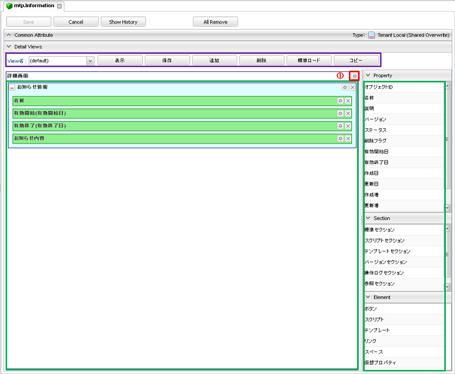
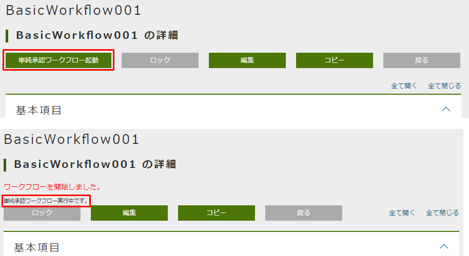
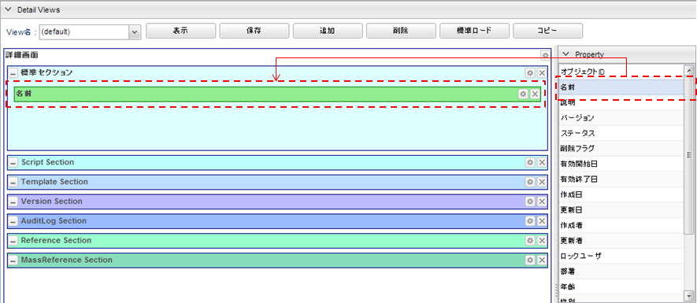

[[detaillayout]]
=== 詳細・編集画面
詳細・編集画面のレイアウトをカスタマイズできます。
レイアウト設定を行わない場合、画面には基本項目及び、エンティティに登録されたプロパティが
エンティティ定義上での定義順で表示されます。

[[open_detaillayout]]
==== DetailLayoutの表示
レイアウト設定を行いたいエンティティ名を右クリックし、 `Detail_Layoutを開く` を選択します。

[[detaillayout_structure]]
==== DetailLayoutの構成
DetailLayoutは以下の構成になっています。

[[detaillayout_toolbar]]
===== ツールバー
紫枠の部分はDetailLayoutの各viewに対する操作を行うためのボタン群です。
詳細は<<searchlayout_toolbar, SearchLayout>>を参照してください。

[[detaillayout_droparea]]
===== 配置エリア
緑枠の部分は各種要素を配置する領域です。
画面右側の `Property` 、 `Section` 、 `Element` 内の部品をドラッグ&ドロップで配置できます。
DetailLayoutが作成されてない状態だと、詳細画面表示時にはエンティティのプロパティが自動で配置されます。
配置エリアに直接配置できるのは `Section` のみとなります。
`Property` と `Element` については、配置エリアに置かれた `標準セクション` に対してのみとなります。

[[detailform_setting]]
==== 詳細画面の設定
図の①部分をクリックすると詳細画面全体に対する設定を行うダイアログが表示されます。

[cols="1,5a,1", options="header"]
|===
|設定項目
|設定内容
|適用画面

|画面タイトル
|画面に表示するタイトルを入力します。
未入力の場合、エンティティの `Display Name` に設定した内容を画面に表示します。
|

|イメージカラー
|ビューのイメージカラー(画面タイトルの左に表示されるアイコンの色)を選択します。次から選択できます。 +

`blue` / `green` / `red` / `yellow`

フラットデザインでは表示されません。
|詳細画面 +
編集画面

|アイコンタグ
|タイトルの前に表示するiタグなどを利用した独自のアイコンを設定できます。
|詳細画面 +
編集画面

|ダイアログ表示時に最大化
|チェックした場合、参照ダイアログ、編集ダイアログ表示時に最大化します。
|参照ダイアログ +
編集ダイアログ

|編集ボタンを非表示
|チェックした場合、 `編集` ボタンが非表示になります。
|詳細画面 +
参照ダイアログ

|ロックボタンを非表示
|チェックした場合、 `ロック` ボタン、 `ロック解除` ボタンが非表示になります。
ロックされたデータは解除されるまで他のユーザーによる編集ができません。
|詳細画面 +
参照ダイアログ

|コピーボタンを非表示
|チェックした場合、 `コピー` ボタンが非表示になります。
|詳細画面 +
参照ダイアログ

|削除ボタンを非表示
|チェックした場合、 `削除` ボタンが非表示になります。
|編集画面

|バージョン削除ボタンを表示
|チェックした場合、Entityがバージョン管理されている場合に `バージョン削除` ボタンが表示されます。
この場合、削除時に対象のバージョンデータのみを削除します。

WARNING: バージョン指定削除は、親子関係の参照を持つEntityはサポートしていないためエラーになります。また、バージョン指定して削除されたEntityはごみ箱へは格納されません。

|編集画面

|Entity権限の可能範囲条件でボタン表示を制御
|通常はEntity権限の更新権限、削除権限がある場合は編集ボタン、削除ボタンを表示しますが、
対象Entityに対して更新権限、削除権限の可能範囲条件をチェックしてボタンの表示を制御します。
|編集画面 +
詳細画面

|編集ボタン表示ラベル
|編集ボタンに表示されるラベルを設定します。
|詳細画面

|コピーボタン表示ラベル
|コピーボタンに表示されるラベルを設定します。
|詳細画面

|新しいバージョンとして更新ボタン表示ラベル
|新しいバージョンとして更新ボタンに表示されるラベルを設定します。
新しいバージョンとして更新ボタンは、エンティティのVersioning項目でNONE以外を選択すると有効になります。
|詳細画面 +
参照ダイアログ

|登録ボタン表示ラベル
|登録ボタンに表示されるラベルを設定します。
|編集画面 +
編集ダイアログ

|保存ボタン表示ラベル
|保存ボタンに表示されるラベルを設定します。
|編集画面 +
編集ダイアログ

|削除ボタン表示ラベル
|削除ボタンに表示されるラベルを設定します。
|編集画面

|編集アクション
|編集ボタンクリック時に実行されるアクションを設定します。
|詳細画面

|編集アクション(参照)
|編集ボタンクリック時に実行されるアクションを設定します。
|編集ダイアログ

|登録アクション
|登録ボタンクリック時に実行されるアクションを設定します。
|編集画面

|登録アクション(参照)
|登録ボタンクリック時に実行されるアクションを設定します。
|編集ダイアログ

|保存アクション
|保存ボタンクリック時に実行されるアクションを設定します。
|編集画面

|保存アクション(参照)
|保存ボタンクリック時に実行されるアクションを設定します。
|編集ダイアログ

|削除アクション
|削除ボタンクリック時に実行されるアクションを設定します。
|編集画面

|キャンセルアクション
|キャンセルリンククリック時に実行されるアクションを設定します。
|CSVアップロード画面 +
CSVアップロード結果画面 +
編集画面 +
詳細画面

|ボタン
|カスタムで表示したいボタンを追加します。
詳細は<<detailview_button, ボタン設定>>を参照してください。
|詳細画面 +
参照ダイアログ +
編集画面 +
編集ダイアログ

|Javascriptコード
|画面に埋め込むカスタムJavascriptコードを設定します。
`編集画面でJavascriptを有効化` 、 `詳細画面でJavascriptを有効化` のうち一つでもチェックがある場合に適用されます。
|詳細画面 +
参照ダイアログ +
編集画面 +
編集ダイアログ

|編集画面でJavascriptを有効化
|チェックした場合、 `Javascriptコード` に設定したJavascriptが編集画面で有効になります。
|編集画面 +
編集ダイアログ

|詳細画面でJavascriptを有効化
|チェックした場合、 `Javascriptコード` に設定したJavascriptが詳細画面で有効になります。
|詳細画面 +
参照ダイアログ

|データの多言語化
|データ操作時に多言語化するかを設定します。
有効にした場合、エンティティ定義の `Data Localization` 設定を有効にしてデータアクセスします。
|

|ロード時にSearchLayoutのデフォルト検索条件を適用する
|エンティティのロード時に、SearchLayoutの<<default_search_cond, デフォルト検索条件>>を適用して参照が可能をチェックします。
|詳細画面 +
参照ダイアログ +
編集画面 +
編集ダイアログ

|物理削除
|チェックした場合、編集画面の `削除` ボタンクリック時に物理削除します。
|編集画面

|親子関係の参照を物理削除
|チェックした場合、削除時に親子関係の参照します。
編集画面での保存時に削除したデータも物理削除されます。
|

|定義されている参照プロパティのみを取得
|チェックした場合、エンティティ定義のうち参照プロパティについて、画面に表示しているプロパティのみを取得対象とします。
未チェックの場合には不要な参照を取得するためのEQLが実行される場合があります。
|

|更新時に強制的に更新処理を行う
|チェックした場合、更新項目が１つもない場合にも強制的に更新を行います。
更新日、更新者が更新されます。
|編集画面 +
編集ダイアログ

|UserPropertyEditor利用時に特権実行でユーザー名を表示する
|UserPropertyEditorが設定されているプロパティに対し、ユーザー情報のEntity、またはユーザー名のプロパティに参照権限が無いユーザーでも、特権実行をしてユーザー名を表示することができます。
|詳細画面 +
編集画面 +
大量データ用参照セクション

|コピー対象
|コピー実行時の対象データを以下から選択します。
未設定(デフォルト)の場合はShallowとして動作します。

Shallow:: 該当エンティティのみコピー
Deep:: 包含する（親子関係の）エンティティも一括してコピーする
Both:: コピーボタン押下時に、ポップアップよりShallowとDeepを選択する
Custom:: カスタムコピースクリプトで設定したGroovyScriptが実行される
|詳細画面 +
参照ダイアログ

|カスタムコピースクリプト
| `コピー対象` で `Custom` を選択した際に実行されるGroovyScriptを設定します。
詳細は<<customcopy_script, カスタムコピースクリプト>>を参照してください。
|

|初期化スクリプト
|エンティティを新規作成する際に実行されるGroovyScriptを設定します。
詳細は<<init_script, 初期化スクリプト>>を参照してください。
|編集画面 +
編集ダイアログ

|カスタム登録処理クラス名
|登録・更新時にカスタマイズ処理を行いたい場合は `RegistrationInterrupter`
インターフェースを実装するクラスを指定してください。
詳細は<<GemCustomize_Registration, カスタム登録処理>>を参照してください。
|

|カスタムロード処理クラス名
|エンティティのロード時にオプション等のカスタマイズを行いたい場合は `LoadEntityInterrupter`
インターフェースを実装するクラスを指定してください。
詳細は<<GemCustomize_Load, カスタムロード処理>>を参照してください。
|

|詳細編集画面Handlerクラス名
|設定により対応できない動作をカスタマイズするためのフック用Handlerを指定します。
指定できるのは `DetailFormViewHandler` インターフェースを実装するクラスです。 +
実際に指定する場合は、GEMに特化した `DetailFormViewAdapter` クラスを継承して実装してください。
具体的な実装例としては、ボタンの表示を制御する `CheckPermissionLimitConditionOfButtonHandler` があります。
|編集画面 +
詳細画面

|ワークフロー設定
|詳細画面からWorkflowを起動できます。 +
詳細は<<workflowsetting_setting, ワークフロー設定>>を参照してください。
|
|===

[[detailview_button]]
===== ボタン設定
詳細画面に追加するカスタムボタンに対する設定を行います。

[cols="1,4a", options="header"]
|===
|設定項目
|設定内容

|表示
|チェックした場合、オリジナルボタンを表示します。

|表示判定スクリプト
|表示可否を判定するスクリプトを設定します。
詳細は<<element_judgedisplayscript, 表示判定スクリプト>>を参照してください。

|新規/編集時の表示可否
|新規登録または編集時に項目を表示するかを設定します。
`表示` および `表示タイプ` の設定が `詳細画面で表示する` 設定の場合に、新規登録または編集で表示するかを判断します。

INSERT:: 新規登録時のみ表示する
UPDATE:: 編集時のみ表示する
BOTH:: 常に表示する、未設定時もBOTHと同様となる

|表示タイプ
|編集画面、詳細画面のどちらに表示するかを設定できます。
表示タイプが指定されていない場合は、Detailとなります（デフォルト値）。
検索画面では設定できません。

Detail:: 編集画面/編集ダイアログに表示する
View:: 詳細画面/参照ダイアログに表示する
Both:: 編集画面/編集ダイアログ、詳細画面/参照ダイアログに表示する
Custom:: ボタン表示判定用スクリプトの結果を元に表示するかを判定する

|タイトル
|未使用項目です。

|表示ラベル
|ボタンに表示するラベルを設定します。

|プライマリー
|設定するとボタンを強調表示します。クラス名が指定されている場合は「クラス名」を優先します。

|クラス名
|ボタンに設定するスタイルシートのクラス名を指定します。
複数指定する場合は半角スペースで区切ってください。

|クリックイベント
|ボタンクリック時に実行されるJavascriptコードを設定します。

|入力カスタムスタイル
|表示されるボタンに対して直接style属性を指定できます。
詳細は<<inputcustomstyle, 入力カスタムスタイル>>を参照してください。

|ボタン表示判定用スクリプト
|表示タイプがCustomの場合に、表示可否を判定するスクリプトを設定します。
詳細は<<button_judgedisplayscript, ボタン表示判定用スクリプト>>を参照してください。
検索画面では設定できません。
|===

[[inputcustomstyle]]
.入力カスタムスタイル
表示されるボタンに対して直接style属性を指定できます。
GroovyTemplate書式で設定します。

詳細、編集画面については、対象となるエンティティデータがバインドされます。
（検索画面ではバインドされません）

その他のバインド変数についてはScript編集画面のNoteを参照してください。

[source,groovy]
----
<%
//エンティティのnameが"test001"の場合にボタンを赤くする
if (entity != null && entity.name == "test001") {
%>
color: #ffffff;
border:1px solid #976161;
background:#831f1f;
background:-webkit-linear-gradient(top, #d6363a 0%, #831f1f 100%);
background:-moz-linear-gradient(top, #d6363a 0%, #831f1f 100%);
<%
}
%>
----

[[button_judgedisplayscript]]
.ボタン表示判定用スクリプト
表示タイプがCustomの場合に、表示可否を判定するGroovyScriptを設定します。
スクリプトの実行結果がtrueの場合、ボタンが表示されます。

以下のオブジェクトがバインドされています。

====
request:: リクエスト
session:: セッション
user:: ユーザー
outputType:: 表示タイプ。以下の値によって画面毎の制御が可能です。 +
SEARCHCONDITION : 検索条件 +
SEARCHRESULT : 検索結果 +
EDIT : 編集画面 +
VIEW : 詳細画面 +
BULK : 一括更新
entity:: 表示対象のエンティティ
====

[[customcopy_script]]
===== カスタムコピースクリプト
`コピー対象` で `Custom` を選択した際に実行されるGroovyScriptを設定できます。
`コピー対象` で `Custom` を選択した場合は、必ず設定してください。

下記がバインドされています。

====
request:: リクエスト
session:: セッション
user:: ユーザー
entity:: コピー元のエンティティ
entityDefinition:: エンティティ定義
entityManager:: EntityManager
====

[source,groovy]
----
entity.setValue("item1", "テスト");
return entity;
----

entityをreturnする必要があるので注意してください。

[[init_script]]
===== 初期化スクリプト
エンティティを新規作成する際に実行されるGroovyScriptを設定できます。
編集画面表示前(新規作成時)に呼び出され、空のエンティティに対して初期設定等を行います。

下記がバインドされています。

====
request:: リクエスト
session:: セッション
user:: ユーザー
entity:: 空のエンティティ
====

.（例）
[source,groovy]
----
import java.sql.Date;
import java.sql.Time;
import java.sql.Timestamp;
import org.iplass.mtp.entity.SelectValue;
import org.iplass.mtp.entity.Entity;
import org.iplass.mtp.ManagerLocator;
import org.iplass.mtp.entity.EntityManager;

// String、Boolean、Integer、Float、Decimal
entity.setValue("string", "abcdefg"); // String
entity.setValue("boolean", false); // Boolean
entity.setValue("integer", 100); //Integer
entity.setValue("float", 100.5); //Float
entity.setValue("decimal", 100.123); //Decimal

// Date、Time、DateTime
entity.setValue("date", Date.valueOf("2024-02-16")); //Date
entity.setValue("time", Time.valueOf("09:10:23")); //Time
entity.setValue("datetime", Timestamp.valueOf("2024-02-16 09:10:23")); //DateTime

// 多重度あり (String)
String[] mstringValue = ["string001", "string002"];
entity.setValue("mstring", mstringValue); //多重度ありString

// Select
SelectValue select = new SelectValue("value02");
entity.setValue("select", select); //Select

// Reference
Entity referenceEntity = ManagerLocator.manager(EntityManager.class).load("1", "RefEntity");
entity.setValue("reference", referenceEntity); //Reference
----

[[workflowsetting_setting]]
===== [.eeonly]#ワークフロー設定#
詳細画面からメタデータとして登録されたWorkflowを起動できます
（Workflowについては<<../../workflow/index.adoc#,ワークフロー>>を参照してください）。
設定されると詳細画面にボタン（表示名は設定）が追加されます。

[cols="1,4a", options="header"]
|===
|設定項目
|設定内容

|ワークフロー定義名
|メタデータとして登録したWorkflowを選択します。

|ワークフロー変数名
|Workflowに定義した変数名を設定します。
Workflowを開始する際、対象のエンティティをこの変数に格納します。

|ボタン表示名
|Workflowを起動するボタンに表示するラベルを設定します。

|プライマリー
|設定するとボタンを強調表示します。

|クラス名
|スタイルシートのクラス名を指定します。
複数指定する場合は半角スペースで区切って下さい。

|入力カスタムスタイル
|表示されるボタンに対して直接style属性を指定できます。
詳細は<<inputcustomstyle, 入力カスタムスタイル>>を参照してください。

|プロセス実行中にボタンを表示
|チェックした場合、Workflowが既に実行中の状態でもボタンを表示します。
表示する場合、実行中に再度クリックすることで、別のWorkflowとして処理が開始されます（startProccessが実行されます）。

|プロセス実行中のメッセージ
|Workflow実行中のメッセージを設定します。

|ワークフロー開始パラメータ設定スクリプト
|ワークフロー開始時のパラメータをGroovyScriptで設定します。

|ワークフローボタン表示判定用スクリプト
|ワークフロー起動用ボタンの表示可否を判定するスクリプトを設定します。
詳細は<<statworkflow_judgedisplayscript, ワークフローボタン表示判定用スクリプト>>を参照してください。
|===

[[statworkflow_judgedisplayscript]]
.ワークフローボタン表示判定用スクリプト
ワークフロー起動用ボタンの表示可否を判定するスクリプトを設定します。
スクリプトが未指定か、スクリプトの実行結果がtrueの場合、ボタンが表示されます。

以下のオブジェクトがバインドされています。

====
request:: リクエスト
session:: セッション
user:: ユーザー
entity:: 表示対象のエンティティ
====

[[detaillayout_setting]]
==== 詳細画面のレイアウト設定

[[section]]
===== セクションの設定
画面右側のSectionの項目を画面中央の `詳細画面部分` にドラッグ&ドロップする事でセクションを配置できます。
プロパティは標準セクションにのみ配置可能です。

[[section_setting]]
===== 共通設定項目
各セクションで共通の設定項目です。

[cols="1,4a", options="header"]
|===
|設定項目
|設定内容

|表示
|チェックした場合、画面に表示します。

|表示判定スクリプト
|表示可否を判定するスクリプトを設定します。
詳細は<<element_judgedisplayscript, 表示判定スクリプト>>を参照してください。

|新規/編集時の表示可否
|新規登録または編集時に項目を表示するかを設定します。
`表示` の設定が `詳細画面で表示する` 設定の場合に、新規登録または編集で表示するかを判断します。

INSERT:: 新規登録時のみ表示する
UPDATE:: 編集時のみ表示する
BOTH:: 常に表示する、未設定時もBOTHと同様となる

|タイトル
|セクションのタイトルを設定します。

|クラス名
|セクションに設定するスタイルシートのクラス名を指定します。
複数指定する場合は半角スペースで区切って下さい。

|id
|画面上で一意となるidを設定します。

|初期表示時に展開
|チェックした場合、セクションを初期展開します。

|ジャンプリンクを表示
|チェックした場合、編集画面、詳細画面の上部に、各セクションに移動するためのリンクを表示します。

|編集画面で非表示
|チェックした場合、編集画面で当該セクションを非表示にします。

|詳細画面で非表示
|チェックした場合、詳細画面で当該セクションを非表示にします。
|===

[[defaultsection]]
===== 標準セクション
エンティティの各プロパティに対して、表示名を変えたり、表示・非表示制御など入れたい場合に設定します。

[cols="1,4a", options="header"]
|===
|設定項目
|設定内容

|列数
|セクションの列数を指定します。

|上部のコンテンツ
|当該セクションの上部にテキスト、HTMLタグを設定します。

|下部のコンテンツ
|当該セクションの下部にテキスト、HTMLタグを設定します。

|セクション内に配置した場合に枠線を表示
|セクション内に配置した場合に枠線を表示するかを指定します。
|===

[[scriptsection]]
===== スクリプトセクション
詳細画面や編集画面の出力内容を独自に組み込む場合に設定します。
GroovyTemplate形式で定義します。

[cols="1,4a", options="header"]
|===
|設定項目
|設定内容

|スクリプト
|HTMLコードを含むスクリプトを設定します。

[source,html]
----

----

|セクション内に配置した場合に枠線を表示
|セクション内に配置した場合に枠線を表示するかを指定します。
|===

[[templatesection]]
===== テンプレートセクション
詳細画面や編集画面の出力内容を独自に組み込む場合に設定します。
出力内容は別途テンプレートとして定義されているものを指定します。
スクリプトとの違いは、スクリプトは対象のView定義でのみ利用できますが、
テンプレートとして定義することで、GroovyTemplate形式以外のJSP形式での実装や、
他のEntityやView定義でも利用することが可能になります。

[cols="1,4a", options="header"]
|===
|設定項目
|設定内容

|テンプレート名
|登録済テンプレート名を設定します。

|セクション内に配置した場合に枠線を表示
|セクション内に配置した場合に枠線を表示するかを指定します。
|===

[[versionsection]]
===== バージョンセクション
バージョン管理されたエンティティに対して制御を入れたい場合に設定します。

固有の設定項目はありません。

[[referencesection]]
===== 参照セクション
参照、被参照プロパティの内容を表示する場合に設定します。

.作成時
ドラッグ&ドロップ時に対象の参照プロパティを指定するダイアログが表示されます。

[cols="1,4a", options="header"]
|===
|設定項目
|設定内容

|プロパティ名
|参照先プロパティ名を設定します。

|初期表示時に展開
|チェックした場合、セクションを初期展開します。
|===

.編集時
配置済みの参照セクションの設定ボタンをクリックした際に表示されるダイアログで設定可能な項目です。

[cols="1,4a", options="header"]
|===
|設定項目
|設定内容

|列数
|1行に表示するセクションの列数を指定します。
3列以上指定する場合は、レイアウトが崩れる可能性があるので注意して下さい。

|表示順プロパティ
|データ参照のインデックスとして利用するプロパティを指定します。
多重度が１の場合には使用しません。

|データのインデックス
|当該参照セクションに表示する参照データのインデックス値を指定します。
多重度が１の場合には使用しません。 +
`表示順プロパティ` で指定したプロパティを検索対象として、この項目で指定したインデックス値と一致するデータを表示します。同一プロパティの参照セクションを複数配置する場合、この項目の値が重複しないようにしてください。

|上部のコンテンツ
|当該セクションの上部にテキスト、HTMLタグを設定します。

|下部のコンテンツ
|当該セクションの下部にテキスト、HTMLタグを設定します。

|セクション内に配置した場合に枠線を表示
|セクション内に配置した場合に枠線を表示するかを指定します。

|参照先の表示プロパティ
|参照先エンティティの表示対象プロパティを設定します。
詳細は<<referencesection_nestproperty, 参照先の表示プロパティ>>を参照してください。
|===

[[referencesection_nestproperty]]
====== 参照先の表示プロパティ
参照セクション内に表示する、参照先のエンティティのプロパティに対する設定です。

[cols="1,4a", options="header"]
|===
|設定項目
|設定内容

|プロパティ名
|プロパティ名を設定します。
参照先プロパティ名を設定します。

|表示名
|表示名を設定します。

|説明
|説明を設定します。

|ツールチップ
|ツールチップを設定します。
表示名の右のアイコン(？マーク)をマウスオーバーすると、ツールチップが表示されます。

|列幅
|検索画面(結果部)に表示する際の列幅（単位はピクセル）を設定します。
単位は不要です。
詳細画面、編集画面には適用されません。

|詳細編集で非表示
|チェックした場合、編集画面でこの項目を非表示にします。
この項目は参照テーブル、参照セクション、大量データ用参照セクションで有効になります。

|詳細表示で非表示
|チェックした場合、詳細画面でこの項目を非表示にします。
この項目は参照テーブル、参照セクション、大量データ用参照セクションで有効になります。

|必須マークを表示
|必須マークを表示するかを設定します。

DEFAULT:: エンティティのプロパティ定義(Required)に従います。 +
　必須マークを表示する:: Requiredにチェックあり
　必須マークを表示しない:: Requiredにチェックなし
DISPLAY:: 必須マークを表示します。
NONE:: 必須マークを表示しません。

|プロパティエディタ
|参照先プロパティの型に合わせたPropertyEditorを選択して下さい。
`編集` ボタンクリック後は、<<referencepropertyeditor,  ReferencePropertyEditor>>と同じ動作になります。

|自動補完設定
|項目間の自動補完を設定します。
詳細は<<autocompletion, 自動補完設定>>を参照してください。
|===

[[massreferencesection]]
===== 大量データ用参照セクション
被参照プロパティの内容を非同期で検索、表示する場合に設定します。

.作成時
ドラッグ&ドロップ時に対象の参照プロパティを指定するダイアログが表示されます。

[cols="1,4a", options="header"]
|===
|設定項目
|設定内容

|プロパティ名
|被参照プロパティ名を設定します。

|初期表示時に展開
|チェックした場合、セクションを初期展開します。
|===

.編集時
配置済みの大量データ用参照セクションの設定ボタンをクリックした際に表示されるダイアログで設定可能な項目です。

[cols="1,4a", options="header"]
|===
|設定項目
|設定内容

|上限値
|一度に表示する件数の上限を設定します。
デフォルト(0を指定した場合)、10件表示。

|ダイアログ表示アクション
|詳細画面の詳細リンククリック時のアクションを設定します。

|ダイアログ編集アクション
|編集画面の編集リンク、追加ボタンクリック時のアクションを設定します。

|別タブ表示アクション
|詳細画面の詳細リンクをCtrl+クリックした時のアクションを設定します。

|別タブ編集アクション
|編集画面の編集リンクをCtrl+クリックした時のアクションを設定します。

|ビュー定義名
|編集画面の編集リンク、詳細画面の詳細リンククリック時に表示するView定義名を設定します。

|Entity権限における限定条件の除外設定
|Entity権限における限定条件を適用せずに検索を実行する参照先のプロパティ名を設定します。特権実行する場合、または `カスタムロード処理クラス名` の設定がある場合はそちらが優先されます。

|編集リンクを詳細リンクに変更
|チェックした場合、編集画面の編集リンクを詳細リンクに変更します。
リンクをクリックすると詳細画面を表示します。

|削除ボタンを非表示
|チェックした場合、編集画面の削除ボタンを非表示にします。

|追加ボタンを非表示
|チェックした場合、編集画面の追加ボタンを非表示にします。

|ページングを非表示
|チェックした場合、ページング部品全体を非表示にします。
非表示にした際は、上限値を利用せず、全データを取得します。
(データ件数が多い場合、処理に時間がかかる場合があります)

|件数を非表示
|チェックした場合、ページ件数、ページジャンプ、ページリンクを非表示にします。

|ページジャンプを非表示
|チェックした場合、ページジャンプを非表示にします。

|ページリンクを非表示
|チェックした場合、ページリンクを非表示にします。

|検索アイコンを常に表示
|チェックした場合、検索アイコンを常に表示します。

|ページング表示位置
|ページング部品の表示位置を設定します。

BOTH:: 検索結果の上下に表示
TOP:: 検索結果の上部に表示
BOTTOM:: 検索結果の下部に表示
|編集タイプ|参照型の編集方法を設定します。

DETAIL:: 編集画面で編集する（編集画面で編集リンクが表示される）
VIEW:: 詳細画面で編集する（詳細画面で編集リンクが表示される）

|上部のコンテンツ
|当該セクションの上部にテキスト、HTMLタグを設定します。

|下部のコンテンツ
|当該セクションの下部にテキスト、HTMLタグを設定します。

|参照型の表示プロパティ
|参照セクションの表に表示するプロパティを設定します。
詳細は<<referencesection_nestproperty, 参照先の表示プロパティ>>を参照してください。

|ソート設定
|検索時にデフォルトで設定されるソート条件を設定します。
詳細は<<searchview_sortsetting, ソート設定>>を参照してください

|デフォルト検索条件
|参照データ検索時に自動で絞り込みをする条件をPreparedQuery形式で指定します。
WHERE句に指定する条件を指定してください。
詳細は「検索条件の設定」の<<default_search_cond, デフォルト検索条件>>を参照してください。
|===

.カスタマイズ
参照エンティティの検索時にカスタム処理を行いたい場合は、詳細画面で設定可能な「カスタムロード処理クラス」を利用します。
詳細は<<detailform_setting, 詳細画面の設定>> 、<<GemCustomize_Load, カスタムロード処理>> を参照してください。

[[auditlogsection]]
===== [.eeonly]#操作ログセクション#
操作ログを表示したい場合に設定します。

[cols="1,4a", options="header"]
|===
|設定項目
|設定内容

|表示
|チェックした場合、画面に表示します。
エンティティ定義の `操作履歴を保存(save audit log)` にチェックが入っていなくても表示はされます。
操作ログデータがない場合はエラーがポップアップ表示されます。

|参照の名前を表示
| `表示プロパティ` に指定するプロパティが参照プロパティの場合、デフォルトではoidが表示されますが、代わりに名前(name)を表示する場合はチェックを入れます。

|表示プロパティ
|操作ログの表内の `プロパティ名` に表示するプロパティを設定します。
複数指定する場合は、カンマ区切りで設定します。
複数指定した場合は、プロパティ名が縦に並ぶ形で表示されます。

表示プロパティを設定した場合、操作ログからプロパティ名で絞込みを行いますが、プロパティ名が設定されるのは更新時のみのため、更新時のログしか表示されません。

|新規作成レコードを併せて表示
|チェックした場合、表示プロパティを設定した際に、新規作成レコードも併せて表示します。

|参照型の操作ログ表示設定
|参照プロパティの操作ログの表示方法を指定します。
参照エンティティの操作ログが出力される場合に有効になります。
詳細は<<auditlogreferencesetting, 参照プロパティ操作ログ設定>>を参照してください。
|===

[[auditlogreferencesetting]]
.参照プロパティ操作ログ設定
参照先のエンティティが操作ログを保存する設定の場合、操作ログセクションに参照エンティティの操作ログを表示するリンクを表示します。

参照プロパティの操作ログを表示する際は、参照先のエンティティのビュー定義に設定された AuditLogSection の設定を利用します。
参照先のエンティティビューは、本設定のビュー定義名に一致するビュー定義を利用します。ビュー定義名が未設定の場合は、デフォルトのビュー定義を利用します。

[cols="1,4a", options="header"]
|===
|設定項目
|設定内容

|プロパティ名
|参照型のプロパティ名を設定します。

|ビュー定義名
|リンク押下で表示する参照先エンティティのビュー定義名を設定します。

|データの参照可能範囲条件をチェックしない
|参照先の操作ログを取得する場合に限り、操作ログ取得前のEntity権限の <<../../authorization/index.adoc#range_condition,参照可能範囲条件>> や、参照先エンティティの検索ビューに設定された <<default_search_cond,デフォルト検索条件>> に設定された参照可能範囲を限定する条件をチェックしません。
|===

[[workflowhistorysection]]
===== [.eeonly]#ワークフロー履歴セクション#
ワークフローの変数として割り当てられた際のワークフローの履歴を表示します。

[cols="1,4a", options="header"]
|===
|設定項目
|設定内容

|タスクを処理したユーザーのみ表示
|同時に複数人にアサインされ、その内の誰かがタスクを処理し、その他がキャンセル扱いになった場合等で、タスクを処理したユーザーのみを表示します。

|ワークフロー履歴設定
|表示対象とするワークフローを設定します。

|ソート設定
|ワークフロー履歴のソート条件を設定します。
詳細は<<workflowsortsetting, ソート設定>>を参照してください。
|===

[[workflowsortsetting]]
.ソート設定
ワークフロー履歴のソート条件を設定します。

[cols="1,4a", options="header"]
|===
|設定項目
|設定内容

|ソート項目
|ソート対象とする項目を設定します。
指定可能な項目は `mtp.workflow.Workflow` のプロパティです。

|ソート種別
|検索時にデフォルトで指定するソート種別を設定します。

|===

[[property_setting]]
==== プロパティの設定
Property項目については、 `標準セクション` にドラッグ&ドロップする事で配置できます。

[cols="1,4a", options="header"]
|===
|設定項目
|設定内容

|表示
|チェックした場合、画面に表示します。

|表示判定スクリプト
|表示可否を判定するスクリプトを設定します。
詳細は<<element_judgedisplayscript, 表示判定スクリプト>>を参照してください。

|新規/編集時の表示可否
|新規登録または編集時に項目を表示するかを設定します。
`表示` および `編集画面で非表示` の設定が `詳細画面で表示する` 設定の場合に、新規登録または編集で表示するかを判断します。

INSERT:: 新規登録時のみ表示する
UPDATE:: 編集時のみ表示する
BOTH:: 常に表示する、未設定時もBOTHと同様となる

|編集画面で非表示
|チェックした場合、編集画面で項目を非表示にします。

|詳細画面で非表示
|チェックした場合、詳細画面で項目を非表示にします。

|表示ラベル
|画面に表示するラベルを設定します。

|クラス名
|プロパティのヘッダとコンテンツに設定するスタイルシートのクラス名を指定します。
複数指定する場合は半角スペースで区切って下さい。

|説明
|入力欄下部表示する説明を設定します。

|ツールチップ
|ツールチップに表示する説明を設定します。

|必須マークを表示
|編集画面で必須マークを表示するかを設定します。

DEFAULT:: エンティティのプロパティ定義(Required)に従います。 +
　必須マークを表示する:: Requiredにチェックあり
　必須マークを表示しない:: Requiredにチェックなし
DISPLAY:: 必須マークを表示します。
NONE:: 必須マークを表示しません。

|プロパティエディタ
|対象のプロパティ型に合わせたエディタを選択します。
詳細は<<propertyeditor, プロパティエディタ>>を参照してください。
型は基本的に変更しないで下さい。紐づいてるJSPでエラーになる可能性があります。
ただしTemplatePropertyEditorについてはカスタマイズ用なので変更しても問題ありません。

|自動補完設定
|項目間の自動補完を設定します。詳細は<<autocompletion, 自動補完設定>>を参照してください。
|===

[[element_setting]]
==== エレメント
入力項目以外の画面要素を標準セクション内にドラッグ&ドロップすることで、画面に配置できます。

===== 共通設定項目
各エレメントで共通の設定項目です。

[cols="1,4a", options="header"]
|===
|設定項目
|設定内容

|表示
|チェックした場合、画面に表示します。

|表示判定スクリプト
|表示可否を判定するスクリプトを設定します。
詳細は<<element_judgedisplayscript, 表示判定スクリプト>>を参照してください。

|新規/編集時の表示可否
|新規登録または編集時に項目を表示するかを設定します。
`表示` および `表示タイプ` の設定が `詳細画面で表示する` 設定の場合に、新規登録または編集で表示するかを判断します。

INSERT:: 新規登録時のみ表示する
UPDATE:: 編集時のみ表示する
BOTH:: 常に表示する、未設定時もBOTHと同様となる

|編集画面で非表示
|チェックした場合、編集画面で項目を非表示にします。

|詳細画面で非表示
|チェックした場合、詳細画面で項目を非表示にします。

|タイトル
|ヘッダに表示するタイトルを設定します。

|===

[[element_judgedisplayscript]]
.表示判定スクリプト
表示可否を判定するGroovyScriptを設定します。
スクリプトが未指定か、スクリプトの実行結果がtrueの場合、表示されます。

以下のオブジェクトがバインドされています。

====
request:: リクエスト
session:: セッション
user:: ユーザー
outputType:: 表示タイプ。以下の値によって画面毎の制御が可能です。 +
SEARCHCONDITION : 検索条件 +
SEARCHRESULT : 検索結果 +
EDIT : 編集画面 +
VIEW : 詳細画面 +
BULK : 一括更新
entity:: 表示対象のエンティティ。Entityにはoidとversionがバインドされます。新規作成の場合は、nullでバインドされます。
====

[[button]]
===== ボタン
標準のボタン以外に独自で画面に表示するボタンを設定します。

[cols="1,4a", options="header"]
|===
|設定項目
|設定内容

|表示タイプ
|編集画面、詳細画面のどちらに表示するかを設定します。
設定されていない場合は、Detailとなります。

Detail:: 編集画面に表示する
View:: 詳細画面に表示する
Both:: 編集画面、詳細画面に表示する
Custom:: ボタン表示判定用スクリプトの結果を元に表示するかを判定する

|表示ラベル
|ボタンに表示するラベルを設定します。

|プライマリー
|設定するとボタンを強調表示します。

|クラス名
|ボタンに設定するスタイルシートのクラス名を指定します。
複数指定する場合は半角スペースで区切って下さい。

|クリックイベント
|クリック時に実行されるJavascriptコードを設定します。
ダブルクォートは利用できません。

|入力カスタムスタイル
|表示されるボタンに対して直接style属性を指定できます。
詳細は<<inputcustomstyle, 入力カスタムスタイル>>を参照してください。

|ボタン表示判定用スクリプト
|表示タイプがCustomの場合に、表示可否を判定するスクリプトを設定します。
詳細は<<button_judgedisplayscript, ボタン表示判定用スクリプト>>を参照してください。
|===

[[script]]
===== スクリプト
詳細画面や編集画面の出力内容を独自に組み込む場合に設定します。
GroovyTemplate形式で定義します。

[cols="1,4a", options="header"]
|===
|設定項目
|設定内容

|クラス名
|エレメントのヘッダとコンテンツに設定するスタイルシートのクラス名を指定します。
複数指定する場合は半角スペースで区切って下さい。

|ツールチップ
|ツールチップに表示する説明を設定します。

|必須マークを表示
|編集画面で必須マークを表示するかを設定します。
`DISPLAY` の場合のみ、必須マークを表示します。

|スクリプト
|スクリプト編集ダイアログを表示してHTMLコードを含むスクリプトを設定します。

.設定例
[source,html]
----

----
|===

[[template]]
===== テンプレート
詳細画面や編集画面の出力内容を独自に組み込む場合に設定します。
出力内容は別途テンプレートとして定義されているものを指定します。
スクリプトとの違いは、スクリプトは対象のView定義でのみ利用できますが、
テンプレートとして定義することで、GroovyTemplate形式以外のJSP形式での実装や、
他のEntityやView定義でも利用することが可能になります。

[cols="1,4a", options="header"]
|===
|設定項目
|設定内容

|クラス名
|エレメントのヘッダとコンテンツに設定するスタイルシートのクラス名を指定します。
複数指定する場合は半角スペースで区切って下さい。

|ツールチップ
|ツールチップに表示する説明を設定します。

|必須マークを表示
|編集画面で必須マークを表示するかを設定します。
`DISPLAY` の場合のみ、必須マークを表示します。

|テンプレート名
|登録済テンプレート名を設定します。
|===

[[link]]
===== リンク
リンクを設定します。

[cols="1,4a", options="header"]
|===
|設定項目
|設定内容

|表示ラベル
|リンクに表示するラベルを設定します。

|URL
|リンクのURLを設定します。
外部サイトへのリンクの場合は `http://` も含め設定して下さい。

|別ウィンドウで表示
|チェックした場合、リンククリックで別ウィンドウ表示します。

|入力カスタムスタイル
|表示されるリンクに対して直接style属性を指定できます。
GroovyTemplate書式で設定します。バインド変数などはボタンと同様です。
|===

[[space]]
===== スペース
スペースを設定します。複数列表示のセクションで空白のセルを作りたい場合等に利用します。

設定可能な項目はありません。

[[virtualproperty]]
===== 仮想プロパティ
プロパティと同様の表示が出来る仮想プロパティを設定します。

[cols="1,4a", options="header"]
|===
|設定項目
|設定内容

|プロパティ名
|仮想プロパティの名前を設定します。
既に設定されている仮想プロパティの名前や、エンティティに定義されているプロパティと同じ名前は設定できません。

|表示ラベル
|画面に表示するラベルを設定します。

|クラス名
|プロパティのヘッダとコンテンツに設定するスタイルシートのクラス名を指定します。
複数指定する場合は半角スペースで区切って下さい。

|説明
|入力欄下部表示する説明を設定します。

|ツールチップ
|ツールチップに表示する説明を設定します。

|プロパティエディタ
|以下の型を選択します。表示したい内容に合わせて変更してください。
詳細は<<propertyeditor, プロパティエディタ>>を参照してください。

BooleanPropertyEditor +
DatePropertyEditor +
DecimalPropertyEditor +
FloatPropertyEditor +
IntegerPropertyEditor +
SelectPropertyEditor +
StringPropertyEditor(デフォルト) +
TimePropertyEditor +
TimestampPropertyEditor +
TemplatePropertyEditor +
UserPropertyEditor

|自動補完設定
|項目間の自動補完を設定します。
詳細は<<autocompletion, 自動補完設定>>を参照してください。
|===
