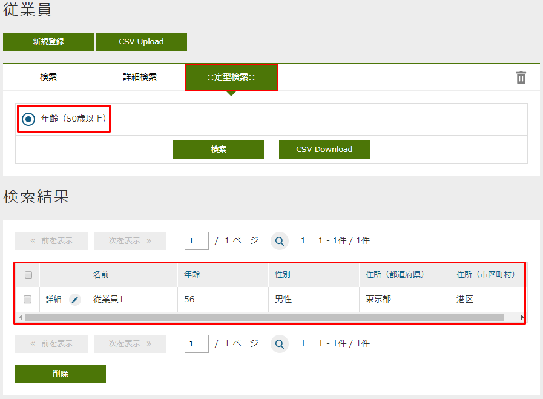
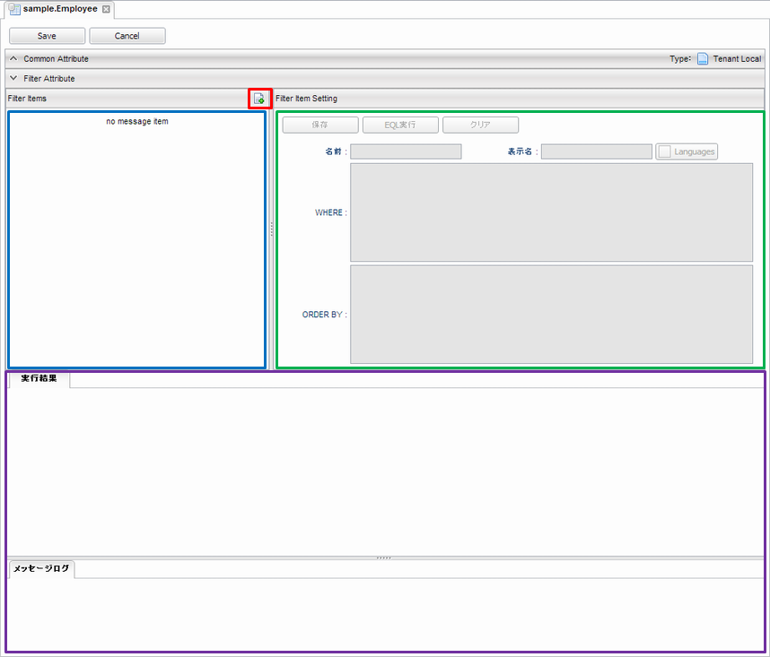
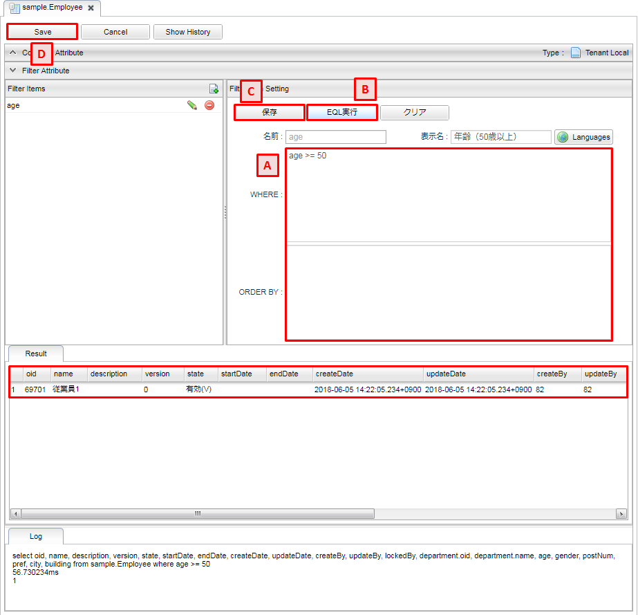

[[filter_management]]
== フィルタの管理

フィルタを設定する事でエンティティの検索補助を実現できます。
検索画面（条件部）のタブに `定型検索` タブが追加されます。

[[open_filter]]
=== フィルタの表示
フィルタ設定を行いたいエンティティを右クリックし、 `Filterを開く` を選択します。

[[filter_structure]]
=== フィルタの構成
フィルタは以下の構成になっています。

フィルタアイテム一覧::
青い枠の部分は検索画面に表示されるアイテムの一覧になります。
フィルタアイテム設定::
緑の枠の部分は各フィルタアイテムの設定になります。
実行結果::
紫の部分はフィルタアイテム設定を元にEQLを実行した結果を表示します。
設定した内容が正しく動くか等の確認に利用できます。

[[filter_setting]]
=== フィルタアイテム設定 

[[add_filteritem]]
==== アイテムの追加
図の赤枠部分をクリックするとフィルタアイテム設定画面が表示されます。

[cols="1,4a", options="header"]
|===
|項目|設定値
|名前|フィルタアイテムの名前
|表示名|フィルタアイテムの表示名、検索画面の定型検索に表示される
|===

入力後、追加ボタンを押すことでフィルタアイテム一覧に追加されます。

[[edit_filteritem]]
==== アイテムの編集
フィルタアイテムの鉛筆マークをクリックすると、右側のエリアに設定内容が表示されます。

.A.条件
検索時に適用する条件を設定します。

[cols="1,4a", options="header"]
|===
|項目
|設定値

|WHERE
|フィルタ条件、WHERE句以降を設定

|ORDER BY
|ソート条件
|===

.B.EQL実行
条件で設定された内容でEQLを実行します。
実行結果は画面下部の実行結果に表示されます。

.C.保存
フィルタアイテムの設定の変更内容を保存します。
保存せずに他のフィルタアイテムを編集すると、変更内容は失われますので注意してください。

.D.Save
全設定内容を保存します。
保存はフィルタアイテムの変更を確定させているだけなので、フィルタアイテムを保存した後は忘れずにSaveしてください。
