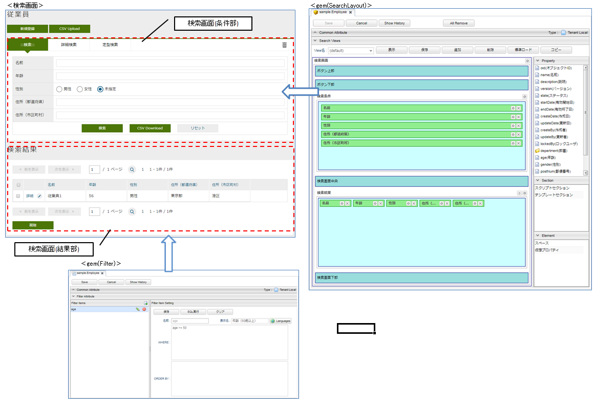
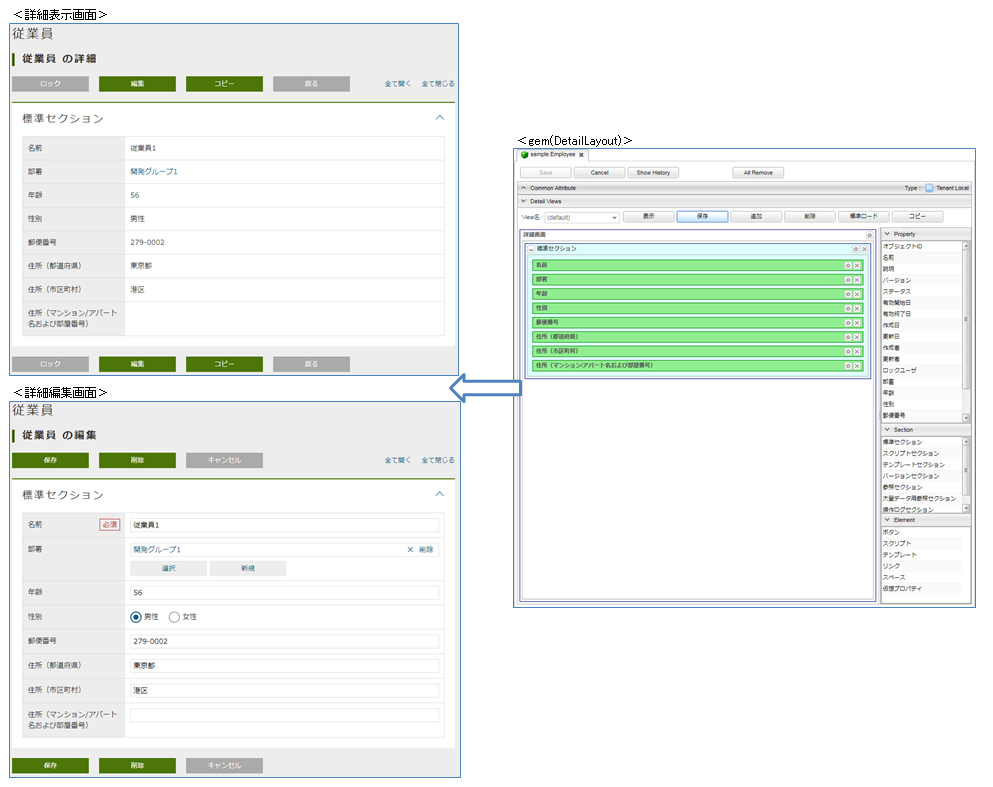
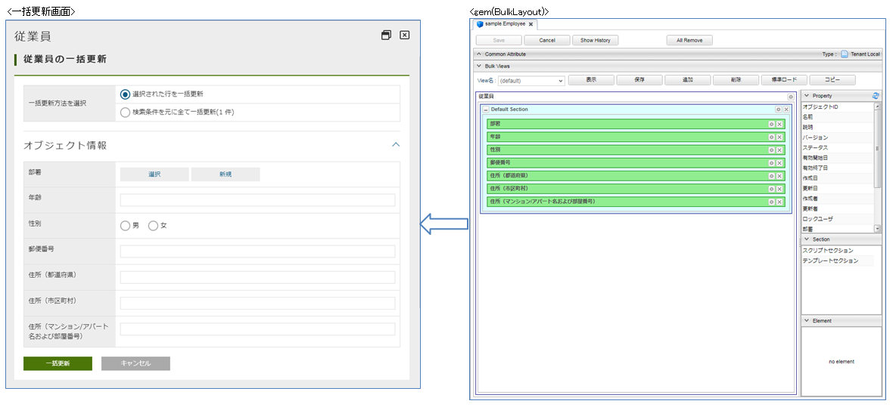

[[entityview_management]]
== EntityViewの管理

EntityViewはEntityの検索一覧、詳細・編集画面をカスタマイズする仕組みを提供しています。
検索一覧はSearchLayoutとFilter、詳細・編集画面はDetailLayoutの設定を利用して画面を生成しています。

検索一覧に選択したレコードに対して、複数の項目を同時に更新したい場合、BulkLayoutの設定を利用して一括更新画面を生成します。
<<bulkview, 一括更新画面>>を参照してください。

また、用途に併せて複数のレイアウトをViewとして作成することができます。
Viewは名前を付与して区別しており、SearchLayoutとDetailLayout及びBulkLayoutは同一の名前のViewをセットとして運用します。

[[viewsetting]]
=== 表示方法
.メニューからの表示
メニューには各エンティティに対応するメニューが表示されており、クリックすることで検索一覧が表示されます。
検索一覧からは、新規作成や検索結果の詳細、編集等をクリックすることで、詳細画面が表示されます。

エンティティを作成するとそのエンティティに対応するメニューが作成され、 `DEFAULT` メニュー定義に追加されます。
`DEFAULT` 以外のメニュー定義で検索一覧を表示したい場合には、個別に追加する必要があります。

[[searchresultlistparts]]
.Top画面での表示
TopViewの設定画面を表示し、 `SearchResult List` を配置します。
`SearchResult List` の設定画面を開き、対象のEntityや表示項目を定義した検索一覧の画面定義を指定してください。

[cols="1,4a", options="header"]
|===
|設定項目
|設定内容

|Entity
|対象となるエンティティを指定します。

|ResultList View
|検索結果一覧に適用するSearchLayoutのViewを選択します。

|Link Action View
|検索画面リンクから検索画面を表示する際に適用するSearchLayoutのViewを選択します。

|Detail Action View
|検索結果の詳細・編集リンクから詳細画面を表示する際に適用するDetailLayoutのViewを選択します。
未指定の場合、 `ResultList View` で指定したViewを利用します。

|Filter
|対象エンティティにFilterが定義されていれば、本項目で選択可能となります。

|Title
|タイトルをカスタマイズしたい場合に指定します。

|Icon Tag
|タイトルの前に表示するiタグなどを利用した独自のアイコンを設定できます。

|Class
|スタイルシートのクラス名を指定します。複数指定する場合は半角スペースで区切って下さい。

|Hight
|Main Areaに配置した場合の一覧の高さを指定します。

|Search asynchronously
|チェックを入れた場合、非同期で検索処理を行います。
|===
