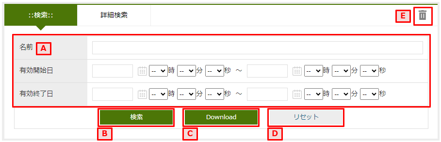
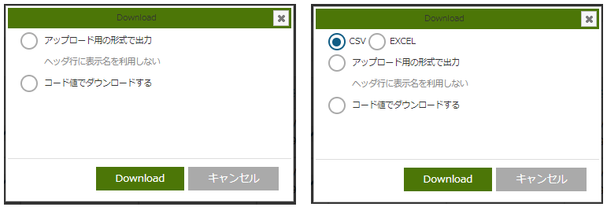
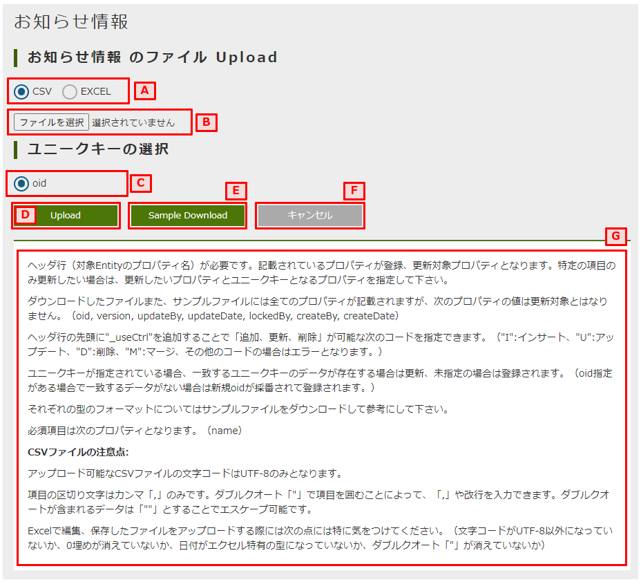
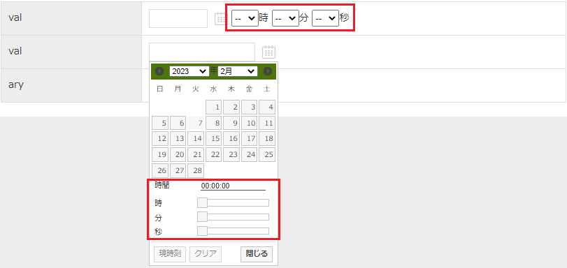

[[operationguide]]
== 操作説明

[[searchview]]
=== 検索画面
登録済みのエンティティのデータを検索し、一覧表示するための画面です。

==== ボタンエリア
`新規登録` をクリックすると、エンティティの登録画面が表示されます。
登録画面では単一データを登録できます。

`Upload` をクリックすると、アップロード画面が表示されます。
アップロード画面ではCSVファイルかExcelファイルを利用して、データの一括登録、更新ができます。

==== 検索条件エリア
検索一覧の上部は検索条件を設定するエリアになっています。
`通常検索` 、 `詳細検索` 、 `定型検索` の3種類の検索方法が用意されています。

バージョン管理されているEntityの場合には、検索条件エリアに `すべてのバージョン（無効データ含む）を検索` というチェックボックスが表示されます。チェックを入れた場合、すべてのバージョンのデータを検索対象とします。ただし、チェックボックスにチェックを入れていない場合でも、バージョン管理用項目（有効開始日、有効終了日、ステータス、バージョン）が検索条件に指定されている場合、すべてのバージョンのデータを検索対象とします。

===== 通常検索
`通常検索` は検索条件上部の `検索` をクリックすると、その下にエンティティの項目と検索条件を入力するフィールドが表示されます。

.A.検索項目
検索時に設定する検索条件を指定します。
項目により入力方法が変わります。
詳細は<<input_field, 入力フィールド>>を参照してください。

.B.検索
検索項目に指定された条件を利用して検索を行います。
検索後は検索結果が表示され、検索条件は折り畳まれ、縮小表示になります。
再度検索条件を表示する時は `検索` の部分をクリックします。

.C.Download
検索項目に指定された条件を利用して検索を行い、結果をファイルとしてダウンロードします。
クリック時に以下のダイアログが表示されます。

アップロード用の形式で出力を選択した場合、アップロード画面でファイルのアップロードに利用できます。
アップロード形式でない場合は、検索結果エリアの設定か検索条件エリアで直接設定した項目を出力します。
検索画面の設定によって、CSVファイルかExcelファイル、またはどちらかを利用者が選択することが可能です。

.D.リセット
検索条件をリセットします。
画面表示時に検索条件が指定されていた場合は、リセットを行うと画面表示時の状態に戻ります。

.E.ゴミ箱
ゴミ箱を表示します。
検索結果で `削除` を行ったデータはゴミ箱に格納されます。

===== 詳細検索
`詳細検索` は検索条件上部の `詳細検索` をクリックすると、その下に任意のエンティティの項目と条件、キーワードを入力するフィールドが表示されます。

.A.検索項目
右側の `+` は検索条件の追加、 `-` は該当行を削除します。

型ごとにキーワードへ指定できる文字が変わります。

[cols="1,3", options="header"]
|===
|型
|形式

|真偽値
|`true` または `false` +
検索結果で表示される文言での代用も可能

|日付
|yyyyMMdd形式の文字列（20180601等）

|日時
|yyyyMMdd形式の文字列（20180601等） +
yyyyMMddHHmmss形式の文字列（20180601093000等） +
yyyyMMddHHmmssSSS形式の文字列（20180601093000000等）

|時間
|HHmmss形式の文字列（093000）

|参照型
|参照データの名前項目、または表示ラベルとして扱うプロパティとして指定された項目

|選択型
|選択肢の値またはラベル

|数値
|任意の数値

|その他
|任意の文字列
|===

.B.条件の組合せ
検索項目で指定した条件をどのように組み合わせるかを指定します。

すべての条件に一致:: AND条件で組み合わせます
いずれかの条件に一致:: OR条件で組み合わせます
すべての条件に一致しない:: NOT条件で組み合わせます

.C.条件式を記述
条件の組合せを任意に行いたい場合に指定します。
以下のような書式で指定してください。
式内の `$n` が検索項目の行頭の数字に対応しています。

----
(($1 and $2) or ($3 and $4)) and (not $5)
----

===== 定型検索
`定型検索` は検索条件上部の `定型検索` をクリックすると、その下に固定条件（あらかじめ登録された検索条件）が表示されます。
固定条件はフィルタ機能を利用して作成できます。

.A.固定条件
フィルタ機能で登録された検索条件です。
条件の内容は変更できません。

==== 検索結果エリア
検索実行時に検索条件に一致するデータが表示されます。

.A.詳細/編集
データの詳細画面、編集画面を表示します。

.B.ページング
データが5件（設定により変わる事あり）以上有る場合に使用します。
`前を表示` 、 `次を表示` は現在表示しているデータの前後のデータを表示します。
虫眼鏡のアイコンは、クリックするとテキストボックスに入力したページを表示します。

.C.全削除／全一括更新
現在表示中の全データを削除／一括更新対象として選択します。

.D.削除
削除対象として選択中のデータを削除（ゴミ箱に移動）します。
`全削除` がチェック中の場合、削除対象を選択するダイアログを表示します。

選択された行を削除:: 現在表示中で削除対象になっているデータを削除します。
検索条件を元に全て削除:: 検索を行った時の条件を利用して、一致する全データを削除します。

.E.一括更新
一括更新対象として選択中のデータを利用して一括更新画面を表示します。

=== ゴミ箱
検索一覧などで削除されたデータが格納されています。
削除データについてはデータの内容等は参照できません。

.A.処理対象選択
`元に戻す` もしくは `ごみ箱から削除` する対象を選択します。
表頭のチェックボックスを選択すると、全データを対象にできます。

.B.元に戻す
処理対象として選択したデータを元に戻します。
検索一覧で検索すると再度表示されます。

.C.ごみ箱から削除
処理対象として選択したデータを完全に削除します。
ゴミ箱から削除したデータは復元できません。

.D.一覧に戻る
検索一覧に戻ります。

[[bulkview]]
=== 一括更新画面
検索一覧で選択中のデータを一括更新する操作画面です。
選択したレコードに対して、単一の項目と複数の項目を更新する二つのパターンがあります。

==== 単一の項目を一括更新

.A.一括更新方法を選択
`全一括更新` がチェック中の場合、一括更新方法を選択する設定を表示します。
処理対象として選択したデータに対して連続更新する場合、二回目以降は一括更新方法を変更することができません。

選択された行を一括更新:: 現在表示中で一括更新対象になっているデータを一括更新します。
検索条件を元に全て一括更新:: 検索を行った時の条件を利用して、一致する全データを一括更新します。

.B.一括更新する項目
処理対象として選択したデータに対して、どの項目を一括更新対象にするかを選択します。
選択した項目のAdminConsoleでの一括更新プロパティエディタの設定によって、一括更新画面で表示する入力エリアが変わります。
一括更新プロパティエディタが未設定の場合、一括更新画面での項目選択リストに表示しません。
<<searchresult_property_setting, 検索結果プロパティの設定>>を参照してください。

.C.一括更新
処理対象として選択したデータに対して、一括更新する項目に設定した値で更新します。

.D.キャンセル
一括更新画面を閉じます。

.A.更新された項目
一括更新処理を実行した後に、処理対象として選択したデータで更新された項目名と更新値を表示します。

==== 複数の項目を一括更新

SearchLayoutの<<searchresult_setting, 検索結果の設定>>で `BulkViewレイアウト定義を利用` という項目にチェックを入れた場合、
BulkViewLayoutを利用して一括更新画面を生成し、複数項目を一括更新することができます。

.A.一括更新方法を選択
`全一括更新` がチェック中の場合、一括更新方法を選択する設定を表示します。
処理対象として選択したデータに対して連続更新する場合、二回目以降は一括更新方法を変更することができません。

選択された行を一括更新:: 現在表示中で一括更新対象になっているデータを一括更新します。
検索条件を元に全て一括更新:: 検索を行った時の条件を利用して、一致する全データを一括更新します。

.B.一括更新する項目
処理対象として選択したデータに対して、複数の項目を一括更新することができます。

[NOTE]
ブランクで項目を一括更新することができない制限があります。ご注意ください。 +
入力値がブランクの項目を未入力の項目として扱い、一括更新項目にはなりません。

.C.一括更新
処理対象として選択したデータに対して、一括更新する項目に設定した値で更新します。

.D.キャンセル
一括更新画面を閉じます。

=== アップロード画面
ファイルをアップロードして、データの一括登録、更新ができます。

.A.アップロードファイルの種類を選択
検索画面の設定によって、CSVファイルかExcelファイル、またはどちらかを利用者が選択することが可能です。
利用者が選択可能な場合は、ファイルの種類を選択します。

.B.アップロードファイル選択
アップロード対象のファイルを選択します。

.C.ユニークキーの選択
更新対象のデータを特定するためのユニークキー項目を選択します。
ユニークキーとなっているプロパティがない場合は `OID` のみ選択できます。

.D.Upload
選択したファイルをアップロードします。
アップロードが完了すると、登録や更新の件数などの処理結果が表示されます。

エラーが発生した場合、該当行がエラーで表示されます。
該当行を修正した後、再度アップロードしてください。

.E.Sample Download
アップロード可能なフォーマットのサンプルファイルをダウンロードします。

.F.キャンセル
検索一覧に戻ります。

.G.アップロード時の注意
アップロードするファイルに関する注意事項が記載されています。
アップロード機能を利用する際は一度内容の確認をしてください。

[[detailview_detail]]
=== 詳細画面
エンティティの単一データを表示するための画面です。

==== ボタンエリア
`編集` をクリックすると、表示中のデータの編集画面が表示されます。

`コピー` をクリックすると、表示中のデータを元にした新規登録用の編集画面が表示されます。

`新しいバージョンで更新` をクリックすると、表示中のデータを残したまま、新しいバージョンとして更新するための編集画面が表示されます。

`ロック` をクリックすると、データを他者が編集できないようにします。
解除するにはロックしたユーザーかシステム管理者が `ロック解除` をする必要があります。

`戻る` をクリックすると、検索一覧が表示されます。

==== ナビゲーションリンク
セクションエリアの各セクションへジャンプするためのリンクが表示されます。
セクションが縮小表示されている場合にナビゲーションリンクをクリックすると、セクションは展開されます。

`全て開く` と `全て閉じる` はセクションエリア内の全てのセクションに対して縮小、展開ができます。

==== セクションエリア
プロパティ等をまとめて表示するセクションが配置されるエリアです。
セクションは複数配置でき、用途にあわせてプロパティを内部に配置できます

セクションのタイトル部分をクリックすることで、セクションの下部を隠したり、再度表示することができます。

[[detailview_edit]]
=== 編集画面
エンティティの単一データを編集するための画面です。

==== ボタンエリア
`登録` をクリックすると、新規作成のデータを登録できます。
登録後はデータの詳細画面が表示されます。

`保存` をクリックすると、編集中のデータを保存します。
保存後はデータの詳細画面が表示されます。

`削除` をクリックすると、編集中のデータを削除します。
データはゴミ箱へ移動し、検索一覧が表示されます。

`キャンセル` をクリックすると、検索一覧が表示されます。

[[input_field]]
==== 入力フィールド
セクション内には各プロパティの入力フィールドが表示されます。
型や表示の設定により、入力方法が変わります。

.テキストフィールド
文字列や数字など一般的な入力フィールドです。

他の形式のフィールドも含め、フィールドに複数の値を設定可能な場合、 `追加` をクリックするとフィールドが追加されます。
フィールドは右端の `削除` をクリックすることで削除できます。

image:images/field_text.png[]

.テキストエリア
改行を含む文字列、文章を入力するためのフィールドです。

.パスワード入力フィールド
パスワードを入力するためのフィールドです。
入力内容はマスクされます。

.日付フィールド
日付を入力するフィールドです。
入力時にカレンダーが表示され、日付を選択すると自動的にフィールドに反映されます。

.日時フィールド
日時を入力するフィールドです。
入力時にカレンダーが表示され、日付を選択すると自動的にフィールドに反映されます。

時間についてはプルダウンから時、分、秒を選択する形式と、カレンダー上で日付と併せて選択する形式があります。

.時間フィールド
時間を入力するフィールドです。
プルダウンから時、分、秒を選択する形式と、カレンダー上で日付と併せて選択する形式があります。

.プルダウン
選択リストの中から一つを選択する形式です。

.ラジオボタン
複数の選択肢から一つを選択する形式です。

.チェックボックス
複数の選択肢から任意のものを複数選択する形式です。

.リッチテキスト
ワードライクな文章入力エリアです。
上部のアイコンを利用することで、簡単に文章を加工できます。
htmlタグの使用もできます。

.参照
参照項目は既存のデータを `選択` するか、 `新規` に登録することで設定します。

`選択` をクリックすると選択画面が表示されます。
検索一覧のように検索を行い、対象データを選択、 `確定` をクリックすると参照項目に反映されます。

`新規` をクリックすると詳細画面が表示されます。
必要項目を入力し、 `登録` をクリックすると参照項目に反映されます。

フィールドに複数の値を設定可能な場合、選択画面ではデータを複数選択できるようになります。

複数件選択できる場合、ヘッダ部分にチェックボックスが表示されます。
チェックすると全選択の対象を選択できるようになります。
`全てのページ` を選択すると現在の検索条件でヒットする全てのデータ、 `現在のページ` を選択すると現在表示中のページのデータを選択します。

チェックを解除した場合、上記とは逆に全選択の解除の対象を選択できます。

.参照テーブル
関連する子データをテーブル形式で表示します。
行の追加や削除、子データの詳細画面の表示などができます。
三角のアイコンをクリックすることで、行の順序の入れ替えができます。

