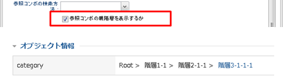
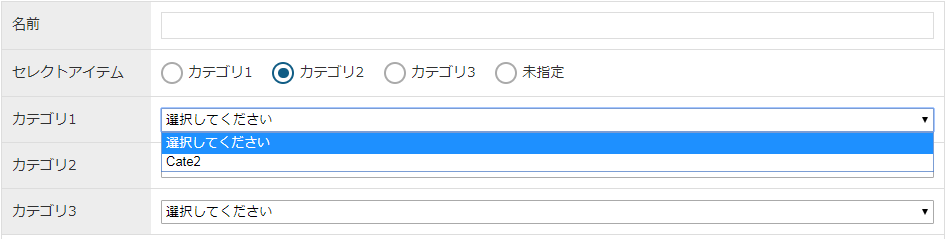

[[propertyeditor]]
=== プロパティエディタ
プロパティエディタは各プロパティの入力表示設定になります。
検索一覧、詳細・編集画面に配置した各プロパティの設定を変更をすることができます。
基本的にはプロパティの型に対応する型を選択してください。

[[properyeditor_setting]]
==== 共通設定項目
各プロパティエディタで共通の設定項目です。

[cols="1,1,1,6a", options="header"]
|===
|設定項目
|利用箇所
|表示タイプ
|設定内容

|Label形式の場合に表示値を登録する
|編集画面
|Label
|Label形式をサポートするエディタで、表示タイプがLabel形式の場合に表示値をそのまま登録するかを指定します。

|Label形式の場合に表示値で更新する
|編集画面
|Label
|Label形式をサポートするエディタで、表示タイプがLabel形式の場合に表示値で更新するかを指定します。

|表示カスタムスタイル
|検索条件(LABEL)、検索結果、詳細画面
|
|検索画面の検索条件で `Label` タイプに指定した条件の表示、結果一覧の各カラム表示、詳細画面の各プロパティ値の表示に対して、直接style属性を指定することが可能です。
値によって強調させたい場合などに利用します。
詳細は<<viewcustomstyle, 表示カスタムスタイル>>を参照してください。

|入力カスタムスタイル
|検索条件(LABEL以外)、編集画面
|
|検索画面の検索条件のinput要素、編集画面の各プロパティのinput要素に対して、直接style属性を指定することが可能です。
例えば入力用のinputの幅を調整したい場合などに利用します。
詳細は<<inputcustomstyle_pe, 入力カスタムスタイル>>を参照してください。
|===

[[viewcustomstyle]]
.表示カスタムスタイル
GroovyTemplate書式で設定します。
対象となるエンティティデータやプロパティ値がバインドされます。
その他のバインド変数についてはScript編集画面のNoteを参照してください。

.設定例1
[source,groovy]
----
<%
//高、緊急の場合、赤色で表示(01:低、02:中、03:高、04:緊急)
if (value.value == "03" \|\| value.value == "04") {  //SelectValue.valueでチェック
%>
color:red;
<%
}
%>
<%
//緊急の場合、フォントを大きくする
if (value.value == "04") {
%>
font-size:20px;
<%
}
%>
----

.設定例2
[source,groovy]
----
<% //期限まで5日以下の場合は赤くする
if (entity.limitDate != null) {
	long limit = entity.limitDate.getTime() + ((1000 * 60 * 60 * 24) - 1);    //limitDateはDate型なのでMAX時を追加
	long current = today.getTime();

	long diffDays = (limit - current) / (1000 * 60 * 60 * 24);
	if (limit - current < 0) {
		diffDays--; //逆転している場合はマイナス1日
	}
	if (diffDays <= 5) {
%>
color:red;
font-size:20px;
<%
	}
}
%>
----

[[inputcustomstyle_pe]]
.入力カスタムスタイル
GroovyTemplate書式で設定します。
編集画面では、対象となるエンティティデータやプロパティ値がバインドされます。 その他のバインド変数についてはScript編集画面のNoteを参照してください。

.設定例1
[source,groovy]
----
<% //入力テキストの幅を100pxに、背景色を赤に変更
%>
background-color:#FFCCCC; width:100px;
----

.設定例2
[source,groovy]
----
<% //ラジオボタンを1行に1つずつ表示させる（通常はdisplay:inline）
%>
display:block;
----

Editorの表示タイプが選択可能な場合、タイプによって適用されるinputが異なります。

Select:: selectに対して指定したスタイルを適用します。 +
Radio:: radioを囲むlabelに対して指定したスタイルを適用します。 +
Checkbox:: checkboxを囲むlabelに対して指定したスタイルを適用します。

[[autonumberpropertyeditor]]
==== AutoNumberPropertyEditor
AutoNumber型用のプロパティエディタです。

[cols="1,1,1,6a", options="header"]
|===
|設定項目
|利用箇所
|表示タイプ
|設定内容

|表示タイプ
|
|
|画面に表示する方法を下記から選択します。

Text:: テキストフィールドを表示
Label:: ラベルを表示、検索条件ではテキストフィールドを表示（TEXTを推奨）
Hidden:: hiddenとして出力。検索結果の場合、列を非表示

|完全一致で検索
|検索条件
|
|検索一覧での検索処理時に完全一致検索とする場合はチェックを入れます。

|入力カスタムスタイル
|
|
|<<properyeditor_setting, 共通設定項目>>を参照してください。
編集画面では読取専用のため、spanタグに設定されます。
|===

[[binarypropertyeditor]]
==== BinaryPropertyEditor
Binary型用のプロパティエディタです。

[cols="1,1,1,6a", options="header"]
|===
|設定項目
|利用箇所
|表示タイプ
|設定内容

|表示タイプ
|
|
|画面に表示する方法を設定します。

Binary:: アップロードファイルへのリンクとプレビューを表示
Link:: アップロードファイルへのリンクを表示
Label:: 検索条件ではラベル（名前検索）を表示、複数値指定は不可、検索結果、詳細、編集画面では、読み取り専用としてBinaryと同じ形式を表示
Preview:: アップロードファイルのプレビュー(画像や動画の再生)を表示
Hidden:: hiddenとして出力。検索結果の場合、列を非表示

|画像の高さ(px)
|検索結果 +
詳細・編集画面
|
|表示タイプがBinaryまたは、Previewの場合に表示する画像や動画の高さを設定します。

|画像の幅(px)
|検索結果 +
詳細・編集画面
|
|表示タイプがBinaryまたは、Previewの場合に表示する画像や動画の幅を設定します。

|アップロードアクション
|詳細・編集画面
|
|アップロード時に実行されるアクションを設定します。

|ダウンロードアクション
|検索結果 +
詳細・編集画面
|
|ダウンロード時に実行されるアクションを設定します。

|新しいタブで開く
|検索結果 +
詳細・編集画面
|
|チェックした場合、アップロードファイルへのリンククリック時に別タブで表示します。

|画像表示時に回転ボタンを表示
|詳細・編集画面
|
|画像リンクの横に回転ボタンを表示します。表示している画像を回転させることが可能になります。保存されるデータは変更されません。

|画像またはリンククリック時にイメージViewerを利用
|検索結果 +
詳細・編集画面
|
|画像リンクまたは画像をクリックした際に、ImageViewerを表示します。ImageViewerでは画像の拡大・縮小、回転、反転が可能です。
変更した設定は、検索画面、詳細画面、編集画面それぞれを表示している間のみ保持します。

画像リンクについては、 `新しいタブで開く` がチェックされている場合のみ動作し、チェックされていない場合は通常通りダウンロード処理が実行されます。
画像をクリックした際は、 `新しいタブで開く` 設定によりインラインまたは別タブで表示します。

|PDF表示時にPDF.jsを利用
|検索結果 +
詳細・編集画面
|
|PDF.jsを利用してPDFを表示します。
細工されたPDFによる情報詐取(JVNTA#94087669)の対策が必要な場合に利用してください。

|ファイル選択ボタン非表示
|詳細・編集画面
|
|詳細・編集画面にてファイル選択ボタンを非表示にします。これでアップロード権限制御なとに利用してください。

|削除ボタン非表示
|詳細・編集画面
|
|編集画面にて当バイナリファイルデータを削除するボタンを非表示にします。これで削除権限制御なとに利用してください。

|アップロード受け入れ可能な MIME Type パターン
|詳細・編集画面
|
|ファイルをアップロード時に、受け入れ可能な MIME Type パターンを設定します。設定値は正規表現パターンを指定します。 +
未指定の場合は、<<../../../serviceconfig/index.adoc#GemConfigService, GemConfigService>> の
 `binaryUploadAcceptMimeTypesPattern` の設定が適用されます。

検証対象となる MIME Type の決定方法については、<<../../../serviceconfig/index.adoc#WebFrontendService, WebFrontendService>> の `uploadFileTypeDetector` 、
<<../../../serviceconfig/index.adoc#FileTypeDetector, FileTypeDetector>> を参照してください。
|===

swfファイルをアップロードする場合は、高さ、幅の両方の設定が必須となります。

[[booleanpropertyeditor]]
==== BooleanPropertyEditor
Boolean型用のプロパティエディタです。

[cols="1,1,1,6a", options="header"]
|===
|設定項目
|利用箇所
|表示タイプ
|設定内容

|表示タイプ
|
|
|画面に表示する方法を下記から選択します。

Radio:: ラジオボタンを表示
Checkbox:: チェックボックスを表示
Select:: 選択リストを表示
Label:: ラベルを表示、検索条件では複数値指定不可
Hidden:: hiddenとして出力。検索結果の場合、列を非表示

|RADIO、CHECKBOX形式の場合、アイテムを縦に並べる
|検索条件 +
詳細・編集画面
|
|RADIO、CHECKBOX形式の場合、アイテムを縦に並べるかを指定します。

|「値なし」を検索条件の選択肢に追加するか
|検索条件
|
|「値なし」を検索条件の選択肢に追加するかを指定します。値なしが選択された場合、IS NULLを検索条件として指定します。

NOTE: 「値なし」を選択する場合、値として「isNull」が使用されるため、他の選択肢にはこのキーワードを値として使用しないでください。

|真の表示ラベル
|検索条件 +
検索結果、詳細・編集画面
|
|真の選択肢に表示するラベルを設定します。

|偽の表示ラベル
|検索条件 +
検索結果、詳細・編集画面
|
|偽の選択肢に表示するラベルを設定します。

|初期値
|詳細・編集画面
|
|新規作成時の初期値を設定します。ture/false または、1/0 を設定して下さい。

|入力カスタムスタイル
|
|
|<<properyeditor_setting, 共通設定項目>>を参照してください。

表示タイプがCheckboxの場合、設定は適用されません。
|===

[[datepropertyeditor]]
==== DatePropertyEditor
Date型用のプロパティエディタです。

[cols="1,1,1,6a", options="header"]
|===
|設定項目
|利用箇所
|表示タイプ
|設定内容

|表示タイプ
|
|
|画面に表示する方法を下記から選択します。

DateTime:: 日付入力フィールドを表示
Label:: ラベルを表示、検索条件では複数値指定不可、範囲指定可能
Hidden:: hiddenとして出力。検索結果の場合、列を非表示

|日付/時刻のフォーマット設定
|検索結果、詳細画面
|
|日付/時刻型を表示する際のフォーマットとロケールを設定します。 +
詳細は <<formatvalue,日付/時刻のフォーマット設定>> を参照してください。

|日付/時刻のフォーマッの多言語設定
|検索結果、詳細画面
|
|言語別の日付/時刻型を表示する際のフォーマットとロケールを設定します。 +
詳細は <<localizedformatvalue,日付/時刻のフォーマットの多言語設定>> を参照してください。

|単一日で指定
|検索条件
|
|チェックした場合、通常検索（検索一覧の検索タブ）の検索条件を単一日を指定する形で表示します。
OFFの場合は、FromToの入力フィールドを表示し、範囲検索を行います。

.単一日で指定がONの場合
`プロパティ = 入力値`

.単一日で指定がOFFの場合
From、To入力時 → `プロパティ between From入力値 and To入力値` +
Fromのみ入力時 → `プロパティ &gE; From入力値` +
Toのみ入力時 → `プロパティ &lE; To入力値` +

|検索条件Fromを非表示
|検索条件
|
|チェックした場合、通常検索（検索一覧の検索タブ）の検索条件のうち、From日付を非表示にします。
単一日で指定がOFFの場合に有効になります。

|検索条件Toを非表示
|検索条件
|
|チェックした場合、通常検索（検索一覧の検索タブ）の検索条件のうち、To日付を非表示にします。
単一日で指定がOFFの場合に有効になります。

|検索条件範囲記号を非表示
|検索条件
|
|チェックした場合、通常検索（検索一覧の検索タブ）の検索条件のうち、範囲記号 `～` を非表示にします。
範囲検索で、かつFromまたはToが非表示の場合に有効になります。

|初期値
|詳細・編集画面
|
|新規作成時（詳細編集画面）の初期値を設定します。
yyyyMMdd形式か、予約語を指定して下さい。（予約語は以下の通り）

NOW:: 現在日付となります。

|最小日付
|詳細・編集画面 +
一括更新画面
|
|DatePickerで選択可能な最小日付を設定します。以下の設定値を指定可能です。

. 固定日付
  * yyyyMMdd 形式で日付を指定してください。
. jQuery UI Datepicker オプション
  * jQuery UI Datepicker のオプション `minDate` の設定値を利用可能です。オプションの詳細については jQuery UI 公式サイトをご確認ください。
. ファンクション
  * "最小日付の設定値をファンクション実行する"の説明を参照ください。

|最小日付の設定値をファンクション実行する
|詳細・編集画面 +
一括更新画面
|
|チェックをすると、最小日付の設定値をファンクションとして実行します。 +
本設定を利用するために、事前にグローバルなユーザー定義ファンクションを用意し、最小日付の設定値として指定します。

ユーザー定義ファンクション::
--
ユーザー定義ファンクションの仕様は次の通りです。

* 引数
  . $input - 日付入力フィールドの jQuery セレクタ
* 戻り値 +
Date \| Number \| String +
(jQuery UI Datepicker のオプション `minDate` に設定可能な値)

.ユーザー定義ファンクション例
[source,javascript]
----
function userDefFunc($input) { //<1>
	return new Date();
}

const userDefObject = {
	prop1: {
		func: function($input) { //<2>
			return 10;
		},
	},
};
----
<1> グローバルファンクションの定義例
<2> オブジェクトに関連づくファンクションの定義例
--

最小日付の設定::
--
最小日付は以下の通り設定します。 +
設定例は、ユーザー定義ファンクション例を利用しています。

. グローバルファンクションの場合 +
ファンクション名をそのまま指定します。 +
設定例： `userDefFunc`
. グローバルオブジェクトに関連づくファンクションの場合 +
ファンクションまでのパスを `.` で連結しファンクション名を記載します。 +
設定例： `userDefObject.prop1.func`
--

|最大日付
|詳細・編集画面 +
一括更新画面
|
|DatePickerで選択可能な最大日付を設定します。以下の設定値を指定可能です。

. 固定日付
  * yyyyMMdd 形式で日付を指定してください。
. jQuery UI Datepicker オプション
  * jQuery UI Datepicker のオプション `maxDate` の設定値を利用可能です。オプションの詳細については jQuery UI 公式サイトをご確認ください。
. ファンクション
  * "最大日付の設定値をファンクション実行する" の説明を参照ください。

|最大日付の設定値をファンクション実行する
|詳細・編集画面 +
一括更新画面
|
|チェックをすると、最大日付の設定値をファンクションとして実行します。 +
本設定を利用するために、事前にグローバルなユーザー定義ファンクションを用意し、最大日付の設定値として指定します。

詳細については、"最小日付の設定値をファンクション実行する" を参照ください。 +
（参照時に、最大日付、maxDate に読み替えてください。）

|テキストフィールドへの直接入力を制限する
|詳細・編集画面 +
一括更新画面
|
|チェックをすると、直接入力ができなくなり DatePicker の入力のみ受け付けるようになります。

|現在日付設定ボタンを非表示
|検索条件 +
詳細・編集画面
|
|チェックした場合、DatePickerの現在日付設定ボタンを非表示にします。

|曜日を表示
|
|
|チェックした場合、日付にあわせて曜日を表示します。
曜日の入力はできません。

|入力カスタムスタイル
|
|
|<<properyeditor_setting, 共通設定項目>>を参照してください。

ロケールによる日付入力形式によりinputの長さを制御しているため、width設定は適用されません。
|===

[[formatvalue]]
===== 日付/時刻のフォーマット設定
フォーマットが反映される優先度は `プロパティエディタの多言語設定に指定されたフォーマットとロケール` &gt; `プロパティエディタで設定されたフォーマットとロケール` &gt; `デフォルトの表示` となります。
[cols="1,8a", options="header"]
|===
|設定項目
|設定内容

|日付/時刻のフォーマット設定
|日付、時刻のフォーマットを文字列で設定します。 +
フォーマットの設定はSimpleDateFormatのパターン文字を使用してください。 +
入力例と表示例） +
yyyy年MM月dd日HH時mm分ss秒 → 2021年01月01日 12時10分05秒 +
MMM dd yyyy → Jan 01 2021

|日付/時刻のロケール設定
|日付、時刻のフォーマットの表示を決定するロケールを文字列で設定します。 +
入力例）ja_JP_JP、en_US、zh-CN_CN
|===

[[localizedformatvalue]]
===== 日付/時刻のフォーマットの多言語設定
フォーマットが反映される優先度は `プロパティエディタの多言語設定に指定されたフォーマットとロケール` &gt; `プロパティエディタで設定されたフォーマットとロケール` &gt; `デフォルトの表示` となります。
[cols="1,8a", options="header"]
|===
|設定項目
|設定内容

|日付/時刻の言語設定
|日付、時刻のフォーマットを設定する言語を設定をします。 +
入力例） +
日本語：ja 、英語：en 、中国語（简体中文）：zh-CN

|日付/時刻のフォーマット設定
|日付、時刻のフォーマットを文字列で設定します。 +
フォーマットの設定はSimpleDateFormatのパターン文字を使用してください。 +
入力例と表示例） +
yyyy年MM月dd日HH時mm分ss秒 → 2021年01月01日 12時10分05秒 +
MMM dd yyyy → Jan 01 2021

|日付/時刻のロケール設定
|日付、時刻のフォーマットの表示を決定するロケールを文字列で設定します。 +
入力例）ja_JP_JP、en_US、zh-CN_CN
|===

[[decimalpropertyeditor]]
==== DecimalPropertyEditor
Decimal型用のプロパティエディタです。

[cols="1,1,1,6a", options="header"]
|===
|設定項目
|利用箇所
|表示タイプ
|設定内容

|表示タイプ
|
|
|画面に表示する方法を下記から選択します。

Text:: テキストフィールドを表示
Label:: ラベルを表示、検索条件では複数値指定不可、範囲指定可能
Hidden:: hiddenとして出力。検索結果の場合、列を非表示

|数値のフォーマット
|
|
|表示時のフォーマットを指定します。
java.text.DecimalFormatのパターンを設定してください。

|カンマ表示
|
|
|チェックした場合、テキストフィールドからフォーカスアウトした際にカンマ区切りの表示を行います。

|範囲で検索
|検索条件
|
|チェックした場合、通常検索（検索一覧の検索タブ）の検索条件でFromToの入力フィールドを表示し、範囲検索を行います。

.範囲検索がONの場合
From、To入力時 → `プロパティ between From入力値 and To入力値` +
Fromのみ入力時 → `プロパティ &gE; From入力値` +
Toのみ入力時 → `プロパティ &lE; To入力値` +

.範囲検索がOFFの場合
`プロパティ = 入力値`

|検索条件Fromを非表示
|検索条件
|
|チェックした場合、通常検索（検索一覧の検索タブ）の検索条件のうち、From部分を非表示にします。
範囲で検索がONの場合に有効になります。

|検索条件Toを非表示
|検索条件
|
|チェックした場合、通常検索（検索一覧の検索タブ）の検索条件のうち、To部分を非表示にします。
範囲で検索がONの場合に有効になります。

|検索条件範囲記号を非表示
|検索条件
|
|チェックした場合、通常検索（検索一覧の検索タブ）の検索条件のうち、範囲記号 `～` を非表示にします。
範囲検索で、かつFromまたはToが非表示の場合に有効になります。

|最大文字数
|詳細・編集画面
|
|テキストフィールドに入力可能な最大文字数を設定します。
1以上の値を設定してください。
なお、0以下の値を設定した場合は適用されません。

|初期値
|詳細・編集画面
|
|新規作成時（詳細編集画面）の初期値を設定します。
|===

[[exprressionpropertyeditor]]
==== ExpressionPropertyEditor
Expression型用のプロパティエディタです。

[cols="1,1,1,6a", options="header"]
|===
|設定項目
|利用箇所
|表示タイプ
|設定内容

|表示タイプ
|
|
|画面に表示する方法を下記から選択します。

Text:: テキストフィールドを表示
Label:: ラベルを表示、検索条件ではテキストフィールドを表示（TEXTを推奨）
Hidden:: hiddenとして出力。検索結果の場合、列を非表示

プロパティエディタを指定している場合は、指定されたプロパティエディタの設定が優先されます。

|数値のフォーマット
|検索結果 +
詳細・編集画面
|
|表示時のフォーマットを指定します。
java.text.DecimalFormatのパターンを設定してください。

プロパティエディタを指定した場合は、プロパティエディタの型に合わせて画面表示を行います。

|表示カスタムスタイル
|
|
|<<properyeditor_setting, 共通設定項目>>を参照してください。

プロパティエディタが設定されている場合は、そのプロパティエディタの表示カスタムスタイルが適用されます。

|入力カスタムスタイル
|
|
|<<properyeditor_setting, 共通設定項目>>を参照してください。

プロパティエディタが設定されている場合は、そのプロパティエディタの表示カスタムスタイルが適用されます。（読取専用のため表示スタイルです）

プロパティエディタが未設定の場合、編集画面では読取専用のため、多重度複数の場合はulタグに、単数の場合はspanタグに設定されます。

|プロパティエディタ
|検索条件 +
検索結果、詳細・編集画面
|
|プロパティエディタを設定します。
ExpressionプロパティのResultTypeに設定されている内容に合わせて設定してください。
設定した場合、そのEditor設定にあわせて画面表示を行います。
未設定の場合は、値を文字列として表示します。
|===

[[floatpropertyeditor]]
==== FloatPropertyEditor
Float型用のプロパティエディタです。

[cols="1,1,1,6a", options="header"]
|===
|設定項目
|利用箇所
|表示タイプ
|設定内容
|表示タイプ
|
|
|画面に表示する方法を下記から選択します。

Text:: テキストフィールドを表示
Label:: ラベルを表示、検索条件では複数値指定不可、範囲指定可能
Hidden:: hiddenとして出力。検索結果の場合、列を非表示

|数値のフォーマット
|
|
|表示時のフォーマットを指定します。
java.text.DecimalFormatのパターンを設定してください。

|カンマ表示
|
|
|チェックした場合、テキストフィールドからフォーカスアウトした際にカンマ区切りの表示を行います。

|範囲で検索
|検索条件
|
|チェックした場合、通常検索（検索一覧の検索タブ）の検索条件でFromToの入力フィールドを表示し、範囲検索を行います。

.範囲検索がONの場合
From、To入力時 → `プロパティ between From入力値 and To入力値` +
Fromのみ入力時 → `プロパティ &gE; From入力値` +
Toのみ入力時 → `プロパティ &lE; To入力値` +

.範囲検索がOFFの場合
`プロパティ = 入力値`

|検索条件Fromを非表示
|検索条件
|
|チェックした場合、通常検索（検索一覧の検索タブ）の検索条件のうち、From部分を非表示にします。
範囲で検索がONの場合に有効になります。

|検索条件Toを非表示
|検索条件
|
|チェックした場合、通常検索（検索一覧の検索タブ）の検索条件のうち、To部分を非表示にします。
範囲で検索がONの場合に有効になります。

|検索条件範囲記号を非表示
|検索条件
|
|チェックした場合、通常検索（検索一覧の検索タブ）の検索条件のうち、範囲記号 `～` を非表示にします。
範囲検索で、かつFromまたはToが非表示の場合に有効になります。

|最大文字数
|詳細・編集画面
|
|テキストフィールドに入力可能な最大文字数を設定します。
1以上の値を設定してください。
なお、0以下の値を設定した場合は適用されません。

|初期値
|詳細・編集画面
|
|新規作成時（詳細編集画面）の初期値を設定します。
|===

[[integerpropertyeditor]]
==== IntegerPropertyEditor
Integer型用のプロパティエディタです。

[cols="1,1,1,6a", options="header"]
|===
|設定項目
|利用箇所
|表示タイプ
|設定内容

|表示タイプ
|
|
|画面に表示する方法を下記から選択します。

Text:: テキストフィールドを表示
Label:: ラベルを表示、検索条件では複数値指定不可、範囲指定可能
Hidden:: hiddenとして出力。検索結果の場合、列を非表示

|数値のフォーマット
|
|
|表示時のフォーマットを指定します。
java.text.DecimalFormatのパターンを設定してください。

|カンマ表示
|
|
|チェックした場合、テキストフィールドからフォーカスアウトした際にカンマ区切りの表示を行います。

|範囲で検索
|検索条件
|
|チェックした場合、通常検索（検索一覧の検索タブ）の検索条件でFromToの入力フィールドを表示し、範囲検索を行います。

.範囲検索がONの場合
From、To入力時 → `プロパティ between From入力値 and To入力値` +
Fromのみ入力時 → `プロパティ &gE; From入力値` +
Toのみ入力時 → `プロパティ &lE; To入力値` +

.範囲検索がOFFの場合
`プロパティ = 入力値`

|検索条件Fromを非表示
|検索条件
|
|チェックした場合、通常検索（検索一覧の検索タブ）の検索条件のうち、From部分を非表示にします。
範囲で検索がONの場合に有効になります。

|検索条件Toを非表示
|検索条件
|
|チェックした場合、通常検索（検索一覧の検索タブ）の検索条件のうち、To部分を非表示にします。
範囲で検索がONの場合に有効になります。

|検索条件範囲記号を非表示
|検索条件
|
|チェックした場合、通常検索（検索一覧の検索タブ）の検索条件のうち、範囲記号 `～` を非表示にします。
範囲検索で、かつFromまたはToが非表示の場合に有効になります。

|最大文字数
|詳細・編集画面
|
|テキストフィールドに入力可能な最大文字数を設定します。
1以上の値を設定してください。
なお、0以下の値を設定した場合は適用されません。

|初期値
|詳細・編集画面
|
|新規作成時（詳細編集画面）の初期値を設定します。
|===

[[joinpropertyeditor]]
==== JoinPropertyEditor
複数のプロパティをまとめて表示するためのプロパティエディタです。

[cols="1,1,1,6a", options="header"]
|===
|設定項目
|利用箇所
|表示タイプ
|設定内容

|フォーマット
|検索結果 +
詳細・編集画面
|
|複数のプロパティを組み合わせて表示するための表示フォーマットを設定します。
プロパティを指定する際は、 `${プロパティ名}` のように指定し、プロパティ項目に追加します。

例) ${name}_${item1}

|表示カスタムスタイル|
|
|<<properyeditor_setting, 共通設定項目>>を参照してください。

JoinPropertyEditorに対する設定は、フォーマットされた全体を囲むspanタグに対して設定されます。

|入力カスタムスタイル
|
|
|<<properyeditor_setting, 共通設定項目>>を参照してください。

JoinPropertyEditorに対する設定は、フォーマットされた全体を囲むspanタグに対して設定されます。（読取専用）

|プロパティエディタ
|検索条件 +
検索結果、詳細・編集画面
|
|このプロパティ(JoinPropertyとして定義したプロパティ)のプロパティエディタを設定します。
プロパティの型にあわせたプロパティエディタを選択してください。

|プロパティ
|検索条件 +
検索結果、詳細・編集画面
|
|このプロパティ(JoinPropertyとして定義したプロパティ)と組み合わせて表示する他のプロパティを指定します。

|ネストプロパティの検証エラーメッセージをまとめて表示
|詳細・編集画面 +
一括更新画面
|
|チェックの時はネストプロパティの検証エラーメッセージをまとめて表示します。
未チェックの時はネストプロパティの検証エラーメッセージをまとめて表示しません。
|===

[[longtextpropertyeditor]]
==== LongTextPropertyEditor
LongText型用のプロパティエディタです。

[cols="1,1,1,6a", options="header"]
|===
|設定項目
|利用箇所
|表示タイプ
|設定内容

|表示タイプ
|
|
|画面に表示する方法を下記から選択します。

Text:: テキストフィールドを表示
TextArea:: テキストエリアを表示
RichText:: リッチテキストを表示。検索画面では対応していません。
Password:: パスワードフィールドを表示
Select:: 選択リストを表示
Label:: ラベルを表示
Hidden:: hiddenとして出力。検索結果の場合、列を非表示

|最大文字数
|詳細・編集画面
|Text
|テキストフィールドに入力可能な最大文字数を設定します。
1以上の値を設定してください。
なお、0以下の値を設定した場合は適用されません。

|選択値
|検索条件 +
詳細・編集画面
|Select
|選択値を追加設定できます。
詳細は<<editorvalue, 選択値設定>>を参照してください。

|初期値
|詳細・編集画面
|
|新規作成時（詳細編集画面）の初期値を設定します。

|RichText表示時にタグを許可
|詳細・編集画面
|RichText
|リッチテキストエディタで許可されていない文字を利用できるようにします。
本文内にJavascriptやcssを埋め込む場合、ソースボタンを押してから直接記述してください。

|RichText表示時にリンク動作を許可
|詳細画面
|RichText
|リッチテキストエディタで許可されていないリンク動作を利用できるようにします。

|RickText表示時にツールバーなどを表示しない
|詳細画面
|RichText
|リッチテキストエディタで表示する際に、ツールバーなどを表示しないかを設定します。

|RickText Editor Option
|詳細・編集画面
|RichText
|リッチテキストエディタを生成する際のオプションをJavascriptのオブジェクトリテラルで指定します。
指定可能なオプションについてはCKEDITOR configを参照してください。

|入力カスタムスタイル
|
|
|<<properyeditor_setting, 共通設定項目>>を参照してください。

RichTextタイプの場合、設定は適用されません。

|===

[[editorvalue]]
===== 選択値設定

[cols="1,8a", options="header"]
|===
|設定項目
|設定内容

|表示名
|選択肢のラベルを設定します。

|値
|選択肢の値を設定します。

|クラス名
|スタイルシートのクラス名を指定します。
複数指定する場合は半角スペースで区切って下さい。
|===

[[referencepropertyeditor]]
==== ReferencePropertyEditor
Reference型用のプロパティエディタです。

[cols="1,1,1,6a", options="header"]
|===
|設定項目
|利用箇所
|表示タイプ
|設定内容

|表示タイプ
|
|
|画面に表示する方法を下記から選択します。 +
`Link` `Select` `Checkbox` `RefCombo` `Tree` `NestTable` `Label` `Unique` `Hidden` `SelectFilter`

`Checkbox` は多重度1の場合はラジオボタン、それ以外はチェックボックスになります。
また、検索条件では常にチェックボックスで表示されます。

`RefCombo` 、 `NestTable` は参照先の表示プロパティに追加したプロパティが表示されます。

`Label` は追加、選択、削除ボタンを表示しません。検索条件の場合 `Link` 形式で表示します。
複数指定が可能です。詳細、編集画面の場合、登録データをラベルで表示します。

`Hidden` は、hiddenとして `oid` と `version` が出力されます。
また検索結果では、列が非表示になります。

|CHECKBOX形式の場合、アイテムを縦に並べる
|検索条件 +
詳細・編集画面
|
|CHECKBOX形式の場合、アイテムを縦に並べるかを指定します。

|「値なし」を検索条件の選択肢に追加するか
|検索条件
|
|「値なし」を検索条件の選択肢に追加するかを指定します。値なしが選択された場合、IS NULLを検索条件として指定します。

NOTE: 「値なし」を選択する場合、値として「isNull」が使用されるため、他の選択肢にはこのキーワードを値として使用しないでください。

|表示ラベルとして扱うプロパティ
|検索条件 +
詳細・編集画面
|Link +
Select +
Checkbox +
RefCombo +
Tree +
Label +
SelectFilter
|表示ラベルとして扱うプロパティを設定します。
`name` 以外のプロパティを画面にラベルとして表示できます。

本項目が設定された、かつ <<../../../serviceconfig/index.adoc#GemConfigService, GemConfigService>> の
 `useDisplayLabelItemInSearch` が `true` の場合、テキスト入力による条件指定時に名前項目ではなく、
 表示ラベルとして扱うプロパティを条件項目として利用します。

`StringProperty` にのみ適用されます。それ以外のプロパティを指定すると、画面表示にエラーになります。指定するプロパティは多重度が複数の場合はサポートされません。

|参照型の表示プロパティ
|検索条件 +
検索結果 +
詳細・編集画面
|NestTable
|参照先エンティティの表示対象プロパティを指定します。詳細画面と検索一覧で使用方法が異なります。

詳細画面:: 表示タイプで `NestTable` を選択した場合に設定します。多重度が複数のプロパティはサポートしていません。

検索一覧:: 表示タイプで `Select` `Hidden` 以外を選択した場合に設定すると、標準で表示される名前の代わりに、検索条件、検索結果に各項目を表示できます。<<useNestConditionWithProperty,プロパティと同時にネスト項目を条件に表示>> を参照してください。

プロパティの設定については、<<referencepropretyeditor_nestproperty, 参照先の表示プロパティ>>を参照してください。

|ネストテーブルの表示順プロパティ
|詳細・編集画面
|NestTable
|ネストテーブルで表示する際の表示順を示すプロパティを設定します。

* 設定した場合、編集時に並び順を操作することが可能です。
** ネストテーブルの並び順を保存する数値型のプロパティを作成し、指定してください。
** 指定したプロパティには、ネストテーブルの並び順を示す数値が基盤側で自動保存されます。
* 未設定の場合、表示時に `oid` でソートします。

|[[useNestConditionWithProperty]]プロパティと同時にネスト項目を条件に表示
|検索条件
|
|チェックした場合、参照先の表示プロパティにネスト項目が設定されていれば、ネスト項目を検索条件とします。

|選択ダイアログを利用
|検索条件
|Link +
Unique
|チェックした場合、検索一覧での条件指定方法をテキストから、選択ダイアログ（レコード選択）にします。

|検索条件で単一選択
|検索条件
|Link
|チェックした場合、検索一覧での条件指定時に、選択ダイアログでのレコード選択方法を複数選択から単一選択に変更します。

|検索条件での全選択を許可
|検索条件
|Link
|参照先の選択画面で複数選択が可能な場合、全選択時の範囲を変更します。
ただし多重度以上の選択はできず、先頭から順に選択されます。

チェックあり:: 検索条件に一致する全てのデータ(前後のページを含む) が対象
チェックなし:: 現在のページの全てのデータが対象

|選択画面でバージョン検索を許可
|詳細・編集画面
|Link +
NestTable +
Unique
|バージョン管理している参照先Entityの選択画面でバージョン検索を許可します。

|参照リンクで編集を許可
|検索結果 +
詳細・編集画面
|Link +
NestTable
|チェックした場合、参照リンク押下時のリンク先詳細画面で編集が可能となります。

表示タイプ:Link::
リンク先の画面で編集ボタンが表示され、編集可能となります。

表示タイプ:NestTable::
テーブル内に編集リンクを表示し、編集可能となります。

参照先エンティティに更新権限がない場合は、編集リンクの代わりに詳細リンクが表示されます。

|編集ページ
|詳細・編集画面
|Link +
NestTable
|参照画面で編集を行うか、編集画面で編集を行うかを設定します。

Detail:: 編集画面上で編集（未設定の場合は `Detail` ）
View:: 詳細画面上で編集

|新規ボタン非表示
|詳細・編集画面|Link +
NestTable +
Unique
|チェックした場合、追加ボタンを非表示にします。

|選択ボタン非表示
|詳細・編集画面
|Link +
NestTable +
Unique
|チェックした場合、選択ボタンを非表示にします。

|削除ボタン非表示
|詳細・編集画面
|Link +
NestTable +
Unique
|チェックした場合、削除ボタンを非表示にします。

|行追加方法
|詳細・編集画面
|NestTable
|詳細編集画面での行の追加ボタンの表示位置を下記から選択します。

Top:: 追加ボタンが表の上に表示されます。
Bottom:: 追加ボタンが表の下に表示されます。

当該項目が設定されていない場合は、 `Bottom` となります。

|ダイアログ表示アクション
|検索条件 +
検索結果 +
詳細・編集画面
|Link +
NestTable
|参照リンク押下時のダイアログ表示時のアクションを設定します。

表示タイプ:Link::
リンク押下時に実行されるアクションを設定します。 +

表示タイプ:NestTable::
テーブル内の詳細リンク押下時に実行されるアクションを設定します。

|ダイアログ編集アクション
|詳細・編集画面
|NestTable
|`NestTable` 上の編集リンク押下時に実行されるアクションを設定します。

|追加アクション
|詳細・編集画面
|Link +
NestTable
|追加ボタン押下で実行されるアクションを設定します。

表示タイプ:Link::
追加ボタン押下時に実行されるアクションを設定します。

表示タイプ:NestTable::
追加ボタン押下時に実行されるアクションを設定します。

|選択アクション
|検索条件 +
詳細・編集画面
|Link +
NestTable
|選択ボタン押下で実行されるアクションを設定します。

表示タイプ:Link::
選択ボタン押下時に実行されるアクションを設定します。

表示タイプ:NestTable::
選択ボタン押下時に実行されるアクションを設定します。

|更新時に強制的に更新処理を行う
|詳細・編集画面
|NestTable
|更新項目が１つもない場合でも強制的に更新処理を行います。更新者、更新日時を更新します。

|ビュー定義名
|検索条件 +
検索結果 +
詳細・編集画面
|Link +
NestTable
|各アクション実行時に表示する画面のView定義名を設定します。
未指定の場合は `default` のView定義を使用します。

|URLパラメータ
|検索条件 +
詳細・編集画面
|Link +
NestTable +
Unique
|選択ボタン、新規ボタン、詳細/編集リンク押下で表示する画面に渡すパラメータを設定します。
詳細は<<urlparameter, URLパラメータ>>を参照してください。

|URLパラメータAction
|検索条件 +
詳細・編集画面
|Link +
NestTable +
Unique
|URLパラメータを適用するActionを指定します。未指定の場合、 `SELECT` , `ADD` で有効になります。

|動的URLパラメータ
|検索条件 +
詳細・編集画面
|Link +
NestTable +
Unique
|選択ボタン、新規ボタン押下で表示する画面に渡すパラメータを作成するためのJavascriptを設定します。NestTableの場合、編集ページがViewの場合に有効になります。URLパラメータに設定した値が変数のurlParamに格納されます。urlParamを含めてURLパラメータの文字列をreturnしてください。
詳細は<<dynamicurlparameter, 動的URLパラメータ>>を参照してください。

|動的URLパラメータAction
|検索条件 +
詳細・編集画面
|Link +
NestTable +
Unique
|動的URLパラメータを適用するActionを指定します。未指定の場合、 `SELECT` , `ADD` で有効になります。

|新規アクションコールバックスクリプト
|詳細・編集画面
|Link
|新規ボタン押下で表示される追加画面で追加完了時に実行されるコールバック用のJavascriptを設定します。
コールバック関数の引数として以下の変数が渡されます。

entity:: 追加されたEntity( `oid` 、 `name` 、 `version` を持ったJavascriptオブジェクト) +
propName:: 対象の参照プロパティ名

|選択アクションコールバックスクリプト
|詳細・編集画面
|Link
|選択ボタン押下で表示される選択画面上で選択完了時に実行されるコールバック用のJavascriptを設定します。
詳細は<<selectactioncallbackscript, 選択アクションコールバックスクリプト>>を参照してください。

|行追加コールバックスクリプト
|詳細・編集画面
|NestTable
|`NestTable` で行追加した後に実行されるコールバック用のJavascriptを設定します。
コールバック関数の引数として以下の変数が渡されます。

row:: 追加された行のDOMオブジェクト +
index:: 行のインデックス

|特定バージョンの基準となるプロパティ
|詳細・編集画面
|Link
|参照先のプロパティのバージョン管理に合わせて、画面内のプロパティ名を指定します。
(NUMBER_BASE:Integer型 / TIME_BASE:Datetime型)
指定したプロパティの値を利用して、選択ダイアログでの検索時にバージョンを指定して検索します。
(プロパティ定義の `基準値` とは別物です)
ネストテーブル内の参照プロパティの場合、プロパティ名をそのまま指定すると行内のプロパティ、プロパティ名の前に `.(ドット)` を追加すると、
ルート(ネストテーブルの親)のプロパティを対象とします。

|検索条件
|検索条件 +
詳細・編集画面
|Select +
Checkbox
|選択可能項目を検索する際の条件に依存しない検索条件を設定します。

|ソートアイテム
|検索条件 +
詳細・編集画面
|Select +
Checkbox
|選択項目をソートする項目を設定します。

|ソート種別
|検索条件 +
詳細・編集画面
|Select +
Checkbox
|選択項目をソートする種別を設定します。

|参照コンボ設定
|検索条件 +
詳細・編集画面
|RefCombo
|選択値を階層的に指定することができます。
詳細は<<refcombo, 参照コンボの設定>>を参照してください。

|参照コンボの検索方法
|検索条件
|RefCombo
|通常検索（検索一覧の検索タブ）の検索条件に参照コンボを利用する場合に、参照コンボの検索方法を設定します。

NONE:: 最下層に一致するデータを検索（未設定の場合は `NONE` ）
UPPER:: 上位の階層が指定されている場合、検索条件に含めて検索
ALERT:: 上位の階層のみが指定されている場合、アラートを表示

|詳細画面で参照コンボの親階層を表示
|詳細画面
|RefCombo
|チェックした場合、参照コンボの設定により、親階層のデータを表示します。

|参照ツリー設定
|検索条件 +
詳細・編集画面
|Tree
|再帰構造のエンティティ(同一エンティティの参照をプロパティに持つエンティティ)をツリーから選択することが出来ます。
詳細は<<reftree, 参照ツリーの設定>>を参照してください。

|連動プロパティ設定
|検索条件 +
検索結果 +
詳細・編集画面
|Select +
Checkbox(多重度1のみ)
|エンティティの他のプロパティと連動して選択可能項目をフィルターすることができます。
詳細は<<linkproperty, 連動プロパティの設定>>を参照してください。

|ユニークキープロパティ
|検索条件 +
検索結果 +
詳細・編集画面
|Unique
|参照エンティティを検索するためのユニークキープロパティを指定します。

|選択フィルター参照設定
|検索条件 +
一括更新画面 +
詳細・編集画面
|SelectFilter
|選択フィルターの条件を設定します。

|操作ログリンクを表示
|詳細画面
|NestTable
|参照エンティティが操作ログを管理している場合に、ネストテーブル列に対象データの操作ログを表示するリンクを出力します。 +
リンクから表示される操作ログは、別途定義する操作ログセクションの <<auditlogreferencesetting, 参照プロパティ操作ログ設定>> を参照します。

|表示カスタムスタイル
|
|
|<<properyeditor_setting, 共通設定項目>>を参照してください。

|入力カスタムスタイル
|
|
|<<properyeditor_setting, 共通設定項目>>を参照してください。

表示タイプ= `Link` で `参照ダイアログ利用可否=true` の場合、適用されません。

表示タイプ= `Link` で `参照ダイアログ利用可否=true` 、かつ `プロパティと同時にネスト項目を条件に表示` の場合、NestPropertyについてはNestPropertyで指定したEditorの設定が適用されます。

表示タイプ= `NestTable` でネスト項目が未指定の場合、名前を入力するinputに適用されます。

表示タイプ= `NestTable` でネスト項目が指定されている場合、NestPropertyで指定したEditorの設定が適用されます。

表示タイプ= `RefCombo` が指定されている場合、Selectに適用されます。

|===

[[urlparameter]]
.URLパラメータ
選択ボタン、新規ボタン、詳細/編集リンク押下で表示する画面に渡すパラメータを設定します。
詳細・編集リンクは、編集ページ設定が `View` の場合にのみ、指定されたパラメータを適用します。

以下の変数がバインドされています。

====
request:: リクエスト
session:: セッション
parent:: 参照元のエンティティ(編集画面のみ)
actionType:: 実行されるAction( `org.iplass.mtp.view.generic.editor.ReferencePropertyEditor.UrlParameterActionType` )
====

新規ボタン押下時にはこの項目で定義したパラメータと一緒に以下のパラメータが渡されます

====
parentOid:: 親エンティティの `oid` (新規登録時は `null` )
parentVersion:: 親エンティティの `version` (新規登録時は `null` )
parentDefName:: 親エンティティのエンティティ定義名
====

GroovyTemplate書式で設定します。改行やスペースは無視されます。
[source,groovy]
----
<%@page import="org.iplass.mtp.view.generic.editor.ReferencePropertyEditor.UrlParameterActionType"%>
<%
	//actionTypeによってパラメータを切り分ける例

	if (actionType == UrlParameterActionType.SELECT) {
		//選択ボタン処理
		//初期表示時に検索(es=t)
%>
es=t
<%
		if (parent != null) {
			//親の値を条件に追加
%>
&sc_parentName=<%=parent.getName()%>
<%
		}
	} else if (actionType == UrlParameterActionType.ADD) {
		//追加ボタン処理
%>
custom_param1=aaa&custom_param2=bbb
<%
	} else if (actionType == UrlParameterActionType.VIEW) {
		//データ参照処理
%>
custom_param1=aaa&custom_param2=bbb&custom_param3=ccc
<%
	}
%>
----

[[dynamicurlparameter]]
.動的URLパラメータ
選択ボタン、新規ボタン、詳細/編集リンク押下で表示する画面に渡すパラメータを作成するためのJavascriptを設定します。
詳細・編集リンクは、編集ページ設定が `View` の場合にのみ、指定されたパラメータを適用します。

以下の変数がバインドされています。

====
urlParam:: URLパラメータで設定した固定パラメータ
====

Javascript書式で設定します。画面内の項目の値を取得し、URLパラメータ形式の文字列をreturnします。
URLパラメータの項目でパラメータを設定している場合、それを含めた形でreturnしてください。
[source,javascript]
----
const name = $("input[name='name']").val()
const str = $("input[name='str']").val()

return "sc_name=" + name + "&sc_str=" + str + "&" + urlParam;
----

[[selectactioncallbackscript]]
.選択アクションコールバックスクリプト
選択ボタン押下で表示される選択画面上で選択完了時に実行されるコールバック用のJavascriptを設定します。
コールバック関数の引数として以下の変数が渡されます。

====
entityList:: 選択されたEntity( `oid` 、 `name` 、 `version` を持ったJavascriptオブジェクト)の配列
deleteList:: 選択解除されたEntityの配列
propName:: 対象の参照プロパティ名
====

[source,javascript]
----
if (entityList.length > 0) {
	for (let i = 0; i < entityList.length; i++) {
		alert(entityList[i].oid + "-" + entityList[i].version + "-" + entityList[i].name);
	}
}
----

[[referencepropretyeditor_nestproperty]]
===== 参照先の表示プロパティ
NestTable等に表示する、参照先のエンティティのプロパティに対する設定です。

[cols="1,1,8a", options="header"]
|===
|設定項目
|利用箇所
|設定内容

|仮想プロパティ
|検索条件 +
検索結果 +
詳細・編集画面
|Entityに定義されたプロパティではなく、任意の名前を持った項目として扱います。

|プロパティ名
|検索条件 +
検索結果 +
詳細・編集画面
|参照先のプロパティ名を設定します。

|プロパティエディタ
|検索条件 +
検索結果 +
詳細・編集画面
|参照先プロパティの型に合わせたPropertyEditorを選択して下さい。
選択後、 `編集ボタン` を押して表示タイプなどを選択してください。
なお、 `SelectPropertyEditor` 選択時はSelectValueの値は動的に表示されません。
`編集` ボタンをクリックし、選択値（表示名、値）をセットして下さい。

|編集画面で非表示
|詳細・編集画面
|チェックした場合、編集画面で項目を非表示にします。
この項目は参照テーブル、参照セクション、大量データ用参照セクションで有効になります。

|詳細画面で非表示
|詳細・編集画面
|チェックした場合、詳細画面で項目を非表示にします。
この項目は参照テーブル、参照セクション、大量データ用参照セクションで有効になります。

|表示ラベル
|検索条件 +
検索結果 +
詳細・編集画面
|表示ラベルを設定します。

|説明
|詳細・編集画面
|説明を設定します。

|ツールチップ
|検索条件 +
詳細・編集画面
|ツールチップを設定します。

|列幅
|検索結果 +
詳細・編集画面
|画面に表示する際の列幅（単位はピクセル）を設定します。単位は不要です。

|テキストの配置
|検索結果
|画面に表示する際のテキスト(データ)の配置を設定します。

LEFT:: 左寄せ
CENTER:: 中央寄せ
RIGHT:: 右寄せ

|必須マークを表示
|詳細・編集画面
|必須マークを表示するかを設定します。

DEFAULT:: エンティティのプロパティ定義(Required)に従います。 +
　必須マークを表示する:: Requiredにチェックあり
　必須マークを表示しない:: Requiredにチェックなし
DISPLAY:: 必須マークを表示します。
NONE:: 必須マークを表示しません。

|通常検索で必須条件にする
|検索条件
|チェックした場合、通常検索（検索一覧の検索タブ）で必須条件になります。

|詳細検索で必須条件にする
|検索条件
|チェックした場合、詳細検索（検索一覧の詳細検索タブ）で必須条件になります。

|ソートを許可
|検索結果
|ソートを許可する場合はチェックします。

WARNING: 対象のプロパティが暗号化されている場合、またはReference型以外で多重度が複数の場合は、ソートはできません。許可設定は無効になります。

|ダウンロードファイルに出力する
|検索結果
|ダウンロードファイルに出力するかを設定します。
検索条件設定で `ダウンロード項目` を指定している場合は、この設定は無視されます。
アップロード形式ではないダウンロードファイルに対して有効になります。

|自動補完設定
|検索条件 +
詳細・編集画面
|項目間の自動補完を設定します。詳細は<<autocompletion, 自動補完設定>>を参照してください。
|===

[[refcombo]]
===== 参照コンボの設定
表示タイプを `RefCombo` に設定することで、階層的な構造をもつ参照プロパティを絞り込みながら選択することが可能になります。

.検索一覧
上位の選択値（連動元）に合わせて選択可能な項目を絞り込みます。

.詳細画面
`参照コンボの親階層を表示するか` がONになっている場合、詳細画面でも上位階層を表示します。

.編集画面
検索一覧と同様に、上位に合わせて絞込みが行われます。

.設定項目
[cols="1,8a", options="header"]
|===
|設定項目
|設定内容

|プロパティ名
|上位のコンボとして表示する参照のプロパティ名を設定します。

|検索条件
|上位コンボの選択肢を取得する際に自動的に付与される検索条件をPreparedQuery形式で指定します。
WHERE句に指定する条件を指定してください。

|参照コンボ設定
|複数階層化させる場合に、さらに上位のコンボに関する設定をします。

|ソートアイテム
|選択可能項目をソートする項目を設定します。

|ソート種別
|選択可能項目をソートする種別を設定します。

|表示ラベルとして扱うプロパティ
|表示ラベルとして扱うプロパティを設定します。
`name` 以外のプロパティを画面にラベルとして表示できます。

|===

（例）メインとなるエンティティで３階層の構造をもったカテゴリエンティティ３を定義した場合の設定方法

.エンティティ定義
* メインエンティティ +
３階層のカテゴリ構造となっている最下位層のCategory3エンティティを保持している。
+

* 参照している各カテゴリエンティティ +
Category1 ＞ Category2 ＞ Category3
+

.検索条件設定
. Category3エンティティを配置
+

. Category3の設定 +
Category3エンティティから上位のCategory2エンティティ、さらに上位のCategory1エンティティの設定を行う
+

.詳細、編集画面設定
設定内容は検索条件と同様。
ただし `参照コンボの親階層を表示するか` がチェックされている場合は、階層で表示される。

[[reftree]]
===== 参照ツリーの設定
表示タイプを `Tree` に設定することで、再帰構造をもつエンティティをツリー表示し、任意の階層から選択することが出来ます。

.検索一覧
同一エンティティを対象にしているため、どの階層からでもデータを選択できます。

.詳細画面
`参照コンボの親階層を表示するか` がONになっている場合、選択したデータから取得可能な全ての親階層を表示します。

.編集画面
検索一覧と同様に、どの階層のデータでも選択できます。

.設定項目
[cols="1,8a", options="header"]
|===
|設定項目
|設定内容

|最上位階層の検索条件
|ツリーに表示する最上位階層の検索条件を設定します。

|子階層のプロパティ名
|選択可能項目をソートする項目を設定します。
|===

（例）メインとなるエンティティで再帰構造をもったCategoryエンティティを定義した場合の設定方法

.エンティティ定義
* メインエンティティ +
再帰構造となっているCategoryエンティティを保持している。
+

* Categoryエンティティ +
親と子(被参照)を持ち、再帰構造となっている。
+
image::images/entityview_setting-reftree-category.png[]

.検索条件設定
. Categoryエンティティを配置
+

. Categoryの設定
+

.詳細、編集画面設定
設定内容は検索条件と同様。
ただし `参照コンボの親階層を表示するか` がチェックされている場合は、階層で表示される。

[[linkproperty]]
===== 連動プロパティの設定
連動プロパティを設定することで、エンティティの他のプロパティ選択値と連動して選択可能な項目をフィルターすることができます。

.検索条件
Editorの表示タイプが `Select` のみ動作します。
上位の選択値（連動元）に合わせて選択可能な項目を絞り込みます。

.編集画面
Editorの表示タイプが `Select` または `CheckBox` （多重度1のためRadioになる）のみ動作します。
検索一覧と同様に、上位に合わせて絞込みが行われます。

.設定項目
[cols="1,8a", options="header"]
|===
|設定項目
|設定内容

|連動元プロパティ名(From)
|連動元になるプロパティを指定します。
参照元のエンティティのプロパティを指定します。
連動元プロパティに指定可能なものは以下のものです。

検索条件の場合::
多重度が1のプロパティでかつ、 +
・SelectItemの `表示タイプ` が `Select` または `Radio` のもの +
・Referenceの `表示タイプ` が `Select` のもの（RadioはEditorで指定できない）

編集画面の場合::
多重度が1のプロパティでかつ、 +
・SelectItemの `表示タイプ` が `Select` または `Radio` 、 `CheckBox` （多重度１のためRadioになる）のもの +
・Referenceの `表示タイプ` が `Select` または `CheckBox` （多重度１のためRadioになる）、 `RefCombo` のもの

NestTable内のプロパティ同士で連動させる場合は、直接プロパティ名を入力してください。

|ネストプロパティ同士の連動
|NestTable内のプロパティ同士で連動させる場合はチェックします。

|連動側絞込対象プロパティ名(To)
|連動元プロパティに対応する参照エンティティ側(自身)のプロパティ名を指定します。
連動元の選択値を、 `連動側絞込対象プロパティ` に対して条件設定して、選択可能なアイテムを絞り込みます。
連動側絞込対象プロパティに指定可能なプロパティは、多重度が1のもののみです。
|===

（例）メインとなるエンティティで３階層の構造をもったカテゴリエンティティを定義した場合の連動方法 +

.エンティティ定義
* メインエンティティ +
各カテゴリエンティティとCategory1エンティティで保持する区分を保持している。全て多重度は1。
+

* 参照している各カテゴリエンティティ +
Category1 ＞ Category2 ＞ Category3
+

.検索条件設定
. 各Categoryを配置
+

. Category1の設定 +
Category1エンティティをセレクトアイテムの選択値に連動させる
+

. Category2の設定 +
Category2エンティティをCategory1の選択値に連動させる
+

. Category3の設定 +
Category3エンティティをCategory2の選択値に連動させる
+

.詳細、編集画面設定
設定内容は検索条件と同様。

.画面動作
以下のように上位階層を選択することで、下位階層の選択肢が表示されます。

初期表示時点では連動元の一番Topである `セレクトアイテム` が未選択のため、カテゴリは全て未選択かつ選択可能項目もない状態。

`セレクトアイテム` を選択することで、連動先の `カテゴリ1` の選択可能項目が設定される。

`カテゴリ1` を選択することで、連動先の `カテゴリ2` の選択可能項目が設定される。

`カテゴリ2` を選択することで、連動先の `カテゴリ3` の選択可能項目が設定される。

より上位の連動元が未選択になると、
連動先は未選択状態になり、選択可能項目もクリアされる。

編集画面についても、同様の動作となります。

ただし編集画面については、 `ReferencePropertyEditor` の表示タイプを `Checkbox` にすることも可能です。
この場合多重度1限定のためRadio表示されます。

なお、検索条件については、多重度１の場合でもCheckbox表示され、In条件となるため非対象としています。

[[selectFilter]]
===== 選択フィルターの設定
表示タイプを selectFilter に設定することで、文字列によりEditorの選択値を絞り込みながら選択することが可能になります。

====== 検索一覧
文字列に合わせて選択可能な項目を絞り込みます。

image::images/entityview_setting-selectfilterproperty-searchcondition2.png[]

====== 編集画面
検索一覧と同様に選択可能な項目を絞り込みます。

image::images/entityview_setting-selectfilterproperty-detail1.png[]

image::images/entityview_setting-selectfilterproperty-detail2.png[]

.設定項目
[cols="1,8a", options="header"]
|===
|設定項目
|設定内容

|プロパティ
|選択フィルターに使用するプロパティを指定します。  
指定したプロパティに入力された値を基に、参照データを絞り込みます。

|検索条件
|選択肢を検索する際に適用する条件を指定します。

|ソートアイテム
|選択可能項目をソートする項目を設定します。

|ソート種別
|選択可能項目をソートする種別を設定します。

|検索件数
|選択フィルターで、1回の検索処理あたりに取得する件数を指定します。  

未指定の場合、または0の場合は、<<../../../serviceconfig/index.adoc#GemConfigService, GemConfigService>>
で定義される `selectFilterSearchPageSizeDefault` が適用されます。

|検索パターン
|検索時の一致方法を指定します。

PREFIX:: 前方一致  
PARTIAL:: 部分一致  
POSTFIX:: 後方一致  

|再度検索パターン
|再検索（ページング以外の検索）実行時に、既存の選択状態を維持するか解除するかを指定します。  

KEEP:: 選択状態を保持
CLEAR:: 選択状態を解除
|===

.画面動作
文字列入力により、Editor の選択値を絞り込みながら選択することができます。

初期表示時点では検索値は未入力の状態となり、選択可能な項目は表示されません。

image::images/entityview_setting-selectfilterproperty-detail1.png[]

*検索動作*

- 入力欄からフォーカスアウト、または Enter キー押下時に検索を実行します。

*検索結果の表示*

* 検索条件に一致した候補を選択肢リストに表示します。
* すべての候補を表示できない場合、リスト末尾に `...` を表示します。

image::images/entityview_setting-selectfilterproperty-detail2.png[]

*ページング（`...`）*

* `...` をクリックすると、同一検索条件で次ページのデータを取得し、リスト末尾に追記表示します。
* さらに未表示のデータが存在する場合は `...` を表示したままとします。
* 全件の表示が完了した時点で `...` は非表示となります。

image::images/entityview_setting-selectfilterproperty-actionconfirm1.png[]

*選択動作*

多重度 = 1

* 検索結果の候補が1件のみの場合、自動的に選択され、入力欄が補完されます。
* 候補を選択すると、検索対象（ラベル、コード等）が入力欄に自動補完されます。
* 他の選択肢はすべてクリアされます。

多重度 > 1

* 選択肢を選択しても、入力欄の検索条件は変更されません。
* 既に選択されている他の選択肢は保持されます。

image::images/entityview_setting-selectfilterproperty-actionconfirm2.png[]

[[selectpropertyeditor]]
==== SelectPropertyEditor
`Select` 型用のプロパティエディタです。

[cols="1,1,1,6a", options="header"]
|===
|設定項目
|利用箇所
|表示タイプ
|設定内容

|表示タイプ
|
|
|画面に表示する方法を下記から選択します。

Radio:: ラジオボタンを表示
Checkbox:: チェックボックスを表示
Select:: 選択リストを表示
Label:: ラベルを表示、検索条件では複数値指定不可
Hidden:: hiddenとして出力。検索結果の場合、列を非表示

|RADIO、CHECKBOX形式の場合、アイテムを縦に並べる
|検索条件 +
詳細・編集画面
|
|RADIO、CHECKBOX形式の場合、アイテムを縦に並べるかを指定します。

|「値なし」を検索条件の選択肢に追加するか
|検索条件
|
|「値なし」を検索条件の選択肢に追加するかを指定します。値なしが選択された場合、IS NULLを検索条件として指定します。

NOTE: 「値なし」を選択する場合、値として「isNull」が使用されるため、他の選択肢にはこのキーワードを値として使用しないでください。

|初期値
|詳細・編集画面
|
|新規作成時（詳細編集画面）の初期値を設定します。

|CSV出力時に選択肢の順番でソート
|検索結果
|
|多重度が複数の場合に、検索一覧のCSVダウンロードにて値の出力を選択肢の順番でソートします。

通常時::  選択値を前詰で出力
設定時::  多重度の番号と選択アイテムの順番をマッチングさせて、選択値に一致する番号に出力

`Select` 型で多重度複数の場合、選択アイテムの数と多重度の値を合わせる必要があります。
（ `CheckBox` 形式または `Select` 形式で選択された場合に保存する際に選択アイテム数より多重度が小さいとエラーになってしまうため）

|選択値
|検索条件 +
検索結果 +
詳細・編集画面
|
|選択値を指定できます。
詳細は<<editorvalue, 選択値設定>>を参照してください。
未指定の場合、エンティティ定義から選択値を取得します。
画面個別にカスタマイズしたい場合に設定して下さい。
|===

[[stringpropertyeditor]]
==== StringPropertyEditor
`String` 型用のプロパティエディタです。

[cols="1,1,1,6a", options="header"]
|===
|設定項目
|利用箇所
|表示タイプ
|設定内容

|表示タイプ
|
|
|画面に表示する方法を下記から選択します。

Text:: テキストフィールドを表示
TextArea:: テキストエリアを表示
RichText:: リッチテキストを表示。検索画面では対応していません。
Password:: パスワードフィールドを表示
Select:: 選択リストを表示
Label:: ラベルを表示、検索条件では複数値指定不可
Hidden:: hiddenとして出力。検索結果の場合、列を非表示

|入力タイプ
|編集画面
|Text|inputの `type` 属性を設定します。未指定の場合は `text` になります。

|入力パターン
|編集画面
|Text  +
Password
|inputの `pattern` 属性を設定します。

|HTML入力エラーメッセージ
|編集画面
|Text  +
Password
|inputの `type` `pattern` に不一致の場合のメッセージを設定します。
未指定の場合は、ブラウザのメッセージが表示されます。

タイプ不一致:: `type` が不一致の場合のメッセージを設定します。(ValidityState.typeMismatch)
パターン不一致:: `pattern` が不一致の場合のメッセージを設定します。(ValidityState.patternMismatch)

|最大文字数
|詳細・編集画面
|Text|テキストフィールドに入力可能な最大文字数を設定します。
1以上の値を設定してください。
なお、0以下の値を設定した場合は適用されません。

|選択値
|検索条件 +
詳細・編集画面
|Select
|選択値を追加設定できます。
詳細は<<editorvalue, 選択値設定>>を参照してください。
PropertyとしてはStringで保持するが、入力値を固定させたい場合に利用します。

|初期値
|詳細・編集画面
|
|新規作成時（詳細編集画面）の初期値を設定します。

|範囲で検索
|検索条件
|
|チェックした場合、通常検索（検索一覧の検索タブ）の検索条件でFromToの入力フィールドを表示し、範囲検索を行います。

.範囲検索がONの場合
From、To入力時(入力string値数字を含まれている場合) → `プロパティ between From入力値 and To入力値` +
Fromのみ入力時(入力string値数字を含まれている場合) → `プロパティ &gE; From入力値` +
Toのみ入力時(入力string値数字を含まれている場合) → `プロパティ &lE; To入力値` +

.範囲検索がOFFの場合
`プロパティ = 入力値Like検索`

|検索条件Fromを非表示
|検索条件
|
|チェックした場合、通常検索（検索一覧の検索タブ）の検索条件のうち、From部分を非表示にします。
範囲で検索がONの場合に有効になります。

|検索条件Toを非表示
|検索条件
|
|チェックした場合、通常検索（検索一覧の検索タブ）の検索条件のうち、To部分を非表示にします。
範囲で検索がONの場合に有効になります。

|検索条件範囲記号を非表示
|検索条件
|
|チェックした場合、通常検索（検索一覧の検索タブ）の検索条件のうち、範囲記号 `～` を非表示にします。
範囲検索で、かつFromまたはToが非表示の場合に有効になります。

|完全一致で検索
|検索条件
|
|チェックした場合、検索一覧で条件を設定した時に完全一致で検索します。
表示タイプが `Select` の場合は、当該項目に関係なく、完全一致検索を行います。

|「値なし」を検索条件の選択肢に追加するか
|検索条件
|
|「値なし」を検索条件の選択肢に追加するかを指定します。値なしが選択された場合、IS NULLを検索条件として指定します。

NOTE: 「値なし」を選択する場合、値として「isNull」が使用されるため、他の選択肢にはこのキーワードを値として使用しないでください。

|RichTextライブラリ
|詳細・編集画面
|RichText
|リッチテキストエディタとして利用するライブラリを指定します。
未指定の場合は、 <<../../../serviceconfig/index.adoc#GemConfigService, GemConfigService>> の
 `richTextLibrary` で設定されているライブラリを利用します。

|詳細画面でRickTextエディタのツールバーを表示しない
|詳細画面
|RichText
|詳細画面でリッチテキストエディタのツールバーを表示しないかを設定します。

|RickText Editor Option
|詳細・編集画面
|RichText
|リッチテキストエディタを生成する際のオプションをJavascriptのオブジェクトリテラルで指定します。
指定可能なオプションについては、利用するリッチテキストライブラリの説明を参照してください。

|RichTextで標準以外のタグ入力を許可 (CKEditor)
|詳細・編集画面
|RichText
|CKEditorの標準で許可されていないHTMLタグ利用できるようにします ( `allowedContent = true` )。
本文内にJavascriptやcssを埋め込む場合、ソースボタンを押してから直接記述してください。

|詳細画面でRichTextのリンク動作を許可 (CKEditor)
|詳細画面
|RichText
|CKEditorの標準で許可されていないリンク動作を利用できるようにします。

|入力カスタムスタイル|
|
|<<properyeditor_setting, 共通設定項目>>を参照してください。

`RichText` タイプの場合、設定は適用されません。

|===

[[timepropertyeditor]]
==== TimePropertyEditor
`Time` 型用のプロパティエディタです。

[cols="1,1,1,6a", options="header"]
|===
|設定項目
|利用箇所
|表示タイプ
|設定内容

|表示タイプ
|
|
|画面に表示する方法を下記から選択します。

DateTime:: 日付入力フィールドを表示
Label:: ラベルを表示、検索条件では複数値指定不可、範囲指定可能
Hidden:: hiddenとして出力。検索結果の場合、列を非表示

|日付/時刻のフォーマッの多言語設定
|検索結果、詳細画面
|
|言語別の日付/時刻型を表示する際のフォーマットとロケールを設定します。 +
詳細は <<localizedformatvalue,日付/時刻のフォーマットの多言語設定>> を参照してください。

|日付/時刻のフォーマット設定
|検索結果、詳細画面
|
|日付/時刻型を表示する際のフォーマットとロケールを設定します。 +
詳細は <<formatvalue,日付/時刻のフォーマット設定>> を参照してください。

|単一日で指定
|検索条件
|
|チェックした場合、通常検索（検索一覧の検索タブ）の検索条件を単一日を指定する形で表示します。

|検索条件Fromを非表示
|検索条件
|
|チェックした場合、通常検索（検索一覧の検索タブ）の検索条件のうち、From日付を非表示にします。
単一日で指定がOFFの場合に有効になります。

|検索条件Toを非表示
|検索条件
|
|チェックした場合、通常検索（検索一覧の検索タブ）の検索条件のうち、To日付を非表示にします。
単一日で指定がOFFの場合に有効になります。

|検索条件範囲記号を非表示
|検索条件
|
|チェックした場合、通常検索（検索一覧の検索タブ）の検索条件のうち、範囲記号 `～` を非表示にします。
範囲検索で、かつFromまたはToが非表示の場合に有効になります。

|時間の表示範囲
|検索条件 +
検索結果 +
詳細・編集画面
|
|時間の各リストをどこまで表示するか下記から選択します。

SEC:: 秒まで表示
MIN:: 分まで表示
HOUR:: 時まで表示
NONE:: 時間を非表示

|分の間隔
|検索条件 +
詳細・編集画面
|
|分のリストの表示間隔を下記から選択します。

_1MIN:: 1分
_5MIN:: 5分
_10MIN:: 10分
_15MIN:: 15分
_30MIN:: 30分

|初期値
|詳細・編集画面
|
|新規作成時（詳細編集画面）の初期値を設定します。
yyyyMMdd形式か、予約語を指定して下さい。（予約語は以下の通り）

NOW:: 現在日付となります。

|TimePickerを利用
|検索条件 +
詳細・編集画面
|
|チェックした場合、入力フィールドでTimePickerを利用できます。
|===

[[timestamppropertyeditor]]
==== TimestampPropertyEditor
`Timestamp` 型用のプロパティエディタです。

[cols="1,1,1,6a", options="header"]
|===
|設定項目
|利用箇所
|表示タイプ
|設定内容

|表示タイプ
|
|
|画面に表示する方法を下記から選択します。

DateTime:: 日付入力フィールドを表示
Label:: ラベルを表示、検索条件では複数値指定不可、範囲指定可能
Hidden:: hiddenとして出力。検索結果の場合、列を非表示

|日付/時刻のフォーマット設定
|検索結果、詳細画面
|
|日付/時刻型を表示する際のフォーマットとロケールを設定します。 +
詳細は <<formatvalue,日付/時刻のフォーマット設定>> を参照してください。

|日付/時刻のフォーマッの多言語設定
|検索結果、詳細画面
|
|言語別の日付/時刻型を表示する際のフォーマットとロケールを設定します。 +
詳細は <<localizedformatvalue,日付/時刻のフォーマットの多言語設定>> を参照してください。

|単一日で指定
|検索条件
|
|チェックした場合、通常検索（検索一覧の検索タブ）の検索条件を単一日を指定する形で表示します。

|検索条件Fromを非表示
|検索条件
|
|チェックした場合、通常検索（検索一覧の検索タブ）の検索条件のうち、From日付を非表示にします。
単一日で指定がOFFの場合に有効になります。

|検索条件Toを非表示
|検索条件
|
|チェックした場合、通常検索（検索一覧の検索タブ）の検索条件のうち、To日付を非表示にします。
単一日で指定がOFFの場合に有効になります。

|検索条件範囲記号を非表示
|検索条件
|
|チェックした場合、通常検索（検索一覧の検索タブ）の検索条件のうち、範囲記号 `～` を非表示にします。
範囲検索で、かつFromまたはToが非表示の場合に有効になります。

|時間の表示範囲
|検索条件 +
検索結果 +
詳細・編集画面
|
|時間の各リストをどこまで表示するか下記から選択します。

SEC:: 秒まで表示
MIN:: 分まで表示
HOUR:: 時まで表示
NONE:: 時間を非表示

|分の間隔
|検索条件 +
詳細・編集画面
|
|分のリストの表示間隔を下記から選択します。

_1MIN:: 1分
_5MIN:: 5分
_10MIN:: 10分
_15MIN:: 15分
_30MIN:: 30分

|初期値
|詳細・編集画面
|
|新規作成時（詳細編集画面）の初期値を設定します。
yyyyMMdd形式か、予約語を指定して下さい。（予約語は以下の通り）

NOW:: 現在日付となります。

|最小日付
|詳細・編集画面 +
一括更新画面
|
|DatetimePickerで選択可能な最小日付を設定します。以下の設定値を指定可能です。

. 固定日付
  * yyyyMMdd 形式で日付を指定してください。
. jQuery UI Datepicker オプション
  * jQuery UI Datepicker のオプション `minDate` の設定値を利用可能です。オプションの詳細については jQuery UI 公式サイトをご確認ください。
. ファンクション
  * "最小日付の設定値をファンクション実行する"の説明を参照ください。

|最小日付の設定値をファンクション実行する
|詳細・編集画面 +
一括更新画面
|
|チェックをすると、最小日付の設定値をファンクションとして実行します。 +
本設定を利用するために、事前にグローバルなユーザー定義ファンクションを用意し、最小日付の設定値として指定します。

ユーザー定義ファンクション::
--
ユーザー定義ファンクションの仕様は次の通りです。

* 引数
  . $input - 日付時刻入力フィールドの jQuery セレクタ
* 戻り値 +
Date \| Number \| String +
(jQuery UI Datepicker のオプション `minDate` に設定可能な値)

.ユーザー定義ファンクション例
[source,javascript]
----
function userDefFunc($input) { //<1>
	return new Date();
}

const userDefObject = {
	prop1: {
		func: function($input) { //<2>
			return 10;
		},
	},
};
----
<1> グローバルファンクションの定義例
<2> オブジェクトに関連づくファンクションの定義例
--

最小日付の設定::
--
最小日付は以下の通り設定します。 +
設定例は、ユーザー定義ファンクション例を利用しています。

. グローバルファンクションの場合 +
ファンクション名をそのまま指定します。 +
設定例： `userDefFunc`
. グローバルオブジェクトに関連づくファンクションの場合 +
ファンクションまでのパスを `.` で連結しファンクション名を記載します。 +
設定例： `userDefObject.prop1.func`
--

|最大日付
|詳細・編集画面 +
一括更新画面
|
|DatetimePickerで選択可能な最大日付を設定します。以下の設定値を指定可能です。

. 固定日付
  * yyyyMMdd 形式で日付を指定してください。
. jQuery UI Datepicker オプション
  * jQuery UI Datepicker のオプション `maxDate` の設定値を利用可能です。オプションの詳細については jQuery UI 公式サイトをご確認ください。
. ファンクション
  * "最大日付の設定値をファンクション実行する" の説明を参照ください。

|最大日付の設定値をファンクション実行する
|詳細・編集画面 +
一括更新画面
|
|チェックをすると、最大日付の設定値をファンクションとして実行します。 +
本設定を利用するために、事前にグローバルなユーザー定義ファンクションを用意し、最大日付の設定値として指定します。

詳細については、"最小日付の設定値をファンクション実行する" を参照ください。 +
（参照時に、最大日付、maxDate に読み替えてください。）

|テキストフィールドへの直接入力を制限する
|詳細・編集画面 +
一括更新画面
|
|チェックをすると、直接入力ができなくなり DatetimePicker の入力のみ受け付けるようになります。

|現在日付設定ボタンを非表示
|検索条件 +
詳細・編集画面
|
|チェックした場合、DatetimePickerの現在日付設定ボタンを非表示にします。
DatetimePickerを利用するのチェックが無い場合に有効になります。

|時間のデフォルト値を設定しない
|検索条件 +
詳細・編集画面
|
|チェックした場合、日付入力時に時間のプルダウンにデフォルト値を設定しないようにします。

|DatetimePickerを利用
|検索条件 +
詳細・編集画面
|
|チェックした場合、入力フィールドでDatetimePickerを利用できます。

|曜日を表示
|
|
|チェックした場合、日付にあわせて曜日を表示します。
曜日の入力はできません。

|入力カスタムスタイル
|
|
|<<properyeditor_setting, 共通設定項目>>を参照してください。

ロケールによる日付入力形式によりinputの長さを制御しているため、width設定は適用されません。
|===

[[daterangepropertyeditor]]
==== DateRangePropertyEditor
日付型のプロパティを二つ組合せ、範囲を入力・表示するプロパティエディタです。 +
検索条件エリアで利用する場合、条件を入力するフィールドを1つ表示します。条件を入力した場合、FromとToに対して範囲検索を行います。 +
編集画面で利用する場合、設定した2つのプロパティの入力欄が表示され、登録時に期間の前後関係のチェックを行います。

[cols="1,1,1,6a", options="header"]
|===
|設定項目
|利用箇所
|表示タイプ
|設定内容

|プロパティエディタ
|
|
|このプロパティ(From)のプロパティエディタを設定します。
プロパティの型にあわせたプロパティエディタを選択してください。

|Fromの未入力を許容
|検索条件、詳細・編集画面
|
|
編集画面:: チェックした場合、Fromの入力欄の未入力を許容します。
検索条件:: `Fromプロパティ is null AND Toプロパティの範囲条件` の条件を追加します。

|Fromプロパティに対して値を含めて検索する
|検索条件
|
|
Fromに対しての範囲条件を指定します。 +
チェックした場合、 `Fromプロパティ &le; 入力値` として、 オフの場合は、 `Fromプロパティ &lt; 入力値` として検索を行います。

|Toプロパティ名
|
|
|このプロパティと組み合わせて表示する他のプロパティを指定します。
指定するプロパティはこのプロパティの型と合わせてください。 +
 +
検索条件、検索結果で参照先の項目を直接配置する場合、Toプロパティ名は「親のプロパティ名.子のプロパティ名」のように直接入力して指定してください。

|詳細検索でのToプロパティ表示名
|検索条件
|
|詳細検索時に検索項目のセレクトボックス内に表示するToプロパティの表示名を設定します。
Toプロパティの表示名が未設定の場合は、エンティティの `Display Name` に設定された内容を画面が表示されます。 +

|Toプロパティエディタ
|検索結果、詳細・編集画面
|
|Toプロパティのプロパティエディタを設定します。
プロパティの型にあわせたプロパティエディタを選択してください。
未指定の場合、Fromのプロパティエディタの設定が有効になります。

|Toの未入力を許容
|検索条件、詳細・編集画面
|
|
編集画面:: チェックした場合、Toの入力欄の未入力を許容します。
検索条件:: `Fromプロパティの範囲条件 AND Toプロパティ is null` の条件を追加します。

|Toプロパティに対して値を含めて検索する
|検索条件
|
|
Toに対しての範囲条件を指定します。 +
チェックした場合、 `入力値 &le; Toプロパティ` として、 オフの場合は、 `入力値 &lt; Toプロパティ` として検索を行います。

|同値を許容
|検索条件、詳細・編集画面
|
|
編集画面:: チェックした場合、FromとToを同じ値での登録を許容します。
検索条件:: `Fromプロパティ = 入力値 AND Toプロパティ = 入力値` の条件を追加します。

|エラーメッセージ
|詳細・編集画面
|
|FromとToの大小関係が不正な場合に表示するエラーメッセージを設定します。
|===

[[daterangepropertyeditor_search_cond]]
===== 検索時の条件
Editorの設定により、検索時の条件は以下のようになります。

----
// From、Toそれぞれの範囲条件の決定
( Fromプロパティ名 <= または < 入力値 AND 入力値 <= または < Toプロパティ名 )

// Fromの未入力を許容がチェックされている場合
OR ( Fromプロパティ is null AND Toプロパティの範囲条件 )

// Toの未入力を許容がチェックされている場合
OR ( Fromプロパティの範囲条件 AND Toプロパティ is null )

// 同値を許容がチェックされている場合
OR ( Fromプロパティ = 入力値 AND Toプロパティ = 入力値 )
----

[[numericrangepropertyeditor]]
==== NumericRangePropertyEditor
数値型のプロパティを二つ組合せ、範囲を入力・表示するプロパティエディタです。 +
検索条件エリアで利用する場合、条件を入力するフィールドを1つ表示します。条件を入力した場合、FromとToに対して範囲検索を行います。 +
編集画面で利用する場合、設定した2つのプロパティの入力欄が表示され、登録時に大小関係のチェックを行います。

[cols="1,1,1,6a", options="header"]
|===
|設定項目
|利用箇所
|表示タイプ
|設定内容

|プロパティエディタ
|
|
|このプロパティ(From)のプロパティエディタを設定します。
プロパティの型にあわせたプロパティエディタを選択してください。

|Fromの未入力を許容
|検索条件、詳細・編集画面
|
|
編集画面:: チェックした場合、Fromの入力欄の未入力を許容します。
検索条件:: `Fromプロパティ is null AND Toプロパティの範囲条件` の条件を追加します。

|Fromプロパティに対して値を含めて検索する
|検索条件
|
|
Fromに対しての範囲条件を指定します。 +
チェックした場合、 `Fromプロパティ &le; 入力値` として、 オフの場合は、 `Fromプロパティ &lt; 入力値` として検索を行います。

|Toプロパティ名
|
|
|このプロパティと組み合わせて表示する他のプロパティを指定します。
指定するプロパティはこのプロパティの型と合わせてください。 +
 +
検索条件、検索結果で参照先の項目を直接配置する場合、Toプロパティ名は「親のプロパティ名.子のプロパティ名」のように直接入力して指定してください。

|詳細検索でのToプロパティ表示名
|検索条件
|
|詳細検索時に検索項目のセレクトボックス内に表示するToプロパティの表示名を設定します。
Toプロパティの表示名が未設定の場合は、エンティティの `Display Name` に設定された内容を画面が表示されます。 +

|Toプロパティエディタ
|検索結果、詳細・編集画面
|
|Toプロパティのプロパティエディタを設定します。
プロパティの型にあわせたプロパティエディタを選択してください。
未指定の場合、Fromのプロパティエディタの設定が有効になります。

|Toの未入力を許容
|検索条件、詳細・編集画面
|
|
編集画面:: チェックした場合、Toの入力欄の未入力を許容します。
検索条件:: `Fromプロパティの範囲条件 AND Toプロパティ is null` の条件を追加します。

|Toプロパティに対して値を含めて検索する
|検索条件
|
|
Toに対しての範囲条件を指定します。 +
チェックした場合、 `入力値 &le; Toプロパティ` として、 オフの場合は、 `入力値 &lt; Toプロパティ` として検索を行います。

|同値を許容
|検索条件、詳細・編集画面
|
|
編集画面:: チェックした場合、FromとToを同じ値での登録を許容します。
検索条件:: `Fromプロパティ = 入力値 AND Toプロパティ = 入力値` の条件を追加します。

|エラーメッセージ
|詳細・編集画面
|
|FromとToの大小関係が不正な場合に表示するエラーメッセージを設定します。
|===

[[numericrangepropertyeditor_search_cond]]
===== 検索時の条件
DateRangePropertyEditorの<<daterangepropertyeditor_search_cond, 検索時の条件>>と同等になります。

[[templatepropertyeditor]]
==== TemplatePropertyEditor
独自のテンプレートを入力部品として利用するためのプロパティエディタです。

[cols="1,1,1,6a", options="header"]
|===
|設定項目
|利用箇所
|表示タイプ
|設定内容

|表示タイプ
|
|
|画面に表示する方法を下記から選択します。

Template:: Templateの出力結果を表示
Hidden:: hiddenとして出力。検索結果の場合、列を非表示

|テンプレート名
|
|
|表示時に読み込むテンプレートの名前を設定します。
|===

[[userpropertyeditor]]
==== UserPropertyEditor
`createBy` や `updateBy` 等、Userエンティティの `oid` （String）を持つプロパティに対して、
`oid` に一致するユーザー名を表示させるためのプロパティエディタです。

検索条件ではユーザー名の部分検索条件として動作します。
検索結果、詳細画面、編集画面では、ユーザー名を表示します（読み取り専用）。

[cols="1,1,1,6a", options="header"]
|===
|設定項目
|利用箇所
|表示タイプ
|設定内容

|表示タイプ
|
|
|画面に表示する方法を下記から選択します。

Label:: ラベルを表示、検索条件ではテキストフィールドを表示、ユーザー名検索。
Hidden:: hiddenとして出力。検索結果の場合、列を非表示

|入力カスタムスタイル
|
|
|<<properyeditor_setting, 共通設定項目>>を参照してください。
編集画面では読取専用のため、spanタグに設定されます。
|===
