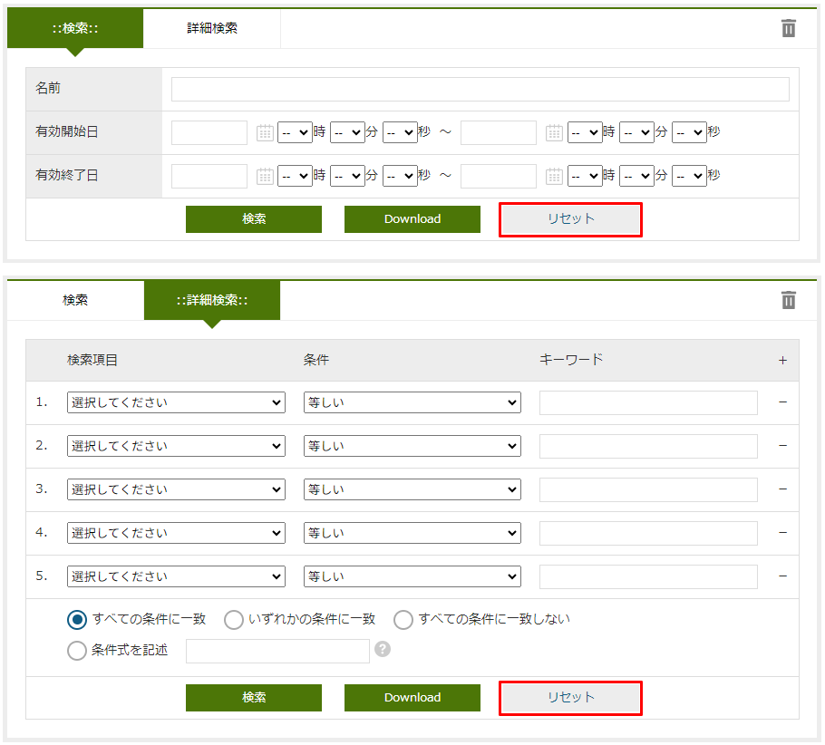

[[searchlayout]]
=== 検索画面
検索画面の条件、結果部分のレイアウトをカスタマイズできます。
レイアウト設定を行わない場合、検索一覧には基本項目及び、エンティティに登録されたプロパティが
エンティティ定義上での定義順で表示されます。

[[open_searchlayout]]
==== SearchLayoutの表示
レイアウト設定を行いたいエンティティを右クリックし、 `Search_Layoutを開く` を選択します。

[[searchlayout_structure]]
==== SearchLayoutの構成
SearchLayoutは以下の構成になっています。

[[searchlayout_toolbar]]
===== ツールバー
紫枠の部分はSearchLayoutの各Viewに対する操作を行うためのボタン群です。
EntityViewでは1つのエンティティに対して複数のレイアウトを保持できます。

[cols="1,4a", options="header"]
|===
|ボタン名
|説明

|表示
|View名で選択したViewを表示します。

|保存
|カスタマイズしたViewを保存します。
カスタマイズ後、保存ボタンをクリックしてください。

|追加
|Viewを新規に追加します。

|削除
|View名で選択したViewを削除します。

|標準ロード
|View定義を設定しない場合に表示される自動生成画面と同等の設定をロードします。

|コピー
|View名で選択したViewをコピーします。
|===

Viewを追加する場合、必ず `default` のViewを先に作成してください。
`default` のViewを作成せずにViewを追加した場合、検索一覧でエラーになる可能性があります。

[[searchlayout_addsection]]
===== 追加セクション
青枠の部分は検索一覧の該当部分にカスタマイズを入れるための機構です。
画面右側の `Section` 内の部品をドラッグ&ドロップで配置できます。
定義済みのテンプレートやHTMLベースのスクリプトを組み込むことができます。

[[searchlayout_condition_result]]
===== 検索条件、検索結果
緑枠の部分はエンティティのプロパティを配置する領域です。
画面右側の `Property` 、 `Element` 内の部品をドラッグ&ドロップで配置できます。
SearchLayoutが作成されてない状態だと、検索一覧表示時にはエンティティのプロパティが自動で配置されます。

[[searchview_setting]]
==== 検索画面の設定
図の①部分をクリックすると検索一覧全体に対する設定を行うダイアログが表示されます。

[cols="1,4a", options="header"]
|===
|設定項目
|設定内容

|画面タイトル
|画面に表示するタイトルを入力します。
未入力の場合、エンティティの `Display Name` に設定された内容を画面に表示します。

|イメージカラー
|ビューのイメージカラー(画面タイトルの左に表示されるアイコンの色)を選択します。
次から選択できます。

`blue` / `green` / `red` / `yellow`

フラットデザインでは表示されません。

|アイコンタグ
|タイトルの前に表示するiタグなどを利用した独自のアイコンを設定できます。

|ダイアログ表示時に最大化
|参照ダイアログ表示時に最大化する場合はチェックします。

|新規作成ボタンを非表示
|検索一覧(条件部)の上部に表示されている新規登録ボタンを非表示にする場合はチェックします。

|ごみ箱を非表示
| `ごみ箱を表示` リンクを非表示にする場合はチェックします。

|ごみ箱操作をユーザー削除データに限定
|ごみ箱内のデータ操作（取得/復元/削除）を削除したユーザーのみに限定する場合はチェックを入れます。
限定する場合、管理者ユーザーでも他者削除データは操作ができなくなります。

|検索WebApi
|検索一覧(条件部)の検索ボタンクリックで実行されるWebApiを設定します。

|ダウンロードアクション
|検索一覧(条件部)のDownloadボタンクリックで実行されるアクションを設定します。

|アップロード画面表示アクション
|検索一覧のUploadボタンクリックで実行されるアクションを設定します。

|新規登録アクション
|上部に表示されている新規登録ボタンクリックで実行されるアクションを設定します。

|表示アクション
|検索一覧(結果部)の詳細リンククリックで実行されるアクションを設定します。

|編集アクション
|検索一覧(結果部)の編集リンククリックで実行されるアクションを設定します。

|一括削除WebApi
|検索一覧(結果部)の削除ボタンクリックで実行されるWebApiを設定します。

|全削除WebApi
|検索一覧(結果部)の全選択ラジオボタンチェック時に表示されるダイアログで、 `検索条件を元に全て削除` を選択し、 `OK` ボタンを押下した際に実行されるWebApiを設定します。

|ボタン
|検索一覧(条件部)の上部に追加するボタンを設定します。
詳細は<<detailview_button, ボタン設定>>を参照してください。

|Javascriptコード
|検索一覧のScriptタグ内に出力するJavascriptコードを入力します。

|データの多言語化
|データ操作時に多言語化する場合はチェックします。
チェックした場合、エンティティ定義の `Data Localization` 設定を有効にしてデータアクセスします。

|物理削除
|チェックした場合、検索一覧(結果部)の `削除` ボタンクリック時にデータを物理削除します。
未チェックの場合、削除データはごみ箱に移動します。

|特定バージョンを削除
|バージョン管理しているEntityの場合に、検索結果の削除処理やアップロード時の `_useCtrl` による削除時に対象のバージョンデータのみを削除します。 +
アップロードによる削除では `version` 値が指定されている場合はそのバージョンのみ、未指定の場合は全バージョンを削除します。

WARNING: バージョン指定削除は、親子関係の参照を持つEntityはサポートしていないためエラーになります。また、バージョン指定して削除されたEntityはごみ箱へは格納されません。

|バージョン管理Entity以外の場合に参照先の保存時バージョンの検索を許可
|バージョン管理していないEntityに、バージョン管理している参照先プロパティ（参照タイプとして `最新バージョンを取得` と定義）を保持しているEntityに対して、
保存時のバージョンの検索を可能にします。
検索画面に `保存時のデータ（無効データ含む）を検索` オプションが表示されます。

NOTE: バージョン管理しているEntityの場合は、 `すべてのバージョン（無効データ含む）を検索` を指定することで、保存時のデータが検索されます。

|UserPropertyEditor利用時に特権実行でユーザー名を表示する
|UserPropertyEditorが設定されているプロパティに対し、ユーザー情報のEntity、またはユーザー名のプロパティに参照権限が無いユーザーでも、特権実行をしてユーザー名を表示することができます。
また、この設定は `SearchResultList` の検索結果にも適用されます。

|Entity権限における限定条件の除外設定
|Entity権限における限定条件を適用せずに検索を実行する参照先のプロパティ名を設定します。特権実行する場合、または `EQLカスタム処理クラス名` の設定がある場合はそちらが優先されます。

|EQLカスタム処理クラス名
|検索時やダウンロード時にクエリ等のカスタマイズを行いたい場合は
 `SearchQueryInterrupter` インターフェースを実装するクラスを指定してください。
詳細は<<GemCustomize_Search, カスタム検索処理>>を参照してください。

|ダウンロード時にEQLカスタム処理クラスを利用する
|EQLカスタム処理クラスをダウンロード時の検索処理でも利用するかを指定します。

|検索画面Handlerクラス名
|設定により対応できない動作をカスタマイズするためのフック用Handlerを指定します。
指定できるのは `SearchFormViewHandler` インターフェースを実装するクラスです。 +
実際に指定する場合は、GEMに特化した `SearchFormViewAdapter` クラスを継承して実装してください。
具体的な実装例としては、詳細リンクの表示を制御する `CheckPermissionLimitConditionOfEditLinkHandler` があります。

|===

[[searchcondition_setting]]
==== 検索条件の設定
図の②部分をクリックすると検索条件に対する設定を行うダイアログが表示されます。

[cols="1,4a", options="header"]
|===
|設定項目
|設定内容

|列数
|セクションの列数を設定します。

|詳細条件の表示件数
|詳細条件に初期表示する条件の数を設定します。

|詳細検索を非表示
|詳細検索タブを非表示にする場合はチェックします。

|定型検索を非表示
|定型検索タブを非表示にする場合はチェックします。

|クラス名
|セクションに設定するスタイルシートのクラス名を指定します。
複数指定する場合は半角スペースで区切って下さい。

|id
|画面上で一意となるidを設定します。

|データのファイル形式
|ダウンロードやアップロードで利用するファイル形式を指定します。

CSV::
CSVファイルを利用します。

EXCEL::
EXCELファイルを利用します。

SPECIFY::
CSVファイルかEXCELファイルのどちらを利用するかを画面で選択します。

未指定の場合は、<<../../../serviceconfig/index.adoc#GemConfigService,GemConfigService>> の `fileSupportType` によって動作します。

|ダウンロードボタンを非表示
|ダウンロードボタンを非表示にする場合はチェックします。

|ダウンロードダイアログを非表示
|ダウンロードボタン押下時に、出力内容を選択するダイアログを表示しない場合はチェックします。
チェックした場合、アップロード形式ではなく、検索結果に設定されている項目のみが出力されます。

|ダウンロード時oidを出力しない
|ダウンロードファイルにエンティティデータのoidを出力しない場合はチェックします。

|ダウンロード時BinaryReferenceを出力しない
|ダウンロードファイルにエンティティデータのBinaryReference（nameのみ）を出力しない場合はチェックします。

|ダウンロード時referenceを出力しない
|ダウンロードファイルにエンティティデータのReferenceを出力しない場合はチェックします。
未チェックの場合、oidを出力しない設定がされている場合はname項目または `表示ラベルとして扱うプロパティ` として指定された項目のみ、
されていない場合はoidとname項目または `表示ラベルとして扱うプロパティ` として指定された項目が出力されます。

|ダウンロード時表示名を出力しない
|Upload形式のダウンロードファイルのヘッダに、表示名を出力しないようにします。
チェックした場合、ダウンロードダイアログで、「ヘッダ行に表示名を利用しない」選択オプションを表示しません。

|多重度プロパティ出力形式
|ダウンロードファイルの出力で、多重度が複数のプロパティ（Reference以外）の出力形式を指定します。

EACH_COLUMN::
多重度の数分別々の列に出力します。

ONE_COLUMN::
１つの列にカンマ区切りでまとめて出力します。

ONE_COLUMN_FILL_NULL_VALUE::
１つの列にカンマ区切りでまとめて出力します。
登録データが多重度分保存されていない場合にも多重度分空を補完します。

|ダウンロード時文字コードを指定可能にする
|ダウンロードファイルの形式がCSVの場合に、ダウンロード時に文字コードを選択可能にするかを設定します。

NONE:: TopViewのCsvDownload Settingsが設定されている場合、SpecfyCharacterCodeEntityViewの設定に従う
SPECIFY:: 文字コード指定を可能にする
NOT_SPECIFY:: 文字コード指定を不可にする

|ダウンロード件数の上限値
|ダウンロード件数の上限値を設定します。
データを取得する際に制限をかけます。
設定されていない場合、<<../../../serviceconfig/index.adoc#GemConfigService,GemConfigService>> の `csvDownloadMaxCount` が上限となります。

WARNING: SQLServerにおいて上限値を指定する場合は、
service-configにて <<../../../serviceconfig/index.adoc#EntityFileUploadService,EntityFileUploadService>> の `mustOrderByWithLimit` を `true` にしてください。

|Upload形式のダウンロード時に一括でロードする
|Upload形式のダウンロードで、多重度複数の参照を含む場合に一括でロードをするかを設定します。
一括でロードしない場合は、 `ロード単位` 設定によって分割してロードを行います。

NOTE: 一括でロードすることにより、内部のSQL処理を減らすことが可能ですが、参照データ分内部にメモリ展開されるため、
大量の多重度複数の参照先プロパティが定義されていたり、参照先のデータ件数が多い場合は注意してください。

|Upload形式のCSVダウンロード時のロード単位
|Upload形式のCSVダウンロードで、多重度複数の参照を含む場合に一度にロードする件数を設定します。
`一括でロードする` 設定がONの場合はこの設定は無視されます。
未指定の場合は、<<../../../serviceconfig/index.adoc#GemConfigService,GemConfigService>> の `uploadableCsvDownloadLoadSize` 値をロード単位として処理を行います。

ロード単位が1以下の場合は、1件ずつロードを行います。

|ダウンロード項目
|アップロード形式ではないダウンロードファイルに対して、検索結果に設定されている項目ではなく、直接出力項目を指定したい場合に設定します。
カンマ区切りで出力対象のプロパティ名を指定します。参照項目のプロパティなどは.プロパティ名で指定します。
(参照項目自体が指定された場合は参照項目のnameを出力)

`ダウンロード項目` が設定されてる場合は、 `ダウンロード時oidを出力しない` 、 `ダウンロード時BinaryReferenceを出力しない` 、 `ダウンロード時referenceを出力しない` の各設定は無視します。

|ダウンロード項目(アップロード形式)
|アップロード形式のダウンロードファイルに対して、直接出力項目を指定したい場合に設定します。
カンマ区切りで出力対象のプロパティ名を指定します。参照プロパティに対する参照先エンティティのプロパティは指定できません。

`oid` が含まれていない場合は自動で追加されます。 対象Entityがバージョン管理されていて `version` が含まれていない場合は自動で追加されます。

|ファイル名Format
|ダウンロードするファイル名のフォーマットを設定します。

====
${csvName}_${yyyy}${MM}${dd}
====

|アップロードボタンを非表示
|アップロードボタンを非表示にする場合にチェックします。

アップロード可能なファイルは、ダウンロード時に `アップロード用の形式で出力` をチェックして出力するか、
アップロード画面で `Sample Download` をクリックすることで取得できます。

ファイルをアップロードする際に、 `oid` 値が存在する行はupdate、存在しない行はinsertされます。

|アップロードで登録を許可しない
|アップロードでinsertを許可しない場合にチェックします。

|アップロードで更新を許可しない
|アップロードでupdateを許可しない場合にチェックします。

|アップロードで削除を許可しない
|アップロードでdeleteを許可しない場合にチェックします。

|アップロード登録項目
|アップロードでinsertする項目を制限したい場合に設定します。カンマ区切りで登録対象のプロパティ名を指定します。

|アップロード更新項目
|アップロードでupdateする項目を制限したい場合に設定します。カンマ区切りで更新対象のプロパティ名を指定します。

|アップロードトランザクションタイプ
|アップロード時のコミットタイミングを設定します。

ONCE:: ファイルの全行の処理が終わった時点でコミットします。
DIVISION:: <<../../../serviceconfig/index.adoc#GemConfigService,GemConfigService>> の `csvUploadCommitCount` で設定した単位でコミットします。

|アップロード更新データTargetVersion(非バージョン管理)
|バージョン管理対象ではないEntityのアップロード処理で、更新データに対するTargetVersionを設定します。

未指定、 `CURRENT_VALID` `SPECIFIC` から指定します。
未指定の場合は、<<../../../serviceconfig/index.adoc#EntityFileUploadService,EntityFileUploadService>> の `defaultUpdateTargetVersionForNoneVersionedEntity` で設定した値を利用します。

|バージョン管理Entity以外の場合にアップロード画面でTargetVersionの指定を許可
|バージョン管理Entity以外の場合にアップロード画面で更新時のTargetVersionの指定を許可します。

許可した場合、アップロード画面に `保存時のデータを更新対象にする` オプションが表示され、TargetVersionが指定可能になります。

|カスタムアップロード処理クラス名
|アップロード処理をカスタマイズしたい場合は `SearchFormCsvUploadInterrupter` インターフェースを実装するクラスを指定してください。
詳細は <<GemCustomize_Upload, カスタムアップロード処理>> を参照してください。

|重複行をまとめる
|チェックした場合、重複行をまとめます。
検索時に `distinct` を付与します。

|デフォルト検索条件
|検索画面上には表示されず、検索時に自動的に付与される検索条件をPreparedQuery形式で指定します。
WHERE句に指定する条件を指定してください。
詳細は<<default_search_cond, デフォルト検索条件>>を参照してください。

|フィルタ設定
|定型検索で使用するフィルタを設定します。
未指定の場合は全てのフィルタが対象になります。

|検索時にデフォルト検索条件をフィルタ定義と一緒に利用するか
|フィルタ定義を使う検索（定型検索、検索結果一覧パーツまたはウィジェット）で、フィルタ定義と一緒にデフォルト検索条件を適用する場合にチェックします。

チェックした場合:: フィルタの条件＋デフォルト検索条件
チェックしない場合:: フィルタの条件のみ

|デフォルトプロパティ条件設定スクリプト
|検索一覧(条件部)のプロパティの初期条件をGroovyScript形式で設定します。
<<defaultconditionscript, デフォルトプロパティ条件設定スクリプト>>を参照してください。

|ソート設定|検索時にデフォルトで設定されるソート条件を設定します。
<<searchview_sortsetting, ソート設定>>を参照してください。

|検索時にソートしない
|検索時に結果をソートしない場合はチェックします。

WARNING: SQLServerにおいて、「重複行をまとめる」をチェックしている場合は、「検索時にソートしない」はチェックしないようにしてください。

|全文検索時にソートする
|全文検索時にソートする場合はチェックします。

|===

[[default_search_cond]]
===== デフォルト検索条件
PreparedQuery形式でWHERE句に指定する条件を指定してください。以下がバインドされています。

.独自のバインド変数
独自に以下の変数がバインドされています。
====
request:: リクエスト
session:: セッション
====

.PreparedQueryのバインド変数、関数
PreparedQueryとして以下の変数、関数が利用できます。
====
user:: 実行するユーザーの情報 *1参照
date:: 現在日時のjava.util.Dateのインスタンス。
sysdate:: 現在日付（時間含まず）の文字列。例：2011-01-20
sysdatetime:: 現在日時の文字列。例：2011-01-18 02:05:03.348
systime:: 現在時間の文字列。例:23:19:00

toIn(Collection/Array)::
引数をinの文字列表現に変換。 +
利用例：";oid in (${toIn(user.groupOid)})";
toDateString(Date)::
引数を日付の文字列表現に変換。 +
利用例";startDate > '${toDateString(date)}'";
toLocalDateString(Date)::
引数をローカル日付の文字列表現に変換。 +
利用例";startDate > '${toLocalDateString(date)}'";
toDateTimeString(Date)::
引数を日時の文字列表現に変換。 +
利用例";startDateTime > '${toDateTimeString(date)}'";
toTimeString(Date)::
引数を時間の文字列表現に変換。 +
利用例";startTime > '${toTimeString(date)}'";
toLocalTimeString(Date)::
引数をローカル時間の文字列表現に変換。 +
利用例";startTime > '${toLocalTimeString(date)}'";
addYear(Date, int)::
引数に指定の年を加えたjava.util.Dateインスタンスを取得する。 +
利用例";startDate > '${toDateString(addYear(date, -1))}'";
addMonth(Date, int)::
引数に指定の月を加えたjava.util.Dateインスタンスを取得する。 +
利用例";startDate > '${toDateString(addMonth(date, 3))}'";
addWeek(Date, int)::
引数に指定の週を加えたjava.util.Dateインスタンスを取得する。 +
利用例";startDate > '${toDateString(addWeek(date, -2))}'";
addDay(Date, int)::
引数に指定の日を加えたjava.util.Dateインスタンスを取得する。 +
利用例";startDate > '${toDateString(addDay(date, 10))}'";
addHour(Date, int)::
引数に指定の時間を加えたjava.util.Dateインスタンスを取得する。 +
利用例";startDateTime > '${toDateTimeString(addHour(date, -12))}'";
addMinute(Date, int)::
引数に指定の分を加えたjava.util.Dateインスタンスを取得する。 +
利用例";startTime > '${toTimeString(addMinute(date, 30))}'";
addSecond(Date, int)::
引数に指定の秒を加えたjava.util.Dateインスタンスを取得する。 +
利用例";startTime > '${toTimeString(addSecond(date, -10))}'";
addMillisecond(Date, int)::
引数に指定のミリ秒を加えたjava.util.Dateインスタンスを取得する。 +
利用例";startDateTime > '${toDateTimeString(addMillisecond(date, -500))}'";
====

.*1 userについて
userが所属するグループに関する以下の変数、関数を呼び出すことが出来ます。
====
groupCode::
所属グループのグループコードのString[]。
groupCodeWithChildren::
所属グループ(配下グループ含む)のグループコードのString[]。
groupCodeWithParents::
所属グループ(上位グループ(ルートまで)含む)のグループコードのString[]。
groupOid::
所属グループのoidのString[]。
groupOidWithChildren::
所属グループ(配下グループ含む)のグループのoidのString[]。
groupOidWithParents::
所属グループ(上位グループ(ルートまで)含む)のグループのoidのString[]。
memberOf(String)::
引数のグループコードのメンバ(サブグループに所属していても)の場合trueを返す。
====

.GroovyTemplateのバインド変数、関数
GroovyTemplateとして以下の変数、関数が利用できます。
====
out:: Writer
em:: EntityManager
edm:: EntityDefinitionManager
auth:: AuthContext

escHtml(Object):: 引数をHtmlエスケープ
escJs(Object):: 引数をJavascriptエスケープ
escSql(Object):: 引数をSQLエスケープ
escSqlLike(Object):: 引数をLike用SQLエスケープ
nte(Object):: 引数がnullの場合空文字に
====

.設定例
[source,groovy]
----
<%@import java.sql.Timestamp%>
<%@import java.text.SimpleDateFormat %>
<%
def date = new SimpleDateFormat("yyyy/MM/dd").parse("2012/09/06");
def timestamp = new Timestamp(date.getTime());
%>
createDate<='${timestamp}' and createBy='${user.getAttribute("oid")}'
----

[[defaultconditionscript]]
===== デフォルトプロパティ条件設定スクリプト
検索一覧(条件部)のプロパティの初期条件をGroovyScript形式で設定します。
変数としてinitCondMap(Map<String, Object>)がバインドされています。
initCondMapに対して、 `key(プロパティ名)` 、 `value(初期条件とする値)` を設定すると初期条件として値が設定されます。

[source,groovy]
----
initCondMap.put("autoNumber", "12345678");//AutoNumber
initCondMap.put("boolean", "false");//Boolean
initCondMap.put("string", "abcdefg");//String
initCondMap.put("string2", "aaaa");//String(select形式の場合も同様)

//SelectPropertyEditor
//(Checkbox形式の場合は配列で複数指定可能)
String[] selectArray = ["val1", "val3"];//値を指定
//def selectArray = ["val1","val3"] as String[];//この形式も可能
initCondMap.put("select", selectArray);
//下の形式は不可。[]はGroovyではjava.util.List形式に変換されるのでエラー。配列のみ可。
//initCondMap.put("select", ["val1","val3"]);

//Date、DateTime、Time
//範囲指定は配列で指定、Fromが[0]、Toが[1]で指定
String[] date1Array = ["20150101", "20150103"];
initCondMap.put("date", date1Array);
//Fromが非表示の場合も、Toは[1]で指定
String[] date2Array = [null, "20150103"];
initCondMap.put("date2", date2Array);
//単一日で指定がONの場合は配列でなくても可能
initCondMap.put("date3", "20150101");

String[] timeArray = ["010203123", "203040456"];//9ケタ
initCondMap.put("time", timeArray);//TimePicker形式
initCondMap.put("time2", timeArray);//Select形式
String[] dateTimeArray = ["20150101010203123", "20150103203040456"];//yyyyMMdd+9ケタ
initCondMap.put("dateTime", dateTimeArray);//DateTimePicker形式
initCondMap.put("dateTime2", dateTimeArray);//DatePicker+Select形式

//Integer、Float、Decimal
//範囲指定がOFFの場合は配列でなくても可能
initCondMap.put("integer1", "1000");
//範囲指定は配列で指定、Fromが[0]、Toが[1]で指定
String[] integer2RangeArray = ["1000", "2000"];
initCondMap.put("integer2", integer2RangeArray);
//Fromが非表示でも、Toの指定は[1]に設定
String[] integer3RangeArray = [null, "2000"];
initCondMap.put("integer3", integer3RangeArray);

//Reference
String[] referenceArray = ["6275503", "6275505"];//OIDを指定
initCondMap.put("ref1", "ref002");//Link,名前指定
initCondMap.put("ref2", referenceArray[0]);//Select,OID指定
initCondMap.put("ref3", referenceArray);//Checkbox,OID指定(複数時は配列)
initCondMap.put("ref4", referenceArray);//Link Dialog,OID指定(複数時は配列)
initCondMap.put("ref5", "ref003");//Link+NestProperty,名前指定
initCondMap.put("ref5.string1", "hijklmn");//Link+NestProperty
initCondMap.put("ref5.integer1", "111111");//Link+NestProperty
initCondMap.put("category3", "6278196");//RefCombo,OID指定

//UserPropertyEditor
initCondMap.put("createBy", "者");//名前Like検索
----

[[searchview_sortsetting]]
===== ソート設定
検索時および、検索結果テーブルの列ヘッダのクリックによるソート時に設定されるソート条件を設定します。 +

ソート設定が未指定の場合::
検索時は、当該エンティティのOIDの降順でソートします。 +
列ヘッダのクリックによるソート時は、クリックされた項目でソートします。参照プロパティ列のヘッダがクリックされた場合、表示中の項目でソートします（<<referencepropertyeditor,ReferencePropertyEditor>> の「表示ラベルとして扱うプロパティ」が未設定の場合、 `Name` でソートし、プロパティが設定された場合は、表示ラベルとして扱うプロパティでソートします）。

ソート設定が指定された場合::
検索時は、ソート設定に指定された項目でソートします。 +
列ヘッダのクリックによるソート時は、クリックされた項目を第１キー、ソート設定に指定された項目を第２キー以降としてソートします。

[cols="1,4a", options="header"]
|===
|設定項目
|設定内容

|ソート項目
|検索時にデフォルトで指定するソート項目を設定します。 +
参照プロパティが指定された場合の挙動は以下の通りです。

参照プロパティ自体が設定された場合（例：reference）::
<<referencepropertyeditor,ReferencePropertyEditor>> の「表示ラベルとして扱うプロパティ」が未設定の場合、 `Name` でソート。プロパティが設定された場合は、表示ラベルとして扱うプロパティでソートします。

参照先エンティティの特定のプロパティまで指定された場合（例：reference.oid） ::
ソート項目で明示指定された参照先エンティティのプロパティ（例の場合、 `oid`）でソートします。

|ソート種別
|検索時にデフォルトで指定するソート種別を設定します。

|null項目のソート順
|null項目のソート順を設定します。

NONE:: 未指定、DB依存
FIRST:: null項目を先頭にソート
LAST:: null項目を後尾にソート
|===

[[searchresult_setting]]
==== 検索結果の設定
図の③部分をクリックすると検索結果に対する設定を行うダイアログが表示されます。

[cols="1,4a", options="header"]
|===
|設定項目
|設定内容

|検索結果の表示件数
|検索結果の表示件数を設定します。
未指定の場合、または0以下の場合は、<<../../../serviceconfig/index.adoc#GemConfigService, GemConfigService>>
で定義される `searchResultDispRowCount` が適用されます。

|検索結果の高さ
|検索結果の高さを設定します。
0を設定した場合、高さを自動とします。

|検索結果をまとめる
|検索結果をまとめて表示します。
OIDとVersionが同じであるレコードをまとめて表示します。

|編集リンクを非表示
|編集リンクを非表示にする場合はチェックします。

|Entity権限の可能範囲条件で編集リンク表示を制御
|通常はEntity権限の更新権限がある場合は一律編集リンクを表示しますが、
レコードごとに更新権限の更新可能範囲条件をチェックして編集リンクの表示を制御します。

|削除ボタンを非表示
|削除ボタンを非表示にする場合はチェックします。

|ページングを非表示
|ページング部品全体を非表示にする場合はチェックします。
非表示にした場合は、検索結果の表示件数を最大件数としてデータを取得します。 +
レコード数が検索結果の表示件数以下となるエンティティなど、ページングせずに全件表示したい場合に有効化してください。

|件数を非表示
|ページング部品の内、ページ件数、ページジャンプ、ページリンクを非表示にする場合はチェックします。

|ページジャンプを非表示
|ページジャンプを非表示にする場合はチェックします。

|ページリンクを非表示
|ページリンクを非表示にする場合はチェックします。

|ページング表示位置
|ページング部品の表示位置を設定します。

BOTH:: 検索結果の上下に表示
TOP:: 検索結果の上部に表示
BOTTOM:: 検索結果の下部に表示

|一括更新ボタンを表示
|一括更新ボタンを表示にする場合はチェックします。

|BulkViewレイアウト定義を利用
|BulkLayout定義を利用して一括更新画面を生成し、複数項目を一括更新します。

|一括更新の排他制御起点
|一括更新の排他制御起点。

WHEN_DIALOG_OPEN:: 更新ダイアログが開く時
WHEN_SEARCH:: 検索実行時

|一括更新ボタン表示ラベル
|画面に表示する一括更新ボタンのラベルを入力します。
未入力の場合、デフォルトのラベルを画面に表示します。（日本語の場合、" `一括更新` " を画面に表示します。）

|一括更新デフォルト選択項目
|一括更新デフォルト選択項目。
BulkViewレイアウト定義を利用しない場合、デフォルト選択項目を指定します。

|タイトル
|セクションのタイトルを設定します。

|クラス名
|セクションに設定するスタイルシートのクラス名を指定します。
複数指定する場合は半角スペースで区切って下さい。

|id
|画面上で一意となるidを設定します。

|親子関係の参照を物理削除
|チェックした場合、削除時に親子関係を参照します。
一括更新画面での保存時に削除したデータも物理削除されます。

|更新時に強制的に更新処理を行う
|変更項目が一つもなくとも、強制的に更新処理（更新日時、更新者が更新される）を行います。

|カスタム登録処理クラス名
|一括更新時にカスタマイズ処理を行いたい場合は `RegistrationInterrupter`
インターフェースを実装するクラスを指定してください。
詳細は<<GemCustomize_Registration, カスタム登録処理>>を参照してください。

|カスタムロード処理クラス名
|エンティティのロード時にオプション等のカスタマイズを行いたい場合は `LoadEntityInterrupter`
インターフェースを実装するクラスを指定してください。
詳細は<<GemCustomize_Load, カスタムロード処理>>を参照してください。

|一括削除コミットトランザクション制御
|一括削除をするとき、一斉に実行するか（ONCE）、バッチに分けて実行するか（DIVISION）を決めます。

|カスタム一括削除処理クラス名
|エンティティの一括削除時に絞込み等のカスタマイズを行いたい場合は `BulkOperationInterrupter`
インターフェースを実装するクラスを指定してください。
詳細は<<GemCustomize_BulkOperation, カスタム一括処理>>を参照してください。

|一括更新コミットトランザクション制御
|一括更新をするとき、一斉に実行するか（ONCE）、バッチに分けて実行するか（DIVISION）を決めます。

|カスタム一括更新処理クラス名
|エンティティの一括更新時に絞込み等のカスタマイズを行いたい場合は `BulkOperationInterrupter`
インターフェースを実装するクラスを指定してください。
詳細は<<GemCustomize_BulkOperation, カスタム一括処理>>を参照してください。

|===

[[searchlayout_setting]]
==== 検索画面のレイアウト設定

[[searchlayout_dropproperty]]
===== プロパティの配置
Propertyから検索一覧へドラッグ&ドロップし、任意のPropertyを配置していきます。
Propertyは、検索条件と検索結果のSectionにのみ配置できます。

スクリプトセクション、テンプレートセクションについては、ボタン上部、ボタン下部、検索一覧中央、検索一覧下部に配置できます。
スクリプトセクション、テンプレートセクションについては、<<section, セクションの設定>>を参照してください。

エレメントについては、<<searchlayout_element_setting, エレメント>>を参照してください。

（例）下図はデフォルトと同じ検索項目を維持し、オブジェクト情報の順序のみ変更しています。
Propertyのemployee（従業員）とparentEmployee（親部署）はフォルダのアイコンになっています。
どちらも参照プロパティで、ダブルクリックで展開することにより、参照プロパティが持つプロパティを検索条件と検索結果に配置することもできます。

配置した各プロパティの設定ボタンをクリックすることでカスタマイズが可能です。

[[searchcondition_property_setting]]
===== 検索条件プロパティの設定
検索条件に配置されたプロパティに対する設定を行います。

[cols="1,4a", options="header"]
|===
|設定項目
|設定内容

|表示
|プロパティを画面に表示しない場合はチェックします。

|表示判定スクリプト
|表示可否を判定するスクリプトを設定します。
詳細は<<element_judgedisplayscript, 表示判定スクリプト>>を参照してください。

|表示ラベル
|画面に表示するラベルを設定します。

|クラス名
|スタイルシートのクラス名を指定します。
複数指定する場合は半角スペースで区切って下さい。

|ツールチップ
|ツールチップに表示する説明を設定します。

|通常検索で非表示
|通常検索条件の項目として表示しない場合はチェックします。

|詳細検索で非表示
|詳細検索条件の項目として表示しない場合はチェックします。

|通常検索での必須項目
|通常検索条件の必須項目にする場合はチェックします。

|詳細検索での必須項目
|詳細検索条件の必須項目にする場合はチェックします。

|プロパティエディタ
|プロパティエディタを設定します。
プロパティエディタの詳細については、<<propertyeditor, プロパティエディタ>>を参照してください。

|自動補完設定
|項目間の自動補完を設定します。
詳細は<<autocompletion, 自動補完設定>>を参照してください。

|入力チェック
|入力チェック方法を設定します。
詳細は<<validation, 入力チェック>>を参照してください。
|===

[[validation]]
.入力チェック
検索実行時に検索条件に対する入力チェックを行います。
未指定の場合は入力チェックは行われません。
なお、現時点では複数項目のいずれかが必須かチェックする機能のみが実装されています。

[cols="1,4a", options="header"]
|===
|設定項目
|設定内容

|メッセージ
|入力チェックエラー時に表示するメッセージを設定します。

|通常検索で入力チェックを行う
|通常検索実行時に入力チェックを行う場合はチェックします。

|詳細検索で入力チェックを行う
|詳細検索実行時に入力チェックを行う場合はチェックします。

|対象プロパティ
|このプロパティと組み合わせて必須チェックを行うプロパティの名前を設定します。
参照プロパティのネストされた項目を指定する場合は `.(ドット)` でプロパティ名を連結します。
|===

[[searchresult_property_setting]]
===== 検索結果プロパティの設定
検索結果に配置されたプロパティに対する設定を行います。

[cols="1,4a", options="header"]
|===
|設定項目
|設定内容

|表示
|プロパティを画面に表示しない場合はチェックします。

|表示判定スクリプト
|表示可否を判定するスクリプトを設定します。
詳細は<<element_judgedisplayscript, 表示判定スクリプト>>を参照してください。

|表示ラベル
|画面に表示するラベルを設定します。

|クラス名
|スタイルシートのクラス名を指定します。
複数指定する場合は半角スペースで区切って下さい。

|列幅
|検索一覧(結果部)に表示する際の列幅（単位はピクセル）を設定します。
単位は不要です。

|テキストの配置
|検索一覧(結果部)に表示する際のテキスト(データ)の配置を設定します。

LEFT:: 左寄せ
CENTER:: 中央寄せ
RIGHT:: 右寄せ

|プロパティエディタ
|プロパティエディタを設定します。
プロパティエディタの詳細については、<<propertyeditor, プロパティエディタ>>を参照してください。

|ソートを許可
|ソートを許可する場合はチェックします。

WARNING: 対象のプロパティが暗号化されている場合、またはReference型以外で多重度が複数の場合は、ソートはできません。許可設定は無効になります。

|null項目のソート順
|null項目のソート順を設定します。

NONE:: 未指定、DB依存
FIRST:: null項目を先頭にソート
LAST:: null項目を後尾にソート

|ダウンロードファイルに出力する
|ダウンロードファイルに出力するかを設定します。
検索条件設定で `ダウンロード項目` を指定している場合は、この設定は無視されます。
アップロード形式ではないダウンロードファイルに対して有効になります。

|一括更新プロパティエディタ
|一括更新プロパティエディタを設定します。
未設定の場合、当該プロパティを一括更新画面に表示しません。
プロパティエディタの詳細については、<<propertyeditor, プロパティエディタ>>を参照してください。

|一括更新で必須マークを表示
|一括更新画面で必須マークを表示するかを設定します。

DEFAULT:: エンティティのプロパティ定義(Required)に従います。 +
　必須マークを表示する:: Requiredにチェックあり
　必須マークを表示しない:: Requiredにチェックなし
DISPLAY:: 必須マークを表示します。
NONE:: 必須マークを表示しません。

|===

.リセット処理
通条検索、詳細検索には、標準で `リセット` ボタンが表示されます。

リセットを実行すると、検索条件がリセットされます。
リセットされる値は画面初期表示時と同じです。
SeachConditionSectionの `デフォルトプロパティ条件設定スクリプト` で設定された条件や、EntityMenuItemのパラメータで指定された条件が設定された状態になります。

* カスタマイズされたInput要素に対するリセット処理 +
TemplateSectionやTemplateElement、ScriptSectionなどを利用して独自にInput要素を追加している場合は、リセット処理に対してHandlerを追加することで対応してください。
+
.追加例
[source,html]
----

----

* リセットボタンの非表示 +
既存の処理などを考慮して、リセットボタンを表示したくない場合、mtp-service-config.xmlにて以下の値をfalseに設定してください。(service-config単位でのみ設定可能です)
+
[source,xml]
----
<!-- gem Settings -->
<service>
	<interface>org.iplass.gem.GemConfigService</interface>

	・・・・

	<!-- 検索一覧でリセットボタンを表示するか
		デフォルトで表示するに設定されています。非表示にしたい場合はfalseを設定してください。
	-->
	<!--
	<property name="showSeachCondResetButton" value="false"/>
	 -->

</service>
----

[[searchlayout_element_setting]]
===== エレメント
入力項目以外の画面要素を標準セクション内にドラッグ&ドロップすることで、画面に配置できます。

[[searchlayout_space]]
====== スペース
スペースを設定します。検索条件の複数列表示のセクションで空白のセルを作りたい場合等に利用します。

設定可能な項目はありません。

[[searchlayout_virtualproperty]]
====== 仮想プロパティ
プロパティと同様の表示が出来る仮想プロパティを設定します。多重度は１のみサポートします。
検索結果として値を出力するには、 <<GemCustomize_Search,カスタム検索処理>> の `afterSearch` などで、明示的に値を設定します。

[cols="1,1,4a"]
|===
|設定項目
|利用箇所
|設定内容

|プロパティ名
|検索条件、検索結果
|仮想プロパティの名前を設定します。
既に設定されている仮想プロパティの名前や、エンティティに定義されているプロパティと同じ名前は設定できません。

|表示ラベル
|検索条件、検索結果
|画面に表示するラベルを設定します。

|クラス名
|検索条件、検索結果
|スタイルシートのクラス名を指定します。
複数指定する場合は半角スペースで区切って下さい。

|説明
|検索条件
|入力欄下部表示する説明を設定します。

|ツールチップ
|検索条件
|ツールチップに表示する説明を設定します。

|列幅
|検索結果
|検索一覧(結果部)に表示する際の列幅（単位はピクセル）を設定します。
単位は不要です。

|テキストの配置
|検索結果
|検索一覧(結果部)に表示する際のテキスト(データ)の配置を設定します。

LEFT:: 左寄せ
CENTER:: 中央寄せ
RIGHT:: 右寄せ

|ダウンロードファイルに出力する
|検索結果
|ダウンロードファイルに出力するかを設定します。
検索条件設定で `ダウンロード項目` を指定している場合は、この設定は無視されます。
アップロード形式ではないダウンロードファイルに対して有効になります。

|プロパティエディタ
|検索条件、検索結果
|以下の型を選択します。表示したい内容に合わせて変更してください。
詳細は<<propertyeditor, プロパティエディタ>>を参照してください。

BooleanPropertyEditor +
DatePropertyEditor +
DecimalPropertyEditor +
FloatPropertyEditor +
IntegerPropertyEditor +
SelectPropertyEditor +
StringPropertyEditor(デフォルト) +
TimePropertyEditor +
TimestampPropertyEditor +
TemplatePropertyEditor +
UserPropertyEditor
|===

[[autocompletion]]
===== 自動補完設定
画面内の項目が変更された際に、連動して他の項目の値を補完する仕組みです。
連動元の値を元に、連動先に値を補完する仕組みをJavascriptで記述する方法と、WebApiでサーバへアクセスし、EQLやGroovyScriptで動的に連動先の値を取得し、表示形式にあわせて値を設定する方法があります。

[[autocompletion_javascript]]
.JavascriptAutocompletionSetting
開発者がJavascriptを定義し、自動補完の処理を自由に設定できます。
処理はクライアント側で完結します。

[cols="1,4a", options="header"]
|===
|設定項目
|設定内容

|連動元のプロパティ
|自動補完のトリガーとなるプロパティ、複数設定可能。
<<autocompletion_property, 連動元のプロパティ>>を参照してください。

|Javascript
|上記項目をトリガーとして発生したイベントで実行するJavascript。
変数sourceValueに上記項目の値を保持しています。

.変数の形式
[source,javascript]
----
const sourceVales = {
  プロパティ名1:プロパティ値,
  プロパティ名2:[プロパティ値,...], *多重度が2以上の場合
}
----

|===

[[autocompletion_webapi]]
.WebApiAutocompletionSetting
WebApiでサーバ側から自動補完の値を取得します。
EQLの実行結果、もしくはGroovyScriptの実行結果をクライアントに返却し、型に合わせた形で自動的に値を設定します。

[cols="1,4a", options="header"]
|===
|設定項目
|設定内容

|自動補完タイプ
|自動補完の値を取得する方式。

EQL:: 設定項目のEQLを実行し、その結果をクライアントに返す。
GROOVYSCRIPT:: 設定項目のGroovyScriptを実行し、その結果をクライアントに返す。

|連動元のプロパティ
|自動補完のトリガーとなるプロパティ、複数設定可能。
<<autocompletion_property, 連動元のプロパティ>>を参照してください。

|EQL
|自動補完タイプでEQLを選択した際に実行する処理です。
GroovyTemplate形式で記述してください。
対象の項目がReference型の場合、エンティティの配列を返却します。
EQLにはoidとnameを必ず指定してください。
Reference型以外の場合、最初のSelect項目を補完の値として利用します。

.利用可能な変数
[source,java]
----
user    : UserBinding・・・ユーザー情報
params    : Map・・・連動元のプロパティの値
----

.自動補完が可能な型と返却値の型
[source,java]
----
Binary型    : String(検索条件のみ)
Boolean型    : boolean, String(true/false)
Date型    : Date, String(yyyyMMdd)
Datetime型    : Timestamp, String(yyyyMMddhhmmssSSS)
Decimal型    : Bigdecimal, String
Float型    : Double, String
Integer型    : Long, String
LongText型    : String
Reference型    : Entity(oid, nameは必須)
Select型    : SelectValue, String(value値)
String型    : String
Time型    : Time, String(hhmmssSSS)
----

|GroovyScript
|自動補完タイプでGROOVYSCRIPTを選択した際に実行する処理です。
GroovyScript形式で記述してください。

`利用可能な変数` 、 `自動補完が可能な型と返却値の型` はEQLと同じです。
|===

[[autocompletion_property]]
.連動元のプロパティ
自動補完のトリガーとなる連動元のプロパティを指定します。

[cols="1,4a", options="header"]
|===
|設定項目
|設定内容

|プロパティ名
|プロパティ名。
詳細は<<autocompletion_property_patter, プロパティ名の指定方法>>を参照してください。

|ネストプロパティ同士の自動補完
|NestTable、ReferenceSection内で自動補完する場合はチェックします。

|参照プロパティのインデックス
|NestTable、ReferenceSectionの項目をトリガーに大本のエンティティの項目を更新する際に、
NestTableの特定の行や特定のReferenceSectionのみを対象にする場合にそのインデックス指定します。
未指定の場合、全ての行やセクションの変更イベントがトリガーとなります。
|===

[[autocompletion_property_patter]]
.プロパティ名の指定方法
プロパティ名は連動元と連動先の関係によって指定方法が変わります。

以下の構造を例にします。
----
Entity
 -prop1
 -prop2
 -propRef
  -refProp1
  -refProp2
----

.検索一覧
検索一覧では参照プロパティの項目を直接ドラッグ&ドロップで配置する方法と、ReferencePropertyEditorの表示プロパティ(NestProperty)を設定する方法があります。

[cols="1,1,1,1,1,1", options="header"]
|===
|連動元|連動先|プロパティ名の設定値|配置の方法|ネスト同士の補完|備考
|prop1|prop2|prop1|||
|prop1|refProp1|prop1|直接D&D||
|prop1|refProp1|prop1|NestProperty||
|refProp1|prop1|propRef.refProp1|直接D&D||
|refProp1|prop1|propRef.refProp1|NestProperty||
|refProp1|refProp2|propRef.refProp1|直接D&D||
|refProp1|refProp2|refProp1|NestProperty|○|
|===

.詳細編集画面
詳細編集画面ではReferencePropertyEditorのNestTableと、参照セクション(ReferenceSection)で参照プロパティの項目を設定できます。

[cols="1,1,1,1,1,1,1", options="header"]
|===
|連動元|連動先|プロパティ名の設定値|配置の方法|ネスト同士の補完|参照プロパティのインデックス|備考
|prop1|prop2|prop1||||
|prop1|refProp1|prop1|NestTable|||全行を補完
|prop1|refProp1|prop1|ReferenceSection|||
|refProp1|prop1|propRef.refProp1|NestTable|||
|refProp1|prop1|propRef.refProp1|NestTable||○|特定行を補完
|refProp1|prop1|propRef.refProp1|ReferenceSection|||
|refProp1|prop1|propRef.refProp1|ReferenceSection||○|特定セクションを補完
|refProp1|refProp2|propRef.refProp1|NestTable|○||単一行を補完
|refProp1|refProp2|refProp1|ReferenceSection|○||
|===
