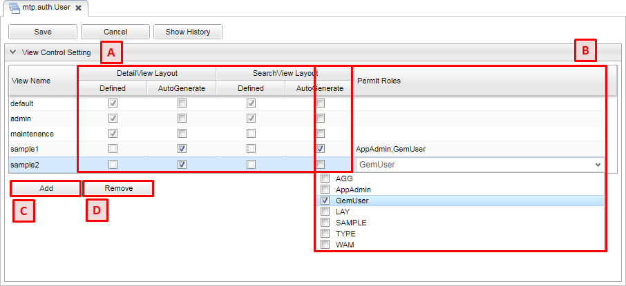

[[viewcontrol]]
=== Viewの管理設定
Viewの管理設定は、検索一覧、詳細画面両方に関わる設定を行う画面です。

[[open_fviewcontrol]]
==== Viewの管理設定の表示
Viewの管理設定を行いたいエンティティを右クリックし、 `Viewの管理設定を開く` を選択します。

[[viewcontrol_structure]]
==== Viewの管理設定の構成
Viewの管理設定は以下の構成になっています。

.A.自動生成管理
エンティティの検索一覧、詳細画面はレイアウトが未設定の場合、自動で生成し画面を表示します。
しかし、ロール毎に構成を変えたりする場合、複数のレイアウトを設定する必要があります。
そうした場合は自動生成が行えず、例えば標準的なレイアウトをそのまま使用するロールがあった場合、エンティティ定義のプロパティ設定に変更が加わると、合わせてレイアウトの修正が必要になります。

上記のような場合、この自動生成の管理機能を利用することで、特定のViewに対してのみ自動生成を行うように設定でき、標準的なレイアウトであれば個別に設定する手間を省くことができます。

Viewに対して `AutoGenerate` をチェックすることで、標準的なレイアウトを自動生成するようになります。
`Defined` にチェックがついてるViewは既にレイアウトの定義が保存されていますが、 `AutoGenerate` をチェックした場合は定義を利用せず、自動生成を行います。

NOTE: 自動生成では `name` `description` と個別の定義プロパティを対象にします。
自動生成画面の対象プロパティとして `oid` や `createDate` などのシステム項目を対象としたい場合は、
<<../../../serviceconfig/index.adoc#GemConfigService, GemConfigService>> の `autoGenerateXXX` で設定を行います。

.B.許可ロール
Viewに対して許可ロールを指定すると、許可されたロール以外は画面表示時にエラーが発生します。
これを利用することで、特定のロールに見せたくない項目があるViewを意図せずに見られてしまう、というようなことを防止できます。

NOTE: 許可ロールを利用した権限制御を行いたい場合は、Action権限、WebApi権限に対して設定が必要になります。
詳細については <<../gemauth/index.adoc#, GEM権限制御>> を参照してください。

.C.Add
一覧にView（の名前）を追加します。
一覧に追加することで、存在しないViewに対しても自動生成の設定が行えるようになります。

.D.Remove
選択中のViewを一覧から削除します。
削除が可能なのは `Add` で追加した、レイアウトが未定義のViewのみです。
