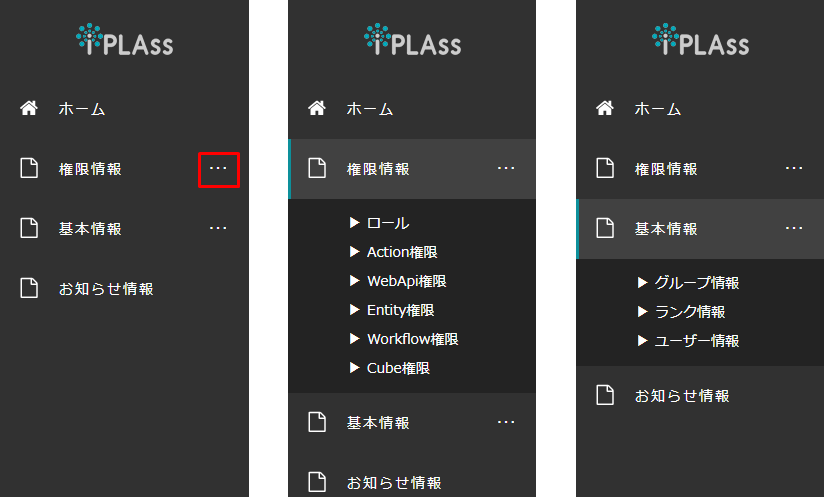
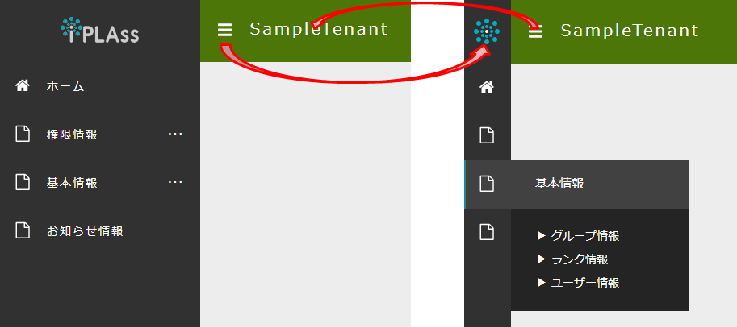

[[operationguide]]
== 操作説明

=== 階層メニュー
階層メニューは複数のメニューを一まとめにしておくメニューです。
テナント作成時には `権限情報` と `基本情報` の階層メニューが作られており、それぞれ関連するメニューがまとめられています。

階層メニューは右側に `・・・` （画像赤枠部分）と表示されており、メニューをクリックすると下の階層が表示されます。
他の階層メニューをクリックすると、クリックした階層メニューが展開され、それ以外は見えなくなります。

=== メニューエリアの縮小
テナントの横にあるアイコンをクリックすると、メニューエリアが縮小します。
縮小状態で更にアイコンをクリックするとメニューエリアは元に戻ります。

縮小状態でメニューエリアのアイコンにマウスカーソルを当てると、そのメニューの内容が表示されます。
階層メニューの場合は下の階層も併せて表示されます。

ウィジェットが設定されている場合、縮小状態だとウィジェットは利用できません。
一度メニューを元に戻す必要があります。

