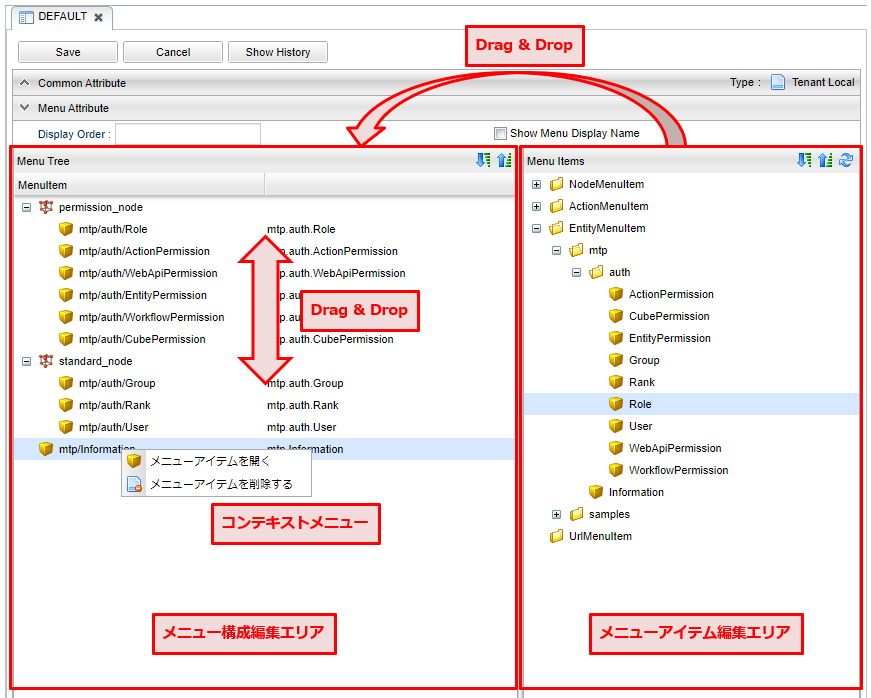
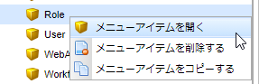

[[menu_management]]
== Menuの管理

[[create_menu]]
=== Menuの作成
メニューアイコンを右クリックし `メニューを作成する` を選択します。
表示されたダイアログの `Name` には対応するロールのコードを設定して下さい。

[[menu_setting]]
=== 設定
==== MenuTreeの編集
メニューでの設定項目です。

[cols="1,1,6a", options="header"]
|===
|設定項目
|利用箇所
|説明

|Display Order
|メニュー切り替え
|メニュー切り替えでの表示順序を指定します。

以下の順番によりソートを行います。
[cols="2,1,1,3a", options="header"]
!===
!設定元!設定項目!昇順/降順!備考
!メニュー定義!Display Order!昇順!
!ロール!優先度!降順!
!ロール/メニュー定義!Name!昇順!
`Show Menu Display Name` がチェックされた場合、メニュー定義の名前でソートします
!===
|Show Menu Display Name
|メニュー切り替え
|メニュー切り替えで表示する名称をメニューの表示名にします。未チェック時はロール名を表示します。
|===

==== MenuItemの編集
メニュー構成編集エリアに対して、メニューアイテムをドラッグ&ドロップして編集を行います。
配置したメニューアイテムをドラッグ&ドロップすることで、順序を変更することができます。
追加したメニューアイテムの編集や削除（メニュー構成からの削除）は右クリックでコンテキストメニューから実行します。
また、各アイテムをダブルクリックした場合は編集画面が表示されます。

メニューアイテムの追加や編集、削除は、メニューアイテムエリアで、対象のメニューアイテムのコンテキストメニューから実行します。
各アイテムをダブルクリックした場合は編集画面が表示されます。

AdminConsole上からエンティティを新規で作成した場合、 `DEFAULT` のメニュー構成の一番下に自動的にEntityMenuItemが追加されます。
構成を変更したい場合は、エンティティを追加後に編集を行ってください。

.MenuItemの編集
メニューアイテムは `NodeMenuItem` 、 `ActionMenuItem` 、 `EntityMenuItem` 、 `UrlMenuItem` の４種類に分類されます。
登録済のMenuItemをダブルクリックするか、右クリックでコンテキストメニューからMenuItemを編集します。

編集した内容は利用されているメニュー構成にも反映されます。 また削除した場合も利用されているメニュー構成に反映され、構成から削除されます。

[[nodemenuitem]]
===== NodeMenuItem
階層を表すメニューアイテムです。
このメニューアイテムの下に他のメニューアイテムを配置できます。
NodeMenuItemを配置した場合、3階層以降はコンテキストメニューのような表示になります。

[cols="1,3a",options="header"]
|===
|項目
|内容

|Name
|識別名です。
`/` により階層化して管理することが可能です。

|DisplayName
|メニューに表示される名称です。

|Description
|説明を記載します。

|Icon URL
|メニューの先頭アイコンを指定します。
以下のルールによりパスを判断します。

`/` で始まる場合:: 静的コンテキストパスからの指定と判断
`http` で始まる場合:: 外部リソースと判断
上記以外（actionなどの指定含む）の場合:: テナントコンテキストパスからの指定と判断

|Icon Tag
|Font Awesomeによるアイコン用のタグを設定できます。

|Image Color
|メニューの色をblue, green, red, yellowの4色から選択できます。
|===

[[actionmenuitem]]
===== ActionMenuItem
別途定義された任意のActionを実行する為のメニューアイテムです。

[cols="1,3a",options="header"]
|===
|項目
|内容

|Name
|識別名です。
`/` により階層化して管理することが可能です。

|DisplayName
|メニューに表示される名称です。

|Description
|説明を記載します。

|Icon URL
|メニューの先頭アイコンを指定します。
以下のルールによりパスを判断します。

`/` で始まる場合:: 静的コンテキストパスからの指定と判断
`http`　で始まる場合:: 外部リソースと判断
上記以外（actionなどの指定含む）の場合:: テナントコンテキストパスからの指定と判断

|Icon Tag
|Font Awesomeによるアイコン用のタグを設定できます。

|Execute Action
|メニューがクリックされた際に実行するAction定義を選択します。

|Parameter
|実行Actionに渡すパラメータを指定します。
（例：defName=OrderItemAggregate）

|Dynamic Customize Setting
|実行時にメニューアイテムの設定をカスタマイズするGroovyScriptを設定します。
以下の項目がバインドされており、設定のカスタマイズは下記項目を変更することで行えます。

menu.actionName:: Execute Actionで選択したAction定義の名前
menu.parameter:: Parameterで設定した値
|===

[[entitymenuitem]]
===== EntityMenuItem
別途定義された任意のエンティティの検索画面を表示する為のメニューアイテムです。
AdminConsole上からエンティティを作成した場合は、自動的に対応するEntityMenuItemが作成されます。

ツールやパッケージ機能でエンティティ定義のみをインポートした場合は自動的には作成されません。
インポートしたエンティティに対してメニューを表示したい場合は、手動でEntityMenuItemを作成してください。

[cols="1,3a",options="header"]
|===
|項目
|内容

|Name
|識別名です。
`/` により階層化して管理することが可能です。

|DisplayName
|メニューに表示される名称です。未指定の場合、エンティティの表示名が利用されます。

|Description
|説明を記載します。

|Icon URL
|メニューの先頭アイコンを指定します。
以下のルールによりパスを判断します。

`/` で始まる場合:: 静的コンテキストパスからの指定と判断
`http` で始まる場合:: 外部リソースと判断
上記以外（actionなどの指定含む）の場合:: テナントコンテキストパスからの指定と判断

|Icon Tag
|Font Awesomeによるアイコン用のタグを設定できます。

|Image Color
|メニューの表示色を指定します。

|Entity
|メニューがクリックされた際に操作対象とするエンティティを選択します。

|View Name
|エンティティに定義されたView指定します。
未指定の場合、Parameterでの設定があればそれを優先し、Parameterにも無い場合はデフォルトのViewを表示します。

|Parameter
|検索画面表示時のリクエストパラメータを指定することが可能です。

viewName=XXX:: デフォルト以外の指定した画面定義を利用
sc_プロパティ名=YYY:: 検索条件にYYYを自動で設定
es=t:: 画面表示時に検索を実行

`View Name` を直接指定した場合は、viewNameパラメータを指定しないでください。

`show with execute search` にチェックした場合は、esパラメータを指定しないでください。

|show with execute search
|画面表示時に検索を実行します。

|Dynamic Customize Setting
|実行時にメニューアイテムの設定をカスタマイズするGroovyScriptを設定します。
以下の項目がバインドされており、設定のカスタマイズは下記項目を変更することで行えます。

menu.actionName:: 検索画面表示用のAction定義の名前
menu.defName:: Entityで選択したEntity定義の名前
menu.viewName:: View Nameで選択した値
menu.parameter:: Parameterで設定した値
menu.executeSearch:: show with execute searchで設定した値
|===

[[urlmenuitem]]
===== UrlMenuItem
任意のURLを表示する為のメニューアイテムです。

[cols="1,3a",options="header"]
|===
|項目
|内容

|Name
|識別名です。
`/` により階層化して管理することが可能です。

|DisplayName
|メニューに表示される名称です。

|Description
|説明を記載します。

|Icon URL
|メニューの先頭アイコンを指定します。
以下のルールによりパスを判断します。

`/` で始まる場合:: 静的コンテキストパスからの指定と判断
`http` で始まる場合:: 外部リソースと判断
上記以外（actionなどの指定含む）の場合:: テナントコンテキストパスからの指定と判断

|Icon Tag
|Font Awesomeによるアイコン用のタグを設定できます。

|Image Color
|メニューの表示色を指定します。

|URL
|表示対象のURLを設定します。
URLのパスはIcon URLと同様のルールで判断されます。

|Parameter
|URLに付与するクエリ文字列を設定します。
（例：name=aaaa&value=bbbb....）

|show new page
|メニュークリック時に新しいページ（ウィンドウまたはタブ）で開きます。

|Dynamic Customize Setting
|実行時にメニューアイテムの設定をカスタマイズするGroovyScriptを設定します。
以下の項目がバインドされており、設定のカスタマイズは下記項目を変更することで行えます。

menu.url:: URLで設定した値
menu.parameter:: Parameterで設定した値
menu.showNewPage:: show new pageで設定した値
|===
