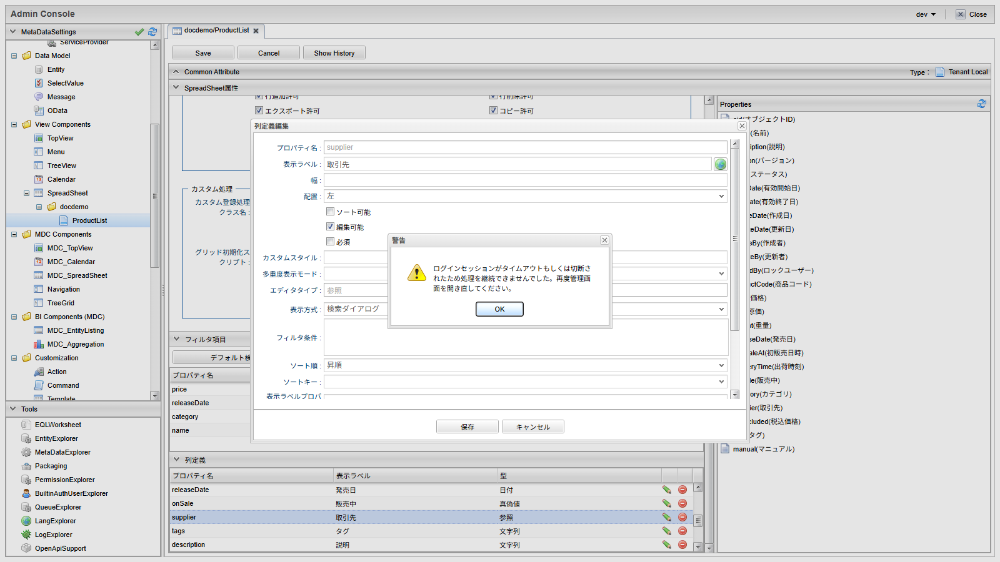

[[spreadsheet_definition]]
== Definition定義の詳細

Spreadsheet定義（ `org.iplass.mtp.view.spreadsheet` パッケージ）の設定項目について説明します。
Admin Consoleの編集画面で設定する項目と対応しています。

[[spreadsheet_basic]]
=== 基本設定

SpreadSheetDefinitionの設定項目は以下となります。

[cols="1,5a", options="header"]
|===
|設定項目|設定値

|定義名
|定義名を指定します。

|表示名
|定義の表示名を指定します。多言語対応が可能です。

|多言語表示名リスト
|多言語の表示名を指定します。

|概要
|定義の概要を指定します。

|対象Entity
|Spreadsheetの対象となるEntityを選択します。

|グリッドオプション
|グリッドの表示・操作に関する設定を指定します。 +
詳細は<<spreadsheet_gridoptions,グリッドオプション>>を参照してください。

|機能フラグ
|グリッド上で許可する操作を指定します。 +
詳細は<<spreadsheet_featureflags,機能フラグ>>を参照してください。

|デフォルト検索条件
|画面表示時にフィルタ条件エリアへ初期設定する検索条件をGroovyスクリプトで指定します。 +
詳細は<<spreadsheet_basic_defaultcond,デフォルト検索条件スクリプト>>を参照してください。

|グリッド初期化スクリプト
|グリッド生成後に実行する初期化JavaScriptをGroovyテンプレートで指定します。 +
詳細は<<spreadsheet_basic_init,グリッド初期化スクリプト>>を参照してください。

|フィルタ項目リスト
|フィルタ条件エリアに表示する項目を指定します。 +
詳細は<<spreadsheet_filteritem,フィルタ項目>>を参照してください。

|列定義リスト
|グリッドに表示する列を指定します。列定義は1つ以上必要です。 +
詳細は<<spreadsheet_columndefinition,列定義>>を参照してください。

|デフォルトソート条件
|画面表示時に適用するソート条件を指定します。
ソート対象のプロパティ名とソート方向（ascまたはdesc）をカンマ区切りで指定します（例： `name asc, age desc`）。
ソート方向を省略した場合は昇順になります。

|カスタム登録処理クラス名
|データ登録時のカスタム処理クラスを指定します。 +
詳細は<<spreadsheet_interrupter,カスタム処理の組み込み>>を参照してください。
|===

[[spreadsheet_basic_defaultcond]]
==== デフォルト検索条件スクリプト

デフォルト検索条件は、画面表示時にフィルタ条件エリアへ初期値を設定するためのGroovyスクリプトです。
リクエストパラメータで指定された条件を引き継いだ上で、スクリプト内で条件を追加・変更できます。

スクリプト内では以下の変数が利用できます。

[cols="1,5a", options="header"]
|===
|変数|説明

|initCondMap
|フィルタ条件を保持する `Map<String, String>` です。
このMapの内容がフィルタ条件エリアの初期表示に使用されます。

|request
|リクエスト情報です。

|session
|セッション情報です。

|user
|ログインユーザー情報です。
|===

initCondMapのキーは、フィルタ項目のプロパティ名をプレフィックスとした以下の形式で指定します。

[cols="1,5a", options="header"]
|===
|キー|説明

|{プロパティ名}ConditionCount
|同一プロパティに対する条件の件数を指定します。

|{プロパティ名}_ope_{index}
|比較演算子を指定します。EQ、NE、LT、GT など。

|{プロパティ名}_{index}
|条件値を指定します。

|{プロパティ名}_to_{index}
|範囲指定（RG）の終了値を指定します。

|{プロパティ名}_in_{index}
|いずれかと等しい（IN）の条件値を指定します。

|{プロパティ名}_dateRange_{index}
|相対範囲（RD/RDT）の範囲種別を指定します。

|{プロパティ名}_relativeRangeName_{index}
|相対範囲でカスタム範囲を使用する場合の範囲名を指定します。
|===

記述例：

[source,groovy]
----
// 検索日（dateプロパティ）の初期条件として、現在日時以降を設定する例
initCondMap.put("startDate_ope_0", "GE")
initCondMap.put("startDate_0", new java.text.SimpleDateFormat("yyyyMMdd").format(new Date()))

// nameプロパティに初期値を設定する例
initCondMap.put("name_ope_0", "IC")
initCondMap.put("name_0", "サンプル")
----

[[spreadsheet_basic_init]]
==== グリッド初期化スクリプト

グリッド初期化スクリプトは、グリッド生成後にクライアント側で実行する初期化JavaScriptを、Groovyテンプレートで記述します。
Groovyテンプレートはサーバサイドで評価され、その出力結果がクライアント側のグリッド初期化スクリプトとして実行されます。

クライアント側では以下の変数が利用できます。

[cols="1,5a", options="header"]
|===
|変数|説明

|grid
|Slick.Gridインスタンスです。
|===

`function(grid, options) { ... }` のような関数宣言は不要です。
関数本体となるJavaScriptコードをそのまま記述してください。
グリッドオプションや機能フラグで設定済みの値を重複して上書きしないように注意してください。

記述例：

[source,groovy]
----
// オプションを初期化する場合
grid.setOptions({ autoEdit: true });

// イベントを追加した場合
return {
    onServerDataSet: function(ctx) {
        if (ctx.grid && ctx.grid.headerMenu) {
            ctx.grid.headerMenu.onAfterMenuShow.subscribe((e, args) => {
                console.log('headerMenu');
            });
        }
    }
};
----

NOTE: SlickGridの詳細は https://ghiscoding.gitbook.io/slickgrid-universal[SlickGrid Universal] のリファレンスを参照してください。

[[spreadsheet_gridoptions]]
=== グリッドオプション

SpreadSheetGridOptionsの設定項目は以下となります。

[cols="1,5a", options="header"]
|===
|設定項目|設定値

|行の高さ
|行の高さをピクセル単位で指定します。

|デフォルト列幅
|列のデフォルト幅を指定します。
列定義で幅が指定されていない列に適用されます。

|検索件数上限
|初期表示およびフィルタ検索時の取得件数上限を指定します。
未指定の場合はSpreadsheetサービスのデフォルト値（20）を使用します。

|列幅自動調整
|列幅をグリッド幅に自動的に合わせます。

|固定列
|固定する列のインデックスを指定します。
-1を指定した場合は固定しません。

|固定行
|固定する行のインデックスを指定します。
-1を指定した場合は固定しません。

|選択モード
|グリッドの選択モードを指定します。

cell:: セル単位で選択します（デフォルト）。

row:: 行単位で選択します。

range:: セル範囲（ドラッグによる矩形選択）で選択します。

checkbox:: 行頭のチェックボックスで行を選択します。

|選択
|単一選択または複数選択を指定します。

single:: 単一選択です（デフォルト）。

multiple:: 複数選択です。CtrlキーやShiftキーを併用して複数選択できます。

|編集許可
|セル値の編集を許可します。

|高さ自動調整
|行数に合わせてグリッドの高さを自動調整します。

|列ヘッダー表示
|グリッドの列ヘッダーを表示します。

|自動編集開始
|セルがアクティブになったとき自動で編集モードを開始します。

|セルナビゲーション有効
|キーボードやアクティブセルの移動を有効にします。

|自動ツールチップ有効
|セル内容が省略表示されたとき自動でツールチップを表示します。

|セル内テキスト選択有効
|セル操作と競合しない範囲でセル内テキストの選択を有効にします。
|===

[[spreadsheet_featureflags]]
=== 機能フラグ

SpreadSheetFeatureFlagsの設定項目は以下となります。

[cols="1,5a", options="header"]
|===
|設定項目|設定値

|行追加許可
|新しい行の追加を許可します。

|行削除許可
|行の削除を許可します。

|エクスポート許可
|データのエクスポートを許可します。

|コピー許可
|データのコピーを許可します。

|貼り付け許可
|データの貼り付けを許可します。

|ソート許可
|列のソートを許可します。

|結合許可
|セルの結合機能を有効にします。

|セル結合静的設定
|結合するセル範囲をJSON形式で定義します。 +
詳細は<<spreadsheet_featureflags_merge,セル結合設定>>を参照してください。

|セル結合式設定
|ルールベースで結合条件をJSON形式で定義します。 +
詳細は<<spreadsheet_featureflags_merge,セル結合設定>>を参照してください。
|===

[[spreadsheet_featureflags_merge]]
==== セル結合設定

結合許可を有効にした場合、セル結合の設定は、 `セルレイアウト` または `Expression（ルールベース）` のいずれかで行います。

[[spreadsheet_merge_celllayout]]
===== セルレイアウト（静的設定）

結合するセル範囲を固定値として定義します。
JSON配列形式で、各結合範囲を以下の要素で指定します。

[cols="1,5a", options="header"]
|===
|要素|説明

|row
|結合開始行のインデックス（0開始）を指定します。

|col
|結合開始列のインデックス（0開始）を指定します。

|rowspan
|行の結合数を指定します。

|colspan
|列の結合数を指定します。

|displayValue
|結合後に表示する値を指定します。
未指定の場合は結合範囲の左上セルの値を表示します。
|===

記述例：

[source,json]
----
[
  { "row": 0, "col": 0, "rowspan": 2, "colspan": 1 },
  { "row": 0, "col": 1, "rowspan": 1, "colspan": 2, "displayValue": "結合値" }
]
----

[[spreadsheet_merge_expression]]
===== Expression（式設定）

ルールベースで結合条件を定義します。
データの値に応じて動的に結合範囲が決定されます。
JSON配列形式で、各ルールを以下の要素で指定します。

[cols="1,5a", options="header"]
|===
|要素|説明

|columns
|対象列のプロパティ名を配列で指定します。

|columnExpression
|横方向（列）の結合条件を指定します。

never:: 適用しません。

always:: 常に適用します。

sameValue:: 隣接する値が同一の場合に適用します。

left>right:: 左の値が右の値より大きい場合に適用します。

left<right:: 左の値が右の値より小さい場合に適用します。

left>=right:: 左の値が右の値以上の場合に適用します。

left<=right:: 左の値が右の値以下の場合に適用します。

|rowExpression
|縦方向（行）の結合条件を指定します。
指定できる値はcolumnExpressionと同じです。

|resultExpression
|結合後に表示する値の算出方法を指定します。

firstCell:: 結合範囲の左上セルの値を表示します。

concat:: 結合範囲の値を連結して表示します。

mapping:: 結合範囲の値を「プロパティ名:値」形式で連結して表示します。
|===

記述例：

[source,json]
----
[
  {
    "columns": ["department", "division"],
    "columnExpression": "sameValue",
    "rowExpression": "sameValue",
    "resultExpression": "firstCell"
  }
]
----

NOTE: 同値判定では、空の値同士は結合されません。

NOTE: 多重度表示モードが複数列展開（MULTI_COL）の列は、セル結合の対象外です。

[[spreadsheet_filteritem]]
=== フィルタ項目

SpreadSheetFilterItemの設定項目は以下となります。

[cols="1,5a", options="header"]
|===
|設定項目|設定値

|プロパティ名
|フィルタ条件の対象となるプロパティ名を指定します。

|表示ラベル
|フィルタ条件エリアに表示するラベルを指定します。多言語対応が可能です。

|多言語設定リスト
|表示ラベルの多言語設定を指定します。

|必須フラグ
|フィルタ条件として必須の場合はtrueを指定します。
必須項目は、条件を入力しないと検索できません。

|プロパティエディタ
|フィルタ条件の入力で使用するエディタを指定します。
GEM既存のPropertyEditorを使用します。

|利用可能な比較演算子
|フィルタ条件で選択可能な比較演算子を限定する場合に指定します。
未指定の場合はすべての比較演算子が利用可能です。
指定できる演算子は、<<spreadsheet_filter_operator,利用可能な比較演算子>>を参照してください。
|===

[[spreadsheet_columndefinition]]
=== 列定義

SpreadSheetColumnDefinitionの設定項目は以下となります。

[cols="1,5a", options="header"]
|===
|設定項目|設定値

|プロパティ名
|列に表示するプロパティ名を指定します。

|表示ラベル
|列ヘッダーに表示するラベルを指定します。多言語対応が可能です。

|多言語設定リスト
|表示ラベルの多言語設定を指定します。

|幅
|列の幅をピクセル単位で指定します。
未指定の場合はグリッドオプションのデフォルト列幅が適用されます。

|配置
|列内のテキストの配置を指定します。

left:: 左寄せで表示します（デフォルト）。

center:: 中央寄せで表示します。

right:: 右寄せで表示します。

|ソート可能
|この列でソートを許可するかどうかを指定します。
ソートするには、機能フラグのソート許可も有効である必要があります。

|編集可能
|この列を編集可能にするかどうかを指定します。
編集するには、グリッドオプションの編集許可も有効である必要があります。

|必須
|この列に値が必須かどうかを指定します。

|多重度
|プロパティの多重度を指定します。
1は単一、2以上は複数、0は無制限です。

|多重度表示モード
|多重度プロパティの表示方法を指定します。 +
詳細は<<spreadsheet_columndefinition_multivalue,多重度表示モード>>を参照してください。

|カスタムスタイル
|セルに適用するカスタムCSSクラス名を指定します。

|エディタ定義
|列の編集で使用するエディタの設定を指定します。 +
詳細は<<spreadsheet_editor,エディタ設定>>を参照してください。
|===

[[spreadsheet_columndefinition_multivalue]]
==== 多重度表示モード

多重度が複数のプロパティをグリッドで表示する場合の表示方法を指定します。

[cols="1,5a", options="header"]
|===
|モード|説明

|COMMA_SEPARATED（カンマ区切り）
|複数値をカンマ区切りで1セルに表示します（デフォルト）。

|MULTI_COL（複数列展開）
|複数値を多重度分の列に展開して表示します。
|===

NOTE: 複数列展開（MULTI_COL）を指定した列は、セル結合の対象外です。

[[spreadsheet_editor]]
==== エディタ設定

列定義のエディタタイプは、対象プロパティの型から自動的に決定されます。
エディタごとの設定項目は以下となります。

[[spreadsheet_editor_string]]
===== SpreadSheetStringEditor

文字列型のプロパティに適用されるエディタです。

[cols="1,5a", options="header"]
|===
|設定項目|設定値

|最大長
|許容される最大文字数を指定します。

|パターン
|検証用の正規表現パターンを指定します。
|===

[[spreadsheet_editor_longtext]]
===== SpreadSheetLongTextEditor

長文型のプロパティに適用されるエディタです。

[cols="1,5a", options="header"]
|===
|設定項目|設定値

|行数
|テキストエリアの行数を指定します。

|列数
|テキストエリアの列数を指定します。

|最大文字数
|入力可能な最大文字数を指定します。
|===

[[spreadsheet_editor_integer]]
===== SpreadSheetIntegerEditor

整数型のプロパティに適用されるエディタです。

[cols="1,5a", options="header"]
|===
|設定項目|設定値

|桁区切り表示
|数値を桁区切りで表示します。

|最小値
|入力可能な最小値を指定します。

|最大値
|入力可能な最大値を指定します。
|===

[[spreadsheet_editor_float]]
===== SpreadSheetFloatEditor

浮動小数点型のプロパティに適用されるエディタです。

[cols="1,5a", options="header"]
|===
|設定項目|設定値

|最小値
|入力可能な最小値を指定します。

|最大値
|入力可能な最大値を指定します。

|小数点以下桁数
|表示時の小数点以下の桁数を指定します。
未設定の場合、実際の値の桁数がそのまま表示されます。

|桁区切り表示
|数値を桁区切りで表示します。
|===

[[spreadsheet_editor_decimal]]
===== SpreadSheetDecimalEditor

小数型のプロパティに適用されるエディタです。

[cols="1,5a", options="header"]
|===
|設定項目|設定値

|最小値
|入力可能な最小値を指定します。

|最大値
|入力可能な最大値を指定します。

|小数点以下桁数
|小数点以下の桁数を指定します。

|桁区切り表示
|数値を桁区切りで表示します。
|===

[[spreadsheet_editor_date]]
===== SpreadSheetDateEditor

日付型のプロパティに適用されるエディタです。

[cols="1,5a", options="header"]
|===
|設定項目|設定値

|表示フォーマット
|日付の表示フォーマットを指定します。

|最小日付
|許容される最小日付を指定します。

|最大日付
|許容される最大日付を指定します。
|===

[[spreadsheet_editor_datetime]]
===== SpreadSheetDateTimeEditor

日時型のプロパティに適用されるエディタです。

[cols="1,5a", options="header"]
|===
|設定項目|設定値

|表示フォーマット
|日時の表示フォーマット（例：yyyy/MM/dd HH:mm:ss）を指定します。

|時間表示範囲
|時間の表示範囲を指定します。

SEC:: 秒まで表示します。

MIN:: 分まで表示します。

HOUR:: 時まで表示します。

HIDDEN:: 時間を表示しません。

|分の間隔
|分の入力間隔を指定します。

_1MIN:: 1分間隔です。

_5MIN:: 5分間隔です。

_10MIN:: 10分間隔です。

_15MIN:: 15分間隔です。

_30MIN:: 30分間隔です。

|最小日時
|選択可能な最小日時を指定します。

|最大日時
|選択可能な最大日時を指定します。
|===

[[spreadsheet_editor_time]]
===== SpreadSheetTimeEditor

時刻型のプロパティに適用されるエディタです。

[cols="1,5a", options="header"]
|===
|設定項目|設定値

|表示フォーマット
|時刻の表示フォーマット（例：HH:mm:ss）を指定します。

|時間表示範囲
|時間の表示範囲を指定します。
指定できる値は日時エディタの時間表示範囲と同じです。

|分の間隔
|分の入力間隔を指定します。
指定できる値は日時エディタの分の間隔と同じです。
|===

[[spreadsheet_editor_boolean]]
===== SpreadSheetBooleanEditor

真偽値型のプロパティに適用されるエディタです。

[cols="1,5a", options="header"]
|===
|設定項目|設定値

|真値ラベル
|真値に表示するラベルを指定します。多言語対応が可能です。

|真値ラベル多言語設定リスト
|真値ラベルの多言語設定を指定します。

|偽値ラベル
|偽値に表示するラベルを指定します。多言語対応が可能です。

|偽値ラベル多言語設定リスト
|偽値ラベルの多言語設定を指定します。
|===

[[spreadsheet_editor_select]]
===== SpreadSheetSelectEditor

選択型のプロパティに適用されるエディタです。

[cols="1,5a", options="header"]
|===
|設定項目|設定値

|選択値
|選択肢となる値と表示名のリストを指定します。

|選択肢のソート
|選択肢をアルファベット順にソートして表示します。
|===

[[spreadsheet_editor_reference]]
===== SpreadSheetReferenceEditor

参照型のプロパティに適用されるエディタです。

[cols="1,5a", options="header"]
|===
|設定項目|設定値

|参照先Entity定義名
|参照先のEntity定義名を指定します。

|表示方式
|参照先の値の選択方式を指定します。

SELECT:: プルダウンで選択します。

LINK:: 検索ダイアログで選択します。

|表示ラベルプロパティ
|表示ラベルに使用するプロパティ名を指定します。
未指定の場合はnameが使用されます。

|フィルタ条件
|候補を絞り込むEQL WHERE句条件を指定します。

|ソートキー
|候補リストのソートに使用するプロパティ名を指定します。

|ソート順
|候補リストのソート順を指定します。

ASC:: 昇順にソートします。

DESC:: 降順にソートします。

|ビュー名
|検索ダイアログで使用するEntityViewのビュー名を指定します。

|選択アクション
|検索ダイアログの代わりに使用する選択アクション名を指定します。

|詳細表示アクション
|詳細表示に使用するアクション名を指定します。

|URLパラメータ
|詳細表示アクション呼び出し時に追加するURLパラメータを指定します。
|===

[[spreadsheet_editor_expression]]
===== SpreadSheetExpressionEditor

式型のプロパティに適用されるエディタです。
式の値はシステムにより自動計算されるため、常に読み取り専用です。

[cols="1,5a", options="header"]
|===
|設定項目|設定値

|結果型
|式の結果型を指定します。
STRING（文字列）、INTEGER（整数）、DECIMAL（小数）、FLOAT（浮動小数点）、DATE（日付）、DATETIME（日時）、BOOLEAN（真偽値）が指定できます。
|===

[[spreadsheet_editor_autonumber]]
===== SpreadSheetAutoNumberEditor

自動採番型のプロパティに適用されるエディタです。
自動採番の値はシステムによって採番されるため、常に読み取り専用です。設定項目はありません。

[[spreadsheet_editor_binary]]
===== SpreadSheetBinaryEditor

バイナリ型のプロパティに適用されるエディタです。

[cols="1,5a", options="header"]
|===
|設定項目|設定値

|アップロード可能
|この列のファイルアップロードを許可します。
|===

[[spreadsheet_interrupter]]
=== カスタム処理の組み込み

Spreadsheetの保存処理（登録・更新・削除）にカスタム処理を組み込むことができます。
カスタム処理クラスは `org.iplass.mtp.view.spreadsheet.SpreadSheetRegistrationInterrupter` インターフェースを実装して作成し、基本設定のカスタム登録処理クラス名にUtility Class名を指定します。

[[spreadsheet_interrupter_methods]]
==== SpreadSheetRegistrationInterrupterのメソッド

実装可能なメソッドは以下となります。
すべてのメソッドはdefaultメソッドのため、必要なメソッドのみオーバーライドしてください。

[cols="1,5a", options="header"]
|===
|メソッド|説明

|dataMapping
|各行のEntity構築後、登録処理の前に呼び出されます。
Entityに対して値の加工や追加設定を行うことができます。

|isSpecifyAllProperties
|更新対象プロパティの決定方法を指定します。
trueの場合、getAdditionalPropertiesの戻り値のプロパティのみを更新対象にします（置き換え）。
false（デフォルト）の場合、自動算出した更新対象プロパティにgetAdditionalPropertiesの戻り値を追加します。

|getAdditionalProperties
|更新対象に追加するプロパティを取得します。
isSpecifyAllPropertiesの設定により対象範囲が変わります。

|beforeRegister
|各行のEntity登録（insert/update/delete）の直前に呼び出されます。
戻り値にValidateErrorが含まれる場合、登録処理は中断されます。

|afterRegister
|各行のEntity登録（insert/update/delete）の直後に呼び出されます。
戻り値にValidateErrorが含まれる場合、トランザクション全体がロールバックされます。
|===

NOTE: 登録処理の種類はRegistrationType（INSERT：新規追加、UPDATE：更新、DELETE：削除）として引数で渡されます。

[[spreadsheet_interrupter_example]]
==== 実装例

カスタム処理の典型的なユースケースを2つの例で示します。

===== 例1：登録時に更新ユーザーを自動的に設定したい

ユースケース：画面から入力させずに、保存処理を実行したユーザーを更新ユーザーとして自動的に設定します。
次の `SampleSpreadSheetInterrupter` は、`dataMapping` のタイミングで実行ユーザーのアカウント情報をEntityにセットします。

[source,java]
----
package your.package;

import java.util.Collections;
import java.util.List;
import java.util.Map;

import org.iplass.mtp.auth.AuthContext;
import org.iplass.mtp.command.RequestContext;
import org.iplass.mtp.entity.Entity;
import org.iplass.mtp.entity.EntityDefinition;
import org.iplass.mtp.entity.ValidateError;
import org.iplass.mtp.view.spreadsheet.SpreadSheetDefinition;
import org.iplass.mtp.view.spreadsheet.SpreadSheetRegistrationInterrupter;
import org.iplass.mtp.view.spreadsheet.SpreadSheetRegistrationInterrupter.RegistrationType;

public class SampleSpreadSheetInterrupter implements SpreadSheetRegistrationInterrupter {

    @Override
    public void dataMapping(Entity entity, RequestContext request,
            EntityDefinition definition, SpreadSheetDefinition spreadSheetDefinition,
            Map<String, Object> row) {
        // 登録用Entityに対する値の加工や追加設定を行います
        entity.setValue("updateUser", AuthContext.getCurrentContext().getUser().getName());
    }

    @Override
    public List<ValidateError> beforeRegister(Entity entity, RequestContext request,
            EntityDefinition definition, SpreadSheetDefinition spreadSheetDefinition,
            RegistrationType registrationType) {
        // 登録前のバリデーションを行います
        // エラーがある場合はValidateErrorを返却し、登録処理を中断します
        return Collections.emptyList();
    }
}
----

===== 例2：特定の条件に該当する行の登録を拒否したい

ユースケース：価格が未入力の行など、特定の条件に該当する行の登録を拒否し、エラーとして差し戻します。
次の `SampleValidationInterrupter` は、`beforeRegister` で価格が未設定の行をチェックします。
戻り値のリストにValidateErrorが含まれる場合、該当行の登録処理は中断されます。

[source,java]
----
package your.package;

import java.util.ArrayList;
import java.util.List;
import java.util.Map;

import org.iplass.mtp.command.RequestContext;
import org.iplass.mtp.entity.Entity;
import org.iplass.mtp.entity.ValidateError;
import org.iplass.mtp.entity.definition.EntityDefinition;
import org.iplass.mtp.view.spreadsheet.SpreadSheetDefinition;
import org.iplass.mtp.view.spreadsheet.SpreadSheetRegistrationInterrupter;
import org.iplass.mtp.view.spreadsheet.SpreadSheetRegistrationInterrupter.RegistrationType;

public class SampleValidationInterrupter implements SpreadSheetRegistrationInterrupter {

    @Override
    public List<ValidateError> beforeRegister(Entity entity, RequestContext request,
            EntityDefinition definition, SpreadSheetDefinition spreadSheetDefinition,
            RegistrationType registrationType) {
        List<ValidateError> errors = new ArrayList<>();
        // 価格が未設定の行は登録を拒否します
        if (entity.getValue("price") == null) {
            ValidateError error = new ValidateError();
            error.setPropertyName("price");
            error.addErrorMessage("価格を入力してください。");
            errors.add(error);
        }
        return errors;
    }

    @Override
    public void dataMapping(Entity entity, RequestContext request,
            EntityDefinition definition, SpreadSheetDefinition spreadSheetDefinition,
            Map<String, Object> row) {
    }
}
----

作成したクラスはUtility Classとして登録して利用します。
