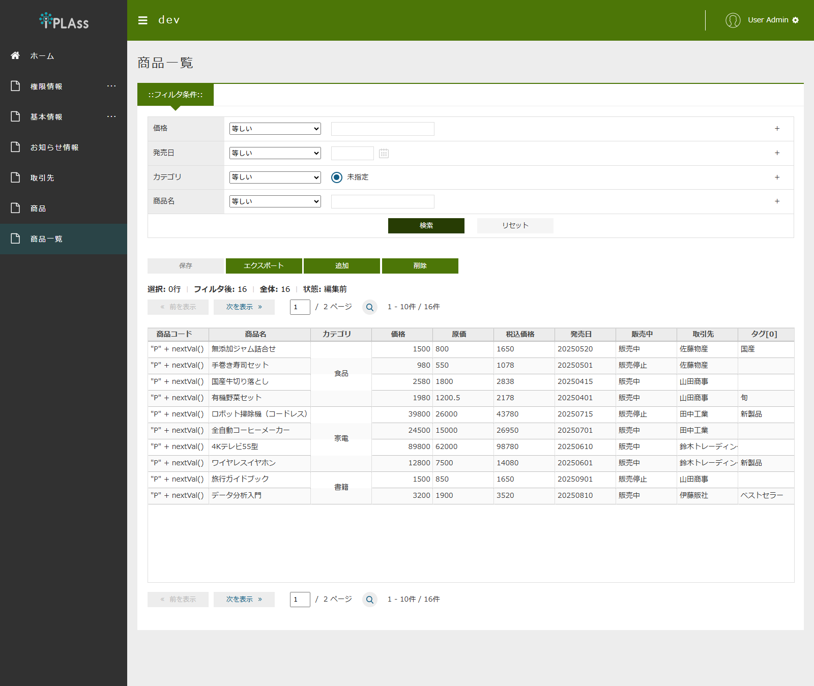
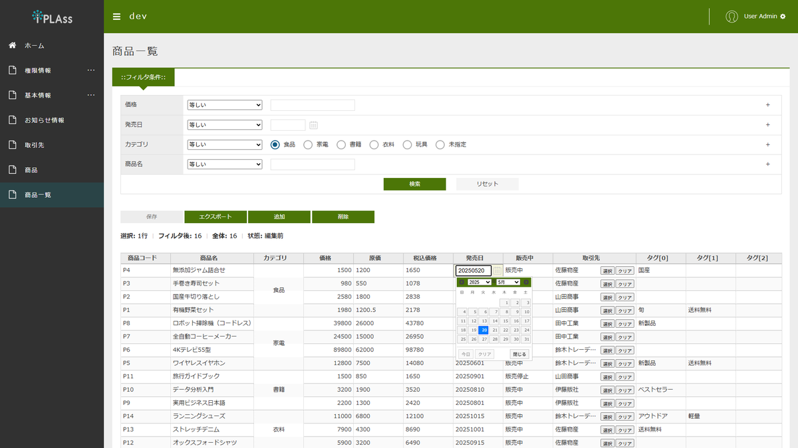
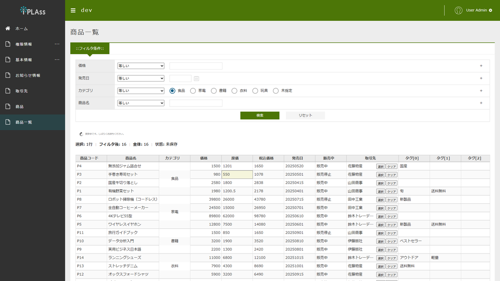
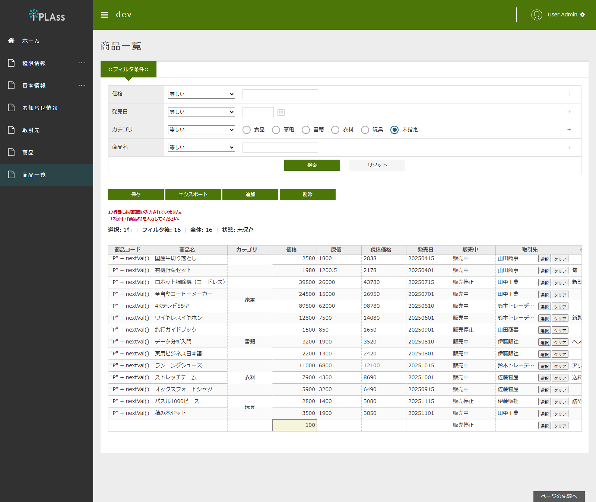
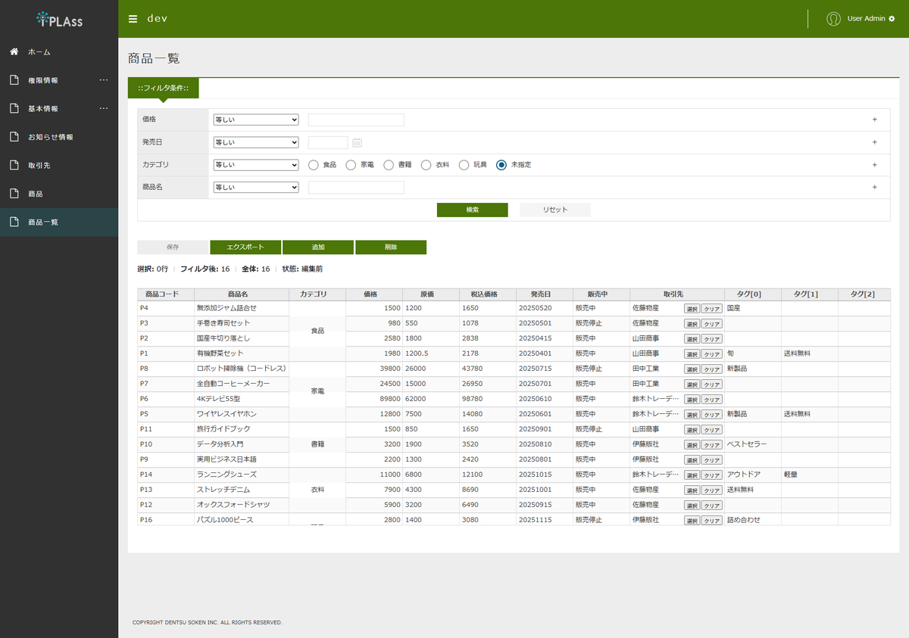
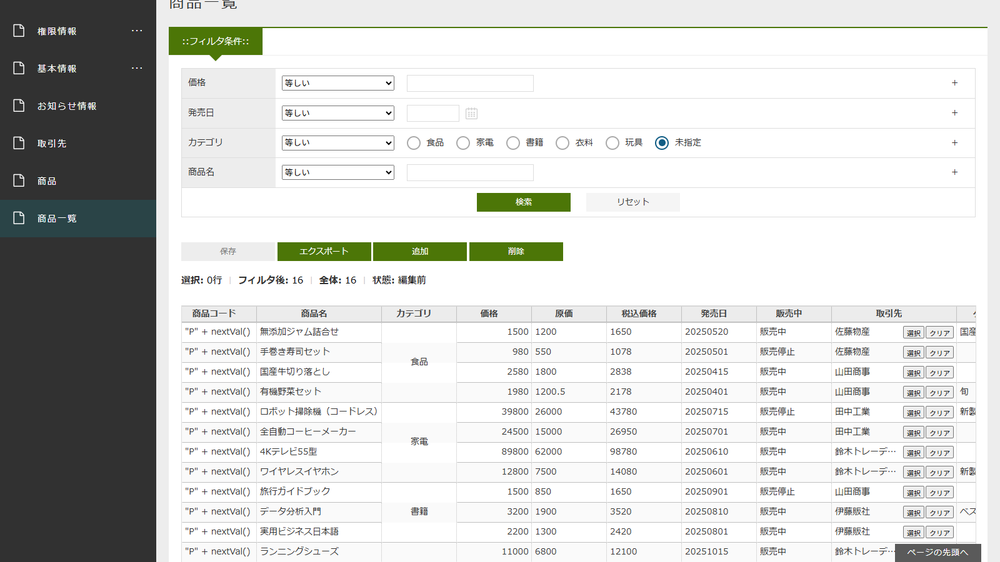

[[operationguide]]
== 操作説明

[[spreadsheet_limitations]]
=== SpreadsheetとExcelの違い・制限事項

==== SpreadsheetとExcelの違い
SpreadsheetはExcelライクな画面を提供しますが、Excelのすべての機能をサポートするものではありません。
主な違いと制限事項は以下のとおりです。

[cols="1,2", options="header"]
|===
|項目|内容

|セル結合・結合解除
|画面操作では行えません。セル結合は、Spreadsheet定義の結合ルール（セルレイアウトまたはExpression）に基づいて表示時に適用されます。

|数式・ユーザー定義関数
|セルへの数式入力やユーザー定義関数の利用はできません。セル編集は値の入力のみです。式・自動採番のプロパティの列は読み取り専用です。

|列幅の手動変更
|列境界のドラッグやダブルクリックによる列幅の変更はできません。列幅は、Spreadsheet定義の列定義の設定（幅、グリッドオプションの列幅自動調整）に従います。

|オートフィルター
|列ヘッダーからの絞り込み（オートフィルター）はできません。データの絞り込みは、フィルタ条件エリア（Spreadsheet定義のフィルタ項目）で行います。

|複数ワークシート
|1つのSpreadsheet定義で扱えるグリッドは1つで、Excelのような複数シート（シートタブ）には対応していません。

|列の並べ替え
|列ヘッダーのドラッグによる列の並べ替えは表示上のみ有効です。Spreadsheet定義は変更されず、再表示すると元の列順に戻ります。
|===

行の追加・削除、コピー&ペースト、Undo/Redoなどの操作は、機能フラグの設定に応じて利用できます。
データのソートは、機能フラグのソート許可と列定義のソート可能が有効な列のみ可能です。
詳細は<<spreadsheet_gridoperation,グリッド操作>>を参照してください。

==== 表示上の制限事項:

* TopViewのパーツとしては未対応です。Spreadsheet画面はメニューから表示してください。

[[spreadsheet_structure]]
=== 画面構成

Spreadsheet画面は以下の要素で構成されます。

[cols="1,5a", options="header"]
|===
|構成要素|説明

|ページタイトル
|Spreadsheet定義の表示名が表示されます。

|フィルタ条件エリア
|グリッドに表示するデータを絞り込むための検索条件を入力するエリアです。
Spreadsheet定義のフィルタ項目に設定されたプロパティが表示されます。

|ツールバー
|`追加` 、 `削除` 、 `保存` 、 `エクスポート` ボタンが表示されます。 +
ボタンの表示は、Spreadsheet定義の機能フラグ（行追加許可、行削除許可、エクスポート許可）の設定により切り替わります。
保存処理の実行中は、ローディングアイコンが表示されます。

|バリデーションエラー表示エリア
|保存時に入力エラーが発生した場合に、エラー内容が表示されます。

|ステータスバー
| `選択` （選択中の行・セルの件数）、 `フィルタ後` （フィルタ適用後のデータ件数）、 `全体` （データの全体件数）、 `状態` （グリッドの編集状態）が表示されます。

|ページャー
|グリッドの上下に表示され、ページ単位でのデータ移動が可能です。

|グリッドエリア
|Spreadsheet定義の列定義に従って、エンティティのデータがスプレッドシート形式（グリッド）で表示されます。
|===

[[spreadsheet_filter]]
=== フィルタ

フィルタ条件エリアでは、グリッドに表示するデータを絞り込むための条件を入力します。

[[spreadsheet_filter_input]]
==== フィルタ条件の入力

.検索
各フィルタ項目に比較演算子と条件値を入力し、 `検索` ボタンをクリックすると、条件に一致するデータがグリッドに表示されます。

.条件の追加
フィルタ項目の右端に表示される `+` ボタンをクリックすると、同一プロパティに対する条件を追加できます。
例えば `含む` と `より小さい` のように、異なる比較演算子の条件を組み合わせることができます。

.リセット
`リセット` ボタンをクリックすると、入力済みのフィルタ条件がクリアされます。

NOTE: 必須設定されたフィルタ項目は、条件を入力しないと検索できません。

[[spreadsheet_filter_operator]]
==== 利用可能な比較演算子

フィルタ項目で選択できる比較演算子は以下となります。
Spreadsheet定義のフィルタ項目ごとに、利用可能な比較演算子を限定することができます。

[cols="1,5a", options="header"]
|===
|演算子|説明

|等しい
|入力値と等しいデータを検索します。

|等しくない
|入力値と等しくないデータを検索します。

|前方一致
|入力値で始まるデータを検索します。

|後方一致
|入力値で終わるデータを検索します。

|含む
|入力値を含むデータを検索します。

|含まない
|入力値を含まないデータを検索します。

|いずれかと等しい
|複数入力した値のいずれかと等しいデータを検索します。

|より小さい
|入力値より小さいデータを検索します。

|より大きい
|入力値より大きいデータを検索します。

|以下
|入力値以下のデータを検索します。

|以上
|入力値以上のデータを検索します。

|範囲
|開始値と終了値を入力し、その範囲内のデータを検索します。

|相対範囲
|日付型の場合は日付の相対範囲、日時型の場合は日時の相対範囲でデータを検索します。
現在日時を基準とした相対的な期間（例：前月1日から現在まで）を指定できます。

|値が設定されている
|値が設定されている（NULLでない）データを検索します。

|値が設定されていない
|値が設定されていない（NULLの）データを検索します。
|===

[[spreadsheet_gridoperation]]
=== グリッド操作

[[spreadsheet_celledit]]
==== セル編集

グリッドオプションで編集許可が有効な場合、セルをダブルクリックすると編集モードになります。
入力後、Enterキーで値を確定し、Escapeキーで編集をキャンセルします。
グリッドオプションの自動編集開始が有効な場合は、セルを移動するだけで自動的に編集モードが開始されます。

セルの編集では、プロパティの型に応じたエディタが使用されます。

[cols="1,5a", options="header"]
|===
|プロパティの型|エディタ

|文字列
|テキスト入力欄で編集します。

|長文
|複数行のテキスト入力欄で編集します。

|整数・浮動小数点・小数
|数値入力欄で編集します。最小値・最大値などの入力制約が設定されている場合があります。

|日付・日時・時刻
|カレンダー（日付選択）や時刻選択の入力支援が表示されます。

|真偽値
|真値・偽値のラベルを選択して編集します。

|選択
|ドロップダウンリストから選択して編集します。

|参照
|参照先エンティティの値を、プルダウンまたは検索ダイアログから選択して編集します。

|バイナリ
|ファイルをアップロードして編集します（アップロード可能が有効な場合）。

|自動採番・式
|システムにより値が自動生成されるため、常に読み取り専用です。
|===

NOTE: 列定義で編集可能を無効にした列、および自動採番・式の列は編集できません。

[[spreadsheet_rowoperation]]
==== 行の追加・削除

行の追加と削除は、以下の方法で行います。

[cols="1,5a", options="header"]
|===
|操作|説明

|ツールバーの `追加` ボタン
|グリッドの末尾に新しい行を追加します。

|ツールバーの `削除` ボタン
|選択中の行を削除します。

|右クリックメニュー
|グリッド上で右クリックするとコンテキストメニューが表示され、 `追加` ・ `削除` を実行できます。

|キーボードショートカット
|行追加は Ctrl + Shift + + （ Cmd + Shift + + ）、行削除は Ctrl + - （ Cmd + - ）で実行できます。
|===

NOTE: 追加・削除の操作は、保存するまで画面上でのみ反映されます。実際のデータベースへの反映は、 `保存` ボタンクリック時の一括保存で行われます。

[[spreadsheet_copypaste]]
==== コピー&ペースト

機能フラグのコピー許可・貼り付け許可が有効な場合、セル範囲のコピー&ペーストが可能です。

* コピー： 範囲を選択して Ctrl + C （ Cmd + C ）
* 貼り付け： 貼り付け先のセルを選択して Ctrl + V （ Cmd + V ）

貼り付けでは、クリップボードの内容が選択セルを起点として展開されます。
Excelなど外部アプリケーションからコピーした値を貼り付けることもできます。

[[spreadsheet_undoredo]]
==== Undo/Redo

セル編集・貼り付け・行追加・行削除は、共通のUndoスタックで管理されており、以下のショートカットで元に戻す・やり直しが可能です。

* 元に戻す（Undo）: Ctrl + Z （ Cmd + Z ）
* やり直し（Redo）: Ctrl + Y （ Cmd + Y ）、または Ctrl + Shift + Z （ Cmd + Shift + Z ）

NOTE: 保存済みの操作は元に戻せません。Undo/Redoの対象は、保存されていない画面上の編集操作です。

[[spreadsheet_sort]]
==== ソート

機能フラグのソート許可と列定義のソート可能が有効な列では、列ヘッダーをクリックすることでソートできます。
クリックするたびに昇順・降順が切り替わります。

[[spreadsheet_selectionmode]]
==== 選択モード

グリッドオプションの選択モードの設定により、グリッド上の選択方法が変わります。

[cols="1,5a", options="header"]
|===
|選択モード|説明

|セル
|セル単位で選択します。

|行
|行単位で選択します。

|範囲
|セル範囲（ドラッグによる矩形選択）で選択します。

|チェックボックス
|行頭のチェックボックスで行を選択します。
|===

複数選択の設定が `複数` の場合、CtrlキーやShiftキーを併用して複数の行・セルを選択できます。
Ctrl + A （ Cmd + A ）で全選択できます。セル編集中の場合は、編集中のセル内のテキスト全選択として動作します（Excelと同じ挙動です）。

[[spreadsheet_save]]
=== データの保存

ツールバーの `保存` ボタンをクリックすると、グリッド上の編集内容が一括して保存されます。
追加した行は登録、更新した行は更新、削除した行は削除として、それぞれの操作が一括して実行されます。

保存処理は単一のトランザクションで実行され、いずれかの行でエラーが発生した場合は全体がロールバックされます。
エラーが発生した場合、データは保存されず、編集内容は画面上に保持されます。

[[spreadsheet_save_validation]]
==== バリデーションエラー表示

保存時に必須チェックやプロパティの型チェックでエラーが検出された場合、バリデーションエラー表示エリアに行番号・プロパティ単位のエラー内容が表示されます。

例：

* 「N行目：[項目名]を入力してください。」（必須エラー）
* 「N行目：プロパティ名[項目名]の値[入力値]の記述形式が不正です。」（型変換エラー）
* 「N行目にバリデーションエラーがあります。」（Entity定義のバリデーションエラー）

[[spreadsheet_save_conflict]]
==== 更新競合時の挙動

保存対象のデータが他のユーザーによって更新されていた場合（バージョン不一致）、更新競合エラーとなり、保存はキャンセルされます。
エラーが発生した行番号が表示されるため、画面を検索し直して最新のデータを取得し、編集し直してください。

[[spreadsheet_mergecells]]
=== セル結合

機能フラグで結合許可が有効な場合、設定したルールに従ってセルが結合されて表示されます。
結合のルールは、以下のいずれかの方法で定義します。

* セルレイアウト（静的設定）: 結合するセル範囲を行・列・行結合数・列結合数で固定値として定義します。
* Expression（式設定）: ルールベースで結合条件（同値比較など）を定義します。

設定方法の詳細は<<spreadsheet_featureflags_merge,セル結合設定>>を参照してください。

[[spreadsheet_export]]
=== ファイル出力

機能フラグのエクスポート許可が有効な場合、ツールバーの `エクスポート` ボタンでグリッドのデータをExcel形式（xlsx）で出力できます。
出力されるファイルには、検索時のフィルタ条件・ソート条件が適用された状態のデータが含まれます。

