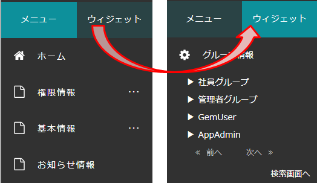
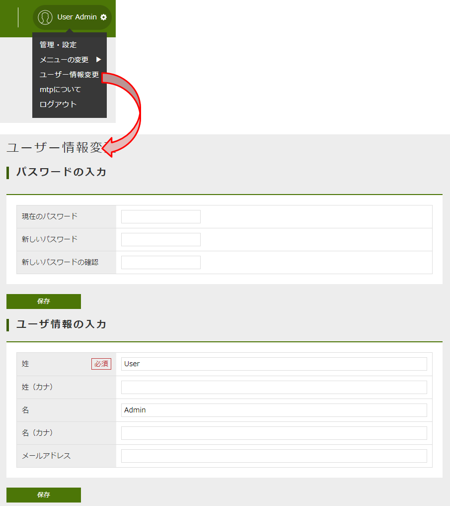
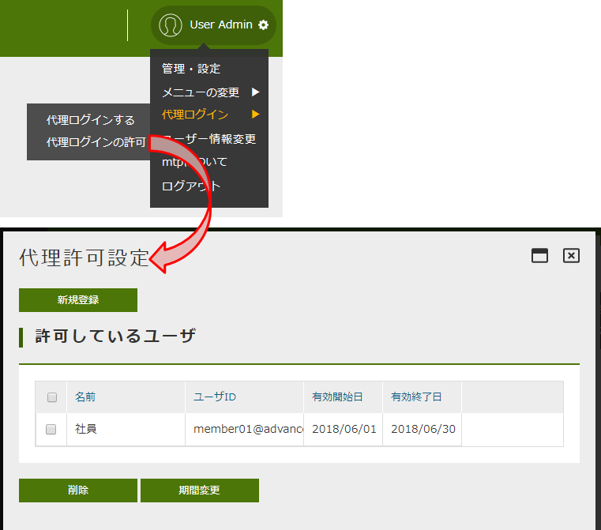
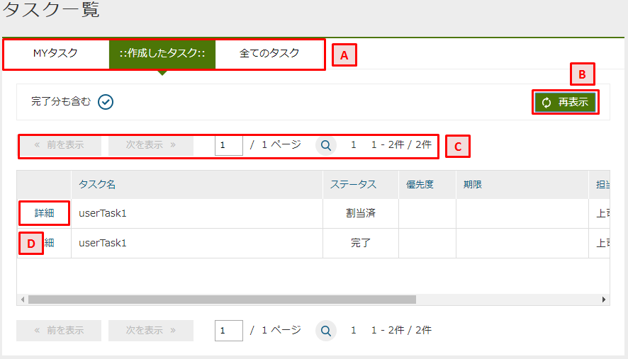
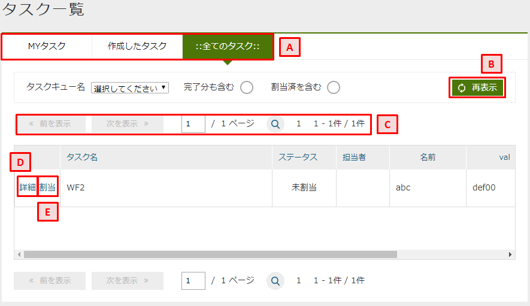
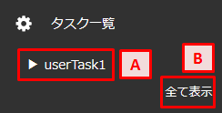

[[operationguide]]
== 操作説明

[[structure]]
=== 画面構成
GEMモジュールで提供する標準的な画面は以下で構成されています。

.A.ヘッダエリア
テナントロゴ、テナント名、ユーザー名、全文検索（設定時）で構成されています。
テナント名の左のアイコンをクリックすることで、メニューを縮小・展開できます。
ユーザー名をクリックすると、ユーザーメニューが表示されます。

.B.メニューエリア
Top画面やエンティティの検索一覧等を表示するためのメニュー郡です。
ウィジェットが配置されている場合、メニューとウィジェットを切り替えることでウィジェットが表示されます。

.C.コンテンツエリア
Top画面の部品や、メニューをクリックした際に表示される内容を表示するためのエリアです。

[[topview_usermenu]]
=== ユーザーメニュー
ユーザー名をクリックすることで表示されるメニューです。
ユーザーメニューは標準で用意されているものと、設定により表示されるものがあります。

==== 管理・設定
開発者向けの管理コンソール（AdminConsole）を起動します。
管理者のみが利用できます。

==== プレビュー日付
テナント設定の `日付プレビュー表示機能` が有効になっている場合、特定の日時を現在日時にすることができます。
特定の日時における表示の確認などに利用します。

==== 言語の変更
テナント設定の `多言語機能` を利用する設定が有効になっている場合、他の言語に切り替えることができます。
言語を選択した際は一度他の画面を表示したりすることで、言語の切り替えが行われます。

==== メニューの変更
ユーザーが複数のロールを持っており、それぞれのロールに対してTop画面とメニューの設定を行っている場合に表示されます。
ロールを選択することでそれぞれのロール用に設定されたTop画面とメニューを表示できます。

==== ユーザー情報変更
ユーザーが自身の情報を更新する画面を表示します。
初期設定ではパスワードのみ変更ができます。
Top画面の設定により、ユーザー情報の項目を変更できるようになります。

==== アプリの管理
ユーザーに設定されているOAuthのクライアント情報の閲覧とメンテナンス(削除)、有効なRememberMe設定の閲覧とメンテナンス(無効化)、個人アクセストークンのメンテナンス(生成/削除)が可能なアプリケーション管理画面を表示します。

==== [.eeonly]#代理ログイン#
代理ログイン機能(代理ログイン/解除、代理ログイン許可ユーザーの選択)へのリンクを表示します。

===== 代理ログインする
他のユーザーに成り代わってログインします。
権限などは代理ログインしたユーザーのものになります。
認証ポリシーの設定により、代理ログインが利用できる場合に表示されます。

代理ログインしている場合は、「代理ログインを解除」メニューが表示されます。

===== 代理ログインの許可
他のユーザーに自身に成り代わって操作することを許可します。
代理ログインを許可するユーザーと期間を指定します。

==== [.eeonly]#2段階認証#
2段階認証の情報を表示します。Top画面のTwoStep Verificationが設定されているか、ログインしているユーザーの認証ポリシーに1つ以上の2段階認証ポリシーが設定されている場合に「2段階認証」メニューが表示されます。 +
詳細は<<../../authentication/index.adoc#ref_two_step, 2段階認証>>を参照してください。 +

初期設定では、ログインしているユーザーに紐づく2段階認証の情報のみが表示されます。 +
Top画面の設定がされている場合は、TOP画面の設定で設定されている2段階認証の情報が表示されます。
また2段階認証設定の有効化/無効化（2段階認証ポリシーの切り替え）が利用できるようになります。 +
詳細は<<twostepverification, TwoStep Verification>>を参照してください。

2段階認証設定の有効化/無効化（2段階認証ポリシーの切り替え）について、ログインしているユーザーの認証ポリシーがTOP画面の設定で2段階認証ありの認証ポリシーとして設定されている場合は有効、それ以外の場合は無効と表示されます。 +
また有効/無効を押下すると、それぞれTOP画面の設定で設定されている2段階認証あり/2段階認証なしの認証ポリシーに切り替えることができます。

===== [.eeonly]#2段階認証（時間ベース）#
2段階認証（時間ベース）のポリシーが設定されている場合、2段階認証（時間ベース）を設定することができます。

設定ボタンを押下すると、2段階認証（時間ベース）設定画面が表示されます。

また2段階認証（時間ベース）が設定されている場合は、解除ボタンが表示されます。

==== iPLAssについて
アプリケーションのライセンス条項を表示します。
iPLAssが利用するライブラリに関するライセンスも併せて表示します。

==== ログアウト
現在ログイン中のユーザーをログアウトします。
ログアウト後はログイン画面が表示されます。

[[topview_fulltextsearch]]
=== 全文検索
全文検索機能が利用可能な場合、ユーザーメニューの隣に全文検索用のアイコンが表示されます。
アイコンをクリックすると検索用フィールドが表示されます。
左側の `検索` をクリックすると、全文検索の対象となるエンティティが表示されます。
未選択の場合は表示されている全てのエンティティが対象となります。
赤枠の検索条件フィールドに検索条件を入力し、検索ボタンを押すと、全文検索結果が表示されます。

[[topview_parts]]
=== 画面部品
コンテンツ部分に表示するパーツと、メニュー部分に表示するウィジェットがあります。

==== お知らせ一覧
アプリ管理者やシステム管理者が登録したお知らせを一覧で表示する画面部品です。
一覧のタイトルをクリックすると詳細が表示されます。

==== 最終ログイン日時
最後にログインした日時を表示する画面部品です。

==== 検索結果一覧
選択したエンティティの検索結果を表示する画面部品です。

.パーツ
エンティティの検索画面のように、検索結果を表示します。
検索一覧のように検索条件を指定して検索することはできません。

* A.詳細、編集 +
エンティティの詳細画面を表示します。
* B.前を表示、次を表示 +
検索結果が表示可能な件数を超える場合に、前後のデータを検索して表示します。
* C.検索画面を表示する +
エンティティの検索画面を表示します。
検索条件を指定したい場合は検索画面を利用してください。

.ウィジェット
エンティティの名前のみを表示します。

* A.前を表示、次を表示 +
検索結果が表示可能な件数を超える場合に、前後のデータを検索して表示します。
* B.検索画面を表示する +
エンティティの検索画面を表示します。
検索条件を指定したい場合は検索画面を利用してください。

==== カレンダー
対象となる期間に存在するエンティティのデータを表示する画面部品です。

.パーツ
設定により日単位、週単位、月単位のいずれかで表示されます。

日単位の場合、1日24時間の予定が表示されます。

週単位の場合、1週間の予定が午前、午後に分かれて表示されます。

月単位の場合、1ヶ月分の予定が表示されます。

* A.< > +
表示範囲の前後のカレンダーを表示します。
* B.今日、今週、今月 +
現在の日付が含まれる期間のカレンダーを表示します。
表示しているカレンダーに現在の日付が含まれている場合は操作できません。
* C.＋ +
エンティティを追加する画面を表示します。
日付毎にアイコンが用意されており、クリックした日付のデータを追加します。
* D.データ +
エンティティの詳細画面を表示します。
* E.カレンダーを見る +
コンテンツエリアにカレンダーを表示します。

.ウィジェット
月単位のカレンダーを表示します。

image:images/widget_calendar.png[]

* A.< +
前月のカレンダーを表示します。
* B.> +
翌月のカレンダーを表示します
* C.カレンダーを見る +
コンテンツエリアにカレンダーを表示します。
設定により月単位以外で表示されることもあります。
* D.日付 +
カレンダーに表示するデータがある日付には下線が表示されています。
日付をクリックするとコンテンツエリアに日単位のカレンダーが表示されます。

[[parts_treeview]]
==== ツリービュー
エンティティと参照プロパティのデータを階層構造で表示する画面部品です。

.パーツ
エンティティの名前とプロパティを表示します。
表示するプロパティは設定によります。

* A.エンティティ +
左側に三角のアイコンが表示されている場合、クリックすると参照プロパティが次の行に表示されます。
（参照プロパティが未設定の場合は何も表示されません）
名前をクリックすると、エンティティの詳細画面を表示します。
* B.参照プロパティ +
エンティティと同様に、三角のアイコンが表示されている場合は、クリックすることで参照プロパティが参照するデータを表示できます。
こちらも名前をクリックすることで、エンティティの詳細画面を表示します。

.ウィジェット
エンティティの名前のみを表示します。

* A.エンティティ +
左側に三角のアイコンが表示されている場合、クリックすると参照プロパティが次の行に表示されます。
（参照プロパティが未設定の場合は何も表示されません）
名前をクリックすると、エンティティの詳細画面を表示します。
* B.参照プロパティ +
エンティティと同様に、三角のアイコンが表示されている場合は、クリックすることで参照プロパティが参照するデータを表示できます。
こちらも名前をクリックすることで、エンティティの詳細画面を表示します。

==== [.eeonly]#保存リスト#
集計データや汎用検索の条件、結果などを保存、復元する画面部品です。
自身が保存したデータのほか、他のユーザーから共有されたデータも参照できます。

.パーツ
保存リストと所有するリストを切り替えて表示します。

保存リストは自身が保存したデータと、他者が保存し、共有したデータが表示されます。
フォルダを作成し、データを格納できます。

* A.保存リスト/所有するリスト +
クリックすることで保存リストと所有するリストの表示を切り替えます。
* B.フォルダの作成 +
ルートの位置にデータを格納するためのフォルダを作成します。
* C.フォルダ +
データが格納されている場合、三角のアイコンをクリックするとフォルダ配下のデータを表示します。
* D.保存データ +
クリックすると集計のローデータや汎用検索の保存情報を表示します。
また、保存情報からは保存時の状態を復元して表示できます。
* E.コンテキストメニュー +
データを右クリックすると表示されるメニューです。
** 名前変更 +
フォルダ、データの名前を変更します。
** 移動 +
フォルダ、データを他のフォルダの下に移動します。
** 削除 +
フォルダ、データを削除します。
フォルダを削除すると、配下のデータも併せて削除されます。
** フォルダの作成 +
データを格納するためのフォルダを作成します。
フォルダ上で右クリックした場合、そのフォルダの配下に作成されます。

所有するリストは自身が保存したデータのみ表示されます。
他者への共有や編集許可も所有するリスト上から行います。

* A.保存リスト/所有するリスト +
クリックすることで保存リストと所有するリストの表示を切り替えます。
* B.保存データ +
クリックすると集計のローデータや汎用検索の保存情報を表示します。
また、保存情報からは保存時の状態を復元して表示できます。
* C.共有 +
チェックすると自身の持つデータが他者に公開されます。
* D.他者編集 +
クリックすると自身のデータを他者が編集できるようになります。
* E.コンテキストメニュー +
データを右クリックすると表示されるメニューです。
** 名前変更 +
データの名前を変更します。
** 移動 +
データを他のフォルダの下に移動します。
** 削除 +
データを削除します。

.ウィジェット
エンティティの名前のみを表示します。

* A.保存リスト +
三角のアイコンをクリックすることで保存リストのデータを表示します。
フォルダが存在する場合、三角のアイコンをクリックすることでフォルダ内のデータを表示できます。
* B.所有リスト +
クリックすることで自身が所有する保存リストのデータを表示します。
* C.保存データ +
クリックすると集計のローデータや汎用検索の保存情報を表示します。
また、保存情報からは保存時の状態を復元して表示できます。

==== [.eeonly]#集計#
グラフや集計表、ダッシュボードなどを表示する画面部品です。
画面部品では定型集計や簡易BIの画面のような各種操作はできません。

* A.集計画面を表示する +
定型集計、簡易BI、ダッシュボードなどの集計画面を表示します。
集計画面ではフィルタの設定やCSVダウンロードなどの操作ができます。

[[parts_tasklist]]
==== [.eeonly]#タスク一覧#
ワークフローのタスク一覧を表示する画面部品です。

.パーツ
MYタスク、作成したタスク、全てのタスクを切り替えて表示します。

MYタスクは自身に割り当てられたタスクを表示します。
初期表示では未完了のタスクのみ表示します。

* A.MYタスク/作成したタスク/全てのタスク +
クリックすることでMYタスク、作成したタスク、全てのタスクの表示を切り替えます。
* B.再表示 +
タスクを検索して再表示します。
`完了分も含む` を指定することで、完了したタスクも表示できます。
* C.ページング +
タスクが10件以上有る場合に使用します。
`前を表示` 、 `次を表示` は現在表示しているタスクの前後のデータを表示します。
虫眼鏡のアイコンは、クリックするとテキストボックスに入力したページを表示します。
* D.詳細、編集 +
タスクの詳細画面を表示します。
承認や差し戻しといったタスクの処理を行う場合は編集リンク（鉛筆アイコン）をクリックして編集画面から行います。

作成したタスクは自身がトリガーとなったタスクを表示します。
初期表示では未完了のタスクのみ表示します。

* A.MYタスク/作成したタスク/全てのタスク +
クリックすることでMYタスク、作成したタスク、全てのタスクの表示を切り替えます。
* B.再表示 +
タスクを検索して再表示します。
`完了分も含む` を指定することで、完了したタスクも表示できます。
* C.ページング +
タスクが10件以上有る場合に使用します。
`前を表示` 、 `次を表示` は現在表示しているタスクの前後のデータを表示します。
虫眼鏡のアイコンは、クリックするとテキストボックスに入力したページを表示します。
* D.詳細、編集 +
タスクの詳細画面を表示します。
承認や差し戻しといったタスクの処理を行う場合は編集リンク（鉛筆アイコン）をクリックして編集画面から行います。

全てのタスクは作成された全てのタスクを表示します。
初期表示では未割当のタスクのみ表示します。

* A.MYタスク/作成したタスク/全てのタスク +
クリックすることでMYタスク、作成したタスク、全てのタスクの表示を切り替えます。
* B.再表示 +
タスクを検索して再表示します。
`タスクキュー名` を指定することで、指定のタスクキューに紐づくタスクのみを表示できます。
`完了分も含む` を指定することで、完了したタスクも表示できます。
`割当済を含む` を指定することで、既に誰かに割り当てられたタスクも表示できます。
* C.ページング +
タスクが10件以上有る場合に使用します。
`前を表示` 、 `次を表示` は現在表示しているタスクの前後のデータを表示します。
虫眼鏡のアイコンは、クリックするとテキストボックスに入力したページを表示します。
* D.詳細 +
タスクの詳細画面を表示します。
* E.割当 +
未割当のタスクを自身に割り当てます。
割り当てられたタスクはMYタスクに表示されます。

.ウィジェット
未完了のMYタスクを表示します。

* A.MYタスク +
クリックするとタスクの詳細画面を表示します。
* B.全て表示 +
コンテンツエリアにタスク一覧を表示します。
