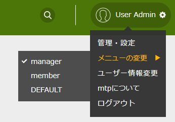

[[role]]
== ロールとの連動

RoleエンティティのロールコードとTopView、Menuの定義名が連動しており、ユーザーにマッチするロールを元に対応するTOP画面とメニューを表示しています。
TopView、Menuのどちらかしかない場合は、存在する方だけ表示されます。
どちらもない場合は各定義のDEFAULTの設定が表示されます。

DEFAULTの設定は管理者によるロールの切り替えか、TopView、Menuが存在しないロールの場合にしか使われません。

[cols="1,1,1,3", options="header"]
|===
|ロール
|TopView有無
|Menu有無
|ユーザーメニュー

|A
|有
|有
|AのTopView、Menuを表示

|B
|有
|無
|BのTopViewと参照権限のあるエンティティのMenuを表示

|C
|無
|有
|TopViewは何も表示せず、CのMenuを表示

|D
|無
|無
|DEFAULTのTopViewとMenuを表示
|===

また、複数ロールそれぞれに一致するTopView、Menuが存在した場合は、ユーザーメニューにメニュー切り替えが表示されます。表示するメニューの並び順は、<<../menu/index.adoc#create_menu, Menu>>を参照してください。対象のメニューを選択することで、表示するTopView、Menuを変更できます。

