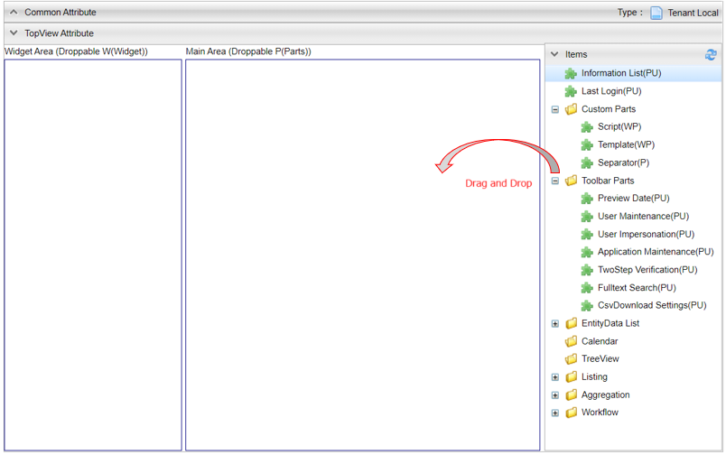

[[topview_management]]
== TopViewの管理

[[create_topview]]
=== TopViewの作成
TopViewアイコンを右クリックし、 `TOP画面を作成する` を選択します。
表示されたダイアログの `Name` には対応するロールのコードを設定して下さい。

[[topview_setting]]
=== 設定
`Main Area` 及び `Widget Area` に対して、右側の `Items` からパーツをドラッグ&ドロップして編集を行います。
また、配置したパーツをドラッグ&ドロップすることで、順序を変更できます。

パーツには以下のものがあります。
また各パーツはドラッグ&ドロップできる箇所や複数配置できるかが決まっています。
パーツの右側にある括弧内の文字はそれぞれ下記を意味しています。

W:: `Widget Area` への配置が可能なItem
P:: `Main Area` への配置が可能なItem
U:: 複数配置が不可能なItem

[cols="1,1,5,1,1,1", options="header"]
|===
2+|パーツ名|備考|Widget Area|Main Area|複数

2+|Information List
|お知らせ情報管理で登録したデータを表示します。|×|○|×

2+|Last Login
|最終ログイン日時を表示します。|×|○|×

.3+|CustomParts
|Script
|GroovyTemplateで記述されたスクリプトを実行します。|○|○|○

|Template
|登録済みのテンプレートを表示します。|○|○|○

|Separator
|パーツを左右に並べて表示するためのパーツです。|×|○|○

.7+|Toolbar Parts
|Preview Date
|プレビュー日付機能へのリンクを表示する場合に設定を行うパーツです。|×|○|×

|User Maintenance
|ユーザー情報変更でユーザー自身に変更させる項目の設定を行うパーツです。|×|○|×

|User Impersonation
|代理ログインの設定を行うパーツです。|×|○|×

|Application Maintenance
|アプリケーション管理機能へのリンクを表示する場合に設定を行うパーツです。|×|○|×

|TwoStep Verification
|2段階認証の設定を行うパーツです。|×|○|×

|Fulltesxt Search
|全文検索の設定を行うパーツです。|×|○|×

|CsvDownload Settings
|CSVダウンロードの設定を行うパーツです。|×|○|×

|EntityData List
|SearchResult List|Entityに定義されたViewを表示します。
Filterによる絞り込みが可能です。|○|○|○

2+|Calendar
|Calendarで登録したカレンダーを表示します。|○|○|×

2+|TreeView
|TreeViewで登録したツリービューを表示します。|○|○|×

|Listing
|SavedList|集計や汎用検索で保存したデータを表示します。|○|○|×

.2+|Aggregation
|Single Type
|Aggregationで登録した集計を表示します。|×|○|×

|Dashboard
|Dashboardで登録したダッシュボードを表示します。|×|○|×

|Workflow
|UserTask List|Workflowで設定されたユーザーのタスクを表示します。|○|○|○
|===

各パーツのアイコンをクリックすることで、詳細な設定をすることができます。
ここからは各パーツ毎の詳細設定について説明をしていきます。

[[informationlist]]
==== Information List
TOP画面でお知らせ一覧を表示するための設定を行います。

[cols="1,2a", options="header"]
|===
|設定項目|設定内容

|Title
|タイトルをカスタマイズしたい場合に指定します。
未設定の場合は `お知らせ情報` と表示されます。

|Icon Tag
|Fontawsomeによるアイコンタグを設定します。

|Max Height
|コンテンツ部分の最大高さを指定します。
指定した高さを超える場合はスクロールバーが表示されます。未指定の場合は高さ制限はありません。

|Class
|スタイルシートのクラス名を指定します。複数指定する場合は半角スペースで区切って下さい。

|Time Range
|一覧上の時間部分の表示範囲を指定します。

default:: 日付のみ表示します。
SEC:: 秒まで表示します
MIN:: 分まで表示します。
HOUR:: 時まで表示します。
NONE:: 日付のみ表示します。

|Scroll display number
|スクロール表示になる件数を指定します。
未指定の場合はスクロール表示になりません。

|Enable Data Localization
|本項目がチェックされている場合、ユーザの言語選択に応じたお知らせ情報データが検索されます。
この項目は、お知らせ情報エンティティが多言語対応されている場合のみ有効となります。

|Enable Html Tag
|本項目がチェックされている場合、お知らせ情報の詳細表示時にHTMLタグが有効になります。

|Use RichText Editor
|詳細画面のメッセージ表示時にリッチテキストエディタを利用するかを指定します。
メッセージ登録時にリッチテキストエディタを利用している場合に、表示を揃える目的で利用します。

|RichText Library
|リッチテキストエディタを利用する場合に、リッチテキストエディタとして利用するライブラリを指定します。
未指定の場合は、 <<../../../serviceconfig/index.adoc#GemConfigService, GemConfigService>>
の `richTextLibrary` で設定されているライブラリを利用します。

|RichText Editor Option
|リッチテキストエディタを利用する場合に、エディタを生成する際のオプションをJavascriptのオブジェクトリテラルで指定します。
指定可能なオプションについては、利用するリッチテキストライブラリの説明を参照してください。

|Allow RichText Editor Link Action (CKEditor)
|リッチテキストエディタとして `CKEDITOR` を利用する場合に、標準はで許可されていないリンク動作を利用できるようにします。

|Detail Custom Style
|詳細画面のメッセージ表示部分に対して、直接style属性を指定することが可能です。 値によって強調させたい場合などに利用します。

|show warning message of the password expiration date
|本項目がチェックされている場合、パスワード有効期間に対する警告メッセージを表示します。

|Remain days threshold
|有効期限の何日前から表示するかを設定します。

|Custom message
|警告メッセージをカスタマイズしたい場合に指定します。

|Custom message area style class
|警告メッセージ表示領域のスタイルをカスタマイズしたい場合に指定します。
jquery-uiのスタイルを利用しています。
リストから選択するか直接指定（リストにない値も可）してください。

|Custom message mark style class
|警告メッセージ表示領域のアイコンをカスタマイズしたい場合に指定します。
jquery-uiのアイコンを利用しています。
リストから選択するか直接指定（リストにない値も可）してください。
|===

[[lastlogin]]
==== Last Login
TOP画面に最終ログイン日時を表示します。

[cols="1,2a", options="header"]
|===
|設定項目|設定内容

|Class
|スタイルシートのクラス名を指定します。複数指定する場合は半角スペースで区切って下さい。
|===

[[script]]
==== Script
TOP画面でGroovyTemplateで記述されたスクリプトを実行します。
HTMLやJavascriptの記述ができます。

[cols="1,2a", options="header"]
|===
|設定項目|設定内容

|Max Height
|コンテンツ部分の最大高さを指定します。
指定した高さを超える場合はスクロールバーが表示されます。未指定の場合は高さ制限はありません。

|スクリプト
|スクリプト編集画面を表示してGroovyTemplateの文法に従って記述します。
詳細は<<../../customizing/index.adoc#groovytemplate, GroovyTemplate>>を参照してください。
|===

[[template]]
==== Template
TOP画面に登録済みのテンプレートを表示します。

[cols="1,2a", options="header"]
|===
|設定項目|設定内容

|テンプレート
|テンプレートを選択します。

|Max Height
|コンテンツ部分の最大高さを指定します。
指定した高さを超える場合はスクロールバーが表示されます。未指定の場合は高さ制限はありません。
|===

[[separator]]
==== Separator
パーツを左右に並べて表示するためのパーツです。
Separatorに他のパーツをドラッグ&ドロップで配置することができます。

[cols="1,2a", options="header"]
|===
|設定項目|設定内容

|Class
|スタイルシートのクラス名を指定します。複数指定する場合は半角スペースで区切って下さい。

|Max Height
|コンテンツ部分の最大高さを指定します。
指定した高さを超える場合はスクロールバーが表示されます。未指定の場合は高さ制限はありません。
|===

[[previewdate]]
==== Preview Date
画面右上のユーザーメニューでプレビュー日付機能へのリンクを表示する場合に設定を行います。 +
テナント設定の `日付プレビュー表示機能` が有効になってる場合、特定の日時を現在日時にすることができます。
このパーツが設定されていない場合は、テナントの設定によりリンクが表示されます。

[cols="1,3", options="header"]
|===
|設定項目|設定内容
|Title
|メニューの表示名をカスタマイズしたい場合に設定します。
|Use Preview Date
|プレビュー日付の管理機能を有効化するかを指定します。
|===

[[usermaintenance]]
==== User Maintenance
画面右上のユーザーメニューでユーザー情報変更を選択した際に、ユーザー自身の情報を編集するための設定を行います。
ユーザーが編集可能な項目は設定したViewの内容に依存します。
パーツ未指定時はパスワードの変更のみ可能です。

[cols="1,3", options="header"]
|===
|設定項目|設定内容
|View
|ユーザー情報のDetailLayoutのViewを選択します。
|===

標準で提供しているユーザー情報のDetailLayoutは以下の通りです。

[cols="1,3", opitons="header"]
|===
|View名|用途
|default
|一般ユーザーの登録用（管理者設定なし）

|admin
|管理者を含むユーザーの登録用（システム管理者向け）

|maintenance
|ユーザー自身のメンテナンス用（TopView用）
|===

予めユーザーメンテナンス用の画面定義としてmaintenanceが用意されています。
maintenanceを利用、またはカスタマイズして項目を変更することも出来ます。
新規に画面定義を追加して、それを利用することも出来ます。

[[userimpersonation]]
==== User Impersonation
画面右上のユーザーメニューで代理ログイン機能(代理ログイン許可ユーザーの選択)へのリンクを表示する場合に設定を行います。

[cols="1,3", options="header"]
|===
|設定項目|設定内容
| Can Impersonation To | 代理ログイン許可ユーザーの設定可否を指定します。
| User View | ユーザーを検索する際のSearchLayoutのView名を選択します。
|===

[[appmaintenance]]
==== Application Maintenance
画面右上のユーザーメニューでアプリケーション管理機能へのリンクを表示する場合に設定を行います。 +
アプリケーションの管理画面では、ユーザーに設定されているOAuthのクライアント情報の閲覧とメンテナンス(削除)、有効なRememberMe設定の閲覧とメンテナンス(無効化)、個人アクセストークンのメンテナンス(生成/削除)が可能です。 +
個人アクセストークンとは、iPLAssで定義したWeb APIへのBearer Tokenによる認証でID/パスワードの代わりに使用できる認証トークンです。

[cols="1,3", options="header"]
|===
|設定項目|設定内容
|Title
|メニューの表示名をカスタマイズしたい場合に設定します。
|Use Personal access token
|個人アクセストークンの管理機能を有効化するかを指定します。
|===

[[twostepverification]]
==== [.eeonly]#TwoStep Verification#
2段階認証の有効化/無効化（2段階認証ポリシーの切り替え）は認証ポリシーの切り替えによって実現する仕組みです。 +
画面右上のユーザーメニューで2段階認証を選択した際に、
2段階認証の有効化/無効化（2段階認証ポリシーの切り替え）を行うための設定を行います。 +
`Authentication Policy Without TwoStep Verification` と `Authentication Policy With TwoStep Verification` の両方が設定されている場合、2段階認証設定の有効化/無効化（2段階認証ポリシーの切り替え）を利用することができます。

[cols="1,3", options="header"]
|===
|設定項目|設定内容
|Authentication Policy Without TwoStep Verification
|2段階認証ポリシーが設定されていない認証ポリシーを設定します。
|Authentication Policy With TwoStep Verification
|2段階認証ポリシーが設定されている認証ポリシーを設定します。
|===

[[fulltextsearch]]
==== FullText Search

Entityの設定で全文検索のクロール対象としたEntityのみ表示されます。

詳細は<<../../datamanagement/index.adoc#fulltextsearch_view, 全文検索>>を参照してください。

[[csvdownload]]
==== CsvDownload Settings
CSVダウンロードに関する設定を行います。

[cols="1,2a", options="header"]
|===
|設定項目|設定内容
|Specify character code EntityView
|Entityの検索画面でのCSV出力時に文字コードの指定を行うかを設定します。

|Specify character code Aggregation
|集計機能でのCSV出力時に文字コードの指定を行うかを設定します。
また保存リストの詳細画面に表示された集計ローデータのCSV出力は、この設定を利用します。

|Specfiy character code EntityListing
|EntityListingでのCSV出力時に文字コードの指定を行うかを設定します。
また保存リストの詳細画面に表示されたEntityListingデータは、この設定を利用します。

|Specfiy character code SavedList
|保存リスト一覧画面でのCSV出力時に文字コードの指定を行うかを設定します。
|===

選択可能な文字コードは、 <<../../../serviceconfig/index.adoc#GemConfigService, GemConfigService>>
の `csvDownloadCharacterCode` で設定します。

[[searchresultlist]]
==== SearchResult List
TOP画面にEntityの検索結果一覧を表示します。
EntityのSearchLayoutに定義されたViewを基に一覧を作成します。
Widgetに設定した場合は、EntityのNameのみを検索して表示します。

詳細は<<../entityview/index.adoc#searchresultlistparts, Top画面での表示>>を参照してください。

[[calendarparts]]
==== Calendar
TOP画面に作成済みのCalendarを表示します。

詳細は<<../calendar/index.adoc#viewcalendarparts, Top画面での表示>>を参照してください。

[[treeviewparts]]
==== TreeView
TOP画面に作成済みのTreeViewを表示します。

詳細は<<../treeview/index.adoc#viewtreeviewparts, Top画面での表示>>を参照してください。

[[savedlist]]
==== [.eeonly]#SavedList#
集計機能のローデータやEntityListingを保存・復元できます。

詳細は<<../../entitylisting/index.adoc#savedlist, 保存リスト>>を参照してください。

[[aggregation]]
==== [.eeonly]#Aggregation#
TOP画面に作成済みの集計画面を表示します。

詳細は<<../../aggregation/index.adoc#viewaggregationparts, Top画面での表示>>を参照してください。

[[dashboard]]
==== [.eeonly]#Dashboard#
TOP画面に作成済みのダッシュボードを表示します。

詳細は<<../../aggregation/index.adoc#viewdashboardparts, Top画面での表示>>を参照してください。

[[usertasklist]]
==== [.eeonly]#UserTask List#
ワークフローでユーザーに割り当てられたタスクの表示や、ワークフローの詳細画面に関する設定を行います。

詳細は<<../../workflow/index.adoc#_ユーザータスク画面, ユーザータスク画面>>を参照してください。
