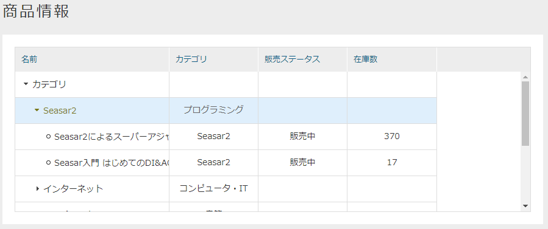

[[treeview_management]]
== TreeViewの管理

[[create_treeview]]
=== TreeViewの作成
TreeViewアイコンを右クリックし、 `TreeViewを作成する` を選択します。

[[treeview_setting]]
=== 設定
表示したいエンティティを `Entity Items` から `ツリー設定` にドラッグ&ドロップすることで、表示対象にできます。
`ツリーグリッド設定` 内や `ツリー設定` 内では、ドラッグ&ドロップで自由に並び替えができます。

[[treegrid_setting]]
==== ツリーグリッド設定
パーツとして表示する際のカラムの設定を行います。
どのカラムにどのプロパティを表示するかは `ツリー設定` にて行います。

[cols="1,3a",options="header"]
|===
|項目
|内容

|カラム
|名カラム名を設定します。
識別名として利用されます。

|表示名
|ツリーグリッドのヘッダに表示される表示名を設定します。

|幅
|列の幅を設定します。

|配置
|ツリーグリッド内での値の配置を設定します。

left:: 左寄せ
center:: 中央寄せ(未設定時のデフォルト)
right:: 右寄せ
|===

[[tree_setting]]
==== ツリー設定
ツリー構造を表示するための設定を行います。
ここで表示する参照プロパティの指定や、 `ツリーグリッド設定` で設定したカラムとプロパティの対応を決めます。

.基本項目
ツリービューに表示するための情報を設定します。

[cols="1,3a",options="header"]
|===
|項目
|内容

|Entity定義名
|ドラッグ&ドロップしたエンティティの定義名です。変更はできません。

|表示項目
|ツリーに表示するプロパティを選択します。
エンティティに定義されているプロパティがプルダウンに表示されます。

|表示上限
|1階層内で表示可能な最大件数を設定します。
上限を超える場合は上限の件数毎に区切るインデックス階層が表示されます。

|定義階層表示設定
|本項目にチェックを入れると、エンティティ定義の階層を表示し、その下にエンティティのデータが表示されるようになります。

|ソートアイテム
|ソートに利用するプロパティを選択します。
エンティティに定義されているプロパティがプルダウンに表示されます。

|ソートタイプ
|ASC, DESCを選択します。

|詳細表示用アクション
|カスタムで作成したアクションを利用したい場合は本項目で選択します。

|ビュー名
|詳細画面表示時に利用するEntityViewのビュー名を設定します。
|===

.参照設定
ドラッグ&ドロップで追加したエンティティに参照プロパティが存在する場合のみ設定可能です。
チェックを付けた参照プロパティはツリー設定に子として表示されます。
子も親となるエンティティと同様に各種設定ができます。

.パーツ設定
ツリーグリッド設定で列の設定を追加した場合のみ編集可能です。
ツリーグリッドの各列に対して、どのプロパティを表示するかをマッピングします。
`対応するプロパティ表示名` の各セルに対して、右側の `Properties` からドラッグ&ドロップで項目を設定してください。

.ウィジェット設定
ウィジェットで表示する際にエンティティや参照プロパティに対してアイコンを設定できます。

[cols="1,3a",options="header"]
|===
|項目|内容
|スタイル1
|エンティティのデータに適用するスタイルのクラス名を指定します。

|スタイル2
|エンティティの定義階層に適用するスタイルのクラス名を指定します。

|スタイル3
|インデックス階層に適用するスタイルのクラス名を指定します。

|アイコン1
|エンティティのデータに表示するアイコンのパスを指定します。
以下のルールによりパスを判断します。

`/` で始まる場合:: 静的コンテキストパスからの指定と判断
`http` で始まる場合:: 外部リソースと判断
上記以外（actionなどの指定含む）の場合:: テナントコンテキストパスからの指定と判断。

|アイコン2
|エンティティの定義階層に適用するスタイルのクラス名を指定します。
指定方法はアイコン1と同様です。

|アイコン3
|インデックス階層に適用するスタイルのクラス名を指定します。
指定方法はアイコン1と同様です。
|===

[[viewtreeview]]
=== 表示方法

[[viewtreeviewparts]]
.Top画面での表示
TopView定義にTreeViewパーツを配置することでトップ画面に表示することができます。 
[cols="1,4a", options="header"]
|===
|設定項目
|設定内容

|Icon Tag
|Fontawsomeによるアイコンタグを設定します。

|Class
|スタイルシートのクラス名を指定します。複数指定する場合は半角スペースで区切って下さい。

|===

メインエリアに配置した場合、以下のようなツリーグリッドが表示されます。
ツリーグリッドでの表示の場合は、表示用のプロパティ以外にもプロパティを表示することが出来ます。

ウィジェットエリアに配置すると、以下のように画面左側にツリーが表示されます。
テナント情報で垂直メニューを選択している場合は、メニューとウィジェットを切り替えるタブが表示されます。

