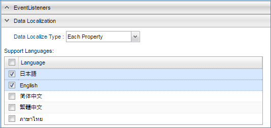

[[data_localize]]
== データの多言語化
// #12069

Entity定義の設定により、Entityデータ自体に対する多言語設定が行えます。
Data Localizationセクションから多言語化の方法と言語を設定します。

[cols="1,3a", options="header"]
|===
|項目|設定値
|Data Localize Type|データ多言語化の方法を設定します。

Not Localize:: 多言語化を行わない
Each Instance:: <<record_localize, レコード単位の多言語化>>
Each Property:: <<property_localize, プロパティ単位の多言語化>>

|Language Property|`Each Instance` の場合にレコードの言語を判別するプロパティを設定します。
|Support Languages|多言語化対象の言語を選択します。
|===

この機能を利用する場合、EntityManagerからEntityに対する検索・更新を行う際に、Queryやオプションにlocalizedフラグを設定する必要があります。
汎用画面では、画面定義（検索、詳細どちらも）の「データを多言語化」を有効にすることで、自動的にフラグを設定します。
「データを多言語化」が有効になっていない場合は、通常のレコード及びプロパティとして扱われます。

[[record_localize]]
=== レコード単位の多言語化
言語毎にレコードを分ける方法です。
Entity定義に「多言語判別用プロパティ」及び「対応言語」を設定することにより、 Entityデータ検索時に自動的に検索条件に「多言語判別用プロパティ=ユーザーの言語」を追加します。

例えば、Entity定義で以下のような設定をした場合、

[options="header"]
|===
|多言語判別用プロパティ|対応言語
|lang|en,ja
|===

利用ユーザーの言語が `en` の場合、検索時のEQLに `lang='en'` という条件を自動的に付与します。
利用ユーザーの言語が `zh_cn` の場合、対応言語にないので、検索時のEQLには `lang is null` といった条件（デフォルトを取得するように）が付与されます。
主に言語毎に対象とするデータの件数が異なる場合での利用を想定しています。

なお、レコード単位の多言語化を行う場合、ユニークIndexの利用に制限がつきます。
言語単位でレコードができるので、論理的なデータ単位でユニークIndexが設定できないためです。
また、言語単位で複数レコードが生成されるので、oid、AutoNumber型ではそれぞれ別のIDが割り振られます。

[[property_localize]]
=== プロパティ単位の多言語化
同一のEntity内に多言語用ラベルのプロパティを持つ方法です。
多言語用プロパティの命名ルールは以下の通りです。

{property名}_{言語}

例えば、Entity定義に「propA」というString型プロパティに対応する多言語用のプロパティを設定する場合、以下のようになります。

[options="header"]
|===
|言語|プロパティ名
||propA
|en|propA_en
|ja|propA_ja
|===

langが `en` のユーザーの場合、「propA」に対する操作が「propA_en」に反映されます。
「propA_en」が存在しない場合は「propA」を利用します。

画面定義では「propA」のみ配置します。
上記の動きにより、画面上の「propA」に表示される値は多言語化用プロパティの値になり、更新された値も多言語化用プロパティに反映されます。

