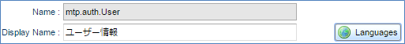
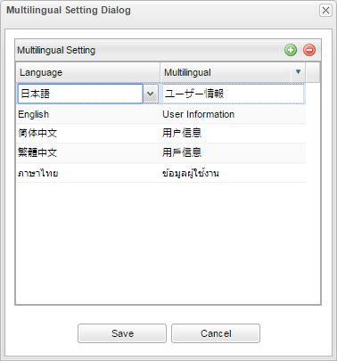
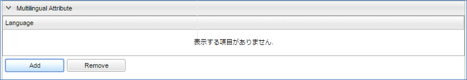
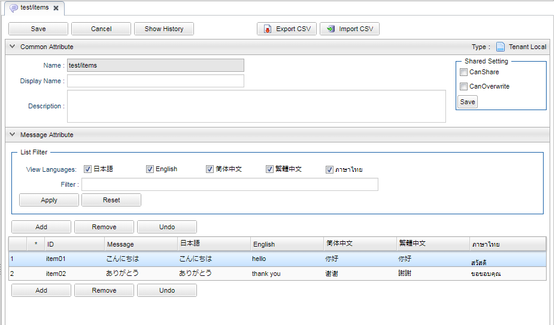

[[definition_localize]]
== 定義の多言語化
iPLAssの各種定義の内、ブラウザに表示される内容については、ユーザーの言語に合わせて表示する言語を切り替えることができます。
切り替えが可能な言語の種類はテナントの<<../multitenant/index.adoc#_多言語設定, 多言語設定>>に依存します。

=== 項目の多言語設定
各種定義の表示名といったラベル項目は、デフォルトのラベルの他に言語毎のラベルを設定できます。
設定可能な項目の場合、以下のように「Languages」ボタンが表示されます。

クリックすると以下のダイアログが表示されます。
右上のボタンで言語毎のラベル設定の追加・削除ができます。
表をダブルクリックすると編集モードになり、言語の選択と文言の設定ができます。

iPLAss標準の画面では使用言語に合わせたラベルを表示します。
独自の画面等で利用する場合、ユーティリティクラスを使うことで対象となる言語の文言を簡単に取得できます。

.使用例
----
String displayName = TemplateUtil.getMultilingualString(
    definition.getDisplayName(),
    definition.getLocalizedDisplayNameList());
----

=== テンプレートの多言語設定
テンプレートや通知機能（メール、SMS、Push通知）のテンプレートは、内容自体を言語毎に設定できます。
設定画面内の「Multilingal Attribute」セクションなどで多言語設定を管理しています。

「Add」ボタンをクリックすると、テンプレートに合わせた設定画面（JSPテンプレートならパスの設定、メールならテキストメッセージとHTMLテキストメッセージ等）が表示されます。
対象とする言語と合わせて設定を行います。

テンプレートの多言語設定は利用時（Actionの戻り先、メール作成時等）に自動的に読み込まれます。
開発者が意識して呼び出す必要はありません。

[[message_multilingual]]
=== メッセージの多言語設定

以下の二つのメッセージの定義方法を利用することでEntityのValidatorのメッセージや、テンプレートに埋め込む文言等を外部に定義しながら多言語設定を管理することもできます。

. メッセージカテゴリ
. リソースバンドル

==== メッセージカテゴリ

メッセージ管理ではメッセージカテゴリと呼ばれるグループと、各メッセージカテゴリ内に設定されるメッセージアイテム（メッセージの本文）を管理しています。
多言語による定義が可能で、ユーティリティ等を利用することで、使用言語に合わせたメッセージを簡単に表示することも出来ます。
EntityのValidationでの入力エラーメッセージにも利用することが出来ます。
また、独自テンプレートを利用した画面にて、テキストをメッセージで管理することで多言語に対応するといった利用方法も可能です。

===== Messageの作成

Messageアイコンを右クリックして「メッセージカテゴリを作成する」を選択してください。

===== 設定

メッセージカテゴリの編集画面は以下のような構成になっています。 + 
共通定義のCommon Attributeと、各メッセージアイテムを管理するMessage Attributeに分かれています。

.Save
メッセージカテゴリ全体の内容を保存します。
「Cancel」を行うと、編集した内容は全て破棄されます。

.Cancel
編集した内容を破棄します。

.Show History
編集履歴を参照できます。

.Name
メッセージカテゴリの定義名

.Display Name
メッセージカテゴリの表示名

.Description
メッセージカテゴリの説明文

.メッセージアイテムの検索
メッセージアイテムのデータを絞り込むことができます。 + 
Message AttributeのセクションにあるFilter項目に検索条件を入力し、「View Language」項目にチェックをいれて「Apply」ボタンをクリックします。 + 
「Reset」ボタンをクリックすると、検索条件がクリアされてすべてのメッセージアイテムが表示されます。

.メッセージアイテムの追加
Message Attributeのセクションにある「Add」ボタンをクリックします。新規メッセージアイテムが一覧に追加されます。 + 
新規レコードの各項目にデータを入力した後に「Save」を実行してください。 + 
「Save」を実行しないと入力内容がそのまま破棄されますので注意してください。

.メッセージアイテムの編集
編集したいメッセージアイテムの項目をダブルクリックします。 + 
編集用のテキストボックスが表示されます。 + 
「Save」を実行しないと編集内容がそのまま破棄されますので注意してください。

.メッセージアイテムの削除
削除したいメッセージアイテムを選択し、Message Attributeで「Remove」ボタンをクリックします。
メッセージアイテムを削除します。

.元に戻す
編集を行ったメッセージアイテムを選択し、「Undo」ボタンをクリックしてメッセージアイテムを元に戻します。

===== 利用方法
使い方のサンプルコード +
TemplateUtilとかtaglib辺りのメッセージがらみのユーティリティも併せて紹介

.MessageManager
MessageManagerを利用してメッセージを取得することができます。
以下のようにメッセージカテゴリ名とメッセージアイテム名を指定します。
[source,java]
----
MessageManager manager = ManagerLocator.manager(MessageManager.class);
String tempMessage = manager.getMessageItem("User", "Sub01").getMessage();
String message = MessageFormat.format(tempMessage, "ユーザー名");
----

.TemplateUtil
TemplateUtilの以下のメソッドを利用することで、使用言語に合わせたメッセージを取り出すことができます。

====
String getMessageString(String categoryName, String messageId, Object... args)

String getMessageString(MessageItem message, Object... args)
====

.JSP
JSPからメッセージを利用する場合、`<%@ taglib prefix="m" uri="http://iplass.org/tags/mtp"%>` のタグライブラリに定義されている以下の関数が利用できます。

====
String msg(String categoryName, String messageId)

String msgp(String categoryName, String messageId, Object params)
====

.GroovyTemplate
GroovyTemplateからメッセージを利用する場合、共通関数として定義されている以下の関数が利用できます。
====
String msg(String categoryName, String messageId, Object params)
====

詳細は<<../customizing/index#groovytemplate,GroovyTemplate>>を参照してください。

==== リソースバンドル

===== メッセージプロパティファイルの作成
言語毎にプロパティファイルを作成する場合、クラスパスが通っているディレクトリにプロパティファイルを配置してください。 + 
多言語プロパティファイルの命名ルールは以下です。

{ResourceBundleのbaseName}_{言語}

===== 利用方法

.ResourceBundleUtil
ResourceBundleUtilを利用してメッセージを取得することができます。 以下のようにリソースバンドル名、ロケール、キーなどを指定できます。

====
String resourceString(String key, Object... arguments)

String resourceString(Locale langLocale, String key, Object... arguments) 

String resourceString(ResourceBundle resource, String key, Object... arguments)

String resourceString(String bundleBaseName, Locale langLocale, String key, Object... arguments)
====

.TemplateUtil
TemplateUtilの以下のメソッドを利用することで、使用言語に合わせたメッセージを取り出すことができます。

====
String getResourceString(String key, Object... arguments)

String getResourceString(ResourceBundle resource, String key, Object... arguments)
====

.JSP
JSPからメッセージを利用する場合、`<%@ taglib prefix="m" uri="http://iplass.org/tags/mtp"%>` のタグライブラリに定義されている以下の関数が利用できます。

====
String rs(String baseName, String key)

String rsp(String baseName, String key, Object params)
====

.GroovyTemplate
GroovyTemplateからメッセージを利用する場合、共通関数として定義されている以下の関数が利用できます。
====
String rs(baseName, key, params)
====

詳細は<<../customizing/index#groovytemplate,GroovyTemplate>>を参照してください。

※独自で言語切替の実装をする際の注意点 +
言語切替をする場合は、セッション情報（ SessionContext ）に `language` というキー名で言語コード「 `ja`(日本語) , `en`(English)  , `zh-CN`(简体中文) , `zh-TW`(繁體中文) , `th`(ภาษาไทย) 」のいずれかをStringで設定してください。ただし、セッション情報に設定するだけでは、ResourceBundleUtilや、TemplateUtil等で表示される結果は、切り替わりません。実際に切り替わるのは、その後に何かしらのコマンドが呼び出された後からとなります。 +
独自で言語切替を実装する場合は、上記内容を理解した上で設計してください。