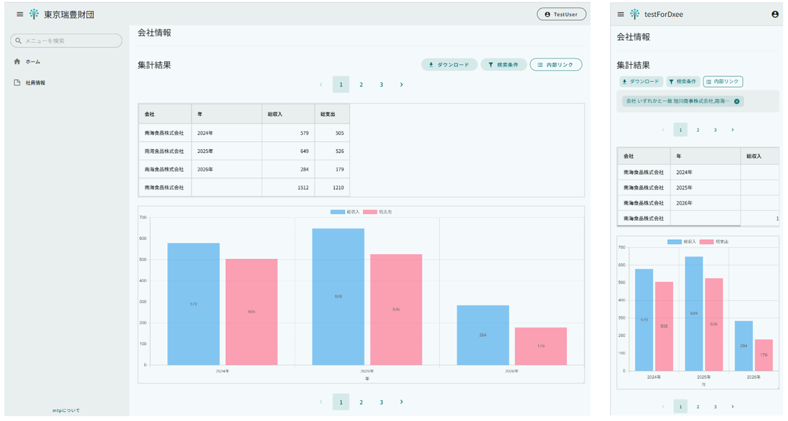
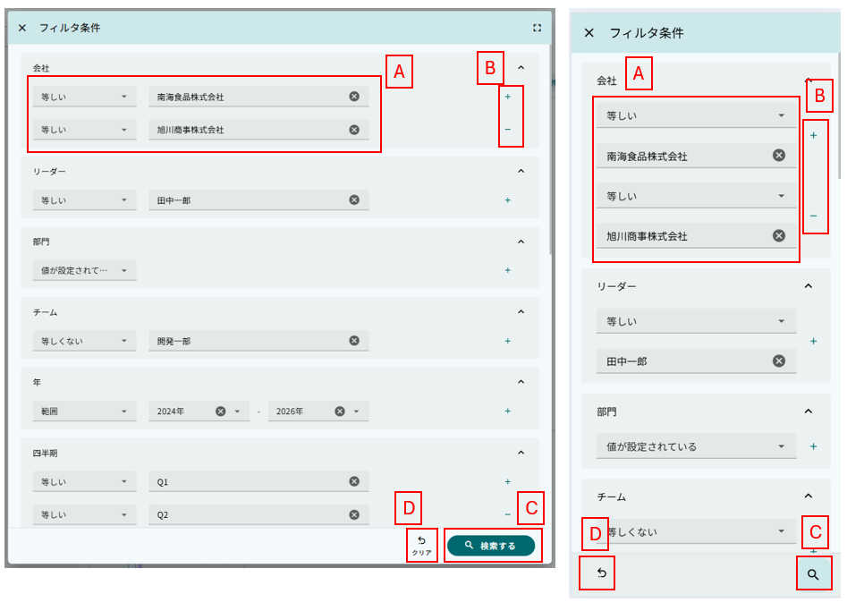
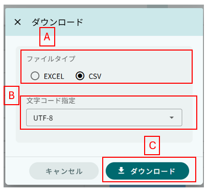
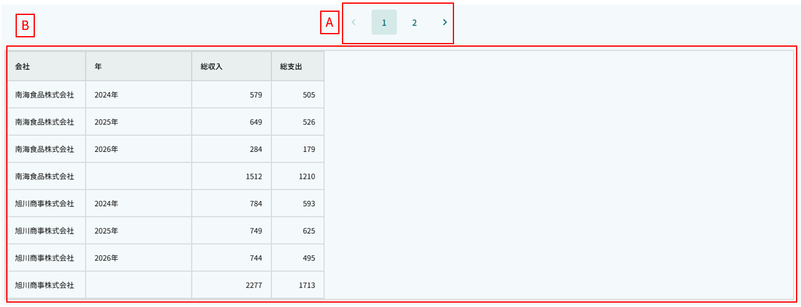
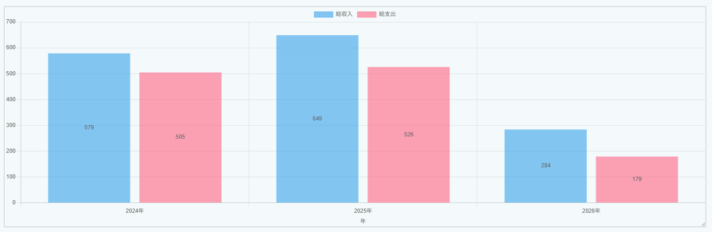
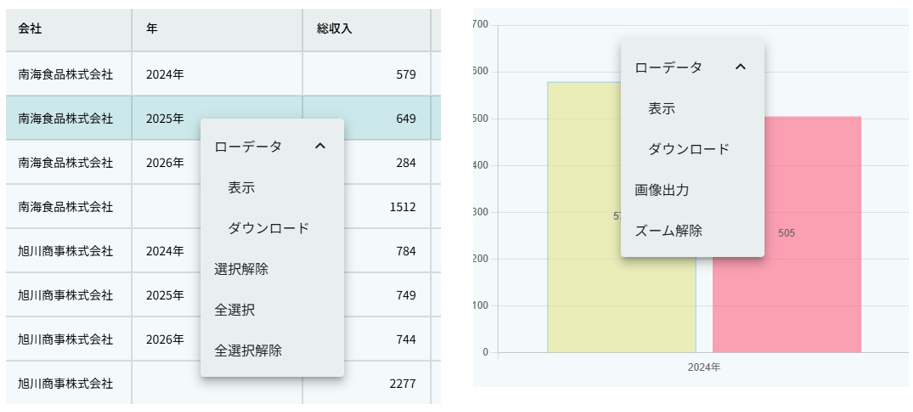
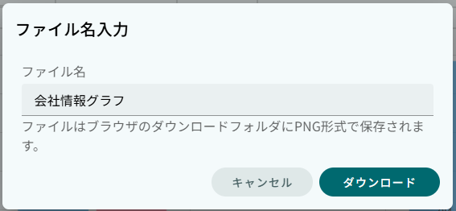
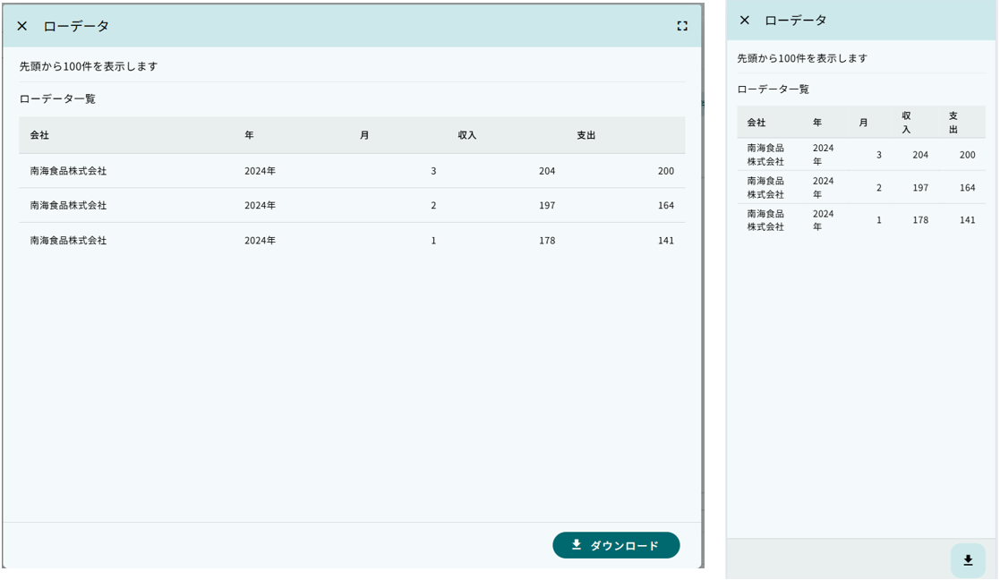

[[operationguide]]
== 操作説明

MDCモジュールにおける集計画面の操作説明です。 +
エンティティのデータを集計し、集計データやグラフとして表示する画面です。 +
MDC版ではPCモードとモバイルモードの两种表示モードをサポートしています。

=== 単純集計/クロス集計

エンティティのデータを集計し、集計データやグラフとして表示する画面です。

==== 画面構成

集計画面は、大きく3つの領域に分かれています。
上部の `ボタン・フィルタ条件エリア` 、中央の `集計結果エリア` 、下部の `グラフエリア` です。

==== ボタン・フィルタ条件エリア

集計画面の操作ボタンと集計対象データの絞り込み条件を設定します。

===== フィルタ条件ダウンロード

.A.フィルタ条件
検索条件を入力するフィールドです。
プロパティの型に応じて適切な入力形式が表示されます。

.B.条件追加/削除
`+` ボタンをクリックすると、フィルタ条件を追加できます。
`-` ボタンをクリックすると、フィルタ条件を削除できます。
複数の条件を組み合わせて絞り込みが可能です。

.C.検索実行
`検索する` をクリックすると、フィルタ条件を元にデータの集計を行います。

.D.条件クリア
`クリア` をクリックすると、画面表示時のフィルタ条件に戻ります。

===== ファイルダウンロードダウンロード

集計結果をファイルとしてダウンロードします。

.A.ダウンロードボタン
クリックするとダウンロードダイアログが表示されます。

.B.ファイル形式選択
CSV形式またはExcel形式を選択できます（設定により変更可）。

.C.ダウンロード実行
選択した形式でファイルをダウンロードします。

==== 集計結果エリア

エンティティの集計データをテーブル形式で表示します。

.A.ページング
集計データが集計結果の表示上限を超える場合に表示されます。
単純集計の場合のみ表示します。
`<` 、 `>` をクリックすると前後のデータを表示します。

.B.集計結果テーブル
集計データを行列形式で表示します。
ヘッダーをクリックするとソートが可能です（設定により変更可）。

==== グラフエリア

集計データを視覚的に表現します。
以下のグラフタイプをサポートしています。

* 折れ線グラフ
* 棒グラフ
* 円グラフ
* エリアグラフ
* ドーナツグラフ
* バブルチャート
* 散布図
* ピラミッド
* レーダーチャート
* 極座標グラフ

=== メニュー

集計結果やグラフのデータ部分を選択し、右クリックするとメニューが表示されます。

* PCモード: 右クリックでメニューを表示
* モバイルモード: 長押しでメニューを表示

==== テプラの操作

.選択解除
集計結果の選択行またはセルを未選択状態にします。

.全選択
集計結果の全行または全セルを選択状態にします。

.全選択解除
集計結果の全行または全セルを未選択状態にします。

==== グラフの操作

.ズーム操作

* PCモード: マウスホイールでズーム
* モバイルモード: ピンチイン/ピンチアウトでズーム

.ズーム解除

ズームを解除してグラフを初期表示状態に戻します。

.グラフ画像の出力

グラフをPNG画像としてダウンロードします。

==== ローデータ関連操作

集計データの元となったローデータに関する操作です。

.表示
選択した集計データの元となったローデータを画面に表示します。

.ダウンロード
選択した集計データの元となったローデータをファイルとしてダウンロードします。

