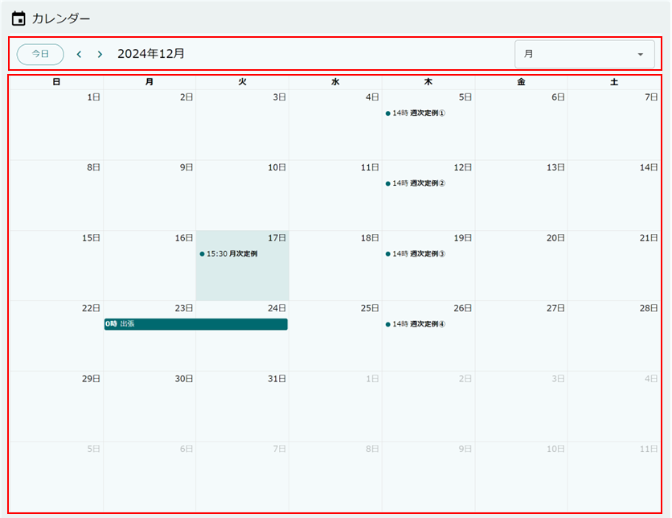
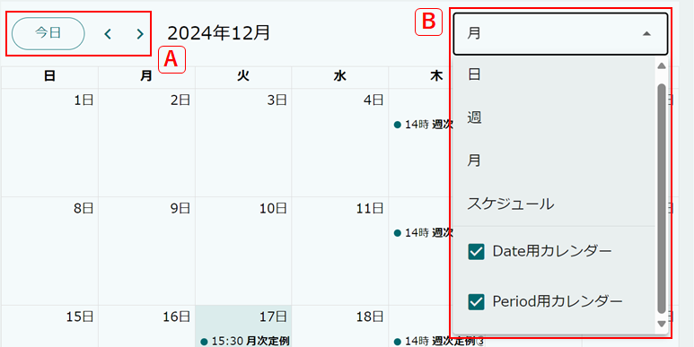
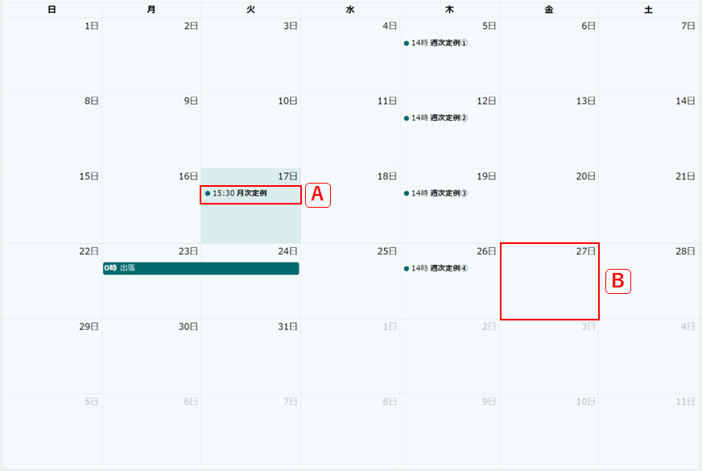
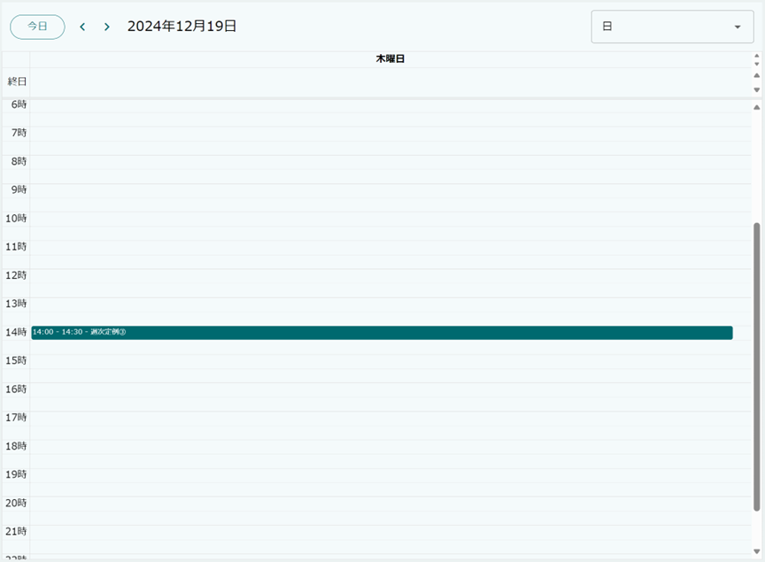
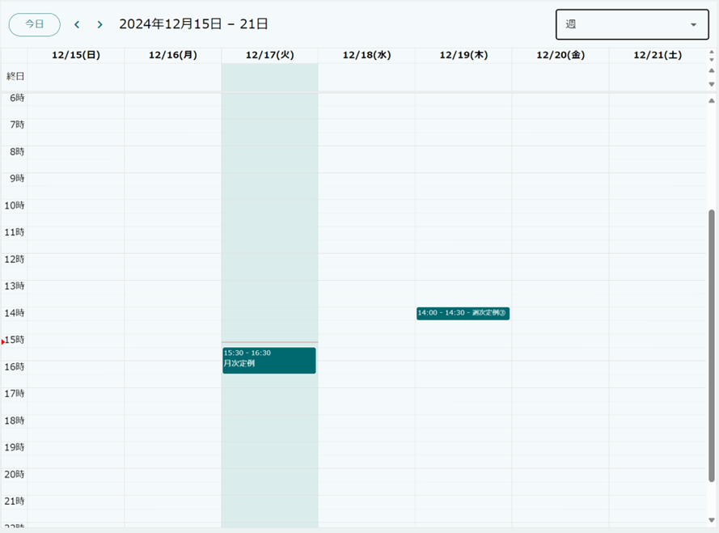
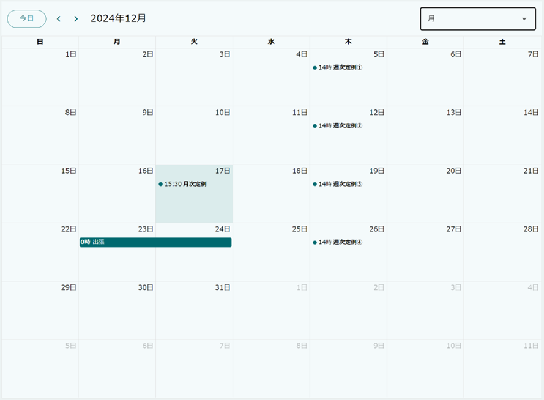
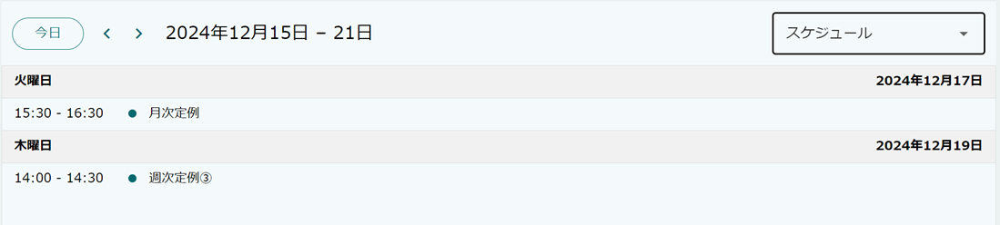

[[operation_guide]]
== 操作説明

=== 画面構成

カレンダーは、大きく2つの領域に分かれています。
上部の `表示条件設定` と 下部の `予定表示` です。

=== 表示条件設定
`表示条件設定` では、表示する予定（エンティティデータ）に関する条件を設定します。

.A.表示期間の設定
`今日` ボタンを押下することでカレンダーの表示範囲を現在日時が含まれるように設定します。

`<` を押下することで前月（前日、前週）の予定を、`>` を押下することで翌月（翌日、翌週）の予定を表示します。

.B.表示タイプの設定
カレンダーの表示範囲および表示対象のエンティティを設定します。

表示タイプは以下の4種類が選択可能です。

日:: 日単位のカレンダーを表示します。
週:: 週単位のカレンダーを表示します。
月:: 月単位のカレンダーを表示します。
スケジュール:: 予定の一覧を表示します。

=== 予定表示
`予定表示` では、表示条件設定を元にカレンダー上に予定を表示します。

.A.予定の詳細表示

予定をクリックすることで当該エンティティデータの詳細ダイアログが表示されます。

.B.予定の新規登録

日付枠や時間枠をクリック、もしくはドラッグ操作で複数枠を選択することでエンティティデータの登録画面が表示されます。 +
表示するエンティティが複数存在する場合には、どのエンティティのデータを新規作成するかを選択するダイアログが表示されます。

==== 日単位のカレンダー

1日単位のカレンダーを表示します。

==== 週単位のカレンダー

1週間単位のカレンダーを表示します。

==== 月単位のカレンダー

1ヶ月単位のカレンダーを表示します。

==== スケジュール表示

範囲内の予定を一覧表示します。

