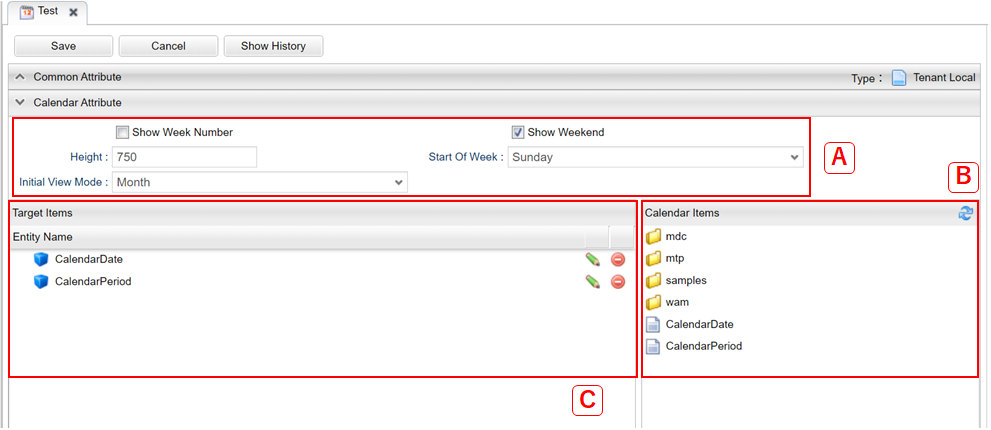

[[management]]
== Calendarの管理

[[create_calendar]]
=== Calendarの作成

Calendarアイコンを右クリックし、 `Calendarを作成する` を選択します。

[[calendar_setting]]
=== 設定
Calendarの編集画面は3つの領域に分かれます。

.A.カレンダー設定

Calendarでの設定項目です。

[cols="1,3a", options="header"]
|===
|項目
|内容

|Show Week Number
|週番号を表示するかを設定します。

|Show Weekend
|週末を表示するかを設定します。

|Height
|カレンダーの高さ（px）を設定します。

|Start Of Week
|週の開始曜日を設定します。
設定できる曜日は以下になります。

Saturday:: 土曜日
Sunday:: 日曜日
Monday:: 月曜日

|Initial View Mode
|カレンダーの初期表示タイプを設定します。
設定できる表示タイプは以下になります。

Day:: 日表示
Week:: 週表示
Month:: 月表示
|===

.B.Calendar Items
カレンダーアイテムが階層表示されます。
`Target Items` 領域へドラッグ&ドロップすることでカレンダーでの表示が可能になります。

.C.Target Items
`Calendar Items` からドラッグ&ドロップすることで、カレンダー上に表示するエンティティを設定します。

.エンティティアイテムの設定
表示対象エンティティ設定領域内の各エンティティの編集ボタンをクリックすることで、エンティティアイテムの詳細設定が可能です。

[cols="1,3a", options="header"]
|===
|項目
|内容

|Entity Name
|カレンダーに表示するエンティティです。変更不可。

|Entity View
|詳細表示、新規作成時に使用するDetailViewのView名を設定します。

|Entity Color
|カレンダーに表示する予定の色を設定します。カラーコード、カラー名、テーマカラー名のいずれかを指定します。

|Entity Color Script
|GroovyScriptで処理を記述し、カレンダーに表示する予定の色の動的条件を設定可能です。
詳細は<<entity_color_script, Entity Color Script>>を参照してください。

|Matching Type
|カレンダーの予定の検索方法を設定します。
指定できる検索方法は以下になります。

Date:: 日付指定
Period:: 期間指定

|Target Property(for Date)
|Matching Typeが `Date` の場合に、検索対象となるプロパティを設定します。

|From Property(for Period)
|Matching Typeが `Period` の場合に、開始日時となるプロパティを設定します。

|To Property(for Period)
|Matching Typeが `Period` の場合に、終了日時となるプロパティを設定します。

|Filter Condition
|予定を検索する際の共通フィルタ条件を設定します。

|Limit
|一度に検索する上限を設定します。

|allow new record registration
|レコードの新規登録を許可するかを設定します。
|===

[[entity_color_script]]
.Entity Color Script
GroovyScriptで処理を記述し、カレンダーに表示する予定の色の動的条件を設定可能です。EntityColorよりも本設定が優先されます。

下記項目をバインドしています。

[cols="1,3a", options="header"]
|===
|変数名
|バインドされている値

|request
|リクエスト

|session
|セッション

|user
|ユーザー

|today
|現在時刻

|targetPropertyName
|検索対象となるプロパティ名(for Date)

|fromPropertyName
|開始日時となるプロパティ名(for Period)

|toPropertyName
|終了日時となるプロパティ名(for Period)

|entity
|対象のEntityデータ（各予定を表すデータ）
|===

例えば下記のようなスクリプトを記述することで、期限を過ぎたデータは赤、過ぎていないデータは緑として表示できます。

[source,groovy]
----
def diff = today - entity.getValue(toPropertyName);
if (diff >= 1) {
    return "red";
} else {
    return "green"
}
----

[[viewcalendar]]
=== 表示方法
.メニューへの登録
iPLAssで標準提供している「カレンダー画面表示」アクション（ `mdc/calendar/index` ）を利用して、カレンダーを単一の画面として表示できます。 +
アクション名以降のサブパスをカレンダー定義名として指定します。

[[viewcalendarparts]]
.Top画面での表示
TopView定義にCalendarパーツを配置することでTop画面にカレンダーを表示できます。 
詳細は<<../topview/index.adoc#calendar, Calendar>>を参照してください。