[[mdc_entitylisting_operationguide]]
== 操作説明

=== 画面構成

MDC EntityListingの画面は、以下の3つの主要エリアで構成されています。

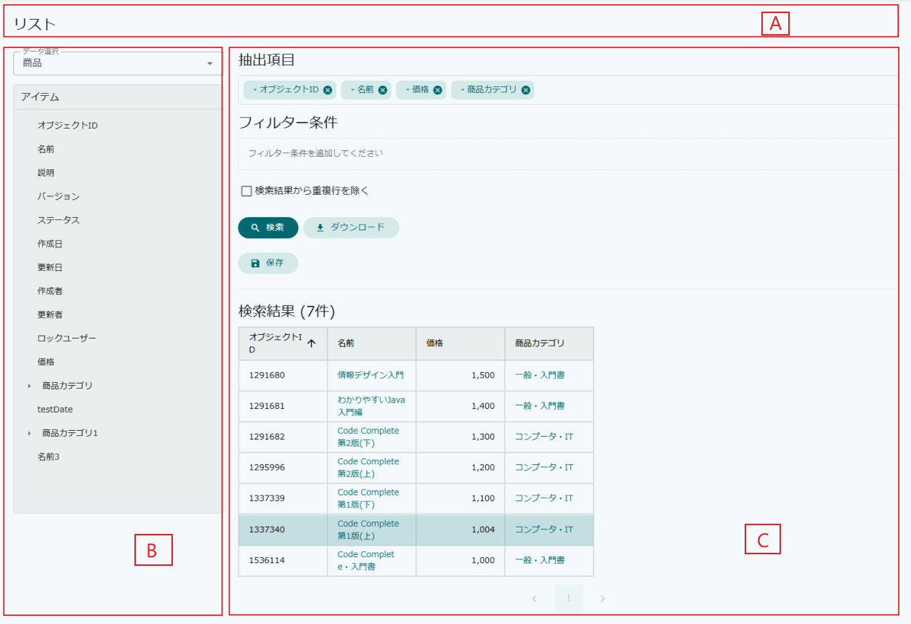

.A.タイトルエリア
EntityListingの画面タイトルが表示されます。EntityListingメタデータで `DisplayName` が設定されている場合はその名称が、未設定の場合はデフォルトの表示名（リスト）が表示されます。

.B.プロパティ選択エリア
画面左側に表示されるエリアです。エンティティの選択と、そのエンティティが持つプロパティの一覧が表示されます。プロパティをクリックまたはドラッグ&ドロップして、抽出項目やフィルター条件に追加します。

.C.検索条件・検索結果エリア
画面右側に表示されるエリアです。抽出項目、フィルター条件、結果の絞り込み、検索結果から重複行を除くの設定、検索実行、検索結果の表示を行います。

=== 画面操作

[[mdc_entitylisting_ope_entityselect]]
==== データアイテム選択
.エンティティ選択
エンティティをドロップダウンから選択します。選択すると `アイテム` 部分にプロパティが表示されます。

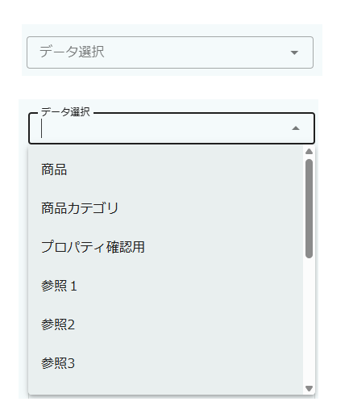

NOTE: 選択可能なエンティティやプロパティはEntityListingメタデータで指定することが可能です。EntityListingメタデータを利用しない場合は、エンティティ権限の設定により参照可能なエンティティやプロパティが表示されます。

.プロパティ選択
`抽出項目` を設定したい場合は、アイテムをダブルクリックするか、 `抽出項目` 領域にドラッグ&ドロップすることで追加されます。

`フィルター条件` に追加したい場合は、フィルター条件下部の「アイテムをドロップしてください」という領域にドラッグ&ドロップすることで追加されます。

プロパティがReferenceプロパティの場合は、左に右向き「▼」が表示されます。
このアイテムをクリックすることでReference対象エンティティのプロパティが表示されます。

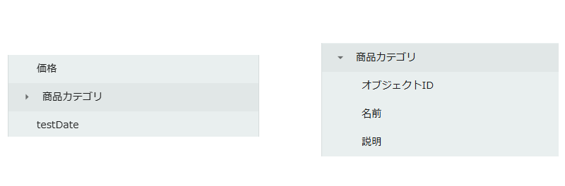

[[mdc_entitylisting_ope_selectitem]]
==== 抽出項目設定

抽出項目エリアでは、検索結果として取得するプロパティを管理します。

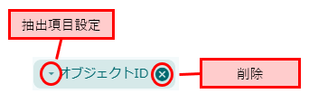

.列の並び替え
抽出項目の列の順番はドラッグ&ドロップで並びかえることが可能です。

.抽出項目の削除
各抽出項目のチップ上にある「×」アイコンをクリックすることで、抽出項目から削除できます。

.集計関数設定
抽出項目に対して、集計関数を指定することが可能です。 集計関数として利用できる関数は、ドロップされたアイテムのデータ型によって決まります。

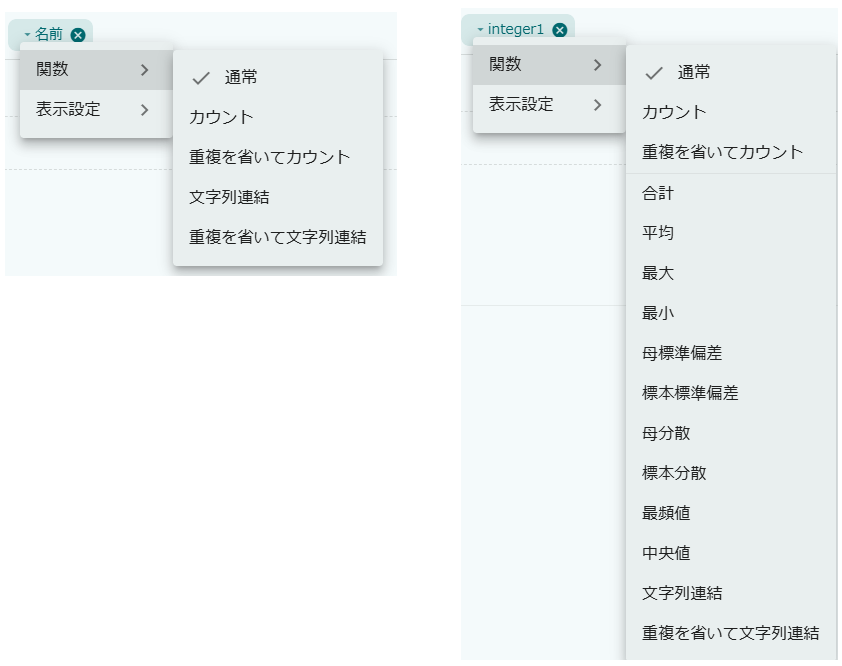

[cols="2,2,5a", options="header"]
|===
|関数名|集計関数|説明

|通常|NONE|集計を行わず、プロパティの値をそのまま取得します（デフォルト）。

|カウント|COUNT|対象レコードの件数を取得します。

|重複を省いてカウント|COUNT_DISTINCT|重複を除いたレコードの件数を取得します。

|合計|SUM|数値プロパティの合計値を計算します。（数値型・集計項目のみ） 

|平均|AVG|数値プロパティの平均値を計算します。（数値型・集計項目のみ） 

|最大|MAX|プロパティの最大値を取得します。（日付型・数値型・集計項目のみ） 

|最小|MIN|プロパティの最小値を取得します。（日付型・数値型・集計項目のみ） 

|母標準偏差|STDDEV_POP|数値プロパティの母標準偏差を計算します。（数値型・集計項目のみ） 

|標本標準偏差|STDDEV_SAMP|数値プロパティの標本標準偏差を計算します。（数値型・集計項目のみ） 

|母分散|VAR_POP|数値プロパティの母分散を計算します。（数値型・集計項目のみ） 

|標本分散|VAR_SAMP|数値プロパティの標本分散を計算します。（数値型・集計項目のみ） 

|最頻値|MODE|プロパティの中で最も多く出現する値（最頻値）を取得します。（日付型・数値型・集計項目のみ） 

|中央値|MEDIAN|数値プロパティの中央値を計算します。（日付型・数値型・集計項目のみ） 

|文字列連結|LISTAGG|プロパティの値をカンマ区切りで連結した文字列を取得します。

|重複を省いて文字列連結|LISTAGG_DISTINCT|重複を除いたプロパティの値をカンマ区切りで連結した文字列を取得します。
|===

.表示設定
抽出項目チップをクリックすると、検索結果一覧の表示設定を変更するメニューが開きます。以下の設定が可能です。

* 配置設定 +
左寄せ、中央寄せ、右寄せを設定します。
数値型のプロパティは、デフォルトで「右寄せ」が設定されます。
その他の型はデフォルトで「左寄せ」になります。

* 列幅設定 +
検索結果の表示列幅を100px〜500pxの範囲で設定します。デフォルトは150pxです。

* 数値フォーマット設定（数値型・集計項目のみ） +
数値をフォーマット（カンマ区切り）表示するかを設定します。
数値型のプロパティまたは数値結果を返す集計関数（カウント、合計、平均等）が設定されている場合に選択可能です。
未指定の場合、<<../../../serviceconfig/index.adoc#MdcConfigService, MdcConfigService>> の `formatNumberWithComma` が `true` の場合にのみフォーマット表示されます。 `formatNumberWithComma` が `true` の場合で、フォーマット表示したくない場合は、「フォーマットしない」を選択する必要があります。

NOTE: 多重度が1より大きいプロパティ、およびLongText型のプロパティは、抽出項目設定を行うことができません。
[[mdc_entitylisting_ope_filter]]
==== フィルター条件

フィルター条件エリアでは、検索時の絞り込み条件を指定します。

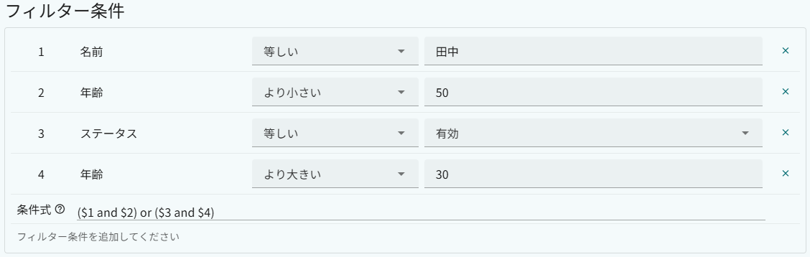

[[mdc_entitylisting_ope_filter_row]]
===== 条件行の構成

フィルター条件エリアに追加された各条件行では以下の項目を設定します。

[cols="1,5a", options="header"]
|===
|項目|説明

|項番
|条件行の番号です。条件式で参照する際に使用します。

|プロパティ名
|フィルター対象のプロパティ名が表示されます。

|演算子
|絞り込みに使用する演算子を選択します。
利用可能な演算子はプロパティのデータ型によって決まります。詳細は下記の演算子一覧を参照してください。

|値
|絞り込み値を入力します。

|削除ボタン
|「×」ボタンをクリックすることで、その条件行を削除します。
|===

フィルター条件として指定可能な演算子は、プロパティのデータ型によって異なります。

[cols="1,4a", options="header"]
|===
|演算子|説明

|等しい|指定した値と等しいデータを検索します。

|等しくない|指定した値と等しくないデータを検索します。

|前方一致|指定した値で始まるデータを検索します。

|後方一致|指定した値で終わるデータを検索します。

|含む|指定した値を含むデータを検索します。

|含まない|指定した値を含まないデータを検索します。

|いずれかと等しい|指定した複数の値のいずれかと等しいデータを検索します。

|より小さい|指定した値より小さいデータを検索します。

|より大きい|指定した値より大きいデータを検索します。

|以下|指定した値以下のデータを検索します。

|以上|指定した値以上のデータを検索します。

|範囲|指定したFromからToの範囲内のデータを検索します。

|日付相対範囲|定義済みの相対期間でDate型プロパティを検索します。

|日時相対範囲|定義済みの相対期間でDateTime型プロパティを検索します。

|値が設定されている|値がNULLでないデータを検索します。

|値が設定されていない|値がNULLのデータを検索します。

|保存リストから
a|保存済みの保存リストを条件値として参照して絞り込みます。
値の入力フィールドの代わりに `選択` ボタンが表示されます。

選択操作の手順は以下のとおりです。

. `選択` ボタンをクリックすると保存リスト選択ダイアログが開きます。
  `保存リスト` タブと `所有するリスト` タブから参照したい保存データを選択します。
. 保存データを選択すると列選択ダイアログが開きます。
  保存されたローデータの先頭行が表示されるので、条件値として参照する列をクリックして `選択` ボタンをクリックします。
. 選択後、フィールドに `リスト名(列名)` 形式で選択内容が表示されます。

`文字列として比較` チェックボックスをONにすると、参照した列の値を文字列型として比較します。
Referenceプロパティに対してSLを使用する場合は、参照するデータのIDが格納されている列を選択してください。

NOTE: 現在編集中の保存リスト自身を条件値として指定することはできません。 +
SL演算子はEntityListingメタデータの `use saved list` が有効の場合にのみ選択できます。
|===

各データ型で利用できる演算子は以下のとおりです。

[cols="1,6a", options="header"]
|===
|データ型|利用可能な演算子

|String|等しい, 等しくない, 前方一致, 後方一致, 含む, 含まない, いずれかと等しい, より小さい, より大きい, 以下, 以上, 範囲, 値が設定されている, 値が設定されていない, 保存リストから

|AutoNumber|等しい, 等しくない, 前方一致, 後方一致, 含む, 含まない, いずれかと等しい, より小さい, より大きい, 以下, 以上, 範囲, 値が設定されている, 値が設定されていない, 保存リストから

|Integer / Decimal / Float|等しい, 等しくない, 前方一致, 後方一致, 含む, 含まない, いずれかと等しい, より小さい, より大きい, 以下, 以上, 範囲, 値が設定されている, 値が設定されていない, 保存リストから

|Boolean|等しい, 等しくない, 値が設定されている, 値が設定されていない, 保存リストから

|Date|等しい, 等しくない, いずれかと等しい, より小さい, より大きい, 以下, 以上, 範囲, 日付相対範囲, 値が設定されている, 値が設定されていない, 保存リストから

|DateTime|等しい, 等しくない, いずれかと等しい, より小さい, より大きい, 以下, 以上, 範囲, 日時相対範囲, 値が設定されている, 値が設定されていない, 保存リストから

|Time|等しい, 等しくない, いずれかと等しい, より小さい, より大きい, 以下, 以上, 範囲, 値が設定されている, 値が設定されていない, 保存リストから

|Select|等しい, 等しくない, いずれかと等しい, より小さい, より大きい, 以下, 以上, 範囲, 値が設定されている, 値が設定されていない, 保存リストから

|Reference|等しい, 等しくない, いずれかと等しい, 値が設定されている, 値が設定されていない, 保存リストから

|LongText|等しい, 等しくない, 前方一致, 後方一致, 含む, 含まない, いずれかと等しい, より小さい, より大きい, 以下, 以上, 範囲, 値が設定されている, 値が設定されていない, 保存リストから

|Expression|内部のエディタ型に準じる

|Binary|等しい, 等しくない, 前方一致, 後方一致, 含む, 含まない, 値が設定されている, 値が設定されていない, 保存リストから
|===

NOTE: LongText型プロパティをフィルター条件として利用するには、 <<../../../serviceconfig/index.adoc#PropertyService, PropertyService>> の `remainInlineText` を `true` に設定する必要があります。

[[mdc_entitylisting_ope_filter_expression]]
===== フィルター条件式

フィルターに条件が1つでも追加されると、 `条件式` の入力エリアが表示されます。
この条件式には各フィルターの組み合わせ条件を指定することができます。

`${フィルタの行番号}` で対象の条件を指定します。

※ 条件式には、カッコ、AND、OR、NOT を利用することができます。

フィルター条件式が未指定の場合は、同一プロパティはOR条件として、他プロパティに対してはAND条件として検索します。

.例：条件式の指定例
フィルター条件として以下を指定した場合、
----
1. 販売ステータス = '準備中'
2. 販売ステータス = '販売中'
3. 在庫数 < 500
4. 在庫数 < 100
----

条件式が未指定の場合は以下の条件で検索されます。
----
 ( 販売ステータス = '準備中' OR 販売ステータス = '販売中' ) AND ( 在庫数 < 500 OR 在庫数 < 100 )
----

条件式に以下を指定した場合、
----
($1 and $3) or ($2 and $4)
----
以下の条件で検索されます。
----
 ( 販売ステータス = '準備中' AND 在庫数 < 500 ) OR ( 販売ステータス = '販売中' AND 在庫数 < 100 )
----

[[mdc_entitylisting_ope_resultfilter]]
==== 結果の絞り込み（HAVING条件）

抽出項目に集計関数が指定されている場合、結果の絞り込みを設定することが可能です。
結果の絞り込みはSQLのHAVING句に相当し、集計結果に対する条件を指定します。

NOTE: 結果の絞り込みは、集計関数が設定された抽出項目が1件以上存在する場合にのみ利用できます。

EntityListingメタデータの `to edit the narrowing condition, as dialog` の設定により、入力方式が異なります。

ダイアログモード（デフォルト）::
「絞り込み」ボタンをクリックすると、結果の絞り込み条件を指定するダイアログが表示されます。
+
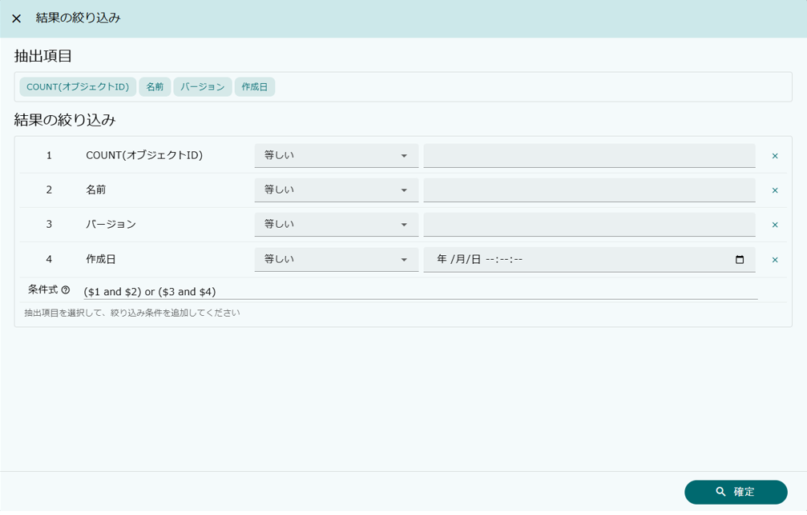
+
ダイアログ上部には現在設定されている抽出項目がチップとして一覧表示されます。
チップをクリックすると絞り込み条件の行として追加されます。
+
追加された条件行の構成はフィルター条件と同一です（<<mdc_entitylisting_ope_filter_row, 条件行の構成>>を参照）。ただし「プロパティ名」欄には抽出項目名（集計関数が設定されている場合はその関数名も含む）が表示されます。
「確定」ボタンをクリックして絞り込み条件を適用します。

直接編集モード::
フィルター条件の下に、結果の絞り込みエリアが直接表示されます。
抽出項目エリアの抽出項目チップを **クリック** すると絞り込み条件の行として直接追加されます。
+
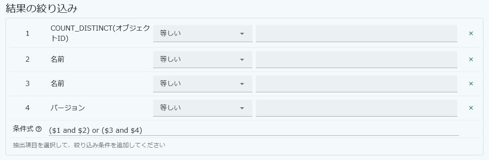
+
追加された条件行の構成はフィルター条件と同一です（<<mdc_entitylisting_ope_filter_row, 条件行の構成>>を参照）。ただし「プロパティ名」欄には抽出項目名（集計関数が設定されている場合はその関数名も含む）が表示されます。

結果の絞り込みでもフィルター条件と同様に条件式を利用することが可能です（条件式の記法については<<mdc_entitylisting_ope_filter_expression, フィルター条件式>>を参照してください）。

[[mdc_entitylisting_ope_distinct]]
==== 重複除外（DISTINCT）

検索結果から重複行を除外する場合は、検索条件エリアの `検索結果から重複行を除く` チェックボックスをONにします。

[[mdc_entitylisting_ope_search]]
==== 検索の実行

検索条件を設定後、 `検索` ボタンをクリックすることで検索を実行します。

[[mdc_entitylisting_ope_savedlist]]
==== 検索条件、検索結果の保存
設定した検索条件や検索結果を保存リストとして保存することができます。保存データは別名での保存も可能です。

まだ保存されていない場合 ::
+

保存されているデータを編集で開いた場合 ::
+

`保存ボタン` をクリックすると、ダイアログが表示されます。

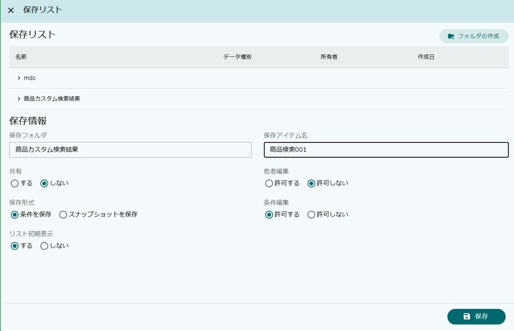

.保存フォルダ
保存リストの名前に表示されているフォルダをクリックすることで、 `保存フォルダ` にフォルダが設定されます。
また `フォルダの作成` から新しくフォルダを作成することができます。

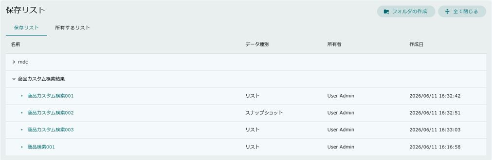

.共有
保存した保存リストを他のユーザーが参照することができるようになります。

.他者編集
保存した保存リストをもとに、他のユーザーが編集画面を表示することができるようになります。
他者編集を許可しない場合は、保存リスト上でデータを参照することはできますが、編集画面には遷移できません。

.保存形式

- 条件を保存 +
条件のみ保存されます。このリストを開くと、保存された条件で最新のデータを検索します。

- スナップショットを保存 +
条件とデータを保存します。このリストを開くと、保存時のデータが表示されます。

※ スナップショットについて +
スナップショットとして保存したデータについては、保存データ編集（検索条件編集）や、保存されたエンティティの参照画面への遷移は行えません。

.条件編集
保存リストとして参照する際に、フィルター条件を変更できるかを指定するものです。
例えば、システム管理者がある特定のデータに対する抽出条件を保存リストとして保存して一般ユーザーに公開したときに、一般ユーザーが検索条件を変更してもいいような場合に利用します。

編集を許可した場合 ::
+
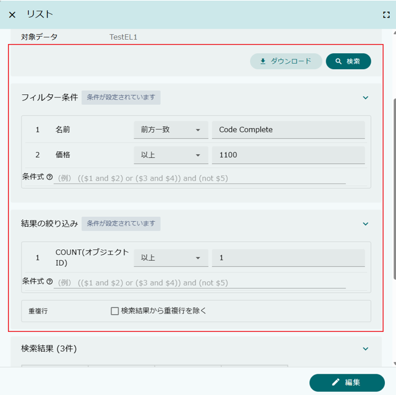

編集を許可しない場合 ::
+
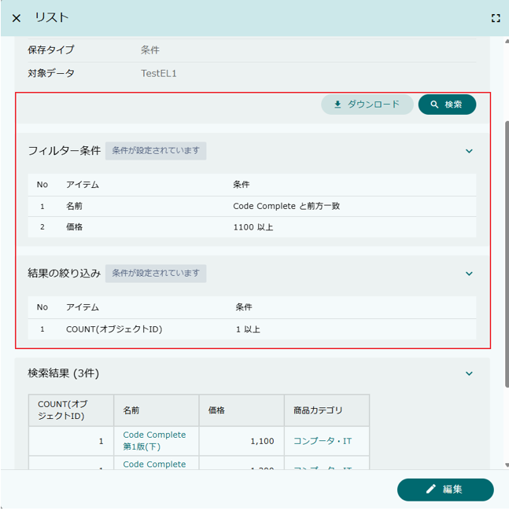

.リスト初期表示
保存リストを画面に表示する際に、同時に検索を実行するかを指定します。
対象のデータ件数が多い場合、または条件の指定を行ってから検索させたい場合など、リスト初期表示を「しない」に設定することで画面表示時に検索を行いません。

※ フォルダやデータの可視範囲について +
フォルダや保存データの他者への可視範囲については、エンティティ権限で制御します。
フォルダは `mtp.listing.SavedListFolder`、保存データは `mtp.listing.SavedList` エンティティに対して権限を設定します。

[[mdc_entitylisting_ope_result]]
==== 検索結果一覧

検索結果はテーブル形式で表示されます。

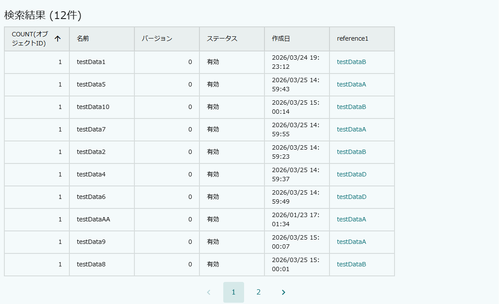

.ソート
検索結果一覧のヘッダー列をクリックすると、その列で昇順・降順のソートを切り替えることができます。

.ページング
検索結果の件数がページ表示件数を超えた場合にページングが表示されます。
ページ番号をクリックすると該当ページの検索結果が表示されます。
ページ表示件数は<<../../../serviceconfig/index.adoc#MdcConfigService, MdcConfigService>> の `entityListingSearchLimit` で変更可能です（デフォルト：10件）。

.エンティティ参照
`抽出項目` にオブジェクトID（`oid`）が含まれている場合、検索結果に参照リンクが表示されます。
リンクをクリックすることで、エンティティの参照画面がダイアログで表示されます。

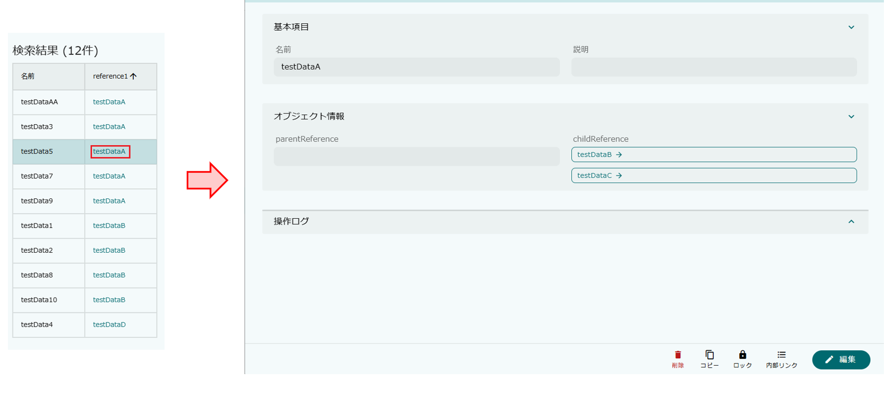

※ 対象エンティティの `OID` プロパティをカスタマイズしている場合、 `OID` プロパティが1つのみであれば、その項目に対してもリンクが表示されます。複数項目を利用して `OID` プロパティを指定している場合（複合指定）は、リンク表示されません。

※EntityListingメタデータを定義することで、 `name` プロパティに対してもリンクを表示することが可能です（<<mdc_entitylisting_entitycustomsetting, Entity Custom Setting>> の `show reference dialog from name property` を参照）。

※ EntityListingメタデータを定義することで、参照時のView指定や編集可能とするかの設定が可能です。デフォルトでは `default` Viewで `編集可` として動作します。

.ユーザープロパティの表示
エンティティの「作成者」、「更新者」、「ロックユーザー」などのユーザー関連プロパティは、EntityListingメタデータの設定により名前で表示することが可能です。
`handle inherited user property as name` を有効にすると、フィルター条件にはUserエンティティを選択して指定でき、検索結果やファイル出力には名前が出力されます（ソートはOIDで比較します）。

[[mdc_entitylisting_ope_download]]
==== ファイルダウンロード

検索条件エリアの `ダウンロード` ボタンをクリックすると、ファイルダウンロードダイアログが表示されます。

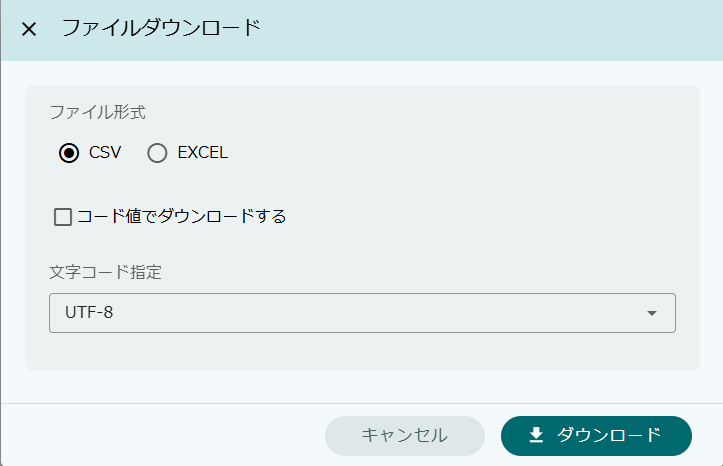

ダイアログでは以下のオプションが指定可能です。

[cols="1,5a", options="header"]
|===
|設定項目|説明

|ファイルタイプ
|EntityListingメタデータの `File type` が `SPECIFY` の場合に表示されます。
CSVまたはExcelのいずれかを選択します。
`SPECIFY` 以外の場合は、メタデータの設定に従い自動でファイルタイプが決定されます。 +
メタデータの `File type` が未指定の場合は、<<../../../serviceconfig/index.adoc#MdcConfigService, MdcConfigService>> の `entityListingFileSupportType` によって動作します。

|コード値でダウンロード
|チェックを入れると、Select型プロパティの値を表示名ではなくコード値で出力します。

|文字コード
|CSVファイルダウンロード時の文字コードを選択します。Excelファイルの場合はこの設定は無視されます。 +
選択可能な文字コードは<<../../../serviceconfig/index.adoc#MdcConfigService, MdcConfigService>> の `csvDownloadCharacterCode` で設定します。
|===

NOTE: ダウンロードボタンの表示はEntityListingメタデータの `can file download` で制御します。
