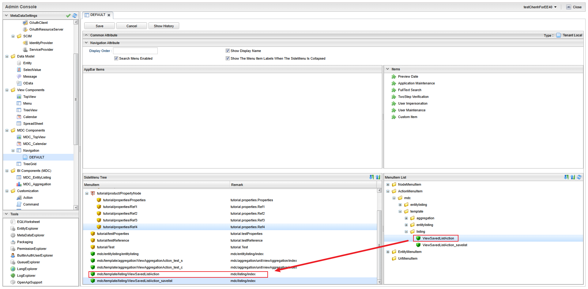

[[savedlist]]
== 保存リスト
保存リスト(SavedList)は、EntityListingや定型集計のローデータを保存、復元する機能です。
詳細については<<../topview/index.adoc#savedlist_parts,保存リスト>>を参照してください。

[[savedlist_viewsavedlist]]
=== 表示方法

==== メニューへの登録

保存リスト専用画面を表示したい場合は、保存リスト画面表示用のActionMenuItemをメニューに登録します。

標準動作を変更しない場合は、ActionMenuItemにあらかじめ登録されている `mdc/template/listing/ViewSavedListAction` という雛型のメニューアイテムをメニューに追加してください。

この設定によりメニューに `保存リスト` が追加され、保存リスト画面を起動することができます。

標準動作を変更したい場合、ActionMenuItemをコピーし、以下のパラメータを指定します。

[cols="1,3", options="header"]
|===
|Key
|設定値

|listingTitle
|画面タイトルをカスタマイズする場合に設定します。

|canCreateFolder
|フォルダを作成可能かを設定します（デフォルト：`true`） +
`true` の場合は `保存リスト` タブに `フォルダの作成` ボタンが表示されます。

|linkActionMode
|保存データのリンクをクリックした際の動作を指定します（デフォルト：`DIALOG`） +
`SCREEN_TRANSITION` を指定すると画面遷移モードになり、右クリックで別タブ表示などが行える状態になります。

|===

==== Top画面での表示
TopView 定義に SavedList パーツを配置することで、Top 画面に保存リスト一覧を表示できます。
詳細については<<../topview/index.adoc#savedlist,SavedList>>を参照してください。