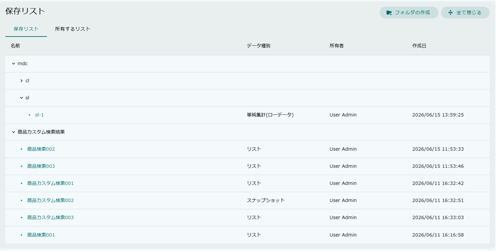
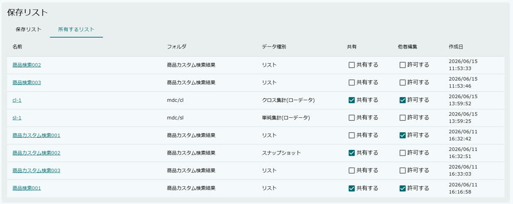
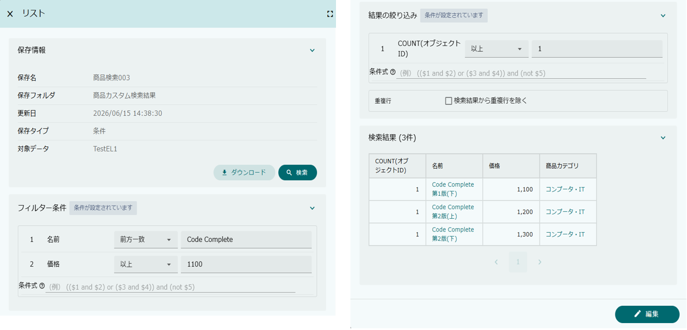
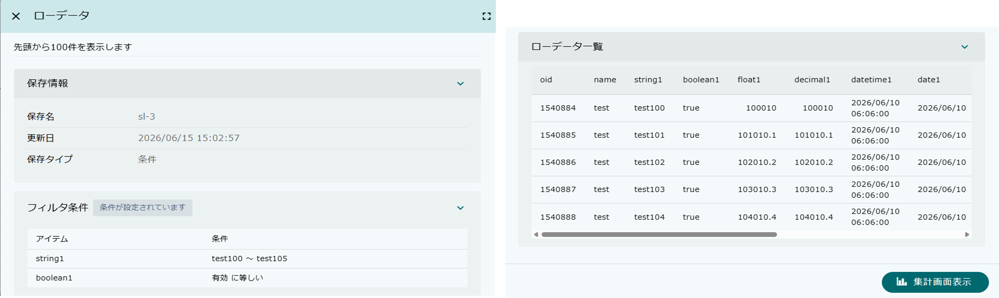

[[savedlist]]
== 保存リスト
保存リスト(SavedList)は、EntityListingや定型集計のローデータを保存、復元する機能です。

[[savedlist_view_screen]]
=== 保存リスト画面

保存リスト専用の画面で、フォルダツリー形式の `保存リスト` タブと、自分で保存したデータをフラット一覧で表示する `所有するリスト` タブの2つのタブで構成されています。

[[savedlist_savedlist_tab]]
==== 保存リストタブ

`保存リスト` タブでは、他のユーザーが保存・公開しているデータも含めて表示されます。
データはフォルダツリー形式で表示され、フォルダの展開・折りたたみが可能です。

[cols="1,4a", options="header"]
|===
|列
|説明

|名前
|フォルダ名または保存データ名が表示されます。 +
フォルダは展開アイコンをクリックして内容を表示できます。 +
保存データ名をクリックすると詳細画面が表示されます（<<savedlist_detail, 保存リスト詳細>>を参照）。

|データ種別
|保存されたデータの種別が表示されます。（例：リスト、単純集計、クロス集計、スナップショットなど）

|所有者
|保存データの作成者が表示されます。

|作成日
|保存データの作成日が表示されます。

|===

NOTE: フォルダや保存データの他者への可視範囲については、エンティティ権限で制御します。
フォルダは `mtp.listing.SavedListFolder`、保存データは `mtp.listing.SavedList` エンティティに対して権限を設定します。

.コンテキストメニュー
行を右クリックすることで、コンテキストメニューが表示されます。

[cols="1,4a", options="header"]
|===
|メニュー項目
|説明

|名前変更
|フォルダまたは保存データの名前を変更します。
更新権限がない場合は選択できません。

|移動
|フォルダまたは保存データを別のフォルダに移動します。
更新権限がない場合は選択できません。

|削除
|フォルダまたは保存データを削除します。
削除権限がない場合は選択できません。

|フォルダの作成
|フォルダ配下にサブフォルダを作成します。
フォルダ行にのみ表示されます。

|Download
|保存データのファイルダウンロードを実行します。
ダウンロード可能な保存データの場合にのみ表示されます。

|===

.ツールバーボタン
`保存リスト` タブが表示されている場合、画面上部に以下のボタンが表示されます。

[cols="1,4a", options="header"]
|===
|ボタン
|説明

|フォルダの作成
|ルート直下に新しいフォルダを作成します。

|全て閉じる
|展開中のフォルダをすべて閉じます。

|===

[[savedlist_ownerlist_tab]]
==== 所有するリストタブ

`所有するリスト` タブでは、自分で保存したデータがフラット一覧形式で表示されます。

[cols="1,4a", options="header"]
|===
|列
|説明

|名前
|保存データ名が表示されます。クリックすると詳細画面が表示されます。

|フォルダ
|保存データが格納されているフォルダのフルパスが表示されます。

|データ種別
|保存されたデータの種別が表示されます。（例：リスト、単純集計、クロス集計、スナップショットなど）

|共有
|保存リストを他のユーザーが参照できるかを設定します。 +
チェックをONにすると、他のユーザーの `保存リスト` タブにも表示されます。

|他者編集
|保存した保存リストをもとに、他のユーザーが編集画面を開けるかを設定します。 +
他者編集を許可しない場合は、保存リスト上でデータを参照することはできますが、編集画面への遷移はできません。

|作成日
|保存データの作成日が表示されます。

|===

.コンテキストメニュー
行を右クリックすることで、コンテキストメニューが表示されます。

[cols="1,4a", options="header"]
|===
|メニュー項目
|説明

|名前変更
|保存データの名前を変更します。

|移動
|保存データを別のフォルダに移動します。

|削除
|保存データを削除します。

|Download
|保存データのファイルダウンロードを実行します。
ダウンロード可能な場合にのみ表示されます。

|===

[[savedlist_detail]]
=== 保存リスト詳細

保存データ名をクリックすると、保存リストの詳細画面が表示されます。
保存データの種別（EntityListing / 集計）によって、表示内容が異なります。

[[savedlist_detail_entitylisting]]
==== EntityListingの詳細

詳細画面は以下の折りたたみセクションで構成されています。

.保存情報
保存データの基本情報が表示されます。

[cols="1,4a", options="header"]
|===
|項目
|説明

|保存名
|保存データの名前が表示されます。

|保存フォルダ
|保存データが格納されているフォルダのパスが表示されます。

|更新日
|保存データの最終更新日が表示されます。

|保存タイプ
|保存形式（条件保存 / スナップショット）が表示されます。

|対象データ
|検索対象のエンティティ名が表示されます。

|===

また、このセクションには以下のアクションボタンが表示されます。

[cols="1,4a", options="header"]
|===
|ボタン
|説明

|検索
|保存された条件で検索を実行します。 +
`リスト初期表示` が「しない」に設定されている場合、画面表示時には検索が実行されないため、このボタンで手動で検索を実行します。

|ダウンロード
|検索結果をファイルにダウンロードします。 +
ダウンロード権限がある場合にのみ表示されます。

|===

.フィルター条件
保存されたフィルター条件が表示されます。 +
条件が設定されている場合は「条件が設定されています」チップが表示されます。

条件の表示形式は保存タイプと条件編集の設定によって異なります。

編集可能（条件保存 かつ 条件編集が許可されている）::
フィルター条件の値を変更して絞り込み内容を調整することができます。

読み取り専用（スナップショット または 条件編集が許可されていない）::
フィルター条件が読み取り専用テーブル形式で表示されます。変更はできません。

.結果の絞り込み
保存された結果の絞り込み（HAVING）条件が表示されます。 +
フィルター条件と同様に、条件編集の設定によって編集可否が異なります。 +
重複除外（DISTINCT）の設定状態もこのセクション内に表示されます。

.検索結果
検索を実行した結果がテーブル形式で表示されます。 +
`リスト初期表示` が「しない」に設定されている場合、保存情報セクションの `検索` ボタンを押すまで結果は表示されません。

.下部ボタン
画面下部に `編集` ボタンが表示されます。クリックすると、保存された条件でEntityListing画面を編集モードで開くことができます。 +
以下のいずれかに該当する場合、`編集` ボタンは表示されません。

* スナップショットとして保存されている場合
* 他者編集が許可されていない場合

[[savedlist_detail_aggregation]]
==== 集計（Aggregation）の詳細

集計の保存リスト詳細ダイアログのタイトルは「ローデータ」と表示され、先頭100件のローデータが表示されます。

詳細画面は以下の折りたたみセクションで構成されています。

.保存情報
保存データの基本情報が表示されます。

[cols="1,4a", options="header"]
|===
|項目
|説明

|保存名
|保存データの名前が表示されます。

|更新日
|保存データの最終更新日が表示されます。

|保存タイプ
|保存形式（条件保存 / スナップショット）が表示されます。

|===

NOTE: 集計の詳細画面ではEntityListingと異なり、フォルダ・対象データ・アクションボタンは表示されません。

.フィルタ条件
保存されたフィルター条件が読み取り専用テーブル形式で表示されます。 +
集計の保存リスト詳細では、フィルター条件の編集は行えません。

.ローデータ一覧
保存されたローデータが先頭100件までテーブル形式で表示されます。

.下部ボタン
画面下部に `集計画面表示` ボタンが表示されます。クリックすると、保存されたデータで集計画面が開きます。

[[savedlist_viewsavedlist]]
=== 表示方法

==== メニューへの登録

保存リスト専用画面を表示したい場合は、保存リスト画面表示用のActionMenuItemをメニューに登録します。

標準動作を変更しない場合は、ActionMenuItemにあらかじめ登録されている `mdc/template/listing/ViewSavedListAction` という雛型のメニューアイテムをメニューに追加してください。

image::images/mdc_savedlist_menu.png[]

この設定によりメニューに `保存リスト` が追加され、保存リスト画面を起動することができます。

標準動作を変更したい場合、ActionMenuItemをコピーし、以下のパラメータを指定します。

[cols="1,3", options="header"]
|===
|Key
|設定値

|listingTitle
|画面タイトルをカスタマイズする場合に設定します。

|canCreateFolder
|フォルダを作成可能かを設定します（デフォルト：`true`） +
`true` の場合は `保存リスト` タブに `フォルダの作成` ボタンが表示されます。

|linkActionMode
|保存データのリンクをクリックした際の動作を指定します（デフォルト：`DIALOG`） +
`SCREEN_TRANSITION` を指定すると画面遷移モードになり、右クリックで別タブ表示などが行える状態になります。

|===
