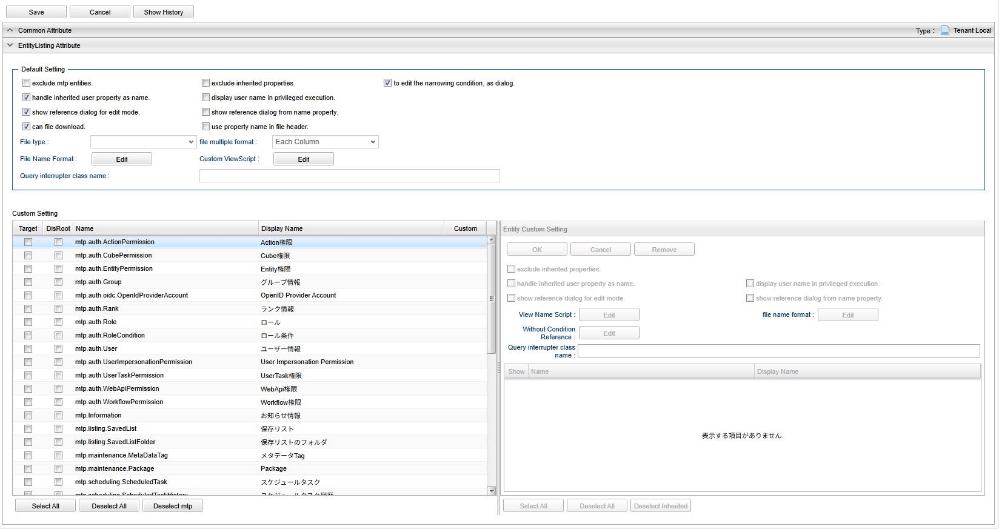
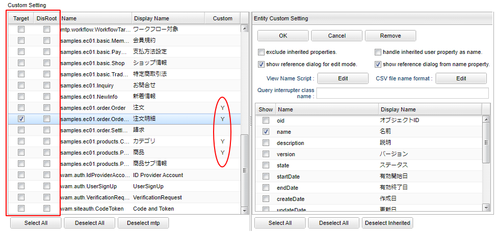

[[mdc_entitylisting_management]]
== EntityListingの管理

[[mdc_entitylisting_create]]
=== EntityListingの作成

EntityListingアイコンを右クリックして、「MDC EntityListingを作成する」を選択してください。

[[mdc_entitylisting_setting]]
=== 設定

メタデータを定義しなくてもEntityListing機能自体は実行することが可能です。 +
ただし、ユーザーによって利用可能なエンティティやプロパティを制御したい場合には、EntityListingメタデータを作成します。

EntityListingメタデータが1つでも登録されている場合は、メニューのパラメータに必ず `defName` を指定してください。

[[mdc_entitylisting_defaultsetting]]
==== Default Setting

ここでの設定は、下のCustom Settingを設定していないエンティティに対してデフォルトで適用される設定です。

[cols="1,5a", options="header"]
|===
|設定項目|設定値

|exclude mtp entities
|選択可能なエンティティから「mtp.*」を除外します。
下のCustom Settingでエンティティを1つでも選択している場合は、そちらが優先されます。

|exclude inherited properties
|選択可能なプロパティとして継承プロパティを除外します。
下のCustom Settingでエンティティ別にプロパティ設定をしている場合は、そちらが優先されます。
選択した場合、オブジェクトIDが選択可能なプロパティとして選択できなくなるため、エンティティの参照画面が開けなくなります。
（エンティティ定義でOIDプロパティを独自指定している場合は可能です）

|to edit the narrowing condition, as dialog
|抽出項目に集計関数がある場合に利用可能な絞り込み条件（HAVING条件）の指定方法を設定します。

ダイアログモードの場合::
絞り込みボタンが表示され、クリックで結果の絞り込みを行うダイアログを表示

直接編集モードの場合::
フィルター条件の下に絞り込み対象を指定する領域を表示

|handle inherited user property as name
|エンティティの「作成者」、「更新者」、「ロックユーザー」を名前で扱います。
フィルター条件に指定する場合は、Userエンティティを選択します。
検索結果、ファイルには名前が出力されます（ただしソートはOIDで比較します）。

|display user name in privileged execution
| `handle inherited user property as name` がチェックされている場合、ユーザー名を特権実行で取得します。
それによりユーザー情報のEntity、またはユーザー名のプロパティに参照権限が無いユーザーでもユーザー名を表示することが可能です。

|show reference dialog for edit mode
|エンティティの参照画面を開く際に編集可能モードで開くかを指定します。 +
下のCustom Settingでエンティティ別に設定をしている場合は、そちらが優先されます。

|show reference dialog from name property
|抽出項目として「name」プロパティを指定した際に、参照画面のリンクを表示するかを指定します。 +
下のCustom Settingでエンティティ別に設定をしている場合は、そちらが優先されます。

|can file download
|条件編集画面で「ダウンロード」ボタンを利用できるかを指定します。

|use property name in file header
|ファイルヘッダに表示名ではなくプロパティ名を出力します。

|File type
|ダウンロードで利用するファイル形式を指定します。

CSV::
CSVファイルを利用します。

EXCEL::
EXCELファイルを利用します。

SPECIFY::
CSVファイルかEXCELファイルのどちらを利用するかを画面で選択します。

未指定の場合は、<<mdc_entitylisting_service_config, MdcConfigService>> の `entityListingFileSupportType` によって動作します。

|file multiple format
|ファイルダウンロード時の多重度が複数のプロパティの出力形式を指定します。

Each Column::
多重度の数分別々の列に出力します。

One Column::
1つの列にカンマ区切りでまとめて出力します。

One Column Fill Null::
1つの列にカンマ区切りでまとめて出力します。
登録データが多重度分保存されていない場合にも多重度分空を補完します。

|File Name Format
|ファイルダウンロード時のファイル名をGroovyTemplate書式を利用して指定します。詳細は<<mdc_el_filenameformat,File Name Format>>を参照してください。

|Custom ViewScript
|EntityListing画面内に埋め込むカスタムコンテンツを設定できます。
`Template Interpret Type` の設定により、HTML、VUE_SFC、VUE_SFC_LIKE形式で定義できます。
詳細は<<mdc_el_customviewscript, Custom ViewScript>>を参照してください。

|Query interrupter class name
|実際に検索が実行される直前に、実行するEQLをカスタマイズするためのクラスを指定します。
詳細は<<mdc_entitylisting_queryinterceptor, Query Interceptor>>を参照してください。

|===

[[mdc_el_filenameformat]]
===== File Name Format

ファイルダウンロード時のファイル名をGroovyTemplate書式を利用して指定します。
フォーマットが指定されている場合、ボタンタイトルに「(*)」が表示されます。
また、/とスペースについては、_（アンダースコア）に変換します。

利用可能なバインド変数は、編集ダイアログの「Notes」を参照してください。

.（例）ファイル名の後ろに出力時の時間を付加する。
[source,groovy]
----
${csvName}_${yyyy}${MM}${dd}${HH}${mm}${ss}
----

[[mdc_el_customviewscript]]
===== Custom ViewScript

EntityListing画面内にカスタムコンテンツを埋め込むことが可能です。 +
HTMLやスクリプト、Vue.jsのSFC形式（単一ファイルコンポーネント形式）などでカスタムコンテンツを記述できます。 +
カスタムコンテンツは検索結果エリアの下部に表示されます。

Custom ViewScriptダイアログでは以下の設定を行います。

[cols="1,5a", options="header"]
|===
|設定項目|設定値

|Template Interpret Type
|記述されたスクリプトの解釈タイプです。以下の３つから選択できます。

HTML:: HTMLとして解釈します。HTMLやスクリプトの記述が可能です。
VUE_SFC:: Vue.jsのSFC形式（単一ファイルコンポーネント形式）で記述されたコンポーネントとして解釈します。
VUE_SFC_LIKE:: Vue.jsのランタイムを用いてコンポーネントとして解釈します。MDCでは、Vue.jsのランタイムに加えてコンパイラもバンドルしており、Vue.jsのテンプレート構文を利用することが可能です。

|ComponentName
|コンポーネント名を設定します。コンポーネント名は、英文字とハイフン(-)のみを利用したパスカルケースでの命名を推奨します。
`Template Interpret Type` が `VUE_SFC_LIKE` の場合、コンポーネント名の指定は必須です。 `Template Interpret Type` が `VUE_SFC` でコンポーネント名が未入力の場合、自動でランダムなコンポーネント名を割り当てます。

|Script
|スクリプト編集画面を表示してGroovyTemplateの文法に従って記述します。
詳細は<<../../customizing/index.adoc#groovytemplate, GroovyTemplate>>を参照してください。

|Precompile VUE_SFC format template
|Vue.jsのSFC形式のテンプレートをプリコンパイルするかを指定します。 `TemplateInterpretType` が `VUE_SFC` であり、Vue.jsのSFC形式のテンプレートを定義保存時にプリコンパイルしておきたい場合にチェックします。プリコンパイルしておくことで、コンポーネントの初期化処理を高速化できます。

[NOTE]
====
プリコンパイルの注意点::
- プリコンパイルを実行したい場合には、 `ComponentName` の指定が必須となります。
- `Script` に記述したGroovyTemplateは、EntityListing定義保存時に実行されてプリコンパイルされるため、リクエスト情報やセッション情報、ユーザー固有情報などを使用しないように注意してください。
====
|===

.VUE_SFC形式、VUE_SFC_LIKE形式の場合のコンポーネントとのデータ受け渡し（props/emit）

以下のデータがpropsとしてコンポーネントに引き渡されます。
====
contextMap:: コンテキストマップ。リアクティブな空のMapオブジェクト。 +
コンテキストマップにデータを格納することで、複数のパーツ（コンポーネント）間でリアクティブにデータを共有することが可能です。
====

[[mdc_entitylisting_queryinterceptor]]
=== Query Interceptor

パフォーマンス改善などの目的で、実際に検索を行う直前のEQLをカスタマイズすることが可能です。
以下のEntityListingQueryInterceptorを実装したJavaクラスまたはUtilityClassを指定します。

====
org.iplass.mtp.mdc.view.entitylisting.EntityListingQueryInterceptor
====

EntityListingの検索では、ページング制御のための件数取得と実際のデータ検索の2回EQLが実行されます。
EntityListingQueryInterceptorではこのEQL実行直前にカスタム処理を追加することができます。

.処理一覧
[cols="1,1,1,3a",options="header"]
|===
|メソッド
|引数
|戻り値
|処理内容

|beforeCount
|EntityListingQueryContext
|void
|件数取得前処理を行います。
contextのQueryを変更することで、件数取得条件をカスタマイズできます。

|beforeSearch
|EntityListingQueryContext
|void
|検索前処理を行います。
contextのQueryを変更することで、検索条件をカスタマイズできます。

.2+|afterSearch
|Object[]
.2+|void
.2+|検索後処理を行います。afterSearchでは1レコード毎に処理が呼ばれます。
dataを変更することで、検索結果をカスタマイズできます。
|EntityListingQueryContext
|===

.EntityListingQueryInterceptorの実装例
[source,java]
----
package sample.entitylisting;

import org.iplass.mtp.entity.query.Query;
import org.iplass.mtp.entity.query.hint.CacheHint;
import org.iplass.mtp.entity.query.hint.CacheHint.CacheScope;
import org.iplass.mtp.entity.query.hint.TimeoutHint;
import org.iplass.mtp.mdc.view.entitylisting.EntityListingQueryContext;

// 実装するIF定義
import org.iplass.mtp.mdc.view.entitylisting.EntityListingQueryInterceptor;

// サンプル用
import org.iplass.mtp.auth.User;

public class SampleQueryInterceptor implements EntityListingQueryInterceptor {

    // beforeCountとbeforeSearchで渡されるEntityListingQueryContextは同一インスタンスではありません

    @Override
    public void beforeCount(EntityListingQueryContext context) {

        // QueryContextからQueryを取得
        Query query = context.getQuery();

        // (例)Queryに対してCacheHintを指定
        query.hint(new CacheHint(CacheScope.GLOBAL, 60));

        System.out.println("interrupt result:" + query.toString());

        // (例)Entity権限における限定条件の除外設定
        setWithoutConditionReferenceName(context);
    }

    @Override
    public void beforeSearch(EntityListingQueryContext context) {

        // QueryContextからQueryを取得
        Query query = context.getQuery();

        // (例)Queryに対してCacheHint、TimeoutHintを指定
        query.hint(new CacheHint(CacheScope.GLOBAL, 60))
             .hint(new TimeoutHint(120));

        System.out.println("interrupt result:" + query.toString());

        // EntityListingQueryContextからはEntityListing定義名、エンティティ名も取得可能
        System.out.println("target entity listing definition name:"
                + context.getCondition().getDefinitionName());
        System.out.println("target entity definition name:"
                + context.getCondition().getEntityName());

        // (例)Entity権限における限定条件の除外設定
        setWithoutConditionReferenceName(context);
    }

    @Override
    public void afterSearch(Object[] data, EntityListingQueryContext context) {

        // (例)Userエンティティに対してメールアドレスを検索された場合、値を置き換える
        if (context.getCondition().getEntityName().equals(User.DEFINITION_NAME)) {
            // ここでdata配列の値を加工して検索結果をカスタマイズ
            // 例：特定のインデックスのデータをマスキング
        }
    }

    /**
     * Entity権限における限定条件の除外設定
     */
    private void setWithoutConditionReferenceName(EntityListingQueryContext context) {

        // EntityListingQueryContextに対してWithoutConditionReferenceNameとして
        // Entity権限における限定条件を除外するプロパティを指定することができる

        // EntityListingは対象Entityを選択可能なためデフォルト設定のInterceptorで処理する場合はEntity名をチェック
        // Entity別にInterceptorを定義している場合は特にチェック不要

        // 対象EntityがUserの場合
        if (context.getCondition().getEntityName().equals(User.DEFINITION_NAME)) {
            // groupsとrankのEntity権限における限定条件を除外
            context.setWithoutConditionReferenceName(User.GROUPS, User.RANK);
        }
    }

}
----

[[mdc_entitylisting_customsetting]]
==== Custom Setting

Default Settingではなく、エンティティ個別に設定を行いたい場合に指定します。

[cols="1,5a", options="header"]
|===
|設定項目|設定値

|Target
|参照可能なエンティティを選択します。対象外のエンティティを参照しようとした場合は権限エラーとなります。
1つも選択されていない場合は、Default Settingの `exclude mtp entities` 設定により対象を決定します。

|DisRoot
| `Target` 指定されたエンティティのうち、エンティティの選択リストから除外したいエンティティを選択します。
他エンティティの参照先としてのみ検索を許可する場合に指定します。

|Custom
|個別に `Entity Custom Setting` が設定されている場合に「Y」が表示されます。

|===

個別にプロパティなどを絞り込みたい場合は、対象のエンティティをダブルクリックしてください。
右側にエンティティごとの設定項目が表示されます。

グリッド下部のボタンで一括操作が行えます。

[cols="1,4a", options="header"]
|===
|ボタン|説明
|Select All|全エンティティを対象として選択します。
|Deselect All|全エンティティの選択を解除します。
|Deselect mtp|「mtp.*」エンティティの選択を解除します。
|===

[[mdc_entitylisting_entitycustomsetting]]
==== Entity Custom Setting

エンティティ個別の設定項目です。Custom Settingでエンティティをダブルクリックすることで表示されます。

[cols="1,5a", options="header"]
|===
|設定項目|設定値

|exclude inherited properties
|選択可能なプロパティとして継承プロパティを除外します。
下のプロパティ選択部分で1件でも選択されている場合は、そちらが優先されます。

|handle inherited user property as name
|エンティティの「作成者」、「更新者」、「ロックユーザー」を名前で扱います。

|display user name in privileged execution
| `handle inherited user property as name` がチェックされている場合、ユーザー名を特権実行で取得します。
それによりユーザー情報のEntity、またはユーザー名のプロパティに参照権限が無いユーザーでもユーザー名を表示することが可能です。

|show reference dialog for edit mode
|エンティティの参照画面を開く際に編集可能モードで開くかを指定します。

|show reference dialog from name property
|抽出項目として「name」プロパティを指定した際に、参照画面のリンクを表示するかを指定します。

|View Name
|エンティティの参照画面を開く際のView名をGroovyTemplate書式を利用して指定します。
詳細は<<mdc_el_viewname, View Nameの指定>>を参照してください。

|File Name Format
|ファイルダウンロード時のファイル名をGroovyTemplate書式を利用して指定します。
「Default Setting」と同様です。

|Without Condition Reference
|Entity権限における限定条件を適用せずに検索を実行する参照先プロパティ名を設定します。特権実行する場合、または `Query interrupter class name` の設定がある場合はそちらが優先されます。

|Query interrupter class name
|実際に検索が実行される直前に、実行するEQLをカスタマイズするためのクラスを指定します。
未指定の場合は「Default Setting」の設定が有効になります。
詳細は<<mdc_entitylisting_queryinterceptor, Query Interceptor>>を参照してください。

|Propertyリスト
|選択可能としたいプロパティをチェックしてください。

|===

[[mdc_el_viewname]]
===== View Nameの指定

エンティティの参照画面を開く際のView名をGroovyTemplate書式を利用して指定します。
値が設定されている場合、ボタンタイトルに「(*)」が表示されます。

利用可能なバインド変数は、編集ダイアログの「Notes」を参照してください。

.（例）文字列直接指定
[source,groovy]
----
opeView
----

.（例）GroovyTemplate指定
[source,groovy]
----
<%@import org.iplass.mtp.entity.Entity %>

<%
def viewName = "XXXXXXXXX";
%>

${viewName}
----

検索結果のリンク表示時には、表示対象データのOIDが「oid」としてバインドされています。
フィルター条件としてReferenceを指定した場合の参照時はOIDはバインドされません。

[[mdc_entitylisting_display]]
=== 表示方法

==== メニューへの登録

MDC EntityListing画面を表示するには、メニューにActionMenuItemを登録します。

ActionMenuItemに以下の設定を行ってください。

[cols="1,5a", options="header"]
|===
|項目|設定値

|Name|管理しやすいように設定してください。
|DisplayName|メニューの表示名になります。
|Execute Action| `mdc/entitylisting/view` を指定してください。
|Parameter| `defName=XXX&entityName=XXX`

defName:: 作成したEntityListingメタデータ名を指定します。
entityName:: 初期表示時に選択したいエンティティ名を指定します。defNameには表示可能なエンティティを指定する必要があります。

|===

NOTE: EntityListingメタデータが1つでも登録されている場合は、パラメータに `defName` を指定する必要があります。

=== EntityListing関連のサービス設定
[[mdc_entitylisting_service_config]]
==== MdcConfigService

MdcConfigServiceのEntityListing関連の設定一覧です。

[cols="1,1,4a", options="header"]
|===
|設定項目|デフォルト値|説明

|entityListingSearchLimit
|10
|EntityListingの検索結果のページ表示件数。
1ページあたりに表示するデータ件数を指定します。

|entityListingFileSupportType
|CSV
|EntityListingのデフォルトのサポートファイルタイプ。
EntityListingメタデータの `File type` が未指定の場合に適用されます。 +
設定値: `CSV` , `EXCEL` , `SPECIFY`

|entitylistingFileDownloadWithFooter
|false
|EntityListingのファイルダウンロードでフッターを出力するかを指定します。

|entitylistingFileDownloadFooter
|（空文字）
|EntityListingのファイルダウンロードで出力するフッター文言を指定します。
`entitylistingFileDownloadWithFooter` が `true` の場合に有効です。

|formatNumberWithComma
|true
|数値プロパティの値をカンマでフォーマット表示するかを指定します。
EntityListingの検索結果およびファイルダウンロードで数値のカンマ区切り表示に影響します。 +
抽出項目の「数値フォーマット設定」が未指定の場合にこの設定が適用されます。

|csvDownloadCharacterCode
|UTF-8
|CSVファイルダウンロード時に選択可能な文字コードの一覧を指定します。
複数指定（additional="true"）することで、ダウンロードダイアログに複数の文字コードが表示されます。

|===

[[mdc_entitylisting_property_service_config]]
==== PropertyService

LongText型プロパティをフィルター条件として利用する場合は、 `PropertyService` の `remainInlineText` を `true` に設定する必要があります。 +
`remainInlineText` が `false` （デフォルト）の場合、LongText型プロパティはフィルター条件の対象外となります。

設定内容の詳細は、link:../../serviceconfig/index.html#PropertyService[PropertyService]を参照してください。

.mtp-service-config.xmlでの設定例
[source,xml]
----
<service>
    <interface>org.iplass.mtp.impl.entity.property.PropertyService</interface>
    <property name="remainInlineText" value="true" />
</service>
----

[[mdc_entitylisting_relativerange]]
=== カスタム相対範囲

フィルター条件の日付相対範囲（RD）や日時相対範囲（RDT）で使用するカスタム相対範囲を定義できます。
カスタム相対範囲はmdc-service-config.xmlの `MdcRelativeRangeService` で設定します。

.mdc-service-config.xmlでの設定例
[source,xml]
----
<service>
    <interface>org.iplass.mtp.mdc.view.entitylisting.range.MdcRelativeRangeService</interface>
    <class>org.iplass.mtp.mdc.view.entitylisting.range.MdcRelativeRangeService</class>
    <property name="relativeRanges"
              class="org.iplass.mtp.mdc.view.entitylisting.range.MdcRelativeRange">
        <property name="relativeRangeName" value="sampleRelativeRange" />
        <property name="displayLabel" value="サンプル相対範囲" />
        <property name="localizedDisplayLabel"
                  class="org.iplass.mtp.mdc.view.entitylisting.range.MdcRelativeRangeLocalizedLabel">
            <property name="locale" value="ja" />
            <property name="displayLabel" value="サンプル相対範囲" />
        </property>
        <property name="localizedDisplayLabel"
                  class="org.iplass.mtp.mdc.view.entitylisting.range.MdcRelativeRangeLocalizedLabel">
            <property name="locale" value="en" />
            <property name="displayLabel" value="Sample Relative Range" />
        </property>
        <property name="converter"
                  class="[org.iplass.mtp.mdc.view.entitylisting.range.MdcRelativeRangeConverter]" />
    </property>
</service>
----

[cols="1,5a", options="header"]
|===
|設定項目|設定値

|relativeRangeName
|カスタム相対範囲の識別名。フィルター条件の内部パラメータとして使用されます。

|displayLabel
|画面に表示するデフォルトの表示ラベル。

|localizedDisplayLabel
|ロケールごとの表示ラベルを設定します。 `locale` と `displayLabel` のペアで定義します。

|converter
| `MdcRelativeRangeConverter` インターフェースを実装したクラスを指定します。
フィルター条件に選択された相対範囲名から、実際の日付範囲（From/To）に変換するロジックを実装します。
|===

`MdcRelativeRangeConverter` は以下のメソッドを実装する必要があります。

[cols="1,5a", options="header"]
|===
|メソッド|説明

|`Condition createCondition(String propertyName, Date sysDate)`
|フィルター条件に変換します。 +
`propertyName` はフィルター対象のプロパティ名、 `sysDate` はシステム日付（ `java.sql.Date` ）です。 +
返却値は `org.iplass.mtp.entity.query.condition.Condition` のサブクラスを返します。
|===

.MdcRelativeRangeConverterの実装例（今月範囲）
[source,java]
----
package com.example;

import java.sql.Date;
import java.time.LocalDate;

import org.iplass.mtp.entity.query.condition.Condition;
import org.iplass.mtp.entity.query.condition.predicate.Between;
import org.iplass.mtp.mdc.view.entitylisting.range.MdcRelativeRangeConverter;

/**
 * 今月の日付範囲を返すカスタム相対範囲コンバーター。
 */
public class ThisMonthRangeConverter implements MdcRelativeRangeConverter {

    @Override
    public Condition createCondition(String propertyName, Date sysDate) {
        LocalDate local = sysDate.toLocalDate();

        // 月初日
        Date from = Date.valueOf(local.withDayOfMonth(1));

        // 月末日
        Date to = Date.valueOf(local.withDayOfMonth(local.lengthOfMonth()));

        return new Between(propertyName, from, to);
    }
}
----

上記の実装クラスは、mdc-service-config.xmlの `converter` プロパティに指定します。

[source,xml]
----
<property name="converter" class="com.example.ThisMonthRangeConverter" />
----

