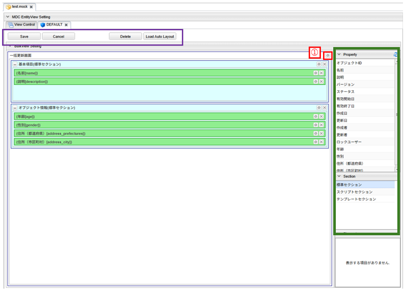

[[bulklayout]]
== 一括更新画面
一括更新画面のレイアウトをカスタマイズできます。
レイアウト設定を行わない場合、画面には基本項目及び、エンティティに登録されたプロパティが
エンティティ定義上での定義順で表示されます。

[[open_bulklayout]]
=== BulkLayoutの表示
ViewControlタブのViewControlSetting一覧の「BulkView Layout」から、追加もしくは編集のアイコンを押下すると、該当のView名 のBulkLayoutのタブが表示されます。

[[bulklayout_structure]]
=== BulkLayoutの構成
BulkLayoutは以下の構成になっています。

==== ツールバー
紫枠の部分はBulkLayoutの各Viewに対する操作を行うためのボタン群です。

[cols="1,4a", options="header"]
|===
|ボタン名
|説明

|Save
|カスタマイズしたViewをViewControlにセットします。この段階ではまだ定義は保存されません。ViewControlタブの先頭に `U` が表示されます(Update)。ViewControlタブで対象のViewを保存することでView定義が保存されます。

|Cancel
|Viewの変更を取り消します。
Saveボタン押下前の内容が消えるため、ボタンを押す際は確認してください。

|Delete
|表示しているViewをViewControlから削除します。BulkLayoutのタブは削除され、ViewControlタブの「Defined」がOFFの状態になり、先頭に `U` が表示されます(Update)。ViewControlタブで対象のViewを保存することでView定義から削除されます。

|Load Auto Layout
|View定義を設定しない場合に表示される自動生成画面と同等の設定をロードします。

|===

[[bulklayout_drop_area]]
==== 配置エリア
緑枠の部分は各種要素を配置する領域です。
画面右側の `Property` 、 `Section`  内の部品をドラッグ&ドロップで配置できます。
BulkLayoutが作成されてない状態だと、一括更新画面表示時にはエンティティのプロパティが自動で配置されます。
配置エリアに直接配置できるのは `Section` のみとなります。
`Property`　については、配置エリアに置かれた `標準セクション` に対してのみとなります。

[[bulkview_setting]]
=== 一括更新画面の設定
図の①部分をクリックすると一括更新画面全体に対する設定を行うダイアログが表示されます。

[cols="1,4a", options="header"]
|===
|設定項目
|設定内容

|画面タイトル
|画面に表示するタイトルを入力します。
未入力の場合、エンティティの `Display Name` に設定された内容を画面に表示します。

|アイコンタグ
|タイトルの前に表示するアイコンを設定できます。 +
link:https://materialdesignicons.com/[Material Design Icons^]のアイコンタグを設定できます。（例：mdi-note）

|標準ボタン設定
|編集ボタンや保存ボタンなど、標準で提供されるボタンの設定をカスタマイズします。
詳細は<<bulkview_base_button_setting, 標準ボタン設定>>を参照してください。

|画面上部のカスタムボタン
|タイトル領域の下に表示する独自のボタンを設定します。
詳細は<<bulkview_custom_button_setting, カスタムボタン設定>>を参照してください。

|画面下部のカスタムボタン
|フッター領域に表示する独自のボタンを設定します。
詳細は<<bulkview_custom_button_setting, カスタムボタン設定>>を参照してください。

|データの多言語化
|データ操作時に多言語化するかを設定します。
有効にした場合、エンティティ定義の `Data Localization` 設定を有効にしてデータアクセスします。

|更新時に強制的に更新処理を行う
|チェックした場合、更新項目が１つもない場合にも強制的に更新を行います。
更新日、更新者が更新されます。

|物理削除
|チェックした場合、削除時にエンティティデータを物理削除します。
未チェックの場合、削除データはごみ箱に移動します。

WARNING: バージョン指定削除の場合は、設定に関係なく物理削除されます。

|親子関係の参照を物理削除
|チェックした場合、保存時に参照を解除された親子関係のエンティティデータを物理削除します。

|カスタムロード処理クラス名
|エンティティのロード時にオプション等のカスタマイズを行いたい場合は `BulkViewLoadEntityInterceptor`
インターフェースを実装するクラスを指定してください。
詳細は<<MdcCustomize_BulkViewLoad, カスタムロード(複数項目)処理>>を参照してください。

|カスタム保存処理クラス名
|登録・更新時にカスタマイズ処理を行いたい場合は `BulkViewInterceptor`
インターフェースを実装するクラスを指定してください。
詳細は<<MdcCustomize_BulkViewUpdate, カスタム保存(複数項目)処理>>を参照してください。

|一括更新WebAPI名
|保存ボタンクリックで実行されるWebApiを設定します。

|条件更新WebAPI名
|削除ボタンクリックで実行されるWebApiを設定します。

|===

[[bulkview_base_button_setting]]
==== 標準ボタン設定
一括更新ボタンなど、標準で提供されるボタンの設定をカスタマイズします。

[cols="1,4a", options="header"]
|===
|設定項目
|設定内容

|表示
|未チェックの場合、ボタンを表示しません。

|表示判定スクリプト
|表示可否を実行時に動的に判定するGroovyScriptを設定します。
詳細は<<bulkview_judge_display_script, 表示判定スクリプト>>を参照してください。

|表示ラベル
|ボタンに表示するラベルを設定します。

|アイコンタグ
|タイトルの前に表示するアイコンを設定できます。 +
link:https://materialdesignicons.com/[Material Design Icons^]のアイコンタグを設定できます。（例：mdi-note）

|CSSクラス名
|スタイルシートのクラス名を指定します。
複数指定する場合は半角スペースで区切ってください。

|ツールチップ
|ツールチップを指定します。

|カスタムクリックイベント
|ボタンクリック時に実行されるカスタムJavaScriptコードを設定します。

|===

.カスタムクリックイベントの変数
カスタムクリックイベントとして実行するJavaScriptには、以下の変数がバインドされます。
====
defaultHandler:: デフォルトのイベントハンドラー関数
event:: DOMネイティブイベント
entity:: 処理対象のエンティティデータ
bulkViewDefinition:: BulkView定義
====

.（例）
[source,javascript]
----
//確認メッセージを表示後に標準の処理を実行する

const { $confirm } = Mdc.useConfirm();

$confirm({
  title: '確認タイトル',
  message: '確認メッセージです',
  okText: '確認'
}).then(ok => {
  if (ok) {
    console.log('「確認」がクリックされました');

    // 標準の処理を実行
    defaultHandler.call();
  } else {
    console.log('「キャンセル」がクリックされました');
  }
});
----

[[bulkview_custom_button_setting]]
==== カスタムボタン設定
画面内に表示するカスタムボタンの設定を行います。

[cols="1,4a", options="header"]
|===
|設定項目
|設定内容

|表示
|チェックした場合、ボタンを表示します。

|表示判定スクリプト
|表示可否を実行時に動的に判定するGroovyScriptを設定します。
詳細は<<bulkview_judge_display_script, 表示判定スクリプト>>を参照してください。

|表示ラベル
|ボタンに表示するラベルを設定します。

|表示方法
|ボタンの表示方法を設定します。

SOLO:: 単一ボタンとして表示
MENU:: メニューから選択するボタンとして表示

|列情報
|ボタンの表示領域を設定します。
詳細は<<bulkview_column_info, 列情報>>を参照してください。

|CSSクラス名
|スタイルシートのクラス名を指定します。
複数指定する場合は半角スペースで区切ってください。

|アイコンタグ
|タイトルの前に表示するアイコンを設定できます。 +
link:https://materialdesignicons.com/[Material Design Icons^]のアイコンタグを設定できます。（例：mdi-note）

|プライマリ
|設定するとボタンを強調表示します。

|クリックイベント
|ボタンクリック時に実行されるJavascriptコードを設定します。

|===

.クリックイベントの変数
クリックイベントとして実行するJavaScriptには、以下の変数がバインドされます。
====
entity:: 処理対象のエンティティデータ
bulkViewDefinition:: BulkView定義
====

[[bulkview_judge_display_script]]
==== 表示判定スクリプト
表示可否を判定するGroovyScriptを設定します。
スクリプトが未指定か、スクリプトの実行結果がtrueの場合、表示されます。

[[bulkview_column_info]]
==== 列情報
MDCはコンテンツのレイアウト設定として全体を12ポイントとするグリッドシステムを利用します。
画面サイズに対するブレークポイントに対して、コンテンツを表示するサイズ（列数）を設定します。 +
列数に0が設定された場合は画面に表示されません。 +
各ブレークポイントは、<<../../../serviceconfig/index.adoc#MdcConfigService, MdcConfigService>>で設定可能です。

[cols="1,4a", options="header"]
|===
|設定項目
|設定内容

|Extra Smallサイズの列数
|画面サイズが600px以下の場合の列数の設定します。（設定範囲は0~12）

|Smallサイズの列数
|画面サイズが600px以上 960px以下の場合の列数の設定します。（設定範囲は0~12）

|Mediumサイズの列数
|画面サイズが960px以上 1264px以下の場合の列数の設定します。（設定範囲は0~12）

|Largeサイズの列数
|画面サイズが1264px以上 1904px以下の場合の列数の設定します。（設定範囲は0~12）

|Extra Largeサイズの列数
|画面サイズが1904px以上の場合の列数の設定します。（設定範囲は0~12）

|===

[[bulklayout_setting]]
=== 一括更新画面のレイアウト設定

[[bulklayout_section_setting]]
==== セクションの設定
画面右側のSectionの項目を画面中央の `詳細画面部分` にドラッグ&ドロップすることでセクションを配置できます。
Propertyは `標準セクション` にのみ配置可能です。

[[bulklayout_section_common_setting]]
===== 共通設定項目
各セクションで共通の設定項目です。
セクションもエレメントの一種のため、 <<bulklayout_element_common_setting, エレメントの共通設定項目>>を持ちます。

セクション特有の設定項目は以下です。

[cols="1,4a", options="header"]
|===
|設定項目
|設定内容

|初期表示時に展開
|チェックした場合、セクションを初期展開します。

|折りたたみを許可
|チェックした場合、セクションを折りたたむことができます。

|ジャンプリンクを表示
|チェックした場合、フッタのリンクボタン上にセクションに移動するためのリンクを表示します。

|===

[[bulklayout_default_section]]
===== 標準セクション
エンティティのプロパティをグループ化したり、並び順を指定するなど、レイアウトを設定します。

設定項目は、<<bulklayout_section_common_setting, 共通設定項目>>のみです。

[[bulklayout_script_section]]
===== スクリプトセクション
GroovyTemplateで記述されたテンプレートを画面に組み込みます。
HTMLやスクリプト、Vue.jsのSFC形式（単一ファイルコンポーネント形式）などでテンプレートを記述できます。 +
テンプレートの実装方法の詳細については、link:../../../storybook/index.html?path=/docs/開発者ドキュメント-オリジナルテンプレート[コンポーネントカタログ^]を参照してください。

[cols="1,4a", options="header"]
|===
|設定項目
|設定内容

|開閉可能な枠を表示
|チェックした場合、標準セクション同様に枠を表示します。未チェックの場合はコンテンツのみ出力します。

|テンプレート文字列の解釈タイプ
|記述されたテンプレート文字列の解釈タイプです。以下の３つから選択できます。

HTML:: HTMLとして解釈します。HTMLやスクリプトの記述が可能です。
VUE_SFC:: Vue.jsのSFC形式（単一ファイルコンポーネント形式）で記述されたコンポーネントとして解釈します。
VUE_SFC_LIKE:: Vue.jsのランタイムを用いてコンポーネントとして解釈します。MDCでは、Vue.jsのランタイムに加えてコンパイラもバンドルしており、Vue.jsのテンプレート構文を利用することが可能です。

|コンポーネント名
|コンポーネント名を設定します。 コンポーネント名は、英文字とハイフン(-)のみを利用したパスカルケースでの命名を推奨します。
テンプレート文字列の解釈タイプが `VUE_SFC_LIKE` の場合、コンポーネント名の指定は必須です。 テンプレート文字列の解釈タイプが `VUE_SFC` でコンポーネント名が未入力の場合、自動でランダムなコンポーネント名を割り当てます。

|スクリプト
|スクリプト編集画面を表示してGroovyTemplateの文法に従って記述します。
詳細は<<../../customizing/index.adoc#groovytemplate, GroovyTemplate>>を参照してください。

.独自のバインド変数
request変数には以下の変数がバインドされています。
====
request.componentName:: 指定したコンポーネント名(VUE_SFC_LIKEの場合)
request.entityDefinition:: エンティティ定義
request.element:: スクリプトセクション定義
====

|VUE_SFC形式のテンプレートをプリコンパイルするか
|Vue.jsのSFC形式のテンプレートをプリコンパイルするかを指定します。`テンプレート文字列の解釈タイプ` が `VUE_SFC` であり、Vue.jsのSFC形式のテンプレートを定義保存時にプリコンパイルしておきたい場合にチェックします。プリコンパイルしておくことで、コンポーネントの初期化処理を高速化できます。

[NOTE]
====
プリコンパイルの注意点::
- プリコンパイルを実行したい場合には、 `コンポーネント名` の指定が必須となります。
- `スクリプト` に記述したGroovyTemplateは、BulkView定義保存時に実行されてプリコンパイルされるため、リクエスト情報やセッション情報、ユーザー固有情報などを使用しないように注意してください。
====
|===

.VUE_SFC形式、VUE_SFC_LIKE形式の場合のコンポーネントとのデータ受け渡し（props/emit）

以下のデータがpropsとしてコンポーネントに引き渡されます。
====
contextMap:: コンテキストマップ。リアクティブなMapオブジェクト。次のデータが格納されています。
- entity : 処理対象のエンティティデータ
- bulkViewDefinition : BulkView定義
====

[[bulklayout_template_section]]
===== テンプレートセクション
別途定義したテンプレートを画面に組み込みます。 +
テンプレートの実装方法の詳細については、link:../../../storybook/index.html?path=/docs/開発者ドキュメント-オリジナルテンプレート[コンポーネントカタログ^]を参照してください。

[cols="1,4a", options="header"]
|===
|設定項目
|設定内容

|開閉可能な枠を表示
|チェックした場合、標準セクション同様に枠を表示します。未チェックの場合はコンテンツのみ出力します。

|テンプレート文字列の解釈タイプ
|記述されたテンプレート文字列の解釈タイプです。以下の３つから選択できます。

HTML:: HTMLとして解釈します。HTMLやスクリプトの記述が可能です。
VUE_SFC:: Vue.jsのSFC形式（単一ファイルコンポーネント形式）で記述されたコンポーネントとして解釈します。
VUE_SFC_LIKE:: Vue.jsのランタイムを用いてコンポーネントとして解釈します。MDCでは、Vue.jsのランタイムに加えてコンパイラもバンドルしており、Vue.jsのテンプレート構文を利用することが可能です。

|コンポーネント名
|コンポーネント名を設定します。 コンポーネント名は、英文字とハイフン(-)のみを利用したパスカルケースでの命名を推奨します。
テンプレート文字列の解釈タイプが `VUE_SFC_LIKE` の場合、コンポーネント名の指定は必須です。 テンプレート文字列の解釈タイプが `VUE_SFC` でコンポーネント名が未入力の場合、自動でランダムなコンポーネント名を割り当てます。

|テンプレート名
|登録済テンプレート名を設定します。

.独自のバインド変数
request変数には以下の変数がバインドされています。
====
request.componentName:: 指定したコンポーネント名(VUE_SFC_LIKEの場合)
request.entityDefinition:: エンティティ定義
request.element:: スクリプトセクション定義
====

|VUE_SFC形式のテンプレートをプリコンパイルするか
|Vue.jsのSFC形式のテンプレートをプリコンパイルするかを指定します。`テンプレート文字列の解釈タイプ` が `VUE_SFC` であり、Vue.jsのSFC形式のテンプレートを定義保存時にプリコンパイルしておきたい場合にチェックします。プリコンパイルしておくことで、コンポーネントの初期化処理を高速化できます。

[NOTE]
====
プリコンパイルの注意点::
- プリコンパイルを実行したい場合には、 `コンポーネント名` の指定が必須となります。
- `テンプレート名` で指定した登録済みのテンプレートは、BulkView定義保存時に実行されてプリコンパイルされるため、テンプレートの内容が変更された場合は再度BulkView定義を保存する必要があります。また、JSPやGroovyTemplateなどで記述されたテンプレートには、リクエスト情報やセッション情報、ユーザー固有情報などを使用しないように注意してください。
====
|===

.VUE_SFC形式、VUE_SFC_LIKE形式の場合のコンポーネントとのデータ受け渡し（props/emit）

以下のデータがpropsとしてコンポーネントに引き渡されます。
====
contextMap:: コンテキストマップ。リアクティブなMapオブジェクト。次のデータが格納されています。
- entity : 処理対象のエンティティデータ
- bulkViewDefinition : BulkView定義
====

==== エレメントの設定
入力項目以外の画面要素を `標準セクション` 内にドラッグ&ドロップすることで、画面に配置できます。

[[bulklayout_element_common_setting]]
===== 共通設定項目
各エレメントで共通の設定項目です。

[cols="1,4a", options="header"]
|===
|設定項目
|設定内容

|表示
|チェックした場合、ボタンを表示します。

|表示判定スクリプト
|表示可否を実行時に動的に判定するGroovyScriptを設定します。
詳細は<<bulkview_judge_display_script, 表示判定スクリプト>>を参照してください。

|表示ラベル
|画面に表示するラベルを設定します。

|列情報
|ボタンの表示領域を設定します。
詳細は<<bulkview_column_info, 列情報>>を参照してください。

|CSSクラス名
|スタイルシートのクラス名を指定します。
複数指定する場合は半角スペースで区切ってください。

|===

==== プロパティの設定
Property項目については、 `標準セクション` にドラッグ&ドロップすることで配置できます。

プロパティもエレメントの一種のため、 <<bulklayout_element_common_setting, エレメントの共通設定項目>>を持ちます。

[cols="1,4a", options="header"]
|===
|設定項目
|設定内容

|ヒント
|入力欄下部に表示する説明を設定します。

|必須マークを表示
|編集画面で必須マークを表示するかを設定します。

DEFAULT:: エンティティのプロパティ定義 `Required` に従い自動的に表示します。
DISPLAY:: 必須マークを表示します。
NONE:: 必須マークを表示しません。

|プロパティエディタ
|対象のプロパティの型に合わせたエディタを選択します。
詳細は<<bulklayout_property_editor, プロパティエディタ>>を参照してください。
型は基本的に変更しないで下さい。
ただし `TemplatePropertyEditor` についてはカスタマイズ用なので変更しても問題ありません。

|===

[[bulklayout_property_editor]]
=== プロパティエディタ
プロパティエディタは各プロパティの入力表示設定になります。
一括更新画面に配置した各プロパティの表示設定を変更をすることができます。
基本的にはプロパティの型に対応する型を選択してください。

[[bulklayout_property_editor_common_setting]]
==== 共通設定項目
プロパティエディタで共通の設定項目です。

[cols="1,4a", options="header"]
|===
|設定項目
|設定内容

|カスタムスタイル
|各プロパティのinput要素に対して、直接style属性を指定することが可能です（TemplatePropertyEditorでは指定不可）。
例えば入力用のinputの幅を調整したい場合などに利用します。
詳細は<<bulklayout_custom_style, カスタムスタイル>>を参照してください。

|===

[[bulklayout_custom_style]]
===== カスタムスタイル
<<../../customizing/index.adoc#groovytemplate, GroovyTemplate>>書式で設定します。

.独自のバインド変数
独自に以下の変数がバインドされています。
====
value:: 処理対象のプロパティデータ
====

.設定例
[source,groovy]
----
<% //入力テキストの幅を100pxに、背景色を赤に変更
%>
background-color:#FFCCCC; width:100px;
----

Editorの表示タイプが選択可能な場合、タイプによって適用されるinputが異なります。
====
TEXT:: `.mdc-input-field` に対して指定したスタイルを適用します。
TEXTAREA、RICHTEXT:: `.mdc-textarea-field` に対して指定したスタイルを適用します。
SELECT:: `.mdc-select-field` に対して指定したスタイルを適用します。
RADIO:: radioを囲む `.mdc-radio-group` に対して指定したスタイルを適用します。
CHECKBOX:: checkboxを囲む `.mdc-checkbox-group` に対して指定したスタイルを適用します。
SWITCH:: switchを囲む `.mdc-switch-group` に対して指定したスタイルを適用します。
====

[[bulklayout_binary_property_editor]]
==== BinaryPropertyEditor
Binary型用のプロパティエディタです。

[cols="1,1,6a", options="header"]
|===
|設定項目
|表示タイプ
|設定内容

|表示タイプ
| -
|画面に表示する方法を設定します。

LINK:: ファイルのダウンロードリンクを表示

|許可するファイル型
|LINK
|アップロードで許可するファイル型を設定します。inputの `accept` 属性に設定されます。さらに、アップロードファイルのファイル型をサーバーでもチェックします。 +
設定が無い場合のサーバーのチェックについては、Service-Config の MdcConfigService binaryUploadAcceptMimeTypesPattern の設定が利用されます。Service-Config の詳細は link:../../../serviceconfig/index.html#MdcConfigService[こちら] を参照ください。 +
本設定と Service-Config の両方が設定されていた場合は、本設定が優先されます。

検証対象となる MIME Type の決定方法については、link:../../../serviceconfig/index.html#WebFrontendService[WebFrontendService uploadFileTypeDetector], link:../../../serviceconfig/index.html#FileTypeDetector[FileTypeDetector] を参照してください。

|ファイル選択ボタン非表示
|LINK

|ファイル選択ボタンを非表示にします。これでアップロード権限制御なとに利用してください。

|削除ボタン非表示
|LINK

|バイナリファイルデータを削除するボタンを非表示にします。これで削除権限制御なとに利用してください。

|アップロードWebApi
|LINK
|アップロード時に実行されるWebApiを設定します。

|ダウンロードアクション
|LINK
|ダウンロード時に実行されるアクションを設定します。

|===

[[bulklayout_boolean_property_editor]]
==== BooleanPropertyEditor
Boolean型用のプロパティエディタです。

[cols="1,1,6a", options="header"]
|===
|設定項目
|表示タイプ
|設定内容

|表示タイプ
| -
|画面に表示する方法を設定します。

RADIO:: ラジオボタンを表示
CHECKBOX:: チェックボックスを表示
SELECT:: 選択リストを表示
SWITCH:: スイッチを表示

|プレースホルダー
|SELECT
|入力領域にプレースホルダーを設定します。

|真偽値の表示ラベル
|RADIO +
CHECKBOX +
SELECT 
|真偽の選択肢に表示するラベルを設定します。

|RADIO、CHECKBOX、SWITCH形式の場合にアイテムを横に並べる
|RADIO +
CHECKBOX +
SWITCH
|チェックした場合、RADIO、CHECKBOX、SWITCH形式のアイテムを横に並べるかを指定します。

|===

[[bulklayout_date_property_editor]]
==== DatePropertyEditor
Date型用のプロパティエディタです。

[cols="1,1,6a", options="header"]
|===
|設定項目
|表示タイプ
|設定内容

|表示タイプ
| -
|画面に表示する方法を設定します。

TEXT:: 入力フィールドを表示

|===

[[bulklayout_daterange_property_editor]]
==== DateRangePropertyEditor
日付型のプロパティを二つ組合せ、範囲を入力・表示するプロパティエディタです。 +
設定した2つのプロパティの入力欄が表示され、登録時に期間の前後関係のチェックを行います。

[cols="1,1,6a", options="header"]
|===
|設定項目
|表示タイプ
|設定内容

|表示タイプ
| -
|画面に表示する方法を設定します。

LABEL:: プロパティエディタに指定した内容に合わせて日付／日時／時間の入力フィールドを表示

|プロパティエディタ
| -
|このプロパティ(From)のプロパティエディタを設定します。
プロパティの型にあわせたプロパティエディタを選択してください。

|Fromの未入力を許容
| -
|チェックした場合、Fromの入力欄の未入力を許容します。

|Toプロパティ名
| -
|このプロパティと組み合わせて表示する他のプロパティを指定します。
指定するプロパティはこのプロパティの型と合わせてください。

|Toプロパティエディタ
| -
|Toプロパティのプロパティエディタを設定します。
プロパティの型にあわせたプロパティエディタを選択してください。

|Toの未入力を許容
| -
|チェックした場合、Toの入力欄の未入力を許容します。

|同値を許容
| -
|チェックした場合、FromとToを同じ値での登録を許容します。

|===

[[bulklayout_decimal_property_editor]]
==== DecimalPropertyEditor
Decimal型用のプロパティエディタです。

[cols="1,1,6a", options="header"]
|===
|設定項目
|表示タイプ
|設定内容

|表示タイプ
| -
|画面に表示する方法を設定します。

TEXT:: 入力フィールドを表示

|プレースホルダー
|TEXT
|入力領域にプレースホルダーを設定します。

|最大文字数
|TEXT
|テキストフィールドに入力可能な最大文字数を設定します。
1以上の場合に適用されます。

|カンマ表示
|TEXT
|テキストフィールドからフォーカスアウトした際に入力値をカンマ区切りで表示します

|===

[[bulklayout_float_property_editor]]
==== FloatPropertyEditor
Float型用のプロパティエディタです。

[cols="1,1,6a", options="header"]
|===
|設定項目
|表示タイプ
|設定内容

|表示タイプ
| -
|画面に表示する方法を設定します。

TEXT:: 入力フィールドを表示

|プレースホルダー
|TEXT
|入力領域にプレースホルダーを設定します。

|最大文字数
|TEXT
|テキストフィールドに入力可能な最大文字数を設定します。
1以上の場合に適用されます。

|カンマ表示
|TEXT
|テキストフィールドからフォーカスアウトした際に入力値をカンマ区切りで表示します

|===

[[bulklayout_integer_property_editor]]
==== IntegerPropertyEditor
Integer型用のプロパティエディタです。

[cols="1,1,6a", options="header"]
|===
|設定項目
|表示タイプ
|設定内容

|表示タイプ
| -
|画面に表示する方法を設定します。

TEXT:: 入力フィールドを表示

|プレースホルダー
|TEXT
|入力領域にプレースホルダーを設定します。

|最大文字数
|TEXT
|テキストフィールドに入力可能な最大文字数を設定します。
1以上の場合に適用されます。

|カンマ表示
|TEXT
|テキストフィールドからフォーカスアウトした際に入力値をカンマ区切りで表示します

|===

[[bulklayout_longtext_property_editor]]
==== LongTextPropertyEditor
LongText型用のプロパティエディタです。

[cols="1,1,6a", options="header"]
|===
|設定項目
|表示タイプ
|設定内容

|表示タイプ
| -
|画面に表示する方法を設定します。

TEXT:: 入力フィールドを表示
TEXTAREA:: テキストエリア入力フィールドを表示
RICHTEXT:: リッチテキスト内容を表示( `TEXTAREA` と同様)

|プレースホルダー
|TEXT +
TEXTAREA +
RICHTEXT
|入力領域にプレースホルダーを設定します。

|最大文字数
|TEXT +
TEXTAREA +
RICHTEXT
|テキストフィールドに入力可能な最大文字数を設定します。
1以上の場合に適用されます。

|===

[[bulklayout_numericrange_property_editor]]
==== NumericRangePropertyEditor
数値型のプロパティを二つ組合せ、範囲を入力・表示するプロパティエディタです。 +
設定した2つのプロパティの入力欄が表示され、登録時に期間の前後関係のチェックを行います。

[cols="1,1,6a", options="header"]
|===
|設定項目
|表示タイプ
|設定内容

|表示タイプ
| -
|画面に表示する方法を設定します。

LABEL:: 数値の入力フィールドを表示

|プロパティエディタ
| -
|このプロパティ(From)のプロパティエディタを設定します。
プロパティの型にあわせたプロパティエディタを選択してください。

|Fromの未入力を許容
| -
|チェックした場合、Fromの入力欄の未入力を許容します。

|Toプロパティ名
| -
|このプロパティと組み合わせて表示する他のプロパティを指定します。
指定するプロパティはこのプロパティの型と合わせてください。

|Toプロパティエディタ
| -
|Toプロパティのプロパティエディタを設定します。
プロパティの型にあわせたプロパティエディタを選択してください。

|Toの未入力を許容
| -
|チェックした場合、Toの入力欄の未入力を許容します。

|同値を許容
| -
|チェックした場合、FromとToを同じ値での登録を許容します。

|===

[[bulklayout_reference_property_editor]]
==== ReferencePropertyEditor
Reference型用のプロパティエディタです。

[cols="1,1,6a", options="header"]
|===
|設定項目
|表示タイプ
|設定内容

|表示タイプ
| -
|画面に表示する方法を設定します。

LINK:: 名称のリンク表示とリンクから詳細画面を表示
SELECT:: 選択リストを表示
CHECKBOX:: 多重度が複数の場合はチェックボックス、1の場合はラジオボタンを表示

|表示ラベルとして扱うプロパティ
|LINK +
SELECT +
CHECKBOX 
|表示ラベルとして扱うプロパティを設定します。
`name` 以外のプロパティを画面にラベルとして表示できます。
`StringProperty` にのみ適用されます。それ以外のプロパティを指定すると、画面表示にエラーになります。

|Link設定
|LINK
|LINKタイプの設定を行います。
詳細は<<bulklayout_reference_property_editor_link_config, Link設定>>を参照してください。

|選択値設定
|SELECT +
CHECKBOX
|選択値の設定を行います。
詳細は<<bulklayout_reference_property_editor_select_value_config, 選択値設定>>を参照してください。

|===

[[bulklayout_reference_property_editor_link_config]]
===== Link設定
LINKタイプに対する設定を行います。

[cols="1,4a", options="header"]
|===
|設定項目
|設定内容

|View定義名
|参照先エンティティのView定義名を設定します。
未指定の場合はデフォルトのView定義を使用します。

|参照リンクで編集を許可
|チェックした場合、参照リンク押下時のリンク先詳細画面で編集が可能となります。

|新規ボタンを非表示
|チェックした場合、新規ボタンを非表示にします。

|選択ボタンを非表示
|チェックした場合、選択ボタンを非表示にします。

|削除ボタンを非表示
|チェックした場合、削除ボタンを非表示にします。

|選択画面での全選択を許可
|参照先の選択画面で複数選択が可能な場合、全選択時の範囲を変更します。
ただし多重度以上の選択はできず、先頭から順に選択されます。

チェックあり:: 検索条件に一致する全てのデータ(前後のページを含む) が対象
チェックなし:: 現在のページの全てのデータが対象

|選択画面でバージョン検索を許可
|バージョン管理している参照先Entityの選択画面でバージョン検索を許可します。

|特定バージョンの基準となるプロパティ
|参照先のプロパティのバージョン管理に合わせて、画面内のプロパティ名を指定します。
指定したプロパティの値を利用して、選択画面での検索時にバージョンを指定して検索します。

|参照画面表示JavaScript
|参照先の詳細画面を表示する前のタイミングで実行されるJavaScriptを指定します。
戻り値として `false` を返すと画面を表示しません。

.クリックイベントの変数
クリックイベントとして実行するJavaScriptには、以下の変数がバインドされます。
====
entity:: 参照元のエンティティデータ
reference:: 参照先のエンティティデータ
propertyName:: プロパティ名
====

|新規参照画面表示JavaScript
|新規での参照先の編集画面を表示する前のタイミングで実行されるJavaScriptを指定します。
戻り値として `false` を返すと画面を表示しません。

.クリックイベントの変数
クリックイベントとして実行するJavaScriptには、以下の変数がバインドされます。
====
entity:: 参照元のエンティティデータ
propertyName:: プロパティ名
====

|参照画面保存後JavaScript
|参照先の編集画面で保存されたタイミングで実行されるJavaScriptを指定します。

.JavaScriptの変数
JavaScriptには、以下の変数がバインドされます。
====
entity:: 参照元のエンティティデータ
reference:: 参照先のエンティティデータ
propertyName:: プロパティ名
====

|参照画面削除後JavaScript
|参照先の詳細画面で削除されたタイミングで実行されるJavaScriptを指定します。

.JavaScriptの変数
JavaScriptには、以下の変数がバインドされます。
====
entity:: 参照元のエンティティデータ
reference:: 参照先のエンティティデータ
propertyName:: プロパティ名
====

|選択画面表示JavaScript
|参照先の選択画面を表示する前のタイミングで実行されるJavaScriptを指定します。
戻り値として `false` を返すと画面を表示しません。

.クリックイベントの変数
クリックイベントとして実行するJavaScriptには、以下の変数がバインドされます。
====
entity:: 参照元のエンティティデータ
propertyName:: プロパティ名
====

|選択画面パラメータ生成スクリプト
|選択画面に渡すカスタムパラメータをGroovyScript形式で記述します。
バインドされている `paramMap` に対して、

====
key:: sc_プロパティ名
value:: 検索条件とする値
====

として値を設定すると、選択画面の初期検索条件として設定されます。

.独自のバインド変数
独自に以下の変数がバインドされています。
====
paramMap:: Map<String, String>
====

|選択画面カスタムパラメータJavaScript
|選択画面に渡すパラメータをカスタマイズするJavascriptを記述します。
JavaScriptのパラメータとして渡される `parameter` オブジェクトに対して、

====
key:: sc_プロパティ名
value:: 検索条件とする値
====

として値を設定すると、選択画面の初期検索条件として設定されます。
パラメータには、 `選択画面パラメータ生成スクリプト` で設定された値が予め指定されています。

.JavaScriptの変数
JavaScriptには、以下の変数がバインドされます。
====
parameter:: 送信するパラメータオブジェクト
entity:: 参照元のエンティティデータ
propertyName:: プロパティ名
====

|選択画面選択後JavaScript
|参照先の選択画面で選択されたタイミングで実行されるJavaScriptを指定します。

.JavaScriptの変数
JavaScriptには、以下の変数がバインドされます。
====
entity:: 参照元のエンティティデータ
referenceList:: 選択したエンティティデータのリスト
deleteList:: 選択解除されたエンティティデータのリスト
propertyName:: プロパティ名
====

新規で追加した参照先データはまだ保存されていないため、選択画面には表示されません。
選択画面で選択値を変更した場合も、新規データは追加されている状態で残ります。
もし削除したい場合は、明示的に削除ボタンから削除する必要があります。

|===

[[bulklayout_reference_property_editor_select_value_config]]
===== 選択値設定
SELECTタイプ、CHECKBOXタイプに対する設定を行います。

[cols="1,4a", options="header"]
|===
|設定項目
|設定内容

|検索条件
|選択可能項目を検索する際の条件に依存しない検索条件を設定します。

|ソートアイテム
|選択項目をソートする項目を設定します。

|ソート種別
|選択項目をソートする種別を設定します。

|プレースホルダー
|SELECTタイプの場合に、入力領域にプレースホルダーを設定します。

|CHECKBOX形式の場合にアイテムを横に並べる
|チェックした場合、CHECKBOX形式のアイテムを横に並べるかを指定します。

|===

[[bulklayout_select_property_editor]]
==== SelectPropertyEditor
Select型用のプロパティエディタです。

[cols="1,1,6a", options="header"]
|===
|設定項目
|表示タイプ
|設定内容

|表示タイプ
| -
|画面に表示する方法を設定します。

CHECKBOX:: 多重度が複数の場合はチェックボックス、1の場合はラジオボタンを表示
SELECT:: 選択リストを表示

|プレースホルダー
|SELECT
|入力領域にプレースホルダーを設定します。

|選択値
|CHECKBOX +
SELECT +
LABEL
|選択値を指定できます。詳細は<<bulklayout_editor_value, 選択値設定>>を参照してください。未指定の場合、エンティティ定義から選択値を取得します。 +
画面個別に選択値をカスタマイズしたい場合に設定してください。

|CHECKBOX形式の場合にアイテムを横に並べる
|CHECKBOX
|チェックした場合、CHECKBOX形式のアイテムを横に並べるかを指定します。

|===

[[bulklayout_editor_value]]
===== 選択値設定
選択値を設定します。

[cols="1,8a", options="header"]
|===
|設定項目
|設定内容

|表示名
|選択肢のラベルを設定します。

|値
|選択肢の値を設定します。

|CSSクラス名
|スタイルシートのクラス名を指定します。
複数指定する場合は半角スペースで区切って下さい。
|===

[[bulklayout_string_property_editor]]
==== StringPropertyEditor
String型用のプロパティエディタです。

[cols="1,1,6a", options="header"]
|===
|設定項目
|表示タイプ
|設定内容

|表示タイプ
| -
|画面に表示する方法を設定します。

TEXT:: 入力フィールドを表示
TEXTAREA:: テキストエリア入力フィールドを表示
RICHTEXT:: リッチテキスト内容を表示( `TEXTAREA` と同様)
PASSWORD:: パスワードフィールドを表示
SELECT:: 選択リストを表示

|プレースホルダー
|TEXT +
TEXTAREA +
RICHTEXT +
PASSWORD +
SELECT
|入力領域にプレースホルダーを設定します。

|最大文字数
|TEXT +
TEXTAREA +
RICHTEXT
|テキストフィールドに入力可能な最大文字数を設定します。
1以上の場合に適用されます。

|選択値
|SELECT
|選択値を指定できます。詳細は<<bulklayout_editor_value, 選択値設定>>を参照してください。 +
String型のプロパティとして値を保持するが、入力値を固定させたいような場合に利用します。

|===

[[bulklayout_template_property_editor]]
==== TemplatePropertyEditor
別途定義したテンプレートを利用して表示するプロパティエディタです。 +
テンプレートの実装方法の詳細については、link:../../../storybook/index.html?path=/docs/開発者ドキュメント-オリジナルテンプレート[コンポーネントカタログ^]を参照してください。

[cols="1,1,6a", options="header"]
|===
|設定項目
|表示タイプ
|設定内容

|表示タイプ
| -
|画面に表示する方法を設定します。

TEMPLATE:: Templateの出力結果を表示

|テンプレート文字列の解釈タイプ
| -
|記述されたテンプレート文字列の解釈タイプです。以下の３つから選択できます。

HTML:: HTMLとして解釈します。HTMLやスクリプトの記述が可能です。
VUE_SFC:: Vue.jsのSFC形式（単一ファイルコンポーネント形式）で記述されたコンポーネントとして解釈します。
VUE_SFC_LIKE:: Vue.jsのランタイムを用いてコンポーネントとして解釈します。MDCでは、Vue.jsのランタイムに加えてコンパイラもバンドルしており、Vue.jsのテンプレート構文を利用することが可能です。

|コンポーネント名
| -
|コンポーネント名を設定します。 コンポーネント名は、英文字とハイフン(-)のみを利用したパスカルケースでの命名を推奨します。
テンプレート文字列の解釈タイプが `VUE_SFC_LIKE` の場合、コンポーネント名の指定は必須です。 テンプレート文字列の解釈タイプが `VUE_SFC` でコンポーネント名が未入力の場合、自動でランダムなコンポーネント名を割り当てます。

|テンプレート名
| -
|登録済テンプレート名を設定します。

.独自のバインド変数
request変数には以下の変数がバインドされています。
====
request.componentName:: 指定したコンポーネント名(VUE_SFC_LIKEの場合)
request.entityDefinition:: エンティティ定義
request.propertyDefinition:: プロパティ定義
request.element:: エレメント定義
request.editor:: エディタ定義
request.value:: プロパティ値
====

|VUE_SFC形式のテンプレートをプリコンパイルするか
| -
|Vue.jsのSFC形式のテンプレートをプリコンパイルするかを指定します。`テンプレート文字列の解釈タイプ` が `VUE_SFC` であり、Vue.jsのSFC形式のテンプレートを定義保存時にプリコンパイルしておきたい場合にチェックします。プリコンパイルしておくことで、コンポーネントの初期化処理を高速化できます。

[NOTE]
====
プリコンパイルの注意点::
- プリコンパイルを実行したい場合には、 `コンポーネント名` の指定が必須となります。
- `テンプレート名` で指定した登録済みのテンプレートは、BulkView定義保存時に実行されてプリコンパイルされるため、テンプレートの内容が変更された場合は再度BulkView定義を保存する必要があります。また、JSPやGroovyTemplateなどで記述されたテンプレートには、リクエスト情報やセッション情報、ユーザー固有情報などを使用しないように注意してください。
====
|===

.VUE_SFC形式、VUE_SFC_LIKE形式の場合のコンポーネントとのデータ受け渡し（props/emit）

以下のデータがpropsとしてコンポーネントに引き渡されます。
====
contextMap:: コンテキストマップ。リアクティブなMapオブジェクト。次のデータが格納されています。
- entity : 処理対象のエンティティデータ
- bulkViewDefinition : BulkView定義

element:: 対象プロパティのプロパティ項目
modelValue:: 対象プロパティの値
====

以下のイベント通知をリスニングします。
[cols="1,1",options="header"]
|===
|イベント名
|通知値

|update:modelValue
|対象プロパティの更新値
|===

[[bulklayout_time_property_editor]]
==== TimePropertyEditor
Time型用のプロパティエディタです。

[cols="1,1,6a", options="header"]
|===
|設定項目
|表示タイプ
|設定内容

|表示タイプ
| -
|画面に表示する方法を設定します。

TEXT:: 入力フィールドを表示

|時間の表示範囲
|TEXT
|時間の各リストをどこまで表示するか下記から選択します。

SEC:: 秒まで表示
MIN:: 分まで表示
HOUR:: 時まで表示
NONE:: 時間を非表示(無効です)

|分の間隔
|TEXT
|分のリストの表示間隔を下記から選択します。

1MIN:: 1分
5MIN:: 5分
10MIN:: 10分
15MIN:: 15分
30MIN:: 30分

|分の端数処理モード
|TEXT
|分の端数処理方法を設定します。pickerなどで入力された値を分の間隔で端数制御します。

UP:: 0から離れるようにする
DOWN:: 0に近づける
NONE:: 制御しない

|===

[[bulklayout_timestamp_property_editor]]
==== TimestampPropertyEditor
Timestamp型用のプロパティエディタです。

[cols="1,1,6a", options="header"]
|===
|設定項目
|表示タイプ
|設定内容

|表示タイプ
| -
|画面に表示する方法を設定します。

TEXT:: 入力フィールドを表示

|時間の表示範囲
|TEXT
|時間の各リストをどこまで表示するか下記から選択します。

SEC:: 秒まで表示
MIN:: 分まで表示
HOUR:: 時まで表示
NONE:: 時間を非表示

|分の間隔
|TEXT
|分のリストの表示間隔を下記から選択します。

1MIN:: 1分
5MIN:: 5分
10MIN:: 10分
15MIN:: 15分
30MIN:: 30分

|分の端数処理モード
|TEXT
|分の端数処理方法を設定します。pickerなどで入力された値を分の間隔で端数制御します。

UP:: 0から離れるようにする
DOWN:: 0に近づける
NONE:: 制御しない

|===