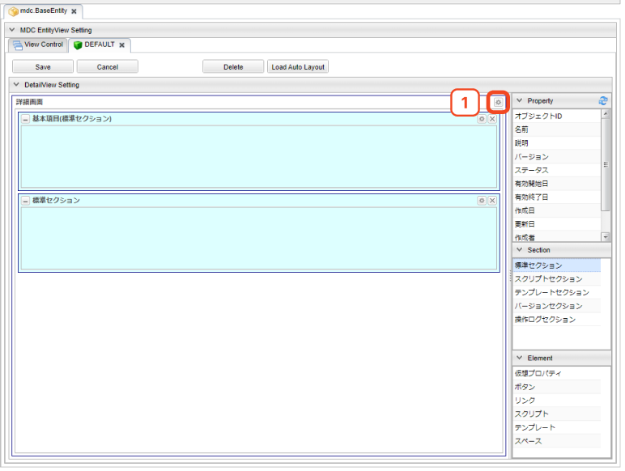

[[detaillayout]]
== 詳細・編集画面
詳細・編集画面のレイアウトをカスタマイズできます。
レイアウト設定を行わない場合、画面には基本項目及び、エンティティに登録されたプロパティが
エンティティ定義上での定義順で表示されます。

[[open_detaillayout]]
=== DetailLayoutの表示
ViewControlタブのViewControlSetting一覧の「DetailView Layout」から、追加もしくは編集のアイコンを押下すると、該当のView名 のDetailLayoutのタブが表示されます。

[[detaillayout_structure]]
=== DetailLayoutの構成
DetailLayoutは以下の構成になっています。

[[detaillayout_toolbar]]
==== ツールバー
紫枠の部分はDetailLayoutの各Viewに対する操作を行うためのボタン群です。

[cols="1,4a", options="header"]
|===
|ボタン名
|説明

|Save
|カスタマイズしたViewをViewControlにセットします。この段階ではまだ定義は保存されません。ViewControlタブの先頭に `U` が表示されます(Update)。ViewControlタブで対象のViewを保存することでView定義が保存されます。

|Cancel
|Viewの変更を取り消します。
Saveボタン押下前の内容が消えるため、ボタンを押す際は確認してください。

|Delete
|表示しているViewをViewControlから削除します。DetailLayoutのタブは削除され、ViewControlタブの「Defined」がOFFの状態になり、先頭に `U` が表示されます(Update)。ViewControlタブで対象のViewを保存することでView定義から削除されます。

|Load Auto Layout
|View定義を設定しない場合に表示される自動生成画面と同等の設定をロードします。

|===

[[detaillayout_drop_area]]
==== 配置エリア
緑枠の部分は各種要素を配置する領域です。
画面右側の `Property` 、 `Section` 、 `Element` 内の部品をドラッグ&ドロップで配置できます。
DetailLayoutが作成されてない状態だと、詳細、編集画面表示時にはエンティティのプロパティが自動で配置されます。
配置エリアに直接配置できるのは `Section` のみとなります。
`Property` と `Element` については、配置エリアに置かれた `標準セクション` に対してのみとなります。

[[detailview_setting]]
=== 詳細・編集画面の設定
図の①部分をクリックすると詳細、編集画面全体に対する設定を行うダイアログが表示されます。

[cols="1,4a", options="header"]
|===
|設定項目
|設定内容

|画面タイトル
|画面に表示するタイトルを入力します。
未入力の場合、エンティティの `Display Name` に設定された内容を画面に表示します。

|アイコンタグ
|タイトルの前に表示するアイコンを設定できます。 +
link:https://materialdesignicons.com/[Material Design Icons^]のアイコンタグを設定できます。（例：mdi-note）

|標準ボタン設定
|編集ボタンや保存ボタンなど、標準で提供されるボタンの設定をカスタマイズします。
詳細は<<detailview_base_button_setting, 標準ボタン設定>>を参照してください。

|画面上部のカスタムボタン
|タイトル領域の下に表示する独自のボタンを設定します。
詳細は<<detailview_custom_button_setting, カスタムボタン設定>>を参照してください。

|画面下部のカスタムボタン
|フッター領域に表示する独自のボタンを設定します。
詳細は<<detailview_custom_button_setting, カスタムボタン設定>>を参照してください。

|定義されている参照プロパティのみを取得
|チェックした場合、エンティティのロード時に画面定義に指定されている参照プロパティのみを取得対象とします。
未チェックの場合には不要な参照を取得するためのEQLが実行される場合があります。

|UserPropertyEditor利用時に特権実行でユーザー名を表示する
|UserPropertyEditorが設定されているプロパティに対し、ユーザー情報のエンティティ、またはユーザー名のプロパティに参照権限が無いユーザーでも、特権実行をしてユーザー名を表示することができます。

|データの多言語化
|データ操作時に多言語化するかを設定します。
有効にした場合、エンティティ定義の `Data Localization` 設定を有効にしてデータアクセスします。

|更新時に強制的に更新処理を行う
|チェックした場合、更新項目が１つもない場合にも強制的に更新を行います。
更新日、更新者が更新されます。

|物理削除
|チェックした場合、削除時にエンティティデータを物理削除します。
未チェックの場合、削除データはごみ箱に移動します。

WARNING: バージョン指定削除の場合は、設定に関係なく物理削除されます。

|親子関係の参照を物理削除
|チェックした場合、保存時に参照を解除された親子関係のエンティティデータを物理削除します。

|Entity初期化スクリプト
|エンティティを新規作成する際に初期値を設定するGroovyScriptを設定します。
詳細は<<detailview_default_value_script, Entity初期化スクリプト>>を参照してください。

|コピー対象
|コピー実行時の対象データを以下から選択します。
未設定(デフォルト)の場合は `Shallow` として動作します。

Shallow:: 該当エンティティのみコピー
Deep:: 包含する（親子関係の）エンティティも一括してコピーする
Both:: コピーボタン押下時に、ポップアップより `Shallow` と `Deep` を選択する
Custom:: `カスタムコピースクリプト` で設定したGroovyScriptが実行される

NOTE: `Deep` の場合、コピー時にデータ登録を実行後、編集画面を表示します。

|カスタムコピースクリプト
| `コピー対象` で `Custom` を選択した際に実行されるGroovyScriptを設定します。
詳細は<<detailview_custom_copy_script, カスタムコピースクリプト>>を参照してください。

|カスタムロード処理クラス名
|エンティティのロード時にオプション等のカスタマイズを行いたい場合は `LoadEntityInterceptor`
インターフェースを実装するクラスを指定してください。
詳細は<<MdcCustomize_Load, カスタムロード処理>>を参照してください。

|カスタム保存処理クラス名
|登録・更新時にカスタマイズ処理を行いたい場合は `SaveEntityInterceptor`
インターフェースを実装するクラスを指定してください。
詳細は<<MdcCustomize_Save, カスタム保存処理>>を参照してください。

|保存処理WebApi
|保存ボタンクリックで実行されるWebApiを設定します。

|削除処理WebApi
|削除ボタンクリックで実行されるWebApiを設定します。

|ワークフロー設定
|詳細画面からワークフローを起動する設定です。
詳細は<<detailview_workflow_setting, ワークフロー設定>>を参照してください。

|===

[[detailview_base_button_setting]]
==== 標準ボタン設定
編集ボタンや保存ボタンなど、標準で提供されるボタンの設定をカスタマイズします。

[cols="1,4a", options="header"]
|===
|設定項目
|設定内容

|表示
|未チェックの場合、ボタンを表示しません。

|表示判定スクリプト
|表示可否を実行時に動的に判定するGroovyScriptを設定します。
詳細は<<detailview_judge_display_script, 表示判定スクリプト>>を参照してください。

|表示ラベル
|ボタンに表示するラベルを設定します。

|アイコンタグ
|タイトルの前に表示するアイコンを設定できます。 +
link:https://materialdesignicons.com/[Material Design Icons^]のアイコンタグを設定できます。（例：mdi-note）

|CSSクラス名
|スタイルシートのクラス名を指定します。
複数指定する場合は半角スペースで区切ってください。

|ツールチップ
|ツールチップを指定します。

|カスタムクリックイベント
|ボタンクリック時に実行されるカスタムJavaScriptコードを設定します。

|===

NOTE: 保存ボタン、ロック解除ボタンには `表示フラグ` `表示判定スクリプト` 設定はありません。
ロック解除ボタンはロックボタン設定で表示が制御されます。

.カスタムクリックイベントの変数
カスタムクリックイベントとして実行するJavaScriptには、以下の変数がバインドされます。
====
defaultHandler:: デフォルトのイベントハンドラー関数
event:: DOMネイティブイベント
executeMode:: <<detailview_execute_mode, 実行モード>>
entity:: 処理対象のエンティティデータ
detailViewDefinition:: DetailView定義
====

.（例）
[source,javascript]
----
//確認メッセージを表示後に標準の処理を実行する

const { $confirm } = Mdc.useConfirm();

$confirm({
  title: '確認タイトル',
  message: '確認メッセージです',
  okText: '確認'
}).then(ok => {
  if (ok) {
    console.log('「確認」がクリックされました');

    // 標準の処理を実行
    defaultHandler.call();
  } else {
    console.log('「キャンセル」がクリックされました');
  }
});
----

[[detailview_custom_button_setting]]
==== カスタムボタン設定
画面内に表示するカスタムボタンの設定を行います。

[cols="1,4a", options="header"]
|===
|設定項目
|設定内容

|表示
|チェックした場合、ボタンを表示します。

|詳細画面で表示
|チェックした場合、詳細画面でボタンを表示します。

|編集画面でCreateモード時に表示
|チェックした場合、新規登録画面でボタンを表示します。

|編集画面でEditモード時に表示
|チェックした場合、編集画面でボタンを表示します。

|表示判定スクリプト
|表示可否を実行時に動的に判定するGroovyScriptを設定します。
詳細は<<detailview_judge_display_script, 表示判定スクリプト>>を参照してください。

|表示ラベル
|ボタンに表示するラベルを設定します。

|表示方法
|ボタンの表示方法を設定します。

SOLO:: 単一ボタンとして表示
MENU:: メニューから選択するボタンとして表示

|列情報
|ボタンの表示領域を設定します。
詳細は<<detailview_column_info, 列情報>>を参照してください。

|CSSクラス名
|スタイルシートのクラス名を指定します。
複数指定する場合は半角スペースで区切ってください。

|アイコンタグ
|タイトルの前に表示するアイコンを設定できます。 +
link:https://materialdesignicons.com/[Material Design Icons^]のアイコンタグを設定できます。（例：mdi-note）

|プライマリ
|設定するとボタンを強調表示します。

|クリックイベント
|ボタンクリック時に実行されるJavascriptコードを設定します。

|===

.クリックイベントの変数
クリックイベントとして実行するJavaScriptには、以下の変数がバインドされます。
====
executeMode:: <<detailview_execute_mode, 実行モード>>
entity:: 処理対象のエンティティデータ
detailViewDefinition:: DetailView定義
====

[[detailview_default_value_script]]
==== Entity初期化スクリプト
エンティティを新規作成する際に実行されるGroovyScriptです。
新規作成画面表示前に呼び出され、空のエンティティに対して初期値の設定を行います。

.独自のバインド変数
独自に以下の変数がバインドされています。
====
entity:: 空のエンティティ
====

.（例）
[source,groovy]
----
import java.sql.Date;
import java.sql.Time;
import java.sql.Timestamp;
import org.iplass.mtp.entity.SelectValue;
import org.iplass.mtp.entity.Entity;

// String、Boolean、Integer、Float、Decimal
entity.setValue("string", "abcdefg"); // String
entity.setValue("boolean", false); // Boolean
entity.setValue("integer", 100); //Integer
entity.setValue("float", 100.5); //Float
entity.setValue("decimal", 100.123); //Decimal

// Date、Time、DateTime
entity.setValue("date", Date.valueOf("2024-02-16")); //Date
entity.setValue("time", Time.valueOf("09:10:23")); //Time
entity.setValue("datetime", Timestamp.valueOf("2024-02-16 09:10:23")); //DateTime

// 多重度あり (String)
String[] mstringValue = ["string001", "string002"];
entity.setValue("mstring", mstringValue); //多重度ありString

// Select
SelectValue select = new SelectValue("value02");
entity.setValue("select", select); //Select

// Reference
Entity referenceEntity = em.load("1", "RefEntity");
entity.setValue("reference", referenceEntity); //Reference
----

[[detailview_custom_copy_script]]
==== カスタムコピースクリプト
`コピー対象` で `Custom` を選択した際に実行されるGroovyScriptです。
コピー値を設定したEntityを返すよう実装してください。

.独自のバインド変数
独自に以下の変数がバインドされています。
====
entity:: コピー元のエンティティ
entityDefinition:: エンティティ定義
====

[source,groovy]
----
entity.setValue("item1", "テスト");
return entity;
----

entityをreturnする必要があるので注意してください。

[[detailview_judge_display_script]]
==== 表示判定スクリプト
表示可否を判定するGroovyScriptを設定します。
スクリプトが未指定か、スクリプトの実行結果がtrueの場合、表示されます。

.独自のバインド変数
独自に以下の変数がバインドされています。
====
executeMode:: <<detailview_execute_mode, 実行モード>>
entity:: 処理対象のエンティティデータ
====

entityは、詳細画面表示時、編集画面表示時には保存されているエンティティデータが設定されます。
新規画面表示時には、空のエンティティか `Entity初期化スクリプト` で設定されたエンティティデータが設定されます。
コピー時には、コピー設定によりコピーされたエンティティデータが設定されます。

[[detailview_execute_mode]]
==== 実行モード
実行モードは実行されている画面のモードを表します。

`org.iplass.mtp.mdc.view.entityview.detail.MdcExecuteMode`

====
VIEW:: 詳細画面
CREATE:: 新規作成画面
EDIT:: 編集画面
====

[[detailview_column_info]]
==== 列情報
MDCはコンテンツのレイアウト設定として全体を12ポイントとするグリッドシステムを利用します。
画面サイズに対するブレークポイントに対して、コンテンツを表示するサイズ（列数）を設定します。 +
列数に0が設定された場合は画面に表示されません。 +
各ブレークポイントは、<<../../../serviceconfig/index.adoc#MdcConfigService, MdcConfigService>>で設定可能です。

[cols="1,4a", options="header"]
|===
|設定項目
|設定内容

|Extra Smallサイズの列数
|画面サイズが600px以下の場合の列数の設定します。（設定範囲は0~12）

|Smallサイズの列数
|画面サイズが600px以上 960px以下の場合の列数の設定します。（設定範囲は0~12）

|Mediumサイズの列数
|画面サイズが960px以上 1264px以下の場合の列数の設定します。（設定範囲は0~12）

|Largeサイズの列数
|画面サイズが1264px以上 1904px以下の場合の列数の設定します。（設定範囲は0~12）

|Extra Largeサイズの列数
|画面サイズが1904px以上の場合の列数の設定します。（設定範囲は0~12）

|===

[[detailview_workflow_setting]]
==== ワークフロー設定
詳細画面から定義済みのWorkflowを起動できます（Workflowの詳細については<<../../workflow/index.adoc#,ワークフロー>>を参照してください）。
設定されると詳細画面にワークフローを起動するためのボタンが追加されます。

[cols="1,4a", options="header"]
|===
|設定項目
|設定内容

|ワークフロー定義名
|Workflow定義名を選択します。

|ワークフロー変数名
|Workflowに定義した変数名を設定します。
Workflowを開始する際、対象のエンティティをこの変数に格納します。

|ボタン表示ラベル
|Workflowを起動するボタンに表示するラベルを設定します。

|アイコンタグ
|タイトルの前に表示するアイコンを設定できます。 +
link:https://materialdesignicons.com/[Material Design Icons^]のアイコンタグを設定できます。（例：mdi-note）

|CSSクラス名
|スタイルシートのクラス名を指定します。
複数指定する場合は半角スペースで区切ってください。

|プロセス実行中にボタンを表示
|チェックした場合、Workflowが既に実行中の状態でもボタンを表示します。
表示する場合、実行中に再度クリックすることで、別のWorkflowとして処理が開始されます（startProcessが実行されます）。

|プロセス実行中のメッセージ
|Workflow実行中のメッセージを設定します。

|ツールチップ
|ツールチップを指定します。

|ワークフロー開始パラメータ設定スクリプト
|ワークフロー開始時のパラメータをGroovyScriptで設定します。
詳細は<<detailview_workflow_setting_startparameter_script, ワークフロー開始パラメータ設定スクリプト>>を参照してください。

|ワークフローボタン表示判定用スクリプト
|ワークフロー起動用ボタンの表示可否を判定するスクリプトを設定します。
詳細は<<detailview_workflow_setting_judgedisplay_script, ワークフローボタン表示判定用スクリプト>>を参照してください。
|===

[[detailview_workflow_setting_startparameter_script]]
===== ワークフロー開始パラメータ設定スクリプト
ワークフロー開始時のパラメータを設定するGroovyScriptを設定します。
変数としてstartParamMap(Map<String, Object>)がバインドされています。 startParamMapに対して、ワークフロー開始時のパラメータを設定してください。 +
デフォルトで、ワークフロー変数名の設定値をキーとして対象のエンティティデータがstartPramMapに設定されています。

.独自のバインド変数
独自に以下の変数がバインドされています。
====
executeMode:: <<detailview_execute_mode, 実行モード>>
====

[[detailview_workflow_setting_judgedisplay_script]]
===== ワークフローボタン表示判定用スクリプト
ワークフローボタンの表示可否を判定するGroovyScriptを設定します。
スクリプトが未指定か、スクリプトの実行結果がtrueの場合、表示されます。

.独自のバインド変数
独自に以下の変数がバインドされています。
====
executeMode:: <<detailview_execute_mode, 実行モード>>
entity:: 処理対象のエンティティデータ
====

[[detaillayout_setting]]
=== 詳細・編集画面のレイアウト設定

[[detaillayout_section_setting]]
==== セクションの設定
画面右側のSectionの項目を画面中央の `詳細画面部分` にドラッグ&ドロップすることでセクションを配置できます。
PropertyやElementは `標準セクション` にのみ配置可能です。

[[detaillayout_section_common_setting]]
===== 共通設定項目
各セクションで共通の設定項目です。
セクションもエレメントの一種のため、 <<detaillayout_element_common_setting, エレメントの共通設定項目>>を持ちます。

セクション特有の設定項目は以下です。

[cols="1,4a", options="header"]
|===
|設定項目
|設定内容

|初期表示時に展開
|チェックした場合、セクションを初期展開します。

|折りたたみを許可
|チェックした場合、セクションを折りたたむことができます。

|ジャンプリンクを表示
|チェックした場合、フッタのリンクボタン上にセクションに移動するためのリンクを表示します。

|===

[[detaillayout_default_section]]
===== 標準セクション
エンティティのプロパティをグループ化したり、並び順を指定するなど、レイアウトを設定します。

設定項目は、<<detaillayout_section_common_setting, 共通設定項目>>のみです。

[[detaillayout_script_section]]
===== スクリプトセクション
GroovyTemplateで記述されたテンプレートを画面に組み込みます。
HTMLやスクリプト、Vue.jsのSFC形式（単一ファイルコンポーネント形式）などでテンプレートを記述できます。 +
テンプレートの実装方法の詳細については、link:../../../storybook/index.html?path=/docs/開発者ドキュメント-オリジナルテンプレート[コンポーネントカタログ^]を参照してください。

[cols="1,4a", options="header"]
|===
|設定項目
|設定内容

|開閉可能な枠を表示
|チェックした場合、標準セクション同様に枠を表示します。未チェックの場合はコンテンツのみ出力します。

|テンプレート文字列の解釈タイプ
|記述されたテンプレート文字列の解釈タイプです。以下の３つから選択できます。

HTML:: HTMLとして解釈します。HTMLやスクリプトの記述が可能です。
VUE_SFC:: Vue.jsのSFC形式（単一ファイルコンポーネント形式）で記述されたコンポーネントとして解釈します。
VUE_SFC_LIKE:: Vue.jsのランタイムを用いてコンポーネントとして解釈します。MDCでは、Vue.jsのランタイムに加えてコンパイラもバンドルしており、Vue.jsのテンプレート構文を利用することが可能です。

|コンポーネント名
|コンポーネント名を設定します。 コンポーネント名は、英文字とハイフン(-)のみを利用したパスカルケースでの命名を推奨します。
テンプレート文字列の解釈タイプが `VUE_SFC_LIKE` の場合、コンポーネント名の指定は必須です。 テンプレート文字列の解釈タイプが `VUE_SFC` でコンポーネント名が未入力の場合、自動でランダムなコンポーネント名を割り当てます。

|スクリプト
|スクリプト編集画面を表示してGroovyTemplateの文法に従って記述します。
詳細は<<../../customizing/index.adoc#groovytemplate, GroovyTemplate>>を参照してください。

.独自のバインド変数
request変数には以下の変数がバインドされています。
====
request.componentName:: 指定したコンポーネント名(VUE_SFC_LIKEの場合)
request.executeMode:: <<detailview_execute_mode, 実行モード>>
request.entityDefinition:: エンティティ定義
request.element:: スクリプトセクション定義
====

|VUE_SFC形式のテンプレートをプリコンパイルするか
|Vue.jsのSFC形式のテンプレートをプリコンパイルするかを指定します。`テンプレート文字列の解釈タイプ` が `VUE_SFC` であり、Vue.jsのSFC形式のテンプレートを定義保存時にプリコンパイルしておきたい場合にチェックします。プリコンパイルしておくことで、コンポーネントの初期化処理を高速化できます。

[NOTE]
====
プリコンパイルの注意点::
- プリコンパイルを実行したい場合には、 `コンポーネント名` の指定が必須となります。
- `スクリプト` に記述したGroovyTemplateは、DetailView定義保存時に実行されてプリコンパイルされるため、リクエスト情報やセッション情報、ユーザー固有情報などを使用しないように注意してください。
====

|詳細画面 テンプレート文字列の解釈タイプ
|詳細画面と編集画面で出力タイプを分けたい場合に指定します。

|詳細画面 コンポーネント名
|詳細画面と編集画面でコンポーネント名を分けたい場合に指定します。

|詳細画面 スクリプト
|詳細画面と編集画面でスクリプトを分けたい場合に指定します。

|詳細画面 VUE_SFC形式のテンプレートをプリコンパイルするか
|Vue.jsのSFC形式の詳細画面用テンプレートをプリコンパイルするかを指定します。`テンプレート文字列の解釈タイプ` または `詳細画面 テンプレート文字列の解釈タイプ` が `VUE_SFC` であり、Vue.jsのSFC形式のテンプレートを定義保存時にプリコンパイルしておきたい場合にチェックします。プリコンパイルしておくことで、コンポーネントの初期化処理を高速化できます。

[NOTE]
====
プリコンパイルの注意点::
- 詳細画面のテンプレートのプリコンパイルを実行したい場合には、 `コンポーネント名` と `詳細画面 コンポーネント名` の指定が必須となります。
- `詳細画面 スクリプト` に記述したGroovyTemplateは、DetailView定義保存時に実行されてプリコンパイルされるため、リクエスト情報やセッション情報、ユーザー固有情報などを使用しないように注意してください。
====
|===

.VUE_SFC形式、VUE_SFC_LIKE形式の場合のコンポーネントとのデータ受け渡し（props/emit）

以下のデータがpropsとしてコンポーネントに引き渡されます。
====
contextMap:: コンテキストマップ。リアクティブなMapオブジェクト。次のデータが格納されています。
- executeMode : <<detailview_execute_mode, 実行モード>>
- entity : 処理対象のエンティティデータ
- detailViewDefinition : DetailView定義
====

[[detaillayout_template_section]]
===== テンプレートセクション
別途定義したテンプレートを画面に組み込みます。 +
テンプレートの実装方法の詳細については、link:../../../storybook/index.html?path=/docs/開発者ドキュメント-オリジナルテンプレート[コンポーネントカタログ^]を参照してください。

[cols="1,4a", options="header"]
|===
|設定項目
|設定内容

|開閉可能な枠を表示
|チェックした場合、標準セクション同様に枠を表示します。未チェックの場合はコンテンツのみ出力します。

|テンプレート文字列の解釈タイプ
|記述されたテンプレート文字列の解釈タイプです。以下の３つから選択できます。

HTML:: HTMLとして解釈します。HTMLやスクリプトの記述が可能です。
VUE_SFC:: Vue.jsのSFC形式（単一ファイルコンポーネント形式）で記述されたコンポーネントとして解釈します。
VUE_SFC_LIKE:: Vue.jsのランタイムを用いてコンポーネントとして解釈します。MDCでは、Vue.jsのランタイムに加えてコンパイラもバンドルしており、Vue.jsのテンプレート構文を利用することが可能です。

|コンポーネント名
|コンポーネント名を設定します。 コンポーネント名は、英文字とハイフン(-)のみを利用したパスカルケースでの命名を推奨します。
テンプレート文字列の解釈タイプが `VUE_SFC_LIKE` の場合、コンポーネント名の指定は必須です。 テンプレート文字列の解釈タイプが `VUE_SFC` でコンポーネント名が未入力の場合、自動でランダムなコンポーネント名を割り当てます。

|テンプレート名
|登録済テンプレート名を設定します。

.独自のバインド変数
request変数には以下の変数がバインドされています。
====
request.componentName:: 指定したコンポーネント名(VUE_SFC_LIKEの場合)
request.executeMode:: <<detailview_execute_mode, 実行モード>>
request.entityDefinition:: エンティティ定義
request.element:: スクリプトセクション定義
====

|VUE_SFC形式のテンプレートをプリコンパイルするか
|Vue.jsのSFC形式のテンプレートをプリコンパイルするかを指定します。`テンプレート文字列の解釈タイプ` が `VUE_SFC` であり、Vue.jsのSFC形式のテンプレートを定義保存時にプリコンパイルしておきたい場合にチェックします。プリコンパイルしておくことで、コンポーネントの初期化処理を高速化できます。

[NOTE]
====
プリコンパイルの注意点::
- プリコンパイルを実行したい場合には、 `コンポーネント名` の指定が必須となります。
- `テンプレート名` で指定した登録済みのテンプレートは、DetailView定義保存時に実行されてプリコンパイルされるため、テンプレートの内容が変更された場合は再度DetailView定義を保存する必要があります。また、JSPやGroovyTemplateなどで記述されたテンプレートには、リクエスト情報やセッション情報、ユーザー固有情報などを使用しないように注意してください。
====

|詳細画面 テンプレート文字列の解釈タイプ
|詳細画面と編集画面で出力タイプを分けたい場合に指定します。

|詳細画面 コンポーネント名
|詳細画面と編集画面でコンポーネント名を分けたい場合に指定します。

|詳細画面 テンプレート名
|詳細画面と編集画面でテンプレートを分けたい場合に指定します。

|詳細画面 VUE_SFC形式のテンプレートをプリコンパイルするか
|Vue.jsのSFC形式の詳細画面用テンプレートをプリコンパイルするかを指定します。`テンプレート文字列の解釈タイプ` または `詳細画面 テンプレート文字列の解釈タイプ` が `VUE_SFC` であり、Vue.jsのSFC形式のテンプレートを定義保存時にプリコンパイルしておきたい場合にチェックします。プリコンパイルしておくことで、コンポーネントの初期化処理を高速化できます。

[NOTE]
====
プリコンパイルの注意点::
- 詳細画面のテンプレートのプリコンパイルを実行したい場合には、 `コンポーネント名` と `詳細画面 コンポーネント名` の指定が必須となります。
- `詳細画面 テンプレート名` で指定した登録済みのテンプレートは、DetailView定義保存時に実行されてプリコンパイルされるため、テンプレートの内容が変更された場合は再度DetailView定義を保存する必要があります。また、JSPやGroovyTemplateなどで記述されたテンプレートには、リクエスト情報やセッション情報、ユーザー固有情報などを使用しないように注意してください。
====
|===

.VUE_SFC形式、VUE_SFC_LIKE形式の場合のコンポーネントとのデータ受け渡し（props/emit）

以下のデータがpropsとしてコンポーネントに引き渡されます。
====
contextMap:: コンテキストマップ。リアクティブなMapオブジェクト。次のデータが格納されています。
- executeMode : <<detailview_execute_mode, 実行モード>>
- entity : 処理対象のエンティティデータ
- detailViewDefinition : DetailView定義
====

[[detaillayout_version_section]]
===== バージョンセクション
バージョン管理されたエンティティのバージョン履歴情報を表示します。

設定項目は、<<detaillayout_section_common_setting, 共通設定項目>>のみです。

[[detaillayout_auditlog_section]]
===== 操作ログセクション
エンティティの操作ログを表示します。

[cols="1,4a", options="header"]
|===
|設定項目
|設定内容

|表示件数
|一度に表示する操作ログの件数を指定します。未指定または0が指定された場合のデフォルトは20です。

|表示プロパティ
|表示するプロパティを設定します。複数指定する場合はカンマで区切ってください。 +
表示するプロパティを設定した場合、更新レコードのみが表示されます。

|新規作成レコードを併せて表示
|表示プロパティを設定した際に、新規作成レコードも併せて表示するかを指定します。

|参照プロパティの名前を表示する
|表示プロパティに参照プロパティが指定された場合、参照プロパティの名前(name)を表示するかを設定します。

|参照プロパティの操作ログ表示設定
|参照プロパティの操作ログの表示方法を指定します。参照先Entityの操作ログ記録が有効な場合にのみ有効になります。 +
詳細は<<detaillayout_auditlog_section_reference_view_setting, 参照プロパティの操作ログ表示設定>>を参照してください。
|===

[[detaillayout_auditlog_section_reference_view_setting]]
.参照プロパティの操作ログ表示設定
参照先エンティティの操作ログ記録が有効な場合、操作ログセクションに参照先エンティティの操作ログをダイアログで表示するためのリンクを表示します。

参照先エンティティの操作ログは、この設定でView名が指定されているプロパティであれば、そのView定義に設定された操作ログセクションの設定を使用します。 +
未指定の場合は、デフォルトのView定義を利用します。

[cols="1,4a", options="header"]
|===
|設定項目
|設定内容

|参照プロパティ名
|参照型プロパティ名を指定します。

|View名
|対応する参照先エンティティのView名を指定します。

|データの参照可能範囲条件をチェックしない
|参照先の操作ログを取得する場合に限り、操作ログ取得前のEntity権限の <<../../authorization/index.adoc#range_condition,参照可能範囲条件>> や、参照先エンティティの検索ビューに設定された <<default_search_cond,デフォルト検索条件>> に設定されている参照可能範囲を限定する条件をチェックしません。

|===

[[detaillayout_massreference_section]]
===== 大量データ参照セクション
被参照プロパティの内容を非同期で検索し、一覧表示します。

[cols="1,4a", options="header"]
|===
|設定項目
|設定内容

|表示プロパティ
|セクションに表示するプロパティを設定します。 +
詳細は<<detaillayout_massreference_property, 大量データ参照セクションの表示プロパティ>>を参照してください。

|デフォルト検索条件
|参照データ検索時に自動で絞り込みをする条件をPreparedQuery形式で指定します。
WHERE句に指定する条件を指定してください。
詳細は「検索条件の設定」の<<default_search_cond, デフォルト検索条件>>を参照してください。

|表示件数
|一度に表示する件数の上限を設定します。 未指定の場合は10件表示となります。

|ソート設定
|検索時にデフォルトで設定されるソート条件を設定します。
詳細は<<searchview_sortsetting, ソート設定>>を参照してください。

|詳細画面で編集を許可
|詳細画面に表示中の大量データ参照セクションのデータをクリックした際に、表示されるダイアログでの編集を許可します。

|編集画面で編集を許可
|編集画面に表示中の大量データ参照セクションのデータをクリックした際に、表示されるダイアログでの編集を許可します。

|ビュー定義名
|新規ボタン、一覧上のデータクリックで表示するダイアログのView定義名を設定します。未指定時はデフォルトのViewを使用します。

|Entity権限における限定条件の除外設定
|Entity権限における限定条件を適用せずに検索を実行する参照先のプロパティ名を設定します。特権実行する場合、または `カスタムロード処理クラス名` の設定がある場合はそちらが優先されます。

|EQLカスタム処理クラス名
|検索時時にクエリのカスタマイズを行いたい場合は `MassReferenceSearchQueryInterrupter` インターフェースを実装するクラスを指定してください。
詳細は<<MdcCustomize_MassReferenceSearch, カスタム検索処理（大量データ参照セクション）>>を参照してください。

|編集タイプ
|セクションの編集方法（データの追加・削除）を設定します。

EDIT:: 編集画面で編集を行う
VIEW:: 詳細画面で編集を行う

|新規ボタンを非表示
|データを追加するボタンを非表示にします。

|削除ボタンを非表示
|データを削除するボタンを非表示にします。

|参照検索後JavaScript
|参照データ検索後に実行するJavascriptを記述します。以下の変数が渡されます。

entity:: 参照元のEntity
reference:: 検索した参照先のEntityの配列
propertyName:: 対象の参照プロパティ名

|参照登録後JavaScript
|参照データ登録後に実行するJavascriptを記述します。以下の変数が渡されます。

entity:: 参照元のEntity
reference:: 登録した参照先のEntity
propertyName:: 対象の参照プロパティ名

|参照削除後JavaScript
|参照データ削除後に実行するJavascriptを記述します。以下の変数が渡されます。

entity:: 参照元のEntity
propertyName:: 対象の参照プロパティ名

|===

[[detaillayout_massreference_property]]
.大量データ参照セクションの表示プロパティ
大量データ参照セクション内に表示する、参照先のエンティティのプロパティに対する設定です。

[cols="1,4a", options="header"]
|===
|設定項目
|設定内容

|仮想プロパティ
|Entityに定義されたプロパティではなく、任意の名前を持った項目として扱います。

|プロパティ名
|プロパティ名を設定します。仮想プロパティとして扱う場合はプロパティ名は直接入力してください。

|表示ラベル
|画面に表示するラベルを設定します。仮想プロパティとして扱う場合は表示ラベルを設定してください。

|CSSクラス名
|スタイルシートのクラス名を指定します。複数指定する場合は半角スペースで区切ってください。

|プロパティエディタ
|対象のプロパティの型に合わせたエディタを選択します。 詳細は<<properyeditor_searchresult, プロパティエディタ>>を参照してください。 型は基本的に変更しないで下さい。 ただし `ScriptPropertyEditor` `TemplatePropertyEditor` についてはカスタマイズ用なので変更しても問題ありません。

|ソートを許可
|画面でのソートを可能にします。

|null項目のソート
|null項目のソート順を指定します。

NONE:: 未指定、DB依存
FIRST:: null項目を先頭にソート
LAST:: null項目を後尾にソート

|テキスト配置位置
|テキスト配置位置を指定します。指定しなかった場合のデフォルトは `END` です。

START:: 左寄せ
CENTER:: 中央揃え
END:: 右寄せ

|列幅
|列幅を指定します。指定しなかった場合は列幅は `auto` になります。

|===

[[detaillayout_workflowhistory_section]]
===== ワークフロー履歴セクション
ワークフローの変数として割り当てられた際のワークフローの履歴を表示します。

[cols="1,4a", options="header"]
|===
|設定項目
|設定内容

|対象ワークフロー設定
|表示対象とするワークフローを設定します。

|ソート設定
|ワークフロー履歴のソート条件を設定します。
詳細は<<detaillayout_workflowhistory_sortsetting, ソート設定>>を参照してください。

|タスクを処理したユーザーのみ表示
|同時に複数人にアサインされ、その内の誰かがタスクを処理し、その他がキャンセル扱いになった場合等で、タスクを処理したユーザーのみを表示します。

|ユーザータスク詳細リンク表示
|チェックした場合、ユーザータスクの処理名をリンク表示にします。

|ユーザータスク詳細画面レイアウト設定
|ユーザータスク詳細画面に適用するレイアウトを設定します。レイアウトを選択するためには<<../topview/index.adoc#usertasklist, TopViewのUserTask List>>を作成しておく必要があります。
|===

[[detaillayout_workflowhistory_sortsetting]]
.ソート設定
ワークフロー履歴のソート条件を設定します。

[cols="1,4a", options="header"]
|===
|設定項目
|設定内容

|ソート項目
|ソート対象とする項目を設定します。
指定可能な項目は `mtp.workflow.Workflow` のプロパティです。

|ソート種別
|検索時にデフォルトで指定するソート種別を設定します。
|===

[[detaillayout_element_setting]]
==== エレメントの設定
入力項目以外の画面要素を `標準セクション` 内にドラッグ&ドロップすることで、画面に配置できます。

[[detaillayout_element_common_setting]]
===== 共通設定項目
各エレメントで共通の設定項目です。

[cols="1,4a", options="header"]
|===
|設定項目
|設定内容

|表示
|チェックした場合、ボタンを表示します。

|詳細画面で表示
|チェックした場合、詳細画面でボタンを表示します。

|編集画面でCreateモード時に表示
|チェックした場合、新規登録画面でボタンを表示します。

|編集画面でEditモード時に表示
|チェックした場合、編集画面でボタンを表示します。

|表示判定スクリプト
|表示可否を実行時に動的に判定するGroovyScriptを設定します。
詳細は<<detailview_judge_display_script, 表示判定スクリプト>>を参照してください。

|表示ラベル
|画面に表示するラベルを設定します。

|列情報
|ボタンの表示領域を設定します。
詳細は<<detailview_column_info, 列情報>>を参照してください。

|CSSクラス名
|スタイルシートのクラス名を指定します。
複数指定する場合は半角スペースで区切ってください。

|===

[[detaillayout_space_element]]
===== スペース
スペースを設定します。複数列表示のセクションで空白のセルを作りたい場合に利用します。

設定可能な項目はありません。

[[detaillayout_button_element]]
===== ボタン
標準のボタン以外に独自で画面に表示するボタンを設定します。

[cols="1,4a", options="header"]
|===
|設定項目
|設定内容

|アイコンタグ
|タイトルの前に表示するアイコンを設定できます。 +
link:https://materialdesignicons.com/[Material Design Icons^]のアイコンタグを設定できます。（例：mdi-note）

|プライマリ
|設定するとボタンを強調表示します。

|クリックイベント
|ボタンクリック時に実行されるJavascriptコードを設定します。

|===

.クリックイベントの変数
クリックイベントとして実行するJavaScriptには、以下の変数がバインドされます。
====
executeMode:: <<detailview_execute_mode, 実行モード>>
entity:: 処理対象のエンティティデータ
detailViewDefinition:: DetailView定義
====

[[detaillayout_link_element]]
===== リンク
リンクを設定します。

[cols="1,4a", options="header"]
|===
|設定項目
|設定内容

|URL
|リンクURLを設定します。

|リンクテキスト
|リンクテキストを設定します。未指定の場合は、 `URL` がテキストとして表示されます。

|URLカスタマイズスクリプト
|リンクURLを動的にカスタマイズしたい場合に設定します。GroovyScript形式で指定します。 +
詳細は<<detaillayout_link_element_custom_url, URLカスタマイズスクリプト>>を参照してください。

|新しいウィンドウで表示するか
|リンク先のページを新しいウィンドウで開くかを設定します。

|詳細画面カスタムスタイル
|詳細画面のリンクに対して、直接style属性を指定することが可能です。
詳細は<<detaillayout_link_element_view_custom_style, 詳細画面カスタムスタイル>>を参照してください。

|編集画面カスタムスタイル
|編集画面のリンクに対して、直接style属性を指定することが可能です。
詳細は<<detaillayout_link_element_edit_custom_style, 編集画面カスタムスタイル>>を参照してください。

|===

[[detaillayout_link_element_custom_url]]
====== URLカスタマイズスクリプト
リンクURLを動的にカスタマイズするGroovyScriptを設定します。
スクリプトの実行結果をリンクURLとして設定します。

.独自のバインド変数
独自に以下の変数がバインドされています。
====
executeMode:: <<detailview_execute_mode, 実行モード>>
entity:: 処理対象のエンティティデータ
====

[[detaillayout_link_element_view_custom_style]]
====== 詳細画面カスタムスタイル
<<../../customizing/index.adoc#groovytemplate, GroovyTemplate>>書式で設定します。

.独自のバインド変数
独自に以下の変数がバインドされています。
====
executeMode:: <<detailview_execute_mode, 実行モード>>
entity:: 処理対象のエンティティデータ
====

[[detaillayout_link_element_edit_custom_style]]
====== 編集画面カスタムスタイル
<<../../customizing/index.adoc#groovytemplate, GroovyTemplate>>書式で設定します。

.独自のバインド変数
独自に以下の変数がバインドされています。
====
executeMode:: <<detailview_execute_mode, 実行モード>>
entity:: 処理対象のエンティティデータ
====

[[detaillayout_script_element]]
===== スクリプト
GroovyTemplateで記述されたテンプレートを画面に組み込みます。
HTMLやスクリプト、Vue.jsのSFC形式（単一ファイルコンポーネント形式）などでテンプレートを記述できます。 +
テンプレートの実装方法の詳細については、link:../../../storybook/index.html?path=/docs/開発者ドキュメント-オリジナルテンプレート[コンポーネントカタログ^]を参照してください。

[cols="1,4a", options="header"]
|===
|設定項目
|設定内容

|テンプレート文字列の解釈タイプ
|記述されたテンプレート文字列の解釈タイプです。以下の３つから選択できます。

HTML:: HTMLとして解釈します。HTMLやスクリプトの記述が可能です。
VUE_SFC:: Vue.jsのSFC形式（単一ファイルコンポーネント形式）で記述されたコンポーネントとして解釈します。
VUE_SFC_LIKE:: Vue.jsのランタイムを用いてコンポーネントとして解釈します。MDCでは、Vue.jsのランタイムに加えてコンパイラもバンドルしており、Vue.jsのテンプレート構文を利用することが可能です。

|コンポーネント名
|コンポーネント名を設定します。 コンポーネント名は、英文字とハイフン(-)のみを利用したパスカルケースでの命名を推奨します。
テンプレート文字列の解釈タイプが `VUE_SFC_LIKE` の場合、コンポーネント名の指定は必須です。 テンプレート文字列の解釈タイプが `VUE_SFC` でコンポーネント名が未入力の場合、自動でランダムなコンポーネント名を割り当てます。

|スクリプト
|スクリプト編集画面を表示してGroovyTemplateの文法に従って記述します。
詳細は<<../../customizing/index.adoc#groovytemplate, GroovyTemplate>>を参照してください。

|VUE_SFC形式のテンプレートをプリコンパイルするか
|Vue.jsのSFC形式のテンプレートをプリコンパイルするかを指定します。`テンプレート文字列の解釈タイプ` が `VUE_SFC` であり、Vue.jsのSFC形式のテンプレートを定義保存時にプリコンパイルしておきたい場合にチェックします。プリコンパイルしておくことで、コンポーネントの初期化処理を高速化できます。

[NOTE]
====
プリコンパイルの注意点::
- プリコンパイルを実行したい場合には、 `コンポーネント名` の指定が必須となります。
- `スクリプト` に記述したGroovyTemplateは、DetailView定義保存時に実行されてプリコンパイルされるため、リクエスト情報やセッション情報、ユーザー固有情報などを使用しないように注意してください。
====

|詳細画面 テンプレート文字列の解釈タイプ
|詳細画面と編集画面で出力タイプを分けたい場合に指定します。

|詳細画面 コンポーネント名
|詳細画面と編集画面でコンポーネント名を分けたい場合に指定します。

|詳細画面 スクリプト
|詳細画面と編集画面でスクリプトを分けたい場合に指定します。

|詳細画面 VUE_SFC形式のテンプレートをプリコンパイルするか
|Vue.jsのSFC形式の詳細画面用テンプレートをプリコンパイルするかを指定します。`テンプレート文字列の解釈タイプ` または `詳細画面 テンプレート文字列の解釈タイプ` が `VUE_SFC` であり、Vue.jsのSFC形式のテンプレートを定義保存時にプリコンパイルしておきたい場合にチェックします。プリコンパイルしておくことで、コンポーネントの初期化処理を高速化できます。

[NOTE]
====
プリコンパイルの注意点::
- 詳細画面のテンプレートのプリコンパイルを実行したい場合には、 `コンポーネント名` と `詳細画面 コンポーネント名` の指定が必須となります。
- `詳細画面 スクリプト` に記述したGroovyTemplateは、DetailView定義保存時に実行されてプリコンパイルされるため、リクエスト情報やセッション情報、ユーザー固有情報などを使用しないように注意してください。
====
|===

.VUE_SFC形式、VUE_SFC_LIKE形式の場合のコンポーネントとのデータ受け渡し（props/emit）

以下のデータがpropsとしてコンポーネントに引き渡されます。
====
contextMap:: コンテキストマップ。リアクティブなMapオブジェクト。次のデータが格納されています。
- executeMode : <<detailview_execute_mode, 実行モード>>
- entity : 処理対象のエンティティデータ
- detailViewDefinition : DetailView定義
====

[[detaillayout_template_element]]
===== テンプレート
別途定義したテンプレートを画面に組み込みます。 +
テンプレートの実装方法の詳細については、link:../../../storybook/index.html?path=/docs/開発者ドキュメント-オリジナルテンプレート[コンポーネントカタログ^]を参照してください。

[cols="1,4a", options="header"]
|===
|設定項目
|設定内容

|テンプレート文字列の解釈タイプ
|記述されたテンプレート文字列の解釈タイプです。以下の３つから選択できます。

HTML:: HTMLとして解釈します。HTMLやスクリプトの記述が可能です。
VUE_SFC:: Vue.jsのSFC形式（単一ファイルコンポーネント形式）で記述されたコンポーネントとして解釈します。
VUE_SFC_LIKE:: Vue.jsのランタイムを用いてコンポーネントとして解釈します。MDCでは、Vue.jsのランタイムに加えてコンパイラもバンドルしており、Vue.jsのテンプレート構文を利用することが可能です。

|コンポーネント名
|コンポーネント名を設定します。 コンポーネント名は、英文字とハイフン(-)のみを利用したパスカルケースでの命名を推奨します。
テンプレート文字列の解釈タイプが `VUE_SFC_LIKE` の場合、コンポーネント名の指定は必須です。 テンプレート文字列の解釈タイプが `VUE_SFC` でコンポーネント名が未入力の場合、自動でランダムなコンポーネント名を割り当てます。

|テンプレート名
|登録済テンプレート名を設定します。

|VUE_SFC形式のテンプレートをプリコンパイルするか
|Vue.jsのSFC形式のテンプレートをプリコンパイルするかを指定します。`テンプレート文字列の解釈タイプ` が `VUE_SFC` であり、Vue.jsのSFC形式のテンプレートを定義保存時にプリコンパイルしておきたい場合にチェックします。プリコンパイルしておくことで、コンポーネントの初期化処理を高速化できます。

[NOTE]
====
プリコンパイルの注意点::
- プリコンパイルを実行したい場合には、 `コンポーネント名` の指定が必須となります。
- `テンプレート名` で指定した登録済みのテンプレートは、DetailView定義保存時に実行されてプリコンパイルされるため、テンプレートの内容が変更された場合は再度DetailView定義を保存する必要があります。また、JSPやGroovyTemplateなどで記述されたテンプレートには、リクエスト情報やセッション情報、ユーザー固有情報などを使用しないように注意してください。
====

|詳細画面 テンプレート文字列の解釈タイプ
|詳細画面と編集画面で出力タイプを分けたい場合に指定します。

|詳細画面 コンポーネント名
|詳細画面と編集画面でコンポーネント名を分けたい場合に指定します。

|詳細画面 テンプレート名
|詳細画面と編集画面でテンプレートを分けたい場合に指定します。

|詳細画面 VUE_SFC形式のテンプレートをプリコンパイルするか
|Vue.jsのSFC形式の詳細画面用テンプレートをプリコンパイルするかを指定します。`テンプレート文字列の解釈タイプ` または `詳細画面 テンプレート文字列の解釈タイプ` が `VUE_SFC` であり、Vue.jsのSFC形式のテンプレートを定義保存時にプリコンパイルしておきたい場合にチェックします。プリコンパイルしておくことで、コンポーネントの初期化処理を高速化できます。

[NOTE]
====
プリコンパイルの注意点::
- 詳細画面のテンプレートのプリコンパイルを実行したい場合には、 `コンポーネント名` と `詳細画面 コンポーネント名` の指定が必須となります。
- `詳細画面 テンプレート名` で指定した登録済みのテンプレートは、DetailView定義保存時に実行されてプリコンパイルされるため、テンプレートの内容が変更された場合は再度DetailView定義を保存する必要があります。また、JSPやGroovyTemplateなどで記述されたテンプレートには、リクエスト情報やセッション情報、ユーザー固有情報などを使用しないように注意してください。
====
|===

.VUE_SFC形式、VUE_SFC_LIKE形式の場合のコンポーネントとのデータ受け渡し（props/emit）

以下のデータがpropsとしてコンポーネントに引き渡されます。
====
contextMap:: コンテキストマップ。リアクティブなMapオブジェクト。次のデータが格納されています。
- executeMode : <<detailview_execute_mode, 実行モード>>
- entity : 処理対象のエンティティデータ
- detailViewDefinition : DetailView定義
====

[[detaillayout_property_setting]]
==== プロパティの設定
Property項目については、 `標準セクション` にドラッグ&ドロップすることで配置できます。

プロパティもエレメントの一種のため、 <<detaillayout_element_common_setting, エレメントの共通設定項目>>を持ちます。

[cols="1,4a", options="header"]
|===
|設定項目
|設定内容

|ヒント
|入力欄下部に表示する説明を設定します。

|必須マークを表示
|編集画面で必須マークを表示するかを設定します。

DEFAULT:: エンティティのプロパティ定義 `Required` に従い自動的に表示します。
DISPLAY:: 必須マークを表示します。
NONE:: 必須マークを表示しません。

|プロパティエディタ
|対象のプロパティの型に合わせたエディタを選択します。
詳細は<<detaillayout_property_editor, プロパティエディタ>>を参照してください。
型は基本的に変更しないで下さい。
ただし `ScriptPropertyEditor` `TemplatePropertyEditor` についてはカスタマイズ用なので変更しても問題ありません。

|===

[[detaillayout_virtual_property]]
===== 仮想プロパティ
Element項目にある `仮想プロパティ` は、エンティティ定義には存在しない項目をプロパティと同様に出力することが可能です。
多重度は１のみサポートします。
プロパティの値は、<<detailview_default_value_script, Entity初期化スクリプト>>や
<<detailview_custom_copy_script, カスタムコピースクリプト>>、
<<MdcCustomize_Load, カスタムロード処理>>などで設定する必要があります。

[cols="1,4a", options="header"]
|===
|設定項目
|設定内容

|プロパティ名
|仮想プロパティの名前を設定します。
既に設定されている仮想プロパティの名前や、エンティティに定義されているプロパティと同じ名前は設定できません。

|===

他は、<<detaillayout_property_setting, プロパティ設定>>と同様です。
ただし、プロパティエディタについては一部利用することができません。

[[detaillayout_property_editor]]
=== プロパティエディタ
プロパティエディタは各プロパティの入力表示設定になります。
詳細・編集画面に配置した各プロパティの表示設定を変更をすることができます。
基本的にはプロパティの型に対応する型を選択してください。

[[detaillayout_property_editor_common_setting]]
==== 共通設定項目
プロパティエディタで共通の設定項目です。

[cols="1,4a", options="header"]
|===
|設定項目
|設定内容

|詳細画面カスタムスタイル
|詳細画面の各プロパティ値の表示に対して、直接style属性を指定することが可能です（ScriptPropertyEditor・TemplatePropertyEditorでは指定不可）。
値によって強調させたい場合などに利用します。
詳細は<<detaillayout_view_custom_style, 詳細画面カスタムスタイル>>を参照してください。

|編集画面カスタムスタイル
|編集画面の各プロパティのinput要素に対して、直接style属性を指定することが可能です（ScriptPropertyEditor・TemplatePropertyEditorでは指定不可）。
例えば入力用のinputの幅を調整したい場合などに利用します。
詳細は<<detaillayout_edit_custom_style, 編集画面カスタムスタイル>>を参照してください。

|LABEL形式の場合に表示値を登録する
|LABEL形式をサポートするエディタで、表示タイプがLABEL形式の場合に表示値をそのまま登録するかを指定します。

|LABEL形式の場合に表示値で更新する
|LABEL形式をサポートするエディタで、表示タイプがLABEL形式の場合に表示値で更新するかを指定します。

|===

[[detaillayout_view_custom_style]]
===== 詳細画面カスタムスタイル
<<../../customizing/index.adoc#groovytemplate, GroovyTemplate>>書式で設定します。

.独自のバインド変数
独自に以下の変数がバインドされています。
====
executeMode:: <<detailview_execute_mode, 実行モード>>
entity:: 処理対象のエンティティデータ
value:: 処理対象のプロパティデータ
====

.設定例
[source,groovy]
----
<%
//高、緊急の場合、赤色で表示(01:低、02:中、03:高、04:緊急)
if (value.value == "A" || value.value == "B") {  //SelectValue.valueでチェック
%>
color:red;
<%
}
//緊急の場合、背景を赤色で表示
if (value.value == "C") {
%>
background-color: red;
<%
}
%>
----

[[detaillayout_edit_custom_style]]
===== 編集画面カスタムスタイル
<<../../customizing/index.adoc#groovytemplate, GroovyTemplate>>書式で設定します。

.独自のバインド変数
独自に以下の変数がバインドされています。
====
executeMode:: <<detailview_execute_mode, 実行モード>>
entity:: 処理対象のエンティティデータ
value:: 処理対象のプロパティデータ
====

.設定例
[source,groovy]
----
<% //入力テキストの幅を100pxに、背景色を赤に変更
%>
background-color:#FFCCCC; width:100px;
----

Editorの表示タイプが選択可能な場合、タイプによって適用されるinputが異なります。
====
TEXT:: `.mdc-input-field` に対して指定したスタイルを適用します。
TEXTAREA、RICHTEXT:: `.mdc-textarea-field` に対して指定したスタイルを適用します。
SELECT:: `.mdc-select-field` に対して指定したスタイルを適用します。
RADIO:: radioを囲む `.mdc-radio-group` に対して指定したスタイルを適用します。
CHECKBOX:: checkboxを囲む `.mdc-checkbox-group` に対して指定したスタイルを適用します。
SWITCH:: switchを囲む `.mdc-switch-group` に対して指定したスタイルを適用します。
====

[[detaillayout_autonumber_property_editor]]
==== AutoNumberPropertyEditor
AutoNumber型用のプロパティエディタです。

[cols="1,1,6a", options="header"]
|===
|設定項目
|表示タイプ
|設定内容

|表示タイプ
| -
|画面に表示する方法を設定します。

LABEL:: ラベルを表示
HIDDEN:: ロードや更新対象とするが画面には表示しない

|===

[[detaillayout_binary_property_editor]]
==== BinaryPropertyEditor
Binary型用のプロパティエディタです。

[cols="1,1,6a", options="header"]
|===
|設定項目
|表示タイプ
|設定内容

|表示タイプ
| -
|画面に表示する方法を設定します。

BINARY:: ファイルのダウンロードボタンとプレビューを表示
LINK:: ファイルのダウンロードリンクを表示
PREVIEW:: ファイルのプレビューを表示
LABEL:: ファイルのプレビューを表示、アップロードや削除は不可
HIDDEN:: ロードや更新対象とするが画面には表示しない

|画像の高さ(px)
|BINARY +
PREVIEW +
LABEL
|プレビューする場合に表示する画像や動画の高さを設定します。

|画像の幅(px)
|BINARY +
PREVIEW +
LABEL
|プレビューする場合に表示する画像や動画の幅を設定します。

|許可するファイル型
|BINARY +
LINK +
PREVIEW
|アップロードで許可するファイル型を設定します。inputの `accept` 属性に設定されます。さらに、アップロードファイルのファイル型をサーバーでもチェックします。 +
設定が無い場合のサーバーのチェックについては、Service-Config の MdcConfigService binaryUploadAcceptMimeTypesPattern の設定が利用されます。Service-Config の詳細は link:../../../serviceconfig/index.html#MdcConfigService[こちら] を参照ください。 +
本設定と Service-Config の両方が設定されていた場合は、本設定が優先されます。

検証対象となる MIME Type の決定方法については、link:../../../serviceconfig/index.html#WebFrontendService[WebFrontendService uploadFileTypeDetector], link:../../../serviceconfig/index.html#FileTypeDetector[FileTypeDetector] を参照してください。

|画像表示時に回転ボタンを表示
|BINARY +
LABEL +
PREVIEW
|左右の回転ボタンを表示します。表示している画像を回転させることが可能になります。保存されるデータは変更されません。

|画像表示時にイメージViewerを利用
|BINARY +
LABEL +
PREVIEW
|拡大表示アイコンを表示します。拡大表示アイコンをクリックするとImageViewerを表示します。 +
ImageViewerでは画像の拡大・縮小、回転、反転が可能です。

|PDF表示時にPDF.jsを利用
|BINARY +
LABEL +
PREVIEW
|拡大表示アイコンを表示します。拡大表示アイコンをクリックするとPDF.jsを用いてPDFを表示します。

|新しいタブで開く
|BINARY +
LINK +
PREVIEW +
LABEL
|拡大表示アイコンや画像リンクをクリックした場合に画像を新しいタブで表示します。`画像表示時にイメージViewerを利用` が有効な場合のみ動作します。

|ファイル選択ボタン非表示
|BINARY +
LINK +
PREVIEW
|ファイル選択ボタンを非表示にします。これでアップロード権限制御なとに利用してください。

|削除ボタン非表示
|BINARY +
LINK +
PREVIEW
|バイナリファイルデータを削除するボタンを非表示にします。これで削除権限制御なとに利用してください。

|アップロードWebApi
|BINARY +
LINK +
PREVIEW
|アップロード時に実行されるWebApiを設定します。

|ダウンロードアクション
|BINARY +
LINK
|ダウンロード時に実行されるアクションを設定します。

|参照アクション
|BINARY +
PREVIEW +
LABEL
|プレビュー時に実行されるアクションを設定します。

|===

[[detaillayout_boolean_property_editor]]
==== BooleanPropertyEditor
Boolean型用のプロパティエディタです。

[cols="1,1,6a", options="header"]
|===
|設定項目
|表示タイプ
|設定内容

|表示タイプ
| -
|画面に表示する方法を設定します。

RADIO:: ラジオボタンを表示
CHECKBOX:: チェックボックスを表示
SELECT:: 選択リストを表示
SWITCH:: スイッチを表示
LABEL:: ラベルを表示
HIDDEN:: ロードや更新対象とするが画面には表示しない

|プレースホルダー
|SELECT
|入力領域にプレースホルダーを設定します。

|詳細画面で値をChip形式で表示する
|RADIO +
CHECKBOX +
SELECT +
LABEL
|詳細画面で値をChip形式で表示するかを指定します。

|真偽値のChipカラー
|RADIO +
CHECKBOX +
SELECT +
LABEL
|真偽の選択肢に表示するChipカラーを設定します。
[NOTE]
====
Chipカラー設定が未設定の場合は、Chipの色はデフォルトのカラーになります。
====

|真偽値の表示ラベル
|RADIO +
CHECKBOX +
SELECT +
LABEL
|真偽の選択肢に表示するラベルを設定します。

|RADIO、CHECKBOX、SWITCH形式の場合にアイテムを横に並べる
|RADIO +
CHECKBOX +
SWITCH
|チェックした場合、RADIO、CHECKBOX、SWITCH形式のアイテムを横に並べるかを指定します。

|初期値
|RADIO +
CHECKBOX +
SELECT +
HIDDEN
|新規作成時の初期値を設定します。true/false または、1/0 を設定して下さい。

|===

[[detaillayout_date_property_editor]]
==== DatePropertyEditor
Date型用のプロパティエディタです。

[cols="1,1,6a", options="header"]
|===
|設定項目
|表示タイプ
|設定内容

|表示タイプ
| -
|画面に表示する方法を設定します。

TEXT:: 入力フィールドを表示
LABEL:: ラベルを表示
HIDDEN:: ロードや更新対象とするが画面には表示しない

|日付/時刻のフォーマット設定
|TEXT +
LABEL
|日付/時刻型を表示する際のフォーマットとロケールを設定します。 +
詳細は <<detaillayout_format_value,日付/時刻のフォーマット設定>> を参照してください。

|日付/時刻のフォーマッの多言語設定
|TEXT +
LABEL
|言語別の日付/時刻型を表示する際のフォーマットとロケールを設定します。 +
詳細は <<detaillayout_localized_format_value,日付/時刻のフォーマットの多言語設定>> を参照してください。

|曜日を表示
|TEXT +
LABEL
|チェックした場合、日付にあわせて曜日を表示します。
曜日の入力はできません。

|初期値
|TEXT +
HIDDEN
|新規作成時の初期値を設定します。
yyyyMMdd形式か、予約語を指定して下さい。（予約語は以下の通り）

NOW:: 現在日付となります。

|===

[[detaillayout_format_value]]
===== 日付/時刻のフォーマット設定
フォーマットが反映される優先度は `プロパティエディタの多言語設定に指定されたフォーマットとロケール` &gt; `プロパティエディタで設定されたフォーマットとロケール` &gt; `デフォルトの表示` となります。
[cols="1,8a", options="header"]
|===
|設定項目
|設定内容

|日付/時刻のフォーマット設定
|日付、時刻のフォーマットを文字列で設定します。
フォーマットの設定はSimpleDateFormatのパターン文字を使用してください。

.入力例と表示例 +
yyyy年MM月dd日HH時mm分ss秒 → 2021年01月01日 12時10分05秒 +
MMM dd yyyy → Jan 01 2021

|日付/時刻のロケール設定
|日付、時刻のフォーマットの表示を決定するロケールを文字列で設定します。

.入力例 +
ja_JP_JP、en_US、zh-CN_CN
|===

[[detaillayout_localized_format_value]]
===== 日付/時刻のフォーマットの多言語設定
フォーマットが反映される優先度は `プロパティエディタの多言語設定に指定されたフォーマットとロケール` &gt; `プロパティエディタで設定されたフォーマットとロケール` &gt; `デフォルトの表示` となります。
[cols="1,8a", options="header"]
|===
|設定項目
|設定内容

|日付/時刻の言語設定
|日付、時刻のフォーマットを設定する言語を設定をします。

.入力例 +
日本語：ja 、英語：en 、中国語（简体中文）：zh-CN

|日付/時刻のフォーマット設定
|日付、時刻のフォーマットを文字列で設定します。
フォーマットの設定はSimpleDateFormatのパターン文字を使用してください。

.入力例と表示例 +
yyyy年MM月dd日HH時mm分ss秒 → 2021年01月01日 12時10分05秒 +
MMM dd yyyy → Jan 01 2021

|日付/時刻のロケール設定
|日付、時刻のフォーマットの表示を決定するロケールを文字列で設定します。

.入力例 +
ja_JP_JP、en_US、zh-CN_CN
|===

[[detaillayout_daterange_property_editor]]
==== DateRangePropertyEditor
日付型のプロパティを二つ組合せ、範囲を入力・表示するプロパティエディタです。 +
設定した2つのプロパティの入力欄が表示され、登録時に期間の前後関係のチェックを行います。

[cols="1,1,6a", options="header"]
|===
|設定項目
|表示タイプ
|設定内容

|表示タイプ
| -
|画面に表示する方法を設定します。

LABEL:: プロパティエディタに指定した内容に合わせて日付／日時／時間の入力フィールドを表示
HIDDEN:: ロードや更新対象とするが画面には表示しない

|プロパティエディタ
| -
|このプロパティ(From)のプロパティエディタを設定します。
プロパティの型にあわせたプロパティエディタを選択してください。

|Fromの未入力を許容
| -
|チェックした場合、Fromの入力欄の未入力を許容します。

|Toプロパティ名
| -
|このプロパティと組み合わせて表示する他のプロパティを指定します。
指定するプロパティはこのプロパティの型と合わせてください。

|Toプロパティエディタ
| -
|Toプロパティのプロパティエディタを設定します。
プロパティの型にあわせたプロパティエディタを選択してください。

|Toの未入力を許容
| -
|チェックした場合、Toの入力欄の未入力を許容します。

|同値を許容
| -
|チェックした場合、FromとToを同じ値での登録を許容します。

|===

[[detaillayout_decimal_property_editor]]
==== DecimalPropertyEditor
Decimal型用のプロパティエディタです。

[cols="1,1,6a", options="header"]
|===
|設定項目
|表示タイプ
|設定内容

|表示タイプ
| -
|画面に表示する方法を設定します。

TEXT:: 入力フィールドを表示
LABEL:: ラベルを表示
HIDDEN:: ロードや更新対象とするが画面には表示しない

|プレースホルダー
|TEXT
|入力領域にプレースホルダーを設定します。

|最大文字数
|TEXT
|テキストフィールドに入力可能な最大文字数を設定します。
1以上の場合に適用されます。

|数値のフォーマット
|TEXT +
LABEL
|表示時のフォーマットを指定します。
`java.text.DecimalFormat` パターンを設定してください。

|カンマ表示
|TEXT
|テキストフィールドからフォーカスアウトした際に入力値をカンマ区切りで表示します

|初期値
|TEXT +
HIDDEN
|新規作成時の初期値を設定します。

|===

[[detaillayout_expression_property_editor]]
==== ExpressionPropertyEditor
Expression型用のプロパティエディタです。

[cols="1,1,6a", options="header"]
|===
|設定項目
|表示タイプ
|設定内容

|表示タイプ
| -
|画面に表示する方法を設定します。

LABEL:: ラベルを表示
HIDDEN:: ロードや更新対象とするが画面には表示しない

|プロパティエディタ
| -
|プロパティエディタを設定します。
Expressionプロパティの `ResultType` に設定されている内容に合わせて設定してください。
設定した場合、そのEditor設定にあわせて画面表示を行います。
未設定の場合は、値を文字列として表示します。

|===

[[detaillayout_float_property_editor]]
==== FloatPropertyEditor
Float型用のプロパティエディタです。

[cols="1,1,6a", options="header"]
|===
|設定項目
|表示タイプ
|設定内容

|表示タイプ
| -
|画面に表示する方法を設定します。

TEXT:: 入力フィールドを表示
LABEL:: ラベルを表示
HIDDEN:: ロードや更新対象とするが画面には表示しない

|プレースホルダー
|TEXT
|入力領域にプレースホルダーを設定します。

|最大文字数
|TEXT
|テキストフィールドに入力可能な最大文字数を設定します。
1以上の場合に適用されます。

|数値のフォーマット
|TEXT +
LABEL
|表示時のフォーマットを指定します。
`java.text.DecimalFormat` パターンを設定してください。

|カンマ表示
|TEXT
|テキストフィールドからフォーカスアウトした際に入力値をカンマ区切りで表示します

|初期値
|TEXT +
HIDDEN
|新規作成時の初期値を設定します。

|===

[[detaillayout_integer_property_editor]]
==== IntegerPropertyEditor
Integer型用のプロパティエディタです。

[cols="1,1,6a", options="header"]
|===
|設定項目
|表示タイプ
|設定内容

|表示タイプ
| -
|画面に表示する方法を設定します。

TEXT:: 入力フィールドを表示
LABEL:: ラベルを表示
HIDDEN:: ロードや更新対象とするが画面には表示しない

|プレースホルダー
|TEXT
|入力領域にプレースホルダーを設定します。

|最大文字数
|TEXT
|テキストフィールドに入力可能な最大文字数を設定します。
1以上の場合に適用されます。

|数値のフォーマット
|TEXT +
LABEL
|表示時のフォーマットを指定します。
`java.text.DecimalFormat` パターンを設定してください。

|カンマ表示
|TEXT
|テキストフィールドからフォーカスアウトした際に入力値をカンマ区切りで表示します

|初期値
|TEXT +
HIDDEN
|新規作成時の初期値を設定します。

|===

[[detaillayout_longtext_property_editor]]
==== LongTextPropertyEditor
LongText型用のプロパティエディタです。

[cols="1,1,6a", options="header"]
|===
|設定項目
|表示タイプ
|設定内容

|表示タイプ
| -
|画面に表示する方法を設定します。

TEXT:: 入力フィールドを表示
TEXTAREA:: テキストエリア入力フィールドを表示
RICHTEXT:: リッチテキスト内容を表示(詳細表示のみ対応。編集時は `TEXTAREA` と同様)
LABEL:: ラベルを表示
HIDDEN:: ロードや更新対象とするが画面には表示しない

|プレースホルダー
|TEXT +
TEXTAREA +
RICHTEXT
|入力領域にプレースホルダーを設定します。

|最大文字数
|TEXT +
TEXTAREA +
RICHTEXT
|テキストフィールドに入力可能な最大文字数を設定します。
1以上の場合に適用されます。

|初期値
|TEXT +
TEXTAREA +
RICHTEXT +
HIDDEN
|新規作成時の初期値を設定します。

|===

[[detaillayout_numericrange_property_editor]]
==== NumericRangePropertyEditor
数値型のプロパティを二つ組合せ、範囲を入力・表示するプロパティエディタです。 +
設定した2つのプロパティの入力欄が表示され、登録時に期間の前後関係のチェックを行います。

[cols="1,1,6a", options="header"]
|===
|設定項目
|表示タイプ
|設定内容

|表示タイプ
| -
|画面に表示する方法を設定します。

LABEL:: 数値の入力フィールドを表示
HIDDEN:: ロードや更新対象とするが画面には表示しない

|プロパティエディタ
| -
|このプロパティ(From)のプロパティエディタを設定します。
プロパティの型にあわせたプロパティエディタを選択してください。

|Fromの未入力を許容
| -
|チェックした場合、Fromの入力欄の未入力を許容します。

|Toプロパティ名
| -
|このプロパティと組み合わせて表示する他のプロパティを指定します。
指定するプロパティはこのプロパティの型と合わせてください。

|Toプロパティエディタ
| -
|Toプロパティのプロパティエディタを設定します。
プロパティの型にあわせたプロパティエディタを選択してください。

|Toの未入力を許容
| -
|チェックした場合、Toの入力欄の未入力を許容します。

|同値を許容
| -
|チェックした場合、FromとToを同じ値での登録を許容します。

|===

[[detaillayout_reference_property_editor]]
==== ReferencePropertyEditor
Reference型用のプロパティエディタです。

[cols="1,1,6a", options="header"]
|===
|設定項目
|表示タイプ
|設定内容

|編集画面表示タイプ
| -
|編集画面に表示する方法を設定します。

LINK:: 名称のリンク表示とリンクから詳細画面を表示
SELECT:: 選択リストを表示
CHECKBOX:: 多重度が複数の場合はチェックボックス、1の場合はラジオボタンを表示
LABEL:: ラベルを表示
HIDDEN:: ロードや更新対象とするが画面には表示しない

|詳細画面表示タイプ
| -
|詳細画面に表示する方法を設定します。

LINK:: 名称のリンク表示とリンクから詳細画面を表示
LABEL:: ラベルを表示
HIDDEN:: ロードや更新対象とするが画面には表示しない

|表示ラベルとして扱うプロパティ
|LINK +
SELECT +
CHECKBOX +
LABEL
|表示ラベルとして扱うプロパティを設定します。
`name` 以外のプロパティを画面にラベルとして表示できます。
`StringProperty` にのみ適用されます。それ以外のプロパティを指定すると、画面表示にエラーになります。

|Link設定
|LINK
|LINKタイプの設定を行います。
詳細は<<detaillayout_reference_property_editor_link_config, Link設定>>を参照してください。

|選択値設定
|SELECT +
CHECKBOX
|選択値の設定を行います。
詳細は<<detaillayout_reference_property_editor_select_value_config, 選択値設定>>を参照してください。

|ラベル設定
|LABEL
|ラベルの設定を行います。
ラベル設定は<<detaillayout_property_editor_common_setting, 共通設定項目>>の
ラベル設定と同じ項目です。

|===

[[detaillayout_reference_property_editor_link_config]]
===== Link設定
LINKタイプに対する設定を行います。

[cols="1,4a", options="header"]
|===
|設定項目
|設定内容

|View定義名
|参照先エンティティのView定義名を設定します。
未指定の場合はデフォルトのView定義を使用します。

|詳細画面の参照リンクで編集を許可
|チェックした場合、参照リンク押下時のリンク先詳細画面で編集が可能となります。

|編集画面の参照リンクで編集を許可
|チェックした場合、参照リンク押下時のリンク先詳細画面で編集が可能となります。

|新規ボタンを非表示
|チェックした場合、新規ボタンを非表示にします。

|選択ボタンを非表示
|チェックした場合、選択ボタンを非表示にします。

|削除ボタンを非表示
|チェックした場合、削除ボタンを非表示にします。

|選択画面での全選択を許可
|参照先の選択画面で複数選択が可能な場合、全選択時の範囲を変更します。
ただし多重度以上の選択はできず、先頭から順に選択されます。

チェックあり:: 検索条件に一致する全てのデータ(前後のページを含む) が対象
チェックなし:: 現在のページの全てのデータが対象

|選択画面でバージョン検索を許可
|バージョン管理している参照先Entityの選択画面でバージョン検索を許可します。

|特定バージョンの基準となるプロパティ
|参照先のプロパティのバージョン管理に合わせて、画面内のプロパティ名を指定します。
指定したプロパティの値を利用して、選択画面での検索時にバージョンを指定して検索します。

|参照画面表示JavaScript
|参照先の詳細画面を表示する前のタイミングで実行されるJavaScriptを指定します。
戻り値として `false` を返すと画面を表示しません。

.クリックイベントの変数
クリックイベントとして実行するJavaScriptには、以下の変数がバインドされます。
====
entity:: 参照元のエンティティデータ
reference:: 参照先のエンティティデータ
propertyName:: プロパティ名
====

|新規参照画面表示JavaScript
|新規での参照先の編集画面を表示する前のタイミングで実行されるJavaScriptを指定します。
戻り値として `false` を返すと画面を表示しません。

.クリックイベントの変数
クリックイベントとして実行するJavaScriptには、以下の変数がバインドされます。
====
entity:: 参照元のエンティティデータ
propertyName:: プロパティ名
====

|参照画面保存後JavaScript
|参照先の編集画面で保存されたタイミングで実行されるJavaScriptを指定します。

.JavaScriptの変数
JavaScriptには、以下の変数がバインドされます。
====
entity:: 参照元のエンティティデータ
reference:: 参照先のエンティティデータ
propertyName:: プロパティ名
====

|参照画面削除後JavaScript
|参照先の詳細画面で削除されたタイミングで実行されるJavaScriptを指定します。

.JavaScriptの変数
JavaScriptには、以下の変数がバインドされます。
====
entity:: 参照元のエンティティデータ
reference:: 参照先のエンティティデータ
propertyName:: プロパティ名
====

|選択画面表示JavaScript
|参照先の選択画面を表示する前のタイミングで実行されるJavaScriptを指定します。
戻り値として `false` を返すと画面を表示しません。

.クリックイベントの変数
クリックイベントとして実行するJavaScriptには、以下の変数がバインドされます。
====
entity:: 参照元のエンティティデータ
propertyName:: プロパティ名
====

|選択画面パラメータ生成スクリプト
|選択画面に渡すカスタムパラメータをGroovyScript形式で記述します。
バインドされている `paramMap` に対して、

====
key:: sc_プロパティ名
value:: 検索条件とする値
====

として値を設定すると、選択画面の初期検索条件として設定されます。

.独自のバインド変数
独自に以下の変数がバインドされています。
====
paramMap:: Map<String, String>
executeMode:: <<detailview_execute_mode, 実行モード>>
entity:: 参照元のエンティティデータ
====

|選択画面カスタムパラメータJavaScript
|選択画面に渡すパラメータをカスタマイズするJavascriptを記述します。
JavaScriptのパラメータとして渡される `parameter` オブジェクトに対して、

====
key:: sc_プロパティ名
value:: 検索条件とする値
====

として値を設定すると、選択画面の初期検索条件として設定されます。
パラメータには、 `選択画面パラメータ生成スクリプト` で設定された値が予め指定されています。

.JavaScriptの変数
JavaScriptには、以下の変数がバインドされます。
====
parameter:: 送信するパラメータオブジェクト
entity:: 参照元のエンティティデータ
propertyName:: プロパティ名
====

|選択画面選択後JavaScript
|参照先の選択画面で選択されたタイミングで実行されるJavaScriptを指定します。

.JavaScriptの変数
JavaScriptには、以下の変数がバインドされます。
====
entity:: 参照元のエンティティデータ
referenceList:: 選択したエンティティデータのリスト
deleteList:: 選択解除されたエンティティデータのリスト
propertyName:: プロパティ名
====

新規で追加した参照先データはまだ保存されていないため、選択画面には表示されません。
選択画面で選択値を変更した場合も、新規データは追加されている状態で残ります。
もし削除したい場合は、明示的に削除ボタンから削除する必要があります。

|===

[[detaillayout_reference_property_editor_select_value_config]]
===== 選択値設定
SELECTタイプ、CHECKBOXタイプに対する設定を行います。

[cols="1,4a", options="header"]
|===
|設定項目
|設定内容

|検索条件
|選択可能項目を検索する際の条件に依存しない検索条件を設定します。

|ソートアイテム
|選択項目をソートする項目を設定します。

|ソート種別
|選択項目をソートする種別を設定します。

|プレースホルダー
|SELECTタイプの場合に、入力領域にプレースホルダーを設定します。

|CHECKBOX形式の場合にアイテムを横に並べる
|チェックした場合、CHECKBOX形式のアイテムを横に並べるかを指定します。

|===

[[detaillayout_script_property_editor]]
==== ScriptPropertyEditor
GroovyTemplateで記述されたテンプレートを利用して表示するプロパティエディタです。
HTMLやスクリプト、Vue.jsのSFC形式（単一ファイルコンポーネント形式）などでテンプレートを記述できます。 +
テンプレートの実装方法の詳細については、link:../../../storybook/index.html?path=/docs/開発者ドキュメント-オリジナルテンプレート[コンポーネントカタログ^]を参照してください。

[cols="1,1,6a", options="header"]
|===
|設定項目
|表示タイプ
|設定内容

|表示タイプ
| -
|画面に表示する方法を下記から選択します。

SCRIPT:: Scriptの出力結果を表示
HIDDEN:: ロードや更新対象とするが画面には表示しない

|テンプレート文字列の解釈タイプ
| -
|記述されたテンプレート文字列の解釈タイプです。以下の３つから選択できます。

HTML:: HTMLとして解釈します。HTMLやスクリプトの記述が可能です。
VUE_SFC:: Vue.jsのSFC形式（単一ファイルコンポーネント形式）で記述されたコンポーネントとして解釈します。
VUE_SFC_LIKE:: Vue.jsのランタイムを用いてコンポーネントとして解釈します。MDCでは、Vue.jsのランタイムに加えてコンパイラもバンドルしており、Vue.jsのテンプレート構文を利用することが可能です。

|コンポーネント名
| -
|コンポーネント名を設定します。 コンポーネント名は、英文字とハイフン(-)のみを利用したパスカルケースでの命名を推奨します。
テンプレート文字列の解釈タイプが `VUE_SFC_LIKE` の場合、コンポーネント名の指定は必須です。 テンプレート文字列の解釈タイプが `VUE_SFC` でコンポーネント名が未入力の場合、自動でランダムなコンポーネント名を割り当てます。

|スクリプト
| -
|スクリプト編集画面を表示してGroovyTemplateの文法に従って記述します。
詳細は<<../../customizing/index.adoc#groovytemplate, GroovyTemplate>>を参照してください。

.独自のバインド変数
request変数には以下の変数がバインドされています。
====
request.componentName:: 指定したコンポーネント名(VUE_SFC_LIKEの場合)
request.executeMode:: <<detailview_execute_mode, 実行モード>>
request.entityDefinition:: エンティティ定義
request.propertyDefinition:: プロパティ定義
request.element:: エレメント定義
request.editor:: エディタ定義
request.value:: プロパティ値
====

|VUE_SFC形式のテンプレートをプリコンパイルするか
| -
|Vue.jsのSFC形式のテンプレートをプリコンパイルするかを指定します。`テンプレート文字列の解釈タイプ` が `VUE_SFC` であり、Vue.jsのSFC形式のテンプレートを定義保存時にプリコンパイルしておきたい場合にチェックします。プリコンパイルしておくことで、コンポーネントの初期化処理を高速化できます。

[NOTE]
====
プリコンパイルの注意点::
- プリコンパイルを実行したい場合には、 `コンポーネント名` の指定が必須となります。
- `スクリプト` に記述したGroovyTemplateは、DetailView定義保存時に実行されてプリコンパイルされるため、リクエスト情報やセッション情報、ユーザー固有情報などを使用しないように注意してください。
====

|詳細画面 テンプレート文字列の解釈タイプ
| -
|詳細画面と編集画面で出力タイプを分けたい場合に指定します。

|詳細画面 コンポーネント名
| -
|詳細画面と編集画面でコンポーネント名を分けたい場合に指定します。

|詳細画面 スクリプト
| -
|詳細画面と編集画面でスクリプトを分けたい場合に指定します。

|詳細画面 VUE_SFC形式のテンプレートをプリコンパイルするか
| -
|Vue.jsのSFC形式の詳細画面用テンプレートをプリコンパイルするかを指定します。`テンプレート文字列の解釈タイプ` または `詳細画面 テンプレート文字列の解釈タイプ` が `VUE_SFC` であり、Vue.jsのSFC形式のテンプレートを定義保存時にプリコンパイルしておきたい場合にチェックします。プリコンパイルしておくことで、コンポーネントの初期化処理を高速化できます。

[NOTE]
====
プリコンパイルの注意点::
- 詳細画面のテンプレートのプリコンパイルを実行したい場合には、 `コンポーネント名` と `詳細画面 コンポーネント名` の指定が必須となります。
- `詳細画面 スクリプト` に記述したGroovyTemplateは、DetailView定義保存時に実行されてプリコンパイルされるため、リクエスト情報やセッション情報、ユーザー固有情報などを使用しないように注意してください。
====
|===

.VUE_SFC形式、VUE_SFC_LIKE形式の場合のコンポーネントとのデータ受け渡し（props/emit）

以下のデータがpropsとしてコンポーネントに引き渡されます。
====
contextMap:: コンテキストマップ。リアクティブなMapオブジェクト。次のデータが格納されています。
- executeMode : <<detailview_execute_mode, 実行モード>>
- entity : 処理対象のエンティティデータ
- detailViewDefinition : DetailView定義

element:: 対象プロパティのプロパティ項目
modelValue:: 対象プロパティの値
====

以下のイベント通知をリスニングします。
[cols="1,1",options="header"]
|===
|イベント名
|通知値

|update:modelValue
|対象プロパティの更新値
|===

[[detaillayout_select_property_editor]]
==== SelectPropertyEditor
Select型用のプロパティエディタです。

[cols="1,1,6a", options="header"]
|===
|設定項目
|表示タイプ
|設定内容

|表示タイプ
| -
|画面に表示する方法を設定します。

CHECKBOX:: 多重度が複数の場合はチェックボックス、1の場合はラジオボタンを表示
SELECT:: 選択リストを表示
LABEL:: ラベルを表示
HIDDEN:: ロードや更新対象とするが画面には表示しない

|プレースホルダー
|SELECT
|入力領域にプレースホルダーを設定します。

|詳細画面で値をChip形式で表示する
|CHECKBOX +
SELECT +
LABEL
|詳細画面で値をChip形式で表示するかを指定します。

|Chipカラー
|CHECKBOX +
SELECT +
LABEL
|<<chipColorValuePair, Chipカラー設定>>を参照してください。

|選択値
|CHECKBOX +
SELECT +
LABEL
|選択値を指定できます。詳細は<<detaillayout_editor_value, 選択値設定>>を参照してください。未指定の場合、エンティティ定義から選択値を取得します。 +
画面個別に選択値をカスタマイズしたい場合に設定してください。

|CHECKBOX形式の場合にアイテムを横に並べる
|CHECKBOX
|チェックした場合、CHECKBOX形式のアイテムを横に並べるかを指定します。

|初期値
|CHECKBOX +
SELECT +
HIDDEN
|新規作成時の初期値を設定します。

|===

[[detaillayout_editor_value]]
===== 選択値設定
選択値を設定します。

[cols="1,8a", options="header"]
|===
|設定項目
|設定内容

|表示名
|選択肢のラベルを設定します。

|値
|選択肢の値を設定します。

|CSSクラス名
|スタイルシートのクラス名を指定します。
複数指定する場合は半角スペースで区切って下さい。
|===

[[chipColorValuePair]]
===== Chipカラー設定
Chipカラーを設定します。

[cols="2,6a", options="header"]
|===
|設定項目
|設定内容

|値
|選択肢の値を設定します。

|Chipカラー
|Chipの色を指定できます。
カラーコードまたはマテリアルカラー名（例：red）を指定します。
[NOTE]
====
Chipカラー設定が未設定の場合は、Chipの色はデフォルトのカラーになります。
====
|===

[[detaillayout_string_property_editor]]
==== StringPropertyEditor
String型用のプロパティエディタです。

[cols="1,1,6a", options="header"]
|===
|設定項目
|表示タイプ
|設定内容

|表示タイプ
| -
|画面に表示する方法を設定します。

TEXT:: 入力フィールドを表示
TEXTAREA:: テキストエリア入力フィールドを表示
RICHTEXT:: リッチテキスト内容を表示(詳細表示のみ対応。編集時は `TEXTAREA` と同様)
PASSWORD:: パスワードフィールドを表示
SELECT:: 選択リストを表示
LABEL:: ラベルを表示
HIDDEN:: ロードや更新対象とするが画面には表示しない

|プレースホルダー
|TEXT +
TEXTAREA +
RICHTEXT +
PASSWORD +
SELECT
|入力領域にプレースホルダーを設定します。

|最大文字数
|TEXT +
TEXTAREA +
RICHTEXT
|テキストフィールドに入力可能な最大文字数を設定します。
1以上の場合に適用されます。

|選択値
|SELECT
|選択値を指定できます。詳細は<<detaillayout_editor_value, 選択値設定>>を参照してください。 +
String型のプロパティとして値を保持するが、入力値を固定させたいような場合に利用します。

|初期値
|TEXT +
TEXTAREA +
RICHTEXT +
PASSWORD +
SELECT +
HIDDEN
|新規作成時の初期値を設定します。

|===

[[detaillayout_template_property_editor]]
==== TemplatePropertyEditor
別途定義したテンプレートを利用して表示するプロパティエディタです。 +
テンプレートの実装方法の詳細については、link:../../../storybook/index.html?path=/docs/開発者ドキュメント-オリジナルテンプレート[コンポーネントカタログ^]を参照してください。

[cols="1,1,6a", options="header"]
|===
|設定項目
|表示タイプ
|設定内容

|表示タイプ
| -
|画面に表示する方法を設定します。

TEMPLATE:: Templateの出力結果を表示
HIDDEN:: ロードや更新対象とするが画面には表示しない

|テンプレート文字列の解釈タイプ
| -
|記述されたテンプレート文字列の解釈タイプです。以下の３つから選択できます。

HTML:: HTMLとして解釈します。HTMLやスクリプトの記述が可能です。
VUE_SFC:: Vue.jsのSFC形式（単一ファイルコンポーネント形式）で記述されたコンポーネントとして解釈します。
VUE_SFC_LIKE:: Vue.jsのランタイムを用いてコンポーネントとして解釈します。MDCでは、Vue.jsのランタイムに加えてコンパイラもバンドルしており、Vue.jsのテンプレート構文を利用することが可能です。

|コンポーネント名
| -
|コンポーネント名を設定します。 コンポーネント名は、英文字とハイフン(-)のみを利用したパスカルケースでの命名を推奨します。
テンプレート文字列の解釈タイプが `VUE_SFC_LIKE` の場合、コンポーネント名の指定は必須です。 テンプレート文字列の解釈タイプが `VUE_SFC` でコンポーネント名が未入力の場合、自動でランダムなコンポーネント名を割り当てます。

|テンプレート名
| -
|登録済テンプレート名を設定します。

.独自のバインド変数
request変数には以下の変数がバインドされています。
====
request.componentName:: 指定したコンポーネント名(VUE_SFC_LIKEの場合)
request.executeMode:: <<detailview_execute_mode, 実行モード>>
request.entityDefinition:: エンティティ定義
request.propertyDefinition:: プロパティ定義
request.element:: エレメント定義
request.editor:: エディタ定義
request.value:: プロパティ値
====

|VUE_SFC形式のテンプレートをプリコンパイルするか
| -
|Vue.jsのSFC形式のテンプレートをプリコンパイルするかを指定します。`テンプレート文字列の解釈タイプ` が `VUE_SFC` であり、Vue.jsのSFC形式のテンプレートを定義保存時にプリコンパイルしておきたい場合にチェックします。プリコンパイルしておくことで、コンポーネントの初期化処理を高速化できます。

[NOTE]
====
プリコンパイルの注意点::
- プリコンパイルを実行したい場合には、 `コンポーネント名` の指定が必須となります。
- `テンプレート名` で指定した登録済みのテンプレートは、DetailView定義保存時に実行されてプリコンパイルされるため、テンプレートの内容が変更された場合は再度DetailView定義を保存する必要があります。また、JSPやGroovyTemplateなどで記述されたテンプレートには、リクエスト情報やセッション情報、ユーザー固有情報などを使用しないように注意してください。
====

|詳細画面 テンプレート文字列の解釈タイプ
| -
|詳細画面と編集画面で出力タイプを分けたい場合に指定します。

|詳細画面 コンポーネント名
| -
|詳細画面と編集画面でコンポーネント名を分けたい場合に指定します。

|詳細画面 テンプレート名
| -
|詳細画面と編集画面でテンプレートを分けたい場合に指定します。

|詳細画面 VUE_SFC形式のテンプレートをプリコンパイルするか
| -
|Vue.jsのSFC形式の詳細画面用テンプレートをプリコンパイルするかを指定します。`テンプレート文字列の解釈タイプ` または `詳細画面 テンプレート文字列の解釈タイプ` が `VUE_SFC` であり、Vue.jsのSFC形式のテンプレートを定義保存時にプリコンパイルしておきたい場合にチェックします。プリコンパイルしておくことで、コンポーネントの初期化処理を高速化できます。

[NOTE]
====
プリコンパイルの注意点::
- 詳細画面のテンプレートのプリコンパイルを実行したい場合には、 `コンポーネント名` と `詳細画面 コンポーネント名` の指定が必須となります。
- `詳細画面 テンプレート名` で指定した登録済みのテンプレートは、DetailView定義保存時に実行されてプリコンパイルされるため、テンプレートの内容が変更された場合は再度DetailView定義を保存する必要があります。また、JSPやGroovyTemplateなどで記述されたテンプレートには、リクエスト情報やセッション情報、ユーザー固有情報などを使用しないように注意してください。
====
|===

.VUE_SFC形式、VUE_SFC_LIKE形式の場合のコンポーネントとのデータ受け渡し（props/emit）

以下のデータがpropsとしてコンポーネントに引き渡されます。
====
contextMap:: コンテキストマップ。リアクティブなMapオブジェクト。次のデータが格納されています。
- executeMode : <<detailview_execute_mode, 実行モード>>
- entity : 処理対象のエンティティデータ
- detailViewDefinition : DetailView定義

element:: 対象プロパティのプロパティ項目
modelValue:: 対象プロパティの値
====

以下のイベント通知をリスニングします。
[cols="1,1",options="header"]
|===
|イベント名
|通知値

|update:modelValue
|対象プロパティの更新値
|===

[[detaillayout_time_property_editor]]
==== TimePropertyEditor
Time型用のプロパティエディタです。

[cols="1,1,6a", options="header"]
|===
|設定項目
|表示タイプ
|設定内容

|表示タイプ
| -
|画面に表示する方法を設定します。

TEXT:: 入力フィールドを表示
LABEL:: ラベルを表示
HIDDEN:: ロードや更新対象とするが画面には表示しない

|日付/時刻のフォーマット設定
|TEXT +
LABEL
|日付/時刻型を表示する際のフォーマットとロケールを設定します。 +
詳細は <<detaillayout_format_value,日付/時刻のフォーマット設定>> を参照してください。

|日付/時刻のフォーマッの多言語設定
|TEXT +
LABEL
|言語別の日付/時刻型を表示する際のフォーマットとロケールを設定します。 +
詳細は <<detaillayout_localized_format_value,日付/時刻のフォーマットの多言語設定>> を参照してください。

|時間の表示範囲
|TEXT +
LABEL
|時間の各リストをどこまで表示するか下記から選択します。

SEC:: 秒まで表示
MIN:: 分まで表示
HOUR:: 時まで表示
NONE:: 時間を非表示(無効です)

|分の間隔
|TEXT
|分のリストの表示間隔を下記から選択します。

1MIN:: 1分
5MIN:: 5分
10MIN:: 10分
15MIN:: 15分
30MIN:: 30分

|分の端数処理モード
|TEXT
|分の端数処理方法を設定します。pickerなどで入力された値を分の間隔で端数制御します。

UP:: 0から離れるようにする
DOWN:: 0に近づける
NONE:: 制御しない

|初期値
|TEXT +
HIDDEN
|新規作成時の初期値を設定します。
HHmmss形式か、予約語を指定して下さい。（予約語は以下の通り）

NOW:: 現在時刻となります。

|===

[[detaillayout_timestamp_property_editor]]
==== TimestampPropertyEditor
Timestamp型用のプロパティエディタです。

[cols="1,1,6a", options="header"]
|===
|設定項目
|表示タイプ
|設定内容

|表示タイプ
| -
|画面に表示する方法を設定します。

TEXT:: 入力フィールドを表示
LABEL:: ラベルを表示
HIDDEN:: ロードや更新対象とするが画面には表示しない

|日付/時刻のフォーマット設定
|TEXT +
LABEL
|日付/時刻型を表示する際のフォーマットとロケールを設定します。 +
詳細は <<detaillayout_format_value,日付/時刻のフォーマット設定>> を参照してください。

|日付/時刻のフォーマッの多言語設定
|TEXT +
LABEL
|言語別の日付/時刻型を表示する際のフォーマットとロケールを設定します。 +
詳細は <<detaillayout_localized_format_value,日付/時刻のフォーマットの多言語設定>> を参照してください。

|曜日を表示
|TEXT +
LABEL
|チェックした場合、日付にあわせて曜日を表示します。
曜日の入力はできません。

|時間の表示範囲
|TEXT +
LABEL
|時間の各リストをどこまで表示するか下記から選択します。

SEC:: 秒まで表示
MIN:: 分まで表示
HOUR:: 時まで表示
NONE:: 時間を非表示

|分の間隔
|TEXT
|分のリストの表示間隔を下記から選択します。

1MIN:: 1分
5MIN:: 5分
10MIN:: 10分
15MIN:: 15分
30MIN:: 30分

|分の端数処理モード
|TEXT
|分の端数処理方法を設定します。pickerなどで入力された値を分の間隔で端数制御します。

UP:: 0から離れるようにする
DOWN:: 0に近づける
NONE:: 制御しない

|初期値
|TEXT +
HIDDEN
|新規作成時の初期値を設定します。
yyyyMMddHHmmss形式か、予約語を指定して下さい。（予約語は以下の通り）

NOW:: 現在時刻となります。

|===

[[detaillayout_user_property_editor]]
==== UserPropertyEditor
`createBy` や `updateBy` 等、Userエンティティの `oid` （String）を持つプロパティに対して、
`oid` に一致するユーザー名を表示させるためのプロパティエディタです。
ユーザー名を表示します（読み取り専用）。

[cols="1,1,6a", options="header"]
|===
|設定項目
|表示タイプ
|設定内容

|表示タイプ
| -
|画面に表示する方法を設定します。

LABEL:: ラベルを表示
HIDDEN:: ロードや更新対象とするが画面には表示しない

|===
