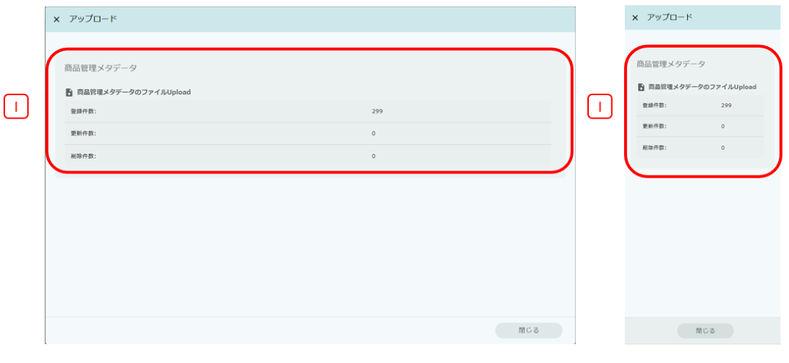
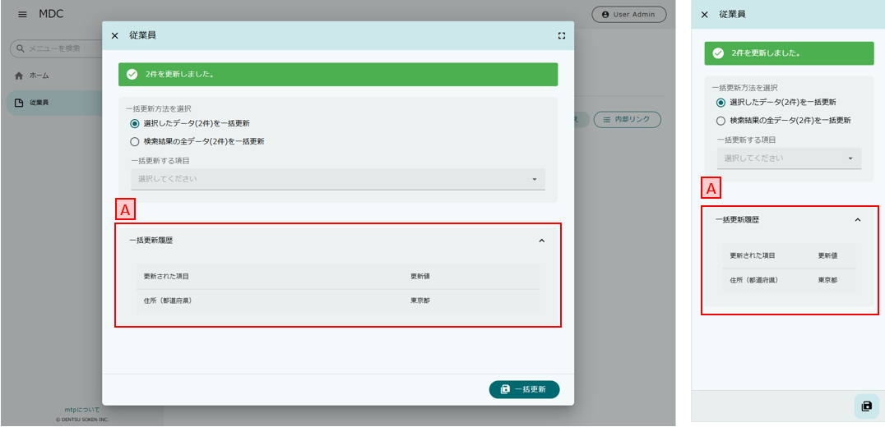

[[operationguide]]
== 操作説明

[[searchview]]
=== 検索画面
登録済みのエンティティのデータを検索し、検索結果一覧を表示するための画面です。

==== ボタンエリア
`新規登録` をクリックすると、エンティティの新規登録画面（＝編集画面）が表示されます。
新規登録画面では単一データを登録できます。

`アップロード` をクリックすると、エンティティファイルのアップロード画面が表示されます。
アップロード画面では単一データをアップロードで登録、更新、削除できます。

`ごみ箱へ移動` をクリックすると、ごみ箱を表示します。
検索結果で `削除` を行ったデータはごみ箱に格納されます。

==== 検索条件エリア
検索画面の右下にあるフローティングアクションボタンをクリックすることで、検索条件を入力するダイアログを表示します。
`通常検索` 、 `詳細検索` 、 `定型検索` の3種類の検索方法が用意されています。

検索方法は、画面上部のタブで切り替えることが可能です。

`リセット` をクリックすると、入力した内容を初期化し、画面表示時の状態に戻します。

`検索実行` をクリックすると、検索項目に指定された条件を利用して検索を行います。
検索後は検索条件を入力するダイアログが閉じられ、条件に一致した検索結果の一覧が表示されます。

バージョン管理されているEntityの場合には、検索条件エリアに `すべてのバージョンを検索` というチェックボックスが表示されます。チェックを入れた場合、すべてのバージョンのデータを検索対象とします。ただし、チェックボックスにチェックを入れていない場合でも、バージョン管理用項目（有効開始日、有効終了日、ステータス、バージョン）が検索条件に指定されている場合、すべてのバージョンのデータを検索対象とします。

<<../../../serviceconfig/index.adoc#MdcConfigService, MdcConfigService>> で定義される `showDownloadButtonInSearchConditionDialog` を `true` に設定した場合、検索条件エリアに `ダウンロード` というボタンが表示されます。検索項目に指定された条件を利用して検索を行い、結果をファイルとしてダウンロードします。 

===== 通常検索
`通常検索` は検索条件上部タブの `通常検索` をクリックすると、その下にエンティティの各項目と検索条件を入力するフィールドが表示されます。

.A.検索項目
検索時に設定する検索条件を指定します。
項目により入力方法が変わります。
詳細は<<input_field, 入力フィールド>>を参照してください。

オプション表示項目に指定した検索条件項目は、オプション検索条件エリアに表示されます。
オプション表示設定については<<searchcondition_property_setting, 検索条件プロパティの設定>>を参照してください。

===== 詳細検索
`詳細検索` は検索条件上部の `詳細検索` をクリックすると、その下に任意のエンティティの項目と条件、キーワードを入力するフィールドが表示されます。

image:images/operation_searchview_condition_detail.png[]

.A.検索項目
`条件追加` をクリックすると検索条件を追加し、 `×` アイコンをクリックすると該当行を削除します。

検索項目として指定するプロパティの型ごとにキーワードへ指定できる文字が変わります。

[cols="1,3", options="header"]
|===
|型
|形式

|真偽値
|`true` または `false` +
検索結果で表示される文言での代用も可能

|日付
|yyyy-MM-dd形式

|日時
|yyyy-MM-dd HH:mm:ss形式

|時間
|HH:mm:ss形式

|参照型
|参照データの名前項目、または参照ラベルとして扱うプロパティ項目

|選択型
|選択肢の値またはラベル

|数値
|任意の数値

|その他
|任意の文字列
|===

.B.条件の組合せ
検索項目で指定した条件をどのように組み合わせるかを指定します。

すべての条件に一致:: AND条件で組み合わせます
いずれかの条件に一致:: OR条件で組み合わせます
すべての条件に一致しない:: NOT条件で組み合わせます

.C.条件式を記述
条件の組合せを任意に行いたい場合に指定します。
以下のような書式で指定してください。
式内の `$n` が検索項目の行頭の数字に対応しています。

----
(($1 and $2) or ($3 and $4)) and (not $5)
----

===== 定型検索
`定型検索` は検索条件上部の `定型検索` をクリックすると、その下に固定条件（あらかじめ登録された検索条件）が表示されます。
固定条件は<<filter,フィルタ機能>>を利用して作成できます。

.A.固定条件
フィルタ機能で登録された検索条件です。
条件の内容は変更できません。

==== 検索結果エリア

検索実行時に検索条件に一致する検索結果一覧が表示されます。 +
検索結果一覧の表示形式には、 `カード形式`、`テーブル形式`、カード形式とテーブル形式を画面上でスイッチ可能な `スイッチ形式` が用意されています。

===== カード形式

.A.並び替え
検索結果を指定の項目、順序で並び替えます。

.B.詳細
データの詳細画面を表示します。

.C.編集
データの編集画面を表示します。

.D.ページング
データが10件（設定により変更可）以上有る場合に使用します。
`<` 、 `>` は現在表示しているページの前後のページを表示します。
数字をクリックするとそのページのデータを表示します。

.E.選択
特定のデータを選択状態／非選択状態に切り替えます。
選択状態にすると上部にバーが表示され、選択したデータの件数が反映されます。

.F.全選択
現在表示中の全データを選択状態にします。全データの選択状態を解除する場合はバー左端の `×` を押下します。

.G.削除
検索結果で選択したデータ、または検索条件を基にした全データを対象としてデータの削除を行います。
削除したデータはごみ箱に移動します。 +
表示されている全データが選択された状態で押下した場合、削除対象を選択するダイアログが表示されます。 +

選択したデータ(n件)を削除:: 選択状態になっているデータを削除します。
検索結果の全データ(n件)を削除:: 検索を行った時の条件を利用して、一致する全データを削除します。

.H.内部リンク
検索結果の検索結果の先頭、末尾へ画面をスクロール可能なページ内リンクが表示されます。

===== テーブル形式

.A.並び替え
ヘッダー行を押下すると、検索結果を指定の項目、順序で並び替えます。

.B.詳細
列を押下すると、データの詳細画面を表示します。

.C.ページング
データが10件（設定により変更可）以上有る場合に使用します。
`<` 、 `>` は現在表示しているページの前後のページを表示します。
数字をクリックするとそのページのデータを表示します。

.D.選択
特定のデータを選択状態／非選択状態に切り替えます。
選択状態にすると上部にバーが表示され、選択したデータの件数が反映されます。

.E.編集
データの編集画面を表示します。

===== スイッチ形式

.A.表示形式の切り替えスイッチ
検索結果一覧の表示形式をカード形式（左） or テーブル形式（右）に切り替えます。

===== ダウンロード

.A.ダウンロードボタン
クリック時にファイルダウンロードダイアログが表示されます。ダイアログが非表示に設定されている場合、直接ダウンロード処理が実行されます。

.B.ダウンロード共通設定
ファイルタイプ、文字コードなど、ダウンロードに関する共通設定が表示されます。

.C.詳細オプション
`EntityView` ファイルダウンロードに関する詳細設定が表示されます。

===== アップロードダイアログ

.A.アップロードボタン
クリック時にファイルアップロードダイアログが表示されます。

.B.アップロードファイル選択コンポーネント
アップロード対象のファイルを選択します。

.C.詳細説明
アップロード実行時注意事項詳細説明文字ボタン、クリック時にアップロード実行時の注意事項詳細説明とアップロードサンプルダウンロードボタンが表示されます。

.D.詳細オプション
アップロード実行時のユニークキーと更新データの指定に関する設定が表示されます。

.E.詳細説明
ユニークキーの詳細説明、クリック時ユニークキーの詳細説明が表示されます。

.F.アップロード実行ボタン
選択したファイルをアップロードします。 アップロードが完了すると、登録や更新の件数などの処理結果が表示されます。

エラーが発生した場合、ダイアログをの上部がエラーで表示されます。 アップロードファイルを修正した後、再度アップロードしてください。

.G.アップロードサンプルダウンロードボタン
アップロード可能なフォーマットのサンプルファイルをダウンロードします。

===== アップロード結果画面ダイアログ

.A.アップロード結果
アップロード登録や更新の件数などの処理結果が表示されます。

.B.アップロード結果画面閉じる
クリック時にアップロード結果画面が閉じられます。

=== ごみ箱

検索画面などで削除されたデータが格納されています。
削除データについてはデータの内容等は参照できません。

.A.対象選択
`復元` もしくは `削除` する対象を選択します。
表頭のチェックボックスを選択すると、全データを対象にできます。

.B.復元
選択したデータをごみ箱から元に戻します。

.C.削除
選択したデータを完全に削除します。
ごみ箱から削除したデータは復元できません。

=== 一括更新画面
検索一覧で選択中のデータを一括更新する操作画面です。
選択したレコードに対して、単一の項目と複数の項目を更新する二つのパターンがあります。

==== 単一の項目を一括更新

.A.一括更新方法を選択
検索結果エリアにすべてのデータがチェック中の場合、一括更新方法を選択する設定を表示します。
処理対象として選択したデータに対して連続更新する場合、二回目以降は一括更新方法を変更することができません。

選択された行を一括更新:: 現在表示中で一括更新対象になっているデータを一括更新します。
検索条件を元に全て一括更新:: 検索を行った時の条件を利用して、一致する全データを一括更新します。

.B.一括更新する項目
処理対象として選択したデータに対して、どの項目を一括更新対象にするかを選択します。
選択した項目のAdminConsoleでの一括更新プロパティエディタの設定によって、一括更新画面で表示する入力エリアが変わります。
一括更新プロパティエディタが未設定の場合、一括更新画面での項目選択リストに表示しません。
<<searchresult_property_setting, 検索結果プロパティの設定>>を参照してください。

.C.一括更新
処理対象として選択したデータに対して、一括更新する項目に設定した値で更新します。

.A.更新された項目
一括更新処理を実行した後に、処理対象として選択したデータで更新された項目名と更新値を表示します。

==== 複数の項目を一括更新

SearchLayoutの<<searchresult_setting, 検索結果セクションの設定>>で `BulkViewレイアウト定義を利用` という項目にチェックを入れた場合、
BulkViewLayoutを利用して一括更新画面を生成し、複数項目を一括更新することができます。

.A.一括更新方法を選択
検索結果エリアにすべてのデータがチェック中の場合、一括更新方法を選択する設定を表示します。
処理対象として選択したデータに対して連続更新する場合、二回目以降は一括更新方法を変更することができません。

選択された行を一括更新:: 現在表示中で一括更新対象になっているデータを一括更新します。
検索条件を元に全て一括更新:: 検索を行った時の条件を利用して、一致する全データを一括更新します。

.B.一括更新する項目
処理対象として選択したデータに対して、複数の項目を一括更新することができます。

[NOTE]
ブランクで項目を一括更新することができない制限があります。ご注意ください。 +
入力値がブランクの項目を未入力の項目として扱い、一括更新項目にはなりません。

.C.リセット
`リセット` をクリックすると、入力した内容を初期化し、入力内容をクリア。

.D.ページ内リンク
`ページ内リンク` をクリックすると、ページ内ジャンプするメニューを表示します。

.E.一括更新
処理対象として選択したデータに対して、一括更新する項目に設定した値で更新します。

=== 詳細画面

エンティティの単一データを表示するための画面です。 + 
詳細画面の表示形式には、 `ダイアログ形式`  、 `2ペイン形式` が用意されています。
2ペイン形式を指定した場合であっても、ウィンドウに十分な横幅がない場合にはダイアログ形式として表示されます。

==== ダイアログ形式

==== 2ペイン形式

==== ボタンエリア

`削除` をクリックすると、表示中のデータを削除し、検索画面に戻ります。

`ページ内リンク` をクリックすると、ページ内ジャンプするメニューを表示します。

`ロック` をクリックすると、データを他者が編集できないようにします。
解除するにはロックしたユーザーかシステム管理者が `ロック解除` をする必要があります。

`コピー` をクリックすると、表示中のデータを元にした新規登録用の編集画面を表示します。

`新しいバージョンとして更新` をクリックすると、表示中のデータを残したまま、新しいバージョンとして更新するための編集画面を表示します。
バージョン管理していないエンティティでは表示されません。

`このバージョンを削除` をクリックすると、表示中のデータを削除します。
`削除` の場合は表示中のデータの他のバージョンも削除されますが、`このバージョンを削除` では他のバージョンは削除されません。
バージョン管理していないエンティティでは表示されません。

`編集` （右下のフローティングアクションボタン）をクリックすると、編集画面を表示します。

==== セクションエリア

プロパティ等をまとめて表示するセクションが配置されるエリアです。
セクションは複数配置でき、用途にあわせてプロパティを内部に配置できます

セクションのタイトル部分をクリックすることで、セクションの下部を隠したり、再度表示することができます。

=== 編集画面

エンティティの単一データを編集するための画面です。 + 
編集画面の表示形式には、 `ダイアログ形式`  、 `2ペイン形式` が用意されています。
2ペイン形式を指定した場合であっても、ウィンドウに十分な横幅がない場合にはダイアログ形式として表示されます。

==== ダイアログ形式

==== 2ペイン形式

==== ボタンエリア

`リセット` をクリックすると、入力した内容を初期化し、画面表示時の状態に戻します。

`リンク` をクリックすると、ページ内ジャンプするメニューを表示します。

`保存` （右下のフローティングアクションボタン）をクリックすると、新規作成のデータを登録、または編集中のデータを保存します。
保存後はデータの詳細画面を表示します。

[[input_field]]
==== 入力フィールド

セクション内には各プロパティの入力フィールドが表示されます。
型や表示の設定により、入力方法が変わります。

.テキストフィールド
文字列や数字など一般的な入力フィールドです。

他の形式のフィールドも含め、フィールドに複数の値を設定可能な場合、 `追加` をクリックするとフィールドが追加されます。
フィールドは左端のチェックボックスを選択し、 `削除` をクリックすることで削除できます。

.テキストエリア
改行を含む文字列、文章を入力するためのフィールドです。

.パスワード入力フィールド
パスワードを入力するためのフィールドです。
入力内容はマスクされます。

.日付フィールド
日付を入力するフィールドです。
右端のアイコンをクリックするとカレンダーが表示され、日付を選択すると自動的にフィールドに反映されます。
また端末の種類により、入力形式が変わります。

.日時フィールド
日時を入力するフィールドです。
右端のアイコンをクリックするとカレンダーが表示され、日時を選択すると自動的にフィールドに反映されます。
また端末の種類により、入力形式が変わります。

.時間フィールド
時間を入力するフィールドです。
右端のアイコンをクリックするとカレンダーが表示され、時間を選択すると自動的にフィールドに反映されます。
また端末の種類により、入力形式が変わります。

.プルダウン
選択リストの中から一つを選択する形式です。

.ラジオボタン
複数の選択肢から一つを選択する形式です。

.チェックボックス
複数の選択肢から任意のものを複数選択する形式です。

.スイッチ
有効/無効の状態を選択する形式です。

.参照
参照項目は既存のデータを `選択` するか、 `新規` に登録することで設定します。

`選択` をクリックすると選択画面が表示されます。 +
選択画面では、検索画面同様の操作で検索を行い、対象データを選択します。 `選択` をクリックすると参照項目に反映されます。

`新規` をクリックすると編集画面が表示されます。
必要項目を入力し、 `保存` をクリックすると参照項目に反映されます。

フィールドに複数の値を設定可能な場合、データを複数選択できるようになります。

複数件選択できる場合、ヘッダ部分にチェックボックスが表示されます。 チェックすると全選択の対象を選択できるようになります。 +

=== 選択画面
検索条件、編集画面の参照項目でデータを選択する為の画面です。選択画面はダイアログとして表示されます。 +

.A.全選択/全解除
現在表示中の全データを選択状態にします。全データの選択状態を解除する場合はバー左端の `×` を押下します。

.B.並び替え
検索結果を指定の項目、順序で並び替えます。

.C.対象選択
特定のデータを選択状態／非選択状態に切り替えます。
選択状態にすると画面下部に、選択したデータの件数が反映されます。 +

.D.詳細
データの詳細画面を表示します。

.E.ページング
データが10件（設定により変更可）以上有る場合に使用します。
`<` 、 `>` を押下すると、現在表示しているページの前後のページを表示します。
数字をクリックするとそのページのデータを表示します。

.G.選択
検索結果で選択したデータが参照項目へ反映されます。 +
`検索条件での全選択を許可` にチェックを入れているかつ表示されている全データが選択された状態で押下した場合、選択対象を選択するダイアログが表示されます。 +
`全てのページ` を選択すると現在の検索条件に一致する全データ、 `現在のページ` を選択すると現在表示中のページのデータを選択します。 +