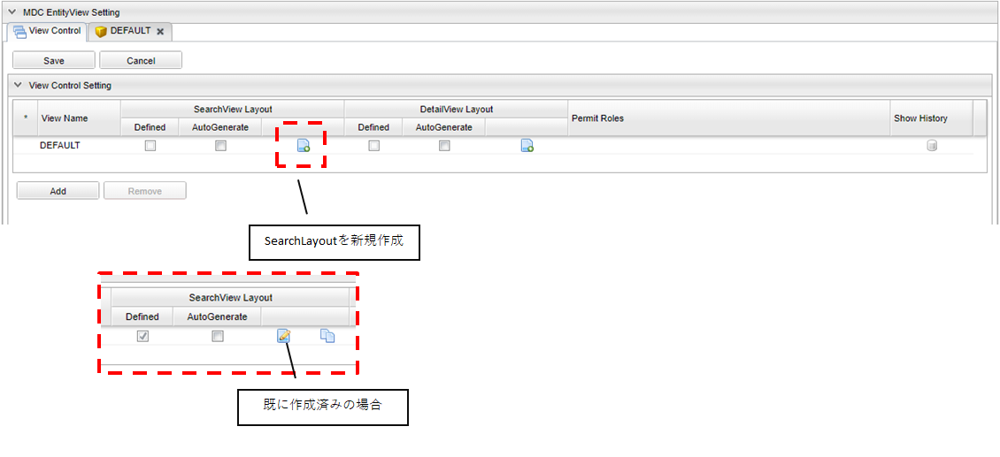
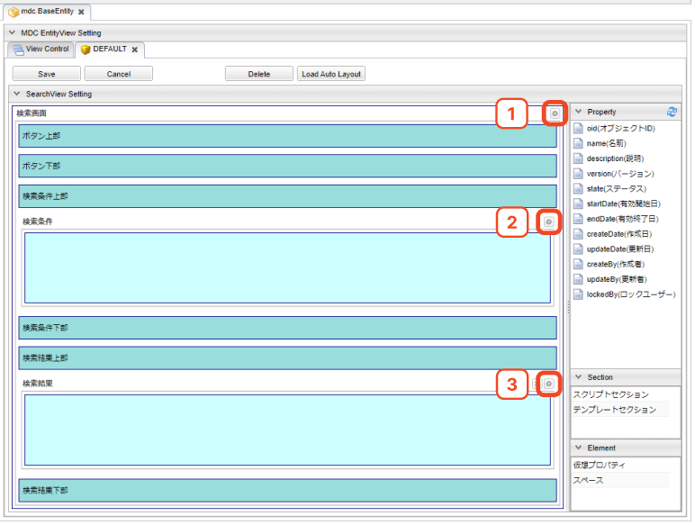

[[searchlayout]]
== 検索画面
検索画面の検索条件部、検索結果部のレイアウトをカスタマイズできます。
レイアウト設定を行わない場合、画面には基本項目及び、エンティティに登録されたプロパティが
エンティティ定義上での定義順で表示されます。

[[open_searchlayout]]
=== SearchLayoutの表示
ViewControlタブのViewControlSettingから追加もしくは編集のアイコンを押下すると、該当のView名 のSearchLayoutのタブが表示されます。

[[searchlayout_structure]]
=== SearchLayoutの構成
SearchLayoutは以下の構成になっています。

[[searchlayout_toolbar]]
==== ツールバー
紫枠の部分はSearchLayoutの各Viewに対する操作を行うためのボタン群です。

[cols="1,4a", options="header"]
|===
|ボタン名
|説明

|Save
|カスタマイズしたViewをViewControlにセットします。この段階ではまだ定義は保存されません。ViewControlタブの先頭に `U` が表示されます(Update)。ViewControlタブで対象のViewを保存することでView定義が保存されます。

|Cancel
|Viewの変更を取り消します。
Saveボタン押下前の内容が消えるため、ボタンを押す際は確認してください。

|Delete
|表示しているViewをViewControlから削除します。SearchLayoutのタブは削除され、ViewControlタブの「Defined」がOFFの状態になり、先頭に `U` が表示されます(Update)。ViewControlタブで対象のViewを保存することでView定義から削除されます。

|Load Auto Layout
|View定義を設定しない場合に表示される自動生成画面と同等の設定をロードします。

|===

[[searchlayout_addsection]]
==== 追加セクション
青枠の部分は検索画面の該当部分にカスタマイズを入れるための機構です。
画面右側の `Section` 内の部品をドラッグ&ドロップで配置できます。
定義済みのテンプレートやHTMLベースのスクリプトを組み込むことができます。

[[searchlayout_condition_result]]
==== 検索条件セクション・検索結果セクション
緑枠の部分はエンティティのプロパティを配置する領域です。画面右側の `Property` 、 `Element` 内の部品をドラッグ&ドロップで配置できます。
SearchLayoutが作成されてない状態の場合、検索画面表示時にはエンティティのプロパティが自動で配置されます。 +
エンティティの参照プロパティはフォルダのアイコンになっています。ダブルクリックで展開することにより、参照プロパティの参照先エンティティが持つプロパティを検索条件セクションと検索結果セクションに配置することもできます。

[[searchview_setting]]
=== 検索画面の設定
図の①部分をクリックすると検索画面全体に対する設定を行うダイアログが表示されます。

[cols="1,4a", options="header"]
|===
|設定項目
|設定内容

|画面タイトル
|画面に表示するタイトルを入力します。
未入力の場合、エンティティの `Display Name` に設定された内容を画面に表示します。

|アイコンタグ
|タイトルの前に表示するアイコンを設定できます。 +
link:https://materialdesignicons.com/[Material Design Icons^]のアイコンタグを設定できます。（例：mdi-note）

|標準ボタン設定
|検索条件表示ボタンや新規登録ボタンなど、標準で提供されるボタンの設定をカスタマイズします。
詳細は<<search_base_button_setting, 標準ボタン設定>>を参照してください。

|ごみ箱操作をユーザー削除データに限定
|ごみ箱内のデータ操作（取得/復元/削除）を削除したユーザーのみに限定する場合はチェックを入れます。
限定する場合、管理者ユーザーも他者削除データは操作ができなくなります。

|検索WebApi
|検索ボタンクリックで実行されるWebApiを設定します。

|一括削除WebApi
|削除ボタンクリックで実行されるWebApiを設定します。

|条件削除WebApi
|全選択チェック時に削除ボタンクリックで実行されるWebApiを設定します。

|一括更新WebApi
|一括更新ボタンクリックで実行されるWebApiを設定します。

|条件更新WebApi
|全選択チェック時に一括更新ボタンクリックで実行されるWebApiを設定します。

|画面上部のカスタムボタン
|タイトル領域の下に表示する独自のボタンを設定します。
詳細は<<searchview_button_setting, ボタン設定>>を参照してください。

|検索結果上部のカスタムボタン
|検索結果上部のボタン配置領域に表示する独自のボタンを設定します。
詳細は<<searchview_button_setting, ボタン設定>>を参照してください。

|データの多言語化
|データ操作時に多言語化する場合はチェックします。
チェックした場合、エンティティ定義の `Data Localization` 設定を有効にしてデータアクセスします。

|物理削除するか
|チェックした場合、検索画面(結果部)の `削除` ボタンクリック時にデータを物理削除します。
未チェックの場合、削除データはごみ箱に移動します。

|特定バージョンを削除
|バージョン管理されているEntityの削除時に指定されたバージョンのみを削除します。親子関係の参照を持つ場合はエラーになります。

WARNING: バージョン指定削除は、親子関係の参照を持つEntityはサポートしていないためエラーになります。また、バージョン指定して削除されたEntityはごみ箱へは格納されません。

|UserPropertyEditor利用時に特権実行でユーザー名を表示する
|UserPropertyEditorが設定されているプロパティに対し、ユーザー情報のEntity、またはユーザー名のプロパティに参照権限が無いユーザーでも、特権実行をしてユーザー名を表示することができます。

|Entity権限における限定条件の除外設定
|Entity権限における限定条件を除外する参照先を指定します。

|EQLカスタム処理クラス名
|検索実行前にクエリ等のカスタマイズを行いたい場合は `SearchQueryInterceptor` インターフェースを実装するクラスを指定してください。
詳細は<<MdcCustomize_Search, カスタム検索処理>>を参照してください。

|===

[[search_base_button_setting]]
==== 標準ボタン設定
検索条件表示ボタンや新規登録ボタンなど、標準で提供されるボタンの設定をカスタマイズします。
[cols="1,4a", options="header"]
|===
|設定項目
|設定内容

|表示
|未チェックの場合、ボタンを表示しません。

|表示判定スクリプト
|表示可否を実行時に動的に判定するGroovyScriptを設定します。
詳細は<<searchview_judgedisplayscript, 表示判定スクリプト>>を参照してください。

|表示ラベル
|ボタンに表示するラベルを設定します。

|アイコンタグ
|タイトルの前に表示するアイコンを設定できます。 +
link:https://materialdesignicons.com/[Material Design Icons^]のアイコンタグを設定できます。（例：mdi-note）

|CSSクラス名
|スタイルシートのクラス名を指定します。
複数指定する場合は半角スペースで区切ってください。

|ツールチップ
|ツールチップを指定します。

|カスタムクリックイベント
|ボタンクリック時に実行されるカスタムJavaScriptコードを設定します。
|===

検索条件ダイアログ起動ボタン設定には以下の項目が追加されています。

[cols="1,4a", options="header"]
|===
|設定項目
|設定内容

|条件設定前の表示ラベル
|条件設定前の検索条件ダイアログ起動ボタンに表示するラベルを設定します。

|条件設定前のアイコンタグ
|条件設定前の検索条件ダイアログ起動ボタンに表示するアイコンを設定できます。 +
link:https://materialdesignicons.com/[Material Design Icons^]のアイコンタグを設定できます。（例：mdi-note）

|条件設定前のCSSクラス名
|条件設定前の検索条件ダイアログ起動ボタンに設定するスタイルシートのクラス名を指定します。
複数指定する場合は半角スペースで区切ってください。
|===

NOTE: 検索実行ボタン、選択ボタンには `表示フラグ` `表示判定スクリプト` 設定はありません。

.カスタムクリックイベントの変数
カスタムクリックイベントとして実行するJavaScriptには、以下の変数がバインドされます。
====
defaultHandler:: デフォルトのイベントハンドラー関数
event:: DOMネイティブイベント
selectionList:: 検索結果部で選択されているデータ
searchCondition:: 現在の検索条件
sortCondition:: 現在のソート条件
page:: 現在表示されているページ
searchResult:: 検索結果一覧
searchViewDefinition:: SearchView定義
====

[[searchview_button_setting]]
==== カスタムボタン設定
画面内に追加するカスタムボタンに対して設定を行います。
[cols="1,4a", options="header"]
|===
|設定項目
|設定内容

|表示
|チェックした場合、ボタンを表示します。

|表示判定スクリプト
|表示可否を判定するスクリプトを設定します。
詳細は<<searchview_judgedisplayscript, 表示判定スクリプト>>を参照してください。

|表示ラベル
|ボタンに表示するラベルを設定します。

|アイコンタグ
|タイトルの前に表示するアイコンを設定できます。 +
link:https://materialdesignicons.com/[Material Design Icons^]のアイコンタグを設定できます。（例：mdi-note）

|プライマリ
|設定するとボタンを強調表示します。

|CSSクラス名
|スタイルシートのクラス名を指定します。
複数指定する場合は半角スペースで区切ってください。

|表示方法
|ボタンの表示方法を設定します。

SOLO:: 単一ボタンとして表示
MENU:: メニューから選択するボタンとして表示

|クリックイベント
|ボタンクリック時に実行されるJavaScriptコードを設定します。

|===

.クリックイベントの変数
クリックイベントとして実行するJavaScriptには、以下の変数がバインドされます。
====
selectionList:: 検索結果部で選択されているデータ
searchCondition:: 現在の検索条件
sortCondition:: 現在のソート条件
page:: 現在表示されているページ
searchResult:: 検索結果一覧
searchViewDefinition:: SearchView定義
====

[[searchview_downloadbutton_setting]]
==== ダウンロードボタン設定
画面内に追加するダウンロードボタンに対して設定を行います。
[cols="1,4a", options="header"]
|===
|設定項目
|設定内容

|表示
|未チェックの場合、ボタンを表示しません。

|表示判定スクリプト
|表示可否を実行時に動的に判定するGroovyScriptを設定します。
詳細は<<searchview_judgedisplayscript, 表示判定スクリプト>>を参照してください。

|表示ラベル
|ボタンに表示するラベルを設定します。

|アイコンタグ
|タイトルの前に表示するアイコンを設定できます。 +
link:https://materialdesignicons.com/[Material Design Icons^]のアイコンタグを設定できます。（例：mdi-note）

|CSSクラス名
|スタイルシートのクラス名を指定します。
複数指定する場合は半角スペースで区切ってください。

|ツールチップ
|ツールチップを指定します。

|カスタムクリックイベント
|ボタンクリック時に実行されるカスタムJavaScriptコードを設定します。

|Entityデータのファイル形式
|ダウンロードで利用するファイル形式を指定します。

CSV::
CSVファイルを利用します。

EXCEL::
EXCELファイルを利用します。

SPECIFY::
CSVファイルかEXCELファイルのどちらを利用するかを画面で選択します。

未指定の場合は、<<../../../serviceconfig/index.adoc#MdcConfigService, MdcConfigService>> の `fileSupportType` によって動作します。

|ダウンロードアクション
|ダウンロードボタンクリックで実行されるアクションを設定します。

|ダウンロードダイアログを非表示
|ダウンロードボタン押下時に、出力内容を選択するダイアログを表示しない場合はチェックします。

|ダウンロード時oidを出力しない
|ダウンロードファイルにエンティティデータのoidを出力しない場合はチェックします。

|ダウンロード時BinaryReferenceを出力しない
|ダウンロードファイルにエンティティデータのBinaryReference（nameのみ）を出力しない場合はチェックします。

|ダウンロード時referenceを出力しない
|ダウンロードファイルにエンティティデータのReferenceを出力しない場合はチェックします。
未チェックの場合、oidを出力しない設定がされている場合はname項目または `表示ラベルとして扱うプロパティ` として指定された項目のみ、
されていない場合はoidとname項目または `表示ラベルとして扱うプロパティ` として指定された項目が出力されます。

|ダウンロード時表示名を出力しない
|Upload形式のダウンロードファイルのヘッダに、表示名を出力しないようにします。
チェックした場合、ダウンロードダイアログで、「ヘッダ行に表示名を利用しない」選択オプションを表示しません。

|多重度プロパティ出力形式
|ダウンロードファイルの出力で、多重度が複数のプロパティ（Reference以外）の出力形式を指定します。

EACH_COLUMN::
多重度の数分別々の列に出力します。

ONE_COLUMN::
１つの列にカンマ区切りでまとめて出力します。

ONE_COLUMN_FILL_NULL_VALUE::
１つの列にカンマ区切りでまとめて出力します。
登録データが多重度分保存されていない場合にも多重度分空を補完します。

|ダウンロード時文字コードを指定可能にする
|ダウンロードファイルの形式がCSVの場合に、ダウンロード時に文字コードを選択可能にするかを設定します。

SPECIFY:: 文字コード指定を可能にする
NOT_SPECIFY:: 文字コード指定を不可にする

|ダウンロード件数の上限値
|ダウンロード件数の上限値を設定します。
データを取得する際に制限をかけます。
設定されていない場合、<<../../../serviceconfig/index.adoc#MdcConfigService, MdcConfigService>> の `fileDownloadMaxCount` が上限となります。

WARNING: SQLServerにおいて上限値を指定する場合は、
service-configにて <<../../../serviceconfig/index.adoc#EntityFileUploadService,EntityFileUploadService>> の `mustOrderByWithLimit` を `true` にしてください。

|Upload形式のダウンロード時に一括でロードする
|Upload形式のダウンロードで、多重度複数の参照を含む場合に一括でロードをするかを設定します。
一括でロードしない場合は、 `ロード単位` 設定によって分割してロードを行います。

NOTE: 一括でロードすることにより、内部のSQL処理を減らすことが可能ですが、参照データ分内部にメモリ展開されるため、
大量の多重度複数の参照先プロパティが定義されていたり、参照先のデータ件数が多い場合は注意してください。

|Upload形式のファイルダウンロード時のロード単位
|Upload形式のファイルダウンロードで、多重度複数の参照を含む場合に一度にロードする件数を設定します。
`一括でロードする` 設定がONの場合はこの設定は無視されます。
未指定の場合は、<<../../../serviceconfig/index.adoc#MdcConfigService, MdcConfigService>> の `uploadableFileDownloadLoadSize` 値をロード単位として処理を行います。

ロード単位が1以下の場合は、1件ずつロードを行います。

|ダウンロード項目
|アップロード形式ではないダウンロードファイルに対して、検索結果に設定されている項目ではなく、直接出力項目を指定したい場合に設定します。
カンマ区切りで出力対象のプロパティ名を指定します。参照項目のプロパティなどは.プロパティ名で指定します。
(参照項目自体が指定された場合は参照項目のnameを出力)

`ダウンロード項目` が設定されてる場合は、 `ダウンロード時oidを出力しない` 、 `ダウンロード時BinaryReferenceを出力しない` 、 `ダウンロード時referenceを出力しない` の各設定は無視します。

|ダウンロード項目(アップロード形式)
|アップロード形式のダウンロードファイルに対して、直接出力項目を指定したい場合に設定します。
カンマ区切りで出力対象のプロパティ名を指定します。参照プロパティに対する参照先エンティティのプロパティは指定できません。

`oid` が含まれていない場合は自動で追加されます。 対象Entityがバージョン管理されていて `version` が含まれていない場合は自動で追加されます。

|ダウンロードファイル名Format
|ダウンロードするファイル名のフォーマットを設定します。
詳細は<<entityview_filenameformat, ファイル名Format>>を参照してください。

====
${fileName}_${yyyy}${MM}${dd}
====

|カスタムダウンロード検索処理クラス名
|ダウンロード時、検索実行前にクエリ等のカスタマイズを行いたい場合は `SearchQueryInterceptor` インターフェースを実装するクラスを指定してください。
詳細は<<MdcCustomize_Search, カスタム検索処理>>を参照してください。

|===

[[entityview_filenameformat]]
.ファイル名Format
ファイルダウンロード時のファイル名をGroovyTemplate書式を利用して指定します。
また、/とスペースについては、_（アンダースコア）に変換します。

利用可能なバインド変数は、編集ダイアログの「Notes」を参照してください。

.（例）ファイル名の後ろに出力時の時間を付加する。
[source,groovy]
----
${fileName}_${yyyy}${MM}${dd}${HH}${mm}${ss}
----

[[searchview_uploadbutton_setting]]
==== アップロードボタン設定
画面内に追加するアップロードボタンに対して設定を行います。
[cols="1,4a", options="header"]
|===
|設定項目
|設定内容

|表示
|未チェックの場合、ボタンを表示しません。

|表示判定スクリプト
|表示可否を実行時に動的に判定するGroovyScriptを設定します。
詳細は<<searchview_judgedisplayscript, 表示判定スクリプト>>を参照してください。

|表示ラベル
|ボタンに表示するラベルを設定します。

|アイコンタグ
|タイトルの前に表示するアイコンを設定できます。 +
link:https://materialdesignicons.com/[Material Design Icons^]のアイコンタグを設定できます。（例：mdi-note）

|CSSクラス名
|スタイルシートのクラス名を指定します。
複数指定する場合は半角スペースで区切ってください。

|ツールチップ
|ツールチップを指定します。

|カスタムクリックイベント
|ボタンクリック時に実行されるカスタムJavaScriptコードを設定します。

|Entityデータのファイル形式
|アップロードで利用するファイル形式を指定します。

CSV::
CSVファイルを利用します。

EXCEL::
EXCELファイルを利用します。

SPECIFY::
CSVファイルかEXCELファイルのどちらを利用するかを画面で選択します。

未指定の場合は、<<../../../serviceconfig/index.adoc#MdcConfigService, MdcConfigService>> の `fileSupportTypeForUpload` によって動作します。

|アップロードで登録を許可しない
|アップロードファイル実行でデータベースにデータを登録禁止する場合はチェックします。

|アップロードで更新を許可しない
|アップロードファイル実行でデータベースにデータを更新禁止する場合はチェックします。

|アップロードで削除を許可しない
|アップロードファイル実行でデータベースにデータを削除禁止する場合はチェックします。

|アップロードで登録項目
|アップロードによる更新を許可するデータ項目。

`アップロードで登録を許可しない` がチェックされてる場合は、 `アップロードで登録項目` の設定は設定は無効になります。

|アップロードで更新項目
|アップロードによる更新を許可するデータ項目。

`アップロードで更新を許可しない` がチェックされてる場合は、 `アップロードで更新項目` の設定は設定は無効になります。

|アップロードトランザクションタイプ
|アップロード時のコミットタイミングを設定します。

ONCE::
ファイルの全行の処理が終わった時点でコミットされます。

DIVISION::
<<../../../serviceconfig/index.adoc#MdcConfigService, MdcConfigService>> の `fileUploadCommitCount` で設定された単位でコミットされます

未指定の場合は、ファイルの全行の処理が終わった時点でコミットされます。

|アップロードサンプルダウンロード時表示名を出力しない
|Upload形式のダウンロードファイルのヘッダに、表示名を出力しないようにします。
チェックした場合、ダウンロードダイアログで、「ヘッダ行に表示名を利用しない」選択オプションを表示しません。

|アップロード更新データTargetVersion(非バージョン管理)
|バージョン管理Entity以外の場合のアップロードの更新データに対するTargetVersionを設定します。

SPECIFIC::
データのreference項目のreferenceデータバージョンを指定バージョンに更新する。

CURRENT_VALID::
データのreference項目のreferenceデータバージョンを現在有効バージョンに更新する。

未指定の場合は、`CURRENT_VALID` を設定値として行います。

|バージョン管理Entity以外の場合にアップロード画面でTargetVersionの指定を許可
|`アップロード更新データTargetVersion(非バージョン管理)` の設定値は画面で指定する。
チェックした場合、「保存時のデータを更新対象にする」オプションが画面に表示されます。当該画面オプションをチックする場合、`アップロード更新データTargetVersion(非バージョン管理)`　の値はSPECIFICに設定します。
チェックオフの場合は、CURRENT_VALIDに設定します。

|アップロードWebAPI名
|アップロードボタンクリックで実行する時アクセスAPIを設定します。

|カスタムアップロード検索処理クラス名
|アップロード時に、行うカスタム登録処理のクラス名を指定します。`org.iplass.mtp.mdc.view.entityview.search.SearchFormFileUploadInterrupter` インターフェースを実装するクラスを指定してください。"
詳細は<<MdcCustomize_Upload, カスタムアップロード>>を参照してください。

|===

[[searchview_judgedisplayscript]]
==== 表示判定スクリプト
表示可否を判定するGroovyScriptを設定します。
スクリプトが未指定か、スクリプトの実行結果がtrueの場合、表示されます。

以下のオブジェクトがバインドされています。

====
request:: リクエスト
session:: セッション
user:: ユーザー
====

[[searchcondition_setting]]
=== 検索条件セクションの設定
図の②部分をクリックすると検索条件セクションに対する設定を行うダイアログが表示されます。

[cols="1,4a", options="header"]
|===
|設定項目
|設定内容

|詳細条件の表示件数
|詳細条件に初期表示する条件の数を設定します。

|詳細検索を非表示
|詳細検索タブを非表示にする場合はチェックします。

|定型検索を非表示
|定型検索タブを非表示にする場合はチェックします。

|バージョン管理Entity以外の場合に参照先の保存時バージョンの検索を許可
|バージョン管理していないEntityに、バージョン管理している参照先プロパティ（参照タイプとして `最新バージョンを取得` と定義）を保持しているEntityに対して、
保存時のバージョンの検索を可能にします。
検索画面に `保存時のデータを検索` オプションが表示されます。

NOTE: バージョン管理しているEntityの場合は、 `すべてのバージョンを検索` を指定することで、保存時のデータが検索されます。

|重複行をまとめる
|チェックした場合、重複行をまとめます。
検索時に `distinct` を付与します。

|デフォルト検索条件
|検索画面上には表示されず、検索時に自動的に付与される検索条件をPreparedQuery形式で指定します。
WHERE句に指定する条件を指定してください。
詳細は<<default_search_cond, デフォルト検索条件>>を参照してください。

|フィルタ設定
|定型検索で使用するフィルタを設定します。
未指定の場合は全てのフィルタが対象になります。

|検索時にデフォルト検索条件をフィルタ定義と一緒に利用するか
|フィルタ定義を使う検索（定型検索）で、フィルタ定義と一緒にデフォルト検索条件を適用する場合にチェックします。

チェックした場合:: フィルタの条件＋デフォルト検索条件
チェックしない場合:: フィルタの条件のみ

|デフォルトプロパティ条件設定スクリプト
|検索画面(条件部)の各プロパティの初期検索条件をGroovyScript形式で設定します。
詳細は<<defaultconditionscript, デフォルトプロパティ条件設定スクリプト>>を参照してください。

|ソート設定|検索時にデフォルトで設定されるソート条件を設定します。
<<searchview_sortsetting, ソート設定>>を参照してください。

|検索時にソートしない
|検索時に結果をソートしない場合はチェックします。

|全文検索時にソートする
|全文検索時にソートする場合はチェックします。

|===

[[default_search_cond]]
==== デフォルト検索条件
PreparedQuery形式でWHERE句に指定する条件を指定してください。以下がバインドされています。

.独自のバインド変数
独自に以下の変数がバインドされています。
====
request:: リクエスト
session:: セッション
====

.PreparedQueryのバインド変数、関数
PreparedQueryとして以下の変数、関数が利用できます。
====
user:: 実行するユーザーの情報 *1
date:: 現在日時のjava.util.Dateのインスタンス。
sysdate:: 現在日付（時間含まず）の文字列。 +
例 : 2011-01-20
sysdatetime:: 現在日時の文字列。 +
例 : 2011-01-18 02:05:03.348
systime:: 現在時間の文字列。 +
例 : 23:19:00

toIn(Collection/Array)::
引数をinの文字列表現に変換。 +
利用例 : ";oid in (${toIn(user.groupOid)})";
toDateString(Date)::
引数を日付の文字列表現に変換。 +
利用例 : ";startDate > '${toDateString(date)}'";
toLocalDateString(Date)::
引数をローカル日付の文字列表現に変換。 +
利用例 : ";startDate > '${toLocalDateString(date)}'";
toDateTimeString(Date)::
引数を日時の文字列表現に変換。 +
利用例 : ";startDateTime > '${toDateTimeString(date)}'";
toTimeString(Date)::
引数を時間の文字列表現に変換。 +
利用例 : ";startTime > '${toTimeString(date)}'";
toLocalTimeString(Date)::
引数をローカル時間の文字列表現に変換。 +
利用例 : ";startTime > '${toLocalTimeString(date)}'";
addYear(Date, int)::
引数に指定の年を加えたjava.util.Dateインスタンスを取得する。 +
利用例 : ";startDate > '${toDateString(addYear(date, -1))}'";
addMonth(Date, int)::
引数に指定の月を加えたjava.util.Dateインスタンスを取得する。 +
利用例 : ";startDate > '${toDateString(addMonth(date, 3))}'";
addWeek(Date, int)::
引数に指定の週を加えたjava.util.Dateインスタンスを取得する。 +
利用例 : ";startDate > '${toDateString(addWeek(date, -2))}'";
addDay(Date, int)::
引数に指定の日を加えたjava.util.Dateインスタンスを取得する。 +
利用例 : ";startDate > '${toDateString(addDay(date, 10))}'";
addHour(Date, int)::
引数に指定の時間を加えたjava.util.Dateインスタンスを取得する。 +
利用例 : ";startDateTime > '${toDateTimeString(addHour(date, -12))}'";
addMinute(Date, int)::
引数に指定の分を加えたjava.util.Dateインスタンスを取得する。 +
利用例 : ";startTime > '${toTimeString(addMinute(date, 30))}'";
addSecond(Date, int)::
引数に指定の秒を加えたjava.util.Dateインスタンスを取得する。 +
利用例 : ";startTime > '${toTimeString(addSecond(date, -10))}'";
addMillisecond(Date, int)::
引数に指定のミリ秒を加えたjava.util.Dateインスタンスを取得する。 +
利用例 : ";startDateTime > '${toDateTimeString(addMillisecond(date, -500))}'";
====

.*1 userについて
userが所属するグループに関する以下の変数、関数を呼び出すことが出来ます。
====
groupCode::
所属グループのグループコードのString[]。
groupCodeWithChildren::
所属グループ(配下グループ含む)のグループコードのString[]。
groupCodeWithParents::
所属グループ(上位グループ(ルートまで)含む)のグループコードのString[]。
groupOid::
所属グループのoidのString[]。
groupOidWithChildren::
所属グループ(配下グループ含む)のグループのoidのString[]。
groupOidWithParents::
所属グループ(上位グループ(ルートまで)含む)のグループのoidのString[]。
memberOf(String)::
引数のグループコードのメンバ(サブグループに所属していても)の場合trueを返す。
====

.GroovyTemplateのバインド変数、関数
GroovyTemplateとして以下の変数、関数が利用できます。
====
out:: Writer
em:: EntityManager
edm:: EntityDefinitionManager
auth:: AuthContext

escHtml(Object):: 引数をHtmlエスケープ
escJs(Object):: 引数をJavaScriptエスケープ
escSql(Object):: 引数をSQLエスケープ
escSqlLike(Object):: 引数をLike用SQLエスケープ
nte(Object):: 引数がnullの場合空文字に
====

.設定例
[source,groovy]
----
<%@import java.sql.Timestamp%>
<%@import java.text.SimpleDateFormat %>
<%
def date = new SimpleDateFormat("yyyy/MM/dd").parse("2012/09/06");
def timestamp = new Timestamp(date.getTime());
%>
createDate<='${timestamp}' and createBy='${user.getAttribute("oid")}'
----

[[defaultconditionscript]]
==== デフォルトプロパティ条件設定スクリプト
検索画面(条件部)の各プロパティの初期検索条件をGroovyScript形式で設定します。変数としてinitCondMap (Map<String, Object>) がバインドされています。
initCondMapに対して、 `key: プロパティ名` 、 `value: 初期検索条件とする値` を設定すると初期検索条件として値が設定されます。

初期検索条件は、検索画面の場合はクエリパラメータ (例: sc_name=hoge&sc_value=fuga)、選択画面の場合は選択画面パラメータ生成スクリプトや選択画面カスタムパラメータJavaScriptによっても指定可能です。これらが指定された場合には、initCondMapにあらかじめ値が追加された状態になっています。

また、各プロパティの初期検索条件だけではなく、画面表示時に検索を即実行すること (es=t、initCondMap.put("es","t")) や初期の検索タイプを詳細検索にすること (searchType=Detail、initCondMap.put("searchType","Detail")) なども可能です。

[source,groovy]
----
// String、AutoNumber、Boolean
initCondMap.put("string", "abcdefg"); //String
initCondMap.put("autoNumber", "12345678"); //AutoNumber
initCondMap.put("boolean", false); //Boolean

// Date、Time、DateTime(from、to指定は配列で指定)
String[] dateArray = ["20230101","20230103"]; //yyyyMMdd
initCondMap.put("date", dateArray);
String[] timeArray = ["","203040"]; //HHmmss
initCondMap.put("time", timeArray);
String[] dateTimeArray = ["20230101010203"]; //yyyyMMddHHmmss
initCondMap.put("dateTime", dateTimeArray);

// Integer、Float、Decimal(from、to指定は配列で指定)
String[] intArray = ["100", "1000"]; //文字列指定
initCondMap.put("integer", intArray); //Integer
String[] floatArray = ["100.5"]; //文字列指定
initCondMap.put("float", floatArray); //Float
String[] decimalArray = ["", "1000.5"]; //文字列指定
initCondMap.put("decimal", decimalArray); //Decimal

// Select(単一選択)
initCondMap.put("select", "val1");
// Select(複数選択)
String[] selectArray = ["val1","val3"]; //値を指定
initCondMap.put("select2", selectArray);
// 下の形式は不可。[]はGroovyではjava.util.List形式に変換されるのでエラー。配列のみ可。
// initCondMap.put("select", ["val1","val3"]);

// Reference
String[] referenceArray = ["6275503","6275505"]; //OID
initCondMap.put("ref1", "ref002"); //TEXT,名前 or 表示ラベルとして扱うプロパティ指定
initCondMap.put("ref2", referenceArray); //LABEL,OID指定(配列)
initCondMap.put("ref3", "ref002"); //LABEL,名前 or 表示ラベルとして扱うプロパティ指定
initCondMap.put("ref4", referenceArray); //LINK,OID指定(配列)
initCondMap.put("ref5", "6275503"); //SELECT,OID指定
initCondMap.put("ref6", referenceArray); //CHECKBOX,OID指定(配列)
initCondMap.put("ref7", referenceArray); //HIDDEN,OID指定(複数時は配列)

// User
initCondMap.put("createBy", "者"); //名前のLike検索
----

[[searchview_sortsetting]]
==== ソート設定
検索実行時および、検索結果エリアに配置された並び替えボタンによるソート時に設定されるソート条件を設定します。 +

ソート設定が未指定の場合::
検索実行時は、当該エンティティのOIDの降順でソートします。 +
検索結果エリアに配置された並び替えボタンによるソート時は、指定された項目でソートします。 +
参照プロパティがソート項目として指定された場合、表示中の項目でソートします（<<searchconditionreferencepropertyeditor,ReferencePropertyEditor>> の「表示ラベルとして扱うプロパティ」が未設定の場合、 `name` でソートし、プロパティが設定された場合は、表示ラベルとして扱うプロパティでソートします）。

ソート設定が指定された場合::
検索実行時は、ソート設定に指定された項目でソートします。 +
検索結果エリアに配置された並び替えボタンによるソート時は、指定された項目を第１キー、ソート設定に指定された項目を第２キー以降としてソートします。

[cols="1,4a", options="header"]
|===
|設定項目
|設定内容

|ソート項目
|検索時にデフォルトで指定するソート項目を設定します。 +
参照プロパティが指定された場合の挙動は以下の通りです。

参照プロパティ自体が設定された場合（例：reference）::
<<searchconditionreferencepropertyeditor,ReferencePropertyEditor>> の「表示ラベルとして扱うプロパティ」が未設定の場合、 `name` でソート。設定された場合は、表示ラベルとして扱うプロパティでソートします。

参照先エンティティの特定のプロパティまで指定された場合（例：reference.oid） ::
ソート項目で明示指定された参照先エンティティのプロパティ（例の場合、 `oid`）でソートします。

|ソート種別
|検索時にデフォルトで指定するソート種別を設定します。

|null項目のソート順
|null項目のソート順を設定します。

NONE:: 未指定、DB依存
FIRST:: null項目を先頭にソート
LAST:: null項目を後尾にソート
|===

[[searchresult_setting]]
=== 検索結果セクションの設定
図の③部分をクリックすると検索結果セクションに対する設定を行うダイアログが表示されます。

[cols="1,4a", options="header"]
|===
|設定項目
|設定内容

|検索結果の表示タイプ
|検索結果の表示タイプを設定します。デフォルトは、 `CARD` です。

CARD:: カード形式で表示
TABLE:: テーブル形式で表示
SWITCH:: カード形式で表示するか、テーブル形式で表示するかを画面上のスイッチで切り替えられる表示タイプ

|検索結果での詳細画面の表示タイプ
|検索結果での詳細・編集画面の表示タイプを設定します。
未指定の場合は、<<../../../serviceconfig/index.adoc#MdcConfigService, MdcConfigService>> で定義される `searchResultDetailViewType` が適用されます。

DIALOG:: ダイアログで表示
TWO_PANE:: 2ペインで表示

|検索結果の表示件数
|検索結果の表示件数を設定します。
未指定の場合、または0以下の場合は、<<../../../serviceconfig/index.adoc#MdcConfigService, MdcConfigService>>
で定義される `searchResultDispRowCount` が適用されます。

|BulkViewレイアウト定義を利用
|BulkLayout定義を利用して一括更新画面を生成し、複数項目を一括更新します。

|一括更新の排他制御起点
|一括更新の排他制御起点。

WHEN_DIALOG_OPEN:: 更新ダイアログが開く時
WHEN_SEARCH:: 検索実行時

|一括更新デフォルト選択項目
|一括更新デフォルト選択項目。
BulkViewレイアウト定義を利用しない場合、デフォルト選択項目を指定します。

|データの多言語化
|データ操作時に多言語化する場合はチェックします。
チェックした場合、エンティティ定義の `Data Localization` 設定を有効にしてデータアクセスします。

|親子関係の参照を物理削除
|チェックした場合、削除時に親子関係を参照します。
一括更新画面での保存時に削除したデータも物理削除されます。

|更新時に強制的に更新処理を行う
|変更項目が一つもなくとも、強制的に更新処理（更新日時、更新者が更新される）を行います。

|カスタムロード処理クラス名
|エンティティのロード時にオプション等のカスタマイズを行いたい場合は `BulkUpdateLoadEntityInterceptor`
インターフェースを実装するクラスを指定してください。
詳細は<<MdcCustomize_BulkUpdateLoad, カスタムロード(単一項目)処理>>を参照してください。

|カスタム一括更新処理クラス名
|一括更新時にカスタマイズ処理を行いたい場合は `BulkUpdateInterceptor`
インターフェースを実装するクラスを指定してください。
詳細は<<MdcCustomize_BulkUpdate, カスタム一括更新(単一項目)処理>>を参照してください。

|一括更新コミットトランザクション制御
|一括更新をするとき、一斉に実行するか（ONCE）、バッチに分けて実行するか（DIVISION）を決めます。

ONE:: 一括で更新を実行
DIVISION:: バッチを用いて設定した件数で分けて更新を実行（デフォルトで100件）

|カスタム一括削除処理クラス名
|エンティティの一括削除時に絞込み等のカスタマイズを行いたい場合は `DeleteListInterceptor`
インターフェースを実装するクラスを指定してください。
詳細は<<MdcCustomize_Delete, カスタム一括削除処理>>を参照してください。

|条件削除コミットトランザクション制御
|条件削除をするとき、一斉に実行するか（ONE）、バッチで実行するか（DIVISION）を決めます。

ONE:: 一括で削除を実行
DIVISION:: バッチを用いて設定した件数で分けて削除を実行（デフォルトで100件）

|検索結果をまとめる
|検索結果にて、OIDとVersionが同じであるレコードをまとめて表示する場合はチェックします。
まとめる設定がデフォルトとなります。

|ページングを非表示
|ページング部品を非表示にする場合はチェックします。
ページングを非表示にした場合でも、 `検索結果の表示件数` の表示件数が適用されます。

|件数を非表示
|ページングの下に表示されている検索件数を非表示にする場合はチェックします。

|編集ボタンを非表示
|編集ボタンを非表示にする場合はチェックします。

|ページング表示位置
|ページング部品の表示位置を設定します。

BOTH:: 検索結果の上下に表示
TOP:: 検索結果の上部に表示
BOTTOM:: 検索結果の下部に表示

|テーブル形式の場合のテーブルの高さ
|テーブル形式の場合のテーブルの高さ（px）を指定します。高さを指定した場合、ヘッダーが固定化されます。

|===

[[searchlayout_setting]]
=== 検索画面のレイアウト設定

[[searchlayout_section]]
==== セクションの設定
画面右側のSectionの項目を画面内の `ボタン上部` 、`ボタン下部` 、 `検索条件上部` 、 `検索条件下部` 、 `検索結果上部` 、 `検索結果下部` にドラッグ&ドロップすることでセクションを配置できます。

[[searchlayout_scriptsection]]
===== スクリプトセクション
GroovyTemplateで記述されたテンプレートを画面に組み込みます。
HTMLやスクリプト、Vue.jsのSFC形式（単一ファイルコンポーネント形式）などでテンプレートを記述できます。 +
テンプレートの実装方法の詳細については、link:../../../storybook/index.html?path=/docs/開発者ドキュメント-オリジナルテンプレート[コンポーネントカタログ^]を参照してください。

[cols="1,4a", options="header"]
|===
|設定項目
|設定内容

|表示
|チェックした場合、画面に表示します。

|表示判定スクリプト
|表示可否を判定するスクリプトを設定します。
詳細は<<searchview_judgedisplayscript, 表示判定スクリプト>>を参照してください。

|テンプレート文字列の解釈タイプ
|以下の3つから選択できます。

HTML:: HTMLとして解釈します。HTMLやスクリプトの記述が可能です。
VUE_SFC:: Vue.jsのSFC形式（単一ファイルコンポーネント形式）で記述されたコンポーネントとして解釈します。
VUE_SFC_LIKE:: Vue.jsのランタイムを用いてコンポーネントとして解釈します。MDCでは、Vue.jsのランタイムに加えてコンパイラもバンドルしており、Vue.jsのテンプレート構文を利用することが可能です。

|コンポーネント名
|コンポーネント名を設定します。 コンポーネント名は、英文字とハイフン(-)のみを利用したパスカルケースでの命名を推奨します。
テンプレート文字列の解釈タイプが `VUE_SFC_LIKE` の場合、コンポーネント名の指定は必須です。 テンプレート文字列の解釈タイプが `VUE_SFC` でコンポーネント名が未入力の場合、自動でランダムなコンポーネント名を割り当てます。

|スクリプト
|スクリプト編集画面を表示してGroovyTemplateの文法に従って記述します。
詳細は<<../../customizing/index.adoc#groovytemplate, GroovyTemplate>>を参照してください。

.独自のバインド変数
request変数には以下の変数がバインドされています。
====
request.componentName:: 指定したコンポーネント名(VUE_SFC_LIKEの場合)
request.entityDefinition:: エンティティ定義
request.element:: スクリプトセクション定義
====

|VUE_SFC形式のテンプレートをプリコンパイルするか
|Vue.jsのSFC形式のテンプレートをプリコンパイルするかを指定します。`テンプレート文字列の解釈タイプ` が `VUE_SFC` であり、Vue.jsのSFC形式のテンプレートを定義保存時にプリコンパイルしておきたい場合にチェックします。プリコンパイルしておくことで、コンポーネントの初期化処理を高速化できます。

[NOTE]
====
プリコンパイルの注意点::
- プリコンパイルを実行したい場合には、 `コンポーネント名` の指定が必須となります。
- `スクリプト` に記述したGroovyTemplateは、SearchView定義保存時に実行されてプリコンパイルされるため、リクエスト情報やセッション情報、ユーザー固有情報などを使用しないように注意してください。
====

|CSSクラス名
|スタイルシートのクラス名を指定します。
複数指定する場合は半角スペースで区切ってください。

|===

.VUE_SFC形式、VUE_SFC_LIKE形式の場合のコンポーネントとのデータ受け渡し（props/emit）

以下のデータがpropsとしてコンポーネントに引き渡されます。
====
contextMap:: コンテキストマップ。リアクティブなMapオブジェクト。次のデータが格納されています。
- searchCondition : 現在の検索条件
- sortCondition : 現在のソート条件
- searchResult : 検索結果一覧
- selectionList : 検索結果部で選択されているデータ（全文検索を除く）
- page : 現在表示されているページ（全文検索を除く）
- searchViewDefinition : SearchView定義（全文検索を除く）
====

[[searchlayout_templatesection]]
===== テンプレートセクション
別途定義したテンプレートを画面に組み込みます。 +
テンプレートの実装方法の詳細については、link:../../../storybook/index.html?path=/docs/開発者ドキュメント-オリジナルテンプレート[コンポーネントカタログ^]を参照してください。

[cols="1,4a", options="header"]
|===
|設定項目
|設定内容

|表示
|チェックした場合、画面に表示します。

|表示判定スクリプト
|表示可否を判定するスクリプトを設定します。
詳細は<<searchview_judgedisplayscript, 表示判定スクリプト>>を参照してください。

|テンプレート文字列の解釈タイプ
|記述されたテンプレート文字列の解釈タイプです。以下の３つから選択できます。

HTML:: HTMLとして解釈します。HTMLやスクリプトの記述が可能です。
VUE_SFC:: Vue.jsのSFC形式（単一ファイルコンポーネント形式）で記述されたコンポーネントとして解釈します。
VUE_SFC_LIKE:: Vue.jsのランタイムを用いてコンポーネントとして解釈します。MDCでは、Vue.jsのランタイムに加えてコンパイラもバンドルしており、Vue.jsのテンプレート構文を利用することが可能です。

|コンポーネント名
|コンポーネント名を設定します。 コンポーネント名は、英文字とハイフン(-)のみを利用したパスカルケースでの命名を推奨します。
テンプレート文字列の解釈タイプが `VUE_SFC_LIKE` の場合、コンポーネント名の指定は必須です。 テンプレート文字列の解釈タイプが `VUE_SFC` でコンポーネント名が未入力の場合、自動でランダムなコンポーネント名を割り当てます。

|テンプレート名
|登録済テンプレート名を設定します。

.独自のバインド変数
request変数には以下の変数がバインドされています。
====
request.componentName:: 指定したコンポーネント名(VUE_SFC_LIKEの場合)
request.entityDefinition:: エンティティ定義
request.element:: テンプレートセクション定義
====

|VUE_SFC形式のテンプレートをプリコンパイルするか
|Vue.jsのSFC形式のテンプレートをプリコンパイルするかを指定します。`テンプレート文字列の解釈タイプ` が `VUE_SFC` であり、Vue.jsのSFC形式のテンプレートを定義保存時にプリコンパイルしておきたい場合にチェックします。プリコンパイルしておくことで、コンポーネントの初期化処理を高速化できます。

[NOTE]
====
プリコンパイルの注意点::
- プリコンパイルを実行したい場合には、 `コンポーネント名` の指定が必須となります。
- `テンプレート名` で指定した登録済みのテンプレートは、SearchView定義保存時に実行されてプリコンパイルされるため、テンプレートの内容が変更された場合は再度SearchView定義を保存する必要があります。また、JSPやGroovyTemplateなどで記述されたテンプレートには、リクエスト情報やセッション情報、ユーザー固有情報などを使用しないように注意してください。
====

|CSSクラス名
|スタイルシートのクラス名を指定します。
複数指定する場合は半角スペースで区切ってください。

|===

.VUE_SFC形式、VUE_SFC_LIKE形式の場合のコンポーネントとのデータ受け渡し（props/emit）

以下のデータがpropsとしてコンポーネントに引き渡されます。
====
contextMap:: コンテキストマップ。リアクティブなMapオブジェクト。次のデータが格納されています。
- searchCondition : 現在の検索条件
- sortCondition : 現在のソート条件
- searchResult : 検索結果一覧
- selectionList : 検索結果部で選択されているデータ（全文検索を除く）
- page : 現在表示されているページ（全文検索を除く）
- searchViewDefinition : SearchView定義（全文検索を除く）
====

[[searchlayout_condition_element_setting]]
==== 検索条件エレメントの設定
画面要素を `検索条件セクション` 内にドラッグ&ドロップすることで、画面に配置できます。

[[searchlayout_condition_element_common_setting]]
===== 共通設定項目
各検索条件エレメントで共通の設定項目です。

[cols="1,4a", options="header"]
|===
|設定項目
|設定内容

|列情報
|検索条件要素の表示領域を設定します。
詳細は<<searchview_column_info, 列情報>>を参照してください。
|===

[[searchview_column_info]]
.列情報
MDCはコンテンツのレイアウト設定として全体を12ポイントとするグリッドシステムを利用します。
画面サイズに対するブレークポイントに対して、コンテンツを表示するサイズ（列数）を設定します。 +
列数に0が設定された場合は画面に表示されません。 +
各ブレークポイントは、<<../../../serviceconfig/index.adoc#MdcConfigService, MdcConfigService>>で設定可能です。

[cols="1,4a", options="header"]
|===
|設定項目
|設定内容

|Extra Smallサイズの列数
|画面サイズが600px以下の場合の列数の設定します。（設定範囲は0~12）

|Smallサイズの列数
|画面サイズが600px以上 960px以下の場合の列数の設定します。（設定範囲は0~12）

|Mediumサイズの列数
|画面サイズが960px以上 1264px以下の場合の列数の設定します。（設定範囲は0~12）

|Largeサイズの列数
|画面サイズが1264px以上 1904px以下の場合の列数の設定します。（設定範囲は0~12）

|Extra Largeサイズの列数
|画面サイズが1904px以上の場合の列数の設定します。（設定範囲は0~12）

|===

[[searchlayout_condition_space_element]]
===== スペース
スペースを設定します。複数列表示のセクションで空白のセルを作りたい場合に利用します。

設定可能な項目はありません。

[[searchlayout_result_element_setting]]
==== 検索結果エレメントの設定
画面要素を `検索結果セクション` 内にドラッグ&ドロップすることで、画面に配置できます。

[[searchlayout_result_element_common_setting]]
===== 共通設定項目
各検索結果エレメントで共通の設定項目です。

[cols="1,4a", options="header"]
|===
|設定項目
|設定内容

|テーブル形式の場合のテキスト配置位置
|テーブル形式の場合のテキスト配置位置を設定します。未指定の場合のデフォルトは、 `END` です。

START:: 左寄せ
CENTER:: 中央揃え
END:: 右寄せ

|テーブル形式の場合の列幅
|テーブル形式の場合の列幅（px）を設定します。

|===

[[searchcondition_property_setting]]
==== 検索条件プロパティの設定
検索条件に配置されたプロパティに対する設定を行います。

検索条件プロパティは検索条件エレメントの一種のため、 <<searchlayout_condition_element_common_setting, 検索条件エレメントの共通設定項目>>を持ちます。

[cols="1,4a", options="header"]
|===
|設定項目
|設定内容

|表示
|プロパティを画面に表示する場合はチェックします。

|表示判定スクリプト
|表示可否を判定するスクリプトを設定します。
詳細は<<searchview_judgedisplayscript, 表示判定スクリプト>>を参照してください。

|表示ラベル
|画面に表示するラベルを設定します。

|ヒント
|入力欄下部に表示する説明を設定します。

|CSSクラス名
|スタイルシートのクラス名を指定します。
複数指定する場合は半角スペースで区切って下さい。

|通常検索で非表示
|通常検索条件の項目として表示しない場合はチェックします。

|詳細検索で非表示
|詳細検索条件の項目として表示しない場合はチェックします。

|通常検索での必須項目
|通常検索条件の必須項目にする場合はチェックします。

|詳細検索での必須項目
|詳細検索条件の必須項目にする場合はチェックします。

|通常検索でのオプション表示項目
|通常検索条件のオプション表示項目にする場合はチェックします。

|プロパティエディタ
|検索条件プロパティエディタを設定します。
検索条件プロパティエディタの詳細については、<<properyeditor_searchcondition, 検索条件プロパティエディタ>>を参照してください。

|入力チェック
|入力チェック方法を設定します。
詳細は<<validation, 入力チェック>>を参照してください。
|===

[[validation]]
.入力チェック
検索実行時に検索条件に対する入力チェックを行います。
未指定の場合は入力チェックは行われません。
なお、現時点では複数項目のいずれかが必須かチェックする機能のみが実装されています。

[cols="1,4a", options="header"]
|===
|設定項目
|設定内容

|メッセージ
|入力チェックエラー時に表示するメッセージを設定します。

|通常検索で入力チェックを行う
|通常検索実行時に入力チェックを行う場合はチェックします。

|詳細検索で入力チェックを行う
|詳細検索実行時に入力チェックを行う場合はチェックします。

|対象プロパティ
|このプロパティと組み合わせて必須チェックを行うプロパティの名前を設定します。
参照プロパティのネストされた項目を指定する場合は `.(ドット)` でプロパティ名を連結します。
|===

[[searchlayout_searchconditionvirtualproperty]]
===== 検索条件仮想プロパティ
プロパティと同様の表示が出来る仮想プロパティを設定します。多重度は１のみサポートします。

[cols="1,4a", options="header"]
|===
|設定項目
|設定内容

|表示
|プロパティを画面に表示する場合はチェックします。

|表示判定スクリプト
|表示可否を判定するスクリプトを設定します。
詳細は<<searchview_judgedisplayscript, 表示判定スクリプト>>を参照してください。

|プロパティ名
|仮想プロパティの名前を設定します。
既に設定されている仮想プロパティの名前や、エンティティに定義されているプロパティと同じ名前は設定できません。

|表示ラベル
|画面に表示するラベルを設定します。

|ヒント
|入力欄下部に表示する説明を設定します。

|CSSクラス名
|スタイルシートのクラス名を指定します。
複数指定する場合は半角スペースで区切って下さい。

|通常検索で非表示
|通常検索条件の項目として表示しない場合はチェックします。

|詳細検索で非表示
|詳細検索条件の項目として表示しない場合はチェックします。

|通常検索での必須項目
|通常検索条件の必須項目にする場合はチェックします。

|詳細検索での必須項目
|詳細検索条件の必須項目にする場合はチェックします。

|通常検索でのオプション表示項目
|通常検索条件のオプション表示項目にする場合はチェックします。

|プロパティエディタ
|以下の型を選択します。表示したい内容に合わせて変更してください。
詳細は<<properyeditor_searchcondition, 検索条件プロパティエディタ>>を参照してください。

SearchConditionBooleanPropertyEditor +
SearchConditionDatePropertyEditor +
SearchConditionDecimalPropertyEditor +
SearchConditionFloatPropertyEditor +
SearchConditionIntegerPropertyEditor +
SearchConditionScriptPropertyEditor +
SearchConditionSelectPropertyEditor +
SearchConditionStringPropertyEditor(デフォルト) +
SearchConditionTimePropertyEditor +
SearchConditionTimestampPropertyEditor +
SearchConditionTemplatePropertyEditor +
SearchConditionUserPropertyEditor

|入力チェック
|入力チェック方法を設定します。
詳細は<<validation, 入力チェック>>を参照してください。

|===

[[searchresult_property_setting]]
==== 検索結果プロパティの設定
検索結果に配置されたプロパティに対する設定を行います。

検索結果プロパティは検索結果エレメントの一種のため、 <<searchlayout_result_element_common_setting, 検索結果エレメントの共通設定項目>>を持ちます。

[cols="1,4a", options="header"]
|===
|設定項目
|設定内容

|表示
|プロパティを画面に表示する場合はチェックします。

|ソートを許可
|検索結果画面でのソート条件の選択肢に追加する場合はチェックします。

WARNING: 対象のプロパティが暗号化されている場合、またはReference型以外で多重度が複数の場合は、ソートはできません。許可設定は無効になります。

|表示判定スクリプト
|表示可否を判定するスクリプトを設定します。
詳細は<<searchview_judgedisplayscript, 表示判定スクリプト>>を参照してください。

|表示ラベル
|画面に表示するラベルを設定します。

|プロパティエディタ
|検索結果プロパティエディタを設定します。
検索結果プロパティエディタの詳細については、<<properyeditor_searchresult, 検索結果プロパティエディタ>>を参照してください。

|null項目のソート順
|null項目のソート順を設定します。

NONE:: 未指定、DB依存
FIRST:: null項目を先頭にソート
LAST:: null項目を後尾にソート

|ダウンロードファイルに出力する
|ダウンロードファイルに出力するかを設定します。  `ダウンロードボタン設定` 設定で `ダウンロード項目` を指定している場合は、この設定は無視されます。 アップロード形式ではないダウンロードファイルに対して有効になります。

|一括更新プロパティエディタ
|一括更新プロパティエディタを設定します。
未設定の場合、当該プロパティを一括更新画面に表示しません。
プロパティエディタの詳細については、<<bulklayout_property_editor , 一括更新プロパティエディタ>>を参照してください。

|一括更新で必須マークを表示
|一括更新画面で必須マークを表示するかを設定します。

|===

[[searchlayout_searchresultvirtualproperty]]
===== 検索結果仮想プロパティ
プロパティと同様の表示が出来る仮想プロパティを設定します。多重度は１のみサポートします。

[cols="1,4a", options="header"]
|===
|設定項目
|設定内容

|表示
|プロパティを画面に表示する場合はチェックします。

|表示判定スクリプト
|表示可否を判定するスクリプトを設定します。
詳細は<<searchview_judgedisplayscript, 表示判定スクリプト>>を参照してください。

|プロパティ名
|仮想プロパティの名前を設定します。
既に設定されている仮想プロパティの名前や、エンティティに定義されているプロパティと同じ名前は設定できません。

|表示ラベル
|画面に表示するラベルを設定します。

|CSSクラス名
|スタイルシートのクラス名を指定します。
複数指定する場合は半角スペースで区切って下さい。

|プロパティエディタ
|以下の型を選択します。表示したい内容に合わせて変更してください。
詳細は<<properyeditor_searchresult, 検索結果プロパティエディタ>>を参照してください。

SearchResultBooleanPropertyEditor +
SearchResultDatePropertyEditor +
SearchResultDecimalPropertyEditor +
SearchResultFloatPropertyEditor +
SearchResultIntegerPropertyEditor +
SearchResultScriptPropertyEditor +
SearchResultSelectPropertyEditor +
SearchResultStringPropertyEditor(デフォルト) +
SearchResultTimePropertyEditor +
SearchResultTimestampPropertyEditor +
SearchResultTemplatePropertyEditor +
SearchResultUserPropertyEditor

|===

[[searchlayout_propertyeditor]]
=== プロパティエディタ
検索条件、検索結果で使用する各プロパティの入力表示設定になります。
検索条件、検索結果に配置した各プロパティの設定を変更をすることができます。
基本的にはプロパティの型に対応する型を選択してください。

[[searchview_propertyeditor_setting]]
==== 共通設定項目
検索条件プロパティエディタで共通の設定項目です。

[cols="1,6a", options="header"]
|===
|設定項目
|設定内容

|表示カスタムスタイル
|検索画面の検索条件で `Label` タイプに指定した条件の表示、検索結果一覧の各項目表示に対して直接style属性を指定することが可能です（ScriptPropertyEditor・TemplatePropertyEditorでは指定不可）。
値によって強調させたい場合などに利用します。
詳細は<<viewcustomstyle, 表示カスタムスタイル>>を参照してください。

|入力カスタムスタイル
|検索画面の検索条件のinput要素に対して、直接style属性を指定することが可能です（ScriptPropertyEditor・TemplatePropertyEditorでは指定不可）。
例えば入力用のinputの幅を調整したい場合などに利用します。
詳細は<<inputcustomstyle_pe, 入力カスタムスタイル>>を参照してください。
|===

[[viewcustomstyle]]
.表示カスタムスタイル
GroovyTemplate書式で設定します。
以下の値がバインドされます。
====
.基本変数
request:: リクエスト
session:: セッション
====
====
.個別変数
today:: 現在日時(java.sql.Timestamp)
====

.設定例
[source,groovy]
----
<% //表示しているテキストの大きさを25pxに、色を青に変更
%>
color:#0000FF; font-size:25px;
----

[[inputcustomstyle_pe]]
.入力カスタムスタイル
GroovyTemplate書式で設定します。
以下の値がバインドされます。
====
.基本変数
request:: リクエスト
session:: セッション
====
====
.個別変数
today:: 現在日時(java.sql.Timestamp)
====

.設定例
[source,groovy]
----
<% //入力テキストの幅を100pxに、背景色を赤に変更
%>
background-color:#FFCCCC; width:100px;
----

Editorの表示タイプが選択可能な場合、タイプによって適用されるinputが異なります。
====
TEXT、USER:: `.mdc-input-field` に対して指定したスタイルを適用します。
SELECT:: `.mdc-select-field` に対して指定したスタイルを適用します。
RADIO:: radioを囲む `.mdc-radio-group` に対して指定したスタイルを適用します。
CHECKBOX:: checkboxを囲む `.mdc-checkbox-group` に対して指定したスタイルを適用します。
====

[[properyeditor_searchcondition]]
==== 検索条件プロパティエディタ
検索条件で使用できるプロパティエディタです。

[[searchconditionautonumberpropertyeditor]]
===== AutoNumberPropertyEditor
検索条件のAutoNumber型用のプロパティエディタです。
[cols="1,1,6a", options="header"]
|===
|設定項目
|表示タイプ
|設定内容

|表示タイプ
|TEXT
|画面に表示する方法を下記から選択します。

TEXT:: テキストフィールドを表示
LABEL:: ラベルを表示、検索条件ではテキストフィールドを表示（TEXTを推奨）
HIDDEN:: 検索条件の対象とするが画面には表示しない

|完全一致で検索
|TEXT
|検索画面での検索処理時に完全一致検索とする場合はチェックを入れます。

|検索条件入力カスタムスタイル
|TEXT
|<<searchview_propertyeditor_setting, 共通設定項目>>を参照してください。

|検索条件表示カスタムスタイル
|LABEL
|<<searchview_propertyeditor_setting, 共通設定項目>>を参照してください。

|===

[[searchconditionbinarypropertyeditor]]
===== BinaryPropertyEditor
検索条件のBinary型用のプロパティエディタです。
[cols="1,1,6a", options="header"]
|===
|設定項目
|表示タイプ
|設定内容

|表示タイプ
|
|画面に表示する方法を設定します。

TEXT:: テキストフィールドを表示（名前検索）
LABEL:: 検索条件ではラベル（名前検索）を表示、複数値指定は不可
HIDDEN:: 検索条件の対象とするが画面には表示しない

|検索条件入力カスタムスタイル
|TEXT
|<<searchview_propertyeditor_setting, 共通設定項目>>を参照してください。

|検索条件表示カスタムスタイル
|LABEL
|<<searchview_propertyeditor_setting, 共通設定項目>>を参照してください。

|===

[[searchconditionbooleanpropertyeditor]]
===== BooleanPropertyEditor
検索条件のBoolean型用のプロパティエディタです。
[cols="1,1,6a", options="header"]
|===
|設定項目
|表示タイプ
|設定内容

|表示タイプ
|
|画面に表示する方法を下記から選択します。

RADIO:: ラジオボタンを表示
CHECKBOX:: チェックボックスを表示
SELECT:: 選択リストを表示
LABEL:: ラベルを表示、検索条件では複数値指定不可
HIDDEN:: 検索条件の対象とするが画面には表示しない

|真の表示ラベル
|RADIO +
CHECKBOX +
SELECT +
LABEL
|真の選択肢に表示するラベルを設定します。

|偽の表示ラベル
|RADIO +
CHECKBOX +
SELECT +
LABEL
|偽の選択肢に表示するラベルを設定します。

|RADIO、CHECKBOX形式の場合にアイテムを横に並べる
|RADIO +
CHECKBOX
|チェックした場合、RADIO、CHECKBOX形式のアイテムを横に並べるかを指定します。

|「値なし」を検索条件の選択肢に追加するか
|RADIO +
CHECKBOX +
SELECT +
|「値なし」を検索条件の選択肢に追加するかを指定します。値なしが選択された場合、IS NULLを検索条件として指定します。

NOTE: 「値なし」を選択する場合、値として「isNull」が使用されるため、他の選択肢にはこのキーワードを値として使用しないでください。

|検索条件入力カスタムスタイル
|RADIO +
CHECKBOX +
SELECT +
|<<searchview_propertyeditor_setting, 共通設定項目>>を参照してください。

|検索条件表示カスタムスタイル
|LABEL
|<<searchview_propertyeditor_setting, 共通設定項目>>を参照してください。

|===

[[searchconditiondatepropertyeditor]]
===== DatePropertyEditor
検索条件のDate型用のプロパティエディタです。
[cols="1,1,6a", options="header"]
|===
|設定項目
|表示タイプ
|設定内容

|表示タイプ
|
|画面に表示する方法を下記から選択します。

TEXT:: 日付入力フィールドを表示
LABEL:: ラベルを表示、複数値指定不可、範囲指定可能
HIDDEN:: 検索条件の対象とするが画面には表示しない

|日付/時刻のフォーマット
|TEXT +
LABEL
|言語別の日付/時刻型を表示する際のフォーマットとロケールを設定します。 +
詳細は <<formatvalue,日付/時刻のフォーマット設定>> を参照してください。

|日付/時刻のフォーマットの多言語設定
|TEXT +
LABEL
|言語別の日付/時刻型を表示する際のフォーマットとロケールを設定します。 +
詳細は <<localizedformatvalue,日付/時刻のフォーマットの多言語設定>> を参照してください。

|曜日を表示
|TEXT +
LABEL
|チェックした場合、日付にあわせて曜日を表示します。
曜日の入力はできません

|範囲検索
|TEXT +
LABEL
|チェックした場合、日付の検索を範囲指定で行います。

|検索条件入力カスタムスタイル
|TEXT
|<<searchview_propertyeditor_setting, 共通設定項目>>を参照してください。

|検索条件表示カスタムスタイル
|LABEL
|<<searchview_propertyeditor_setting, 共通設定項目>>を参照してください。

|===

[[formatvalue]]
.日付/時刻のフォーマット設定
フォーマットが反映される優先度は、 `プロパティエディタの多言語設定に指定されたフォーマットとロケール` &gt; `プロパティエディタで設定されたフォーマットとロケール` &gt; `デフォルトの表示` となります。
[cols="1,8a", options="header"]
|===
|設定項目
|設定内容

|日付/時刻のフォーマット設定
|日付、時刻のフォーマットを文字列で設定します。 +
フォーマットの設定はSimpleDateFormatのパターン文字を使用してください。

.入力例と表示例 +
yyyy年MM月dd日HH時mm分ss秒 → 2021年01月01日 12時10分05秒 +
MMM dd yyyy → Jan 01 2021

|日付/時刻のロケール設定
|日付、時刻のフォーマットの表示を決定するロケールを文字列で設定します。

.入力例 +
ja_JP_JP、en_US、zh-CN_CN
|===

[[localizedformatvalue]]
.日付/時刻のフォーマットの多言語設定
フォーマットが反映される優先度は、 `プロパティエディタの多言語設定に指定されたフォーマットとロケール` &gt; `プロパティエディタで設定されたフォーマットとロケール` &gt; `デフォルトの表示` となります。
[cols="1,8a", options="header"]
|===
|設定項目
|設定内容

|日付/時刻の言語設定
|日付、時刻のフォーマットを設定する言語を設定をします。 +

.入力例 +
日本語：ja 、英語：en 、中国語（简体中文）：zh-CN

|日付/時刻のフォーマット設定
|日付、時刻のフォーマットを文字列で設定します。 +
フォーマットの設定はSimpleDateFormatのパターン文字を使用してください。

.入力例と表示例 +
yyyy年MM月dd日HH時mm分ss秒 → 2021年01月01日 12時10分05秒 +
MMM dd yyyy → Jan 01 2021

|日付/時刻のロケール設定
|日付、時刻のフォーマットの表示を決定するロケールを文字列で設定します。

.入力例 +
ja_JP_JP、en_US、zh-CN_CN
|===

[[searchconditiondaterangepropertyeditor]]
===== DateRangePropertyEditor
日付型のプロパティを二つ組合せ、範囲で検索するプロパティエディタです。 +
条件を入力するフィールドを1つ表示します。条件を入力した場合、FromとToに対して範囲検索を行います。
[cols="1,1,6a", options="header"]
|===
|設定項目
|表示タイプ
|設定内容

|表示タイプ
|
|画面に表示する方法を下記から選択します。

LABEL:: プロパティエディタに指定した内容に合わせて日付／日時／時間の入力フィールドを表示
HIDDEN:: 検索条件の対象とするが画面には表示しない

|プロパティエディタ
|
|このプロパティ(From)のプロパティエディタを設定します。
プロパティの型にあわせたプロパティエディタを選択してください。

|Fromの未入力を許容
|
| `Fromプロパティ is null AND Toプロパティの範囲条件` の条件を追加します。

|Fromプロパティに対して値を含めて検索する
|
|Fromに対しての範囲条件を指定します。 +
チェックした場合、 `Fromプロパティ &le; 入力値` として、 オフの場合は、 `Fromプロパティ &lt; 入力値` として検索を行います。

|Toプロパティ名
|
|このプロパティと組み合わせて表示する他のプロパティを指定します。
指定するプロパティはこのプロパティの型と合わせてください。 +
 +
検索条件で参照先の項目を直接配置する場合、Toプロパティ名は「親のプロパティ名.子のプロパティ名」のように直接入力して指定してください。

|Toの未入力を許容
|
| `Fromプロパティの範囲条件 AND Toプロパティ is null` の条件を追加します。

|Toプロパティに対して値を含めて検索する
|
|Toに対しての範囲条件を指定します。 +
チェックした場合、 `入力値 &le; Toプロパティ` として、 オフの場合は、 `入力値 &lt; Toプロパティ` として検索を行います。

|同値を許容
|
| `Fromプロパティ = 入力値 AND Toプロパティ = 入力値` の条件を追加します。

|===

[[searchconditiondaterangepropertyeditor_search_cond]]
===== 検索時の条件
プロパティエディタの設定により、検索時の条件は以下のようになります。

----
// From、Toそれぞれの範囲条件の決定
( Fromプロパティ名 <= または < 入力値 AND 入力値 <= または < Toプロパティ名 )

// Fromの未入力を許容がチェックされている場合
OR ( Fromプロパティ is null AND Toプロパティの範囲条件 )

// Toの未入力を許容がチェックされている場合
OR ( Fromプロパティの範囲条件 AND Toプロパティ is null )

// 同値を許容がチェックされている場合
OR ( Fromプロパティ = 入力値 AND Toプロパティ = 入力値 )
----

[[searchconditiondecimalpropertyeditor]]
===== DecimalPropertyEditor
検索条件のDecimal型用のプロパティエディタです。
[cols="1,1,6a", options="header"]
|===
|設定項目
|表示タイプ
|設定内容

|表示タイプ
|
|画面に表示する方法を下記から選択します。

TEXT:: 数値入力フィールドを表示
LABEL:: ラベルを表示、複数値指定不可、範囲指定可能
HIDDEN:: 検索条件の対象とするが画面には表示しない

|数値のフォーマット
|TEXT +
LABEL
|表示時のフォーマットを指定します。
`java.text.DecimalFormat` のパターンを設定してください。

|カンマ表示
|TEXT
|テキストフィールドからフォーカスアウトした際に入力値をカンマ区切りで表示します。

|範囲検索
|TEXT +
LABEL
|チェックした場合、数値の検索を範囲指定で行います。

|検索条件入力カスタムスタイル
|TEXT
|<<searchview_propertyeditor_setting, 共通設定項目>>を参照してください。

|検索条件表示カスタムスタイル
|LABEL
|<<searchview_propertyeditor_setting, 共通設定項目>>を参照してください。

|===

[[searchconditionexpressionpropertyeditor]]
===== ExpressionPropertyEditor
検索条件のExpression型用のプロパティエディタです。
[cols="1,1,6a", options="header"]
|===
|設定項目
|表示タイプ
|設定内容

|表示タイプ
|
|画面に表示する方法を下記から選択します。

LABEL:: プロパティエディタの項目で設定された表示タイプの表示内容を表示
HIDDEN:: 検索条件の対象とするが画面には表示しない

|プロパティエディタ
|
|プロパティエディタを設定します。
ExpressionプロパティのResultTypeに設定されている内容に合わせて設定してください。
設定した場合、そのEditor設定にあわせて画面表示を行います。
未設定の場合は、値を文字列として表示します。

|検索条件入力カスタムスタイル
|
|プロパティエディタの項目が未設定の場合、こちらで入力されたスタイルが適用されます。 +
詳細は<<searchview_propertyeditor_setting, 共通設定項目>>を参照してください。

|検索条件表示カスタムスタイル
|
|プロパティエディタの項目が未設定の場合、こちらで入力されたスタイルが適用されます。 +
詳細は<<searchview_propertyeditor_setting, 共通設定項目>>を参照してください。

|===

[[searchconditionfloatpropertyeditor]]
===== FloatPropertyEditor
検索条件のFloat型用のプロパティエディタです。
[cols="1,1,6a", options="header"]
|===
|設定項目
|表示タイプ
|設定内容

|表示タイプ
|
|画面に表示する方法を下記から選択します。

TEXT:: 数値入力フィールドを表示
LABEL:: ラベルを表示、複数値指定不可、範囲指定可能
HIDDEN:: 検索条件の対象とするが画面には表示しない

|数値のフォーマット
|TEXT +
LABEL
|表示時のフォーマットを指定します。
`java.text.DecimalFormat` のパターンを設定してください。

|カンマ表示
|TEXT
|テキストフィールドからフォーカスアウトした際に入力値をカンマ区切りで表示します。

|範囲検索
|TEXT +
LABEL
|チェックした場合、数値の検索を範囲指定で行います。

|検索条件入力カスタムスタイル
|TEXT
|<<searchview_propertyeditor_setting, 共通設定項目>>を参照してください。

|検索条件表示カスタムスタイル
|LABEL
|<<searchview_propertyeditor_setting, 共通設定項目>>を参照してください。

|===

[[searchconditionintegerpropertyeditor]]
===== IntegerPropertyEditor
検索条件のInteger型用のプロパティエディタです。
[cols="1,1,6a", options="header"]
|===
|設定項目
|表示タイプ
|設定内容

|表示タイプ
|
|画面に表示する方法を下記から選択します。

TEXT:: 数値入力フィールドを表示
LABEL:: ラベルを表示、複数値指定不可、範囲指定可能
HIDDEN:: 検索条件の対象とするが画面には表示しない

|数値のフォーマット
|TEXT +
LABEL
|表示時のフォーマットを指定します。
`java.text.DecimalFormat` のパターンを設定してください。

|カンマ表示
|TEXT
|テキストフィールドからフォーカスアウトした際に入力値をカンマ区切りで表示します。

|範囲検索
|TEXT +
LABEL
|チェックした場合、数値の検索を範囲指定で行います。

|検索条件入力カスタムスタイル
|TEXT
|<<searchview_propertyeditor_setting, 共通設定項目>>を参照してください。

|検索条件表示カスタムスタイル
|LABEL
|<<searchview_propertyeditor_setting, 共通設定項目>>を参照してください。

|===

[[searchconditionlongtextpropertyeditor]]
===== LongTextPropertyEditor
検索条件のLongText型用のプロパティエディタです。
[cols="1,1,6a", options="header"]
|===
|設定項目
|表示タイプ
|設定内容

|表示タイプ
|
|画面に表示する方法を下記から選択します。

TEXT:: テキストフィールドを表示
SELECT:: 選択リストを表示
LABEL:: ラベルを表示
HIDDEN:: 検索条件の対象とするが画面には表示しない

CAUTION: `SELECT` は非推奨となります。将来のバージョンで削除される予定のため、使用しないでください。

|選択値
|SELECT
|選択値を指定できます。詳細は<<editorvalue, 選択値設定>>を参照してください。 +
選択された選択肢の値を条件として完全一致で検索します。

CAUTION: 本設定項目は非推奨となります。将来のバージョンで削除される予定のため、使用しないでください。

|「値なし」を検索条件の選択肢に追加するか
|SELECT
|「値なし」を検索条件の選択肢に追加するかを指定します。値なしが選択された場合、IS NULLを検索条件として指定します。

NOTE: 「値なし」を選択する場合、値として「isNull」が使用されるため、他の選択肢にはこのキーワードを値として使用しないでください。

|検索条件入力カスタムスタイル
|TEXT +
SELECT
|<<searchview_propertyeditor_setting, 共通設定項目>>を参照してください。

|検索条件表示カスタムスタイル
|LABEL
|<<searchview_propertyeditor_setting, 共通設定項目>>を参照してください。

|===

[[editorvalue]]
.選択値設定

[cols="1,8a", options="header"]
|===
|設定項目
|設定内容

|表示名
|選択肢のラベルを設定します。

|値
|選択肢の値を設定します。

|CSSクラス名
|スタイルシートのクラス名を指定します。
複数指定する場合は半角スペースで区切って下さい。
|===

[[searchconditionnumericrangepropertyeditor]]
===== NumericRangePropertyEditor
数値型のプロパティを二つ組合せ、範囲で検索するプロパティエディタです。 +
条件を入力するフィールドを1つ表示します。条件を入力した場合、FromとToに対して範囲検索を行います。
[cols="1,1,6a", options="header"]
|===
|設定項目
|表示タイプ
|設定内容

|表示タイプ
|
|画面に表示する方法を下記から選択します。

LABEL:: 数値の入力フィールドを表示
HIDDEN:: 検索条件の対象とするが画面には表示しない

|プロパティエディタ
|
|このプロパティ(From)のプロパティエディタを設定します。
プロパティの型にあわせたプロパティエディタを選択してください。

|Fromの未入力を許容
|
| `Fromプロパティ is null AND Toプロパティの範囲条件` の条件を追加します。

|Fromプロパティに対して値を含めて検索する
|
|Fromに対しての範囲条件を指定します。 +
チェックした場合、 `Fromプロパティ &le; 入力値` として、 オフの場合は、 `Fromプロパティ &lt; 入力値` として検索を行います。

|Toプロパティ名
|
|このプロパティと組み合わせて表示する他のプロパティを指定します。
指定するプロパティはこのプロパティの型と合わせてください。 +
 +
検索条件で参照先の項目を直接配置する場合、Toプロパティ名は「親のプロパティ名.子のプロパティ名」のように直接入力して指定してください。

|Toの未入力を許容
|
| `Fromプロパティの範囲条件 AND Toプロパティ is null` の条件を追加します。

|Toプロパティに対して値を含めて検索する
|
|Toに対しての範囲条件を指定します。 +
チェックした場合、 `入力値 &le; Toプロパティ` として、 オフの場合は、 `入力値 &lt; Toプロパティ` として検索を行います。

|同値を許容
|
| `Fromプロパティ = 入力値 AND Toプロパティ = 入力値` の条件を追加します。

|===

[[searchconditionnumericrangepropertyeditor_search_cond]]
===== 検索時の条件
プロパティエディタの設定により、検索時の条件は以下のようになります。

----
// From、Toそれぞれの範囲条件の決定
( Fromプロパティ名 <= または < 入力値 AND 入力値 <= または < Toプロパティ名 )

// Fromの未入力を許容がチェックされている場合
OR ( Fromプロパティ is null AND Toプロパティの範囲条件 )

// Toの未入力を許容がチェックされている場合
OR ( Fromプロパティの範囲条件 AND Toプロパティ is null )

// 同値を許容がチェックされている場合
OR ( Fromプロパティ = 入力値 AND Toプロパティ = 入力値 )
----

[[searchconditionreferencepropertyeditor]]
===== ReferencePropertyEditor
検索条件のReference型用のプロパティエディタです。
[cols="1,1,6a", options="header"]
|===
|設定項目
|表示タイプ
|設定内容

|表示タイプ
|
|画面に表示する方法を下記から選択します。

TEXT:: テキストフィールドを表示
LINK:: 選択ボタンを表示
SELECT:: 選択リストを表示
CHECKBOX:: チェックボックスを表示
LABEL:: ラベルを表示
HIDDEN:: 検索条件の対象とするが画面には表示しない

|表示ラベルとして扱うプロパティ
|LINK +
SELECT +
CHECKBOX +
LABEL
|表示ラベルとして扱うプロパティを設定します。
`name` 以外のプロパティを画面にラベルとして表示できます。
`StringProperty` にのみ適用されます。それ以外のプロパティを指定すると、正常に表示されません。

|検索条件で単一選択にするか
|LINK
|チェックした場合、検索画面での条件指定時に、選択画面でのレコード選択方法を複数選択から単一選択に変更します。

|検索条件での全選択を許可するか
|LINK
|チェックした場合、参照先の選択画面で複数選択が可能な場合、全選択時の範囲を選択します。

チェックあり:: 検索条件に一致する全てのデータ(前後のページを含む) が対象
チェックなし:: 現在のページの全てのデータが対象

|CHECKBOX形式の場合にアイテムを横に並べる
|CHECKBOX
|チェックした場合、CHECKBOX形式のアイテムを横に並べるかを指定します。

|「値なし」を検索条件の選択肢に追加するか
|SELECT +
CHECKBOX
|「値なし」を検索条件の選択肢に追加するかを指定します。値なしが選択された場合、IS NULLを検索条件として指定します。

NOTE: 「値なし」を選択する場合、値として「isNull」が使用されるため、他の選択肢にはこのキーワードを値として使用しないでください。

|参照先のViewName
|
|参照先エンティティのView定義名を設定します。
未指定の場合はデフォルトのView定義を使用します。

|選択画面パラメータ生成スクリプト
|
|選択画面に渡すカスタムパラメータをGroovyScript形式で記述します。
バインドされている `paramMap` に対して、

====
key:: sc_プロパティ名
value:: 検索条件とする値
====

として値を設定すると、選択画面の初期検索条件として設定されます。

.独自のバインド変数
独自に以下の変数がバインドされています。
====
paramMap:: Map<String, String>
====

|選択画面カスタムパラメータJavaScript
|
|選択画面に渡すパラメータをカスタマイズするJavascriptを記述します。
JavaScriptのパラメータとして渡される `parameter` オブジェクトに対して、

====
key:: sc_プロパティ名
value:: 検索条件とする値
====

として値を設定すると、選択画面の初期検索条件として設定されます。
パラメータには、 `選択画面パラメータ生成スクリプト` で設定された値が予め指定されています。

.JavaScriptの変数
JavaScriptには、以下の変数がバインドされます。
====
parameter:: 送信するパラメータオブジェクト
propertyName:: プロパティ名
====

|検索条件
|SELECT +
CHECKBOX
|選択可能項目を検索する際の条件に依存しない検索条件を設定します。

|ソートアイテム
|SELECT +
CHECKBOX
|プルダウンの参照データをソートする項目を指定します。

|ソート種別
|SELECT +
CHECKBOX
|プルダウンの参照データをソートする順序を指定します。

|検索条件入力カスタムスタイル
|TEXT +
SELECT +
CHECKBOX
|<<searchview_propertyeditor_setting, 共通設定項目>>を参照してください。

|検索条件表示カスタムスタイル
|LABEL
|<<searchview_propertyeditor_setting, 共通設定項目>>を参照してください。

|===

[[searchconditionscriptpropertyeditor]]
===== ScriptPropertyEditor
検索条件の入力フィールドをGroovyTemplateで記述されたテンプレートを利用して表示するプロパティエディタです。
HTMLやスクリプト、Vue.jsのSFC形式（単一ファイルコンポーネント形式）などでテンプレートを記述できます。 +
テンプレートの実装方法の詳細については、link:../../../storybook/index.html?path=/docs/開発者ドキュメント-オリジナルテンプレート[コンポーネントカタログ^]を参照してください。 +
SearchConditionScriptPropertyEditorで独自の入力フィールドを作成した場合、検索画面で入力した条件は検索時のEQLには反映されません。<<customize,カスタム検索処理>> を利用して入力した検索条件をEQLに組み込んでください。

[cols="1,1,6a", options="header"]
|===
|設定項目
|表示タイプ
|設定内容

|表示タイプ
|
|画面に表示する方法を下記から選択します。

SCRIPT:: Scriptの出力結果を表示
HIDDEN:: 検索条件の対象とするが画面には表示しない

|テンプレート文字列の解釈タイプ
| -
|記述されたテンプレート文字列の解釈タイプです。以下の３つから選択できます。

HTML:: HTMLとして解釈します。HTMLやスクリプトの記述が可能です。
VUE_SFC:: Vue.jsのSFC形式（単一ファイルコンポーネント形式）で記述されたコンポーネントとして解釈します。
VUE_SFC_LIKE:: Vue.jsのランタイムを用いてコンポーネントとして解釈します。MDCでは、Vue.jsのランタイムに加えてコンパイラもバンドルしており、Vue.jsのテンプレート構文を利用することが可能です。

|コンポーネント名
| -
|コンポーネント名を設定します。 コンポーネント名は、英文字とハイフン(-)のみを利用したパスカルケースでの命名を推奨します。
テンプレート文字列の解釈タイプが `VUE_SFC_LIKE` の場合、コンポーネント名の指定は必須です。 テンプレート文字列の解釈タイプが `VUE_SFC` でコンポーネント名が未入力の場合、自動でランダムなコンポーネント名を割り当てます。

|スクリプト
| -
|スクリプト編集画面を表示してGroovyTemplateの文法に従って記述します。
詳細は<<../../customizing/index.adoc#groovytemplate, GroovyTemplate>>を参照してください。

.独自のバインド変数
request変数には以下の変数がバインドされています。
====
request.componentName:: 指定したコンポーネント名(VUE_SFC_LIKEの場合)
request.entityDefinition:: エンティティ定義
request.propertyDefinition:: プロパティ定義
request.element:: エレメント定義
request.editor:: エディタ定義
====

|VUE_SFC形式のテンプレートをプリコンパイルするか
| -
|Vue.jsのSFC形式のテンプレートをプリコンパイルするかを指定します。`テンプレート文字列の解釈タイプ` が `VUE_SFC` であり、Vue.jsのSFC形式のテンプレートを定義保存時にプリコンパイルしておきたい場合にチェックします。プリコンパイルしておくことで、コンポーネントの初期化処理を高速化できます。

[NOTE]
====
プリコンパイルの注意点::
- プリコンパイルを実行したい場合には、 `コンポーネント名` の指定が必須となります。
- `スクリプト` に記述したGroovyTemplateは、SearchView定義保存時に実行されてプリコンパイルされるため、リクエスト情報やセッション情報、ユーザー固有情報などを使用しないように注意してください。
====

|検索条件入力カスタムスタイル
|SCRIPT
|<<searchview_propertyeditor_setting, 共通設定項目>>を参照してください。

|検索条件表示カスタムスタイル
|SCRIPT
|<<searchview_propertyeditor_setting, 共通設定項目>>を参照してください。

|===

.VUE_SFC形式、VUE_SFC_LIKE形式の場合のコンポーネントとのデータ受け渡し（props/emit）

以下のデータがpropsとしてコンポーネントに引き渡されます。
====
contextMap:: コンテキストマップ。リアクティブなMapオブジェクト。次のデータが格納されています。
- searchCondition : 現在の検索条件
- sortCondition : 現在のソート条件
- searchResult : 検索結果一覧
- selectionList : 検索結果部で選択されているデータ（全文検索を除く）
- page : 現在表示されているページ（全文検索を除く）
- searchViewDefinition : SearchView定義（全文検索を除く）

element:: 対象プロパティのプロパティ項目
modelValue:: 対象プロパティの検索条件値
====

以下のイベント通知をリスニングします。
[cols="1,1",options="header"]
|===
|イベント名
|通知値

|update:modelValue
|対象プロパティの検索条件値
|update:modelValue:to
|対象プロパティの検索条件値（範囲検索の場合のTo側）
|===

[[searchconditionselectpropertyeditor]]
===== SelectPropertyEditor
検索条件のSelect型用のプロパティエディタです。
[cols="1,1,6a", options="header"]
|===
|設定項目
|表示タイプ
|設定内容

|表示タイプ
|
|画面に表示する方法を下記から選択します。

RADIO:: ラジオボタンを表示
CHECKBOX:: チェックボックスを表示
SELECT:: 選択リストを表示
LABEL:: ラベルを表示、検索条件では複数値指定不可
HIDDEN:: 検索条件の対象とするが画面には表示しない

|選択値
|
|選択値を指定できます。詳細は<<editorvalue, 選択値設定>>を参照してください。未指定の場合、エンティティ定義から選択値を取得します。 +
選択された選択肢の値を条件として完全一致で検索します。 +
画面個別に選択値をカスタマイズしたい場合に設定してください。

|RADIO、CHECKBOX形式の場合にアイテムを横に並べる
|RADIO +
CHECKBOX
|チェックした場合、RADIO、CHECKBOX形式のアイテムを横に並べるかを指定します。

|「値なし」を検索条件の選択肢に追加するか
|RADIO +
CHECKBOX +
SELECT
|「値なし」を検索条件の選択肢に追加するかを指定します。値なしが選択された場合、IS NULLを検索条件として指定します。

NOTE: 「値なし」を選択する場合、値として「isNull」が使用されるため、他の選択肢にはこのキーワードを値として使用しないでください。

|検索条件入力カスタムスタイル
|RADIO +
CHECKBOX +
SELECT
|<<searchview_propertyeditor_setting, 共通設定項目>>を参照してください。

|検索条件表示カスタムスタイル
|LABEL
|<<searchview_propertyeditor_setting, 共通設定項目>>を参照してください。

|===

[[searchconditionstringpropertyeditor]]
===== StringPropertyEditor
検索条件のString型用のプロパティエディタです。
[cols="1,1,6a", options="header"]
|===
|設定項目
|表示タイプ
|設定内容

|表示タイプ
|
|画面に表示する方法を下記から選択します。

TEXT:: テキストフィールドを表示
SELECT:: 選択リストを表示
LABEL:: ラベルを表示、検索条件では複数値指定不可
HIDDEN:: 検索条件の対象とするが画面には表示しない

|範囲で検索
|
|チェックした場合、通常検索（検索一覧の検索タブ）の検索条件でFromToの入力フィールドを表示し、範囲検索を行います。

.範囲検索がONの場合
表示タイプが `SELECT` の場合でも、 `TEXT` の場合と同様にテキストフィールドが表示されます。 + 
また、 `検索条件完全一致設定` の状態に関係なく、検索条件は以下のようになります。 +
From、To入力時(入力string値数字を含まれている場合) → `プロパティ between From入力値 and To入力値` +
Fromのみ入力時(入力string値数字を含まれている場合) → `プロパティ &ge; From入力値` +
Toのみ入力時(入力string値数字を含まれている場合) → `プロパティ &le; To入力値`

|検索条件完全一致設定
|TEXT
|チェックした場合、検索画面で条件を設定した時に完全一致で検索します。
表示タイプが `SELECT` の場合は、当該項目に関係なく、完全一致検索を行います。

|「値なし」を検索条件の選択肢に追加するか
|SELECT
|「値なし」を検索条件の選択肢に追加するかを指定します。値なしが選択された場合、IS NULLを検索条件として指定します。

NOTE: 「値なし」を選択する場合、値として「isNull」が使用されるため、他の選択肢にはこのキーワードを値として使用しないでください。

|選択値
|SELECT
|選択値を指定できます。詳細は<<editorvalue, 選択値設定>>を参照してください。 +
選択された選択肢の値を条件として完全一致で検索します。 +
String型のプロパティとして値を保持するが、入力値を固定させたいような場合に利用します。

|検索条件入力カスタムスタイル
|TEXT +
SELECT
|<<searchview_propertyeditor_setting, 共通設定項目>>を参照してください。

|検索条件表示カスタムスタイル
|LABEL
|<<searchview_propertyeditor_setting, 共通設定項目>>を参照してください。

|===

[[searchconditiontemplatepropertyeditor]]
===== TemplatePropertyEditor
検索条件の入力フィールドを別途定義したテンプレートを利用して表示するプロパティエディタです。 +
テンプレートの実装方法の詳細については、link:../../../storybook/index.html?path=/docs/開発者ドキュメント-オリジナルテンプレート[コンポーネントカタログ^]を参照してください。 +
SearchConditionTemplatePropertyEditorで独自の入力フィールドを作成した場合、検索画面で入力した条件は検索時のEQLには反映されません。<<customize,カスタム検索処理>> を利用して入力した検索条件をEQLに組み込んでください。

[cols="1,1,6a", options="header"]
|===
|設定項目
|表示タイプ
|設定内容

|表示タイプ
|
|画面に表示する方法を下記から選択します。

TEMPLATE:: Templateの出力結果を表示
HIDDEN:: 検索条件の対象とするが画面には表示しない

|テンプレート文字列の解釈タイプ
| -
|記述されたテンプレート文字列の解釈タイプです。以下の３つから選択できます。

HTML:: HTMLとして解釈します。HTMLやスクリプトの記述が可能です。
VUE_SFC:: Vue.jsのSFC形式（単一ファイルコンポーネント形式）で記述されたコンポーネントとして解釈します。
VUE_SFC_LIKE:: Vue.jsのランタイムを用いてコンポーネントとして解釈します。MDCでは、Vue.jsのランタイムに加えてコンパイラもバンドルしており、Vue.jsのテンプレート構文を利用することが可能です。

|コンポーネント名
| -
|コンポーネント名を設定します。 コンポーネント名は、英文字とハイフン(-)のみを利用したパスカルケースでの命名を推奨します。
テンプレート文字列の解釈タイプが `VUE_SFC_LIKE` の場合、コンポーネント名の指定は必須です。 テンプレート文字列の解釈タイプが `VUE_SFC` でコンポーネント名が未入力の場合、自動でランダムなコンポーネント名を割り当てます。

|テンプレート名
| -
|登録済テンプレート名を設定します。

.独自のバインド変数
request変数には以下の変数がバインドされています。
====
request.componentName:: 指定したコンポーネント名(VUE_SFC_LIKEの場合)
request.entityDefinition:: エンティティ定義
request.propertyDefinition:: プロパティ定義
request.element:: エレメント定義
request.editor:: エディタ定義
====

|VUE_SFC形式のテンプレートをプリコンパイルするか
| -
|Vue.jsのSFC形式のテンプレートをプリコンパイルするかを指定します。`テンプレート文字列の解釈タイプ` が `VUE_SFC` であり、Vue.jsのSFC形式のテンプレートを定義保存時にプリコンパイルしておきたい場合にチェックします。プリコンパイルしておくことで、コンポーネントの初期化処理を高速化できます。

[NOTE]
====
プリコンパイルの注意点::
- プリコンパイルを実行したい場合には、 `コンポーネント名` の指定が必須となります。
- `テンプレート名` で指定した登録済みのテンプレートは、SearchView定義保存時に実行されてプリコンパイルされるため、テンプレートの内容が変更された場合は再度SearchView定義を保存する必要があります。また、JSPやGroovyTemplateなどで記述されたテンプレートには、リクエスト情報やセッション情報、ユーザー固有情報などを使用しないように注意してください。
====

|検索条件入力カスタムスタイル
|TEMPLATE
|<<searchview_propertyeditor_setting, 共通設定項目>>を参照してください。

|検索条件表示カスタムスタイル
|TEMPLATE
|<<searchview_propertyeditor_setting, 共通設定項目>>を参照してください。

|===

.VUE_SFC形式、VUE_SFC_LIKE形式の場合のコンポーネントとのデータ受け渡し（props/emit）

以下のデータがpropsとしてコンポーネントに引き渡されます。
====
contextMap:: コンテキストマップ。リアクティブなMapオブジェクト。次のデータが格納されています。
- searchCondition : 現在の検索条件
- sortCondition : 現在のソート条件
- searchResult : 検索結果一覧
- selectionList : 検索結果部で選択されているデータ（全文検索を除く）
- page : 現在表示されているページ（全文検索を除く）
- searchViewDefinition : SearchView定義（全文検索を除く）

element:: 対象プロパティのプロパティ項目
modelValue:: 対象プロパティの検索条件値
====

以下のイベント通知をリスニングします。
[cols="1,1",options="header"]
|===
|イベント名
|通知値

|update:modelValue
|対象プロパティの検索条件値
|update:modelValue:to
|対象プロパティの検索条件値（範囲検索の場合のTo側）
|===

[[searchconditiontimepropertyeditor]]
===== TimePropertyEditor
検索条件のTime型用のプロパティエディタです。
[cols="1,1,6a", options="header"]
|===
|設定項目
|表示タイプ
|設定内容

|表示タイプ
|
|画面に表示する方法を下記から選択します。

TEXT:: 時刻入力フィールドを表示
LABEL:: ラベルを表示、複数値指定不可、範囲指定可能
HIDDEN:: 検索条件の対象とするが画面には表示しない

|日付/時刻のフォーマット
|TEXT +
LABEL
|言語別の日付/時刻型を表示する際のフォーマットとロケールを設定します。 +

|時間の表示範囲
|TEXT +
LABEL
|時間の各リストをどこまで表示するか設定します。 +
フォーマットが指定されている場合はフォーマットを優先します。
未指定の場合秒まで表示します。

SEC:: 秒まで表示
MIN:: 分まで表示
HOUR:: 時まで表示
NONE:: 非表示

|分の入力間隔
|TEXT
|秒まで表示する場合は無効になります。

MIN1:: 1分毎に表示
MIN5:: 5分毎に表示
MIN10:: 10分毎に表示
MIN15:: 15分毎に表示
MIN30:: 30分毎に表示

|分の端数処理モード
|TEXT
|分の端数処理方法を設定します。pickerなどで入力された値を分の間隔で端数制御します。

UP:: 0から離れるようにする
DOWN:: 0に近づける
NONE:: 制御しない

|範囲検索
|TEXT +
LABEL
|チェックした場合、時刻の検索を範囲指定で行います。

|検索条件入力カスタムスタイル
|TEXT
|<<searchview_propertyeditor_setting, 共通設定項目>>を参照してください。

|検索条件表示カスタムスタイル
|LABEL
|<<searchview_propertyeditor_setting, 共通設定項目>>を参照してください。

|===

[[searchconditiontimestamppropertyeditor]]
===== TimestampPropertyEditor
検索条件のTimestamp型用のプロパティエディタです。
[cols="1,1,6a", options="header"]
|===
|設定項目
|表示タイプ
|設定内容

|表示タイプ
|
|画面に表示する方法を下記から選択します。

TEXT:: 日付時刻入力フィールドを表示
LABEL:: ラベルを表示、複数値指定不可、範囲指定可能
HIDDEN:: 検索条件の対象とするが画面には表示しない

|日付/時刻のフォーマット
|TEXT +
LABEL
|言語別の日付/時刻型を表示する際のフォーマットとロケールを設定します。 +
詳細は <<formatvalue,日付/時刻のフォーマット設定>> を参照してください。

|日付/時刻のフォーマットの多言語設定
|TEXT +
LABEL
|言語別の日付/時刻型を表示する際のフォーマットとロケールを設定します。 +
詳細は <<localizedformatvalue,日付/時刻のフォーマットの多言語設定>> を参照してください。

|時間の表示範囲
|TEXT +
LABEL
|時間の各リストをどこまで表示するか設定します。 +
フォーマットが指定されている場合はフォーマットを優先します。
未指定の場合秒まで表示します。

SEC:: 秒まで表示
MIN:: 分まで表示
HOUR:: 時まで表示
NONE:: 非表示

|分の入力間隔
|TEXT
|秒まで表示する場合は無効になります。

MIN1:: 1分毎に表示
MIN5:: 5分毎に表示
MIN10:: 10分毎に表示
MIN15:: 15分毎に表示
MIN30:: 30分毎に表示

|分の端数処理モード
|TEXT
|分の端数処理方法を設定します。pickerなどで入力された値を分の間隔で端数制御します。

UP:: 0から離れるようにする
DOWN:: 0に近づける
NONE:: 制御しない

|曜日を表示
|TEXT +
LABEL
|チェックした場合、日付にあわせて曜日を表示します。
曜日の入力はできません

|範囲検索
|TEXT +
LABEL
|チェックした場合、日付時刻の検索を範囲指定で行います。

|検索条件入力カスタムスタイル
|TEXT
|<<searchview_propertyeditor_setting, 共通設定項目>>を参照してください。

|検索条件表示カスタムスタイル
|LABEL
|<<searchview_propertyeditor_setting, 共通設定項目>>を参照してください。

|===

[[searchconditionuserpropertyeditor]]
===== UserPropertyEditor
検索条件で `createBy` や `updateBy` 等、Userエンティティの `oid` （String）を持つプロパティに対して、oidの代わりにユーザー名（name）で検索するためのプロパティエディタです。
[cols="1,1,6a", options="header"]
|===
|設定項目
|表示タイプ
|設定内容

|表示タイプ
|
|画面に表示する方法を下記から選択します。

TEXT:: テキストフィールドを表示
HIDDEN:: 検索条件の対象とするが画面には表示しない

|検索条件入力カスタムスタイル
|TEXT
|<<searchview_propertyeditor_setting, 共通設定項目>>を参照してください。

|検索条件表示カスタムスタイル
|LABEL
|<<searchview_propertyeditor_setting, 共通設定項目>>を参照してください。

|===

[[properyeditor_searchresult]]
==== 検索結果プロパティエディタ
検索結果で使用できるプロパティエディタです。

[[searchresultautonumberpropertyeditor]]
===== AutoNumberPropertyEditor
検索結果のAutoNumber型用のプロパティエディタです。
[cols="1,1,6a", options="header"]
|===
|設定項目
|表示タイプ
|設定内容

|表示タイプ
|
|画面に表示する方法を下記から選択します。

LABEL:: ラベルを表示
HIDDEN:: 検索結果には含まれるが画面には表示しない

|検索結果表示カスタムスタイル
|LABEL
|<<searchview_propertyeditor_setting, 共通設定項目>>を参照してください。

|===

[[searchresultbinarypropertyeditor]]
===== BinaryPropertyEditor
検索結果のBinary型用のプロパティエディタです。
[cols="1,1,6a", options="header"]
|===
|設定項目
|表示タイプ
|設定内容

|表示タイプ
|
|画面に表示する方法を下記から選択します。

BINARY:: アップロードファイルへのリンクとプレビューを表示
LINK:: アップロードファイルへのリンクを表示
PREVIEW:: アップロードファイルのプレビュー(画像や動画の再生)を表示
CARD_EMPHASIZE:: カード形式の場合にカード上部に画像をメインで表示 +
アップロードファイルのMIMEタイプが、「image/*」の場合のみ表示します
LABEL:: 読み取り専用としてBinaryと同じ形式を表示
HIDDEN:: 検索結果には含まれるが画面には表示しない

|画像の高さ(px)
|BINARY +
PREVIEW +
CARD_EMPHASIZE
|プレビューする場合に表示する画像や動画の高さを設定します。

|画像の幅(px)
|BINARY +
PREVIEW +
CARD_EMPHASIZE
|プレビューする場合に表示する画像や動画の幅を設定します。

|CARD_EMPHASIZE形式の場合にダウンロードリンクを表示
|CARD_EMPHASIZE
|表示タイプが「CARD_EMPHASIZE」の場合に、ダウンロードリンクを表示するかを指定します。

|画像またはリンククリック時にイメージViewerを利用
|BINARY +
PREVIEW +
LABEL
|画像リンクまたは画像をクリックした際に、ImageViewerを表示します。ImageViewerでは画像の拡大・縮小、回転、反転が可能です。 +

画像リンクについては、 `新しいタブで開く`  が有効な場合のみ動作し、有効でない場合は通常通りダウンロード処理が実行されます。 画像をクリックした際は、`新しいタブで開く` 設定により新しいタブで画像を表示します。

|リンククリック時にPDF.jsを利用
|BINARY +
PREVIEW +
LABEL
|リンクをクリックした際に、PDF.jsを用いてPDFを表示します。

`新しいタブで開く`  が有効な場合のみ動作し、有効でない場合は通常通りダウンロード処理が実行されます。

|新しいタブで開く
|BINARY +
LINK +
PREVIEW +
LABEL
|画像や画像のダウンロードリンクをクリックした場合に画像を新しいタブで表示します。`画像またはリンククリック時にイメージViewerを利用` が有効な場合のみ動作します。

|ダウンロードアクション名
|BINARY +
LINK +
PREVIEW +
CARD_EMPHASIZE
|ダウンロード時に実行するアクションを設定します。

|参照アクション名
|BINARY +
LINK +
PREVIEW +
CARD_EMPHASIZE
|プレビュー時に実行されるアクションを設定します。

|検索結果表示カスタムスタイル
|LABEL
|<<searchview_propertyeditor_setting, 共通設定項目>>を参照してください。

|===

[[searchresultbooleanpropertyeditor]]
===== BooleanPropertyEditor
検索結果のBoolean型用のプロパティエディタです。
[cols="1,1,6a", options="header"]
|===
|設定項目
|表示タイプ
|設定内容

|表示タイプ
|
|画面に表示する方法を下記から選択します。

LABEL:: ラベルを表示
HIDDEN:: 検索結果には含まれるが画面には表示しない

|値をChip形式で表示する
|LABEL
|値をChip形式で表示するかを指定します。

|真偽値のChipカラー
|LABEL
|真偽の選択肢に表示するChipカラーを設定します。
[NOTE]
====
Chipカラー設定が未設定の場合は、Chipの色はデフォルトのカラーになります。
====

|真偽値の表示ラベル
|LABEL
|真偽の選択肢に表示するラベルを設定します。

|検索結果表示カスタムスタイル
|LABEL
|<<searchview_propertyeditor_setting, 共通設定項目>>を参照してください。

|===

[[searchresultdatepropertyeditor]]
===== DatePropertyEditor
検索結果のDate型用のプロパティエディタです。
[cols="1,1,6a", options="header"]
|===
|設定項目
|表示タイプ
|設定内容

|表示タイプ
|
|画面に表示する方法を下記から選択します。

LABEL:: ラベルを表示
HIDDEN:: 検索結果には含まれるが画面には表示しない

|日付/時刻のフォーマット
|LABEL
|言語別の日付/時刻型を表示する際のフォーマットとロケールを設定します。 +
詳細は <<formatvalue,日付/時刻のフォーマット設定>> を参照してください。

|日付/時刻のフォーマットの多言語設定
|LABEL
|言語別の日付/時刻型を表示する際のフォーマットとロケールを設定します。 +
詳細は <<localizedformatvalue,日付/時刻のフォーマットの多言語設定>> を参照してください。

|曜日を表示
|LABEL
|チェックした場合、日付にあわせて曜日を表示します。

|検索結果表示カスタムスタイル
|LABEL
|<<searchview_propertyeditor_setting, 共通設定項目>>を参照してください。

|===

[[searchresultdaterangepropertyeditor]]
===== DateRangePropertyEditor
日付型のプロパティを二つ組合せ、範囲で表示するプロパティエディタです。
[cols="1,1,6a", options="header"]
|===
|設定項目
|表示タイプ
|設定内容

|表示タイプ
|
|画面に表示する方法を下記から選択します。

LABEL:: ラベルを表示
HIDDEN:: 検索条件の対象とするが画面には表示しない

|プロパティエディタ
|
|このプロパティ(From)のプロパティエディタを設定します。
プロパティの型にあわせたプロパティエディタを選択してください。

|Toプロパティ名
|
|このプロパティと組み合わせて表示する他のプロパティを指定します。
指定するプロパティはこのプロパティの型と合わせてください。 +
 +
検索結果で参照先の項目を直接配置する場合、Toプロパティ名は「親のプロパティ名.子のプロパティ名」のように直接入力して指定してください。

|Toプロパティエディタ
|
|Toプロパティのプロパティエディタを設定します。
プロパティの型にあわせたプロパティエディタを選択してください。

|検索結果表示カスタムスタイル
|LABEL
|<<searchview_propertyeditor_setting, 共通設定項目>>を参照してください。

|===

[[searchresultdecimalpropertyeditor]]
===== DecimalPropertyEditor
検索結果のDecimal型用のプロパティエディタです。
[cols="1,1,6a", options="header"]
|===
|設定項目
|表示タイプ
|設定内容

|表示タイプ
|
|画面に表示する方法を下記から選択します。

LABEL:: ラベルを表示
HIDDEN:: 検索結果には含まれるが画面には表示しない

|数値のフォーマット
|LABEL
|表示時のフォーマットを指定します。
`java.text.DecimalFormat` のパターンを設定してください

|検索結果表示カスタムスタイル
|LABEL
|<<searchview_propertyeditor_setting, 共通設定項目>>を参照してください。

|===

[[searchresultexpressionpropertyeditor]]
===== ExpressionPropertyEditor
検索結果のExpression型用のプロパティエディタです。
[cols="1,1,6a", options="header"]
|===
|設定項目
|表示タイプ
|設定内容

|表示タイプ
|
|画面に表示する方法を下記から選択します。

LABEL:: ラベルを表示
HIDDEN:: 検索結果には含まれるが画面には表示しない

|プロパティエディタ
|
|プロパティエディタを設定します。
ExpressionプロパティのResultTypeに設定されている内容に合わせて設定してください。
設定した場合、そのEditor設定にあわせて画面表示を行います。
未設定の場合は、値を文字列として表示します。

|検索結果表示カスタムスタイル
|LABEL
|<<searchview_propertyeditor_setting, 共通設定項目>>を参照してください
|===

[[searchresultfloatpropertyeditor]]
===== FloatPropertyEditor
検索結果のFloat型用のプロパティエディタです。
[cols="1,1,6a", options="header"]
|===
|設定項目
|表示タイプ
|設定内容

|表示タイプ
|
|画面に表示する方法を下記から選択します。

LABEL:: ラベルを表示
HIDDEN:: 検索結果には含まれるが画面には表示しない

|数値のフォーマット
|LABEL
|表示時のフォーマットを指定します。
`java.text.DecimalFormat` のパターンを設定してください

|検索結果表示カスタムスタイル
|LABEL
|<<searchview_propertyeditor_setting, 共通設定項目>>を参照してください。

|===

[[searchresultintegerpropertyeditor]]
===== IntegerPropertyEditor
検索結果のInteger型用のプロパティエディタです。
[cols="1,1,6a", options="header"]
|===
|設定項目
|表示タイプ
|設定内容

|表示タイプ
|
|画面に表示する方法を下記から選択します。

LABEL:: ラベルを表示
HIDDEN:: 検索結果には含まれるが画面には表示しない

|数値のフォーマット
|LABEL
|表示時のフォーマットを指定します。
`java.text.DecimalFormat` のパターンを設定してください

|検索結果表示カスタムスタイル
|LABEL
|<<searchview_propertyeditor_setting, 共通設定項目>>を参照してください。

|===

[[searchresultlongtextpropertyeditor]]
===== LongTextPropertyEditor
検索結果のLongText型用のプロパティエディタです。
[cols="1,1,6a", options="header"]
|===
|設定項目
|表示タイプ
|設定内容

|表示タイプ
|
|画面に表示する方法を下記から選択します。

LABEL:: ラベルを表示
HIDDEN:: 検索結果には含まれるが画面には表示しない

|検索結果表示カスタムスタイル
|LABEL
|<<searchview_propertyeditor_setting, 共通設定項目>>を参照してください。

|===

[[searchresultnumericrangepropertyeditor]]
===== NumericRangePropertyEditor
数値型のプロパティを二つ組合せ、範囲で表示するプロパティエディタです。
[cols="1,1,6a", options="header"]
|===
|設定項目
|表示タイプ
|設定内容

|表示タイプ
|
|画面に表示する方法を下記から選択します。

LABEL:: ラベルを表示
HIDDEN:: 検索条件の対象とするが画面には表示しない

|プロパティエディタ
|
|このプロパティ(From)のプロパティエディタを設定します。
プロパティの型にあわせたプロパティエディタを選択してください。

|Toプロパティ名
|
|このプロパティと組み合わせて表示する他のプロパティを指定します。
指定するプロパティはこのプロパティの型と合わせてください。 +
 +
検索結果で参照先の項目を直接配置する場合、Toプロパティ名は「親のプロパティ名.子のプロパティ名」のように直接入力して指定してください。

|Toプロパティエディタ
|
|Toプロパティのプロパティエディタを設定します。
プロパティの型にあわせたプロパティエディタを選択してください。

|検索結果表示カスタムスタイル
|LABEL
|<<searchview_propertyeditor_setting, 共通設定項目>>を参照してください。

|===

[[searchresultreferencepropertyeditor]]
===== ReferencePropertyEditor
検索結果のReference型用のプロパティエディタです。
[cols="1,1,6a", options="header"]
|===
|設定項目
|表示タイプ
|設定内容

|表示タイプ
|
|画面に表示する方法を下記から選択します。

LINK:: 詳細画面を表示
LABEL:: ラベルを表示
HIDDEN:: 検索結果には含まれるが画面には表示しない

|表示ラベルとして扱うプロパティ
|
|表示ラベルとして扱うプロパティを指定します。

|参照先のViewName
|
|参照先エンティティのView定義名を設定します。
未指定の場合はデフォルトのView定義を使用します。

|参照リンクで編集を許可
|LINK
|リンク押下後、表示された詳細画面に編集ボタンを表示します。

|検索結果表示カスタムスタイル
|LABEL
|<<searchview_propertyeditor_setting, 共通設定項目>>を参照してください。

|===

[[searchresultscriptPropertyEditor]]
===== ScriptPropertyEditor
検索結果の値をGroovyTemplateで記述されたテンプレートを利用して表示するプロパティエディタです。
HTMLやスクリプト、Vue.jsのSFC形式（単一ファイルコンポーネント形式）などでテンプレートを記述できます。 +
テンプレートの実装方法の詳細については、link:../../../storybook/index.html?path=/docs/開発者ドキュメント-オリジナルテンプレート[コンポーネントカタログ^]を参照してください。

[cols="1,1,6a", options="header"]
|===
|設定項目
|表示タイプ
|設定内容

|表示タイプ
| -
|画面に表示する方法を下記から選択します。

SCRIPT:: Scriptの出力結果を表示

|テンプレート文字列の解釈タイプ
| -
|記述されたテンプレート文字列の解釈タイプです。以下の３つから選択できます。

HTML:: HTMLとして解釈します。HTMLやスクリプトの記述が可能です。
VUE_SFC:: Vue.jsのSFC形式（単一ファイルコンポーネント形式）で記述されたコンポーネントとして解釈します。
VUE_SFC_LIKE:: Vue.jsのランタイムを用いてコンポーネントとして解釈します。MDCでは、Vue.jsのランタイムに加えてコンパイラもバンドルしており、Vue.jsのテンプレート構文を利用することが可能です。

|コンポーネント名
| -
|コンポーネント名を設定します。 コンポーネント名は、英文字とハイフン(-)のみを利用したパスカルケースでの命名を推奨します。
テンプレート文字列の解釈タイプが `VUE_SFC_LIKE` の場合、コンポーネント名の指定は必須です。 テンプレート文字列の解釈タイプが `VUE_SFC` でコンポーネント名が未入力の場合、自動でランダムなコンポーネント名を割り当てます。

|スクリプト
| -
|スクリプト編集画面を表示してGroovyTemplateの文法に従って記述します。
詳細は<<../../customizing/index.adoc#groovytemplate, GroovyTemplate>>を参照してください。

.独自のバインド変数
request変数には以下の変数がバインドされています。
====
request.componentName:: 指定したコンポーネント名(VUE_SFC_LIKEの場合)
request.entityDefinition:: エンティティ定義
request.propertyDefinition:: プロパティ定義
request.element:: エレメント定義
request.editor:: エディタ定義
====

|VUE_SFC形式のテンプレートをプリコンパイルするか
| -
|Vue.jsのSFC形式のテンプレートをプリコンパイルするかを指定します。`テンプレート文字列の解釈タイプ` が `VUE_SFC` であり、Vue.jsのSFC形式のテンプレートを定義保存時にプリコンパイルしておきたい場合にチェックします。プリコンパイルしておくことで、コンポーネントの初期化処理を高速化できます。

[NOTE]
====
プリコンパイルの注意点::
- プリコンパイルを実行したい場合には、 `コンポーネント名` の指定が必須となります。
- `スクリプト` に記述したGroovyTemplateは、SearchView定義保存時に実行されてプリコンパイルされるため、リクエスト情報やセッション情報、ユーザー固有情報などを使用しないように注意してください。
====

|検索結果表示カスタムスタイル
|LABEL
|<<searchview_propertyeditor_setting, 共通設定項目>>を参照してください。

|===

.VUE_SFC形式、VUE_SFC_LIKE形式の場合のコンポーネントとのデータ受け渡し（props/emit）

以下のデータがpropsとしてコンポーネントに引き渡されます。
====
contextMap:: コンテキストマップ。リアクティブなMapオブジェクト。次のデータが格納されています。
- searchCondition : 現在の検索条件
- sortCondition : 現在のソート条件
- searchResult : 検索結果一覧
- selectionList : 検索結果部で選択されているデータ（全文検索を除く）
- page : 現在表示されているページ（全文検索を除く）
- searchViewDefinition : SearchView定義（全文検索を除く）

element:: 対象プロパティのプロパティ項目
modelValue:: 対象プロパティの検索結果値
====

[[searchresultselectPropertyEditor]]
===== SelectPropertyEditor
検索結果のSelect型用のプロパティエディタです。
[cols="1,1,6a", options="header"]
|===
|設定項目
|表示タイプ
|設定内容

|表示タイプ
|
|画面に表示する方法を下記から選択します。

LABEL:: ラベルを表示
HIDDEN:: 検索結果には含まれるが画面には表示しない

|値をChip形式で表示する
|LABEL
|値をChip形式で表示するかを指定します。

|Chipカラー
|LABEL
|<<chipColorValuePair, Chipカラー設定>>を参照してください。

|選択値
|
|選択値を設定できます。詳細は<<editorvalue, 選択値設定>>を参照してください。 +
選択値の値に一致する表示ラベルを検索結果項目として表示します。

|ファイル出力時に選択肢順でソート
|
|多重度が複数の場合に、ファイルダウンロードにて値の出力を選択肢の順番でソートします。

通常時::  選択値を前詰で出力
設定時::  多重度の番号と選択アイテムの順番をマッチングさせて、選択値に一致する番号に出力

`Select` 型で多重度複数の場合、選択アイテムの数と多重度の値を合わせる必要があります。
（ `CheckBox` 形式または `Select` 形式で選択された場合に保存する際に選択アイテム数より多重度が小さいとエラーになってしまうため）

|検索結果表示カスタムスタイル
|LABEL
|<<searchview_propertyeditor_setting, 共通設定項目>>を参照してください。

|===

[[chipColorValuePair]]
===== Chipカラー設定
Chipカラーを設定します。
[cols="2,6a", options="header"]
|===
|設定項目
|設定内容

|値
|選択肢の値を設定します。

|Chipカラー
|Chipの色を指定できます。
カラーコードまたはマテリアルカラー名（例：red）を指定します。
[NOTE]
====
Chipカラー設定が未設定の場合は、Chipの色はデフォルトのカラーになります。
====
|===

[[searchresultstringPropertyEditor]]
===== StringPropertyEditor
検索結果のString型用のプロパティエディタです。
[cols="1,1,6a", options="header"]
|===
|設定項目
|表示タイプ
|設定内容

|表示タイプ
|
|画面に表示する方法を下記から選択します。

LABEL:: ラベルを表示
HIDDEN:: 検索結果には含まれるが画面には表示しない

|選択値
|
|選択値を設定できます。詳細は<<editorvalue, 選択値設定>>を参照してください。 +
選択値の値に一致する表示ラベルを検索結果項目として表示します。

|検索結果表示カスタムスタイル
|LABEL
|<<searchview_propertyeditor_setting, 共通設定項目>>を参照してください。

|===

[[searchresulttemplatePropertyEditor]]
===== TemplatePropertyEditor
検索結果の値を別途定義したテンプレートを利用して表示するプロパティエディタです。 +
テンプレートの実装方法の詳細については、link:../../../storybook/index.html?path=/docs/開発者ドキュメント-オリジナルテンプレート[コンポーネントカタログ^]を参照してください。

[cols="1,1,6a", options="header"]
|===
|設定項目
|表示タイプ
|設定内容

|表示タイプ
|
|画面に表示する方法を下記から選択します。

TEMPLATE:: Templateの出力結果を表示
HIDDEN:: 検索結果には含まれるが画面には表示しない

|テンプレート文字列の解釈タイプ
| -
|記述されたテンプレート文字列の解釈タイプです。以下の３つから選択できます。

HTML:: HTMLとして解釈します。HTMLやスクリプトの記述が可能です。
VUE_SFC:: Vue.jsのSFC形式（単一ファイルコンポーネント形式）で記述されたコンポーネントとして解釈します。
VUE_SFC_LIKE:: Vue.jsのランタイムを用いてコンポーネントとして解釈します。MDCでは、Vue.jsのランタイムに加えてコンパイラもバンドルしており、Vue.jsのテンプレート構文を利用することが可能です。

|コンポーネント名
| -
|コンポーネント名を設定します。 コンポーネント名は、英文字とハイフン(-)のみを利用したパスカルケースでの命名を推奨します。
テンプレート文字列の解釈タイプが `VUE_SFC_LIKE` の場合、コンポーネント名の指定は必須です。 テンプレート文字列の解釈タイプが `VUE_SFC` でコンポーネント名が未入力の場合、自動でランダムなコンポーネント名を割り当てます。

|テンプレート名
| -
|登録済テンプレート名を設定します。

.独自のバインド変数
request変数には以下の変数がバインドされています。
====
request.componentName:: 指定したコンポーネント名(VUE_SFC_LIKEの場合)
request.entityDefinition:: エンティティ定義
request.propertyDefinition:: プロパティ定義
request.element:: エレメント定義
request.editor:: エディタ定義
====

|VUE_SFC形式のテンプレートをプリコンパイルするか
| -
|Vue.jsのSFC形式のテンプレートをプリコンパイルするかを指定します。`テンプレート文字列の解釈タイプ` が `VUE_SFC` であり、Vue.jsのSFC形式のテンプレートを定義保存時にプリコンパイルしておきたい場合にチェックします。プリコンパイルしておくことで、コンポーネントの初期化処理を高速化できます。

[NOTE]
====
プリコンパイルの注意点::
- プリコンパイルを実行したい場合には、 `コンポーネント名` の指定が必須となります。
- `テンプレート名` で指定した登録済みのテンプレートは、SearchView定義保存時に実行されてプリコンパイルされるため、テンプレートの内容が変更された場合は再度SearchView定義を保存する必要があります。また、JSPやGroovyTemplateなどで記述されたテンプレートには、リクエスト情報やセッション情報、ユーザー固有情報などを使用しないように注意してください。
====

|検索結果表示カスタムスタイル
|LABEL
|<<searchview_propertyeditor_setting, 共通設定項目>>を参照してください。

|===

.VUE_SFC形式、VUE_SFC_LIKE形式の場合のコンポーネントとのデータ受け渡し（props/emit）

以下のデータがpropsとしてコンポーネントに引き渡されます。
====
contextMap:: コンテキストマップ。リアクティブなMapオブジェクト。次のデータが格納されています。
- searchCondition : 現在の検索条件
- sortCondition : 現在のソート条件
- searchResult : 検索結果一覧
- selectionList : 検索結果部で選択されているデータ（全文検索を除く）
- page : 現在表示されているページ（全文検索を除く）
- searchViewDefinition : SearchView定義（全文検索を除く）

element:: 対象プロパティのプロパティ項目
modelValue:: 対象プロパティの検索結果値
====

[[searchresulttimePropertyEditor]]
===== TimePropertyEditor
検索結果のTime型用のプロパティエディタです。
[cols="1,1,6a", options="header"]
|===
|設定項目
|表示タイプ
|設定内容

|表示タイプ
|
|画面に表示する方法を下記から選択します。

LABEL:: ラベルを表示
HIDDEN:: 検索結果には含まれるが画面には表示しない

|日付/時刻のフォーマット
|LABEL
|言語別の日付/時刻型を表示する際のフォーマットとロケールを設定します。 +
詳細は <<formatvalue,日付/時刻のフォーマット設定>> を参照してください。

|日付/時刻のフォーマットの多言語設定
|LABEL
|言語別の日付/時刻型を表示する際のフォーマットとロケールを設定します。 +
詳細は <<localizedformatvalue,日付/時刻のフォーマットの多言語設定>> を参照してください。

|時間の表示範囲
|
|時間の各リストをどこまで表示するか設定します。 +
フォーマットが指定されている場合はフォーマットを優先します。
未指定の場合秒まで表示します。

SEC:: 秒まで表示
MIN:: 分まで表示
HOUR:: 時まで表示
NONE:: 非表示

|検索結果表示カスタムスタイル
|LABEL
|<<searchview_propertyeditor_setting, 共通設定項目>>を参照してください。

|===

[[searchresulttimestampPropertyEditor]]
===== TimestampPropertyEditor
検索結果のTimestamp型用のプロパティエディタです。
[cols="1,1,6a", options="header"]
|===
|設定項目
|表示タイプ
|設定内容

|表示タイプ
|
|画面に表示する方法を下記から選択します。

LABEL:: ラベルを表示
HIDDEN:: 検索結果には含まれるが画面には表示しない

|日付/時刻のフォーマット
|LABEL
|言語別の日付/時刻型を表示する際のフォーマットとロケールを設定します。 +
詳細は <<formatvalue,日付/時刻のフォーマット設定>> を参照してください。

|日付/時刻のフォーマットの多言語設定
|LABEL
|言語別の日付/時刻型を表示する際のフォーマットとロケールを設定します。 +
詳細は <<localizedformatvalue,日付/時刻のフォーマットの多言語設定>> を参照してください。

|時間の表示範囲
|
|時間の各リストをどこまで表示するか設定します。 +
フォーマットが指定されている場合はフォーマットを優先します。
未指定の場合秒まで表示します。

SEC:: 秒まで表示
MIN:: 分まで表示
HOUR:: 時まで表示
NONE:: 非表示

|曜日を表示
|
|チェックした場合、日付にあわせて曜日を表示します。
曜日の入力はできません

|検索結果表示カスタムスタイル
|LABEL
|<<searchview_propertyeditor_setting, 共通設定項目>>を参照してください。

|===

[[searchresultuserPropertyEditor]]
===== UserPropertyEditor
検索結果で `createBy` や `updateBy` 等、Userエンティティの `oid` （String）を持つプロパティに対して、
`oid` に一致するユーザー名を表示させるためのプロパティエディタです。
[cols="1,1,6a", options="header"]
|===
|設定項目
|表示タイプ
|設定内容

|表示タイプ
|
|画面に表示する方法を下記から選択します。

LABEL:: ラベルを表示
HIDDEN:: 検索結果には含まれるが画面には表示しない

|検索結果表示カスタムスタイル
|LABEL
|<<searchview_propertyeditor_setting, 共通設定項目>>を参照してください。

|===
