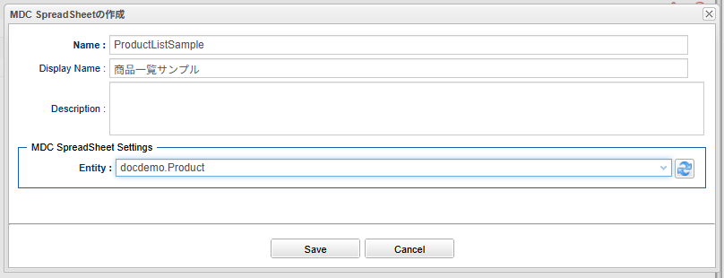
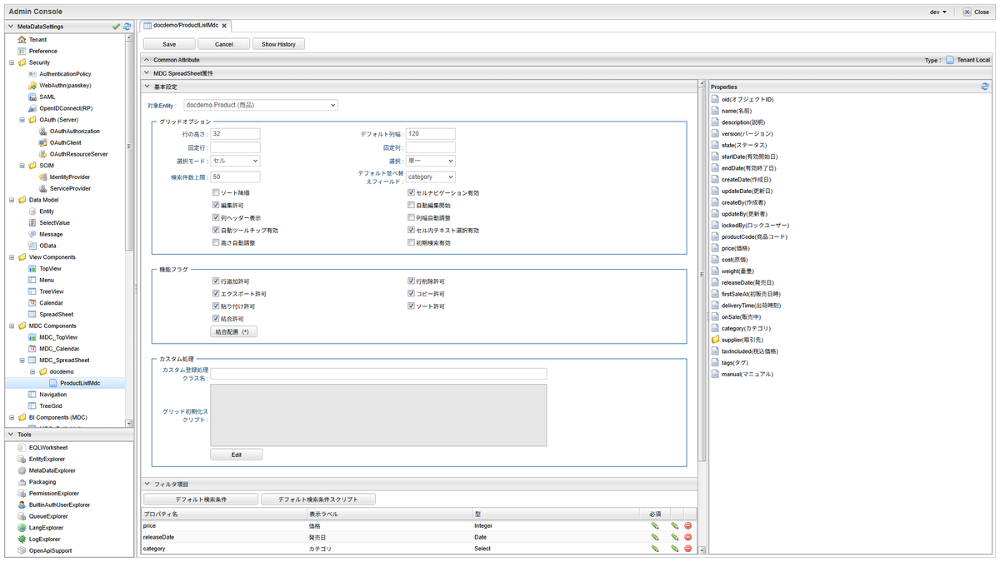
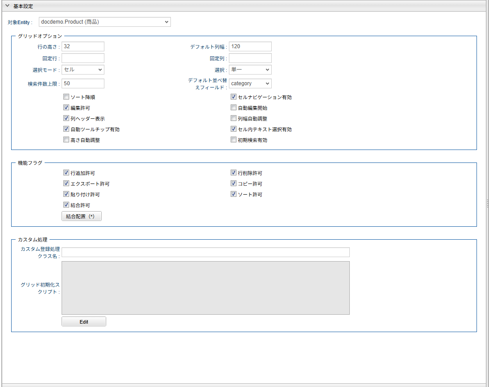
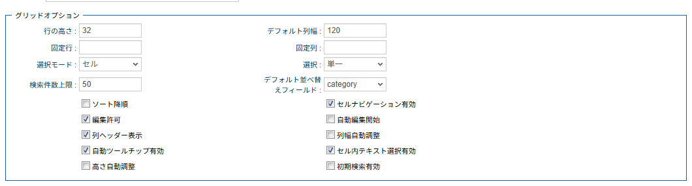
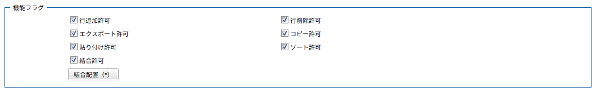
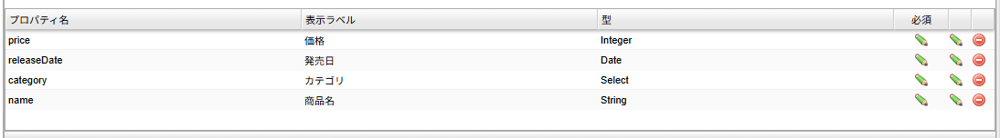
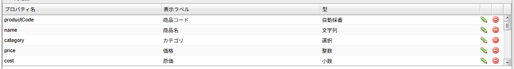
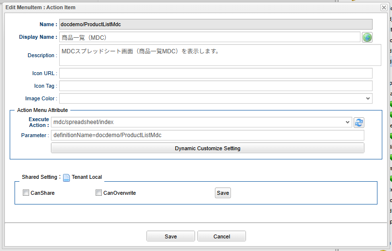

[[mdc_spreadsheet_management]]
== Spreadsheetの管理

[[mdc_spreadsheet_create]]
=== Spreadsheetの作成

MDCのSpreadsheet定義は、Admin Consoleのメタデータ管理から作成します。
メタデータツリーの `MDC Components` カテゴリ配下の `MDC SpreadSheet` ノード、またはその配下のフォルダを右クリックし、 `MDC SpreadSheetを作成する` を選択します。
表示されたダイアログで、定義名・対象Entityを入力して作成します。

作成後、編集画面が表示されます。
編集画面では、左側のプロパティドラッグエリアに対象Entityのプロパティ一覧が表示され、フィルタ項目や列定義にドラッグ&ドロップで追加できます。

NOTE: 対象Entityを変更すると、設定済みのフィルタ項目と列定義はクリアされます。

[[mdc_spreadsheet_setting]]
=== 設定

MDCのSpreadsheet定義の編集画面の `MDC SpreadSheet属性` タブでは、以下のセクションを設定します。
各設定項目の詳細は、<<mdc_spreadsheet_definition,Definition定義の詳細>>を参照してください。

[cols="1,5a", options="header"]
|===
|セクション|説明

|基本設定
|対象Entity、デフォルト検索条件、グリッドオプション、カスタム処理、機能フラグを設定します。

|フィルタ項目
|フィルタ条件エリアに表示する検索条件の項目を設定します。
対象Entityのプロパティをドラッグ&ドロップで追加できます。

|列定義
|グリッドに表示する列を設定します。
対象Entityのプロパティをドラッグ&ドロップで追加できます。
列定義は1つ以上必要です。
|===

[[mdc_spreadsheet_setting_basic]]
==== 基本設定

対象Entityとデフォルト検索条件を設定します。

[cols="1,5a", options="header"]
|===
|設定項目|説明

|対象Entity
|MDCのSpreadsheetの対象となるEntityを選択します。

|デフォルト検索条件
|検索時に自動的に付与される検索条件をPreparedQuery形式で指定します。

|デフォルト検索条件スクリプト
|画面表示時にフィルタ条件エリアへ初期設定する検索条件をGroovyスクリプトで指定します。
|===

[[mdc_spreadsheet_setting_gridoptions]]
==== グリッドオプション

グリッドの表示・操作に関する設定を行います。
行の高さ、デフォルト列幅、検索件数上限、列幅自動調整、固定列・固定行、選択モード、編集許可、初期検索有効などの項目を設定できます。

[[mdc_spreadsheet_setting_custom]]
==== カスタム処理

データ登録時のカスタム処理を設定します。

[cols="1,5a", options="header"]
|===
|設定項目|説明

|カスタム登録処理クラス名
|データ登録時に行うカスタム登録処理のクラス名を指定します。
MdcSpreadSheetRegistrationInterrupterインターフェースを実装するクラスを指定してください。

|グリッド初期化スクリプト
|グリッド生成後に実行する初期化JavaScriptを指定します。
|===

[[mdc_spreadsheet_setting_featureflags]]
==== 機能フラグ

グリッド上で許可する操作を設定します。
行追加許可、行削除許可、エクスポート許可、コピー許可、貼り付け許可、ソート許可、結合許可を設定できます。

結合許可を有効にした場合は、 `結合配置` ボタンからセル結合設定ダイアログを開き、セル結合設定（セルレイアウトまたはExpression）をあわせて設定します。

[[mdc_spreadsheet_setting_filter]]
==== フィルタ項目

フィルタ条件エリアに表示する項目を設定します。
プロパティドラッグエリアからプロパティをドラッグ&ドロップで追加し、各項目の編集ダイアログで表示ラベル、プロパティエディタ、利用可能な比較演算子、必須設定を行います。

[[mdc_spreadsheet_setting_column]]
==== 列定義

グリッドに表示する列を設定します。
プロパティドラッグエリアからプロパティをドラッグ&ドロップで追加し、各列の編集ダイアログで表示ラベル、幅、配置、ソート可否、編集可否、必須、多重度表示モード、カスタムスタイル、エディタタイプを設定します。
エディタタイプはプロパティの型から自動的に決定されます。

[[mdc_spreadsheet_view]]
=== 表示方法

[[mdc_spreadsheet_menu]]
==== メニューへの登録

MDCのSpreadsheet画面を表示するにはメニューにActionMenuItemを登録します。

[cols="1,5a", options="header"]
|===
|項目|設定値
|Name|管理しやすいように設定してください。
|DisplayName|メニューの表示名になります。
|Execute Action| `mdc/spreadsheet/index` を指定してください。
|Parameter| `definitionName=XXX`

definitionName:: 作成したMDCのSpreadsheetメタデータ名を指定します。
|===

以下は商品一覧を表示するActionMenuItemの登録例です。

NOTE: ActionMenuItemの具体的な登録方式は、<<../navigation/index.adoc#management, Navigationの管理>>を参照してください。

NOTE: TopViewのパーツとしては未対応です。詳細は、<<mdc_spreadsheet_limitations,SpreadsheetとExcelの違い・制限事項>>を参照してください。
