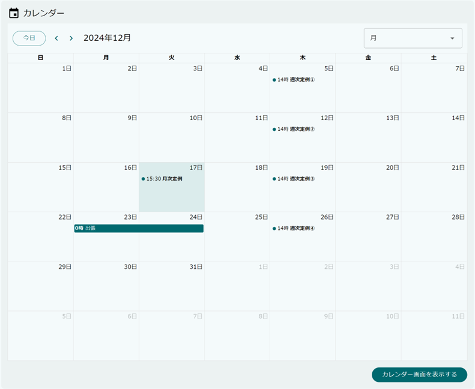
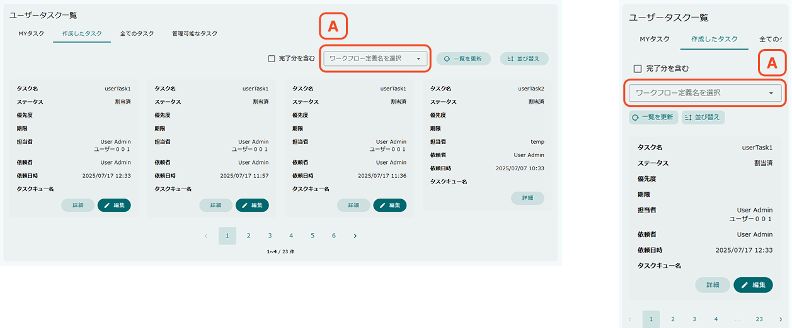

[[operation_guide]]
== 操作説明

=== Top画面
MDCモジュールにおけるTop画面です。

[[topview_parts]]
=== パーツ
Top画面のコンテンツ部分に表示するパーツです。

==== お知らせ一覧
アプリケーション管理者やシステム管理者が登録したお知らせ情報を一覧で表示するパーツです。
一覧のアイテムをクリックするとお知らせ情報の詳細が表示されます。 +
お知らせ情報は、 `mtp.Information` エンティティで管理されています。

==== 最終ログイン日時
現在ログイン中のユーザーが最後にログインした日時を表示するパーツです。

==== 検索結果一覧
エンティティの検索結果を一覧で表示するパーツです。 +
指定したSearchViewの定義にしたがって検索結果を表示します。検索結果の表示タイプに `TABLE` が、テーブル形式の場合のテーブルの高さに固定値が指定されることを想定しています。

[[topview_treegrid_parts]]
==== ツリーグリッド
エンティティと参照プロパティのデータを階層構造で表示するパーツです。

* A.エンティティ +
左側にアイコンが表示されている場合、クリックすると参照プロパティが次の行に表示されます。
（参照プロパティが未設定の場合は何も表示されません）
名前をクリックすると、エンティティの詳細ダイアログを表示します。
* B.参照プロパティ +
エンティティと同様に、アイコンが表示されている場合は、クリックすることで参照プロパティが参照するデータを表示できます。
こちらも名前をクリックすることで、エンティティの詳細ダイアログを表示します。

==== スペース
スペースを表示するパーツです。 +
パーツの間にスペースを空けたい場合や、複数列表示で空白のエリアを作りたい場合に利用します。

==== カレンダー
カレンダーを表示するパーツです。 +
単一または複数のエンティティデータを予定としてカレンダー形式で表示することができます。

==== タスク一覧
ワークフローのタスク一覧を表示するパーツです。 +
MYタスク、作成したタスク、全てのタスク、管理可能なタスクを切り替えて表示します。

.MYタスク
MYタスクは自身に割り当てられたタスクを表示します。
初期表示では未完了のタスクのみ表示します。

* A. MYタスク/作成したタスク/全てのタスク/管理可能なタスク +
クリックすることでMYタスク、作成したタスク、全てのタスク、管理可能なタスクの表示を切り替えます。

* B. 完了分を含む +
`完了分を含む` を指定することで、完了したタスクを含めて再検索します。

* C. 自分以外の人が完了したタスクを表示 +
`自分以外の人が完了したタスクを表示` を指定することで、自分以外の人が完了したタスクを含めて再検索します。 + 
この機能は、<<setting.adoc#usertasklist, UserTask List設定>>の `Display tasks completed by other assigned people` が有効のときに表示され、`完了分を含む` のチェックボックスが指定されている場合のみ有効です。

* D. 一覧を更新 +
タスクを再検索して一覧を更新します。

* E. 並び替え +
タスクの並び替えを行います。

* F. 詳細・編集 +
タスクの詳細・編集画面を表示します。
承認や差し戻しといったタスクの処理を行う場合は編集ボタンをクリックして編集画面から行います。

* G. ページング +
タスク一覧が複数ページにわたる場合に使用します。

.作成したタスク
作成したタスクは自身がトリガーとなったタスクを表示します。
初期表示では未完了のタスクのみ表示します。

* A. ワークフロー定義名を選択 +
ワークフロー定義名を選択することで、指定のワークフローに紐づくタスクのみを表示できます。 +
この機能は、<<setting.adoc#usertasklist, UserTask List設定>>の `Target Workflow` にて表示するワークフローを明示的に指定することで表示されます。

.全てのタスク
全てのタスクは作成された全てのタスクを表示します。
初期表示では未割当のタスクのみ表示します。

* A. 割当済みを含む +
`割当済みを含む` を指定することで、既に割り当てられたタスクも表示できます。

* B. タスクキュー名がnullのタスクを表示 +
`タスクキュー名がnullのタスクを表示` を指定することで、タスクキュー名がnullのタスクも表示できます。 + 
この機能は、<<setting.adoc#usertasklist, UserTask List設定>>の `Display tasks whose taskQueues is null.` が有効な場合に表示されます。

* C. タスクキュー名を選択 +
`タスクキュー名を選択` で指定したタスクキューに紐づくタスクのみを表示できます。

* D. 割当 +
未割当のタスクを自身に割り当てます。
割り当てられたタスクはMYタスクに表示されます。

.管理可能なタスク
管理可能なタスクは、タスクの処理と割当変更ができるタスクを表示します。
初期表示では未完了のタスクのみ表示します。

.タスク詳細画面
タスク詳細画面は完了済みのタスクの表示や、他のユーザーに割り当てられたタスクを表示します。

image::images/parts_tasklist_usertask_view.png[]

* A. 期限 +
タスクの期限を表示しています。

* B. 優先度 +
タスクの優先度を表示しています。

* C. タスク対象データ + 
ワークフローを起動した際に紐付けられたデータです。
クリックすることでデータの詳細画面をダイアログ表示します。

* D. 内部リンク + 
ユーザータスクの先頭、末尾へ画面をスクロール可能なページ内リンクが表示されます。

* E. 編集 + 
自身に割り当てられたタスクの場合に表示されます。
タスク編集画面を表示します。

.タスク編集画面
タスク編集画面では自身に割り当てられたタスクを処理することができます。

* A. コメント + 
タスクに対するコメントを設定します。
タスク処理のボタンをクリックした際に、ワークフロー履歴にコメントが記録されます。

* B. タスク処理 + 
タスクに対する処理を行います。
複数ある場合、ワークフローの設定に併せて以降の処理（データの更新、メールの送信、他のユーザーに次のタスクをアサイン等）が行われます。

* C. 委譲 + 
自身に割り当てられたタスクを他のユーザーに委譲します。
クリックするとユーザーの選択画面が表示されるので、委譲先を選択します。

.管理可能なタスクから編集画面を起動
タスク一覧の `管理可能なタスク` タブから起動した場合、自身に割り当てられていないタスクの処理と割当変更ができます。

* A. タスク処理 + 
通常のタスク編集画面のタスク処理と同じですが、割当ユーザーが複数いる場合、どのユーザーの代わりにタスク処理を行うか選択する画面が表示されます。

* B. 割当変更 + 
割当ユーザーの代わりに他のユーザーへ委譲を行います。