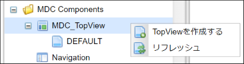
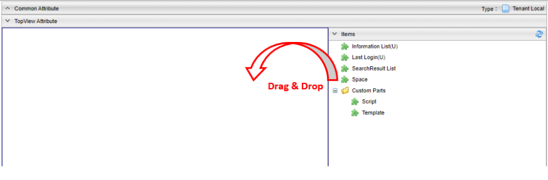

[[management]]
== TopViewの管理

[[create_topview]]
=== TopViewの作成
AdminConsoleのメニューから `MDC_TopView` を右クリックし、 `TopViewを作成する` を選択します。
表示されたダイアログの `Name` には対応するロールコードを設定してください。

[[topview_setting]]
=== 設定
左側のドロップ可能領域に対して、右側の `Items` からパーツをドラッグ&ドロップしてパーツの配置/編集を行います。
また、配置したパーツをドロップ可能領域内でドラッグ&ドロップすることで、パーツの順序を変更できます。

標準提供するパーツには以下のものがあります。 +
パーツには複数配置可能なものと不可能なものがあり、AdminConsole上でパーツの右側に `(U)` と表示されているパーツは、複数配置することができないUniqueなパーツです。

[cols="1,1,5,1", options="header"]
|===
2+|パーツ名|説明|複数配置可能か

2+|Information List
|お知らせ情報で登録したデータを表示します。|×

2+|Last Login
|最終ログイン日時を表示します。|×

2+|SearchResult List
|選択したエンティティの検索結果一覧を表示します。|○

.2+|Custom Parts
|Script
|GroovyTemplateで記述されたテンプレートを表示します。|○

|Template
|登録済みのテンプレートを表示します。|○

2+|Space
|スペースを表示します。|○

2+|Calendar
|カレンダーを表示します。|○
|===

各パーツのアイコンをクリックすることで、パーツの詳細設定ができます。
ここからは各パーツの詳細設定について説明します。

[[common_setting]]
==== 共通設定項目
各パーツに共通して設定できる項目です。

[cols="1,4a", options="header"]
|===
|設定項目
|設定内容

|列情報
|パーツの表示領域を設定します。 +
列情報の詳細については<<columninfo, 列情報>>を参照してください。
|===

[[columninfo]]
.列情報
MDCはコンテンツのレイアウト設定として全体を12ポイントとするグリッドシステムを利用します。
画面サイズに対するブレークポイントに対して、コンテンツを表示するサイズを設定します。 +
各ブレークポイントは、<<../../../serviceconfig/index.adoc#MdcConfigService, MdcConfigService>>で設定可能です。

[cols="1,4a", options="header"]
|===
|設定項目
|設定内容

|Extra Smallサイズの列数
|画面サイズが600px以下の場合の列数の設定します。（設定範囲は1~12）

|Smallサイズの列数
|画面サイズが600px以上 960px以下の場合の列数の設定します。（設定範囲は1~12）

|Mediumサイズの列数
|画面サイズが960px以上 1264px以下の場合の列数の設定します。（設定範囲は1~12）

|Largeサイズの列数
|画面サイズが1264px以上 1904px以下の場合の列数の設定します。（設定範囲は1~12）

|Extra Largeサイズの列数
|画面サイズが1904px以上の場合の列数の設定します。（設定範囲は1~12）

|===

[[informationlist]]
==== Information List
Top画面でお知らせ一覧を表示するパーツです。パスワード有効期限が近づいてきた際に警告メッセージを表示することも可能です。

[cols="1,2a", options="header"]
|===
|設定項目|設定内容

|Title
|タイトルをカスタマイズしたい場合に指定します。
未設定の場合は `お知らせ情報` と表示されます。

|Icon Tag
|タイトルの前に表示するアイコンを設定できます。 +
link:https://materialdesignicons.com/[Material Design Icons^]のアイコンタグを設定できます。（例:mdi-note）

|Class
|スタイルシートのクラス名を指定します。複数指定する場合は半角スペースで区切ってください。 +
Class と Class (deprecated) の両方が設定されている場合は、Class に指定されたスタイルが優先されます。

|Class (deprecated)
|スタイルシートのクラス名を指定します。複数指定する場合は半角スペースで区切ってください。 +
今後削除予定です。

|Hide Reload Button
|本項目がチェックされている場合、お知らせ情報のリロードボタンを非表示にします。

|Time Display Range
|一覧上の時間部分の表示範囲を指定します。

default:: 日付のみ表示します。
SEC:: 秒まで表示します
MIN:: 分まで表示します。
HOUR:: 時まで表示します。
NONE:: 日付のみ表示します。

|Scroll display number
|お知らせ一覧がスクロール表示となるお知らせ件数の閾値を指定します。 +
未指定の場合は、スクロール表示になりません。

|Enable Html Tag
|本項目がチェックされている場合、お知らせ情報の詳細表示時にHTMLタグが有効になります。

|Information Detail Custom Style
|お知らせ詳細のメッセージ表示部分に対して、直接style属性をGroovyScriptで指定することが可能です。 お知らせ内容によって表示を強調させたい場合などに利用します。

以下のオブジェクトがバインドされています。

====
today:: 現在の日付。 `java.sql.Timestamp` のインスタンス
entity:: 詳細表示中のお知らせ情報エンティティ
====

|Show warning message of the password expiration date
|本項目がチェックされている場合、パスワード有効期間に対する警告メッセージを表示します。

|Remain days threshold
|有効期限の何日前から警告を表示するかの閾値を設定します。

|Custom warning message
|警告メッセージの文言をカスタマイズしたい場合に指定します。

|Custom alert message style
|警告メッセージ表示領域のスタイルをカスタマイズしたい場合に指定します。Vuetify.jsのアラートコンポーネントを使用します。 `info` 、 `warning` 、 `error` 、 `info(outline)` 、 `warning(outline)` 、 `error(outline)` からスタイルを選択可能です。未指定の場合のデフォルトは、 `warning` です。

|Custom alert icon
|警告メッセージ表示領域のアイコンをカスタマイズしたい場合に指定します。
link:https://materialdesignicons.com/[Material Design Icons^]のアイコンタグを設定できます。（例:mdi-alert）
|===

[[lastlogin]]
==== Last Login
Top画面にログイン中のユーザーの最終ログイン日時を表示します。

[cols="1,2a", options="header"]
|===
|設定項目|設定内容

|Class
|スタイルシートのクラス名を指定します。複数指定する場合は半角スペースで区切ってください。 +
Class と Class (deprecated) の両方が設定されている場合は、Class に指定されたスタイルが優先されます。

|Class (deprecated)
|スタイルシートのクラス名を指定します。複数指定する場合は半角スペースで区切ってください。 +
今後削除予定です。
|===

[[searchresultlist]]
==== SearchResult List
Top画面に選択したエンティティの検索結果一覧を表示するパーツです。

[cols="1,2a", options="header"]
|===
|設定項目|設定内容

|Entity
|対象のエンティティを選択します。

|SearchResult List View
|検索結果一覧に適用するSearchViewのView名を指定します。

|Link Action View
|リンクから検索画面に遷移する際に適用するSearchViewのView名を指定します。

|Filter
|検索結果一覧に適用するフィルタ定義を指定します。

|Title
|タイトルをカスタマイズしたい場合に指定します。未指定の場合は、エンティティ名が表示されます。

|Icon Tag
|タイトルの前に表示するアイコンを設定できます。 +
link:https://materialdesignicons.com/[Material Design Icons^]のアイコンタグを設定できます。（例:mdi-note）

|Class
|スタイルシートのクラス名を指定します。複数指定する場合は半角スペースで区切ってください。

|Hide Reload Button
|本項目がチェックされている場合、検索結果一覧のリロードボタンを非表示にします。

|Hide Show Search Screen Button
|本項目がチェックされている場合、「検索画面を表示する」ボタンを非表示にします。

|===

[[treegrid]]
==== TreeGrid
Top画面に選択したツリーグリッドを表示するパーツです。

[cols="1,2a", options="header"]
|===
|設定項目|設定内容

|TreeGrid Name
|対象のツリーグリッドを選択します。

|Title
|タイトルをカスタマイズしたい場合に指定します。未指定の場合は、ツリーグリッドの表示名が表示されます。

|Icon Tag
|タイトルの前に表示するアイコンを設定できます。 +
link:https://materialdesignicons.com/[Material Design Icons^]のアイコンタグを設定できます。（例:mdi-note）

|Class
|スタイルシートのクラス名を指定します。複数指定する場合は半角スペースで区切ってください。
|===

[[calendar]]
==== Calendar
Top画面にカレンダーを表示するパーツです。

[cols="1,2a", options="header"]
|===
|設定項目|設定内容

|Calendar
|対象のカレンダーを選択します。

|Title
|タイトルをカスタマイズしたい場合に指定します。未指定の場合は、カレンダー名が表示されます。

|Icon Tag
|タイトルの前に表示するアイコンを設定できます。 +
link:https://materialdesignicons.com/[Material Design Icons^]のアイコンタグを設定できます。（例:mdi-note）

|Class
|スタイルシートのクラス名を指定します。複数指定する場合は半角スペースで区切ってください。

|Hide Reload Button
|本項目がチェックされている場合、カレンダーのリロードボタンを非表示にします。
|===

[[usertasklist]]
==== UserTask List
Top画面にワークフローでユーザーに割り当てられたタスク一覧を表示するパーツです。

.タスク一覧
タスク一覧画面の表示項目を設定します。

[cols="1,2a", options="header"]
|===
|設定項目|設定内容

|Title
|タイトルをカスタマイズしたい場合に指定します。多言語対応可能です。未設定の場合は `タスク一覧` と表示されます。

|Icon Tag
|タイトルの前に表示するアイコンを設定できます。 +
link:https://materialdesignicons.com/[Material Design Icons^]のアイコンタグを設定できます。（例:mdi-note）

|Class
|スタイルシートのクラス名を指定します。複数指定する場合は半角スペースで区切ってください。

|Tab Settings
|タブの表示を設定します。
カスタマイズ・多言語対応可能です。

Show ::
表示するタブを選択します。
Custom Title ::
タブのタイトルを変更する場合に指定します。

|Search Limit
|タスク一覧に表示するタスクの件数を設定します。

|hide [Detail] button
|詳細ボタンを非表示にするかを設定します。

|hide [Edit] button
|編集ボタンを非表示にするかを設定します。
必ず詳細画面に遷移させてから編集させたい場合に利用します。

|Detail Button Display name
|詳細ボタンの表示文言を設定します。
カスタマイズ・多言語対応可能です。
未指定の場合は `詳細` です。

|Edit Button Display name
|編集ボタンの表示文言を設定します。
カスタマイズ・多言語対応可能です。
未指定の場合は `編集` です。
また詳細画面から編集画面に遷移する際のボタン名としても利用されます。

|Mark processed assignment as complete.
|未完了のタスクでも、自身の割当が完了すれば完了済みのタスクとして扱うかどうかを設定します。
チェックした場合、`MYタスク` にて自身への割当てが完了済みのタスクは一覧に表示されなくなります。他のユーザが未回答でタスク自体が完了していない場合でも、この設定が適用されます。`完了を含む` を有効にすると、一覧に表示されます。

|Display tasks completed by other assigned people.
|自分以外の人が完了したタスクを表示するかを設定します。
チェックした場合、 `MYタスク` の `完了を含む` が有効な時に、 `自分以外の人が完了したタスクを表示` を選択できるようになります。

|Default Sort Setting
|ソートする項目と種別（昇順、降順）を指定します。

|Target Workflow
|タスク一覧の `作成したタスク` に表示するワークフローを指定します。
未指定の場合、全てのワークフローのユーザータスクが対象になります。
指定した場合、そのタスクに紐づくユーザータスクのみが対象になります。

|Task Queue Select Condition
| `全てのタスク` に表示するキューを取得する際の条件を指定します。
条件を指定した場合、 `全てのタスク` にはタスク一覧で指定したキューか、未指定の場合には選択可能なキューに紐づくタスクのみ表示します。

|Display tasks whose taskQueues is null.
|キューの取得条件を指定した場合に、キューに紐づかないタスクを取得するかを指定します。
チェックした場合、キューが未指定のタスクも取得します。

|Show Properties
|タスク一覧に表示するタスクの項目を指定します。
カスタマイズ・多言語対応可能です。
詳細は<<taskviewlistitem, タスク一覧項目>>を参照してください。

Show ::
表示する項目を選択します。
Custom Display Name ::
一覧項目名を変更する場合に指定します。

|Custom Properties
|タスク一覧に表示するタスク対象Entityの項目を指定します。
詳細は<<taskviewlistcustomitem, 対象Entity設定項目>>を参照してください。
|===

[[taskviewlistitem]]
.タスク一覧項目
タスク一覧画面に表示される項目です。

[cols="1,2", options="header"]
|===
|Property
|一覧画面の項目名

|TaskName
|タスク名

|Status
|タスクステータス

|Priority
|優先度

|Limit
|タスク期限

|AssignmentUser
|担当者

|Workflow
|ワークフロー名

|CreateBy
|依頼者

|CreateDate
|依頼日時

|QueueName
|タスクキュー名
|===

[[taskviewlistcustomitem]]
.対象Entity設定項目
タスク一覧画面に表示する対象Entity設定項目です。

[cols="1,2a", options="header"]
|===
|設定項目|設定内容

|Workflow
|タスク一覧に変数の項目を表示する場合に、対象となるワークフローを選択します。

|Variable
|タスク一覧に変数の項目を表示する場合に、対象となる変数を選択します。

|Entity
|タスク一覧に変数の項目を表示する場合に、対象となるEntityを選択します。

|Entity Property
| `Entity` で選択したEntityのプロパティが表示されます。
`Custom Property` に表示対象のプロパティをドラッグ&ドロップすることでタスク一覧の表示項目となります。

|Custom Property
| `Variable` で選択した変数に `Entity` で選択したEntityが設定された場合にタスク一覧に表示する項目です。
`Entity Property` からドラッグ&ドロップで表示対象を指定します。
カスタマイズ・多言語対応可能です。
|===

.タスク詳細
タスク詳細画面の表示項目を設定します。

[cols="1,2a", options="header"]
|===
|設定項目
|設定内容

|Task Target Section
|タスク対象データセクションの表示を設定します。
カスタマイズ・多言語対応可能です。

Show Section ::
セクションを表示するかを選択します。
Custom Title ::
セクションのタイトルを変更する場合に指定します。

Variable Entity View Names ::
リンクまたはタスク詳細内で表示するタスク対象データの表示設定を行います。
詳細は<<variableentityviewname, Variable Entity View Name>>を参照してください。

|Detail Section
|詳細情報セクションの表示を設定します。
カスタマイズ・多言語対応可能です。

Show Section ::
セクションを表示するかを選択します。
Custom Title ::
セクションのタイトルを変更する場合に指定します。

Section Properties ::
セクション内で表示する項目の表示設定を行います。
詳細は<<taskviewdetailitem, タスク詳細項目>>を参照してください。

|Processing result of the user assignment Section
|割当ユーザーの処理結果セクションの表示を設定します。
カスタマイズ・多言語対応可能です。

Show Section ::
セクションを表示するかを選択します。
Custom Title ::
セクションのタイトルを変更する場合に指定します。

Section Properties ::
セクション内で表示する項目の表示設定を行います。
詳細は<<taskviewdetailitem, タスク詳細項目>>を参照してください。

|Workflow History Section
|ワークフロー履歴セクションの表示を設定します。
カスタマイズ・多言語対応可能です。

Show Section ::
セクションを表示するかを選択します。
Custom Title ::
セクションのタイトルを変更する場合に指定します。
Display only the user who processed the tasks ::
ワークフロー履歴の詳細にタスクを完了させた人のみ表示するかを設定します。

Section Properties ::
セクション内で表示する項目の表示設定を行います。
詳細は<<taskviewdetailitem, タスク詳細項目>>を参照してください。
|===

[[taskviewdetailitem]]
.タスク詳細項目
タスク詳細画面のセクション内に表示される項目を設定します。
カスタマイズ・多言語対応可能です。

[cols="1,2a", options="header"]
|===
|設定項目
|設定内容

|Show
|項目の表示を設定します。

|Custom Title
|項目のタイトルを変更する場合に指定します。
|===

タスク詳細画面に表示される項目です。
[cols="1,2,2", options="header"]
|===
|Section
|Property
|詳細画面の項目名

|Detail
|Status
|詳細情報 - ステータス

|Detail
|Workflow
|詳細情報 - ワークフロー名

|Detail
|Workflow Status
|詳細情報 - ワークフロー状態

|Detail
|Task Result
|詳細情報 - 処理結果

|Detail
|QueueName
|詳細情報 - タスクキュー名

|Detail
|CompletionDate
|詳細情報 - 完了日

|Processing result of the user assignment
|User
|割当ユーザーの処理結果 - ユーザー

|Processing result of the user assignment
|Task
|割当ユーザーの処理結果 - 処理結果

|Processing result of the user assignment
|Assign State
|割当ユーザーの処理結果 - アサイン状態

|Processing result of the user assignment
|CompletionDate
|割当ユーザーの処理結果 - 完了日

|Processing result of the user assignment
|Comment
|割当ユーザーの処理結果 - コメント

|Workflow History
|Process Name
|ワークフロー履歴 - 処理名

|Workflow History
|Task Status
|ワークフロー履歴 - ステータス

|Workflow History
|Task Result
|ワークフロー履歴 - 処理結果

|Workflow History
|ProcessBy
|ワークフロー履歴 - プロセス実行者

|Workflow History
|CompletionDate
|ワークフロー履歴 - 完了日

|Workflow History
|Detail
|ワークフロー履歴 - 詳細
|===

[[variableentityviewname]]
.Variable Entity View Name
タスク詳細内でタスク対象データを表示する際の設定を行います。
`Display in Detail` をチェックした場合、Entityの詳細画面をタスク詳細内に表示します。
未チェックの場合はリンクで表示され、リンククリックでEntityの詳細画面を表示します。

[cols="1,2a", options="header"]
|===
|設定項目
|設定内容

|Workflow
|表示設定を行うワークフローを選択します。

|Variable
|表示設定を行う変数を選択します。

|Entity
|表示設定を行うEntityを選択します。

|Entity View Name
|上記で選択したワークフロー、変数、Entityが一致するタスク対象データに使用するビュー名を設定します。
タスク詳細からのリンク、タスク詳細内での表示を行う際に利用されます。
※GroovyTemplate書式で記述してください。

|Display in Detail
|タスク詳細にEntityを表示する場合にチェックします。
|===

[[space]]
==== Space
Top画面にスペースを表示するパーツです。

[cols="1,2a", options="header"]
|===
|設定項目|設定内容

|Class
|スタイルシートのクラス名を指定します。複数指定する場合は半角スペースで区切ってください。
|===

[[script]]
==== Script
Top画面にGroovyTemplateで記述されたテンプレートを表示します。 +
HTMLやスクリプト、Vue.jsのSFC形式（単一ファイルコンポーネント形式）などでテンプレートを記述できます。 +
テンプレートの実装方法の詳細については、link:../../../storybook/index.html?path=/docs/開発者ドキュメント-オリジナルテンプレート[コンポーネントカタログ^]を参照してください。

[cols="1,2a", options="header"]
|===
|設定項目|設定内容
|Template Interpret Type
|記述されたテンプレート文字列の解釈タイプです。以下の３つから選択できます。

HTML:: HTMLとして解釈します。HTMLやスクリプトの記述が可能です。
VUE_SFC:: Vue.jsのSFC形式（単一ファイルコンポーネント形式）で記述されたコンポーネントとして解釈します。
VUE_SFC_LIKE:: Vue.jsのランタイムを用いてコンポーネントとして解釈します。MDCでは、Vue.jsのランタイムに加えてコンパイラもバンドルしており、Vue.jsのテンプレート構文を利用することが可能です。

|ComponentName
|コンポーネント名を設定します。 コンポーネント名は、英文字とハイフン(-)のみを利用したパスカルケースでの命名を推奨します。
`Template Interpret Type` が `VUE_SFC_LIKE` の場合、コンポーネント名の指定は必須です。 `Template Interpret Type` が `VUE_SFC` でコンポーネント名が未入力の場合、自動でランダムなコンポーネント名を割り当てます。

|Script
|スクリプト編集画面を表示してGroovyTemplateの文法に従って記述します。
詳細は<<../../customizing/index.adoc#groovytemplate, GroovyTemplate>>を参照してください。

|Precompile VUE_SFC format template
|Vue.jsのSFC形式のテンプレートをプリコンパイルするかを指定します。`Template Interpret Type` が `VUE_SFC` であり、Vue.jsのSFC形式のテンプレートを定義保存時にプリコンパイルしておきたい場合にチェックします。プリコンパイルしておくことで、コンポーネントの初期化処理を高速化できます。

[NOTE]
====
プリコンパイルの注意点::
- プリコンパイルを実行したい場合には、 `ComponentName` の指定が必須となります。
- `Script` に記述したGroovyTemplateは、TopView定義保存時に実行されてプリコンパイルされるため、リクエスト情報やセッション情報、ユーザー固有情報などを使用しないように注意してください。
====
|===

.VUE_SFC形式、VUE_SFC_LIKE形式の場合のコンポーネントとのデータ受け渡し（props/emit）

以下のデータがpropsとしてコンポーネントに引き渡されます。
====
contextMap:: コンテキストマップ。リアクティブな空のMapオブジェクト。 +
コンテキストマップにデータを格納することで、複数のパーツ（コンポーネント）間でリアクティブにデータを共有することが可能です。
====

[[template]]
==== Template
Top画面に登録済みのテンプレートを表示します。 +
テンプレートの実装方法の詳細については、link:../../../storybook/index.html?path=/docs/開発者ドキュメント-オリジナルテンプレート[コンポーネントカタログ^]を参照してください。

[cols="1,2a", options="header"]
|===
|設定項目|設定内容

|Template Interpret Type
|テンプレートの解釈タイプです。以下の３つから選択できます。

HTML:: HTMLとして解釈します。HTMLやスクリプトの記述が可能です。
VUE_SFC:: Vue.jsのSFC形式（単一ファイルコンポーネント形式）で記述されたコンポーネントとして解釈します。
VUE_SFC_LIKE:: Vue.jsのランタイムを用いてコンポーネントとして解釈します。MDCでは、Vue.jsのランタイムに加えてコンパイラもバンドルしており、Vue.jsのテンプレート構文を利用することが可能です。

|ComponentName
|コンポーネント名を設定します。 コンポーネント名は、英文字とハイフン(-)のみを利用したパスカルケースでの命名を推奨します。
`Template Interpret Type` が `VUE_SFC_LIKE` の場合、コンポーネント名の指定は必須です。 `Template Interpret Type` が `VUE_SFC` でコンポーネント名が未入力の場合、自動でランダムなコンポーネント名を割り当てます。

|Template
|登録済みのテンプレートを選択します。

|Precompile VUE_SFC format template
|Vue.jsのSFC形式のテンプレートをプリコンパイルするかを指定します。`Template Interpret Type` が `VUE_SFC` であり、Vue.jsのSFC形式のテンプレートを定義保存時にプリコンパイルしておきたい場合にチェックします。プリコンパイルしておくことで、コンポーネントの初期化処理を高速化できます。

[NOTE]
====
プリコンパイルの注意点::
- プリコンパイルを実行したい場合には、 `ComponentName` の指定が必須となります。
- `Template` で指定した登録済みのテンプレートは、TopView定義保存時に実行されてプリコンパイルされるため、テンプレートの内容が変更された場合は再度TopView定義を保存する必要があります。また、JSPやGroovyTemplateなどで記述されたテンプレートには、リクエスト情報やセッション情報、ユーザー固有情報などを使用しないように注意してください。
====
|===

.VUE_SFC形式、VUE_SFC_LIKE形式の場合のコンポーネントとのデータ受け渡し（props/emit）

以下のデータがpropsとしてコンポーネントに引き渡されます。
====
contextMap:: コンテキストマップ。リアクティブな空のMapオブジェクト。 +
コンテキストマップにデータを格納することで、複数のパーツ（コンポーネント）間でリアクティブにデータを共有することが可能です。
====