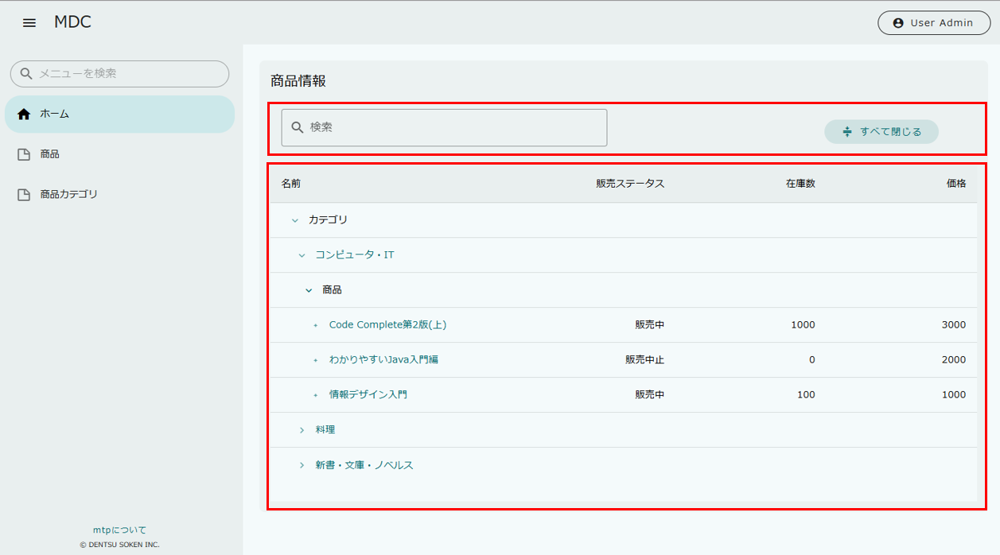
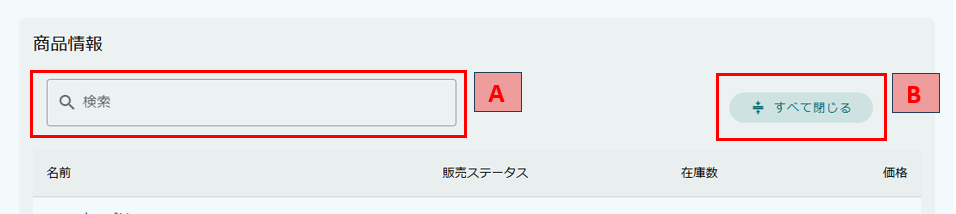
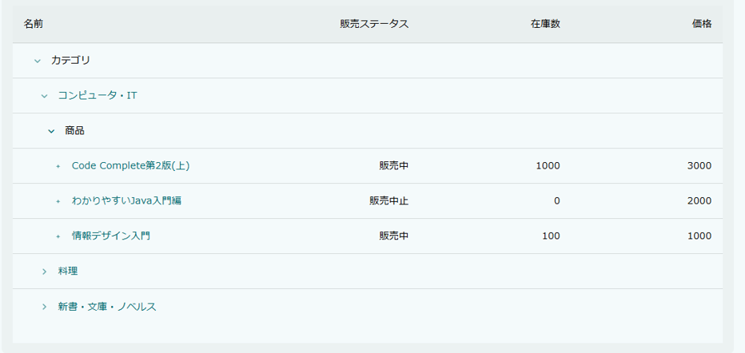

[[operationguide]]
== 操作説明
MDCモジュールにおけるツリーグリッド画面の設定です。 +
エンティティと参照プロパティのデータをツリーグリッド形式で表示するために使用されます。 ツリーグリッドで表示されるエンティティデータの参照、編集、削除が可能です。

=== 画面構成

ツリーグリッドは、大きく2つの領域に分かれています。
上部の `基本機能` と下部の `ツリーグリッドテーブル` です。

=== 基本機能
`基本機能` では、ツリーグリッドをより便利に活用するための操作が提供されています。

.A.検索とフィルタ
検索欄にキーワードを入力すると、現在表示されている項目の中から一致するものを検索・フィルタリングできます。

.B.すべて閉じる
ボタンを押すと、すべての項目が閉じられ、ツリーグリッドが初期状態に戻ります。

=== ツリーグリッドテーブル
`ツリーグリッドテーブル` では、エンティティと参照プロパティのデータをツリーグリッド形式で表示します。

