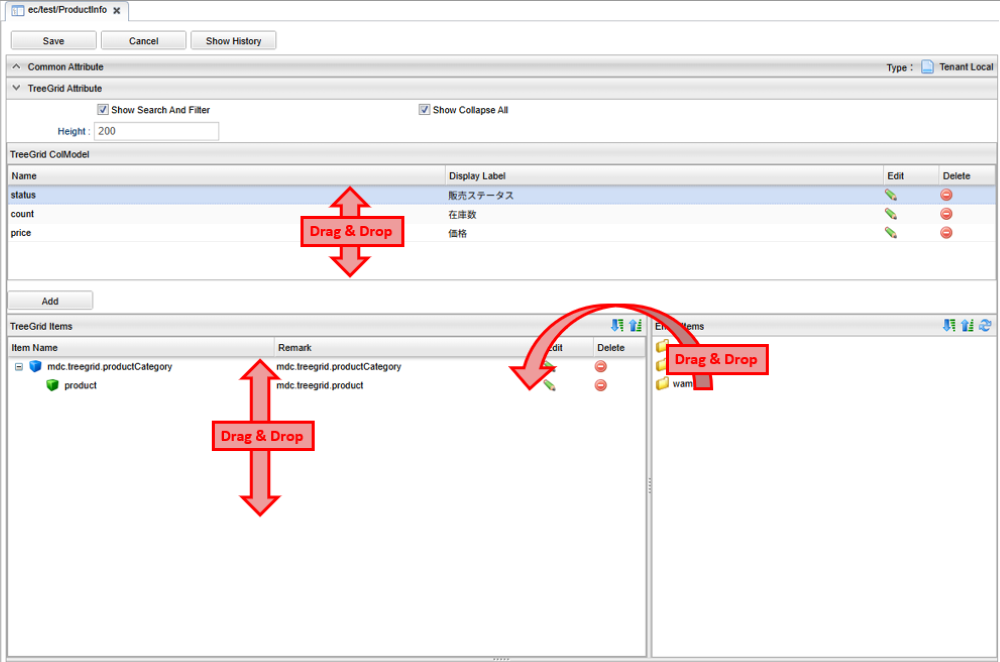

[[treegrid_management]]
== TreeGridの管理

[[create_treegrid]]
=== TreeGridの作成
TreeGridアイコンを右クリックし、 `TreeGridを作成する` を選択します。

[[treegrid_setting]]
=== 設定
表示したいエンティティを `Entity Items` から `TreeGrid Items` にドラッグ&ドロップすることで、表示対象にできます。
`TreeGrid ColModel` 内や `TreeGrid Items` 内では、ドラッグ&ドロップで自由に並び替えができます。

[[treegrid_global_setting]]
==== ツリーグリッド設定
ツリーグリッドの設定を行います。

[cols="1,3a",options="header"]
|===
|項目
|内容

|Show Search And Filter
|ツリーグリッドの検索とフィルタ機能を表示するかを指定します。

|Show Collapse All
|「すべて閉じる」ボタンを表示するかを指定します。

|Height
|ツリーグリッドの高さ（px）を設定します。
|===

[[treegrid_colmodel_setting]]
==== カラム設定
ツリーグリッドのカラムの設定を行います。
どのカラムにどのプロパティを対応させるかは `TreeGrid Items` に設定します。

[cols="1,3a",options="header"]
|===
|項目
|内容

|Name
|カラム名を設定します。
識別名として利用されます。

|Display Label
|ツリーグリッドのヘッダに表示される表示名を設定します。

|Width
|列の幅を設定します。

|Align
|ツリーグリッド内での値の配置を設定します。

LEFT:: 左寄せ
CENTER:: 中央寄せ
RIGHT:: 右寄せ(未設定時のデフォルト)
|===

[[treegrid_item_setting]]
==== エンティティアイテム設定
`Entity Items` からアイテムを表示対象エンティティ設定領域へドラッグ&ドロップすることで、ツリーグリッド上に表示するエンティティを設定します。
表示対象エンティティ設定領域内の各エンティティアイテムの編集ボタンをクリックすることで、エンティティアイテムの詳細設定が可能です。
ここで表示する参照プロパティの指定や、 `TreeGrid ColModel` で設定したカラムとプロパティの対応を決定します。

.Common
ツリーグリッドに表示するための共通情報を設定します。

[cols="1,3a",options="header"]
|===
|項目
|内容

|Title
|タイトルをカスタマイズしたい場合に指定します。 未設定の場合はエンティティの表示名が表示されます。

|Expand Icon Tag
|展開後、タイトルの前に表示するアイコンを設定できます。 +
Material Design Iconsのアイコンタグを設定できます。（例:mdi-note） +
未設定の場合は `mdi-chevron-down` が表示されます。

|Collapse Icon Tag
|閉じる後、タイトルの前に表示するアイコンを設定できます。 +
Material Design Iconsのアイコンタグを設定できます。（例:mdi-note） +
未設定の場合は `mdi-chevron-right` が表示されます。

|Icon Color
|`Expand Icon Tag` と `Collapse Icon Tag` で指定したアイコンの色を指定できます。 +
カラーコードまたはマテリアルカラー名（例:red）を指定してください。

|Class
|スタイルシートのクラス名を指定します。複数指定する場合は半角スペースで区切ってください。
|===

.Entity Display
エンティティに表示と検索するための基本情報を設定します。

[cols="1,3a",options="header"]
|===
|項目
|内容

|Entity
|ドラッグ&ドロップしたエンティティの定義名です。変更はできません。

|View Name
|詳細画面表示時に利用するEntityViewのビュー名を設定します。

|Display Item
|ツリーグリッドに表示するプロパティを選択します。 エンティティに定義されているプロパティがプルダウンに表示されます。

|Limit Count
|エンティティで表示可能な最大件数を設定します。 

|Sort Item
|ソートに利用するプロパティを選択します。
エンティティに定義されているプロパティがプルダウンに表示されます。

|Sort Type
|ASC, DESCを選択します。

|Reference Property Name
|参照プロパティの定義名です。変更はできません。

|Reference Display Name
|ツリーグリッドで参照プロパティの表示名をカスタマイズしたい場合に指定します。
デフォルトでは、参照プロパティの表示名が設定されます。
|===

.Reference Display
ドラッグ&ドロップで追加したエンティティに参照プロパティが存在する場合のみ設定可能です。
チェックを付けた参照プロパティはツリー設定に子として表示されます。
子も親となるエンティティと同様に各種設定ができます。

.Column Mapping
`TreeGrid ColModel` でカラムの設定を追加した場合のみ編集可能です。
ツリーグリッドの各カラムに対して、どのプロパティを表示するかをマッピングします。 +
`Mapping Property` の各セルに対して、 エンティティに定義されているプロパティがプルダウンに表示されます。 +
参照先エンティティのネストプロパティを設定したい場合は、完全なプロパティ名を手動で入力してください。
保存後、自動的に表示名が生成されます。 +
例： `product.category` を手入力し、保存後には、 `product.category（商品.カテゴリー）` に変わります。

[[viewtreegrid]]
=== 表示方法

[[viewtreegridparts]]
.Top画面での表示
TopView定義にTreeGridパーツを配置することでトップ画面に表示することができます。 
詳細は<<../topview/index.adoc#topview_treegrid_parts, ツリーグリッド>>を参照してください。

