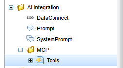

[[setup_metadata]]
== メタデータの設定

メタデータは AdminConsole で設定します。 +
AdminConsole メニューのパスは `AI Integration > MCP` です。

[[setup_metadata_mcp_tools]]
=== Tools メタデータの作成

Tools メタデータは、AdminConsole メニューの `AI Integration > MCP > Tools` で作成します。 +
設定項目は以下の通りです。

[cols="1,3", options="header"]
|===
| 項目
| 説明

| 有効
| 定義した MCP Tools を有効にするかどうかを設定します。

| Tool名
| 名前を設定します。必須項目です。 +
クライアントから MCP Tools を呼び出す際に利用する項目です。

| Toolタイトル
| タイトルを設定します。クライアントから MCP Tools 一覧を取得した際に表示される項目です。

| Tool説明
| 説明を設定します。クライアントから MCP Tools 一覧を取得した際に表示される項目です。

| Meta
a| メタ情報を設定します。クライアントから MCP Tools 一覧を取得した際に表示される項目です。

[cols="1,3", options="header"]
!===
! 設定項目
! 説明

! キー
! メタ情報のキーを設定します。

! 値
! メタ情報の値を設定します。
!===

| HTTPメソッド
| Command 実行時の HTTP メソッドを設定します。任意項目です。

WebAPI で利用しているコマンドを MCP で流用する際に必要となる項目です。 +
HTTP メソッドによって振る舞いが変わるコマンドの場合、本項目を設定することでコマンドの動作を決定します。

| パラメータマッピング
a| クライアントから MCP Tools を呼び出す際のパラメータと、コマンドに渡すパラメータのマッピングを設定します。

[cols="1,3", options="header"]
!===
! 設定項目
! 説明

! MCPリクエストパラメータ
! MCPクライアントから MCP Tools を呼び出す際のリクエストパラメータを設定します。必須項目です。

! データ型
! パラメータのデータ型を設定します。完全修飾クラス名を設定します。 +
項目を設定しない場合は、 `java.lang.String` として扱われます。

! 必須
! パラメータが必須かどうかを設定します。チェックすることで必須となります。デフォルトは false（チェック無し） です。

! 説明
! パラメータの説明を設定します。Tools 一覧を取得した際に inputSchema のパラメータの説明として表示される項目です。

! マッピングタイプ
! パラメータのマッピングタイプを設定します。必須項目です。 +
設定方法によって、コマンドからパラメータを取得する方法が異なります。

ATTRIBUTE::
コマンドでパラメータを取得する場合、リクエストコンテキストの `RequestContext#getAttribute` メソッドでパラメータを取得します。

PARAMETER::
コマンドでパラメータを取得する場合、リクエストコンテキストの `RequestContext#getParam` メソッドでパラメータを取得します。

! マッピング先キー
! 受け取ったパラメータを RequestContext に設定する際のキーを設定します。任意項目です。 +
設定が無い場合は、MCPリクエストパラメータの値をそのままキーとして利用します。

! デフォルト値
! クライアントから MCP Tools を呼び出す際に、MCPリクエストパラメータが渡されなかった場合のデフォルト値を設定します。任意項目です。
!===

| Execute Commands
| コマンドを実行するための設定を行います。 +
コマンド設定の詳細は、link:../webapi/index.html#WebApi-Command[WebAPIのCommandの設定^]を参照してください。

| 結果マッピング
a| コマンド実行後の結果を MCPクライアントに返すための設定を行います。

[cols="1,3", options="header"]
!===
! 設定項目
! 説明

! コマンド結果キー
! コマンド実行後に返却したい結果が格納されている RequestContext の属性のキーを設定します。必須項目です。

! MCPレスポンスキー
! MCPクライアントに返すレスポンスのキーを設定します。 +
項目を設定しない場合は、コマンド結果キーと同じ値が設定されます。
!===

|===
