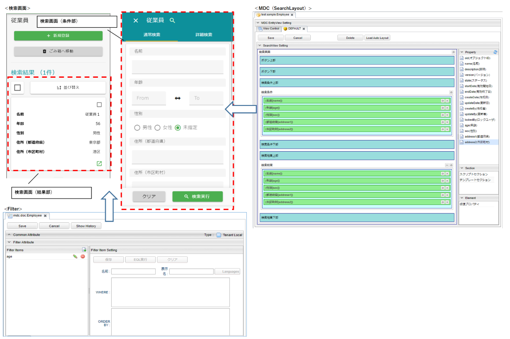
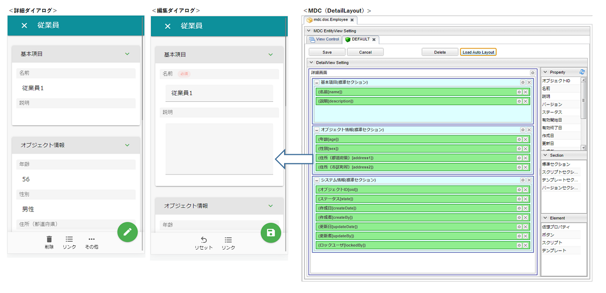
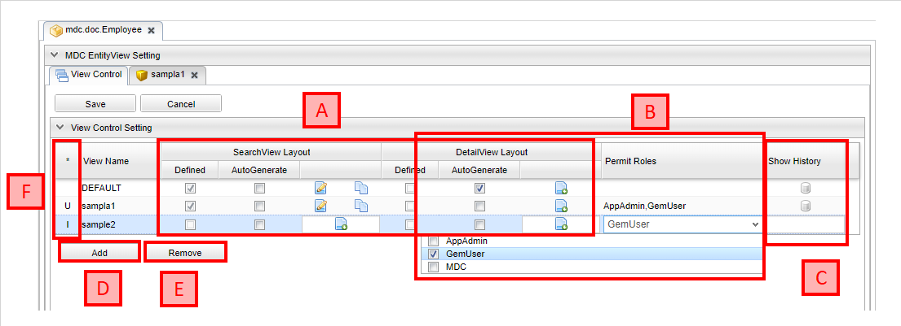

[[entityviewcontrol]]
== EntityViewの管理

EntityViewは、Entityの検索画面、詳細・編集画面をカスタマイズする仕組みを提供しています。
検索画面はSearchLayoutとFilter定義を、詳細・編集画面はDetailLayoutの設定を利用して画面を生成しています。

=== 表示方法

サイドメニューには各エンティティに対応するメニューが表示されており、クリックすることで検索画面が表示されます。
検索画面で、新規作成ボタンをクリックしたり、検索結果の詳細画面表示アイコンをクリックしたりすることで、詳細・編集画面が表示されます。

=== MDC EntityView

MDC EntityViewは検索画面、詳細・編集画面を管理する画面です。
検索画面、詳細・編集画面を編集する場合はこの画面から行います。

==== MDC EntityViewの表示

MDC EntityViewを表示したいエンティティを右クリックし、`MDC EntityView` を選択します。

TIP: build.gradleで `iplass-ee-mdc` を依存関係に追加していないと、右クリック時に `MDC EntityView` は表示されません。

==== MDC EntityViewの構成

MDC EntityViewは以下の構成になっています。

.A.画面定義管理
エンティティの検索画面、詳細・編集画面はレイアウトが未設定の場合、自動で生成して画面を表示します。
しかし、ロール毎に構成を変更したい場合、複数のレイアウトを設定する必要があります。
そうした場合は自動生成が行えず、例えば標準的なレイアウトをそのまま使用するロールがあった場合、エンティティ定義のプロパティ設定に変更が加わると、併せてレイアウトの修正が必要になります。

上記のような場合、この自動生成の管理機能を利用することで、特定のViewに対してのみ自動生成を行うように設定でき、標準的なレイアウトであれば個別に設定する手間を省くことができます。

Viewに対して `AutoGenerate` をチェックすることで、標準的なレイアウトを自動生成するようになります。
`Defined` にチェックがついてるViewは既にレイアウトの定義が保存されていますが、 `AutoGenerate` をチェックした場合は保存済みの定義を利用せず、自動生成を行います。

NOTE: 自動生成では `name` 、 `description` と個別の定義プロパティを対象にします。
自動生成画面の対象プロパティとして `oid` や `createDate` などのシステム項目を対象としたい場合は、
<<../../../serviceconfig/index.adoc#MdcSearchViewService, MdcSearchViewService>> の `systemProperties` や、 <<../../../serviceconfig/index.adoc#MdcDetailViewService, MdcDetailViewService>>の `systemSectionProperties` で設定を行います。

View定義が保存されている場合は編集アイコンとコピーアイコン、未保存の場合は新規作成アイコンが表示されます。
編集アイコンまたは新規作成アイコンをクリックすると、それぞれのView定義の編集画面を表示します。
コピーアイコンをクリックすると他のViewにView定義を上書きコピーします。

.B.許可ロール
Viewに対して許可ロールを指定すると、許可されたロール以外は画面表示時にエラーが発生します。
これを利用することで、特定のロールに見せたくない項目があるViewを意図せずに見られてしまう、といったことを防止できます。

NOTE: 許可ロールを利用した権限制御を行いたい場合は、Action権限、WebApi権限に対して設定が必要になります。
詳細については <<../mdcauth/index.adoc#, MDC権限制御>> を参照してください。

.C.履歴表示
保存済みの設定の履歴を表示します。

.D.Add
一覧にView（の名前）を追加します。
一覧に追加することで、存在しないViewに対しても自動生成の設定が行えるようになります。

.E.Remove
選択中のViewを一覧から削除します。
削除が可能なのは画面定義が保存されてないViewのみです。

.F.状態
Viewの状態を表します。
Addボタンで追加すると `I` 、画面定義や `AutoGenerate` を変更すると `U` 、保存済みのViewを削除すると `D` になります。
