[[operation_guide]]
== 操作説明

=== 画面構成
MDCモジュールで提供する標準的な画面レイアウトは以下で構成されています。

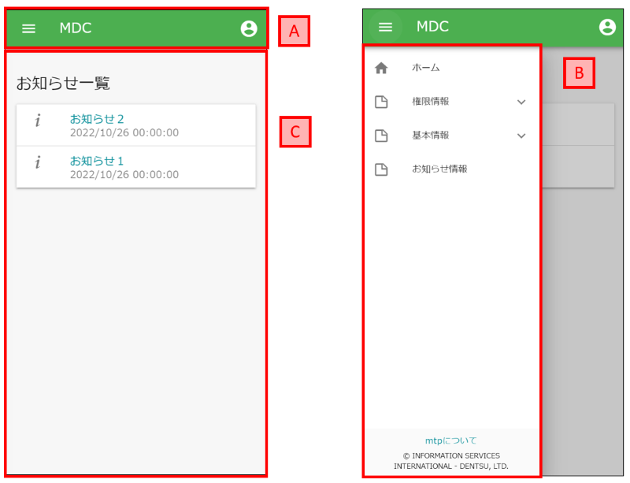

.A.アプリケーションバー
サイドメニュー開閉アイコン、ロゴ（設定時）、テナント名、全文検索（設定時）、ユーザーメニューで構成されています。 +
アプリケーションバー左端のメニューアイコンをクリックすると、サイドメニューが表示されます。 +
アプリケーションバー右端のアカウントアイコンをクリックすると、ユーザーメニューが表示されます。

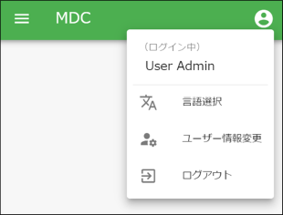

.B.サイドメニュー
Top画面やEntityView、Action等と紐づくアイテムを一覧表示するメニューです。

.C.メインコンテンツエリア
検索画面やTop画面等のメインコンテンツを表示するためのエリアです。

[[appbar]]
=== アプリケーションバー
画面上部のアプリケーションバーです。サイドメニュー開閉アイコン、ロゴ（設定時）、テナント名、全文検索（設定時）、ユーザーメニューで構成されています。

==== ユーザーメニュー
===== 管理・設定
開発者向けの管理コンソール（AdminConsole）を起動します。管理者のみが利用できます。 +
ただし、モバイル幅のディスプレイではメニューに表示されません。

===== 言語の変更
テナント設定の `多言語機能` を利用する設定が有効になっている場合、他の言語に切り替えることができます。

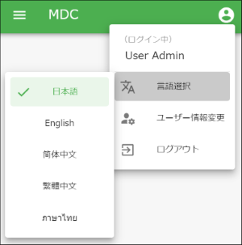

===== ナヴィゲーション変更
ユーザーにマッチするロールが複数であり、それに対応するNavigation定義も複数の場合に表示されます。 +
対象のナヴィゲーションを選択することで、表示されるナヴィゲーションとTop画面が変更されます。

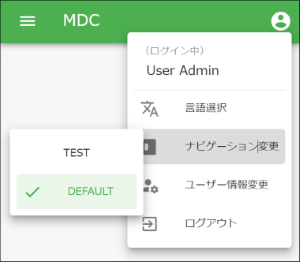

===== プレビュー日付
テナント設定の `日付プレビュー表示機能` が有効になっている場合、特定の日時を現在日時としてプレビューすることができます。 +
特定の日時における表示を確認したい場合に利用します。

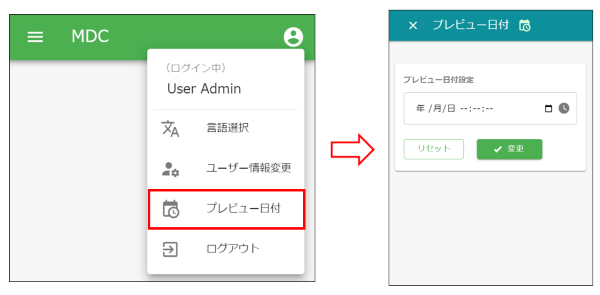

===== ユーザー情報変更
ユーザーが自身の情報を変更する画面を表示します。初期状態ではパスワードのみ変更可能です。 +
Navigation定義の設定によってユーザー情報の変更が可能になります。

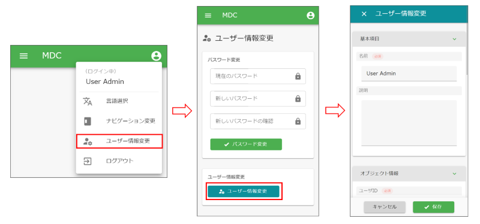

===== アプリケーション管理
ユーザーに設定されているOAuthのクライアント情報の閲覧とメンテナンス(削除)、有効なRememberMe設定の閲覧とメンテナンス(無効化)、個人アクセストークンのメンテナンス(生成/削除)が可能なアプリケーション管理画面を表示します。

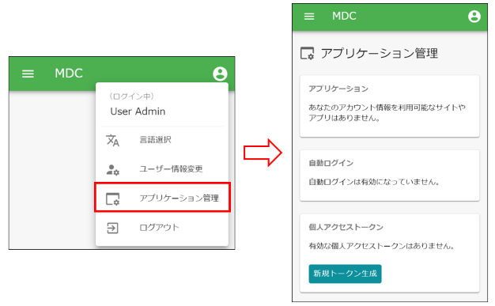

===== 代理ログイン
代理ログイン機能(代理ログイン/解除、代理ログイン許可ユーザーの選択)へのリンクを表示します。

====== 代理ログインする
他のユーザーに成り代わってログインします。権限などは代理ログインしたユーザーのものになります。 +
認証ポリシーの設定により、代理ログイン機能が利用できる場合に表示されます。

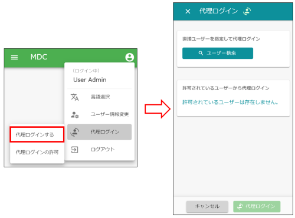

代理ログインしている場合は、「代理ログインを解除」メニューが表示されます。

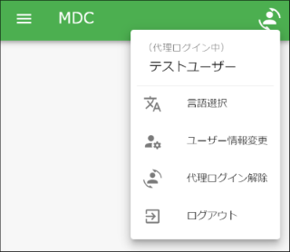

====== 代理ログインの許可
他のユーザーに対して、自身に成り代わって操作することを許可します。 +
代理ログインを許可するユーザーと許可期間を指定します。

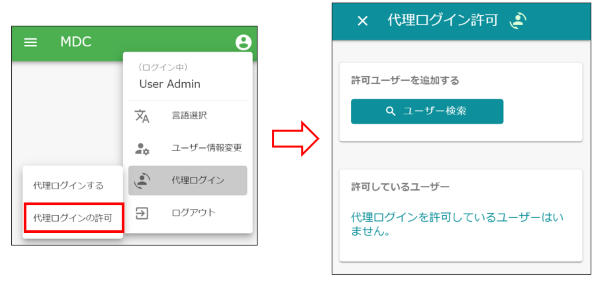

===== 2段階認証
2段階認証の情報を表示します。Navigation定義に <<twostepverification, TwoStep Verification>> が設定されているか、ログインしているユーザーの認証ポリシーに1つ以上の2段階認証方式が設定されている場合に表示されます。認証ポリシーにおける2段階認証の詳細については、<<../../authentication/index.adoc#ref_two_step, 2段階認証>>を参照してください。

初期状態では、ログインしているユーザーの認証ポリシーに紐づく2段階認証の情報が表示されます。 +
Navigation定義で <<twostepverification, TwoStep Verification>> が設定されている場合には、 <<twostepverification, TwoStep Verification>> で `2段階認証が設定された認証ポリシー` として指定した認証ポリシーに紐づく2段階認証の情報が表示されます。また、2段階認証設定の有効化/無効化（認証ポリシーの切り替え）が利用できるようになります。

2段階認証画面上の有効/無効スイッチを押下すると、Navigation定義の `TwoStep Verification` で設定されている、 `2段階認証が設定された認証ポリシー（有効の場合）` / `2段階認証が設定されていない認証ポリシー（無効の場合）` にユーザーの認証ポリシーを切り替えることができます。

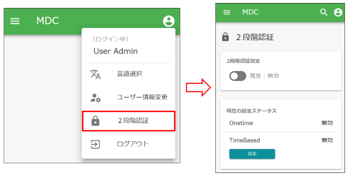

====== 2段階認証（時間ベース）
2段階認証（時間ベース）のポリシーが設定されている場合、2段階認証（時間ベース）を設定することができます。

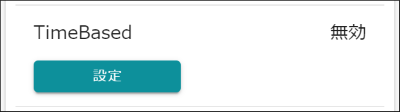

設定ボタンを押下すると、2段階認証（時間ベース）設定画面が表示されます。

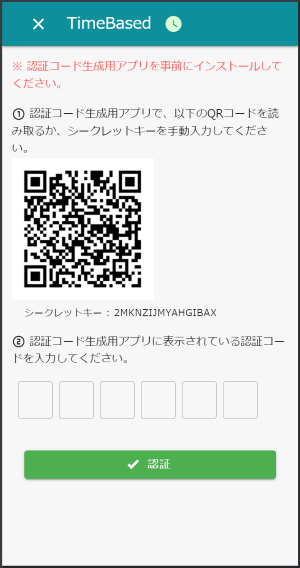

2段階認証（時間ベース）が設定されている場合は、解除ボタンが表示されます。

===== ログアウト
現在ログイン中のユーザーをログアウトします。
ログアウト後はログイン画面が表示されます。

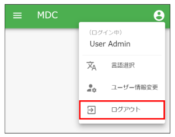

[[topview_fulltextsearch]]
==== 全文検索
全文検索機能が利用可能な場合、ユーザーメニューの左側に全文検索用アイコンが表示されます。アイコンをクリックすると全文検索ダイアログが表示されます。 +
全文検索の対象とするエンティティと検索キーワードを入力し、検索ボタンを押すと、全文検索結果が表示されます。

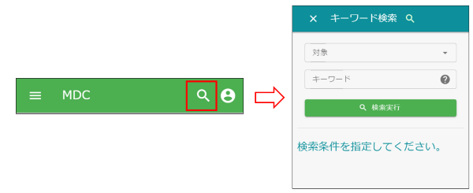

[[sidemenu]]
=== サイドメニュー
Top画面やEntityView、Action等と紐づくアイテムを一覧表示するメニューです。

==== iPLAssについて
アプリケーションのライセンス条項を表示します。
iPLAssが利用するライブラリに関するライセンスも併せて表示します。

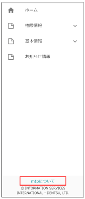
